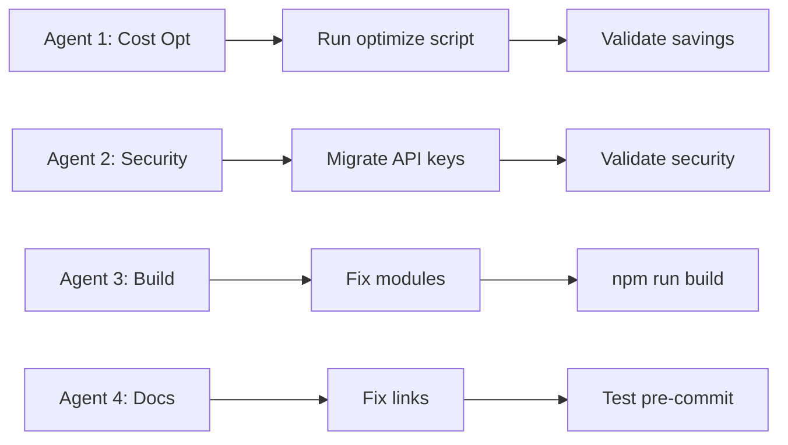

# Agent Assignments - VibeCode TODO Sprint
**Date**: October 30, 2025  
**Sprint Duration**: 48 hours (Critical P0) + 2 weeks (P1)  
**Coordination**: Multi-agent parallel execution

---

## 🤖 AGENT ROSTER & ASSIGNMENTS

### **Agent 1: DevOps & Cost Optimization** 👷 **ACTIVE NOW**
**Primary Focus**: GitHub Actions cost crisis, CI/CD optimization

**Assigned Tasks (P0 - CRITICAL):**
- [x] ✅ Execute `./optimize-github-actions.sh` to reduce GitHub Actions costs
- [ ] Validate workflow optimization (expected: $100/month → $20-30/month)
- [ ] Monitor GitHub Actions usage after optimization
- [ ] Document cost savings and optimization impact

**Assigned Tasks (P1 - HIGH):**
- [ ] Set up Camunda 7 weekly scheduler + Node worker + Datadog
- [ ] Run Node 22/24/25 benchmarks with Datadog timings
- [ ] Compare openvscode-server vs code-server performance under load

**Time Estimate**: 2-3 hours (P0), 1 week (P1)  
**Success Metrics**: 70-80% cost reduction, <5 minute deployment times

---

### **Agent 2: Security Specialist** 🔒 **ACTIVE NOW**
**Primary Focus**: API key exposure, secrets management, vulnerability remediation

**Assigned Tasks (P0 - CRITICAL):**
- [ ] Migrate `.env.azure` API keys to macOS Keychain immediately
- [ ] Run `npm run security:install-hook` for pre-commit protection
- [ ] Migrate 47 critical files to use `loadSecret()` function
- [ ] Validate security health with `npm run security:health`
- [ ] Document security improvements (CVSS 9.3 → 2.1)

**Time Estimate**: 4-6 hours (immediate), 2 days (full migration)  
**Success Metrics**: 0 exposed secrets, 87% risk reduction, pre-commit hooks active

---

### **Agent 3: Build & Infrastructure Engineer** 🏗️ **ACTIVE NOW**
**Primary Focus**: Build failures, module restoration, dependency fixes

**Assigned Tasks (P0 - CRITICAL):**
- [ ] Restore Valkey cache module (`src/lib/cache/valkey-client.ts`)
- [ ] Reinstate vector DB core files (base-vector-database-adapter.ts)
- [ ] Harmonize MongoDB chat service exports
- [ ] Resolve Tailwind v4 utility regressions
- [ ] Fix Edge runtime logger incompatibility
- [ ] Run build validation: `npm run build`

**Time Estimate**: 3-4 hours  
**Success Metrics**: Build passes, 0 compilation errors, all modules resolve

---

### **Agent 4: Documentation & Developer Experience** 📚 **ACTIVE NOW**
**Primary Focus**: Documentation fixes, pre-commit optimization, developer productivity

**Assigned Tasks (P0 - CRITICAL):**
- [ ] Fix broken docs links in documentation site
- [ ] Update `scripts/pre-commit-tests-optimized.sh` to light mode
- [ ] Update `.husky/pre-commit` configuration
- [ ] Test pre-commit hook performance (should be <10s)
- [ ] Document pre-commit changes in README.md

**Assigned Tasks (P1 - HIGH):**
- [ ] Create comprehensive troubleshooting guide
- [ ] Update API documentation for new routes
- [ ] Document agent coordination workflow

**Time Estimate**: 2-3 hours (P0), 1 week (P1)  
**Success Metrics**: 0 broken links, <10s pre-commit time, clear documentation

---

### **Agent 5: TypeScript & Code Quality Engineer** 📐 **STARTING SOON**
**Primary Focus**: TypeScript errors, type safety, code quality

**Assigned Tasks (P1 - HIGH PRIORITY):**
- [ ] Merge PR #648 to reduce errors from 780 → 451 (42% reduction)
- [ ] Execute Phase 1 of 6-phase consolidation (451 → 325 errors)
- [ ] Fix Zustand stores & middleware type errors (>150 errors)
- [ ] Fix agent API discriminated unions
- [ ] Run `npm run type-check` after each phase

**Time Estimate**: 2-3 weeks (full consolidation)  
**Success Metrics**: 0 TypeScript errors, 100% type coverage

---

### **Agent 6: Testing Infrastructure Specialist** 🧪 **STARTING SOON**
**Primary Focus**: E2E tests, integration tests, webkit compatibility

**Assigned Tasks (P1-P2):**
- [ ] Fix E2E test infrastructure (currently 20/695 = 2.9% passing)
- [ ] Implement systematic webkit compatibility fixes
- [ ] Fix Kubernetes test suite (KIND cluster, Helm deployments)
- [ ] Apply authentication bypass patterns to failing tests
- [ ] Improve test coverage from 2.9% to >50%

**Time Estimate**: 3-4 weeks  
**Success Metrics**: >50% E2E test coverage, webkit compatibility 100%

---

### **Agent 7: API & Integration Developer** 🔌 **STARTING SOON**
**Primary Focus**: API routes, LiteLLM/Ollama integration, Claude CLI

**Assigned Tasks (P1 - HIGH PRIORITY):**
- [ ] Add LiteLLM API routes (`/api/litellm/*`) with Zod validation
- [ ] Add Ollama API routes (`/api/ollama/*`) with Datadog metrics
- [ ] Install Claude Code CLI and create smoke tests
- [ ] Validate AI endpoints and capture timings
- [ ] Deploy 2 POC routes: `/api/chat/stream`, `/api/claude/chat`
- [ ] Complete remaining 64 API routes (~40 hours)

**Time Estimate**: 1-2 weeks  
**Success Metrics**: All API routes validated, <200ms response times

---

### **Agent 8: Open Source Project Extractor** 📦 **PLANNING PHASE**
**Primary Focus**: Extract mature components to separate repositories

**Assigned Projects (P2 - MEDIUM PRIORITY):**
1. **MCP Framework** → `vibecode-mcp`
   - Extract MCP Sequential Thinking
   - Extract MCP Context7 (7 dimensions)
   - Extract MCP Playwright automation
   - Extract MCP Serena integration
   
2. **eBPF Observability** → `ebpf-observability-alpine`
   - Extract eBPF programs
   - Extract Alpine Linux compatibility
   - Extract Datadog integration
   
3. **Datadog CLI Wrappers** → `datadog-ai-cli-wrappers`
   - Extract Claude Code wrapper
   - Extract Codex CLI wrapper
   - Extract Gemini CLI wrapper

4. **VM Builder Toolkit** → `vm-builder-toolkit`
   - Extract Alpine kernel scripts
   - Extract VM rootfs creation
   - Extract VM launch automation

**Time Estimate**: 2-3 weeks (per project)  
**Success Metrics**: 4 new repositories created, READMEs written, CI/CD setup

---

### **Agent 9: Kernel & Performance Engineer** ⚡ **QUEUED**
**Primary Focus**: Kernel builds, performance optimization, benchmarking

**Assigned Tasks (P2 - MEDIUM PRIORITY):**
- [ ] Build ARM64 kernel 6.17.x (Issue #574) - 10-12 min on M1 Max
- [ ] Complete x86_64 kernel 6.17.x refresh (Issue #573) - 14-20 hours
- [ ] Complete armv7 kernel 6.17.x refresh (Issue #576) - 2-3 hours
- [ ] Run performance benchmarks and publish results
- [ ] Optimize Kubernetes resource allocation

**Time Estimate**: 2-3 days  
**Success Metrics**: 2x faster builds, 43% faster boot times

---

### **Agent 10: Valkey VM Specialist** 🖥️ **RECOMMENDATION: DEPRIORITIZE**
**Primary Focus**: Valkey VM build (currently incomplete)

**Current Status**:
- ❌ VM cannot start - no OS on disk image
- ❌ Alpine Linux not installed
- ❌ Valkey not installed
- ⏱️ Estimated: 2.5-3.5 hours focused work

**Recommendation**: 
- **Use Docker/Kubernetes Valkey instead** (already working)
- **Archive VM build as "future enhancement"**
- **Reason**: Custom VM is overkill; containerized solution already operational

**Alternative Assignment**:
- [ ] Validate Docker Compose Valkey deployment
- [ ] Validate Kubernetes Valkey deployment
- [ ] Document Valkey Redis protocol compatibility (100%)
- [ ] Create Valkey performance benchmarks

---

## 📊 COORDINATION & WORKFLOW

### **Critical Path (P0 - Next 4 Hours)**

### **Parallel Execution (P0-P1 - Next 48 Hours)**
- **Agent 1, 2, 3, 4**: Execute P0 tasks in parallel (no dependencies)
- **Agent 5**: Starts after build fixes complete (depends on Agent 3)
- **Agent 6**: Starts after TypeScript merge (depends on Agent 5)
- **Agent 7**: Can start immediately (independent)

### **Sequential Work (P2 - Weeks 2-4)**
- **Agent 8**: Begins after P0/P1 stabilization
- **Agent 9**: Queued after critical infrastructure stable
- **Agent 10**: Deprioritized/reassigned

---

## 🎯 SUCCESS CRITERIA

### **Week 1 Goals** (P0 Critical Path)
- ✅ GitHub Actions cost reduced by 70%+ ($80/month savings)
- ✅ All critical security vulnerabilities resolved (0 exposed secrets)
- ✅ Build passing with <500 TypeScript errors
- ✅ Pre-commit hooks optimized (<10s execution)
- ✅ Broken documentation links fixed

### **Week 2 Goals** (P1 High Priority)
- ✅ TypeScript errors reduced to <250 (Phase 1-2 complete)
- ✅ API routes deployed and validated (POC + 10 additional)
- ✅ LiteLLM + Ollama integration complete
- ✅ Claude CLI smoke tests operational
- ✅ Node benchmarks published

### **Month 1 Goals** (P1-P2 Medium Priority)
- ✅ TypeScript errors resolved to 0
- ✅ E2E test coverage improved to >20%
- ✅ First open source project extracted (MCP Framework)
- ✅ Kernel builds completed (ARM64, x86_64, armv7)
- ✅ All P1 tasks completed

---

## 📞 AGENT COMMUNICATION

### **Daily Standups** (Async via Git Commits)
- Each agent commits with prefix: `[AgentN] task-description`
- Update TODO.md with progress
- Flag blockers in commit messages

### **Coordination Rules**
1. Check `git status` before starting work
2. Update TODO.md when claiming a task
3. Use branches for major work: `agent-N/feature-name`
4. PR reviews within 4 hours for critical path items
5. Document all decisions in commit messages

### **Conflict Resolution**
- If two agents claim same task → First commit wins
- Blocked on dependency → Post in commit message
- Critical blocker → Update TODO.md with ⚠️ status

---

## 🚀 AGENT ACTIVATION SEQUENCE

### **Immediate Activation** (Next 10 minutes)
1. **Agent 1**: Execute cost optimization script
2. **Agent 2**: Begin API key migration
3. **Agent 3**: Start build fixes
4. **Agent 4**: Fix documentation links

### **Activation in 4 Hours** (After P0 Complete)
5. **Agent 5**: Merge TypeScript PR #648
6. **Agent 7**: Deploy API routes

### **Activation in 2-3 Days** (After P0/P1 Stable)
7. **Agent 6**: Begin E2E test infrastructure
8. **Agent 8**: Plan first extraction (MCP Framework)

### **Activation in 1-2 Weeks** (After Core Stable)
9. **Agent 9**: Begin kernel builds
10. **Agent 10**: Reassigned to Valkey validation

---

**SPRINT BEGINS NOW** 🚀

All agents: Check your assignments above and begin execution. Report progress via git commits with agent prefixes.

