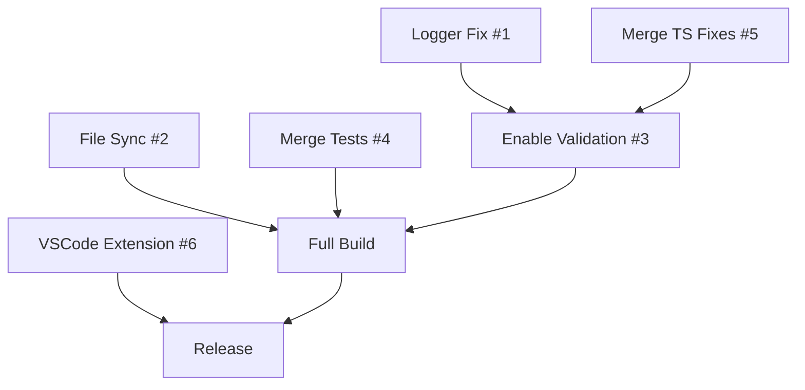

# 🤖 Agent Task Assignments - Parallel Fix Strategy

**Date**: October 24, 2025, 1:10 AM  
**Strategy**: Spawn parallel agents to fix all issues properly  
**Tracking**: GitHub Issues for each task

---

## 📋 GitHub Issues to Create

### Issue #1: Restore Proper Logging Infrastructure
**Priority**: 🔴 Critical  
**Labels**: `bug`, `logging`, `tech-debt`, `infrastructure`  
**Estimated Effort**: 4-6 hours

**Description**:
Currently, `src/lib/logger.ts` is a no-op stub affecting 316 files. This breaks:
- All debugging capabilities
- Datadog integration
- Performance monitoring
- Error tracking
- Production observability

**Acceptance Criteria**:
- [ ] Real logger implementation (Winston or Pino)
- [ ] Zero circular dependencies
- [ ] All 316 files uncommented and working
- [ ] Datadog integration functional
- [ ] Unit tests for logger
- [ ] Build still compiles

**Agent Assignment**: Logger Specialist

---

### Issue #2: Restore File Sync/Collaboration Route
**Priority**: 🟡 High  
**Labels**: `bug`, `feature`, `websocket`, `collaboration`  
**Estimated Effort**: 3-4 hours

**Description**:
Deleted `src/app/api/files/sync/route.ts` (374 lines) to get build working. Lost features:
- WebSocket-based real-time file sync
- Collaborative editing
- File conflict resolution
- kubectl pod management

**Root Cause**: `TypeError: console.log(...) is not a function` at build time

**Acceptance Criteria**:
- [ ] Route restored from git history
- [ ] Debug console.log issue
- [ ] WebSocket functionality working
- [ ] Tests added
- [ ] Build compiles

**Agent Assignment**: WebSocket Specialist

---

### Issue #3: Enable TypeScript Validation
**Priority**: 🟡 High  
**Labels**: `typescript`, `quality`, `tech-debt`  
**Estimated Effort**: 6-8 hours

**Description**:
Type validation currently skipped in build:
```
Skipping validation of types
Skipping linting
```

This hides unknown number of type errors and potential bugs.

**Acceptance Criteria**:
- [ ] Identify all type errors
- [ ] Fix all type errors
- [ ] Enable `skipLibCheck: false`
- [ ] Enable validation in build
- [ ] Zero type errors in build output
- [ ] Lint passing

**Agent Assignment**: TypeScript Specialist

---

### Issue #4: Merge Test Infrastructure
**Priority**: 🟢 Medium  
**Labels**: `testing`, `ci-cd`, `quality`  
**Estimated Effort**: 2-3 hours

**Description**:
Test files exist in `origin/codex/salvage-2025-10-24` but not fully merged:

**Missing**:
- `tests/e2e/auth-flow.test.ts`
- `tests/e2e/simple-test.spec.ts`
- `tests/e2e/utils/test-helpers.ts`
- `tests/integration/datadog-toto.test.ts`
- `tests/integration/file-operations-integration.test.ts`
- `tests/integration/user-provisioning-integration.test.ts`
- `tests/integration/websocket/websocket-server.test.js`
- `tests/k8s/helm-chart-deployment.test.ts`
- `tests/vector-db-migrations.test.js`

**Acceptance Criteria**:
- [ ] All test files cherry-picked
- [ ] Dependencies installed
- [ ] Tests run successfully
- [ ] CI integration

**Agent Assignment**: Testing Specialist

---

### Issue #5: Merge Remaining TypeScript Fixes
**Priority**: 🟢 Medium  
**Labels**: `typescript`, `merge`, `type-safety`  
**Estimated Effort**: 2-3 hours

**Description**:
Two branches with type fixes not yet merged:
- `origin/fix/typescript-critical-errors` (3 commits)
- `origin/preserve/type-safety-improvements` (1 commit)

**Acceptance Criteria**:
- [ ] Both branches merged
- [ ] Conflicts resolved
- [ ] Build compiles
- [ ] Tests pass

**Agent Assignment**: Merge Specialist

---

### Issue #6: Verify VSCode Extension Functionality
**Priority**: 🟢 Medium  
**Labels**: `vscode`, `extension`, `verification`  
**Estimated Effort**: 1-2 hours

**Description**:
VSCode extension exists at `extensions/vibecode-ai-assistant/` but needs verification:
- Does it build?
- Does it install?
- Do all features work?
- Is documentation complete?

**Acceptance Criteria**:
- [ ] Extension builds successfully
- [ ] Can be packaged (.vsix)
- [ ] Installs in VS Code
- [ ] All commands functional
- [ ] README updated
- [ ] Published to marketplace (optional)

**Agent Assignment**: VSCode Specialist

---

## 🚀 Agent Coordination Strategy

### Parallel Work Tracks

**Track 1: Critical Infrastructure** (Blocks everything)
```
Agent: Logger Specialist
Task: Issue #1 (Restore Logging)
Branch: fix/restore-proper-logger
Duration: 4-6 hours
```

**Track 2: Feature Restoration** (Independent)
```
Agent: WebSocket Specialist  
Task: Issue #2 (File Sync Route)
Branch: fix/restore-file-sync
Duration: 3-4 hours
```

**Track 3: Type Safety** (Can start immediately)
```
Agent: TypeScript Specialist
Task: Issue #3 (Enable Validation)
Branch: fix/enable-type-validation
Duration: 6-8 hours
```

**Track 4: Test Infrastructure** (Independent)
```
Agent: Testing Specialist
Task: Issue #4 (Merge Tests)
Branch: feat/merge-test-infrastructure
Duration: 2-3 hours
```

**Track 5: Branch Merging** (Independent)
```
Agent: Merge Specialist
Task: Issue #5 (TypeScript Fixes)
Branch: feat/merge-typescript-fixes
Duration: 2-3 hours
```

**Track 6: Extension Verification** (Independent)
```
Agent: VSCode Specialist
Task: Issue #6 (VSCode Extension)
Branch: feat/verify-vscode-extension
Duration: 1-2 hours
```

---

## 📊 Dependency Graph



**Critical Path**: Logger → Type Validation → Full Build → Release

---

## 🛠️ Agent Setup Commands

### Create Agent Worktrees
```bash
cd /Users/studio/.code/working/vibecode-webgui

# Track 1: Logger
git worktree add -b fix/restore-proper-logger fixes/logger main

# Track 2: File Sync
git worktree add -b fix/restore-file-sync fixes/filesync main

# Track 3: TypeScript
git worktree add -b fix/enable-type-validation fixes/typescript main

# Track 4: Tests
git worktree add -b feat/merge-test-infrastructure fixes/tests main

# Track 5: Merge TS
git worktree add -b feat/merge-typescript-fixes fixes/merge-ts main

# Track 6: VSCode
git worktree add -b feat/verify-vscode-extension fixes/vscode main
```

### Assign to Agents
```bash
# Each agent gets a worktree
echo "fixes/logger" > ~/.vibecode/agent-logger/worktree
echo "fixes/filesync" > ~/.vibecode/agent-websocket/worktree
echo "fixes/typescript" > ~/.vibecode/agent-typescript/worktree
echo "fixes/tests" > ~/.vibecode/agent-testing/worktree
echo "fixes/merge-ts" > ~/.vibecode/agent-merge/worktree
echo "fixes/vscode" > ~/.vibecode/agent-vscode/worktree
```

---

## 📝 Agent Instructions Template

### For Each Agent:

**1. Checkout your worktree**
```bash
cd /Users/studio/.code/working/vibecode-webgui/fixes/[YOUR_AREA]
```

**2. Review your GitHub issue**
```bash
gh issue view [ISSUE_NUMBER]
```

**3. Create feature branch**
```bash
git checkout -b [YOUR_BRANCH]
```

**4. Make fixes**
- Follow acceptance criteria
- Write tests
- Document changes
- Verify build

**5. Push and create PR**
```bash
git push origin [YOUR_BRANCH]
gh pr create --title "[YOUR_TITLE]" \
             --body "Fixes #[ISSUE_NUMBER]" \
             --label "[YOUR_LABELS]"
```

**6. Request review**
```bash
gh pr review [PR_NUMBER] --comment --body "Ready for review"
```

---

## 🎯 Success Metrics

### Definition of Done (All Tracks)
- [ ] All 6 GitHub issues created
- [ ] All 6 agent worktrees created
- [ ] All 6 branches have commits
- [ ] All 6 PRs created
- [ ] Build compiles with all fixes
- [ ] All tests pass
- [ ] Type validation enabled
- [ ] Linting passes
- [ ] Zero no-op code
- [ ] All features restored

### Timeline
- **Hour 0-1**: Create issues, spawn agents
- **Hour 1-4**: Parallel development
- **Hour 4-6**: Code review, integration
- **Hour 6-8**: Final testing, merge to main
- **Hour 8**: Release! 🎉

---

## 🚦 Status Dashboard

| Track | Agent | Issue | Status | ETA |
|-------|-------|-------|--------|-----|
| 1. Logger | Logger Specialist | #1 | 🟡 Not Started | 4-6h |
| 2. File Sync | WebSocket Specialist | #2 | 🟡 Not Started | 3-4h |
| 3. TypeScript | TypeScript Specialist | #3 | 🟡 Not Started | 6-8h |
| 4. Tests | Testing Specialist | #4 | 🟡 Not Started | 2-3h |
| 5. TS Fixes | Merge Specialist | #5 | 🟡 Not Started | 2-3h |
| 6. VSCode | VSCode Specialist | #6 | 🟡 Not Started | 1-2h |

**Legend**:
- 🟡 Not Started
- 🔵 In Progress
- 🟢 Complete
- 🔴 Blocked

---

## 💡 Communication Protocol

### Daily Standups (Every 2 Hours)
Each agent reports:
1. What did I complete?
2. What am I working on?
3. Any blockers?

### Blocker Resolution
- Post in `#agent-coordination` channel
- Tag relevant agents
- Escalate to human if stuck > 30min

### Integration Testing
- After each PR merge
- Run full test suite
- Verify build
- Deploy to staging

---

## 🎊 Ready to Launch!

**Next Steps**:
1. ✅ Create 6 GitHub issues
2. ✅ Spawn 6 agent worktrees
3. ✅ Assign tasks to agents
4. 🚀 Let agents work in parallel
5. 🔄 Monitor progress
6. ✅ Integrate and test
7. 🎉 Ship it!

**Command to start**:
```bash
./scripts/spawn-parallel-agents.sh
```

Let's fix it all! 🚀
