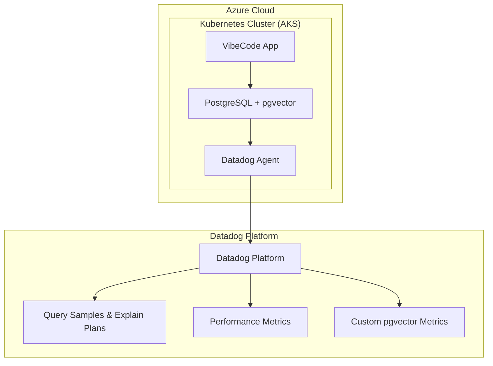

# VibeCode Platform: Gemini Agent Context

This document provides the Gemini agent with a comprehensive overview of the VibeCode platform, including its architecture, current status, and key operational details. It is synthesized from `README.md`, `TODO.md`, and historical `claude-prompt.md` files.

## 1. Project Overview & Vision

VibeCode is an intelligent, Kubernetes-native development platform designed to accelerate software delivery. It integrates multiple AI providers, offers a live VS Code experience in the cloud, and ensures enterprise-grade security and observability.

**Mission**: To empower developers with an intelligent, collaborative, and secure platform that automates boilerplate, streamlines workflows, and fosters innovation.

**Key Differentiators & Features**:
- **Comprehensive Template System**: 20+ production-ready templates (AI/ML, SaaS, etc.).
- **Multi-Model AI Orchestration**: Intelligent routing across providers like OpenAI, Anthropic, Google, and Mistral.
- **Cloud Deployment Automation**: One-click deployment to Vercel, Netlify, AWS, and Railway.
- **GitHub Integration**: Direct repository creation with automated CI/CD workflows.
- **Live VS Code Experience**: Real-time collaborative cloud IDE.
- **pgvector on PostgreSQL**: Powers semantic search and vector caching, monitored by Datadog DBM.
- **Enterprise-Grade**: Focus on security (WCAG 2.1 AA), performance, and observability.

## 2. Current Status & Critical Issues

### 🚨 **CRITICAL INFRASTRUCTURE FAILURE** (2025-09-19 20:36 UTC)

**Disaster Status**: The production AKS cluster and its resource group have been **COMPLETELY DESTROYED**.

- **Root Cause**: Resource group `rg-vibecode-aks-prod` not found. The AKS cluster `vibecode-prod-aks-84859296` is deleted or inaccessible.
- **Impact**:
    - **Production Environment**: **100% DOWN**.
    - **All Services**: UNAVAILABLE.
    - **External IPs**: Unresponsive.
- **Current Mission**: **EMERGENCY DISASTER RECOVERY**. Agent #19 is leading the effort to assess damage and restore the infrastructure.

### Active Coordination (8-Agent Team)

A team of 8 agents is actively working on disaster recovery and related tasks. The `TODO.md` file serves as the central coordination board.

**Immediate Priorities**:
1.  **Agent #19 (DR Specialist)**: Assess damage and create a recovery plan.
2.  **Agent #1 (Platform Lead)**: Restore `kubectl`/`helm` access by re-authenticating with Azure and refreshing the AKS kubeconfig. This is the primary blocker for other agents.
3.  **Other Agents (#2-#8)**: Staged to perform their roles (app deployment, monitoring, DB validation, etc.) once infrastructure access is restored. A local KIND cluster with full Datadog observability is being used as a temporary workaround.

## 3. System Architecture

- **Frontend**: Next.js with TypeScript and Radix UI.
- **Backend**: Node.js with Express, managing APIs for AI, workspaces, and auth.
- **AI Gateway**: An intelligent router for selecting the best AI provider based on the task.
- **Database**: **PostgreSQL with the `pgvector` extension** for semantic search, RAG, and caching.
- **Infrastructure**: **Kubernetes** (Azure AKS for production, KIND for local dev). Deployments are managed via **Helm**. Infrastructure is defined with **OpenTofu**.
- **Monitoring**: **Datadog** for full-stack observability (RUM, APM, Logs, Synthetics, and **Database Monitoring (DBM)**).
- **Code-Server Integration**: Dynamically provisions VS Code workspaces on the Kubernetes cluster.
- **Caching**: **Valkey** (Redis-compatible) is used for caching, including a specialized vector cache for pgVector similarity searches.

## 4. Key Technologies & Standards

- **Languages**: TypeScript, SQL (PostgreSQL/pgvector)
- **Frameworks**: Next.js, Node.js/Express, React
- **Database**: PostgreSQL with pgvector, Prisma (ORM), MongoDB (for chat history)
- **Infrastructure**: Kubernetes, Docker, Helm, OpenTofu, Azure AKS
- **Monitoring**: Datadog, OpenTelemetry
- **Caching**: Valkey (formerly Redis)
- **AI Providers**: OpenRouter, Hugging Face, OpenAI, Anthropic, Google, Mistral

**Important**: Always use **OpenTofu** for infrastructure as code and **Valkey** for caching. Do not introduce alternatives without explicit approval.

### Datadog Standards

- **Tagging**: All metrics, logs, and traces are tagged with `env`, `service`, `version`, `team`, and `component`.
- **Metric Naming**: `vibecode.{component}.{metric_name}` (e.g., `vibecode.api.response_time`).
- **Log Levels**: `ERROR`, `WARN`, `INFO`, `DEBUG`.

**Datadog Integration Mandate**: To showcase end-to-end monitoring, prioritize using as many Datadog features and integrations as possible. This includes, but is not limited to:
- **OpenTelemetry (OTel) Collector**: Use the `dd-otel-collector` for unified data ingestion.
- **Vector Database Monitoring**: Deeply integrate with Datadog's vector monitoring capabilities for pgvector.
- **Cloudcraft**: Visualize the Azure architecture and its real-time status using Cloudcraft.

## 5. Licensing and Commercial Software

- **Commercial Software**: For the DBM pgvector demo, the only approved commercial software are **Datadog** (provided for free for this training exercise) and **Microsoft Azure**. No other paid software or services should be integrated at this time.
- **Open Source Licensing**: All open-source dependencies must be compliant with **BSD, Apache, or MIT licenses** or other compatible permissive licenses. Any dependency with a restrictive license (e.g., GPL, AGPL) must be explicitly approved before use. The repository has been audited to remove non-compliant licenses like those from Upstash.

## 6. Security

**CRITICAL: DO NOT LEAK API KEYS.** Never commit API keys, secrets, or other sensitive credentials to version control. Do not write them to files that are not in `.gitignore`. Always use environment variables or a secure secret management system to handle sensitive data. Leaking credentials is a critical security vulnerability and must be avoided at all costs.

## 7. Agent Operational Guidelines

- **Primary Goal**: Assist with the disaster recovery effort as directed by the coordination plan in `TODO.md`.
- **Initial Blocker**: Do not attempt to deploy or modify resources on AKS until Agent #1 confirms access is restored.
- **Use Local KIND Cluster**: For development and testing, leverage the local KIND cluster (`kind-vibecode-local`) which has a fully functional Datadog and application stack.
- **Reference Files**:
    - `TODO.md`: For the latest active tasks and agent coordination.
    - `README.md`: For deployment commands and general project info.
    - `GEMINI.md` (this file): For a synthesized, high-level context.
    - `docs/` & `archive/`: For historical context and detailed runbooks.
