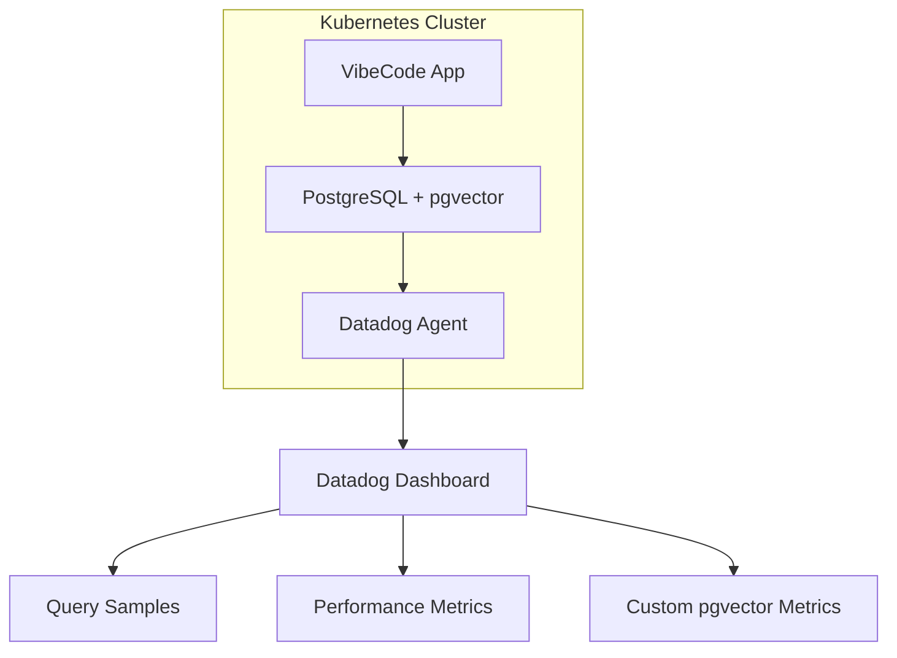

<div align="center">

# 🐘 VibeCode Platform

**pgvector on PostgreSQL + Kubernetes + Datadog Database Monitoring**

[](./DEMO.sh)
[](https://kubernetes.io/)
[](https://github.com/pgvector/pgvector)
[](https://www.datadoghq.com/)

</div>

## 🚀 **One-Click Demo**

```bash
./DEMO.sh
```

**See pgvector + PostgreSQL + Datadog DBM in action in 30 seconds.**

---

## ✨ **What This Demonstrates**

<table>
<tr>
<td width="50%">

### 🎯 **Core Demo**
- **pgvector** for semantic search
- **PostgreSQL** on Kubernetes  
- **Datadog Database Monitoring**
- **Real-time vector metrics**
- **Query performance analysis**

</td>
<td width="50%">

### 📊 **What You'll See**
- 120 documents with embeddings
- Vector similarity searches
- Custom Datadog metrics
- Query samples & explain plans
- Performance dashboards

</td>
</tr>
</table>

---

## 🎮 **Quick Start Options**

| Method | Command | Description |
|--------|---------|-------------|
| **🚀 Interactive Demo** | `./DEMO.sh` | Full TUI experience |
| **⚡ Direct Setup** | `make setup` | Setup pgvector + DBM |
| **🎯 Generate Activity** | `make vector` | Create vector data |
| **📊 View Dashboard** | `make dashboard` | Open Datadog |

---

## 🏗️ **Architecture**


```mermaid
graph TB
    subgraph "Kubernetes Cluster"
        A[VibeCode App] --> B[PostgreSQL + pgvector]
        B --> C[Datadog Agent]
    end
    C --> D[Datadog Dashboard]
    D --> E[Query Samples]
    D --> F[Performance Metrics]
    D --> G[Custom pgvector Metrics]
```

---

## 📈 **Monitoring Capabilities**

<details>
<summary><b>🔍 Click to see what gets monitored</b></summary>

### Vector-Specific Metrics
- `postgresql.pgvector.vector_count` - Total embeddings stored
- `postgresql.pgvector.table_size` - Storage utilization  
- `postgresql.pgvector.index.*` - IVFFLAT index performance

### Database Performance
- Query execution times and explain plans
- Index usage and efficiency
- Connection pool monitoring
- Lock contention analysis

### Custom Queries Tracked
```sql
-- Vector similarity search
SELECT embedding <=> '[0.1,0.2,0.3]'::vector FROM documents;

-- Hybrid search (vector + text)
SELECT * FROM documents WHERE content @@ 'query' 
ORDER BY embedding <=> '[...]'::vector;
```

</details>

---

## 🎯 **Perfect For**

- **Database Teams**: Monitoring pgvector in production
- **ML Engineers**: Vector database performance optimization  
- **DevOps**: Kubernetes + PostgreSQL + monitoring stack
- **Datadog Users**: Custom DBM metrics and dashboards

---

## 🔧 **Requirements**

- Kubernetes cluster (Docker Desktop, KIND, minikube)
- `kubectl` configured
- Optional: Datadog API key for full monitoring

---

## 📋 **What Happens in the Demo**

1. **🔍 Verification**: Checks PostgreSQL + pgvector setup
2. **⚙️ Configuration**: Sets up Datadog DBM monitoring
3. **🎯 Data Generation**: Creates 120 sample documents with embeddings
4. **🔄 Activity Simulation**: Runs vector similarity searches
5. **📊 Monitoring**: Shows real metrics in Datadog dashboard

---

<div align="center">

**🚀 Ready to see pgvector monitoring in action?**

### [`./DEMO.sh`](./DEMO.sh)

*Supports both interactive TUI and simple menu modes*

---

<sub>Built with ❤️ for the Datadog + PostgreSQL + Kubernetes community</sub>

</div>