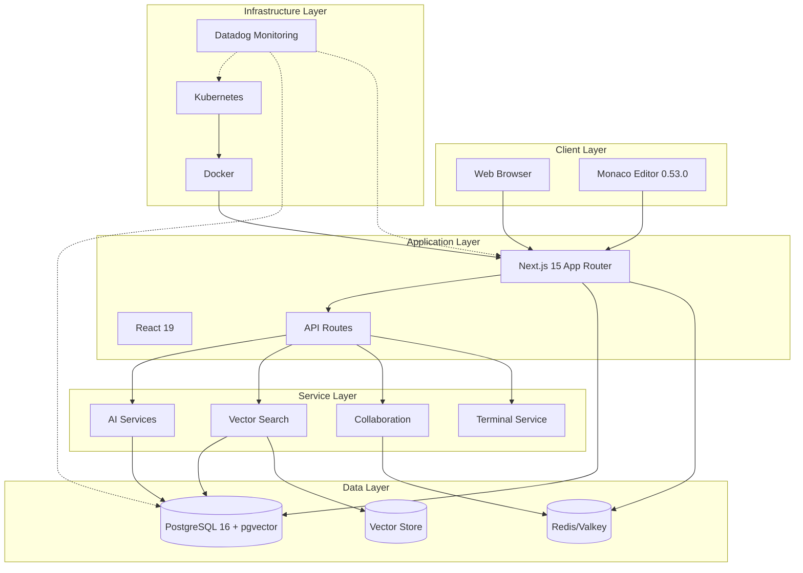

# VibeCode Studio (v5.1.0-beta)

> **🚨 Emergency Release (Feb 2026)** - The "Ruthless" Edition

<div align="center">

[](https://github.com/yourusername/vibecode/releases)
[](LICENSE)
[](https://nodejs.org/)
[](https://www.npmjs.com/)
[](https://www.typescriptlang.org/)

[](https://nextjs.org/)
[](https://reactjs.org/)
[](https://microsoft.github.io/monaco-editor/)
[](https://tauri.app/)
[](https://www.postgresql.org/)

[](docs/AI_MODELS.md)
[](https://kubernetes.io/)
[](https://www.docker.com/)
[](https://opensource.org/)
[](CONTRIBUTING.md)

</div>

---

## 📋 Table of Contents

- [🎯 What is VibeCode?](#-what-is-vibecode)
  - [Why VibeCode?](#why-vibecode)
  - [vs. Cursor / GitHub Copilot / VS Code](#vs-cursor--github-copilot--vs-code)
  - [Who Should Use VibeCode?](#who-should-use-vibecode)
- [✨ Features](#-features)
- [🏗️ Architecture Overview](#️-architecture-overview)
  - [System Architecture](#system-architecture)
  - [Key Architecture Components](#key-architecture-components)
  - [Detailed Documentation](#detailed-documentation)
- [🖥️ Canonical Desktop Runtime: Tauri](#️-canonical-desktop-runtime-tauri)
  - [Why Tauri?](#why-tauri)
  - [Platform Support](#platform-support)
  - [Getting Started with Tauri](#getting-started-with-tauri)
  - [Quick Launch](#quick-launch)
- [🚀 Quick Start](#-quick-start)
  - [New to VibeCode? Start Here!](#new-to-vibecode-start-here)
  - [1. Install Dependencies](#1-install-dependencies)
  - [2. Launch Backend (Ubuntu VM)](#2-launch-backend-ubuntu-vm)
  - [3. Launch Studio](#3-launch-studio)
- [🛠️ CLI Tool](#️-cli-tool)
- [🖥️ Menubar App](#️-menubar-app)
- [🔄 Ralph Loop](#-ralph-loop)
- [📦 Legacy & Migration](#-legacy--migration)
- [🍎 Native macOS Virtualization](#-native-macos-virtualization)
- [🐳 Docker Option (Lightweight)](#-docker-option-lightweight)
- [GitHub Actions Cost Optimization](#github-actions-cost-optimization)
  - [Main Branch (Lightweight)](#main-branch-lightweight)
  - [Release Branches (Comprehensive)](#release-branches-comprehensive)
  - [Creating Release Branches](#creating-release-branches)
- [🔒 Security Considerations](#-security-considerations)
  - [Environment Isolation](#environment-isolation)
  - [✅ What It Protects Against](#-what-it-protects-against)
  - [❌ What It Does NOT Protect Against](#-what-it-does-not-protect-against)
  - [Attack Vectors](#attack-vectors)
  - [For True Security Isolation](#for-true-security-isolation)
  - [Recommendation](#recommendation)

---

## 🎯 What is VibeCode?

**VibeCode is a next-generation AI-native IDE** that brings the power of 321+ AI models directly into your development workflow. Unlike traditional IDEs with AI bolt-ons, VibeCode is built from the ground up for AI-assisted development, combining the flexibility of VS Code with unprecedented AI model access and semantic code intelligence.

### Why VibeCode?

**For Solo Developers:**
- 🤖 **Access 321+ AI Models** - OpenAI, Anthropic, Gemini, Groq, DeepSeek, and more from one interface
- 🔍 **Semantic Code Search** - Find code by meaning, not just keywords, powered by pgvector
- ✨ **Real-time AI Completion** - Context-aware suggestions powered by Monaco Editor and Monacopilot
- 🏠 **Run Anywhere** - Cloud, self-hosted, or fully offline with local LLMs via Ollama

**For Teams:**
- 👥 **Real-time Collaboration** - WebSocket-based collaborative editing with shared AI context
- 🔒 **Self-Hosted Option** - Full data control with on-premise deployment
- 🎯 **Unified AI Stack** - One platform for all team AI needs, no vendor lock-in
- 📊 **Shared Knowledge** - Team-wide semantic search across all codebases

### vs. Cursor / GitHub Copilot / VS Code

| Feature | VibeCode | Cursor | GitHub Copilot | VS Code |
|---------|----------|--------|----------------|---------|
| **AI Models** | 321+ providers | 4 models | 1 model | Via extensions |
| **Self-Hosted** | ✅ Full control | ❌ Cloud only | ❌ Cloud only | ✅ Local only |
| **Semantic Search** | ✅ Vector DB (pgvector) | ⚠️ Basic | ❌ None | ⚠️ Keyword only |
| **Real-time Collab** | ✅ Built-in | ❌ None | ❌ None | ⚠️ Live Share |
| **Open Source** | ✅ MIT License | ❌ Proprietary | ❌ Proprietary | ✅ MIT License |
| **Local LLMs** | ✅ Ollama integration | ❌ Cloud only | ❌ Cloud only | ⚠️ Manual setup |
| **Multi-Provider** | ✅ OpenRouter + Direct | ⚠️ Limited | ❌ Single | ⚠️ Extension-dependent |
| **Agent Orchestration** | ✅ MCP Support | ⚠️ Limited | ❌ None | ❌ None |

**Key Differentiators:**
- ✅ **Model Choice Freedom** - Not locked to a single AI provider
- ✅ **Privacy First** - Self-host everything or run local LLMs offline
- ✅ **Semantic Intelligence** - Vector search understands code context
- ✅ **Transparent & Open** - MIT licensed with full source access
- ✅ **Enterprise Ready** - Kubernetes deployment, Datadog monitoring, PostgreSQL 16

### Who Should Use VibeCode?

- **🧑‍💻 Developers** seeking AI-powered assistance with flexibility to choose the best model for each task
- **👥 Teams** requiring collaborative development environments with integrated AI capabilities
- **🏢 Organizations** needing self-hosted AI development platforms with full data sovereignty
- **🔓 OSS Contributors** wanting to extend, customize, and understand their IDE architecture
- **🔬 AI Researchers** experimenting with multiple LLMs in real development workflows
- **🛡️ Security-Conscious** users requiring on-premise AI without data leaving their network

## ✨ Features

- **🤖 AI-Powered Development**: Multi-provider AI integration (OpenAI, Anthropic, Gemini, Groq, DeepSeek)
- **🔍 Semantic Code Search**: Vector-based code search using pgvector with HNSW indexes
- **📝 Monaco Editor Integration**: Advanced code editing with AI completion via Monacopilot
- **👥 Real-time Collaboration**: WebSocket-based collaborative editing
- **💻 Terminal Integration**: Web-based terminal with node-pty
- **🎯 Onboarding System**: 7-step guided setup for new users
- **🧩 Extension Marketplace**: 53+ VS Code extensions support
- **🔌 MCP Server**: Model Context Protocol for AI integrations
- **🧪 Offline Testing**: Comprehensive cloud infrastructure testing without cloud resources

## 🏗️ Architecture Overview

VibeCode is an AI-powered development platform built on a modern, cloud-native technology stack. The system provides a web-based IDE with integrated AI assistance, semantic code search, and collaborative development features.

### System Architecture


```mermaid
graph TB
    subgraph "Client Layer"
        Browser[Web Browser]
        Monaco[Monaco Editor 0.53.0]
    end

    subgraph "Application Layer"
        NextJS[Next.js 15 App Router]
        React[React 19]
        API[API Routes]
    end

    subgraph "Service Layer"
        AI[AI Services]
        Vector[Vector Search]
        Collab[Collaboration]
        Terminal[Terminal Service]
    end

    subgraph "Data Layer"
        Postgres[(PostgreSQL 16 + pgvector)]
        Cache[(Redis/Valkey)]
        VectorDB[(Vector Store)]
    end

    subgraph "Infrastructure Layer"
        K8s[Kubernetes]
        Docker[Docker]
        Datadog[Datadog Monitoring]
    end

    Browser --> NextJS
    Monaco --> NextJS
    NextJS --> API
    API --> AI
    API --> Vector
    API --> Collab
    API --> Terminal
    AI --> Postgres
    Vector --> Postgres
    Vector --> VectorDB
    Collab --> Cache
    NextJS --> Postgres
    NextJS --> Cache
    K8s --> Docker
    Docker --> NextJS
    Datadog -.-> K8s
    Datadog -.-> Postgres
    Datadog -.-> NextJS
```

### Key Architecture Components

- **Client Layer**: Monaco Editor 0.53.0 integrated with React 19 for advanced code editing
- **Application Layer**: Next.js 15 with App Router for modern React development
- **Service Layer**: AI services, vector search, collaboration, and terminal integration
- **Data Layer**: PostgreSQL 16 with pgvector for semantic search, Redis/Valkey for caching
- **Infrastructure Layer**: Kubernetes orchestration with Docker containers, Datadog monitoring

### Detailed Documentation

For comprehensive architecture information including:
- Complete technology stack and versions
- Architecture Decision Records (ADRs)
- Core subsystems and integration details
- Security architecture
- Deployment models
- Scalability considerations

**See: [Architecture Documentation](docs/ARCHITECTURE.md)** | **[Architecture Diagrams](docs/ARCHITECTURE_DIAGRAM.md)** | **[Folder Structure](docs/FOLDER_STRUCTURE.md)**

## 🖥️ Canonical Desktop Runtime: Tauri

**Tauri is the official and canonical desktop runtime for VibeCode Studio.** It provides a secure, lightweight, and cross-platform foundation for delivering the VibeCode desktop experience.

### Why Tauri?

- **Cross-Platform Native**: Single codebase for macOS, Windows, and Linux
- **Small Bundle Size**: ~3-5MB base runtime (vs 100MB+ Electron alternatives)
- **Security First**: Rust-based backend with granular security permissions
- **Native Performance**: Direct system API access without overhead
- **Web Standards**: Leverages platform-native WebView (WebKit on macOS/Linux, WebView2 on Windows)
- **Modern Stack Integration**: Seamless integration with Next.js 15 and React 19

### Platform Support

- **macOS**: 10.13 (High Sierra) or later (Intel and Apple Silicon)
- **Windows**: Windows 10 or later (64-bit)
- **Linux**: Ubuntu 20.04+, Fedora 35+, or equivalent

### Getting Started with Tauri

For detailed platform-specific setup instructions including Rust installation, system dependencies, and comprehensive troubleshooting:

**📖 [Tauri Desktop Setup Guide](docs/setup/TAURI_DESKTOP_SETUP.md)**

### Quick Launch

```bash
# Development mode with hot reload
npm run tauri:dev

# Production build
npm run tauri:build
```

## 🚀 Quick Start

> **📖 New to VibeCode?** See the [Environment Setup Guide](docs/ENVIRONMENT_SETUP_GUIDE.md) for detailed configuration instructions.

### New to VibeCode? Start Here!
Get up and running in under 5 minutes:
```bash
npm run quickstart
```
This single command will:
- ✅ Check and install dependencies
- ✅ Set up your development environment
- ✅ Launch all services
- ✅ Open the onboarding wizard
- ✅ Create a sample project for you to explore

📚 **For detailed quickstart flow and troubleshooting**, see [QUICK_START.md](docs/QUICK_START.md)

> **🤝 Want to contribute?** See our [Contributing Guide](CONTRIBUTING.md) for development setup, coding standards, and PR workflows.

### 1. Install Dependencies
```bash
brew install vfkit
pip install -r scripts/requirements.txt
```

### 2. Launch Backend (Ubuntu VM)
You can use the restored CLI tool:
```bash
bin/vibecode-vm start
```
Or run the script directly:
```bash
python3 scripts/launch_ubuntu_vm.py
```

### 3. Launch Studio
```bash
npm run tauri:dev
```

## 🛠️ CLI Tool
Manage the VM environment with the unified CLI:
```bash
bin/vibecode-vm status  # Check health via Ralph Loop
bin/vibecode-vm start   # Launch Ubuntu VM
bin/vibecode-vm stop    # Stop VM
```

## 🖥️ Menubar App
A native macOS status bar app is available to control the environment:
1. **Build:** `cd platforms/macos/VibeCodeMenubar && swift build -c release`
2. **Run:** `.build/release/VibeCodeMenubar`

## 🔄 Ralph Loop
System health is monitored by the Ralph Loop daemon:
```bash
python3 scripts/ralph_loop.py
```

## 📦 Legacy & Migration
- **Gas Town:** Use `python3 scripts/gt_shim.py` for legacy commands.
- **Remote:** Use `scripts/migrate_from_remote.sh` to pull from `mbp-m1`.

---
*Powered by OpenClaw*

## 🍎 Native macOS Virtualization

VibeCode supports **Apple Virtualization Framework** for native macOS VM performance:
- **Native Speed**: Direct hardware virtualization without Docker overhead
- **ASIF Support**: Apple Sparse Image Format on macOS 26+ (2-3x faster I/O)
- **Full VM Control**: Start, stop, suspend, resume operations
- **Linux GUI VMs**: Graphics support with VirtIO GPU

See [Apple Virtualization Framework Documentation](docs/features/APPLE_VIRTUALIZATION_FRAMEWORK.md) for details.

## 🐳 Docker Option (Lightweight)
If you prefer containers over a full VM:
```bash
docker compose up -d
```
This launches the OpenClaw Gateway on port `18789`.

## GitHub Actions Cost Optimization

To control costs, we use a two-tier CI/CD strategy:

### Main Branch (Lightweight)
- Fast linting and basic unit tests only
- ~$0.05 per run

### Release Branches (Comprehensive)
- Full test suite (unit, integration, E2E)
- Security scans and performance testing
- Production deployment pipelines
- ~$2-4 per run

### Creating Release Branches
```bash
# Create release branch for full testing
./create-release-branch.sh v1.2.0
```

## 🔒 Security Considerations

### Environment Isolation

The environment isolation feature provides **safety**, not **security**.

#### ✅ What It Protects Against

- Accidental operations in the wrong environment
- Human error and confusion
- Lack of visual environment indicators
- Unintentional production changes

#### ❌ What It Does NOT Protect Against

- **Determined attackers** with system access
- **Environment variable manipulation** (`NODE_ENV`, `DD_ENV`, etc.)
- **Hostname or domain spoofing**
- **Malicious code execution**
- **Privileged users** intentionally bypassing checks

#### Attack Vectors

Environment detection can be bypassed by:
- Setting environment variables (`NODE_ENV=test`)
- Modifying hostname or domain configuration
- Manipulating git branch information
- Setting custom environment detection rules

#### For True Security Isolation

To protect against determined attackers:

1. **Infrastructure Isolation**
   - Separate AWS accounts/GCP projects per environment
   - Network-level firewall rules
   - VPC/subnet isolation

2. **Cryptographic Attestation**
   - Use TPM or HSM for environment proof
   - Signed environment tokens
   - Certificate-based validation

3. **Access Control**
   - Multi-factor authentication for production
   - Role-based access control (RBAC)
   - Just-in-time (JIT) access

4. **Monitoring & Audit**
   - Comprehensive audit logging
   - Real-time alerting on suspicious activity
   - Regular security reviews

#### Recommendation

**Treat environment isolation as a guardrail, not a security boundary.**

For production systems, implement defense-in-depth with infrastructure, network,
identity, and application-level security controls.
