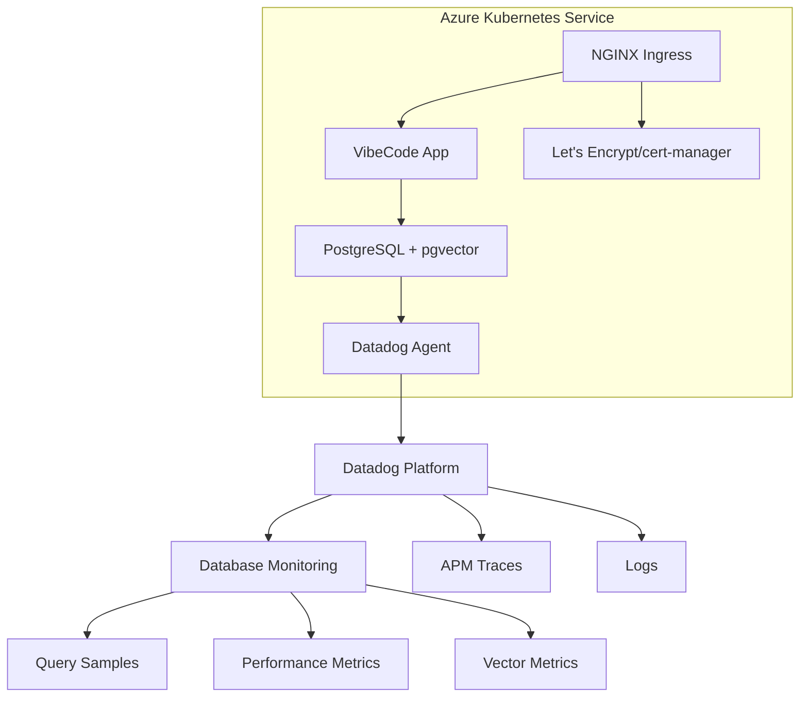

<div align="center">

# 🐘 VibeCode Platform

**pgvector on PostgreSQL + Kubernetes + Datadog Database Monitoring**

[](./DEMO.sh)
[](https://kubernetes.io/)
[](https://github.com/pgvector/pgvector)
[](https://www.datadoghq.com/)

</div>

## 🚀 **One-Click Demo**

```bash
./DEMO.sh
```

**See pgvector + PostgreSQL + Datadog DBM in action in 30 seconds.**

> Note: To see Datadog metrics in the demo, create a `.env.local` with your Datadog API key before running.

```bash
cat > .env.local << 'EOF'
DD_API_KEY=REPLACE_WITH_YOUR_KEY
DD_SITE=datadoghq.com
EOF
```

---

## 🏗️ **Deployment Status**

[](https://vibecode.eastus2.cloudapp.azure.com)
[](./tests/tofu/)
[](https://opentofu.org/)
[](https://azure.microsoft.com/en-us/services/kubernetes-service/)

### 🌐 **Production Deployment**
- **Live Application**: [https://vibecode.eastus2.cloudapp.azure.com](https://vibecode.eastus2.cloudapp.azure.com)
- **AKS Cluster**: `vibecode-prod-aks-6c3db0e6` (East US 2)
- **Container Registry**: `vibecodecr6c3db0e6.azurecr.io`
- **Application Version**: `v0.2.0`
- **Database**: PostgreSQL 15 with pgvector (in-cluster)
- **Monitoring**: Datadog with Database Monitoring enabled

### 🚀 **Quick Deploy to Azure AKS**

```bash
# 1. Create AKS cluster
./scripts/create-aks-cluster.sh

# 2. Configure DNS with Azure public IP
./scripts/create-public-ip.sh

# 3. Deploy full stack (ingress, app, SSL)
./scripts/deploy-vibecode.sh

# 4. Setup Datadog monitoring
export DD_API_KEY=your_datadog_api_key
./scripts/setup-aks-datadog-monitoring.sh
```

For advanced options and detailed guidance, see the [AKS Deployment Guide](./docs/aks-datadog-monitoring-guide.md).

> **Note:** Make sure you have Azure CLI (`az`) and kubectl installed and configured. If using OpenTofu, see the section below about remote state management.

### 📈 **Datadog Monitoring Setup**

The platform comes with comprehensive Datadog monitoring:

```bash
# Set your Datadog API key
export DD_API_KEY=your_datadog_api_key
export DD_SITE=datadoghq.com  # Optional, defaults to datadoghq.com

# Deploy Datadog monitoring stack
./scripts/setup-aks-datadog-monitoring.sh --cluster-name vibecode-prod-aks-6c3db0e6

# Validate Database Monitoring (after application is deployed)
./scripts/verify-datadog-dbm.sh
```

The monitoring stack includes:
- Node Agent with APM, logs, and process monitoring
- Cluster Agent for Kubernetes metrics
- Database Monitoring (DBM) for PostgreSQL and pgvector
- Custom dashboards for vector search monitoring
- System Probe for network monitoring

For troubleshooting and advanced configuration, see the [Datadog Monitoring Guide](./docs/aks-datadog-monitoring-guide.md).

### 📚 **Seed the RAG Dataset**

The `RAGChunk` Prisma model now stores embeddings directly as `vector(1536)` values, so once PostgreSQL is reachable you should:

```bash
npx prisma generate
npx prisma migrate deploy
./scripts/generate-vector-activity.sh           # or your preferred seeding script
npx ts-node scripts/verify-rag-functionality.ts # optional: smoke test retrieval
```

This loads demo content into pgvector and verifies the Lovable-style chat flows before the Datadog dashboards go live.

### 🗄️ **Harden OpenTofu State (Azure Storage)**

To keep disaster-recovery work from deleting the local `terraform.tfstate`, migrate the stack to Azure Blob Storage:

```bash
# one-time provisioning of the remote backend
./scripts/create-remote-state-storage.sh \
  RESOURCE_GROUP=rg-vibecode-tofu-state \
  STORAGE_ACCOUNT_NAME=vibecodetfstate01 \
  CONTAINER_NAME=opentofu-state

# copy the sample backend config and initialize
cp tofu/backend.tf.example tofu/backend.tf
tofu init -migrate-state
```

After migration, future `tofu plan/apply` runs will use the blob container (`opentofu-state`) instead of the fragile local file.

### ☁️ **App Service Stack (Preview)**

The new `tofu/appservice/` project provisions an Azure PaaS alternative (Storage + App Service + Function App + Postgres Flexible Server + Monitoring). To experiment locally:

```bash
cd tofu/appservice
cp appservice.tfvars.example appservice.auto.tfvars            # customise project name, env, passwords
tofu init                                                      # uses backend.tf.sample or local state
tofu plan                                                      # review the PaaS resources
```

Modules currently implemented:
- `modules/storage` – Storage account, private uploads container, ingestion queue
- `modules/app_service` – Linux App Service Plan & Web App (managed identity, monitoring settings)
- `modules/function_app` – Consumption plan Function App for queue-triggered PDF processing

Remaining work: populate monitoring, Key Vault, and Azure OpenAI modules plus application deployment scripts (see `TODO.md` for the active follow-ups).

### 🧪 **Production Testing**

Test against the live deployment:

```bash
# Quick smoke test (7 core tests)
npm run test:production:smoke

# Full E2E test suite (448 tests)
npm run test:e2e:production

# Integration tests (database, AI, monitoring)
npm run test:integration:production

# Complete test suite
npm run test:production:all
```

### 📊 **Infrastructure Components**
- **AKS cluster** with dual node pools (system + user)
- **PostgreSQL with pgvector** deployed in-cluster
- **Datadog monitoring** with database monitoring (DBM)
- **Network policies** and security hardening
- **Rollback mechanisms** for deployment failures
- **SSL/TLS** via Let's Encrypt with cert-manager

### 💸 **Minimize Your AKS Footprint**
- Keep the system node pool at the platform minimum (two Linux nodes on a 4-vCPU, 4+ GB SKU such as `Standard_D4as_v5`) and taint it so only control-plane add-ons schedule there.
- Run application workloads on a separate user pool with the cluster autoscaler `minCount` set to `0` so it scales to zero when idle.
- Stop and start the cluster (`az aks stop` / `az aks start`) during predictable downtimes to avoid paying for compute while the environment is quiet.
- Stay on the AKS Free tier unless you need an uptime SLA—the control plane remains free and you only pay for the agent nodes that are running.

---

## ✨ **What This Demonstrates**

<table>
<tr>
<td width="50%">

### 🎯 **Core Demo**
- **pgvector** for semantic search
- **PostgreSQL** on Kubernetes  
- **Datadog Database Monitoring**
- **Real-time vector metrics**
- **Query performance analysis**

</td>
<td width="50%">

### 📊 **What You'll See**
- 120 documents with embeddings
- Vector similarity searches
- Custom Datadog metrics
- Query samples & explain plans
- Performance dashboards

</td>
</tr>
</table>

---

## 🎮 **Quick Start Options**

| Method | Command | Description |
|--------|---------|-------------|
| **🚀 Interactive Demo** | `./DEMO.sh` | Full TUI experience |
| **⚡ Direct Setup** | `make setup` | Setup pgvector + DBM |
| **🎯 Generate Activity** | `make vector` | Create vector data |
| **📊 View Dashboard** | `make dashboard` | Open Datadog |
| **☁️ Deploy to AKS** | `./scripts/deploy-vibecode.sh` | Full production deployment |

> **Repo hygiene:** Housekeeping helpers now live under `scripts/util/` (for example `scripts/util/cleanup-root.sh`, `scripts/util/optimize-github-actions.sh`) so the repository root stays focused on app/runtime assets.

---

## 🏗️ **Architecture**


```mermaid
graph TB
    subgraph "Azure Kubernetes Service"
        A[VibeCode App] --> B[PostgreSQL + pgvector]
        B --> C[Datadog Agent]
        I[NGINX Ingress] --> A
        I --> D[Let's Encrypt/cert-manager]
    end
    C --> E[Datadog Platform]
    E --> F[Database Monitoring]
    E --> G[APM Traces]
    E --> H[Logs]
    F --> J[Query Samples]
    F --> K[Performance Metrics]
    F --> L[Vector Metrics]
```

---

## 📈 **Monitoring Capabilities**

<details>
<summary><b>🔍 Click to see what gets monitored</b></summary>

### Vector-Specific Metrics
- `postgresql.pgvector.vector_count` - Total embeddings stored
- `postgresql.pgvector.table_size` - Storage utilization  
- `postgresql.pgvector.index.*` - IVFFLAT index performance

### Database Performance
- Query execution times and explain plans
- Index usage and efficiency
- Connection pool monitoring
- Lock contention analysis

### Custom Queries Tracked
```sql
-- Vector similarity search
SELECT embedding <=> '[0.1,0.2,0.3]'::vector FROM documents;

-- Hybrid search (vector + text)
SELECT * FROM documents WHERE content @@ 'query' 
ORDER BY embedding <=> '[...]'::vector;
```

### Infrastructure Monitoring
- Node CPU, memory, and disk usage
- Kubernetes pod resource utilization
- AKS cluster health metrics
- Network traffic patterns

### Application Performance
- API response times
- Error rates
- Throughput metrics
- User experience metrics

</details>

---

## 🎯 **Perfect For**

- **Database Teams**: Monitoring pgvector in production
- **ML Engineers**: Vector database performance optimization  
- **DevOps**: Kubernetes + PostgreSQL + monitoring stack
- **Datadog Users**: Custom DBM metrics and dashboards
- **Cloud Architects**: Azure AKS deployment patterns

---

## 🔧 **Requirements**

- Kubernetes cluster (AKS, Docker Desktop, KIND, minikube)
- `kubectl` and `az` CLI configured
- Helm for package management
- Optional: Datadog API key for full monitoring

---

## 📋 **What Happens in the Demo**

1. **🔍 Verification**: Checks PostgreSQL + pgvector setup
2. **⚙️ Configuration**: Sets up Datadog DBM monitoring
3. **🎯 Data Generation**: Creates 120 sample documents with embeddings
4. **🔄 Activity Simulation**: Runs vector similarity searches
5. **📊 Monitoring**: Shows real metrics in Datadog dashboard

---

<div align="center">

**🚀 Ready to see pgvector monitoring in action?**

### [`./DEMO.sh`](./DEMO.sh)

*Supports both interactive TUI and simple menu modes*

---

<sub>Built with ❤️ for the Datadog + PostgreSQL + Kubernetes community</sub>

</div>
