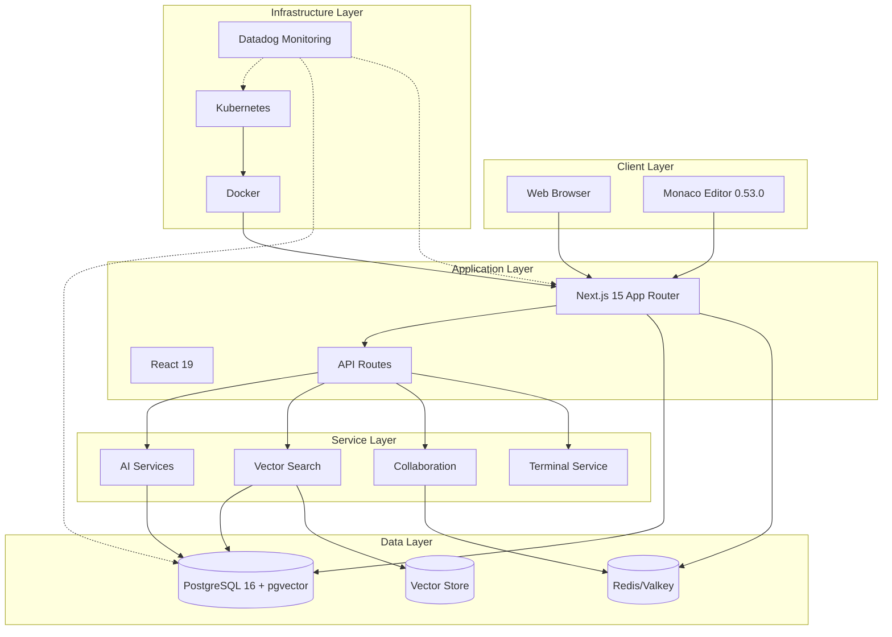

# VibeCode Studio (v5.1.0-beta)

> **🚨 Emergency Release (Feb 2026)** - The "Ruthless" Edition

VibeCode is the AI-native IDE and Agent Orchestrator.
**Current Backend:** Ubuntu 24.04 via `vfkit` (Fast, Stable).

## ✨ Features

- **🤖 AI-Powered Development**: Multi-provider AI integration (OpenAI, Anthropic, Gemini, Groq, DeepSeek)
- **🔍 Semantic Code Search**: Vector-based code search using pgvector with HNSW indexes
- **📝 Monaco Editor Integration**: Advanced code editing with AI completion via Monacopilot
- **👥 Real-time Collaboration**: WebSocket-based collaborative editing
- **💻 Terminal Integration**: Web-based terminal with node-pty
- **🎯 Onboarding System**: 7-step guided setup for new users
- **🧩 Extension Marketplace**: 53+ VS Code extensions support
- **🔌 MCP Server**: Model Context Protocol for AI integrations
- **🧪 Offline Testing**: Comprehensive cloud infrastructure testing without cloud resources

## 🏗️ Architecture Overview

VibeCode is an AI-powered development platform built on a modern, cloud-native technology stack. The system provides a web-based IDE with integrated AI assistance, semantic code search, and collaborative development features.

### System Architecture


```mermaid
graph TB
    subgraph "Client Layer"
        Browser[Web Browser]
        Monaco[Monaco Editor 0.53.0]
    end

    subgraph "Application Layer"
        NextJS[Next.js 15 App Router]
        React[React 19]
        API[API Routes]
    end

    subgraph "Service Layer"
        AI[AI Services]
        Vector[Vector Search]
        Collab[Collaboration]
        Terminal[Terminal Service]
    end

    subgraph "Data Layer"
        Postgres[(PostgreSQL 16 + pgvector)]
        Cache[(Redis/Valkey)]
        VectorDB[(Vector Store)]
    end

    subgraph "Infrastructure Layer"
        K8s[Kubernetes]
        Docker[Docker]
        Datadog[Datadog Monitoring]
    end

    Browser --> NextJS
    Monaco --> NextJS
    NextJS --> API
    API --> AI
    API --> Vector
    API --> Collab
    API --> Terminal
    AI --> Postgres
    Vector --> Postgres
    Vector --> VectorDB
    Collab --> Cache
    NextJS --> Postgres
    NextJS --> Cache
    K8s --> Docker
    Docker --> NextJS
    Datadog -.-> K8s
    Datadog -.-> Postgres
    Datadog -.-> NextJS
```

### Key Architecture Components

- **Client Layer**: Monaco Editor 0.53.0 integrated with React 19 for advanced code editing
- **Application Layer**: Next.js 15 with App Router for modern React development
- **Service Layer**: AI services, vector search, collaboration, and terminal integration
- **Data Layer**: PostgreSQL 16 with pgvector for semantic search, Redis/Valkey for caching
- **Infrastructure Layer**: Kubernetes orchestration with Docker containers, Datadog monitoring

### Detailed Documentation

For comprehensive architecture information including:
- Complete technology stack and versions
- Architecture Decision Records (ADRs)
- Core subsystems and integration details
- Security architecture
- Deployment models
- Scalability considerations

**See: [Architecture Documentation](docs/ARCHITECTURE.md)** | **[Architecture Diagrams](docs/ARCHITECTURE_DIAGRAM.md)** | **[Folder Structure](docs/FOLDER_STRUCTURE.md)**

## 🚀 Quick Start

> **📖 New to VibeCode?** See the [Environment Setup Guide](docs/ENVIRONMENT_SETUP_GUIDE.md) for detailed configuration instructions.

### New to VibeCode? Start Here!
Get up and running in under 5 minutes:
```bash
npm run quickstart
```
This single command will:
- ✅ Check and install dependencies
- ✅ Set up your development environment
- ✅ Launch all services
- ✅ Open the onboarding wizard
- ✅ Create a sample project for you to explore

📚 **For detailed quickstart flow and troubleshooting**, see [QUICK_START.md](docs/QUICK_START.md)

> **🤝 Want to contribute?** See our [Contributing Guide](CONTRIBUTING.md) for development setup, coding standards, and PR workflows.

### 1. Install Dependencies
```bash
brew install vfkit
pip install -r scripts/requirements.txt
```

### 2. Launch Backend (Ubuntu VM)
You can use the restored CLI tool:
```bash
bin/vibecode-vm start
```
Or run the script directly:
```bash
python3 scripts/launch_ubuntu_vm.py
```

### 3. Launch Studio
```bash
npm run tauri:dev
```

## 🛠️ CLI Tool
Manage the VM environment with the unified CLI:
```bash
bin/vibecode-vm status  # Check health via Ralph Loop
bin/vibecode-vm start   # Launch Ubuntu VM
bin/vibecode-vm stop    # Stop VM
```

## 🖥️ Menubar App
A native macOS status bar app is available to control the environment:
1. **Build:** `cd platforms/macos/VibeCodeMenubar && swift build -c release`
2. **Run:** `.build/release/VibeCodeMenubar`

## 🔄 Ralph Loop
System health is monitored by the Ralph Loop daemon:
```bash
python3 scripts/ralph_loop.py
```

## 📦 Legacy & Migration
- **Gas Town:** Use `python3 scripts/gt_shim.py` for legacy commands.
- **Remote:** Use `scripts/migrate_from_remote.sh` to pull from `mbp-m1`.

---
*Powered by OpenClaw*

## 🍎 Native macOS Virtualization

VibeCode supports **Apple Virtualization Framework** for native macOS VM performance:
- **Native Speed**: Direct hardware virtualization without Docker overhead
- **ASIF Support**: Apple Sparse Image Format on macOS 26+ (2-3x faster I/O)
- **Full VM Control**: Start, stop, suspend, resume operations
- **Linux GUI VMs**: Graphics support with VirtIO GPU

See [Apple Virtualization Framework Documentation](docs/features/APPLE_VIRTUALIZATION_FRAMEWORK.md) for details.

## 🐳 Docker Option (Lightweight)
If you prefer containers over a full VM:
```bash
docker compose up -d
```
This launches the OpenClaw Gateway on port `18789`.

## GitHub Actions Cost Optimization

To control costs, we use a two-tier CI/CD strategy:

### Main Branch (Lightweight)
- Fast linting and basic unit tests only
- ~$0.05 per run

### Release Branches (Comprehensive)
- Full test suite (unit, integration, E2E)
- Security scans and performance testing
- Production deployment pipelines
- ~$2-4 per run

### Creating Release Branches
```bash
# Create release branch for full testing
./create-release-branch.sh v1.2.0
```

## 🧪 Testing Infrastructure

VibeCode maintains a comprehensive testing infrastructure to ensure code quality and reliability:

### Testing Strategy
- **Unit Tests**: Test individual components and functions in isolation
- **Integration Tests**: Test interactions between components and services
- **E2E Tests**: Test complete user flows in real browser environments

### Testing Stack
- **Jest** + **React Testing Library**: Unit and integration testing
- **Playwright**: End-to-end browser automation
- **Coverage Reports**: Progressive roadmap to 80% coverage with 30% milestones

### Quick Commands
```bash
# Run all unit tests
npm run test:unit

# Run tests with coverage
npm run test:coverage

# Run E2E tests
npm run test:e2e

# Run tests in watch mode
npm run test:watch
```

### Coverage Thresholds

**Phase 0 Baseline** (Current): 18-24% - prevents regressions while improving coverage
**Progressive Milestones**: Phase 0 (18-24%) → 30% → 50% → 65% → 80%

Current enforcement in CI:
- Branches: 18%
- Functions: 22%
- Lines: 24%
- Statements: 22%

📚 **For comprehensive testing patterns, best practices, and detailed guides**, see [Testing Guide](docs/testing/TESTING_GUIDE.md)
📊 **For coverage roadmap and strategy**, see [Coverage Strategy](docs/testing/COVERAGE_STRATEGY.md)

## 🔒 Security Considerations

### Environment Isolation

The environment isolation feature provides **safety**, not **security**.

#### ✅ What It Protects Against

- Accidental operations in the wrong environment
- Human error and confusion
- Lack of visual environment indicators
- Unintentional production changes

#### ❌ What It Does NOT Protect Against

- **Determined attackers** with system access
- **Environment variable manipulation** (`NODE_ENV`, `DD_ENV`, etc.)
- **Hostname or domain spoofing**
- **Malicious code execution**
- **Privileged users** intentionally bypassing checks

#### Attack Vectors

Environment detection can be bypassed by:
- Setting environment variables (`NODE_ENV=test`)
- Modifying hostname or domain configuration
- Manipulating git branch information
- Setting custom environment detection rules

#### For True Security Isolation

To protect against determined attackers:

1. **Infrastructure Isolation**
   - Separate AWS accounts/GCP projects per environment
   - Network-level firewall rules
   - VPC/subnet isolation

2. **Cryptographic Attestation**
   - Use TPM or HSM for environment proof
   - Signed environment tokens
   - Certificate-based validation

3. **Access Control**
   - Multi-factor authentication for production
   - Role-based access control (RBAC)
   - Just-in-time (JIT) access

4. **Monitoring & Audit**
   - Comprehensive audit logging
   - Real-time alerting on suspicious activity
   - Regular security reviews

#### Recommendation

**Treat environment isolation as a guardrail, not a security boundary.**

For production systems, implement defense-in-depth with infrastructure, network,
identity, and application-level security controls.
