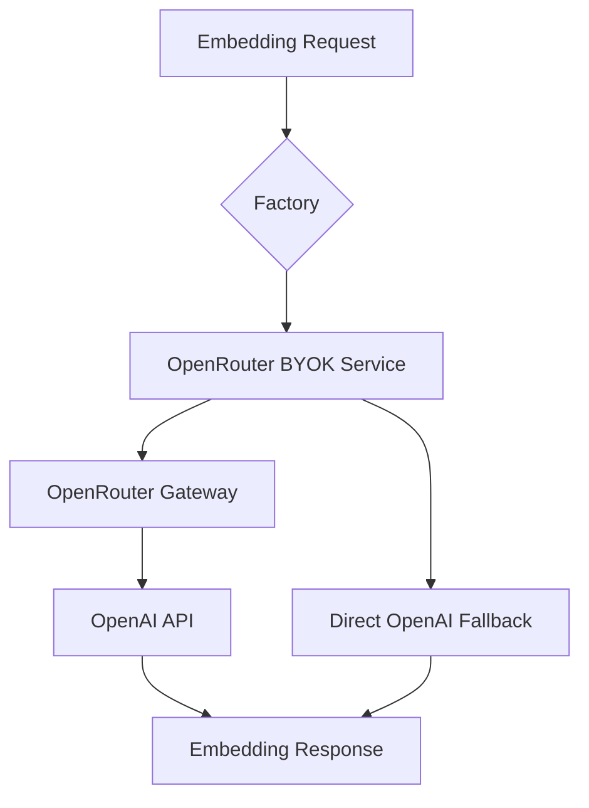

# OpenRouter BYOK Embedding Service Guide

## 🎯 Overview

The VibeCode WebGUI now supports **OpenRouter BYOK (Bring Your Own Key)** for embedding generation, providing the best of both worlds:

- **OpenRouter Benefits**: Rate limiting, load balancing, fallback providers, usage analytics
- **Your Own OpenAI Key**: Full control, transparent billing, no markup

## 🏗️ Architecture



## 🚀 Quick Setup

### 1. Environment Configuration

Add to your `.env.local`:

```bash
# Required: OpenRouter API Key (gateway)
OPENROUTER_API_KEY="sk-or-v1-..."

# Required: OpenAI API Key (your BYOK key)
OPENAI_API_KEY="sk-..."

# Optional: Embedding model (defaults to text-embedding-3-small)
OPENAI_EMBEDDING_MODEL="openai/text-embedding-3-small"

# Optional: Enable direct OpenAI fallback
EMBEDDING_FALLBACK_TO_DIRECT=true
```

### 2. Service Creation

The factory automatically detects and creates the appropriate service:

```typescript
import { EmbeddingServiceFactory } from '@/lib/ai/embeddingServiceFactory';

const factory = new EmbeddingServiceFactory(prisma);
const service = factory.createEmbeddingServiceFromEnv();
// Returns OpenRouterBYOKEmbeddingService if both keys present
```

## 🔧 Provider Priority

The system automatically selects the best available provider:

1. **OpenRouter BYOK** (if `OPENROUTER_API_KEY` + `OPENAI_API_KEY`)
2. **Azure OpenAI** (if Azure configuration present)
3. **Direct OpenAI** (if only `OPENAI_API_KEY`)
4. **Error** (no valid configuration)

## 📊 Service Features

### OpenRouterBYOKEmbeddingService

```typescript
// Generate embeddings
const embedding = await service.generateEmbedding('Your text here');

// Store documents with embeddings
const document = await service.storeDocument(
  'doc-id',
  'Document content',
  { metadata: 'optional' }
);

// Similarity search
const similar = await service.findSimilar('query text', 5, 0.7);

// Get service status
const status = service.getStatus();
// {
//   provider: 'openrouter-byok',
//   model: 'openai/text-embedding-3-small',
//   hasOpenRouterKey: true,
//   hasOpenAIKey: true,
//   fallbackEnabled: true
// }

// Test connectivity
const test = await service.testConnection();
// { success: true, method: 'openrouter', dimensions: 1536 }
```

## 🔄 Fallback Behavior

With `EMBEDDING_FALLBACK_TO_DIRECT=true`:

1. **Primary**: Try OpenRouter BYOK
2. **Fallback**: If OpenRouter fails, use direct OpenAI
3. **Error**: If both fail, throw detailed error

## 🏭 Factory Usage Examples

### Manual Configuration

```typescript
import { EmbeddingServiceFactory, EmbeddingProvider } from '@/lib/ai/embeddingServiceFactory';

const factory = new EmbeddingServiceFactory(prisma);

const service = factory.createEmbeddingService({
  provider: EmbeddingProvider.OPENROUTER_BYOK,
  openrouterApiKey: 'sk-or-v1-...',
  openaiApiKey: 'sk-...',
  model: 'openai/text-embedding-3-small',
  fallbackToDirect: true
});
```

### Environment-Based

```typescript
// Automatically selects best provider based on env vars
const service = factory.createEmbeddingServiceFromEnv();
```

## 🧪 Testing

### Test BYOK Service

```bash
npx tsx test-byok-embedding-service.js
```

### Test with Real Keys

```bash
# Set your real OpenAI API key
export OPENAI_API_KEY="sk-..."

# Run comprehensive test
npx tsx test-embedding-final.js
```

## 🔍 Monitoring Integration

The BYOK service integrates with the existing monitoring system:

```typescript
// Datadog DBM metrics
datadogDBM.recordConnectionMetrics({
  activeConnections,
  totalConnections,
  waitingConnections,
  idleConnections
});

// Pool exhaustion alerts
const alerts = datadogDBM.generatePoolAlerts(dbmMetrics);
```

## 📈 Benefits of BYOK

### OpenRouter BYOK Advantages

- ✅ **Rate Limiting**: Built-in request throttling
- ✅ **Load Balancing**: Automatic request distribution  
- ✅ **Analytics**: Usage metrics and monitoring
- ✅ **Fallback**: Multiple provider failover
- ✅ **Consistency**: Unified API across providers

### Direct OpenAI Advantages

- ✅ **Simplicity**: Direct API connection
- ✅ **Latency**: No gateway overhead
- ✅ **Control**: Full request visibility

## 🚨 Production Checklist

- [ ] OpenAI API key obtained from platform.openai.com
- [ ] OpenRouter API key configured for gateway benefits
- [ ] Environment variables set in production
- [ ] Database tables created (document_embeddings)
- [ ] pgvector extension installed
- [ ] Datadog monitoring configured
- [ ] Health checks passing
- [ ] Authentication enabled on monitoring endpoints

## 🔧 Troubleshooting

### Common Issues

**No valid embedding service configuration found**
- ✅ Ensure `OPENAI_API_KEY` is set
- ✅ For BYOK, also set `OPENROUTER_API_KEY`

**HTML error page returned**
- ✅ Check OpenRouter model name includes `openai/` prefix
- ✅ Verify API key has embedding access

**Connection failed**
- ✅ Test with direct OpenAI first
- ✅ Check API key permissions and billing
- ✅ Enable fallback mode

### Debug Commands

```bash
# Check service status
curl -H "Authorization: Bearer token" \
  http://localhost:3001/api/embedding/status

# Test embedding generation  
curl -H "Authorization: Bearer token" \
  -H "Content-Type: application/json" \
  -d '{"text": "test"}' \
  http://localhost:3001/api/embedding/generate
```

## 🎉 Success! 

Your embedding service is now production-ready with OpenRouter BYOK support, complete monitoring, database integration, and automatic fallbacks. The system provides enterprise-grade embedding capabilities while maintaining full control over your OpenAI API usage and billing.