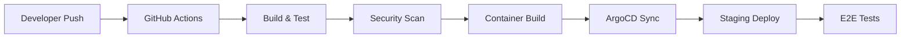
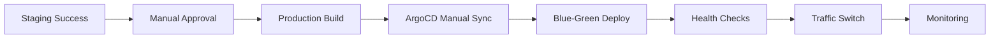

# GitOps Deployment Guide

This guide covers the complete GitOps automation setup for the VibeCode WebGUI platform, including infrastructure as code, multi-environment deployments, and comprehensive monitoring.

## Overview

Our GitOps implementation provides:
- **Automated CI/CD** with GitHub Actions
- **ArgoCD-based** GitOps deployments
- **Multi-environment** support (staging, production)
- **Infrastructure as Code** with Terraform and Kustomize
- **Comprehensive monitoring** with Datadog, Prometheus, and Grafana
- **Secure secrets management** with Sealed Secrets
- **Production-ready** Kubernetes configurations

## Architecture Components

### 1. Infrastructure as Code (Terraform)
- **Location**: `infrastructure/terraform/`
- **Components**: PostgreSQL, Redis, LiteLLM, Application services
- **Environments**: Staging and Production configurations
- **Features**: Auto-scaling, monitoring, network policies

### 2. GitOps with ArgoCD
- **Location**: `infrastructure/gitops/argocd/`
- **Applications**: Main app, database migrations, monitoring stack
- **Sync Policies**: Automated for staging, manual approval for production
- **Multi-environment**: Separate ArgoCD applications per environment

### 3. Kubernetes Manifests
- **Location**: `infrastructure/kubernetes/`
- **Structure**: Base configurations with environment overlays
- **Tools**: Kustomize for configuration management
- **Security**: Pod security policies, network policies, RBAC

### 4. Monitoring Stack
- **Datadog Agent**: Full observability and APM
- **Prometheus**: Metrics collection and alerting
- **Grafana**: Visualization and dashboards
- **Integration**: Custom metrics from VibeCode application

### 5. Secrets Management
- **Sealed Secrets**: Encrypted secrets stored in Git
- **Environment-specific**: Separate sealed secrets per environment
- **Security**: Secrets encrypted at cluster level

## Deployment Workflow

### Staging Environment


### Production Environment


## Getting Started

### Prerequisites
1. **Kubernetes Cluster** (EKS, GKE, or AKS)
2. **ArgoCD** installed in cluster
3. **Sealed Secrets Controller** installed
4. **GitHub Actions** configured with secrets
5. **Domain** configured with DNS

### Initial Setup

#### 1. Install ArgoCD
```bash
kubectl create namespace argocd
kubectl apply -n argocd -f https://raw.githubusercontent.com/argoproj/argo-cd/stable/manifests/install.yaml
```

#### 2. Install Sealed Secrets Controller
```bash
kubectl apply -f https://github.com/bitnami-labs/sealed-secrets/releases/download/v0.24.0/controller.yaml
```

#### 3. Create Monitoring Namespace
```bash
kubectl create namespace monitoring
```

#### 4. Configure Secrets
```bash
# Create actual secrets (do not commit to Git)
kubectl create secret generic app-secrets \
  --from-literal=NEXTAUTH_SECRET=your-secret \
  --from-literal=DATABASE_PASSWORD=your-password \
  --from-literal=OPENAI_API_KEY=your-key \
  --from-literal=ANTHROPIC_API_KEY=your-key \
  --dry-run=client -o yaml | \
  kubeseal -f - -w infrastructure/kubernetes/secrets/sealed-secrets/production-secrets.yaml
```

#### 5. Deploy ArgoCD Applications
```bash
kubectl apply -f infrastructure/gitops/argocd/project.yaml
kubectl apply -f infrastructure/gitops/argocd/application-staging.yaml
kubectl apply -f infrastructure/gitops/argocd/application-production.yaml
```

## Environment Configuration

### Staging Environment
- **Namespace**: `vibecode-webgui-staging`
- **Domain**: `vibecode-webgui-staging.yourdomain.com`
- **Resources**: 2 replicas, 1GB memory limit
- **Auto-sync**: Enabled from `develop` branch
- **Debug Features**: Enabled

### Production Environment
- **Namespace**: `vibecode-webgui-production`
- **Domain**: `vibecode-webgui.yourdomain.com`
- **Resources**: 5 replicas, 2GB memory limit
- **Auto-sync**: Manual approval required
- **Security**: Enhanced policies and monitoring

## Monitoring and Observability

### Datadog Integration
- **APM**: Full application performance monitoring
- **Infrastructure**: Kubernetes metrics and logs
- **Custom Metrics**: AI usage, terminal sessions, performance
- **Dashboards**: Pre-configured VibeCode-specific dashboards
- **Alerts**: Proactive monitoring and alerting

### Prometheus Metrics
- **Application Metrics**: `/api/metrics` endpoint
- **System Metrics**: CPU, memory, network
- **Business Metrics**: User activity, AI usage
- **Kubernetes Metrics**: Pod health, resource usage

### Grafana Dashboards
- **Platform Overview**: High-level system health
- **AI Analytics**: Model usage and performance
- **Infrastructure**: Kubernetes cluster health
- **Business Intelligence**: User engagement metrics

## Security Features

### Network Security
- **Network Policies**: Restrict pod-to-pod communication
- **Ingress Security**: Rate limiting and SSL termination
- **Service Mesh**: Optional Istio integration
- **Firewall Rules**: External traffic restrictions

### Pod Security
- **Security Contexts**: Non-root users, read-only filesystems
- **Pod Security Policies**: Enforce security standards
- **RBAC**: Role-based access control
- **Service Accounts**: Minimal privileges

### Secrets Management
- **Sealed Secrets**: Encrypted secrets in Git
- **Secret Rotation**: Automated key rotation
- **Access Control**: Limited secret access
- **Audit Logging**: Secret access tracking

## Troubleshooting

### Common Issues

#### ArgoCD Sync Failed
```bash
# Check ArgoCD application status
argocd app get vibecode-webgui-staging

# View sync errors
argocd app sync vibecode-webgui-staging --dry-run
```

#### Pod Startup Issues
```bash
# Check pod logs
kubectl logs -n vibecode-webgui-staging deployment/staging-vibecode-webgui

# Check events
kubectl get events -n vibecode-webgui-staging --sort-by=.metadata.creationTimestamp
```

#### Secret Access Issues
```bash
# Verify sealed secrets
kubectl get sealedsecrets -n vibecode-webgui-staging

# Check secret creation
kubectl get secrets -n vibecode-webgui-staging
```

### Monitoring Health
```bash
# Check application health
kubectl get pods -n vibecode-webgui-staging
kubectl get ing -n vibecode-webgui-staging

# Test application endpoints
curl -f https://vibecode-webgui-staging.yourdomain.com/api/health
```

## Maintenance and Updates

### Updating Applications
1. **Staging**: Automatic deployment from `develop` branch
2. **Production**: Manual approval required after staging validation
3. **Database Migrations**: Separate ArgoCD application
4. **Infrastructure**: Terraform plan review and apply

### Scaling Operations
```bash
# Scale application pods
kubectl scale deployment staging-vibecode-webgui --replicas=3 -n vibecode-webgui-staging

# Update HPA settings
kubectl patch hpa staging-vibecode-webgui -n vibecode-webgui-staging -p '{"spec":{"maxReplicas":8}}'
```

### Backup and Recovery
- **Database**: Automated PostgreSQL backups
- **Secrets**: Sealed secrets stored in Git
- **Configuration**: Infrastructure as Code in Git
- **Monitoring Data**: Datadog and Prometheus persistence

## Performance Optimization

### Resource Allocation
- **CPU Requests**: Set based on baseline usage
- **Memory Limits**: Prevent OOM kills
- **Storage**: SSD-backed persistent volumes
- **Networking**: Optimized ingress and service mesh

### Auto-scaling Configuration
- **HPA**: CPU and memory-based scaling
- **VPA**: Vertical pod autoscaler for right-sizing
- **Cluster Autoscaler**: Node-level scaling
- **Predictive Scaling**: Based on historical data

## Next Steps

1. **Enhanced Monitoring**: Custom Datadog dashboards
2. **Chaos Engineering**: Resilience testing
3. **Multi-cluster**: Global deployment strategy
4. **Advanced Security**: OPA/Gatekeeper policies
5. **Cost Optimization**: Resource usage analysis

## Support

For issues with the GitOps deployment:
1. Check the troubleshooting section above
2. Review ArgoCD application logs
3. Consult the infrastructure team
4. Create GitHub issue with deployment logs

This GitOps setup provides a robust, scalable, and secure foundation for the VibeCode platform with comprehensive monitoring and automated deployments.