# VibeCode System Architecture
**Complete System Architecture with Mermaid Diagrams**

**Version:** 1.0
**Date:** October 28, 2025
**Status:** Phase 2 Complete, Phases 3-4 In Progress

---

## Table of Contents

1. [High-Level Architecture](#high-level-architecture)
2. [Component Architecture](#component-architecture)
3. [Authentication Flow](#authentication-flow)
4. [Data Flow](#data-flow)
5. [Deployment Models](#deployment-models)
6. [Technology Stack](#technology-stack)
7. [Integration Points](#integration-points)

---

## High-Level Architecture

### System Overview

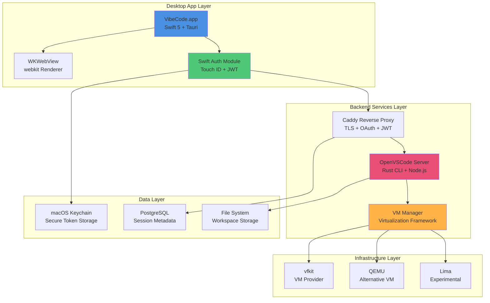

---

## Component Architecture

### Full System Stack

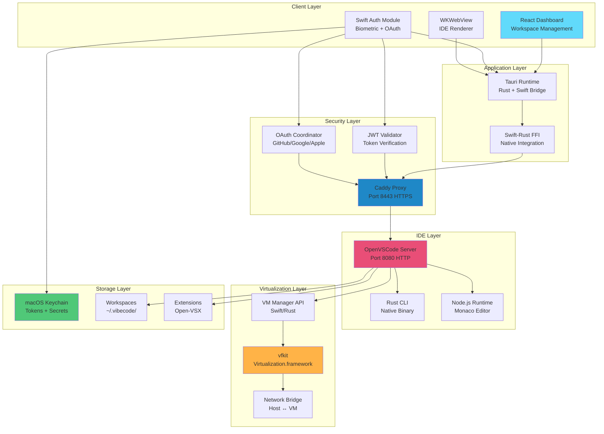

---

## Authentication Flow

### Complete Authentication Architecture

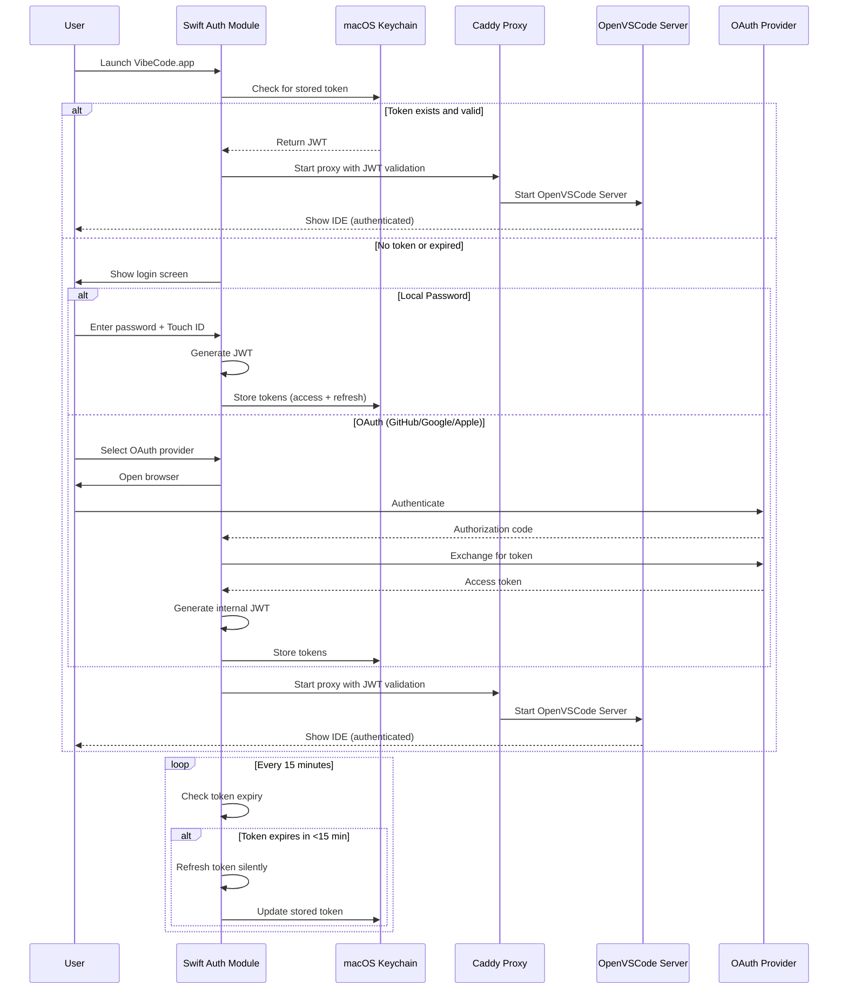

### Deployment-Specific Auth Flows

```mermaid
graph TB
    subgraph "Desktop Mode (Single User)"
        D1[Swift Auth]
        D2[Local Password<br/>or Touch ID]
        D3[Generate JWT]
        D4[Store in Keychain]
        D5[Direct to Server<br/>No Caddy]
    end

    subgraph "Local VM Mode (Development)"
        L1[Swift Auth]
        L2[Touch ID<br/>+ Lightweight Caddy]
        L3[Generate JWT]
        L4[Caddy validates]
        L5[Proxy to VM:8080]
    end

    subgraph "Remote Fleet Mode (Production)"
        R1[Web Browser]
        R2[Caddy with OAuth]
        R3[GitHub/Google/Okta]
        R4[Generate JWT]
        R5[Fleet Manager]
        R6[Assign Node]
        R7[OpenVSCode on Node]
    end

    D1 --> D2 --> D3 --> D4 --> D5
    L1 --> L2 --> L3 --> L4 --> L5
    R1 --> R2 --> R3 --> R4 --> R5 --> R6 --> R7

    style D1 fill:#4A90E2
    style L1 fill:#FFB347
    style R1 fill:#E94E77
```

---

## Data Flow

### Request Flow (Desktop to IDE)

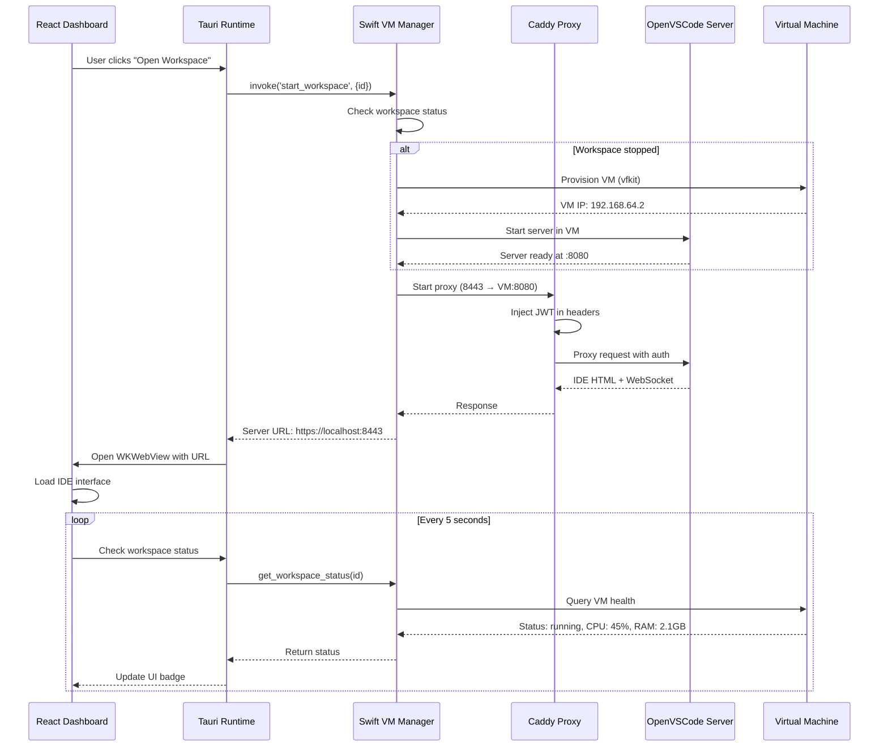

### Extension Installation Flow

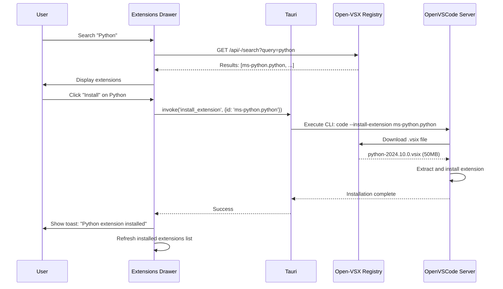

---

## Deployment Models

### Model 1: Desktop App (Single User, Local)

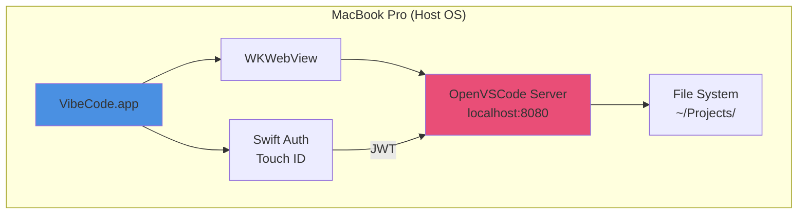

**Characteristics:**
- No VM required (direct localhost)
- Swift auth with Touch ID
- Fastest performance
- Single user only
- No network isolation

---

### Model 2: Local VM (Development, Isolated)

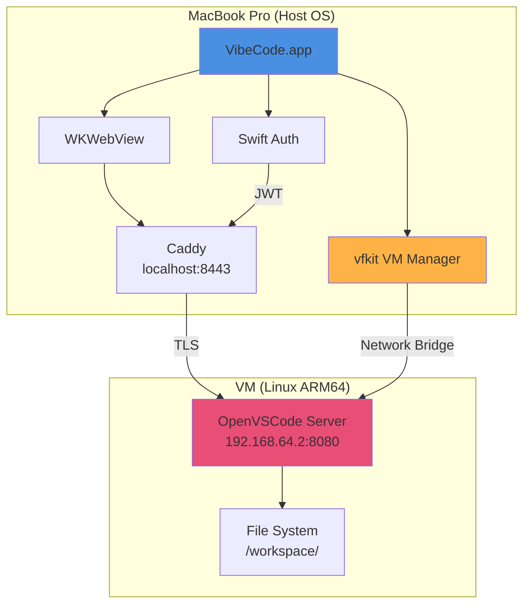

**Characteristics:**
- VM isolation (security)
- Caddy for TLS + JWT
- vfkit (Virtualization.framework)
- Port forwarding: 8443 → VM:8080
- Single user

---

### Model 3: Remote Fleet (Multi-User, Production)

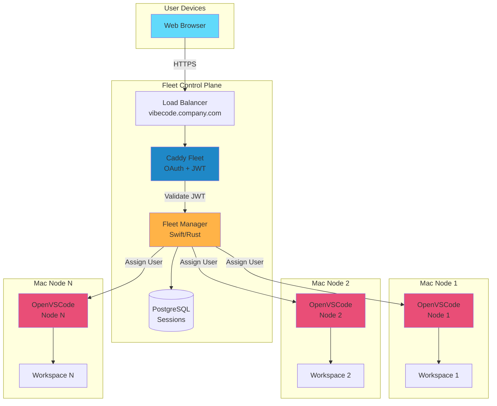

**Characteristics:**
- Multi-user, multi-tenant
- OAuth/OIDC (GitHub, Google, Okta)
- Fleet-wide RBAC
- Service discovery (mDNS/Consul)
- Load balancing
- Horizontal scaling

---

## Technology Stack

### Frontend Stack

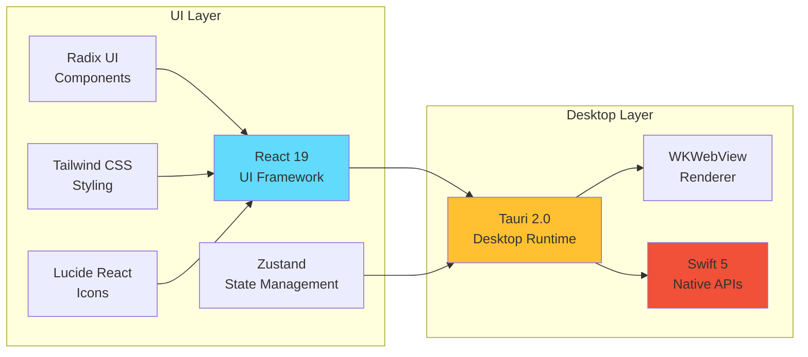

### Backend Stack

```mermaid
graph LR
    subgraph "IDE Backend"
        RUSTCLI[Rust 1.90<br/>CLI Binary]
        NODEJS[Node.js 22<br/>Runtime]
        MONACO[Monaco Editor<br/>Web Editor]
        EXTENSIONS[Open-VSX<br/>Extensions]
    end

    subgraph "Security Layer"
        CADDY[Caddy 2.x<br/>Reverse Proxy]
        JWT[JWT Library<br/>Token Validation]
        OAUTH[OAuth 2.0<br/>Providers]
    end

    subgraph "Infrastructure"
        VFKIT[vfkit<br/>VM Provider]
        QEMU[QEMU<br/>Alternative]
        LIMA[Lima<br/>Experimental]
    end

    RUSTCLI --> NODEJS
    NODEJS --> MONACO
    NODEJS --> EXTENSIONS
    CADDY --> JWT
    CADDY --> OAUTH
    CADDY --> RUSTCLI
    VFKIT --> RUSTCLI

    style RUSTCLI fill:#CE422B
    style NODEJS fill:#339933
    style CADDY fill:#1F88C7
    style VFKIT fill:#FFB347
```

### Data Stack

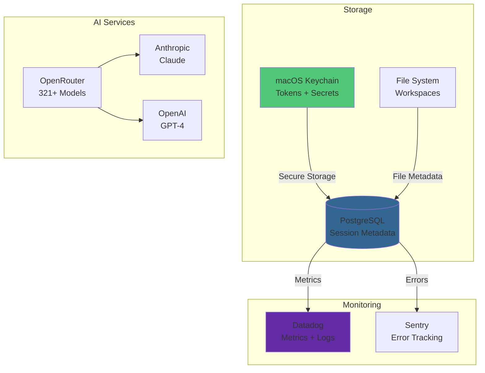

---

## Integration Points

### Swift → Rust FFI Bridge

```mermaid
graph LR
    subgraph "Swift Layer"
        SWIFTAPI[Swift API<br/>VibeCodeServer.swift]
        BRIDGING[Bridging Header<br/>C Interface]
    end

    subgraph "Rust Layer"
        RUSTLIB[Rust Library<br/>libvibecode_cli.dylib]
        RUSTCLI[Rust CLI<br/>Main Binary]
    end

    SWIFTAPI --> BRIDGING
    BRIDGING --> |extern "C"| RUSTLIB
    RUSTLIB --> RUSTCLI

    style SWIFTAPI fill:#F05138
    style RUSTLIB fill:#CE422B
```

**Interface Example:**
```swift
// Swift side
class VibeCodeServer {
    func start(config: ServerConfig) async throws {
        try await rust_start_server(
            port: config.port,
            host: config.host
        )
    }
}

// Rust side (exported via FFI)
#[no_mangle]
pub extern "C" fn rust_start_server(
    port: u16,
    host: *const c_char
) -> bool {
    // Launch OpenVSCode Server
}
```

---

### Tauri Commands API

```mermaid
graph LR
    subgraph "Frontend (React)"
        DASHBOARD[Dashboard Component]
    end

    subgraph "Tauri Runtime"
        INVOKE[invoke API]
        COMMANDS[Tauri Commands<br/>Rust]
    end

    subgraph "Backend Services"
        SWIFT[Swift VM Manager]
        VSCODE[OpenVSCode Server]
    end

    DASHBOARD --> |invoke('get_workspaces')| INVOKE
    INVOKE --> COMMANDS
    COMMANDS --> |Call Swift via FFI| SWIFT
    COMMANDS --> |HTTP Request| VSCODE

    style DASHBOARD fill:#61DAFB
    style COMMANDS fill:#FFC131
    style SWIFT fill:#F05138
```

**API Examples:**
```typescript
// Frontend
const workspaces = await invoke('get_workspaces');
await invoke('start_workspace', { workspaceId: 'ws-123' });
await invoke('install_extension', { extensionId: 'ms-python.python' });
```

```rust
// Backend
#[tauri::command]
async fn get_workspaces() -> Result<Vec<Workspace>, String> {
    // Query workspaces from file system
}

#[tauri::command]
async fn start_workspace(workspace_id: String) -> Result<(), String> {
    // Start VM, launch OpenVSCode Server
}
```

---

### VM Management API

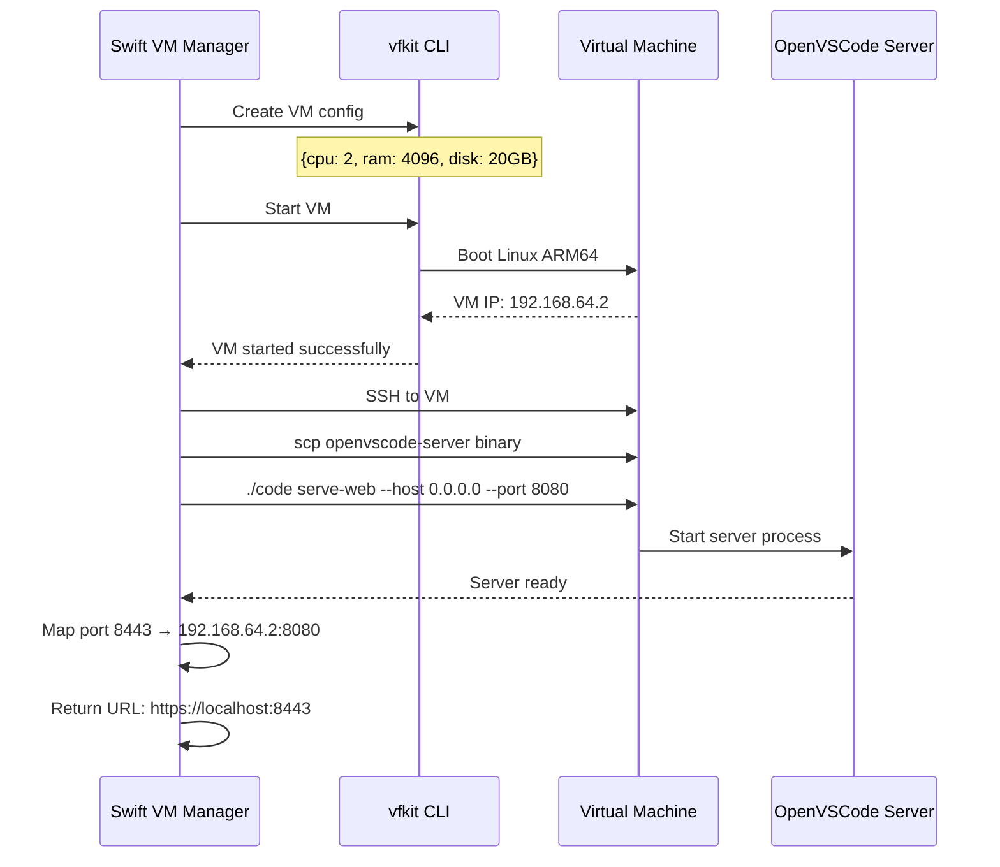

---

## Network Architecture

### Port Mapping

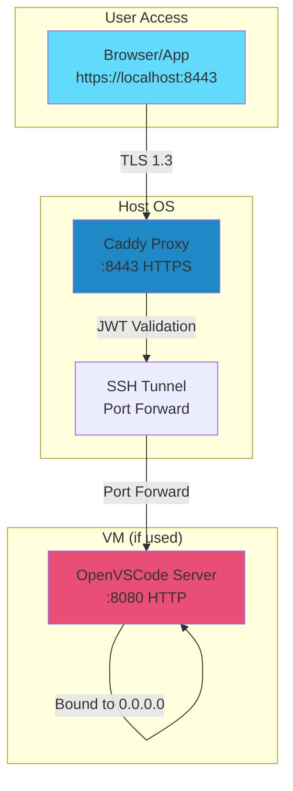

**Port Allocation:**
- `8443` - Caddy HTTPS (external)
- `8080` - OpenVSCode Server HTTP (internal)
- `2019` - Caddy admin API (localhost only)
- `3000` - React dev server (development only)

---

## State Management

### Zustand Store Architecture

```mermaid
graph TB
    subgraph "UI Components"
        DASHBOARD[Dashboard]
        CARDS[WorkspaceCard]
        DRAWER[ExtensionsDrawer]
    end

    subgraph "Zustand Stores"
        WORKSPACE[WorkspaceStore<br/>workspaces, loading, error]
        EXTENSION[ExtensionStore<br/>installed, recommended]
        SETTINGS[SettingsStore<br/>preferences]
        UI[UIStore<br/>theme, modals]
    end

    subgraph "Backend APIs"
        TAURI[Tauri Commands]
        OPENVSX[Open-VSX API]
    end

    DASHBOARD --> WORKSPACE
    CARDS --> WORKSPACE
    DRAWER --> EXTENSION
    WORKSPACE --> TAURI
    EXTENSION --> OPENVSX
    EXTENSION --> TAURI
    SETTINGS --> TAURI

    style DASHBOARD fill:#61DAFB
    style WORKSPACE fill:#443E38
    style TAURI fill:#FFC131
```

---

## Summary

VibeCode's architecture is designed around:

1. **Native macOS Integration** - Swift 5 + Virtualization.framework
2. **Hybrid Authentication** - Swift auth + Caddy proxy + JWT
3. **VM Flexibility** - Support for vfkit, QEMU, Lima
4. **Lightweight Frontend** - React + Zustand (<200KB bundle)
5. **OpenVSCode Server** - Rust CLI + Node.js runtime
6. **Modular Design** - Clear separation of concerns
7. **Security First** - TLS 1.3, JWT, biometric auth
8. **Scalable** - Desktop → VM → Fleet deployment

---

**Next Steps:**
- [Implementation Roadmap](./IMPLEMENTATION_ROADMAP.md) - Development plan
- [Quick Start Guide](./QUICKSTART.md) - Get started in 5 minutes
- [Authentication Strategy](../security/AUTHENTICATION_STRATEGY.md) - Security details
- [Dashboard Design](./DASHBOARD_DESIGN.md) - UI specifications

---

**Document Version:** 1.0
**Last Updated:** October 28, 2025
**Maintained By:** Architecture Team
