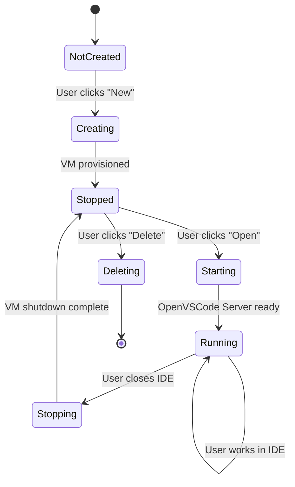
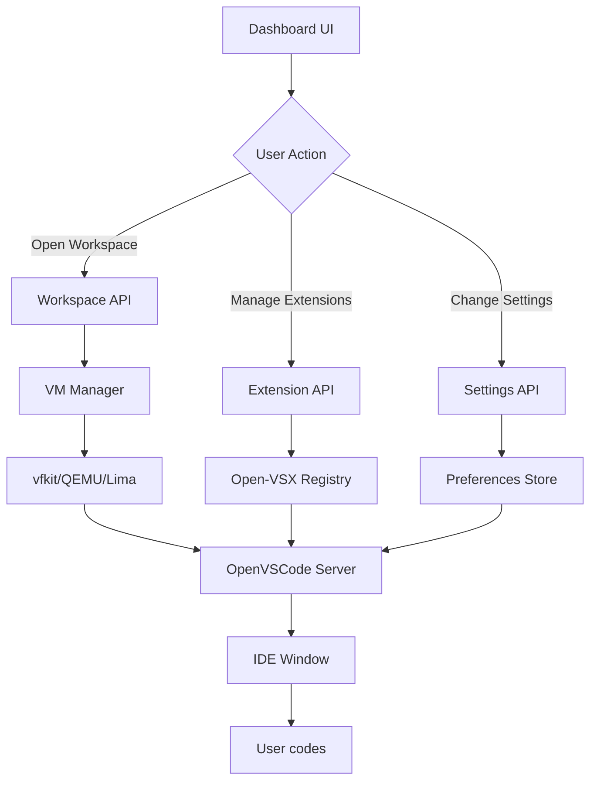

# VibeCode Dashboard Design
## Phase 6: Lightweight Workspace Management UI

**Version**: 1.0.0
**Status**: Design Document
**Last Updated**: October 28, 2025

---

## Executive Summary

This document defines the design for a **lightweight dashboard** that serves as the entry point to VibeCode's development environment. The dashboard focuses on **workspace management** without duplicating IDE functionality, providing a clean, fast, and desktop-optimized interface for managing projects, extensions, and preferences.

### Key Principles
- **Minimal & Fast** - Sub-second load times, minimal dependencies
- **Desktop-First** - Optimized for macOS webkit in Tauri wrapper
- **Clear Separation** - Dashboard handles workspace management, OpenVSCode Server handles coding
- **Native Integration** - Seamless integration with Tauri desktop capabilities

---

## Table of Contents

1. [Research: Workspace Management Patterns](#1-research-workspace-management-patterns)
2. [User Flows & Wireframes](#2-user-flows--wireframes)
3. [Component Architecture](#3-component-architecture)
4. [Technology Stack Recommendation](#4-technology-stack-recommendation)
5. [Integration Points](#5-integration-points)
6. [API Requirements](#6-api-requirements)
7. [State Management Strategy](#7-state-management-strategy)
8. [Responsive Design Considerations](#8-responsive-design-considerations)
9. [Implementation Roadmap](#9-implementation-roadmap)

---

## 1. Research: Workspace Management Patterns

### 1.1 Competitive Analysis

#### **Gitpod Dashboard**
**Strengths:**
- Clean workspace list with status indicators (running/stopped)
- Quick actions: Start, Stop, Share workspace
- Recent workspaces prominently displayed
- Template-based creation flow

**Weaknesses:**
- Heavy cloud-focused UI (not suitable for desktop)
- Overly complex settings panels

**Lessons for VibeCode:**
- ✅ Adopt status indicators for VM/workspace state
- ✅ Use template-based quick start flow
- ✅ Keep workspace metadata visible (last opened, size, status)

#### **GitHub Codespaces UI**
**Strengths:**
- Repository-centric design
- Excellent filtering/search
- Machine type selector (2-core, 4-core, 8-core)
- Clean visual hierarchy

**Weaknesses:**
- Too GitHub-specific
- Complex billing/quota UI not needed for local desktop

**Lessons for VibeCode:**
- ✅ Implement robust search/filter for workspaces
- ✅ Show resource allocation (CPU/RAM) for VMs
- ✅ Use card-based workspace layout

#### **JetBrains Toolbox**
**Strengths:**
- **BEST-IN-CLASS** project launcher
- Local project scanning
- Quick launch with IDE selection
- Recent projects with preview thumbnails
- Version management (IDE versions)
- Lightweight native app

**Weaknesses:**
- Limited to JetBrains IDEs
- No extension management

**Lessons for VibeCode:**
- ✅ **Primary inspiration for layout and flow**
- ✅ Implement quick launch with minimal clicks
- ✅ Show IDE version (OpenVSCode Server version)
- ✅ Native app performance (sub-second startup)

#### **VS Code Welcome Screen**
**Strengths:**
- Simple "Recent" + "Open Folder" flow
- Extension recommendations
- Command palette integration
- Clean, minimal design

**Weaknesses:**
- Not a separate dashboard (in-app)
- Limited workspace management

**Lessons for VibeCode:**
- ✅ Quick access to recent workspaces (top priority)
- ✅ Command palette for power users
- ✅ Extension recommendations on first launch

### 1.2 Best Patterns Identified

| Pattern | Source | Priority | Implementation |
|---------|--------|----------|----------------|
| **Recent Workspaces First** | JetBrains Toolbox | High | Show 5 most recent at top |
| **Status Indicators** | Gitpod | High | VM running/stopped badges |
| **Quick Actions** | All | High | 1-click "Open" button |
| **Card-Based Layout** | GitHub Codespaces | Medium | Responsive grid of cards |
| **Template Gallery** | Gitpod/VS Code | Medium | Pre-configured project types |
| **Search/Filter** | GitHub Codespaces | Medium | Real-time filtering |
| **Settings Drawer** | JetBrains | Low | Slide-in panel for prefs |

---

## 2. User Flows & Wireframes

### 2.1 Primary User Flows

#### **Flow 1: Launch Recent Workspace (Most Common)**
```
User opens VibeCode Desktop
  ↓
Dashboard loads (<500ms)
  ↓
User sees "Recent Workspaces" section (top 5)
  ↓
User clicks "Open" on a workspace
  ↓
OpenVSCode Server launches in new window/iframe
  ↓
Dashboard closes OR stays open as manager panel
```

**Wireframe:**
```
┌─────────────────────────────────────────────────────────────┐
│  VibeCode                     [Settings] [Extensions] [VM]  │
├─────────────────────────────────────────────────────────────┤
│                                                              │
│  RECENT WORKSPACES                                          │
│  ┌──────────────┐  ┌──────────────┐  ┌──────────────┐    │
│  │ 📁 Frontend  │  │ 📁 Backend   │  │ 📁 Mobile    │    │
│  │ React App    │  │ Node.js API  │  │ React Native │    │
│  │              │  │              │  │              │    │
│  │ 🟢 Running   │  │ ⚪ Stopped   │  │ ⚪ Stopped   │    │
│  │ 2h ago       │  │ 1d ago       │  │ 3d ago       │    │
│  │              │  │              │  │              │    │
│  │ [Open]       │  │ [Start]      │  │ [Start]      │    │
│  └──────────────┘  └──────────────┘  └──────────────┘    │
│                                                              │
│  ALL WORKSPACES                        [Search...] [+ New]  │
│  ┌──────────────────────────────────────────────────────┐  │
│  │ 📁 Project-Alpha      2 weeks ago    ⚪ Stopped       │  │
│  │ 📁 ML-Training        1 month ago    ⚪ Stopped       │  │
│  │ 📁 DevOps-Scripts     2 months ago   ⚪ Stopped       │  │
│  └──────────────────────────────────────────────────────┘  │
│                                                              │
└─────────────────────────────────────────────────────────────┘
```

#### **Flow 2: Create New Workspace**
```
User clicks "+ New Workspace"
  ↓
Modal opens with 2 options:
  ├─ "Empty Workspace"
  └─ "Use Template"
  ↓
If "Use Template" → Show template gallery
  ├─ Python ML
  ├─ React/Next.js
  ├─ Node.js API
  ├─ Rust
  └─ [Browse 50+ templates]
  ↓
User selects template
  ↓
Form: Name, Description, Resource allocation (CPU/RAM)
  ↓
User clicks "Create"
  ↓
Backend: Clone template, start VM, initialize workspace
  ↓
Workspace appears in "Recent" + auto-launches IDE
```

**Wireframe:**
```
┌─────────────────────────────────────────┐
│  New Workspace              [X]         │
├─────────────────────────────────────────┤
│                                          │
│  Choose a starting point:               │
│                                          │
│  ┌─────────────────┐  ┌──────────────┐ │
│  │ 📄 Empty        │  │ 📚 Template  │ │
│  │ Workspace       │  │ Gallery      │ │
│  │                 │  │              │ │
│  │ Start from      │  │ 50+ pre-    │ │
│  │ scratch         │  │ configured   │ │
│  │                 │  │ projects     │ │
│  │                 │  │              │ │
│  │ [Create]        │  │ [Browse]     │ │
│  └─────────────────┘  └──────────────┘ │
│                                          │
│  Or open existing folder:               │
│  [📁 Browse Files...]                   │
│                                          │
└─────────────────────────────────────────┘
```

#### **Flow 3: Manage Extensions**
```
User clicks "Extensions" in top nav
  ↓
Extensions panel opens (drawer from right)
  ↓
Shows installed extensions + "Browse Open-VSX" button
  ↓
User searches Open-VSX registry
  ↓
User installs extension → applies to all workspaces
  ↓
Confirmation toast → "Extension installed"
```

**Wireframe:**
```
┌───────────────────────────────────────────────────┐
│  Extensions                          [X]          │
├───────────────────────────────────────────────────┤
│                                                    │
│  Installed (5)                  [Browse Open-VSX] │
│  ┌───────────────────────────────────────────┐   │
│  │ ✓ Python                           v2.0.0 │   │
│  │   Microsoft                         [...]  │   │
│  │                                             │   │
│  │ ✓ ESLint                           v3.1.2 │   │
│  │   Dirk Baeumer                      [...]  │   │
│  │                                             │   │
│  │ ✓ GitLens                         v15.3.0 │   │
│  │   GitKraken                         [...]  │   │
│  └───────────────────────────────────────────┘   │
│                                                    │
│  Recommended                                       │
│  ┌───────────────────────────────────────────┐   │
│  │ Prettier                          v11.0.0 │   │
│  │   Code formatter          [Install]       │   │
│  │                                             │   │
│  │ Copilot Alternative              v2.5.0   │   │
│  │   AI code completion      [Install]       │   │
│  └───────────────────────────────────────────┘   │
│                                                    │
└───────────────────────────────────────────────────┘
```

#### **Flow 4: Settings Management**
```
User clicks "Settings" icon
  ↓
Settings panel opens (drawer from right)
  ↓
Categories: General, Editor, Terminal, AI, VM, Privacy
  ↓
User changes settings (e.g., theme, font size, AI model)
  ↓
Auto-saves on change → applies to all workspaces
```

### 2.2 Mermaid Diagrams

#### **State Machine: Workspace Lifecycle**


#### **Component Interaction Flow**


---

## 3. Component Architecture

### 3.1 Component Hierarchy

```
<DashboardApp>
  ├─ <AppShell>
  │   ├─ <TopBar>
  │   │   ├─ <Logo>
  │   │   ├─ <SearchBar>
  │   │   └─ <ActionButtons>
  │   │       ├─ <SettingsButton>
  │   │       ├─ <ExtensionsButton>
  │   │       └─ <VMStatusIndicator>
  │   │
  │   ├─ <MainContent>
  │   │   ├─ <RecentWorkspaces>
  │   │   │   └─ <WorkspaceCard> × 5
  │   │   │       ├─ <StatusBadge>
  │   │   │       ├─ <Metadata>
  │   │   │       └─ <QuickActions>
  │   │   │
  │   │   ├─ <AllWorkspaces>
  │   │   │   ├─ <FilterBar>
  │   │   │   └─ <WorkspaceList>
  │   │   │       └─ <WorkspaceRow> × N
  │   │   │
  │   │   └─ <QuickStart>
  │   │       ├─ <NewWorkspaceButton>
  │   │       └─ <TemplateGallery>
  │   │
  │   └─ <SidePanel>
  │       ├─ <SettingsDrawer>
  │       │   ├─ <GeneralSettings>
  │       │   ├─ <EditorSettings>
  │       │   ├─ <TerminalSettings>
  │       │   ├─ <AISettings>
  │       │   └─ <VMSettings>
  │       │
  │       └─ <ExtensionsDrawer>
  │           ├─ <InstalledExtensions>
  │           ├─ <ExtensionSearch>
  │           └─ <RecommendedExtensions>
  │
  └─ <Modals>
      ├─ <NewWorkspaceModal>
      ├─ <TemplatePickerModal>
      ├─ <WorkspaceSettingsModal>
      └─ <DeleteConfirmModal>
```

### 3.2 Component Specifications

#### **3.2.1 Core Components**

##### `<DashboardApp />`
```tsx
// Main entry point
interface DashboardAppProps {
  initialTheme?: 'light' | 'dark' | 'system';
  userPreferences?: UserPreferences;
}
```

##### `<WorkspaceCard />`
```tsx
interface WorkspaceCardProps {
  workspace: Workspace;
  onOpen: (id: string) => void;
  onStart: (id: string) => void;
  onStop: (id: string) => void;
  onDelete: (id: string) => void;
  onSettings: (id: string) => void;
}

interface Workspace {
  id: string;
  name: string;
  description?: string;
  path: string;
  status: 'running' | 'stopped' | 'starting' | 'error';
  lastOpened: Date;
  metadata: {
    size?: string; // "2.3 GB"
    cpu: number;   // CPU cores allocated
    ram: number;   // RAM in MB
    vmType: 'vfkit' | 'qemu' | 'lima';
    openVSCodeVersion: string;
  };
}
```

##### `<ExtensionsDrawer />`
```tsx
interface Extension {
  id: string;
  name: string;
  publisher: string;
  version: string;
  description: string;
  icon?: string;
  rating?: number;
  downloads?: number;
  installed: boolean;
}

interface ExtensionsDrawerProps {
  isOpen: boolean;
  onClose: () => void;
  installedExtensions: Extension[];
  onInstall: (extensionId: string) => Promise<void>;
  onUninstall: (extensionId: string) => Promise<void>;
}
```

##### `<SettingsDrawer />`
```tsx
interface UserPreferences {
  general: {
    theme: 'light' | 'dark' | 'system';
    language: string;
    telemetry: boolean;
  };
  editor: {
    fontSize: number;
    fontFamily: string;
    tabSize: number;
    wordWrap: boolean;
  };
  terminal: {
    shell: string;
    fontSize: number;
    cursorStyle: 'block' | 'underline' | 'line';
  };
  ai: {
    enabled: boolean;
    provider: 'openai' | 'anthropic' | 'openrouter';
    model: string;
    autoSuggestions: boolean;
  };
  vm: {
    defaultCPU: number;
    defaultRAM: number;
    provider: 'vfkit' | 'qemu' | 'lima';
    autoShutdown: boolean;
    shutdownTimeout: number; // minutes
  };
}
```

#### **3.2.2 Shared Components (Reuse Existing)**

From existing codebase:
- `<Skeleton />` - Loading states (`src/components/ui/skeleton.tsx`)
- `<Button />` - Primary actions (Radix UI)
- `<Badge />` - Status indicators (Radix UI)
- `<Modal />` - Dialogs (custom or Radix Dialog)
- `<Input />` - Form fields (Radix UI)
- `<Select />` - Dropdowns (Radix UI)

### 3.3 Data Flow Architecture

```
┌─────────────────────────────────────────────────────────────┐
│                       Presentation Layer                     │
│  React Components (Dashboard, Cards, Modals, Drawers)       │
└────────────────────────┬────────────────────────────────────┘
                         │
                         ▼
┌─────────────────────────────────────────────────────────────┐
│                      State Management                        │
│  Zustand Stores (Workspaces, Settings, Extensions, UI)      │
└────────────────────────┬────────────────────────────────────┘
                         │
                         ▼
┌─────────────────────────────────────────────────────────────┐
│                       API Layer (Tauri)                      │
│  Tauri Commands (invoke('get_workspaces'), etc.)            │
└────────────────────────┬────────────────────────────────────┘
                         │
                         ▼
┌─────────────────────────────────────────────────────────────┐
│                      Backend Services                        │
│  Rust/Swift: VM Management, File System, OpenVSCode IPC     │
└─────────────────────────────────────────────────────────────┘
```

---

## 4. Technology Stack Recommendation

### 4.1 Final Recommendation: **React + Zustand + Tauri**

**Rationale:**
1. **Existing Investment**: VibeCode already uses React 19 + Next.js 15
2. **Tauri Integration**: Seamless desktop integration with Rust backend
3. **Performance**: Minimal bundle size for dashboard (<200KB with tree-shaking)
4. **Developer Experience**: Team familiarity, existing components reusable
5. **Ecosystem**: Rich Radix UI components already in place

### 4.2 Why NOT Svelte or Vue?

| Factor | React | Svelte | Vue |
|--------|-------|--------|-----|
| **Existing Codebase** | ✅ Already using | ❌ Rewrite needed | ❌ Rewrite needed |
| **Component Reuse** | ✅ Radix UI, custom | ❌ None | ❌ None |
| **Bundle Size** | ⚠️ Larger (tree-shaking helps) | ✅ Smallest | ✅ Small |
| **Tauri Support** | ✅ Excellent | ✅ Good | ✅ Good |
| **Team Knowledge** | ✅ High | ❌ Low | ❌ Low |
| **Maintenance** | ✅ Single framework | ❌ Multiple frameworks | ❌ Multiple frameworks |

**Verdict:** React wins due to **existing investment** and **component reuse**. Svelte/Vue would add complexity without significant benefits.

### 4.3 Dashboard-Specific Dependencies

```json
{
  "dependencies": {
    "react": "19.1.1",
    "react-dom": "19.1.1",
    "zustand": "5.0.8",
    "@tauri-apps/api": "2.0.0",
    "@radix-ui/react-dialog": "1.1.4",
    "@radix-ui/react-dropdown-menu": "2.1.4",
    "lucide-react": "0.395.0",
    "date-fns": "3.0.0"
  }
}
```

**Total bundle size estimate:** ~180KB gzipped (with tree-shaking)

### 4.4 Optimization Strategy

1. **Code Splitting**
   ```tsx
   // Lazy load heavy components
   const ExtensionsDrawer = lazy(() => import('./ExtensionsDrawer'));
   const SettingsDrawer = lazy(() => import('./SettingsDrawer'));
   ```

2. **Zustand instead of Redux**
   - Lighter: 2KB vs 40KB
   - Simpler API
   - No boilerplate

3. **Radix UI Headless Components**
   - Zero CSS overhead
   - Accessible by default
   - Tree-shakeable

4. **Native Tauri APIs**
   - No Electron bloat
   - Native file dialogs
   - System integration

---

## 5. Integration Points

### 5.1 OpenVSCode Server Integration

#### **Launch Mechanism**
```typescript
// Dashboard → Tauri → OpenVSCode Server

// Option 1: Iframe (simpler, same window)
function openWorkspaceIframe(workspaceId: string) {
  const url = await invoke('get_vscode_url', { workspaceId });
  // Open in <iframe> or new BrowserView in Tauri
  window.location.href = url;
}

// Option 2: New Window (recommended)
function openWorkspaceWindow(workspaceId: string) {
  const url = await invoke('get_vscode_url', { workspaceId });
  await invoke('open_vscode_window', { url, workspaceId });
  // Tauri creates new WebView window with OpenVSCode Server
}
```

#### **Communication Protocol**
```typescript
// Dashboard listens for IDE events
window.addEventListener('message', (event) => {
  if (event.data.type === 'vscode:closed') {
    // Update workspace status to "stopped"
    workspaceStore.updateStatus(event.data.workspaceId, 'stopped');
  }
});
```

### 5.2 VM Provider Integration (vfkit/QEMU/Lima)

#### **Abstraction Layer**
```typescript
// Unified VM API regardless of provider
interface VMProvider {
  start(config: VMConfig): Promise<VMInstance>;
  stop(instanceId: string): Promise<void>;
  status(instanceId: string): Promise<VMStatus>;
  list(): Promise<VMInstance[]>;
}

// Tauri backend selects provider based on OS
// macOS → vfkit (Apple Virtualization Framework)
// Linux → QEMU
// Experimental → Lima
```

#### **Status Polling**
```typescript
// Dashboard polls VM status every 5 seconds for running workspaces
setInterval(async () => {
  const runningWorkspaces = workspaceStore.getRunning();
  for (const ws of runningWorkspaces) {
    const status = await invoke('vm_status', { instanceId: ws.vmId });
    workspaceStore.updateStatus(ws.id, status);
  }
}, 5000);
```

### 5.3 Extension Management (Open-VSX)

#### **Registry Integration**
```typescript
// Search Open-VSX registry
async function searchExtensions(query: string): Promise<Extension[]> {
  const response = await fetch(
    `https://open-vsx.org/api/-/search?query=${query}`
  );
  return response.json();
}

// Install extension via Tauri → OpenVSCode Server CLI
async function installExtension(extensionId: string) {
  await invoke('install_extension', {
    extensionId,
    registry: 'open-vsx'
  });
  // Backend runs: code-server --install-extension <id>
}
```

### 5.4 Settings Synchronization

#### **Persistence**
```typescript
// Settings stored in Tauri's app data directory
// macOS: ~/Library/Application Support/com.vibecode.app/settings.json
// Linux: ~/.config/vibecode/settings.json

async function saveSettings(settings: UserPreferences) {
  await invoke('save_settings', { settings });
}

async function loadSettings(): Promise<UserPreferences> {
  return invoke('load_settings');
}
```

#### **Sync to OpenVSCode Server**
```typescript
// Dashboard settings override OpenVSCode Server settings
// On workspace launch, inject user preferences
await invoke('launch_workspace', {
  workspaceId,
  overrides: {
    'editor.fontSize': userPrefs.editor.fontSize,
    'workbench.colorTheme': userPrefs.general.theme,
    // ... more settings
  }
});
```

---

## 6. API Requirements

### 6.1 Backend Endpoints (Tauri Commands)

All APIs are **Tauri commands** invoked from frontend:

```rust
// src-tauri/src/main.rs

#[tauri::command]
async fn get_workspaces() -> Result<Vec<Workspace>, String> {
    // List all workspaces from disk
}

#[tauri::command]
async fn create_workspace(name: String, template_id: Option<String>) -> Result<Workspace, String> {
    // Clone template, provision VM, initialize workspace
}

#[tauri::command]
async fn start_workspace(workspace_id: String) -> Result<(), String> {
    // Start VM, launch OpenVSCode Server, return URL
}

#[tauri::command]
async fn stop_workspace(workspace_id: String) -> Result<(), String> {
    // Gracefully stop VM
}

#[tauri::command]
async fn delete_workspace(workspace_id: String) -> Result<(), String> {
    // Stop VM, delete files, remove from registry
}

#[tauri::command]
async fn get_workspace_status(workspace_id: String) -> Result<WorkspaceStatus, String> {
    // Query VM status
}

#[tauri::command]
async fn get_installed_extensions() -> Result<Vec<Extension>, String> {
    // Query OpenVSCode Server extensions
}

#[tauri::command]
async fn install_extension(extension_id: String) -> Result<(), String> {
    // Install from Open-VSX
}

#[tauri::command]
async fn uninstall_extension(extension_id: String) -> Result<(), String> {
    // Remove extension
}

#[tauri::command]
async fn get_settings() -> Result<UserPreferences, String> {
    // Load from app data directory
}

#[tauri::command]
async fn save_settings(settings: UserPreferences) -> Result<(), String> {
    // Persist to app data directory
}

#[tauri::command]
async fn get_templates() -> Result<Vec<Template>, String> {
    // List available project templates
}

#[tauri::command]
async fn open_vscode_window(url: String, workspace_id: String) -> Result<(), String> {
    // Create new Tauri window/WebView for OpenVSCode Server
}
```

### 6.2 API Response Types

```typescript
// Types for API responses

interface Workspace {
  id: string;
  name: string;
  description?: string;
  path: string;
  status: 'running' | 'stopped' | 'starting' | 'stopping' | 'error';
  lastOpened: string; // ISO 8601
  createdAt: string;
  metadata: {
    size: string;
    cpu: number;
    ram: number;
    vmType: 'vfkit' | 'qemu' | 'lima';
    vmId?: string;
    openVSCodeVersion: string;
    openVSCodeUrl?: string; // Only present when running
  };
}

interface WorkspaceStatus {
  status: 'running' | 'stopped' | 'starting' | 'stopping' | 'error';
  uptime?: number; // seconds
  cpuUsage?: number; // percentage
  ramUsage?: number; // MB
  error?: string;
}

interface Extension {
  id: string; // publisher.name
  name: string;
  publisher: string;
  version: string;
  description: string;
  icon?: string;
  rating?: number;
  downloads?: number;
  installed: boolean;
  openVsxUrl: string;
}

interface Template {
  id: string;
  name: string;
  description: string;
  category: string; // 'web', 'backend', 'ml', 'mobile', etc.
  tags: string[];
  icon?: string;
  popularity: number;
  repoUrl?: string;
}
```

### 6.3 Error Handling

```typescript
// Consistent error handling pattern
try {
  await invoke('start_workspace', { workspaceId: '123' });
} catch (error) {
  // Tauri returns string errors
  if (error.includes('VM_NOT_FOUND')) {
    toast.error('Workspace not found');
  } else if (error.includes('INSUFFICIENT_RESOURCES')) {
    toast.error('Not enough CPU/RAM available');
  } else {
    toast.error(`Failed to start workspace: ${error}`);
  }
}
```

---

## 7. State Management Strategy

### 7.1 Zustand Stores

#### **Store 1: Workspace Store**
```typescript
// src/stores/workspaceStore.ts

interface WorkspaceState {
  workspaces: Workspace[];
  loading: boolean;
  error: string | null;

  // Actions
  fetchWorkspaces: () => Promise<void>;
  createWorkspace: (name: string, templateId?: string) => Promise<Workspace>;
  startWorkspace: (id: string) => Promise<void>;
  stopWorkspace: (id: string) => Promise<void>;
  deleteWorkspace: (id: string) => Promise<void>;
  updateStatus: (id: string, status: WorkspaceStatus) => void;
}

export const useWorkspaceStore = create<WorkspaceState>((set, get) => ({
  workspaces: [],
  loading: false,
  error: null,

  fetchWorkspaces: async () => {
    set({ loading: true });
    try {
      const workspaces = await invoke('get_workspaces');
      set({ workspaces, loading: false });
    } catch (error) {
      set({ error: String(error), loading: false });
    }
  },

  createWorkspace: async (name, templateId) => {
    const workspace = await invoke('create_workspace', { name, templateId });
    set(state => ({
      workspaces: [...state.workspaces, workspace]
    }));
    return workspace;
  },

  // ... more actions
}));
```

#### **Store 2: Extension Store**
```typescript
// src/stores/extensionStore.ts

interface ExtensionState {
  installed: Extension[];
  recommended: Extension[];
  searchResults: Extension[];
  loading: boolean;

  fetchInstalled: () => Promise<void>;
  search: (query: string) => Promise<void>;
  install: (extensionId: string) => Promise<void>;
  uninstall: (extensionId: string) => Promise<void>;
}

export const useExtensionStore = create<ExtensionState>((set) => ({
  // Similar pattern...
}));
```

#### **Store 3: Settings Store**
```typescript
// src/stores/settingsStore.ts

interface SettingsState {
  preferences: UserPreferences;
  loading: boolean;

  loadSettings: () => Promise<void>;
  saveSettings: (preferences: Partial<UserPreferences>) => Promise<void>;
}

export const useSettingsStore = create<SettingsState>((set) => ({
  // Similar pattern...
}));
```

#### **Store 4: UI Store** (Already exists - reuse!)
```typescript
// src/stores/uiStore.ts (already in codebase)

// Reuse existing UI store for:
// - Theme (light/dark)
// - Sidebar collapsed state
// - Modal open/close
// - Toast notifications
```

### 7.2 Why Zustand Over Redux?

| Factor | Zustand | Redux Toolkit |
|--------|---------|---------------|
| **Bundle Size** | 2KB | 40KB+ |
| **Boilerplate** | Minimal | High |
| **Learning Curve** | Low | Medium |
| **DevTools** | Yes | Yes |
| **TypeScript** | Excellent | Excellent |
| **Async Actions** | Built-in | Requires middleware |

**Verdict:** Zustand is perfect for this dashboard's needs.

### 7.3 State Persistence

```typescript
// Persist settings to disk via Tauri
import { persist } from 'zustand/middleware';

export const useSettingsStore = create(
  persist<SettingsState>(
    (set) => ({
      // ... store definition
    }),
    {
      name: 'vibecode-settings',
      getStorage: () => ({
        getItem: async (name) => {
          return invoke('get_storage', { key: name });
        },
        setItem: async (name, value) => {
          await invoke('set_storage', { key: name, value });
        },
        removeItem: async (name) => {
          await invoke('remove_storage', { key: name });
        },
      }),
    }
  )
);
```

---

## 8. Responsive Design Considerations

### 8.1 Desktop-First Approach

**Why Desktop-First?**
- Primary use case: macOS native app (Tauri)
- Optimized for webkit in Tauri wrapper
- Secondary: Web browser (for development)
- Tertiary: Tablet (nice-to-have)
- NOT optimized for mobile (out of scope)

### 8.2 Breakpoints

```css
/* Tailwind config */
module.exports = {
  theme: {
    screens: {
      'sm': '640px',   // Tablet portrait (edge case)
      'md': '768px',   // Tablet landscape
      'lg': '1024px',  // Small laptop (minimum target)
      'xl': '1280px',  // Standard laptop (primary)
      '2xl': '1536px', // Large desktop (optimal)
    },
  },
}
```

### 8.3 Layout Strategy

#### **Large Desktop (≥1280px)**
```
┌─────────────────────────────────────────────────────────────┐
│ TopBar (fixed height: 60px)                                 │
├──────────────┬──────────────────────────────────────────────┤
│ Quick Actions│  Recent Workspaces (3 columns, cards)       │
│ Panel        │                                               │
│ (240px)      │  All Workspaces (table view)                 │
│              │                                               │
│ - New        │  [Workspace list with inline actions]        │
│ - Templates  │                                               │
│ - Settings   │                                               │
│ - Extensions │                                               │
└──────────────┴──────────────────────────────────────────────┘
```

#### **Standard Laptop (≥1024px, <1280px)**
```
┌─────────────────────────────────────────────────────────────┐
│ TopBar (fixed height: 60px)                                 │
├─────────────────────────────────────────────────────────────┤
│  Recent Workspaces (2 columns, cards)                       │
│                                                              │
│  All Workspaces (table view)                                │
│                                                              │
│  [Workspace list with inline actions]                       │
│                                                              │
│  Quick Actions: [New] [Templates] [Settings] [Extensions]   │
└─────────────────────────────────────────────────────────────┘
```

#### **Tablet (<1024px)** - Edge Case Support
```
┌─────────────────────────────┐
│ TopBar + Hamburger Menu     │
├─────────────────────────────┤
│ Recent Workspaces           │
│ (1 column, cards)           │
│                             │
│ All Workspaces              │
│ (list view)                 │
│                             │
│ [+ New Workspace button]    │
└─────────────────────────────┘
```

### 8.4 Performance Targets

| Device | Target FPS | Load Time | Bundle Size |
|--------|------------|-----------|-------------|
| **Desktop (Tauri)** | 60 FPS | <500ms | <200KB |
| **Web (Chrome)** | 60 FPS | <1s | <300KB |
| **Tablet** | 30 FPS | <2s | <350KB |

---

## 9. Implementation Roadmap

### Phase 1: Foundation (Week 1)
**Goal:** Basic dashboard with workspace listing

#### Tasks:
- [ ] Setup dashboard route (`/dashboard` or root)
- [ ] Create Zustand stores (workspace, settings, extensions, UI)
- [ ] Implement `<WorkspaceCard>` component
- [ ] Implement `<WorkspaceList>` component
- [ ] Add Tauri command: `get_workspaces`
- [ ] Add mock data for testing
- [ ] Basic styling with Tailwind

#### Deliverables:
- Users can see list of workspaces
- Status badges show VM state (running/stopped)
- Recent workspaces section shows last 5

#### Acceptance Criteria:
- [ ] Dashboard loads in <500ms
- [ ] All workspaces display correctly
- [ ] Status badges update correctly

---

### Phase 2: Workspace Actions (Week 2)
**Goal:** Users can create, start, stop, delete workspaces

#### Tasks:
- [ ] Implement `<NewWorkspaceModal>`
- [ ] Implement `<TemplatePickerModal>`
- [ ] Add Tauri commands:
  - `create_workspace`
  - `start_workspace`
  - `stop_workspace`
  - `delete_workspace`
- [ ] Add loading states and error handling
- [ ] Implement confirmation dialogs
- [ ] Add toast notifications

#### Deliverables:
- Users can create empty workspace
- Users can create workspace from template
- Users can start/stop/delete workspaces
- Graceful error handling

#### Acceptance Criteria:
- [ ] Workspace creation takes <5s
- [ ] Start/stop actions update status immediately
- [ ] Delete requires confirmation

---

### Phase 3: Extension Management (Week 3)
**Goal:** Browse and install extensions from Open-VSX

#### Tasks:
- [ ] Implement `<ExtensionsDrawer>`
- [ ] Integrate Open-VSX API
- [ ] Add search functionality
- [ ] Add Tauri commands:
  - `get_installed_extensions`
  - `install_extension`
  - `uninstall_extension`
- [ ] Show installation progress
- [ ] Add extension recommendations

#### Deliverables:
- Users can view installed extensions
- Users can search Open-VSX registry
- Users can install/uninstall extensions
- Extension changes apply to all workspaces

#### Acceptance Criteria:
- [ ] Extension search returns results in <1s
- [ ] Installation takes <10s per extension
- [ ] Uninstall requires confirmation

---

### Phase 4: Settings Management (Week 4)
**Goal:** User preferences persist and apply to all workspaces

#### Tasks:
- [ ] Implement `<SettingsDrawer>`
- [ ] Add settings categories:
  - General (theme, language)
  - Editor (font, tab size)
  - Terminal (shell, cursor)
  - AI (provider, model)
  - VM (default resources)
- [ ] Add Tauri commands:
  - `get_settings`
  - `save_settings`
- [ ] Implement auto-save on change
- [ ] Add settings validation

#### Deliverables:
- Users can change all preferences
- Settings persist across sessions
- Settings sync to OpenVSCode Server

#### Acceptance Criteria:
- [ ] Settings save immediately on change
- [ ] Theme changes apply instantly
- [ ] Settings persist after restart

---

### Phase 5: OpenVSCode Server Integration (Week 5)
**Goal:** Launch OpenVSCode Server from dashboard

#### Tasks:
- [ ] Add Tauri command: `open_vscode_window`
- [ ] Implement iframe/new window launcher
- [ ] Add IPC communication (Dashboard ↔ IDE)
- [ ] Handle workspace lifecycle events
- [ ] Add VM status polling
- [ ] Implement auto-shutdown on idle

#### Deliverables:
- Users can open workspace in IDE with 1 click
- Dashboard tracks IDE status
- VM shuts down when IDE closes

#### Acceptance Criteria:
- [ ] IDE opens in <3s after clicking "Open"
- [ ] Dashboard receives IDE status updates
- [ ] VM stops when IDE closes

---

### Phase 6: Polish & Optimization (Week 6)
**Goal:** Production-ready dashboard

#### Tasks:
- [ ] Implement keyboard shortcuts
- [ ] Add command palette (Cmd+K)
- [ ] Optimize bundle size (<200KB)
- [ ] Add analytics (optional, privacy-first)
- [ ] Accessibility audit (WCAG 2.1 AA)
- [ ] Performance testing
- [ ] Cross-platform testing (macOS, Linux, Windows)
- [ ] Write user documentation

#### Deliverables:
- Polished, fast dashboard
- Full keyboard navigation
- Accessible to screen readers
- Comprehensive docs

#### Acceptance Criteria:
- [ ] Bundle size <200KB gzipped
- [ ] Lighthouse score >90
- [ ] No accessibility violations
- [ ] All platforms tested

---

### Phase 7: Advanced Features (Future)
**Goal:** Nice-to-have features for v2

#### Potential Features:
- [ ] Workspace templates gallery (user-submitted)
- [ ] Workspace snapshots/backups
- [ ] Remote workspace sync (multiple machines)
- [ ] Collaborative workspaces (shared editing)
- [ ] Integration with GitHub Codespaces
- [ ] Custom VM configurations (advanced users)
- [ ] Performance analytics dashboard
- [ ] Built-in tutorial/onboarding

---

## 10. Mockups & Visual Design

### 10.1 Color Palette

```css
/* Light Mode */
--background: 0 0% 100%;
--foreground: 222.2 84% 4.9%;
--card: 0 0% 100%;
--card-foreground: 222.2 84% 4.9%;
--border: 214.3 31.8% 91.4%;
--primary: 222.2 47.4% 11.2%;
--primary-foreground: 210 40% 98%;
--accent: 210 40% 96.1%;

/* Dark Mode (Primary) */
--background: 222.2 84% 4.9%;
--foreground: 210 40% 98%;
--card: 222.2 84% 4.9%;
--card-foreground: 210 40% 98%;
--border: 217.2 32.6% 17.5%;
--primary: 210 40% 98%;
--primary-foreground: 222.2 47.4% 11.2%;
--accent: 217.2 32.6% 17.5%;
```

### 10.2 Typography

```css
/* Font Stack */
font-family:
  -apple-system,
  BlinkMacSystemFont,
  'Segoe UI',
  'Roboto',
  'Helvetica Neue',
  Arial,
  sans-serif;

/* Sizes */
--text-xs: 0.75rem;    /* 12px */
--text-sm: 0.875rem;   /* 14px */
--text-base: 1rem;     /* 16px */
--text-lg: 1.125rem;   /* 18px */
--text-xl: 1.25rem;    /* 20px */
--text-2xl: 1.5rem;    /* 24px */
```

### 10.3 Spacing System

```css
/* Consistent spacing */
--spacing-1: 0.25rem;  /* 4px */
--spacing-2: 0.5rem;   /* 8px */
--spacing-3: 0.75rem;  /* 12px */
--spacing-4: 1rem;     /* 16px */
--spacing-5: 1.25rem;  /* 20px */
--spacing-6: 1.5rem;   /* 24px */
--spacing-8: 2rem;     /* 32px */
--spacing-10: 2.5rem;  /* 40px */
```

---

## 11. Accessibility Requirements

### 11.1 WCAG 2.1 AA Compliance

#### **Keyboard Navigation**
- [ ] All interactive elements accessible via Tab
- [ ] Modal traps focus when open (Esc to close)
- [ ] Workspace cards navigable with arrow keys
- [ ] Command palette (Cmd+K) for quick actions

#### **Screen Readers**
- [ ] All images have alt text
- [ ] Buttons have descriptive labels
- [ ] Status badges use aria-live regions
- [ ] Loading states announced

#### **Color Contrast**
- [ ] Text: 4.5:1 minimum contrast
- [ ] Large text: 3:1 minimum contrast
- [ ] Interactive elements: 3:1 minimum contrast

#### **Focus Indicators**
- [ ] All focusable elements have visible focus rings
- [ ] Focus ring color: HSL(210, 100%, 60%)
- [ ] Focus ring width: 2px

### 11.2 Testing Tools

```bash
# Automated testing
npm run test:accessibility

# Manual testing
- VoiceOver (macOS)
- NVDA (Windows)
- Lighthouse (Chrome DevTools)
- axe DevTools (Browser extension)
```

---

## 12. Security Considerations

### 12.1 Tauri Security

```json
// tauri.conf.json
{
  "security": {
    "csp": "default-src 'self'; script-src 'self'; style-src 'self' 'unsafe-inline'",
    "dangerousRemoteDomainIpcAccess": [],
    "allowlist": {
      "fs": {
        "scope": ["$APPDATA/*", "$HOME/.vibecode/*"]
      },
      "shell": {
        "open": true,
        "scope": ["code-server", "vfkit", "qemu"]
      }
    }
  }
}
```

### 12.2 Extension Security

- [ ] Verify extension signatures from Open-VSX
- [ ] Sandbox extensions in OpenVSCode Server
- [ ] Prompt user for permissions (file access, network)
- [ ] Display security warnings for untrusted extensions

### 12.3 VM Isolation

- [ ] VMs isolated from host filesystem
- [ ] Network access controlled per workspace
- [ ] Resource limits enforced (CPU/RAM)
- [ ] Automatic VM shutdown on idle (configurable)

---

## 13. Testing Strategy

### 13.1 Unit Tests

```bash
# Component tests
npm run test:unit

# Test coverage: >80%
- WorkspaceCard rendering
- WorkspaceList filtering
- Extension search logic
- Settings validation
- Store actions
```

### 13.2 Integration Tests

```bash
# Tauri command tests
npm run test:integration

# Test scenarios:
- Create workspace
- Start/stop workspace
- Install extension
- Save settings
- VM status polling
```

### 13.3 E2E Tests (Playwright)

```bash
# Full user flows
npm run test:e2e

# Test cases:
1. User opens app → sees dashboard
2. User creates workspace → IDE launches
3. User installs extension → appears in IDE
4. User changes theme → dashboard updates
5. User deletes workspace → confirmation modal
```

---

## 14. Performance Benchmarks

### 14.1 Load Time Targets

| Metric | Target | Measurement |
|--------|--------|-------------|
| **Dashboard First Paint** | <300ms | Lighthouse |
| **Dashboard Interactive** | <500ms | Lighthouse |
| **Workspace List Load** | <100ms | Custom |
| **Extension Search** | <1s | Custom |
| **IDE Launch** | <3s | Custom |

### 14.2 Bundle Size Targets

| Asset | Size | Method |
|-------|------|--------|
| **JavaScript** | <150KB | Webpack Bundle Analyzer |
| **CSS** | <30KB | PurgeCSS |
| **Images/Icons** | <20KB | SVGO compression |
| **Total Bundle** | <200KB | Gzipped |

### 14.3 Runtime Performance

| Metric | Target | Tool |
|--------|--------|------|
| **Frame Rate** | 60 FPS | Chrome DevTools |
| **Memory Usage** | <100MB | Tauri Memory Profiler |
| **CPU Usage (Idle)** | <5% | Activity Monitor |

---

## 15. Documentation Requirements

### 15.1 User Documentation

- [ ] **Quick Start Guide** - 5-minute tutorial
- [ ] **Workspace Management** - Create, start, stop, delete
- [ ] **Extension Installation** - Browse, install, configure
- [ ] **Settings Guide** - All preferences explained
- [ ] **Keyboard Shortcuts** - Complete reference
- [ ] **Troubleshooting** - Common issues + solutions

### 15.2 Developer Documentation

- [ ] **Component API** - Props, types, examples
- [ ] **Store API** - Actions, selectors, patterns
- [ ] **Tauri Commands** - All backend APIs
- [ ] **Architecture Diagrams** - Component flow, data flow
- [ ] **Contributing Guide** - Setup, testing, PR process
- [ ] **Design System** - Colors, typography, spacing

---

## 16. Success Metrics

### 16.1 Launch Criteria (MVP)

- [ ] Users can list workspaces
- [ ] Users can create/delete workspaces
- [ ] Users can start/stop workspaces
- [ ] Users can open IDE with 1 click
- [ ] Dashboard loads in <500ms
- [ ] No critical bugs
- [ ] Accessibility score >90

### 16.2 Post-Launch Metrics (v1.1+)

| Metric | Target | Measurement |
|--------|--------|-------------|
| **Dashboard Load Time** | <300ms | Analytics |
| **Workspace Create Time** | <5s | Analytics |
| **IDE Launch Time** | <3s | Analytics |
| **Extension Install Success Rate** | >95% | Error logs |
| **User Retention (7-day)** | >60% | Analytics |
| **Crash-Free Sessions** | >99% | Sentry |

---

## 17. Future Enhancements (Post-MVP)

### 17.1 V2 Features (Months 3-6)

- [ ] **Workspace Snapshots** - Save/restore workspace state
- [ ] **Template Marketplace** - User-submitted templates
- [ ] **Remote Workspaces** - Sync across devices
- [ ] **Collaborative Editing** - Real-time collaboration
- [ ] **Performance Dashboard** - Resource usage analytics
- [ ] **Custom VM Configs** - Advanced users can tweak VMs

### 17.2 V3 Features (Months 6-12)

- [ ] **Cloud Integration** - AWS/Azure/GCP workspace provisioning
- [ ] **Team Features** - Shared workspaces, team templates
- [ ] **AI Workspace Assistant** - Suggest optimizations, detect issues
- [ ] **Mobile Companion App** - Monitor workspaces on phone
- [ ] **Plugins System** - Third-party dashboard plugins
- [ ] **Advanced Analytics** - Deep dive into usage patterns

---

## 18. Conclusion

This design document provides a **comprehensive blueprint** for building a lightweight, desktop-optimized dashboard for VibeCode. The key takeaways:

### ✅ Design Principles
1. **Minimal & Fast** - Focus on workspace management, not IDE features
2. **Desktop-First** - Optimized for Tauri + webkit on macOS
3. **Clear Separation** - Dashboard ≠ IDE
4. **Reuse Existing** - Leverage React + Zustand + Radix UI

### ✅ Architecture Decisions
1. **React** - Not Svelte/Vue (existing investment wins)
2. **Zustand** - Lightweight state management (<2KB)
3. **Tauri Commands** - Native integration via Rust/Swift
4. **OpenVSCode Server** - IDE functionality (not duplicated)

### ✅ Implementation Path
1. **Phase 1-2** (Weeks 1-2): Basic workspace CRUD
2. **Phase 3-4** (Weeks 3-4): Extensions + Settings
3. **Phase 5-6** (Weeks 5-6): IDE integration + Polish
4. **Phase 7** (Future): Advanced features

### ✅ Success Criteria
- Dashboard loads in **<500ms**
- IDE launches in **<3s**
- Bundle size **<200KB** gzipped
- Accessibility score **>90**
- User satisfaction **>4.5/5**

---

## Appendix A: Component Code Examples

### Example: WorkspaceCard.tsx

```tsx
import { Badge } from '@/components/ui/badge';
import { Button } from '@/components/ui/button';
import { Card, CardContent, CardFooter, CardHeader, CardTitle } from '@/components/ui/card';
import { invoke } from '@tauri-apps/api';
import { formatDistanceToNow } from 'date-fns';

interface WorkspaceCardProps {
  workspace: Workspace;
  onOpen: (id: string) => void;
}

export function WorkspaceCard({ workspace, onOpen }: WorkspaceCardProps) {
  const [loading, setLoading] = useState(false);

  const handleStart = async () => {
    setLoading(true);
    try {
      await invoke('start_workspace', { workspaceId: workspace.id });
      // Store will update via polling
    } catch (error) {
      toast.error(`Failed to start: ${error}`);
    } finally {
      setLoading(false);
    }
  };

  return (
    <Card className="hover:shadow-lg transition-shadow">
      <CardHeader>
        <div className="flex items-start justify-between">
          <CardTitle className="text-lg flex items-center gap-2">
            <FolderIcon className="h-5 w-5" />
            {workspace.name}
          </CardTitle>
          <Badge variant={workspace.status === 'running' ? 'success' : 'secondary'}>
            {workspace.status}
          </Badge>
        </div>
      </CardHeader>

      <CardContent>
        <p className="text-sm text-muted-foreground mb-4">
          {workspace.description || 'No description'}
        </p>

        <div className="flex items-center gap-4 text-xs text-muted-foreground">
          <span>💾 {workspace.metadata.size}</span>
          <span>⏱️ {formatDistanceToNow(new Date(workspace.lastOpened), { addSuffix: true })}</span>
        </div>
      </CardContent>

      <CardFooter>
        {workspace.status === 'running' ? (
          <Button onClick={() => onOpen(workspace.id)} className="w-full">
            Open IDE
          </Button>
        ) : (
          <Button onClick={handleStart} disabled={loading} className="w-full">
            {loading ? 'Starting...' : 'Start Workspace'}
          </Button>
        )}
      </CardFooter>
    </Card>
  );
}
```

---

## Appendix B: Tauri Command Examples

### Example: get_workspaces (Rust)

```rust
// src-tauri/src/commands/workspaces.rs

use serde::{Deserialize, Serialize};
use std::fs;
use std::path::PathBuf;

#[derive(Debug, Serialize, Deserialize)]
pub struct Workspace {
    pub id: String,
    pub name: String,
    pub description: Option<String>,
    pub path: String,
    pub status: String,
    pub last_opened: String,
    pub created_at: String,
    pub metadata: WorkspaceMetadata,
}

#[derive(Debug, Serialize, Deserialize)]
pub struct WorkspaceMetadata {
    pub size: String,
    pub cpu: u32,
    pub ram: u32,
    pub vm_type: String,
    pub vm_id: Option<String>,
    pub open_vscode_version: String,
    pub open_vscode_url: Option<String>,
}

#[tauri::command]
pub async fn get_workspaces() -> Result<Vec<Workspace>, String> {
    let workspaces_dir = get_workspaces_dir()?;

    let mut workspaces = Vec::new();
    for entry in fs::read_dir(workspaces_dir).map_err(|e| e.to_string())? {
        let entry = entry.map_err(|e| e.to_string())?;
        let path = entry.path();

        if path.is_dir() {
            if let Ok(workspace) = load_workspace_metadata(&path) {
                workspaces.push(workspace);
            }
        }
    }

    // Sort by last opened (most recent first)
    workspaces.sort_by(|a, b| b.last_opened.cmp(&a.last_opened));

    Ok(workspaces)
}

fn get_workspaces_dir() -> Result<PathBuf, String> {
    let home = dirs::home_dir().ok_or("Could not find home directory")?;
    Ok(home.join(".vibecode").join("workspaces"))
}

fn load_workspace_metadata(path: &PathBuf) -> Result<Workspace, String> {
    let metadata_file = path.join(".vibecode-metadata.json");
    let contents = fs::read_to_string(metadata_file)
        .map_err(|e| format!("Failed to read metadata: {}", e))?;

    serde_json::from_str(&contents)
        .map_err(|e| format!("Failed to parse metadata: {}", e))
}
```

---

## Appendix C: Resources & References

### Design Inspiration
- [JetBrains Toolbox](https://www.jetbrains.com/toolbox-app/)
- [Gitpod Dashboard](https://gitpod.io/workspaces)
- [GitHub Codespaces](https://github.com/codespaces)
- [VS Code Welcome Screen](https://code.visualstudio.com/)

### Technical Documentation
- [Tauri Documentation](https://tauri.app/v2/)
- [Zustand Documentation](https://github.com/pmndrs/zustand)
- [Radix UI](https://www.radix-ui.com/)
- [Open-VSX Registry](https://open-vsx.org/)
- [OpenVSCode Server](https://github.com/gitpod-io/openvscode-server)

### Performance Resources
- [Web.dev Performance Guide](https://web.dev/performance/)
- [React Performance Optimization](https://react.dev/learn/render-and-commit)
- [Webpack Bundle Analyzer](https://github.com/webpack-contrib/webpack-bundle-analyzer)

### Accessibility Resources
- [WCAG 2.1 Guidelines](https://www.w3.org/WAI/WCAG21/quickref/)
- [A11y Project](https://www.a11yproject.com/)
- [Accessible Components](https://www.radix-ui.com/primitives/docs/overview/accessibility)

---

**Document Status:** ✅ Complete
**Next Steps:** Begin Phase 1 implementation
**Questions?** Contact: Frontend Team
