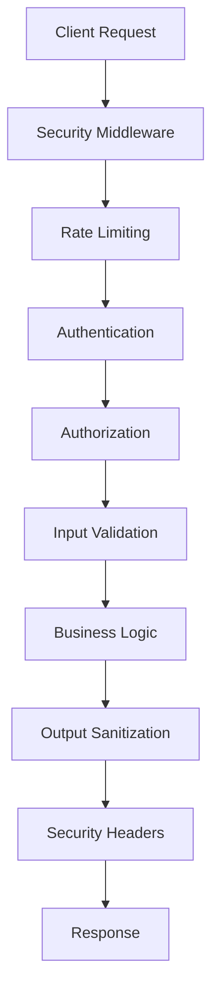

# API Security Best Practices

This guide provides comprehensive security best practices for developing secure APIs in VibeCode WebGUI.

## Overview

API security is multi-layered, involving authentication, authorization, input validation, rate limiting, and monitoring. This guide covers practical implementation patterns and security measures.

## Security Layers



## Authentication & Authorization

### JWT Token Validation

```typescript
import { getToken } from 'next-auth/jwt';
import { NextRequest } from 'next/server';

async function validateAuth(req: NextRequest): Promise<{ user: any } | null> {
  try {
    const token = await getToken({
      req,
      secret: process.env.NEXTAUTH_SECRET
    });

    if (!token) {
      return null;
    }

    return { user: token };
  } catch (error) {
    console.error('Token validation failed:', error);
    return null;
  }
}

// Usage in API route
export async function POST(req: NextRequest) {
  const auth = await validateAuth(req);
  if (!auth) {
    return NextResponse.json({ error: 'Unauthorized' }, { status: 401 });
  }

  // Continue with authenticated request
}
```

### Role-Based Access Control (RBAC)

```typescript
enum UserRole {
  USER = 'user',
  ADMIN = 'admin',
  DEVELOPER = 'developer'
}

interface AuthUser {
  id: string;
  email: string;
  role: UserRole;
}

function requireRole(allowedRoles: UserRole[]) {
  return function(handler: (req: NextRequest, user: AuthUser) => Promise<NextResponse>) {
    return async (req: NextRequest): Promise<NextResponse> => {
      const auth = await validateAuth(req);
      if (!auth) {
        return NextResponse.json({ error: 'Unauthorized' }, { status: 401 });
      }

      if (!allowedRoles.includes(auth.user.role)) {
        return NextResponse.json({ 
          error: 'Forbidden',
          message: `Required role: ${allowedRoles.join(' or ')}` 
        }, { status: 403 });
      }

      return handler(req, auth.user);
    };
  };
}

// Usage
export const DELETE = requireRole([UserRole.ADMIN])(async (req, user) => {
  // Only admins can access this endpoint
  return NextResponse.json({ success: true });
});
```

### API Key Authentication

```typescript
// Alternative authentication for external integrations
function validateAPIKey(req: NextRequest): { valid: boolean; userId?: string } {
  const apiKey = req.headers.get('x-api-key');
  if (!apiKey) {
    return { valid: false };
  }

  // Verify API key (implement your own logic)
  const userId = verifyAPIKey(apiKey);
  return { valid: !!userId, userId };
}

export async function GET(req: NextRequest) {
  // Try JWT first, then API key
  const auth = await validateAuth(req);
  if (!auth) {
    const apiAuth = validateAPIKey(req);
    if (!apiAuth.valid) {
      return NextResponse.json({ error: 'Unauthorized' }, { status: 401 });
    }
  }

  // Continue with request
}
```

## Input Validation

### Comprehensive Validation Pipeline

```typescript
import { z } from 'zod';
import { NextRequest, NextResponse } from 'next/server';

// Input sanitization
function sanitizeString(input: string): string {
  return input
    .trim()
    .replace(/[<>]/g, '') // Remove potential HTML
    .replace(/[^\x20-\x7E]/g, ''); // Remove non-printable characters
}

// Validation middleware
function withValidation<T>(schema: z.ZodSchema<T>) {
  return function(handler: (req: NextRequest, data: T) => Promise<NextResponse>) {
    return async (req: NextRequest): Promise<NextResponse> => {
      try {
        // Parse and validate request body
        const body = await req.json();
        const validatedData = schema.parse(body);

        return handler(req, validatedData);
      } catch (error) {
        if (error instanceof z.ZodError) {
          return NextResponse.json({
            error: 'Validation failed',
            details: error.errors.map(err => ({
              field: err.path.join('.'),
              message: err.message
            }))
          }, { status: 400 });
        }

        return NextResponse.json({ 
          error: 'Invalid request format' 
        }, { status: 400 });
      }
    };
  };
}

// Example usage
const createWorkspaceSchema = z.object({
  projectName: z.string()
    .min(1, 'Project name is required')
    .max(200, 'Project name too long')
    .transform(sanitizeString),
  framework: z.string()
    .min(1, 'Framework is required')
    .max(50, 'Framework name too long'),
  files: z.record(z.string().max(10_000_000, 'File too large')),
  environment: z.record(z.string()).optional()
});

export const POST = withValidation(createWorkspaceSchema)(
  async (req, data) => {
    // data is fully validated and sanitized
    return NextResponse.json({ success: true });
  }
);
```

### Security-Focused Validation Schemas

```typescript
// Prevent directory traversal
const safePathSchema = z.string()
  .refine(path => !path.includes('..'), 'Path traversal detected')
  .refine(path => !path.startsWith('/'), 'Absolute paths not allowed')
  .refine(path => path.length <= 500, 'Path too long');

// Prevent command injection
const safeCommandSchema = z.string()
  .refine(cmd => !/[;&|`$()<>]/.test(cmd), 'Unsafe characters detected')
  .refine(cmd => cmd.length <= 1000, 'Command too long');

// Validate email with additional security
const secureEmailSchema = z.string()
  .email('Invalid email format')
  .max(255, 'Email too long')
  .refine(email => !email.includes('..'), 'Invalid email format')
  .transform(email => email.toLowerCase().trim());

// File upload validation
const fileUploadSchema = z.object({
  name: z.string()
    .min(1, 'Filename required')
    .max(255, 'Filename too long')
    .refine(name => !/[<>:"|?*]/.test(name), 'Invalid filename characters')
    .refine(name => !name.includes('..'), 'Invalid filename'),
  size: z.number()
    .positive('File size must be positive')
    .max(10_000_000, 'File too large (10MB max)'),
  type: z.enum([
    'application/pdf',
    'text/plain',
    'image/png',
    'image/jpeg'
  ], { errorMap: () => ({ message: 'Unsupported file type' }) })
});
```

## Security Headers

### Comprehensive Security Headers

```typescript
function addSecurityHeaders(response: NextResponse): NextResponse {
  // Prevent MIME type sniffing
  response.headers.set('X-Content-Type-Options', 'nosniff');
  
  // Prevent clickjacking
  response.headers.set('X-Frame-Options', 'DENY');
  
  // Enable XSS protection
  response.headers.set('X-XSS-Protection', '1; mode=block');
  
  // Control referrer information
  response.headers.set('Referrer-Policy', 'strict-origin-when-cross-origin');
  
  // Prevent caching of sensitive data
  response.headers.set('Cache-Control', 'no-store, no-cache, must-revalidate, private');
  response.headers.set('Pragma', 'no-cache');
  response.headers.set('Expires', '0');
  
  // Content Security Policy
  const csp = [
    "default-src 'self'",
    "script-src 'self' 'unsafe-inline' 'unsafe-eval'",
    "style-src 'self' 'unsafe-inline'",
    "img-src 'self' data: https:",
    "connect-src 'self' wss: https:",
    "font-src 'self'",
    "object-src 'none'",
    "media-src 'self'",
    "form-action 'self'"
  ].join('; ');
  
  response.headers.set('Content-Security-Policy', csp);
  
  // Strict Transport Security (HTTPS only)
  if (process.env.NODE_ENV === 'production') {
    response.headers.set('Strict-Transport-Security', 'max-age=31536000; includeSubDomains');
  }
  
  return response;
}

// Apply to all API responses
export async function middleware(req: NextRequest) {
  const response = NextResponse.next();
  return addSecurityHeaders(response);
}
```

### CORS Configuration

```typescript
function configureCORS(req: NextRequest, response: NextResponse): NextResponse {
  const origin = req.headers.get('origin');
  const allowedOrigins = process.env.NODE_ENV === 'development'
    ? ['http://localhost:3000', 'http://localhost:8080']
    : ['https://vibecode.dev', 'https://www.vibecode.dev'];

  if (origin && allowedOrigins.includes(origin)) {
    response.headers.set('Access-Control-Allow-Origin', origin);
    response.headers.set('Access-Control-Allow-Credentials', 'true');
  }

  response.headers.set(
    'Access-Control-Allow-Methods', 
    'GET, POST, PUT, DELETE, OPTIONS'
  );
  response.headers.set(
    'Access-Control-Allow-Headers',
    'Content-Type, Authorization, X-Requested-With, X-CSRF-Token'
  );
  response.headers.set('Access-Control-Max-Age', '86400');

  return response;
}
```

## Error Handling

### Secure Error Responses

```typescript
interface APIError {
  code: string;
  message: string;
  details?: any;
  stack?: string;
}

function createSecureError(
  error: Error | APIError,
  statusCode: number = 500,
  includeStack: boolean = false
): NextResponse {
  // Never expose internal errors in production
  const isProduction = process.env.NODE_ENV === 'production';
  
  const errorResponse: any = {
    error: 'code' in error ? error.code : 'INTERNAL_ERROR',
    message: isProduction && statusCode === 500 
      ? 'Internal server error' 
      : error.message,
    timestamp: new Date().toISOString(),
    requestId: crypto.randomUUID()
  };

  // Only include sensitive details in development
  if (!isProduction) {
    if ('details' in error) {
      errorResponse.details = error.details;
    }
    
    if (includeStack && 'stack' in error) {
      errorResponse.stack = error.stack;
    }
  }

  return NextResponse.json(errorResponse, { status: statusCode });
}

// Usage in API routes
export async function POST(req: NextRequest) {
  try {
    // API logic here
    return NextResponse.json({ success: true });
  } catch (error) {
    console.error('API error:', error);
    
    if (error instanceof ValidationError) {
      return createSecureError(error, 400);
    }
    
    if (error instanceof AuthenticationError) {
      return createSecureError(error, 401);
    }
    
    if (error instanceof AuthorizationError) {
      return createSecureError(error, 403);
    }
    
    return createSecureError(error as Error, 500);
  }
}
```

### Structured Error Logging

```typescript
import { logger } from '@/lib/logger';

function logSecurityEvent(
  event: 'auth_failure' | 'validation_error' | 'suspicious_activity',
  req: NextRequest,
  details: any
) {
  const logData = {
    event,
    timestamp: new Date().toISOString(),
    ip: getClientIP(req),
    userAgent: req.headers.get('user-agent'),
    url: req.url,
    method: req.method,
    details
  };

  logger.warn(`Security event: ${event}`, logData);
  
  // Send to monitoring system
  if (process.env.DATADOG_API_KEY) {
    sendToDatadog('security_event', logData);
  }
}
```

## Request/Response Sanitization

### Input Sanitization

```typescript
function sanitizeInput(input: any): any {
  if (typeof input === 'string') {
    return input
      .trim()
      .replace(/[<>]/g, '') // Remove HTML brackets
      .replace(/javascript:/gi, '') // Remove javascript: URLs
      .replace(/on\w+=/gi, ''); // Remove event handlers
  }
  
  if (Array.isArray(input)) {
    return input.map(sanitizeInput);
  }
  
  if (typeof input === 'object' && input !== null) {
    const sanitized: any = {};
    for (const [key, value] of Object.entries(input)) {
      // Sanitize both keys and values
      const sanitizedKey = sanitizeInput(key);
      sanitized[sanitizedKey] = sanitizeInput(value);
    }
    return sanitized;
  }
  
  return input;
}
```

### Output Sanitization

```typescript
function sanitizeOutput(data: any): any {
  if (typeof data === 'string') {
    // Escape HTML entities
    return data
      .replace(/&/g, '&amp;')
      .replace(/</g, '&lt;')
      .replace(/>/g, '&gt;')
      .replace(/"/g, '&quot;')
      .replace(/'/g, '&#x27;');
  }
  
  if (Array.isArray(data)) {
    return data.map(sanitizeOutput);
  }
  
  if (typeof data === 'object' && data !== null) {
    const sanitized: any = {};
    for (const [key, value] of Object.entries(data)) {
      sanitized[key] = sanitizeOutput(value);
    }
    return sanitized;
  }
  
  return data;
}

// Apply to API responses
export async function GET(req: NextRequest) {
  const data = await getUserData();
  const sanitizedData = sanitizeOutput(data);
  
  return NextResponse.json(sanitizedData);
}
```

## SQL Injection Prevention

### Prisma Query Security

```typescript
import { prisma } from '@/lib/prisma';

// Safe parameterized queries with Prisma
export async function GET(req: NextRequest) {
  const { searchParams } = new URL(req.url);
  const userId = searchParams.get('userId');
  
  // Validate input
  if (!userId || !/^[a-zA-Z0-9-]+$/.test(userId)) {
    return NextResponse.json({ error: 'Invalid user ID' }, { status: 400 });
  }
  
  try {
    // Prisma automatically escapes parameters
    const user = await prisma.user.findUnique({
      where: { id: userId },
      select: {
        id: true,
        email: true,
        name: true,
        // Never select sensitive fields like passwordHash
      }
    });
    
    if (!user) {
      return NextResponse.json({ error: 'User not found' }, { status: 404 });
    }
    
    return NextResponse.json(user);
  } catch (error) {
    console.error('Database query failed:', error);
    return createSecureError(error as Error);
  }
}
```

### Raw Query Safety (when needed)

```typescript
// Only use raw queries when absolutely necessary
async function safeRawQuery(workspaceId: string) {
  // Validate input first
  if (!/^[a-zA-Z0-9_-]+$/.test(workspaceId)) {
    throw new Error('Invalid workspace ID format');
  }
  
  // Use parameterized queries
  const result = await prisma.$queryRaw`
    SELECT id, name, created_at 
    FROM workspaces 
    WHERE id = ${workspaceId} 
    AND user_id = ${getCurrentUserId()}
  `;
  
  return result;
}
```

## File Upload Security

### Secure File Handling

```typescript
import { writeFile, mkdir } from 'fs/promises';
import { join } from 'path';
import crypto from 'crypto';

const ALLOWED_MIME_TYPES = [
  'application/pdf',
  'text/plain',
  'image/png',
  'image/jpeg'
];

const MAX_FILE_SIZE = 10 * 1024 * 1024; // 10MB

async function handleFileUpload(req: NextRequest) {
  try {
    const formData = await req.formData();
    const file = formData.get('file') as File;
    
    if (!file) {
      return NextResponse.json({ error: 'No file provided' }, { status: 400 });
    }
    
    // Validate file size
    if (file.size > MAX_FILE_SIZE) {
      return NextResponse.json({ error: 'File too large' }, { status: 400 });
    }
    
    // Validate MIME type
    if (!ALLOWED_MIME_TYPES.includes(file.type)) {
      return NextResponse.json({ error: 'Unsupported file type' }, { status: 400 });
    }
    
    // Generate secure filename
    const fileExtension = file.name.split('.').pop();
    const secureFilename = `${crypto.randomUUID()}.${fileExtension}`;
    
    // Create secure upload directory
    const uploadDir = join(process.cwd(), 'uploads', 'safe');
    await mkdir(uploadDir, { recursive: true });
    
    // Save file with secure path
    const filePath = join(uploadDir, secureFilename);
    const bytes = await file.arrayBuffer();
    await writeFile(filePath, Buffer.from(bytes));
    
    return NextResponse.json({
      success: true,
      filename: secureFilename,
      size: file.size
    });
    
  } catch (error) {
    console.error('File upload failed:', error);
    return createSecureError(error as Error);
  }
}
```

### File Content Validation

```typescript
import { fileTypeFromBuffer } from 'file-type';

async function validateFileContent(buffer: Buffer, expectedType: string): Promise<boolean> {
  try {
    const detectedType = await fileTypeFromBuffer(buffer);
    
    if (!detectedType) {
      return false;
    }
    
    // Verify MIME type matches file content
    return detectedType.mime === expectedType;
  } catch (error) {
    console.error('File validation failed:', error);
    return false;
  }
}
```

## API Testing for Security

### Security Test Patterns

```typescript
import { describe, it, expect } from '@jest/globals';

describe('API Security Tests', () => {
  describe('Authentication', () => {
    it('should reject requests without authentication', async () => {
      const response = await fetch('/api/protected-endpoint', {
        method: 'POST'
      });
      
      expect(response.status).toBe(401);
    });
    
    it('should reject invalid tokens', async () => {
      const response = await fetch('/api/protected-endpoint', {
        method: 'POST',
        headers: {
          'Authorization': 'Bearer invalid-token'
        }
      });
      
      expect(response.status).toBe(401);
    });
  });
  
  describe('Input Validation', () => {
    it('should reject malicious input', async () => {
      const maliciousData = {
        name: '<script>alert("xss")</script>',
        path: '../../../etc/passwd',
        command: 'rm -rf /'
      };
      
      const response = await fetch('/api/create-workspace', {
        method: 'POST',
        headers: {
          'Content-Type': 'application/json',
          'Authorization': `Bearer ${validToken}`
        },
        body: JSON.stringify(maliciousData)
      });
      
      expect(response.status).toBe(400);
    });
  });
  
  describe('Rate Limiting', () => {
    it('should enforce rate limits', async () => {
      const requests = Array(10).fill(null).map(() =>
        fetch('/api/rate-limited-endpoint', {
          method: 'POST',
          headers: { 'Authorization': `Bearer ${validToken}` }
        })
      );
      
      const responses = await Promise.all(requests);
      const tooManyRequests = responses.filter(r => r.status === 429);
      
      expect(tooManyRequests.length).toBeGreaterThan(0);
    });
  });
  
  describe('CSRF Protection', () => {
    it('should require CSRF token for state-changing operations', async () => {
      const response = await fetch('/api/delete-workspace', {
        method: 'DELETE',
        credentials: 'include'
        // Missing CSRF token
      });
      
      expect(response.status).toBe(403);
    });
  });
});
```

## Security Monitoring

### Real-Time Security Monitoring

```typescript
interface SecurityEvent {
  type: 'auth_failure' | 'injection_attempt' | 'rate_limit_exceeded' | 'suspicious_activity';
  severity: 'low' | 'medium' | 'high' | 'critical';
  userId?: string;
  ip: string;
  userAgent: string;
  endpoint: string;
  details: any;
  timestamp: string;
}

class SecurityMonitor {
  private static events: SecurityEvent[] = [];
  
  static logEvent(event: SecurityEvent) {
    this.events.push(event);
    
    // Real-time alerting for critical events
    if (event.severity === 'critical') {
      this.sendAlert(event);
    }
    
    // Clean up old events (keep last 1000)
    if (this.events.length > 1000) {
      this.events = this.events.slice(-1000);
    }
  }
  
  static async sendAlert(event: SecurityEvent) {
    // Send to monitoring service
    if (process.env.SLACK_WEBHOOK_URL) {
      await fetch(process.env.SLACK_WEBHOOK_URL, {
        method: 'POST',
        headers: { 'Content-Type': 'application/json' },
        body: JSON.stringify({
          text: `🚨 Critical Security Event: ${event.type}`,
          attachments: [{
            color: 'danger',
            fields: [
              { title: 'Type', value: event.type, short: true },
              { title: 'IP', value: event.ip, short: true },
              { title: 'Endpoint', value: event.endpoint, short: false },
              { title: 'Details', value: JSON.stringify(event.details), short: false }
            ]
          }]
        })
      });
    }
  }
}
```

## Security Checklist

### Development Checklist

- [ ] All endpoints have authentication where needed
- [ ] Role-based access control implemented
- [ ] Input validation with Zod schemas
- [ ] Output sanitization applied
- [ ] Rate limiting configured
- [ ] CSRF protection enabled
- [ ] Security headers set
- [ ] Error handling doesn't leak information
- [ ] SQL injection prevention (Prisma)
- [ ] File upload validation
- [ ] Security tests written
- [ ] Monitoring and logging enabled

### Deployment Checklist

- [ ] HTTPS enabled
- [ ] Environment variables secured
- [ ] Database credentials rotated
- [ ] Security headers configured
- [ ] Rate limiting operational
- [ ] Monitoring dashboards setup
- [ ] Incident response plan ready
- [ ] Security scanning enabled
- [ ] Dependency updates automated
- [ ] Backup and recovery tested

## Further Reading

- [OWASP API Security Top 10](https://owasp.org/www-project-api-security/)
- [OWASP Cheat Sheet Series](https://cheatsheetseries.owasp.org/)
- [Next.js Security Best Practices](https://nextjs.org/docs/advanced-features/security-headers)
- [JWT Security Best Practices](https://auth0.com/blog/a-look-at-the-latest-draft-for-jwt-bcp/)
- [Node.js Security Checklist](https://blog.risingstack.com/node-js-security-checklist/)