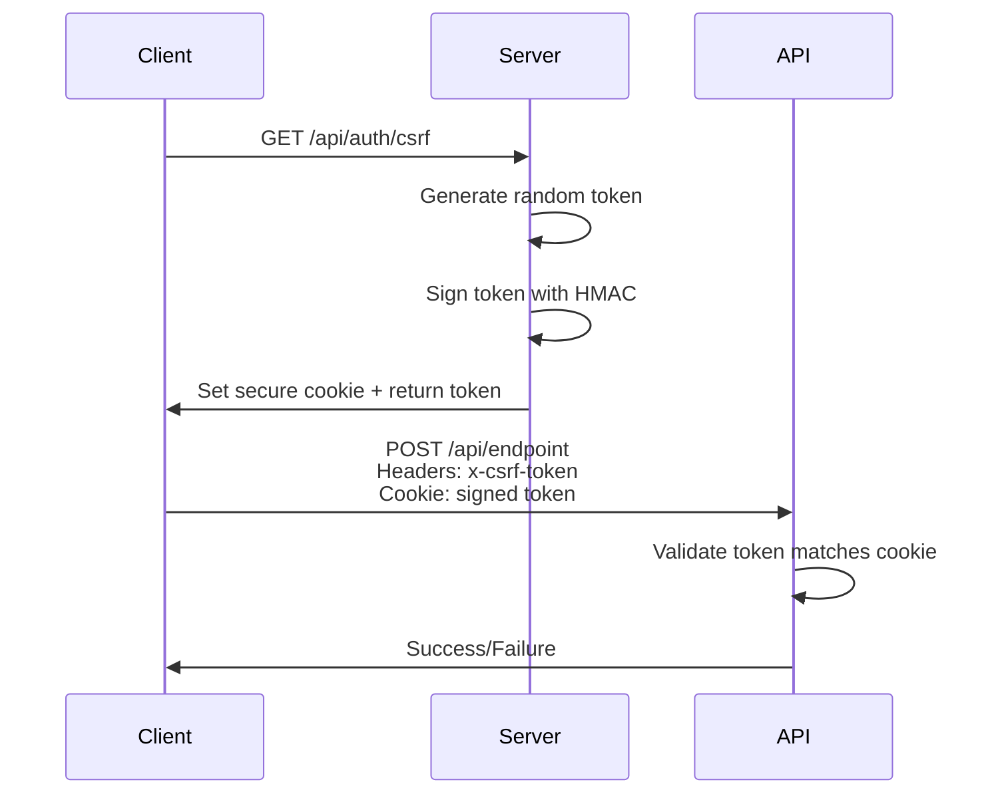

# CSRF Protection Implementation Guide

Cross-Site Request Forgery (CSRF) protection is a critical security feature that prevents malicious websites from performing unauthorized actions on behalf of authenticated users.

## Overview

VibeCode WebGUI implements CSRF protection using the **double-submit cookie pattern** with cryptographically secure tokens and HMAC signing.

## How It Works

1. **Token Generation**: Server generates a cryptographically secure random token
2. **Cookie Setting**: Token is signed with HMAC and stored in a secure HttpOnly cookie
3. **Client Usage**: Client includes the raw token in request headers
4. **Validation**: Server verifies the header token matches the signed cookie token



## Implementation Details

### Token Generation

```typescript
// Generate cryptographically secure token
function generateCSRFToken(): string {
  return randomBytes(32).toString('hex'); // 256-bit entropy
}

// Sign token with HMAC-SHA256
function signCSRFToken(token: string): string {
  return createHmac('sha256', CSRF_SECRET)
    .update(token)
    .digest('hex');
}
```

### Cookie Configuration

```typescript
// Secure cookie settings
response.cookies.set('__Secure-csrf-token', signedToken, {
  httpOnly: true,              // Prevent XSS access
  secure: NODE_ENV === 'production', // HTTPS only in production
  sameSite: 'strict',          // Strict same-site policy
  path: '/',                   // Available site-wide
  maxAge: 60 * 60 * 24        // 24 hours
});
```

### Validation Process

```typescript
function verifyCSRFTokenFromRequest(request: NextRequest): boolean {
  const headerToken = request.headers.get('x-csrf-token');
  const cookieToken = request.cookies.get('__Secure-csrf-token')?.value;
  
  if (!headerToken || !cookieToken) return false;
  
  // Parse signed cookie
  const [token, signature] = cookieToken.split('.');
  if (!token || !signature) return false;
  
  // Verify HMAC signature
  if (!verifyCSRFToken(token, signature)) return false;
  
  // Compare tokens using timing-safe comparison
  return timingSafeEqual(
    Buffer.from(token, 'hex'),
    Buffer.from(headerToken, 'hex')
  );
}
```

## Usage Guide

### Client-Side Implementation

#### Fetch CSRF Token

```typescript
// Get CSRF token before making state-changing requests
async function getCSRFToken(): Promise<string> {
  const response = await fetch('/api/auth/csrf', {
    credentials: 'include' // Include cookies
  });
  
  if (!response.ok) {
    throw new Error('Failed to get CSRF token');
  }
  
  const { csrfToken } = await response.json();
  return csrfToken;
}
```

#### Use Token in Requests

```typescript
// Example: Create workspace with CSRF protection
async function createWorkspace(data: WorkspaceData) {
  const csrfToken = await getCSRFToken();
  
  const response = await fetch('/api/workspaces', {
    method: 'POST',
    headers: {
      'Content-Type': 'application/json',
      'x-csrf-token': csrfToken
    },
    credentials: 'include',
    body: JSON.stringify(data)
  });
  
  if (!response.ok) {
    const error = await response.json();
    if (response.status === 403 && error.error === 'CSRF token validation failed') {
      // CSRF token expired or invalid - refresh and retry
      return createWorkspace(data);
    }
    throw new Error(error.message);
  }
  
  return response.json();
}
```

#### React Hook for CSRF

```typescript
import { useState, useEffect } from 'react';

export function useCSRFToken() {
  const [csrfToken, setCSRFToken] = useState<string | null>(null);
  const [loading, setLoading] = useState(true);
  const [error, setError] = useState<string | null>(null);

  const refreshToken = async () => {
    try {
      setLoading(true);
      setError(null);
      
      const response = await fetch('/api/auth/csrf', {
        credentials: 'include'
      });
      
      if (!response.ok) {
        throw new Error('Failed to fetch CSRF token');
      }
      
      const { csrfToken } = await response.json();
      setCSRFToken(csrfToken);
    } catch (err) {
      setError(err instanceof Error ? err.message : 'Unknown error');
    } finally {
      setLoading(false);
    }
  };

  useEffect(() => {
    refreshToken();
  }, []);

  return { csrfToken, loading, error, refreshToken };
}

// Usage in component
function MyComponent() {
  const { csrfToken, loading, error, refreshToken } = useCSRFToken();

  const handleSubmit = async (data: any) => {
    if (!csrfToken) {
      await refreshToken();
      return;
    }

    try {
      await fetch('/api/endpoint', {
        method: 'POST',
        headers: {
          'Content-Type': 'application/json',
          'x-csrf-token': csrfToken
        },
        credentials: 'include',
        body: JSON.stringify(data)
      });
    } catch (err) {
      if (err.status === 403) {
        // Token might be expired, refresh and retry
        await refreshToken();
      }
    }
  };
}
```

### Server-Side Implementation

#### Protect API Routes

```typescript
import { withCSRFProtection } from '@/lib/security/csrf';

async function handler(req: NextRequest): Promise<NextResponse> {
  // Your API logic here
  return NextResponse.json({ success: true });
}

// Apply CSRF protection
export const POST = withCSRFProtection(handler);
export const PUT = withCSRFProtection(handler);
export const DELETE = withCSRFProtection(handler);
```

#### Manual CSRF Validation

```typescript
import { verifyCSRFTokenFromRequest } from '@/lib/security/csrf';

export async function POST(req: NextRequest) {
  // Manual CSRF validation for custom scenarios
  if (!verifyCSRFTokenFromRequest(req)) {
    return NextResponse.json(
      { 
        error: 'CSRF token validation failed',
        message: 'Invalid or missing CSRF token'
      },
      { status: 403 }
    );
  }
  
  // Continue with request processing
}
```

## Configuration

### Environment Variables

```bash
# Required: Secure secret for HMAC signing
CSRF_SECRET=your-cryptographically-secure-secret-here

# Optional: Custom cookie domain
COOKIE_DOMAIN=yourdomain.com
```

### Security Requirements

1. **Strong Secret**: Use a cryptographically secure random string (32+ characters)
2. **HTTPS**: Always use HTTPS in production for secure cookies
3. **Secret Rotation**: Regularly rotate the CSRF secret
4. **Monitoring**: Monitor for CSRF validation failures

### Generate Secure Secret

```bash
# Generate a secure CSRF secret
node -e "console.log(require('crypto').randomBytes(32).toString('hex'))"

# Or using OpenSSL
openssl rand -hex 32
```

## Security Considerations

### When CSRF is Applied

✅ **Protected Operations:**
- POST, PUT, DELETE, PATCH requests
- State-changing operations
- Cookie-based authentication

❌ **Bypassed Operations:**
- GET, HEAD, OPTIONS requests (safe methods)
- Bearer token authentication (API keys)
- Public endpoints

### Token Lifetime

- **Default**: 24 hours
- **Automatic refresh**: Client should handle 403 responses and refresh token
- **Expiration handling**: Implement retry logic with fresh tokens

### Common Pitfalls

1. **Missing credentials: 'include'**: CSRF cookies won't be sent
2. **Wrong header name**: Use `x-csrf-token` exactly
3. **Token reuse**: Each token is single-use, refresh after 403
4. **Mixed authentication**: Don't mix cookie + CSRF with Bearer tokens

## Testing

### Unit Tests

```typescript
import { describe, it, expect } from '@jest/globals';
import { verifyCSRFTokenFromRequest } from '@/lib/security/csrf';

describe('CSRF Protection', () => {
  it('should validate correct CSRF token', async () => {
    const mockRequest = new Request('http://localhost/api/test', {
      method: 'POST',
      headers: {
        'x-csrf-token': 'valid-token-here',
        'cookie': '__Secure-csrf-token=valid-token-here.valid-signature'
      }
    });

    const isValid = verifyCSRFTokenFromRequest(mockRequest);
    expect(isValid).toBe(true);
  });

  it('should reject missing CSRF token', async () => {
    const mockRequest = new Request('http://localhost/api/test', {
      method: 'POST'
    });

    const isValid = verifyCSRFTokenFromRequest(mockRequest);
    expect(isValid).toBe(false);
  });
});
```

### Integration Tests

```typescript
describe('CSRF Integration', () => {
  it('should get CSRF token and use it successfully', async () => {
    // Get CSRF token
    const csrfResponse = await fetch('/api/auth/csrf');
    const { csrfToken } = await csrfResponse.json();
    
    // Extract cookie from response
    const cookieHeader = csrfResponse.headers.get('set-cookie');
    
    // Use token in protected request
    const response = await fetch('/api/protected-endpoint', {
      method: 'POST',
      headers: {
        'Content-Type': 'application/json',
        'x-csrf-token': csrfToken,
        'cookie': cookieHeader
      },
      body: JSON.stringify({ test: 'data' })
    });
    
    expect(response.ok).toBe(true);
  });
});
```

## Monitoring and Debugging

### Enable Debug Logging

```typescript
// Add to your environment for debugging
DEBUG_CSRF=true
```

### Monitor CSRF Failures

```typescript
// Custom monitoring
function logCSRFFailure(request: NextRequest, reason: string) {
  console.warn('CSRF validation failed', {
    url: request.url,
    method: request.method,
    reason,
    userAgent: request.headers.get('user-agent'),
    ip: getClientIP(request),
    timestamp: new Date().toISOString()
  });
}
```

### Common Error Messages

| Error | Cause | Solution |
|-------|-------|----------|
| "Invalid or missing CSRF token" | No token in header/cookie | Call `/api/auth/csrf` first |
| "CSRF token validation failed" | Mismatched tokens | Refresh token and retry |
| "CSRF secret not configured" | Missing CSRF_SECRET | Set environment variable |

## Production Checklist

- [ ] CSRF_SECRET environment variable set
- [ ] Secret is cryptographically secure (32+ chars)
- [ ] HTTPS enabled for secure cookies
- [ ] Client includes credentials in requests
- [ ] Error handling implemented for 403 responses
- [ ] Monitoring enabled for CSRF failures
- [ ] Integration tests covering CSRF flows
- [ ] Secret rotation procedure documented

## Further Reading

- [OWASP CSRF Prevention Cheat Sheet](https://cheatsheetseries.owasp.org/cheatsheets/Cross-Site_Request_Forgery_Prevention_Cheat_Sheet.html)
- [Double Submit Cookie Pattern](https://owasp.org/www-community/SameSite)
- [Next.js Security Best Practices](https://nextjs.org/docs/advanced-features/security-headers)