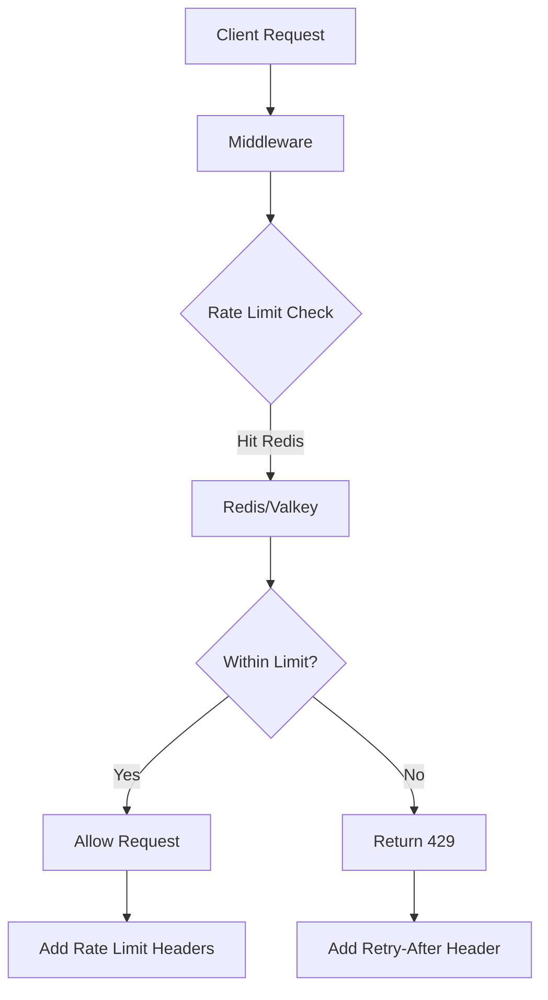

# Rate Limiting Implementation Guide

Rate limiting is a critical security and performance feature that prevents abuse, ensures fair resource usage, and protects against denial-of-service attacks.

## Overview

VibeCode WebGUI implements rate limiting using Redis/Valkey with a **sliding window algorithm** that provides accurate, distributed rate limiting across multiple server instances.

## Architecture



## Implementation Details

### Sliding Window Algorithm

The sliding window algorithm provides more accurate rate limiting than fixed windows:

```typescript
// Lua script for atomic rate limiting
const luaScript = `
  local key = KEYS[1]
  local maxRequests = tonumber(ARGV[1])
  local windowSeconds = tonumber(ARGV[2])
  
  local current = redis.call('GET', key)
  if current == false then
    current = 0
  else
    current = tonumber(current)
  end
  
  if current >= maxRequests then
    local ttl = redis.call('TTL', key)
    return {current, ttl}
  end
  
  local newValue = redis.call('INCR', key)
  if newValue == 1 then
    redis.call('EXPIRE', key, windowSeconds)
  end
  
  local ttl = redis.call('TTL', key)
  return {newValue, ttl}
`;
```

### Key Generation

```typescript
function getRateLimitKey(prefix: string, identifier: string, window: number): string {
  const windowStart = Math.floor(Date.now() / 1000 / window) * window;
  return `ratelimit:${prefix}:${identifier}:${windowStart}`;
}
```

### Client Identification

```typescript
function getClientIdentifier(req: NextRequest): string {
  // Try multiple headers for real IP
  const forwarded = req.headers.get('x-forwarded-for');
  const realIp = req.headers.get('x-real-ip');
  const cfIP = req.headers.get('cf-connecting-ip');
  
  if (forwarded) {
    return forwarded.split(',')[0].trim();
  }
  
  return realIp || cfIP || 'unknown';
}
```

## Predefined Rate Limits

### Available Configurations

| Type | Requests | Window | Use Case | Skip Auth |
|------|----------|---------|----------|-----------|
| `STRICT` | 5 | 60s | Sensitive operations | No |
| `AUTH` | 10 | 5min | Authentication attempts | No |
| `API` | 100 | 60s | General API usage | Yes |
| `UPLOAD` | 5 | 5min | File uploads | No |

### Usage Examples

```typescript
import { withRateLimit, RATE_LIMITS } from '@/lib/security/rate-limit';

// Apply predefined rate limit
export const POST = withRateLimit(RATE_LIMITS.API, 'workspace')(handler);

// Custom rate limit
const customLimit = {
  maxRequests: 50,
  windowSeconds: 300,
  skipAuthenticated: true,
  message: 'Custom rate limit exceeded'
};

export const POST = withRateLimit(customLimit, 'custom-endpoint')(handler);
```

## Configuration

### Environment Variables

```bash
# Required: Redis/Valkey connection
UPSTASH_REDIS_REST_URL=https://your-redis-instance.upstash.io
UPSTASH_REDIS_REST_TOKEN=your-redis-token

# Optional: Custom rate limiting behavior
RATE_LIMIT_ENABLED=true
RATE_LIMIT_SKIP_AUTHENTICATED=true
```

### Redis/Valkey Setup

#### Upstash (Recommended)

1. Create account at [Upstash](https://upstash.com)
2. Create Redis database
3. Copy REST URL and token
4. Add to environment variables

#### Self-Hosted Redis

```yaml
# docker-compose.yml
version: '3.8'
services:
  redis:
    image: redis:7-alpine
    ports:
      - "6379:6379"
    command: redis-server --appendonly yes
    volumes:
      - redis_data:/data

volumes:
  redis_data:
```

```bash
# Environment for self-hosted
REDIS_URL=redis://localhost:6379
```

#### Valkey (Redis Fork)

```bash
# Using Valkey instead of Redis
VALKEY_URL=redis://localhost:6379
```

## API Implementation

### Middleware Pattern

```typescript
// Apply to specific routes
export const POST = withRateLimit(RATE_LIMITS.API, 'ai-chat')(handleAIChat);

async function handleAIChat(req: NextRequest): Promise<NextResponse> {
  // Rate limiting already applied by middleware
  // Process the request normally
  return NextResponse.json({ success: true });
}
```

### Manual Rate Limiting

```typescript
import { applyRateLimit } from '@/lib/security/rate-limit';

export async function POST(req: NextRequest) {
  // Manual rate limit application
  const rateLimitResult = await applyRateLimit(req, {
    maxRequests: 10,
    windowSeconds: 60
  }, 'custom-endpoint');

  if (!rateLimitResult.success) {
    return rateLimitResult.errorResponse;
  }

  // Continue with request processing
  const response = NextResponse.json({ success: true });
  
  // Add rate limit headers
  response.headers.set('X-RateLimit-Limit', '10');
  response.headers.set('X-RateLimit-Remaining', rateLimitResult.remaining.toString());
  response.headers.set('X-RateLimit-Reset', rateLimitResult.resetTime.toString());
  
  return response;
}
```

### Per-User Rate Limiting

```typescript
import { getServerSession } from 'next-auth';

export async function POST(req: NextRequest) {
  const session = await getServerSession(authOptions);
  
  const rateLimitConfig = {
    maxRequests: session ? 100 : 10, // Higher limit for authenticated users
    windowSeconds: 60,
    identifier: session?.user?.id || getClientIdentifier(req)
  };

  const result = await applyRateLimit(req, rateLimitConfig, 'user-specific');
  
  if (!result.success) {
    return result.errorResponse;
  }
  
  // Process request...
}
```

## Client-Side Handling

### Detecting Rate Limits

```typescript
async function apiCall(url: string, options: RequestInit) {
  const response = await fetch(url, options);
  
  if (response.status === 429) {
    const retryAfter = response.headers.get('Retry-After');
    const resetTime = response.headers.get('X-RateLimit-Reset');
    
    throw new RateLimitError({
      message: 'Rate limit exceeded',
      retryAfter: retryAfter ? parseInt(retryAfter) : null,
      resetTime: resetTime ? parseInt(resetTime) : null
    });
  }
  
  return response;
}

class RateLimitError extends Error {
  constructor(public details: {
    message: string;
    retryAfter: number | null;
    resetTime: number | null;
  }) {
    super(details.message);
    this.name = 'RateLimitError';
  }
}
```

### Retry Logic

```typescript
async function apiCallWithRetry(url: string, options: RequestInit, maxRetries = 3) {
  for (let attempt = 1; attempt <= maxRetries; attempt++) {
    try {
      return await apiCall(url, options);
    } catch (error) {
      if (error instanceof RateLimitError) {
        if (attempt === maxRetries) {
          throw error;
        }
        
        // Wait for retry period
        const waitTime = error.details.retryAfter || 60;
        await new Promise(resolve => setTimeout(resolve, waitTime * 1000));
        continue;
      }
      
      throw error; // Re-throw non-rate-limit errors
    }
  }
}
```

### React Hook for Rate Limit Status

```typescript
import { useState, useEffect } from 'react';

interface RateLimitStatus {
  remaining: number;
  limit: number;
  resetTime: number;
  isLimited: boolean;
}

export function useRateLimitStatus(endpoint: string) {
  const [status, setStatus] = useState<RateLimitStatus | null>(null);

  const updateFromResponse = (response: Response) => {
    const limit = parseInt(response.headers.get('X-RateLimit-Limit') || '0');
    const remaining = parseInt(response.headers.get('X-RateLimit-Remaining') || '0');
    const resetTime = parseInt(response.headers.get('X-RateLimit-Reset') || '0');

    setStatus({
      limit,
      remaining,
      resetTime,
      isLimited: remaining === 0
    });
  };

  const makeRequest = async (url: string, options: RequestInit) => {
    try {
      const response = await fetch(url, options);
      updateFromResponse(response);
      return response;
    } catch (error) {
      throw error;
    }
  };

  return { status, makeRequest };
}
```

## Monitoring and Analytics

### Rate Limit Metrics

```typescript
// Log rate limit events
function logRateLimitEvent(
  event: 'hit' | 'exceeded' | 'reset',
  details: {
    endpoint: string;
    identifier: string;
    limit: number;
    remaining: number;
    resetTime: number;
  }
) {
  console.info('Rate limit event', {
    event,
    ...details,
    timestamp: new Date().toISOString()
  });
}
```

### Datadog Integration

```typescript
// Send metrics to Datadog
function sendRateLimitMetric(metricName: string, value: number, tags: string[]) {
  // Using Datadog API
  fetch('https://api.datadoghq.com/api/v1/series', {
    method: 'POST',
    headers: {
      'Content-Type': 'application/json',
      'DD-API-KEY': process.env.DATADOG_API_KEY
    },
    body: JSON.stringify({
      series: [{
        metric: `vibecode.rate_limit.${metricName}`,
        points: [[Math.floor(Date.now() / 1000), value]],
        tags
      }]
    })
  });
}
```

### Dashboard Queries

```sql
-- Rate limit violations per endpoint
SELECT 
  endpoint,
  COUNT(*) as violations,
  COUNT(DISTINCT identifier) as unique_clients
FROM rate_limit_events 
WHERE event = 'exceeded' 
  AND timestamp > NOW() - INTERVAL '1 hour'
GROUP BY endpoint
ORDER BY violations DESC;

-- Rate limit efficiency
SELECT 
  endpoint,
  AVG(remaining / limit * 100) as avg_utilization,
  MAX(remaining) as peak_remaining
FROM rate_limit_events 
WHERE event = 'hit'
  AND timestamp > NOW() - INTERVAL '24 hours'
GROUP BY endpoint;
```

## Testing

### Unit Tests

```typescript
import { describe, it, expect, beforeEach } from '@jest/globals';
import { applyRateLimit } from '@/lib/security/rate-limit';

describe('Rate Limiting', () => {
  beforeEach(() => {
    // Clear Redis before each test
    // Implementation depends on your Redis client
  });

  it('should allow requests within limit', async () => {
    const mockRequest = new Request('http://localhost/api/test');
    
    const result = await applyRateLimit(mockRequest, {
      maxRequests: 5,
      windowSeconds: 60
    });

    expect(result.success).toBe(true);
    expect(result.remaining).toBe(4);
  });

  it('should block requests exceeding limit', async () => {
    const mockRequest = new Request('http://localhost/api/test');
    const config = { maxRequests: 1, windowSeconds: 60 };

    // First request should succeed
    const result1 = await applyRateLimit(mockRequest, config);
    expect(result1.success).toBe(true);

    // Second request should fail
    const result2 = await applyRateLimit(mockRequest, config);
    expect(result2.success).toBe(false);
    expect(result2.errorResponse?.status).toBe(429);
  });
});
```

### Load Testing

```typescript
// Load test script using Artillery
module.exports = {
  config: {
    target: 'http://localhost:3000',
    phases: [
      { duration: 60, arrivalRate: 10 }, // 10 requests/sec for 1 minute
      { duration: 120, arrivalRate: 20 } // 20 requests/sec for 2 minutes
    ]
  },
  scenarios: [
    {
      name: 'Rate limit test',
      weight: 100,
      flow: [
        { post: { url: '/api/test-endpoint', json: { test: 'data' } } },
        { think: 1 } // 1 second pause
      ]
    }
  ]
};
```

## Administrative Functions

### Clear Rate Limits

```typescript
import { clearRateLimit } from '@/lib/security/rate-limit';

// Clear rate limit for specific user
await clearRateLimit('api', 'user-123', 60);

// Admin endpoint to clear rate limits
export async function DELETE(req: NextRequest) {
  const { identifier, prefix, windowSeconds } = await req.json();
  
  await clearRateLimit(prefix, identifier, windowSeconds);
  
  return NextResponse.json({ success: true });
}
```

### Rate Limit Status Check

```typescript
import { getRateLimitStatus } from '@/lib/security/rate-limit';

export async function GET(req: NextRequest) {
  const { searchParams } = new URL(req.url);
  const identifier = searchParams.get('identifier') || getClientIdentifier(req);
  
  const status = await getRateLimitStatus('api', identifier, 60, 100);
  
  return NextResponse.json(status);
}
```

### Bulk Operations

```typescript
// Get status for multiple identifiers
async function getBulkRateLimitStatus(identifiers: string[]) {
  const statuses = await Promise.all(
    identifiers.map(id => getRateLimitStatus('api', id, 60, 100))
  );
  
  return identifiers.reduce((acc, id, index) => {
    acc[id] = statuses[index];
    return acc;
  }, {} as Record<string, any>);
}
```

## Troubleshooting

### Common Issues

1. **Rate limits not working**
   - Check Redis/Valkey connection
   - Verify environment variables
   - Check Redis memory and permissions

2. **Too many false positives**
   - Review IP detection logic
   - Consider proxy headers
   - Implement user-based limiting

3. **Inconsistent limits across instances**
   - Ensure all instances use same Redis
   - Check clock synchronization
   - Verify key generation consistency

### Debug Mode

```typescript
// Enable detailed logging
process.env.DEBUG_RATE_LIMIT = 'true';

// Custom debug logging
function debugRateLimit(message: string, data: any) {
  if (process.env.DEBUG_RATE_LIMIT === 'true') {
    console.debug(`[RATE_LIMIT] ${message}`, data);
  }
}
```

### Health Checks

```typescript
// Redis health check
export async function GET() {
  try {
    const client = getValkeyClient();
    await client.ping();
    
    return NextResponse.json({ 
      status: 'healthy',
      redis: 'connected'
    });
  } catch (error) {
    return NextResponse.json({ 
      status: 'unhealthy',
      redis: 'disconnected',
      error: error.message
    }, { status: 503 });
  }
}
```

## Production Checklist

- [ ] Redis/Valkey configured and accessible
- [ ] Environment variables set correctly
- [ ] Rate limits configured appropriately
- [ ] Monitoring and alerting enabled
- [ ] Client retry logic implemented
- [ ] Load testing completed
- [ ] Backup Redis instance configured
- [ ] Rate limit metrics dashboard created
- [ ] Documentation updated with current limits
- [ ] Admin tools for rate limit management

## Performance Considerations

### Redis Optimization

```bash
# Redis configuration optimizations
maxmemory 1gb
maxmemory-policy allkeys-lru
save 900 1
save 300 10
save 60 10000
```

### Connection Pooling

```typescript
// Use connection pooling for better performance
const redisPool = new ConnectionPool({
  host: 'localhost',
  port: 6379,
  maxConnections: 10,
  minConnections: 2
});
```

### Async Processing

```typescript
// Don't block request processing
async function applyRateLimitAsync(req: NextRequest, config: RateLimitConfig) {
  // Fire and forget logging
  setImmediate(() => {
    logRateLimitEvent('hit', { /* details */ });
  });
  
  return await applyRateLimit(req, config);
}
```

## Further Reading

- [Redis Rate Limiting Patterns](https://redis.io/commands/incr#pattern-rate-limiter)
- [Sliding Window vs Fixed Window](https://blog.cloudflare.com/counting-things-a-lot-of-different-things/)
- [Distributed Rate Limiting](https://konghq.com/blog/how-to-design-a-scalable-rate-limiting-algorithm/)
- [GCRA Algorithm](https://brandur.org/redis-streams)