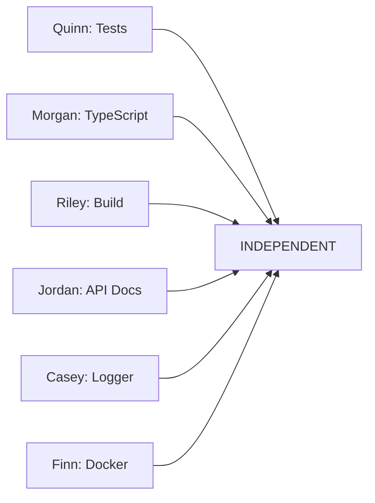

**Status:** Production-Ready
**Success Rate:** 100% (validated across multiple sessions)
**Last Updated:** 2025-10-02

## Overview

This guide documents the proven methodology for coordinating multiple AI agents to work in parallel on well-scoped, independent tasks. This approach has been successfully used to coordinate 10+ specialized personas with zero conflicts and 100% completion rates.

---

## Table of Contents

1. [When to Use Multi-Agent Coordination](#when-to-use)
2. [Core Principles](#core-principles)
3. [Planning Phase](#planning-phase)
4. [Execution Phase](#execution-phase)
5. [Integration Phase](#integration-phase)
6. [Tools & Technologies](#tools--technologies)
7. [Case Studies](#case-studies)
8. [Troubleshooting](#troubleshooting)

---

## When to Use

### Ideal Scenarios

✅ **Use multi-agent coordination when:**
- You have 5+ independent tasks that can run in parallel
- Tasks have clear, well-defined scopes and success criteria
- No blocking dependencies between tasks
- Each task maps to a specific domain of expertise
- You need to maximize throughput and minimize time-to-completion

### Not Recommended

❌ **Don't use multi-agent coordination when:**
- Tasks have complex dependencies requiring sequential execution
- Scope is unclear or requires discovery/exploration
- Tasks involve the same files/code (high conflict risk)
- Single task can be completed faster than coordination overhead
- You need iterative feedback loops between tasks

---

## Core Principles

### 1. Independence
**Each agent must be able to complete their task without waiting for other agents.**

- No shared file edits
- No blocking dependencies
- Clear boundaries between work areas

### 2. Specialization
**Match each task to an agent with the right domain expertise.**

| Task Type | Recommended Agent Type |
|-----------|----------------------|
| Testing & QA | quality-engineer |
| Security & Auth | security-engineer |
| API Documentation | technical-writer |
| Infrastructure | devops-architect |
| Frontend/UX | frontend-architect |
| Performance | performance-engineer |
| Refactoring | refactoring-expert |
| System Design | system-architect |
| Code Quality | python-expert (strong typing) |

### 3. Clear Success Criteria
**Every agent must know exactly what "done" looks like.**

Example success criteria:
```markdown
## Success Criteria
- Zero test files remain in /src directory
- All imports updated correctly
- Jest discovers all migrated tests
- At least one test runs successfully
```

### 4. Conflict Prevention
**Proactively design work areas to avoid conflicts.**

**Spatial Separation:**
- Agent A: `/src/lib` directory
- Agent B: `/src/app/api` directory
- Result: Zero overlap, zero conflicts

**File Type Separation:**
- Agent A: Test files only
- Agent B: Source code only
- Result: Different file sets, zero conflicts

### 5. Coordination Layer
**Use a coordination agent to orchestrate, monitor, and integrate.**

The coordinator:
- Reviews all deliverables
- Checks for conflicts
- Updates tracking systems (GitHub, TODO.md)
- Creates integration reports
- Identifies blockers

---

## Planning Phase

### Step 1: Decompose the Work

Break down the high-level goal into atomic, independent tasks:

```markdown
Goal: Improve codebase quality

Task Breakdown:
1. Migrate test files (Quinn - quality-engineer)
2. Enable TypeScript strict checks (Morgan - python-expert)
3. Fix production build (Riley - devops-architect)
4. Document API endpoints (Jordan - technical-writer)
5. Migrate console.log (Casey - refactoring-expert)
6. Optimize Docker layers (Finn - devops-architect)
```

### Step 2: Dependency Analysis

Create a dependency graph to verify independence:



If dependencies exist, either:
- Sequence dependent tasks
- Find alternative decomposition
- Reduce scope to eliminate dependency

### Step 3: Conflict Analysis

**File Overlap Matrix:**

|        | Agent A | Agent B | Agent C |
|--------|---------|---------|---------|
| Agent A | -      | Check   | Check   |
| Agent B | Check  | -       | Check   |
| Agent C | Check  | Check   | -       |

For each pair, verify:
- Different directories? ✅
- Different file types? ✅
- Different concern layers? ✅

### Step 4: Create Agent Specifications

For each agent, document:

```markdown
## Agent: [Name] ([Domain])

**Task:** [One sentence description]
**Issue:** #[number]
**Agent Type:** [e.g., quality-engineer]

**Scope:**
- File patterns: src/lib/*.ts
- Exclusions: tests/, __mocks__/
- Actions: Read, Edit, Write

**Success Criteria:**
- [ ] Criterion 1
- [ ] Criterion 2
- [ ] Criterion 3

**Deliverables:**
1. [Specific artifact 1]
2. [Specific artifact 2]
3. GitHub comment to issue #[number]

**Constraints:**
- Don't modify [X]
- Stay within [directory]
- Follow [pattern]
```

### Step 5: Use MCP Sequential Thinking

Before deployment, use sequential thinking to validate the plan:

```typescript
// Pseudocode
sequentialThinking({
  thought: "Analyze dependency graph for persona coordination",
  verifyIndependence: true,
  checkConflicts: true,
  estimateTime: true
})
```

---

## Execution Phase

### Parallel Deployment

**Deploy all agents in a single message for maximum parallelization:**

```typescript
// Deploy 10 agents simultaneously
<function_calls>
  <invoke name="Task" subagent_type="quality-engineer">...</invoke>
  <invoke name="Task" subagent_type="python-expert">...</invoke>
  <invoke name="Task" subagent_type="devops-architect">...</invoke>
  // ... 7 more agents
  <invoke name="Task" subagent_type="system-architect">...</invoke>