# Architecture Diagrams: VibeCode MCP Evolution

**Date:** 2025-10-01
**Version:** 1.0
**Status:** Strategic Planning

---

## Current Architecture (As-Is)

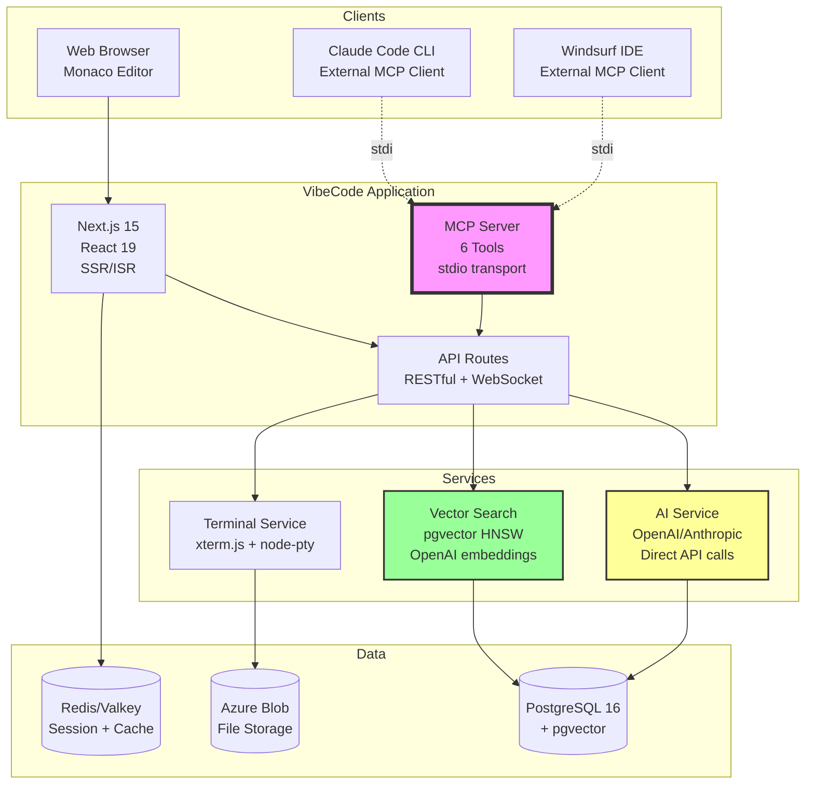

### Current State Analysis

**Strengths:**
- ✅ MCP server exists (ahead of competitors)
- ✅ Monaco editor integrated (VS Code-quality)
- ✅ Vector search with HNSW (fast semantic search)
- ✅ Terminal support (xterm.js)
- ✅ Multi-provider AI (OpenAI + Anthropic)

**Gaps:**
- ❌ Only 6 MCP tools (limited functionality)
- ❌ No CLI interface (web-only)
- ❌ No repository mapping (token-inefficient)
- ❌ Direct API calls (no fallback on failures)
- ❌ LSP not AI-aware (Monaco has LSP but AI doesn't use it)

---

## Target Architecture - Phase 1 (Months 1-3): MCP Foundation

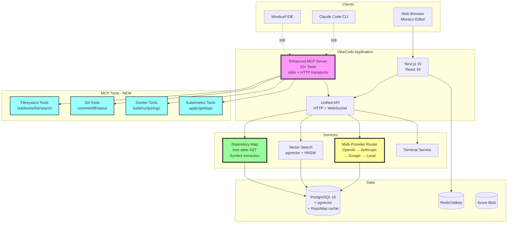

### Phase 1 Enhancements

**MCP Server (6 → 20+ Tools):**
- **Filesystem:** read_file, write_file, list_directory, search_files
- **Git:** git_status, git_commit, git_diff, git_branch, git_log
- **Docker:** docker_build, docker_run, docker_ps, docker_logs
- **Kubernetes:** kubectl_apply, kubectl_get, kubectl_logs, kubectl_describe
- **Database:** sql_query, schema_inspect, migration_status

**Repository Map:**
- Tree-sitter AST parsing for TypeScript/JavaScript
- Symbol extraction (classes, functions, exports, imports)
- PostgreSQL caching (invalidate on file changes)
- 10x token efficiency improvement

**Multi-Provider Router:**
- Primary: OpenAI GPT-4
- Fallback 1: Anthropic Claude-3.5-Sonnet
- Fallback 2: Google Gemini-2.0
- Fallback 3: Local Ollama models
- Automatic failover, cost tracking

---

## Target Architecture - Phase 2 (Months 4-6): CLI & LSP

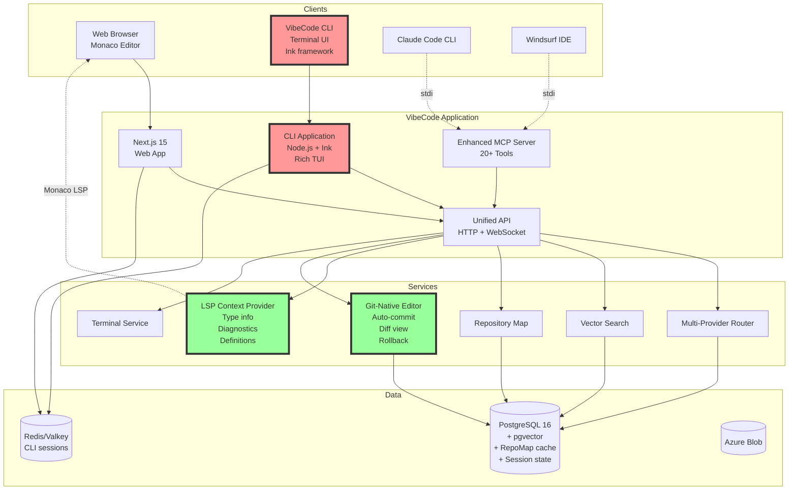

### Phase 2 Enhancements

**VibeCode CLI:**
- **Commands:** `vibe init`, `vibe chat`, `vibe edit`, `vibe test`, `vibe deploy`
- **Terminal UI:** Ink (React for terminals) with rich formatting
- **Authentication:** API keys + OAuth device flow
- **Distribution:** npm package (`@vibecode/cli`)

**LSP-Aware AI Context:**
- Extracts type information from Monaco LSP
- Includes diagnostics (errors, warnings) in AI context
- Symbol resolution for refactoring
- 30% improvement in completion accuracy

**Git-Native Editing:**
- Optional mode: every AI edit is auto-committed
- Visual diff view in Monaco (before/after)
- Easy rollback via "Undo AI Edit" button
- Branch management (create feature branches)

---

## Target Architecture - Phase 3 (Months 7-12): Marketplace & Multi-Agent

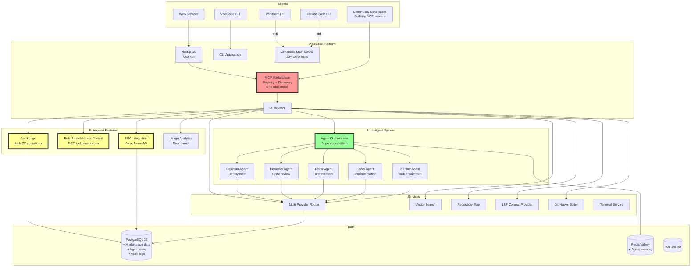

### Phase 3 Enhancements

**MCP Marketplace:**
- Registry of community MCP servers
- Discovery UI with search, ratings, reviews
- One-click installation
- Developer program with SDK, documentation
- Revenue sharing: 80/20 split (developer/VibeCode)

**Multi-Agent System:**
- **Orchestrator:** Supervisor agent coordinating others
- **Planner:** Breaks down tasks into steps
- **Coder:** Implements code changes
- **Tester:** Writes and runs tests
- **Reviewer:** Code review and suggestions
- **Deployer:** Handles deployment

**Enterprise Features:**
- **SSO:** Okta, Azure AD, Google Workspace
- **RBAC:** Permissions per MCP tool (who can deploy, etc.)
- **Audit Logs:** All MCP tool usage tracked
- **Analytics:** Dashboard with usage metrics
- **On-Premise:** Self-hosted deployment option

---

## MCP Communication Flow

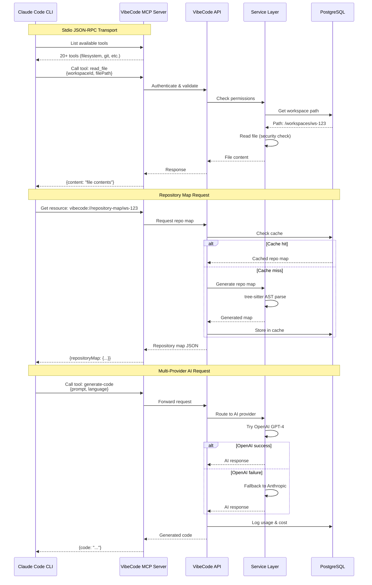

---

## Repository Map Architecture

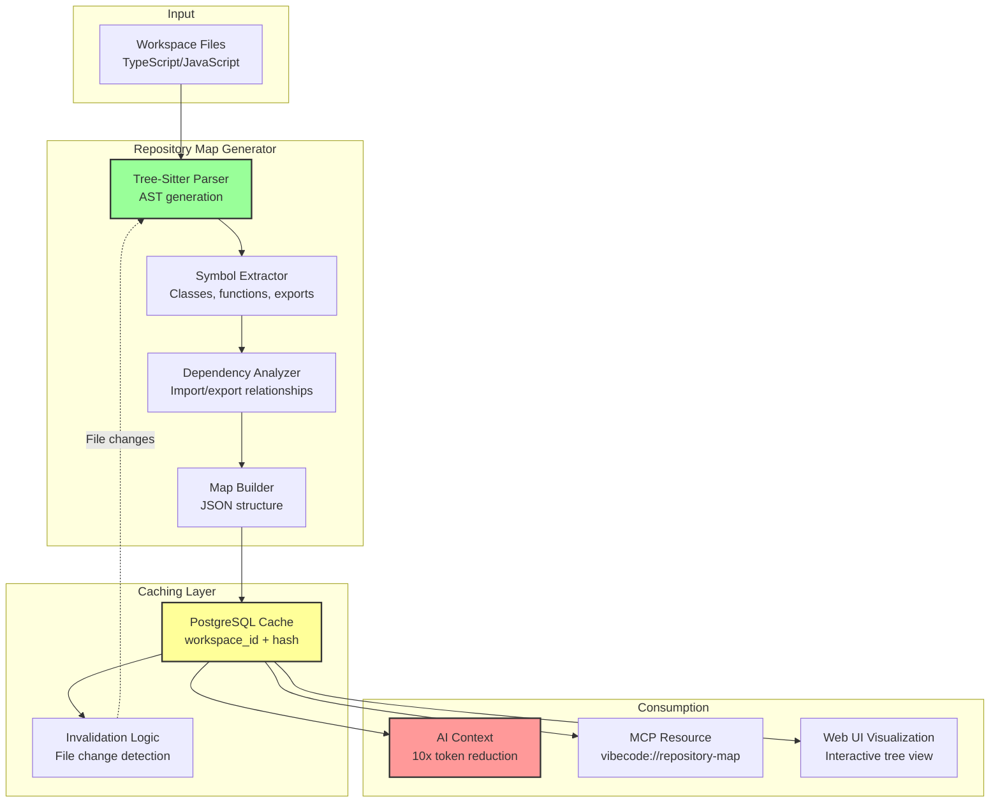

### Repository Map Example

```json
{
  "workspaceId": "ws-123",
  "generated": "2025-10-01T10:00:00Z",
  "files": [
    {
      "path": "src/components/Editor.tsx",
      "language": "typescript",
      "symbols": [
        {
          "name": "EditorComponent",
          "type": "function",
          "kind": "React.FC",
          "exports": true,
          "dependencies": ["useEditor", "handleCompletion"]
        },
        {
          "name": "useEditor",
          "type": "function",
          "kind": "hook",
          "returns": "Monaco.IStandaloneCodeEditor"
        }
      ]
    },
    {
      "path": "src/lib/ai/completion.ts",
      "language": "typescript",
      "symbols": [
        {
          "name": "getCompletion",
          "type": "function",
          "kind": "async",
          "parameters": ["prompt", "options"],
          "returns": "Promise<string>"
        }
      ],
      "imports": ["openai", "@ai-sdk/openai"]
    }
  ],
  "statistics": {
    "totalFiles": 250,
    "totalSymbols": 1500,
    "languages": ["typescript", "javascript", "css"]
  }
}
```

---

## Multi-Provider Fallback Flow

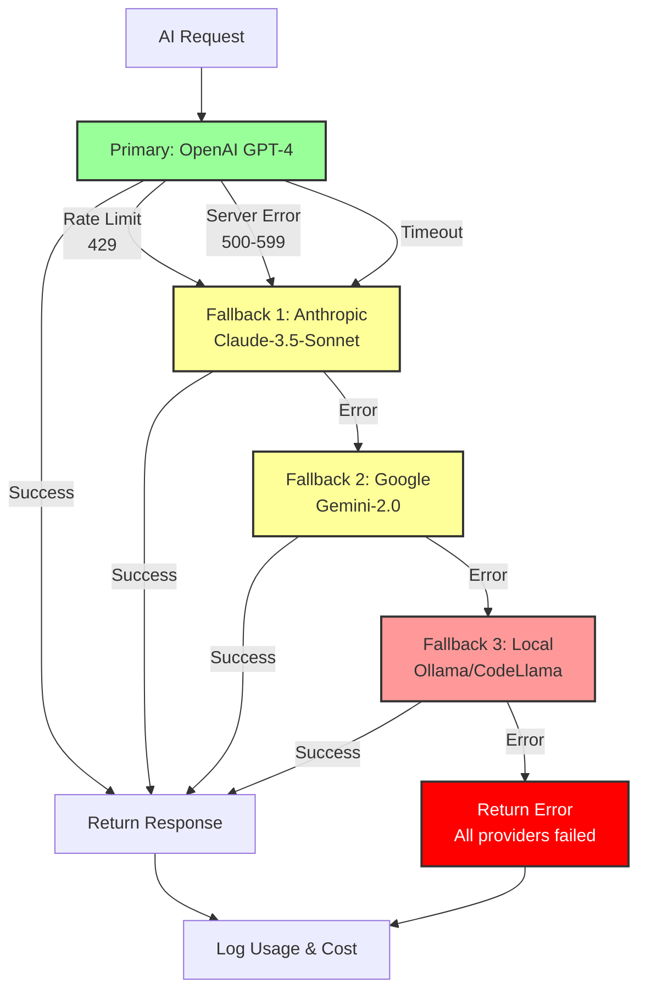

### Multi-Provider Configuration

```typescript
interface ProviderConfig {
  provider: 'openai' | 'anthropic' | 'google' | 'local';
  model: string;
  maxRetries: number;
  timeout: number;
  fallback?: ProviderConfig;
}

const config: ProviderConfig = {
  provider: 'openai',
  model: 'gpt-4',
  maxRetries: 2,
  timeout: 30000,
  fallback: {
    provider: 'anthropic',
    model: 'claude-3-5-sonnet-20241022',
    maxRetries: 2,
    timeout: 30000,
    fallback: {
      provider: 'google',
      model: 'gemini-2.0-flash-exp',
      maxRetries: 2,
      timeout: 30000,
      fallback: {
        provider: 'local',
        model: 'ollama/codellama',
        maxRetries: 1,
        timeout: 60000
      }
    }
  }
};
```

---

## Multi-Agent Workflow

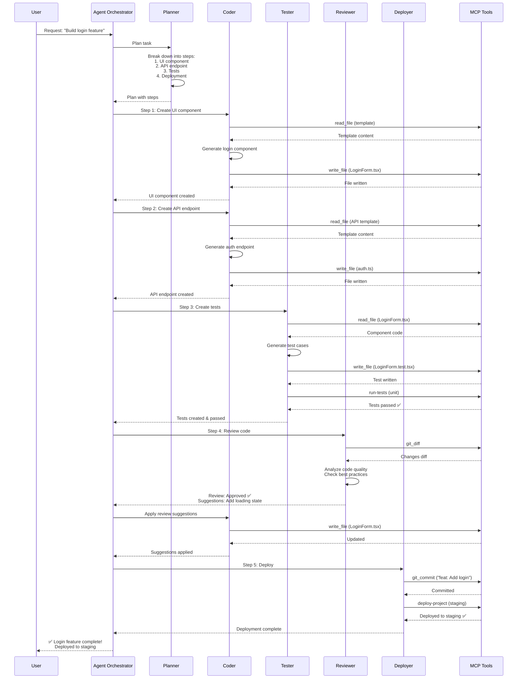

---

## Data Flow Diagrams

### Code Completion with LSP Context

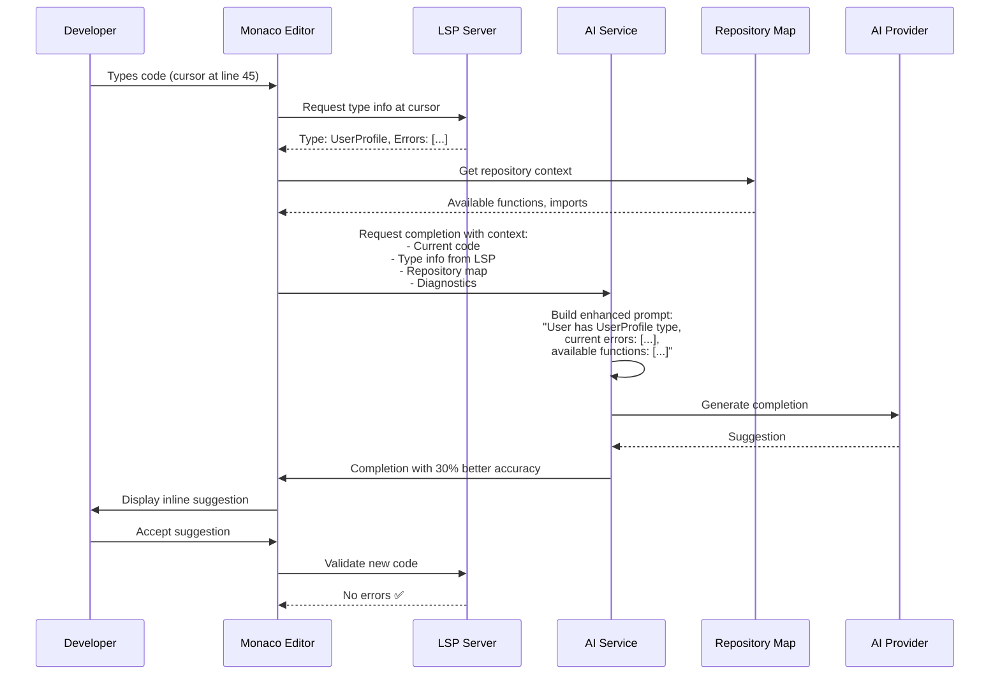

### Git-Native Editing

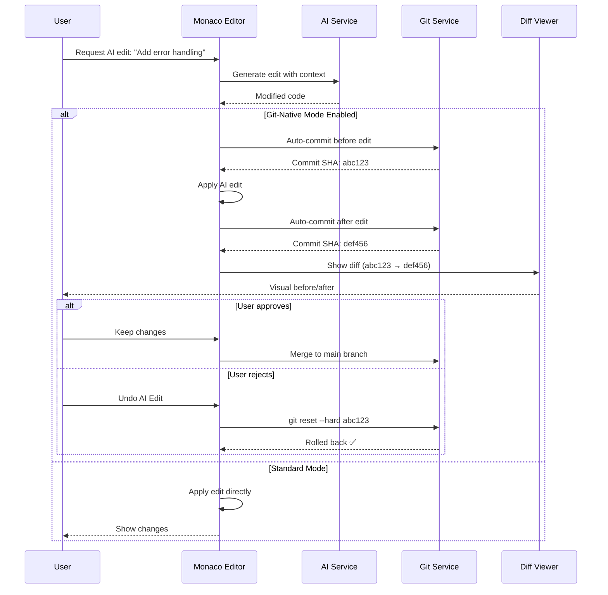

---

## Deployment Architecture

### Kubernetes Deployment (Production)

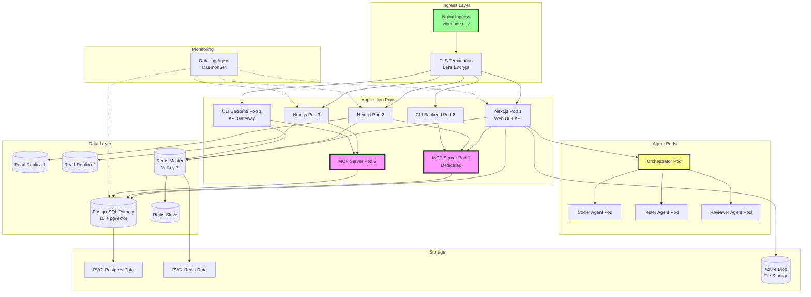

---

## Technology Stack Evolution

### Current Stack

```
Frontend:
  ├─ Next.js 15 (App Router)
  ├─ React 19
  ├─ Monaco Editor 0.53.0
  ├─ Tailwind CSS 4.0
  └─ xterm.js (Terminal)

Backend:
  ├─ Next.js API Routes
  ├─ Node.js 18-24
  ├─ TypeScript 5.8.3
  └─ MCP SDK 1.18.2

AI:
  ├─ OpenAI SDK
  ├─ Anthropic SDK
  ├─ Vercel AI SDK 5.0
  └─ LangChain 0.3.34

Data:
  ├─ PostgreSQL 16 + pgvector
  ├─ Redis/Valkey 5.8.1
  └─ Azure Blob Storage

DevOps:
  ├─ Docker
  ├─ Kubernetes
  ├─ Helm 3.19.0
  └─ Datadog (APM, DBM, RUM)
```

### Future Stack (Phase 3)

```
Frontend:
  ├─ Next.js 15 (App Router)
  ├─ React 19
  ├─ Monaco Editor 0.53.0 + LSP Client
  ├─ Tailwind CSS 4.0
  └─ xterm.js (Terminal)

CLI:
  ├─ Node.js 18-24
  ├─ TypeScript 5.8.3
  ├─ Ink 5.0 (React for terminals)
  ├─ Commander.js (CLI framework)
  └─ Ora (Progress indicators)

Backend:
  ├─ Next.js API Routes
  ├─ Enhanced MCP Server (20+ tools)
  ├─ Multi-Provider Router (LiteLLM-style)
  ├─ Repository Map Service (tree-sitter)
  └─ Multi-Agent Orchestrator

AI:
  ├─ OpenAI SDK (primary)
  ├─ Anthropic SDK (fallback 1)
  ├─ Google AI SDK (fallback 2)
  ├─ Ollama (local, fallback 3)
  ├─ Vercel AI SDK 5.0 (streaming)
  └─ LangChain 0.3.34 (agents)

Data:
  ├─ PostgreSQL 16 + pgvector + HNSW
  │   ├─ Marketplace data
  │   ├─ Repository map cache
  │   ├─ Agent state
  │   └─ Audit logs
  ├─ Redis/Valkey 5.8.1
  │   ├─ Session management
  │   ├─ CLI state
  │   └─ Agent memory
  └─ Azure Blob Storage

MCP Ecosystem:
  ├─ Core MCP Server (20+ tools)
  ├─ Community MCP Servers (50+)
  ├─ MCP Marketplace Registry
  └─ MCP SDK for developers

Enterprise:
  ├─ SSO (Okta, Azure AD)
  ├─ RBAC (tool permissions)
  ├─ Audit Logs
  ├─ Analytics Dashboard
  └─ On-Premise Support

DevOps:
  ├─ Docker (multi-stage builds)
  ├─ Kubernetes (GKE, EKS, AKS)
  ├─ Helm 3.19.0 (charts)
  ├─ Datadog (full stack monitoring)
  └─ GitHub Actions (CI/CD)
```

---

## Security Architecture

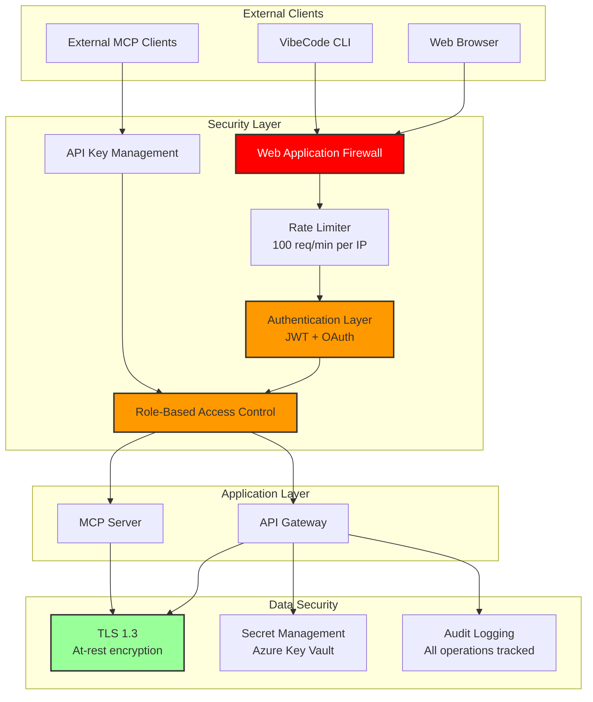

---

## Conclusion

These architecture diagrams illustrate VibeCode's evolution from a web-first IDE to a comprehensive MCP-based AI platform with CLI, marketplace, and multi-agent capabilities.

**Key Architectural Principles:**
1. ✅ **Modularity** - Clean separation of concerns (MCP, AI, services)
2. ✅ **Scalability** - Horizontal scaling at every layer
3. ✅ **Security** - Defense-in-depth approach
4. ✅ **Extensibility** - MCP protocol enables ecosystem growth
5. ✅ **Reliability** - Multi-provider fallback, robust error handling

**Critical Success Factors:**
1. Execute Phase 1 flawlessly (MCP tools, repository map)
2. Launch CLI early (capture terminal developer market)
3. Build marketplace before competitors (first-mover advantage)
4. Maintain architectural flexibility (adapt as MCP evolves)

---

**Document Version:** 1.0
**Created:** 2025-10-01
**Author:** System Architect
**Related Documents:**
- Full Analysis: `/claudedocs/AI_TERMINAL_IDE_ECOSYSTEM_ANALYSIS.md`
- Executive Summary: `/claudedocs/EXECUTIVE_SUMMARY_AI_ECOSYSTEM.md`
- GitHub Issue: `/claudedocs/GITHUB_ISSUE_AI_TERMINAL_IDE_ECOSYSTEM.md`
