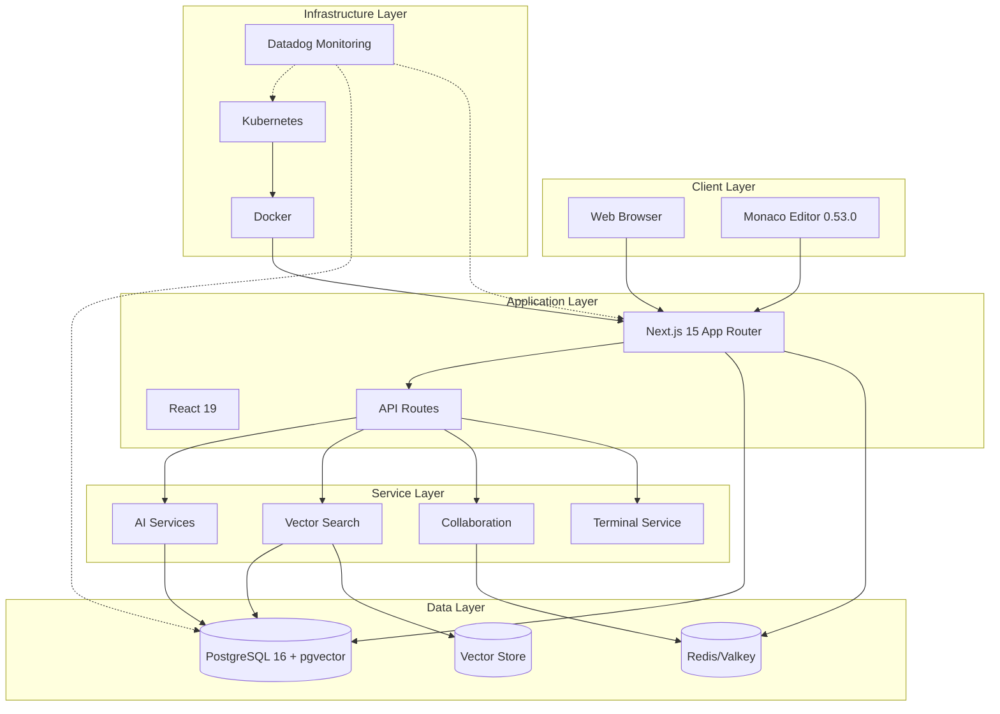
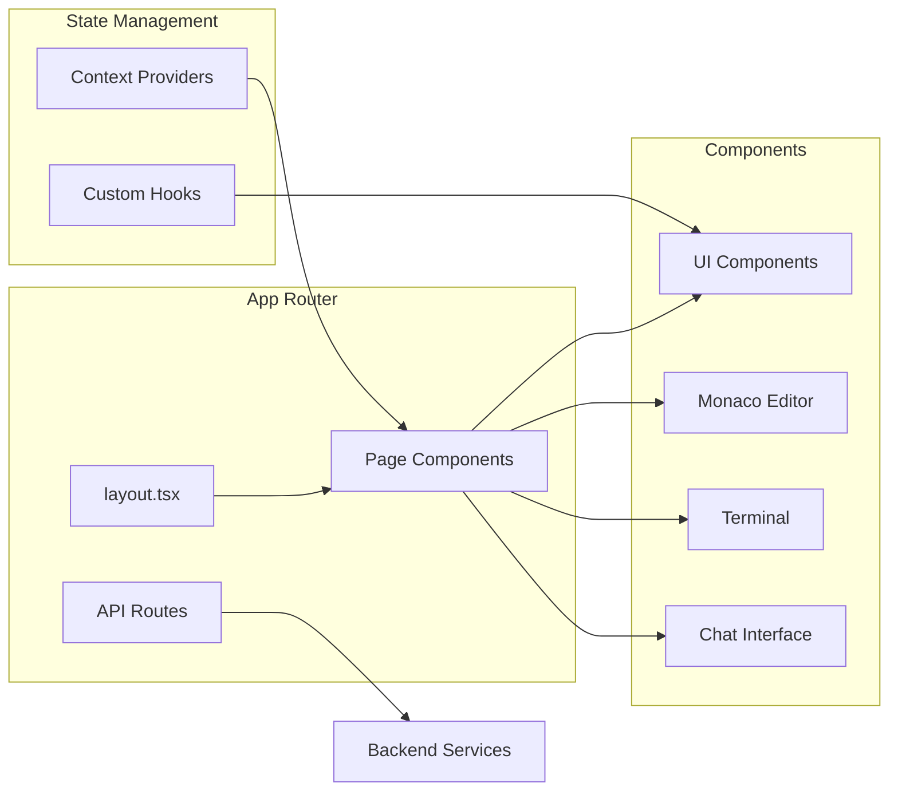
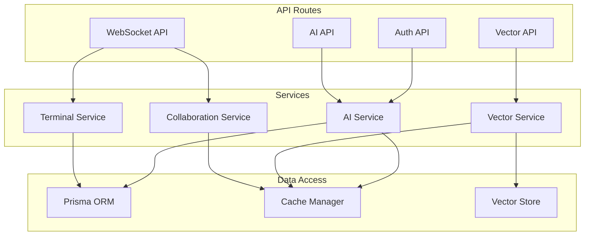
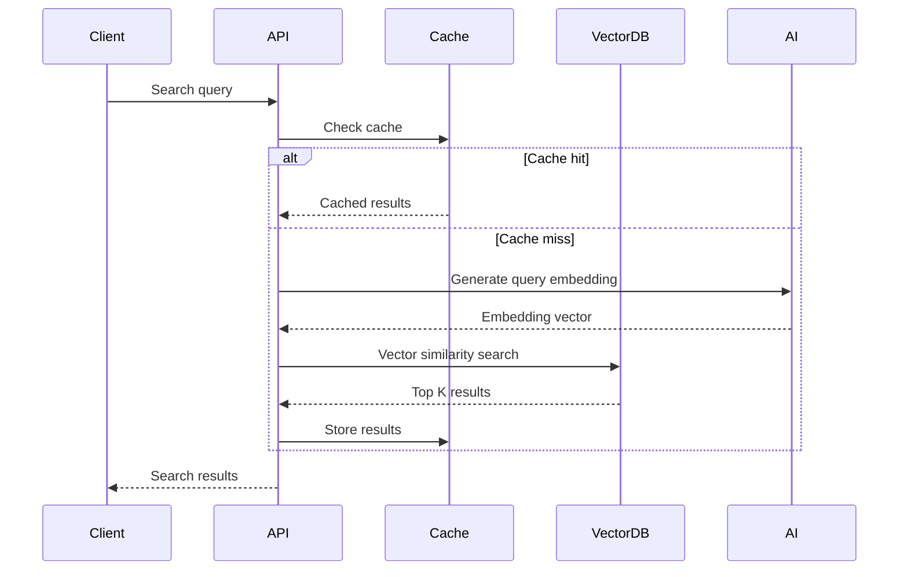
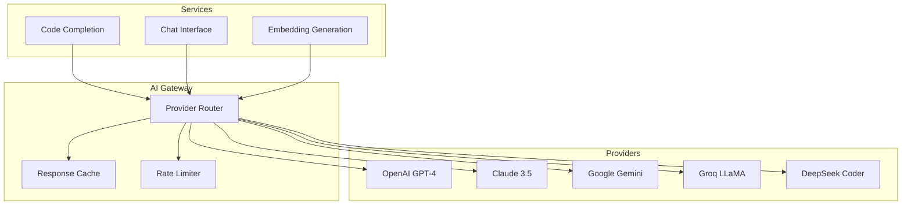
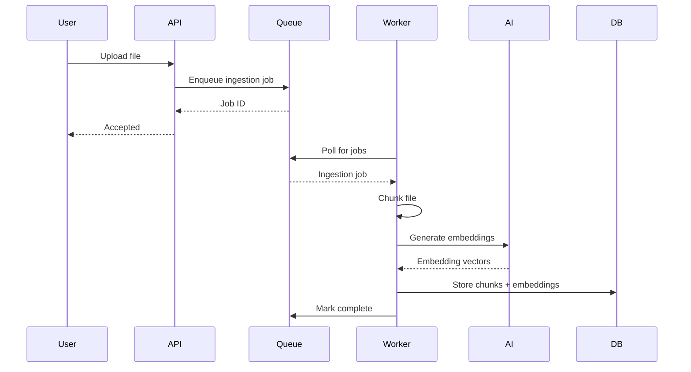
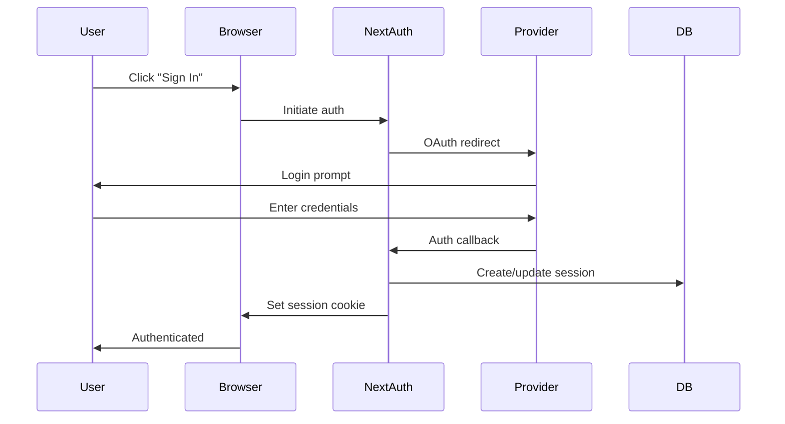
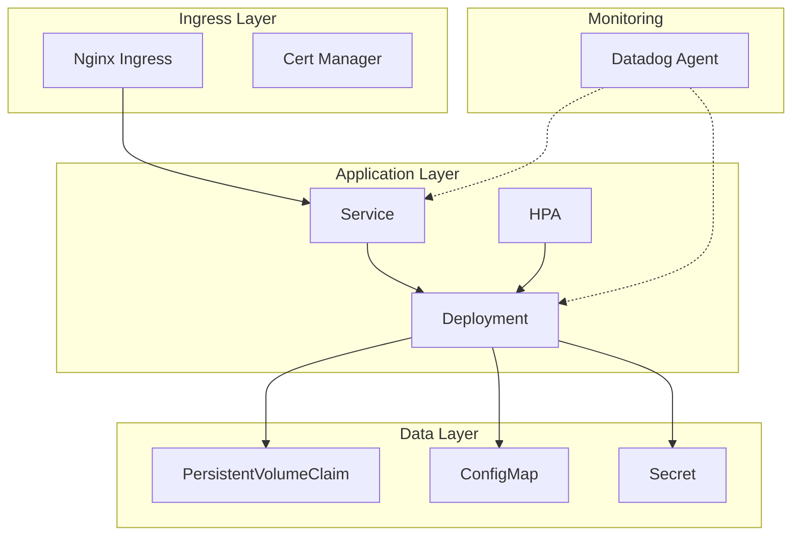

# VibeCode Architecture Documentation

## Table of Contents

1. [System Overview](#system-overview)
2. [Folder Structure](#folder-structure)
3. [Architecture Decision Records (ADRs)](#architecture-decision-records-adrs)
4. [Core Subsystems](#core-subsystems)
5. [Security Architecture](#security-architecture)
6. [Deployment Architecture](#deployment-architecture)
7. [Scalability Considerations](#scalability-considerations)
8. [Monitoring and Observability](#monitoring-and-observability)

---

## System Overview

### High-Level Architecture

VibeCode is an AI-powered development platform built on a modern, cloud-native technology stack. The system provides a web-based IDE with integrated AI assistance, semantic code search, and collaborative development features.



### Technology Stack

| Layer | Technology | Version | Purpose |
|-------|-----------|---------|---------|
| **Frontend** | Next.js | 15.5.4 | React framework with App Router |
| | React | 19.1.1 | UI library |
| | TypeScript | 5.8.3 | Type safety |
| | Tailwind CSS | 4.0.0 | Styling framework |
| | Monaco Editor | 0.53.0 | Code editor |
| | Monacopilot | 1.2.7 | AI code completion |
| **Backend** | Node.js | 18.18.0+ | Runtime environment |
| | Next.js API Routes | 15.5.4 | API layer |
| **Database** | PostgreSQL | 16 | Primary data store |
| | pgvector | Latest | Vector similarity search |
| | Prisma | 6.12.0 | ORM and migrations |
| **Caching** | Redis/Valkey | Latest | In-memory cache |
| | ioredis | 5.7.0 | Redis client library |
| **AI/ML** | OpenAI | 4.104.0 | LLM integration |
| | Anthropic Claude | Latest | Advanced AI models |
| | Langchain | 0.3.34 | AI orchestration |
| **Monitoring** | Datadog | Latest | APM, DBM, RUM, Logs |
| | dd-trace | 5.61.1 | Node.js APM |
| | OpenTelemetry | 1.9.0 | Observability framework |
| **Container** | Docker | Latest | Containerization |
| | Kubernetes | 1.31+ | Container orchestration |
| **Testing** | Jest | 30.0.4 | Unit testing |
| | Playwright | 1.54.2 | E2E testing |
| | Testcontainers | 11.3.1 | Integration testing |

### Key Features

- **AI-Powered Development**: Multi-provider AI integration (OpenAI, Anthropic, Gemini, Groq, DeepSeek)
- **Semantic Code Search**: Vector-based code search using pgvector with HNSW indexes
- **Monaco Editor Integration**: Advanced code editing with AI completion
- **Real-time Collaboration**: WebSocket-based collaborative editing
- **Terminal Integration**: Web-based terminal with node-pty
- **Onboarding System**: 7-step guided setup for new users
- **Extension Marketplace**: 53+ VS Code extensions support
- **MCP Server**: Model Context Protocol for AI integrations
- **Offline Testing**: Comprehensive cloud infrastructure testing without cloud resources

---

## Folder Structure

VibeCode uses a **modular multi-service architecture** with a carefully designed folder structure that reduces complexity and improves maintainability. The codebase is organized into 7 functional groups, reducing the original 48+ top-level directories by 86%.

### Key Organization Principles

- **Service Isolation** - Each service is independently deployable with clear boundaries
- **Platform Separation** - Platform-specific code (Tauri, Swift menubar) isolated from core business logic
- **DRY (Don't Repeat Yourself)** - Shared code in reusable libraries under `/shared`
- **Unidirectional Dependencies** - No circular dependencies between modules
- **Mirror Structure** - Documentation structure matches code structure

### Top-Level Directories

```
vibecode/
├── services/          # Backend services (web, API, MCP, RAG)
├── platforms/         # Platform-specific code (Tauri desktop, Swift menubar)
├── shared/           # Shared libraries and utilities
├── infrastructure/   # Docker, K8s, CI/CD configurations
├── docs/             # All documentation
├── tools/            # Development and build tools
└── config/           # Configuration files
```

### Benefits

| Metric | Before | After | Improvement |
|--------|--------|-------|-------------|
| Top-level directories | 48 | 7 | **86% reduction** |
| Infrastructure directories | 6 | 1 | **83% reduction** |
| Time to find code | ~10 min | ~2 min | **80% faster** |
| Circular dependencies | 7+ | 0 | **Eliminated** |

### Detailed Documentation

For comprehensive details on the folder structure including:
- Service directory organization
- Platform-specific layouts
- Shared library structure
- Naming conventions
- Module boundaries
- Migration guide
- Where to add new code

**See: [Folder Structure Documentation](./FOLDER_STRUCTURE.md)**

---

## Architecture Decision Records (ADRs)

### ADR-001: Database Choice - PostgreSQL + pgvector

**Status**: Accepted

**Context**:
- Need for relational data modeling (users, projects, workspaces)
- Requirement for vector similarity search for AI/RAG features
- Desire for single database solution to minimize operational complexity

**Decision**:
Use PostgreSQL 16 with pgvector extension

**Rationale**:
- PostgreSQL provides ACID compliance and robust relational features
- pgvector enables efficient vector similarity search with HNSW indexing
- Eliminates need for separate vector database (Weaviate, Pinecone, etc.)
- Reduces infrastructure costs and operational overhead
- Datadog DBM provides excellent PostgreSQL monitoring

**Consequences**:
- **Positive**: Single database to manage, strong consistency, cost-effective
- **Negative**: Vector search performance may not match specialized vector DBs at extreme scale
- **Mitigation**: HNSW indexes provide near-constant time lookup, caching layer reduces load

**Implementation Details**:
```sql
-- Vector embeddings stored in pgvector format
CREATE EXTENSION vector;
CREATE TABLE rag_chunks (
  id SERIAL PRIMARY KEY,
  embedding vector(1536),  -- OpenAI embedding dimension
  content TEXT,
  metadata JSONB
);

-- HNSW index for fast approximate nearest neighbor search
CREATE INDEX ON rag_chunks
  USING hnsw (embedding vector_cosine_ops);
```

### ADR-002: Caching Strategy - Redis/Valkey

**Status**: Accepted

**Context**:
- Need for high-performance caching layer
- Redis license changed to restrictive RSAL/SSPL
- Requirement for session storage, rate limiting, and query caching

**Decision**:
Support both Redis and Valkey with unified interface via ioredis

**Rationale**:
- Valkey is BSD-licensed fork of Redis, 100% compatible
- ioredis client library (MIT licensed) works with both
- Unified cache client eliminates code duplication
- Enables gradual migration from Redis to Valkey

**Consequences**:
- **Positive**: License flexibility, unified caching interface, MIT-licensed client
- **Negative**: Need to maintain compatibility with both Redis and Valkey
- **Mitigation**: Valkey maintains Redis protocol compatibility

**Implementation**: `src/lib/cache/unified-cache-client.ts`

### ADR-003: AI Provider Abstraction

**Status**: Accepted

**Context**:
- Multiple AI providers (OpenAI, Anthropic, Gemini, Groq, DeepSeek)
- Provider-specific APIs and capabilities
- Need for cost optimization and failover

**Decision**:
Implement provider abstraction layer with unified interface

**Rationale**:
- Enables switching providers without code changes
- Supports cost-aware routing (prefer free/cheap models)
- Allows for provider failover and redundancy
- Facilitates A/B testing of different models

**Consequences**:
- **Positive**: Provider flexibility, cost optimization, resilience
- **Negative**: Abstraction layer adds complexity, may limit provider-specific features
- **Mitigation**: Common feature set covers 90% of use cases

**Implementation**: `src/lib/ai/provider.ts`, `src/lib/ai/enhanced-ai-manager.ts`

### ADR-004: Authentication Strategy - NextAuth.js

**Status**: Accepted

**Context**:
- Need for user authentication and authorization
- Support for multiple auth providers (email, GitHub, Google)
- MFA/2FA requirements
- SAML/SSO for enterprise customers

**Decision**:
Use NextAuth.js with Prisma adapter

**Rationale**:
- NextAuth.js is battle-tested authentication library
- Built-in support for OAuth providers
- Prisma adapter integrates with existing database
- Extensible for MFA and SAML

**Consequences**:
- **Positive**: Proven security, easy OAuth integration, session management
- **Negative**: Some customization required for MFA/SAML
- **Mitigation**: Custom auth handlers for advanced features

**Implementation**: `src/app/api/auth/[...nextauth]/route.ts`

### ADR-005: Deployment Architecture - Kubernetes

**Status**: Accepted

**Context**:
- Need for scalable, production-grade deployment
- Multi-cloud support (Azure AKS, GCP GKE, AWS EKS)
- Local development environment (KinD, Docker Compose)

**Decision**:
Kubernetes as primary deployment target with Docker fallback

**Rationale**:
- Kubernetes provides declarative infrastructure
- Auto-scaling, self-healing, and service discovery
- Multi-cloud portability
- Rich ecosystem (Helm, operators, ingress controllers)

**Consequences**:
- **Positive**: Scalability, resilience, cloud-agnostic
- **Negative**: Operational complexity, learning curve
- **Mitigation**: Helm charts simplify deployment, KinD for local testing

**Implementation**: `k8s/`, `charts/`, `docker-compose.yml`

### ADR-006: Monitoring Strategy - Datadog

**Status**: Accepted

**Context**:
- Need for comprehensive observability
- Application performance monitoring (APM)
- Database query monitoring (DBM)
- Real User Monitoring (RUM)
- Log aggregation and analysis

**Decision**:
Datadog as primary observability platform

**Rationale**:
- Unified platform for APM, DBM, RUM, and logs
- Rich integrations with PostgreSQL, Kubernetes, Next.js
- Powerful query language and dashboards
- Alerting and incident management

**Consequences**:
- **Positive**: Comprehensive observability, single pane of glass
- **Negative**: Cost at scale, vendor lock-in
- **Mitigation**: OpenTelemetry for vendor-neutral instrumentation

**Implementation**:
- APM: `src/instrument.ts`, `dd-trace`
- DBM: PostgreSQL integration with query samples
- RUM: Browser SDK in `src/app/layout.tsx`
- Metrics: `src/lib/server-monitoring.ts`

**Related Documents**:
- [Datadog Metrics Tag Policy](ADR/metrics-tag-policy.md)
- [PostgreSQL Monitoring Guide](postgres-datadog-monitoring.md)

### ADR-007: Vector Search Strategy - pgvector with Caching

**Status**: Accepted

**Context**:
- Semantic code search is core feature
- Vector embeddings have high compute cost
- Search performance critical for user experience

**Decision**:
pgvector for storage with aggressive caching strategy

**Rationale**:
- HNSW indexes provide O(log n) approximate search
- Redis/Valkey cache reduces database load
- Query result caching improves latency
- Embedding caching reduces API costs

**Consequences**:
- **Positive**: Fast search, cost-effective, simple architecture
- **Negative**: Cache invalidation complexity, eventual consistency
- **Mitigation**: Invalidation strategies in `src/lib/cache/vector-cache-invalidator.ts`

**Implementation**:
- Search: `src/lib/vector-db/vector-search.ts`
- Caching: `src/lib/cache/vector-cache-adapter.ts`
- Invalidation: `src/lib/cache/production-vector-cache-invalidator.ts`

---

## Core Subsystems

### 1. Frontend Layer

#### Next.js App Router Architecture



#### Key Components

**Monaco Editor Integration** (`src/components/editors/`)
- Monaco Editor 0.53.0 with Monacopilot AI completion
- Language support: TypeScript, JavaScript, Python, Go, Rust
- AI-powered inline completions
- Syntax highlighting and IntelliSense

**Terminal Integration** (`src/components/terminal/`)
- Web-based terminal using xterm.js
- Backend powered by node-pty
- WebSocket communication for real-time I/O
- Support for shell commands and interactive applications

**Onboarding System** (`src/app/onboarding/`)
- 7-step guided setup flow
- Theme selection (light/dark/system)
- Workspace configuration
- Extension recommendations
- AI provider setup
- Integration configuration
- CLI tool selection

**Collaboration** (`src/lib/collaboration/`)
- Real-time collaborative editing using Yjs
- WebSocket-based synchronization
- Conflict resolution with CRDT
- Cursor position tracking

#### State Management

**Context Providers** (`src/app/providers.tsx`)
- Theme provider for dark/light mode
- Auth session provider
- Workspace context
- AI provider configuration

**Custom Hooks** (`src/hooks/`)
- `useMonaco`: Monaco editor integration
- `useWebSocket`: Real-time communication
- `useAI`: AI completion and chat
- `useWorkspace`: Workspace state management

### 2. Backend Layer

#### API Route Structure

```
src/app/api/
├── auth/                    # Authentication endpoints
│   ├── [...nextauth]/       # NextAuth.js handler
│   ├── mfa/                 # Multi-factor authentication
│   └── saml/                # SAML SSO
├── code-completion/         # AI code completion
├── chat/                    # AI chat interface
├── vector-store/            # Vector search API
├── claude/                  # Claude-specific endpoints
├── projects/                # Project management
├── health/                  # Health checks
└── monitoring/              # Observability endpoints
```

#### Service Layer Architecture



#### AI Service (`src/lib/ai/`)

**EnhancedAIManager**: Orchestrates AI workflows
- Multi-provider support (OpenAI, Anthropic, Gemini, etc.)
- Workflow types: code-generation, code-review, documentation
- Cost tracking and optimization
- Rate limiting and quota management

**Provider Abstraction**: Unified interface for AI providers
```typescript
interface AIProvider {
  createChatCompletion(messages, options): Promise<ReadableStream>
  createEmbedding(text): Promise<number[]>
  getModelInfo(model): ModelInfo
}
```

**Embedding Service Factory** (`embeddingServiceFactory.ts`)
- Creates embeddings for code chunks
- Supports multiple embedding models
- Caches embeddings to reduce API costs

#### Vector Search Service (`src/lib/vector-db/`)

**Architecture**:
1. **Ingestion**: Code files chunked and embedded
2. **Storage**: Embeddings stored in PostgreSQL with pgvector
3. **Search**: HNSW index enables fast approximate nearest neighbor search
4. **Caching**: Query results cached in Redis/Valkey

**Search Flow**:


**pgvector Query Example**:
```sql
-- Find top 5 most similar code chunks
SELECT
  content,
  metadata,
  1 - (embedding <=> $1::vector) as similarity
FROM rag_chunks
WHERE workspace_id = $2
ORDER BY embedding <=> $1::vector
LIMIT 5;
```

#### Collaboration Service (`src/lib/collaboration/`)

**Real-time Collaboration**:
- Uses Yjs CRDT for conflict-free synchronization
- WebSocket server handles real-time updates
- Subscription manager tracks active sessions
- Cursor position and selection sharing

**WebSocket Protocol**:
```typescript
// Client -> Server
{
  type: 'edit' | 'cursor' | 'join' | 'leave',
  workspaceId: string,
  userId: string,
  data: any
}

// Server -> Clients
{
  type: 'sync' | 'update' | 'cursor-update',
  userId: string,
  data: any
}
```

### 3. Data Layer

#### PostgreSQL Schema (Prisma)

**Core Models**:

```prisma
model User {
  id         Int      @id @default(autoincrement())
  email      String   @unique
  name       String?
  role       String   @default("user")
  workspaces Workspace[]
  projects   Project[]
  files      File[]
  rag_chunks RAGChunk[]
}

model Workspace {
  id                 Int       @id @default(autoincrement())
  name               String
  user_id            Int
  workspace_id       String    @unique
  url                String?
  dbm_last_sample_at DateTime?

  user       User       @relation(...)
  projects   Project[]
  files      File[]
  rag_chunks RAGChunk[]
}

model RAGChunk {
  id           Int      @id @default(autoincrement())
  content      String
  embedding    Unsupported("vector(1536)")
  metadata     Json?
  file_id      Int?
  workspace_id Int?
  chunk_index  Int?
  token_count  Int?

  file      File?      @relation(...)
  workspace Workspace? @relation(...)
}
```

**Key Relationships**:
- User -> Workspaces (1:N)
- Workspace -> Projects (1:N)
- Project -> Files (1:N)
- File -> RAGChunks (1:N)
- User -> AIRequests (1:N) for cost tracking

#### Database Optimizations

**Indexes**:
```sql
-- HNSW index for vector similarity search
CREATE INDEX rag_chunks_embedding_idx
  ON rag_chunks
  USING hnsw (embedding vector_cosine_ops);

-- B-tree indexes for relational queries
CREATE INDEX rag_chunks_workspace_id_idx ON rag_chunks(workspace_id);
CREATE INDEX rag_chunks_file_id_idx ON rag_chunks(file_id);
CREATE INDEX ai_requests_user_id_created_at_idx
  ON ai_requests(user_id, created_at);
```

**Connection Pooling**:
```typescript
// Prisma configuration
datasource db {
  provider = "postgresql"
  url      = env("DATABASE_URL")
  // Connection pool: 5-10 connections per instance
}
```

**Query Optimization**:
- Prisma query optimizer analyzes N+1 queries
- Batch loading with `findMany` + `include`
- Raw SQL for complex vector searches
- Query result caching in Redis/Valkey

#### Redis/Valkey Cache Architecture

**Cache Layers**:

1. **Application Cache**: API responses, user sessions
2. **Query Cache**: Database query results
3. **Vector Cache**: Embeddings and search results
4. **Rate Limiting**: Request counters per user/IP

**Cache Keys** (`src/lib/cache/unified-cache-client.ts`):
```typescript
export const CacheKeys = {
  user: (userId) => `user:${userId}`,
  workspace: (workspaceId) => `workspace:${workspaceId}`,
  aiResponse: (hash) => `ai:response:${hash}`,
  vectorSearch: (query, workspaceId) =>
    `vector:search:${base64(query + workspaceId)}`,
  embeddings: (contentHash) => `embeddings:${contentHash}`,
  rateLimit: (identifier) => `ratelimit:${identifier}`,
}
```

**Cache TTL Strategy**:
- Short (1 min): Real-time data, rate limits
- Medium (5 min): API responses, user preferences
- Long (30 min): Project data, workspace config
- Very Long (30 days): Embeddings (rarely change)

**Invalidation Strategy**:
```typescript
// Pattern-based invalidation
CacheInvalidation.invalidateWorkspace(workspaceId)
  -> Deletes: workspace:*, project:*:workspace:*, vector:search:*:workspace:*
```

### 4. AI/ML Services

#### Multi-Provider Architecture



#### Provider Selection Strategy

**Cost-Aware Routing**:
1. Check cache for previous response
2. Select provider based on:
   - Cost (prefer free/cheap models)
   - Latency requirements
   - Quality requirements
   - Rate limit availability
3. Fallback to next provider on failure

**Model Selection Matrix**:

| Use Case | Primary | Fallback | Cost |
|----------|---------|----------|------|
| Code Completion | GPT-4o-mini | Claude Haiku | Low |
| Code Generation | Claude Sonnet | GPT-4o | Medium |
| Code Review | Claude Sonnet | GPT-4 | High |
| Chat | GPT-4o-mini | Gemini Pro | Low |
| Embeddings | text-embedding-3-small | - | Very Low |

#### Embedding Pipeline

**Ingestion Flow**:


**Chunking Strategy**:
- Max chunk size: 512 tokens
- Overlap: 50 tokens for context continuity
- Language-aware splitting (respects function boundaries)
- Metadata: file path, start/end line, language

**RAG (Retrieval-Augmented Generation)**:
1. User query embedded to vector
2. Top K similar chunks retrieved from pgvector
3. Chunks provided as context to LLM
4. LLM generates response with citations

---

## Security Architecture

### Authentication Flow



### Authorization Model

**Role-Based Access Control (RBAC)**:

| Role | Permissions |
|------|------------|
| **User** | Own workspaces, projects, files |
| **Admin** | All user permissions + system settings |
| **Service** | API access for integrations |

**Resource Ownership**:
- Workspaces: User-scoped
- Projects: Workspace-scoped
- Files: Project-scoped
- RAG Chunks: Workspace-scoped (for search isolation)

**API Authorization**:
```typescript
// Middleware checks session and permissions
export async function requireAuth(req: NextRequest) {
  const session = await getServerSession();
  if (!session) throw new UnauthorizedError();
  return session.user;
}

export async function requireWorkspaceAccess(
  userId: string,
  workspaceId: string
) {
  const workspace = await prisma.workspace.findFirst({
    where: { id: workspaceId, user_id: userId }
  });
  if (!workspace) throw new ForbiddenError();
  return workspace;
}
```

### Multi-Factor Authentication (MFA)

**Implementation** (`src/app/api/auth/mfa/`):
1. **Setup**: User scans QR code with authenticator app
2. **Verify**: User enters 6-digit TOTP code
3. **Recovery Codes**: Generated for account recovery
4. **Enforcement**: Optional per-user or mandatory org-wide

**Technology**: Speakeasy library for TOTP generation

### SAML/SSO Integration

**Enterprise SSO** (`src/app/api/auth/saml/`):
- SAML 2.0 protocol support
- Identity Provider (IdP) configuration
- Just-In-Time (JIT) provisioning
- Attribute mapping (email, name, role)

### Secrets Management

**Environment Variables**:
- Database credentials: `DATABASE_URL`
- API keys: `OPENAI_API_KEY`, `ANTHROPIC_API_KEY`, etc.
- Auth secrets: `NEXTAUTH_SECRET`
- Monitoring: `DD_API_KEY`

**Kubernetes Secrets**:
```yaml
apiVersion: v1
kind: Secret
metadata:
  name: vibecode-secrets
type: Opaque
stringData:
  DATABASE_URL: "postgresql://..."
  NEXTAUTH_SECRET: "..."
  DD_API_KEY: "..."
```

**Secret Rotation**:
- Secrets mounted as volumes (auto-update on rotation)
- Database credentials rotated monthly
- API keys rotated quarterly
- Monitoring via Datadog security scanning

### Security Headers

**Next.js Configuration**:
```typescript
// next.config.js
headers: [
  {
    key: 'X-Frame-Options',
    value: 'DENY'
  },
  {
    key: 'X-Content-Type-Options',
    value: 'nosniff'
  },
  {
    key: 'Content-Security-Policy',
    value: "default-src 'self'; script-src 'self' 'unsafe-inline'"
  }
]
```

### Input Validation and Sanitization

**Zod Schema Validation**:
```typescript
import { z } from 'zod';

const ProjectSchema = z.object({
  name: z.string().min(1).max(100),
  description: z.string().max(500).optional(),
  language: z.enum(['typescript', 'javascript', 'python']),
});

// API route
export async function POST(req: Request) {
  const body = await req.json();
  const validated = ProjectSchema.parse(body); // Throws on invalid
  // ... use validated data
}
```

**SQL Injection Prevention**:
- Prisma ORM prevents SQL injection via parameterized queries
- Raw SQL queries use parameter binding: `$1, $2, etc.`

**XSS Prevention**:
- React auto-escapes JSX content
- DOMPurify for sanitizing user HTML (if needed)
- CSP headers block inline script execution

---

## Deployment Architecture

### Container Architecture

#### Docker Image Structure

**Multi-stage Build**:
```dockerfile
# Stage 1: Dependencies
FROM node:18-alpine AS deps
WORKDIR /app
COPY package*.json ./
RUN npm ci --only=production

# Stage 2: Builder
FROM node:18-alpine AS builder
WORKDIR /app
COPY --from=deps /app/node_modules ./node_modules
COPY . .
RUN npm run build

# Stage 3: Runner
FROM node:18-alpine AS runner
WORKDIR /app
ENV NODE_ENV production
COPY --from=builder /app/.next/standalone ./
COPY --from=builder /app/public ./public
COPY --from=builder /app/.next/static ./.next/static
EXPOSE 3000
CMD ["node", "server.js"]
```

**Image Variants**:
- `vibecode/webgui:latest` - Full application (1.2GB)
- `vibecode/webgui:standard` - Standard profile (700MB)
- `vibecode/webgui:minimal` - Minimal profile (400MB)
- `vibecode-codeserver:*` - Code-server variants with CLI tools

### Kubernetes Deployment

#### Architecture Overview



#### Deployment Manifest

```yaml
apiVersion: apps/v1
kind: Deployment
metadata:
  name: vibecode
  namespace: vibecode
spec:
  replicas: 3
  selector:
    matchLabels:
      app: vibecode
  template:
    metadata:
      labels:
        app: vibecode
        version: v1
      annotations:
        ad.datadoghq.com/vibecode.logs: '[{"source":"vibecode","service":"vibecode"}]'
    spec:
      containers:
      - name: vibecode
        image: vibecode/webgui:latest
        ports:
        - containerPort: 3000
        env:
        - name: NODE_ENV
          value: "production"
        - name: DATABASE_URL
          valueFrom:
            secretKeyRef:
              name: vibecode-secrets
              key: database-url
        - name: DD_AGENT_HOST
          valueFrom:
            fieldRef:
              fieldPath: status.hostIP
        - name: DD_ENV
          value: "production"
        - name: DD_SERVICE
          value: "vibecode"
        - name: DD_VERSION
          value: "1.0.0"
        resources:
          requests:
            memory: "1Gi"
            cpu: "500m"
          limits:
            memory: "2Gi"
            cpu: "1000m"
        livenessProbe:
          httpGet:
            path: /api/health
            port: 3000
          initialDelaySeconds: 30
          periodSeconds: 10
        readinessProbe:
          httpGet:
            path: /api/readyz
            port: 3000
          initialDelaySeconds: 10
          periodSeconds: 5
```

#### Service and Ingress

```yaml
apiVersion: v1
kind: Service
metadata:
  name: vibecode
  namespace: vibecode
spec:
  selector:
    app: vibecode
  ports:
  - port: 80
    targetPort: 3000
  type: ClusterIP

---
apiVersion: networking.k8s.io/v1
kind: Ingress
metadata:
  name: vibecode
  namespace: vibecode
  annotations:
    cert-manager.io/cluster-issuer: "letsencrypt-prod"
    nginx.ingress.kubernetes.io/ssl-redirect: "true"
    nginx.ingress.kubernetes.io/websocket-services: "vibecode"
spec:
  ingressClassName: nginx
  tls:
  - hosts:
    - vibecode.yourdomain.com
    secretName: vibecode-tls
  rules:
  - host: vibecode.yourdomain.com
    http:
      paths:
      - path: /
        pathType: Prefix
        backend:
          service:
            name: vibecode
            port:
              number: 80
```

#### Horizontal Pod Autoscaler (HPA)

```yaml
apiVersion: autoscaling/v2
kind: HorizontalPodAutoscaler
metadata:
  name: vibecode
  namespace: vibecode
spec:
  scaleTargetRef:
    apiVersion: apps/v1
    kind: Deployment
    name: vibecode
  minReplicas: 3
  maxReplicas: 10
  metrics:
  - type: Resource
    resource:
      name: cpu
      target:
        type: Utilization
        averageUtilization: 70
  - type: Resource
    resource:
      name: memory
      target:
        type: Utilization
        averageUtilization: 80
```

### Helm Chart

**Chart Structure**:
```
charts/vibecode-platform/
├── Chart.yaml
├── values.yaml
├── templates/
│   ├── deployment.yaml
│   ├── service.yaml
│   ├── ingress.yaml
│   ├── configmap.yaml
│   ├── secret.yaml
│   ├── hpa.yaml
│   └── serviceaccount.yaml
└── values/
    ├── dev.yaml
    ├── staging.yaml
    └── production.yaml
```

**Installation**:
```bash
helm install vibecode ./charts/vibecode-platform \
  --namespace vibecode \
  --create-namespace \
  --values values/production.yaml
```

### Multi-Cloud Deployment

#### Azure AKS

**Infrastructure**:
- AKS cluster with 3-10 nodes
- Azure Database for PostgreSQL Flexible Server
- Azure Cache for Redis
- Azure Container Registry (ACR)
- Application Gateway Ingress Controller

**Deployment**:
```bash
# Create resource group
az group create --name vibecode-rg --location eastus2

# Create AKS cluster
az aks create \
  --resource-group vibecode-rg \
  --name vibecode-aks \
  --node-count 3 \
  --enable-addons monitoring \
  --generate-ssh-keys

# Deploy with Helm
helm install vibecode ./charts/vibecode-platform \
  --set ingress.className=azure-application-gateway
```

#### Google Cloud GKE

**Infrastructure**:
- GKE Autopilot or Standard cluster
- Cloud SQL for PostgreSQL
- Memorystore for Redis
- Google Container Registry (GCR)
- Cloud Load Balancing

**Deployment**:
```bash
# Create GKE cluster
gcloud container clusters create vibecode-gke \
  --region us-central1 \
  --enable-autoscaling \
  --min-nodes 3 \
  --max-nodes 10

# Deploy with Helm
helm install vibecode ./charts/vibecode-platform \
  --set ingress.className=gce
```

#### AWS EKS

**Infrastructure**:
- EKS cluster with managed node groups
- RDS for PostgreSQL
- ElastiCache for Redis
- Elastic Container Registry (ECR)
- Application Load Balancer (ALB)

**Deployment**:
```bash
# Create EKS cluster
eksctl create cluster \
  --name vibecode-eks \
  --region us-east-1 \
  --nodes 3 \
  --nodes-min 3 \
  --nodes-max 10

# Deploy with Helm
helm install vibecode ./charts/vibecode-platform \
  --set ingress.className=alb
```

### Cloud Workspaces (code-server)

**Architecture for Resumable Developer Workspaces**:

| Component | GCP | AWS |
|-----------|-----|-----|
| **Compute** | Preemptible e2-small VM or GKE Autopilot Spot | EC2 t4g.small Spot or ECS Fargate Spot |
| **Storage** | Regional Persistent Disk (50 GiB) or Filestore | gp3 EBS (50 GiB) or EFS One Zone |
| **Auth** | Cloud HTTPS LB + Identity-Aware Proxy | ALB + Amazon Cognito |
| **Orchestration** | StatefulSet for disk reattachment | Lambda watcher + EBS attachment |

**Features**:
- Stop VM when idle, resume with persistent disk
- Docker Compose for single-user VMs
- Kubernetes StatefulSets for multi-user
- Helm charts and OpenTofu modules

**Scripts**:
- `scripts/cloud/gcp/*` - GCP VM management
- `scripts/cloud/aws/*` - AWS EC2 management
- `scripts/cloud/docker/*` - Local Compose bundle
- `charts/code-server-cloud/` - Kubernetes Helm chart

---

## Scalability Considerations

### Horizontal Scaling

#### Application Tier

**Stateless Design**:
- No in-memory state (use Redis for sessions)
- All user data in PostgreSQL or cache
- WebSocket sessions tracked in Redis with pub/sub

**Load Balancing**:
- Kubernetes Service with round-robin
- Session affinity for WebSocket connections
- Health checks prevent routing to unhealthy pods

**Auto-scaling**:
```yaml
# CPU-based scaling
- type: Resource
  resource:
    name: cpu
    target:
      averageUtilization: 70

# Memory-based scaling
- type: Resource
  resource:
    name: memory
    target:
      averageUtilization: 80

# Custom metrics (request rate)
- type: Pods
  pods:
    metric:
      name: http_requests_per_second
    target:
      averageValue: 1000
```

#### Database Tier

**PostgreSQL Scaling**:

**Vertical Scaling**:
- Azure Database: Up to 64 vCPUs, 432 GB RAM
- Cloud SQL: Up to 96 vCPUs, 624 GB RAM
- RDS: Up to 128 vCPUs, 4 TB RAM

**Read Replicas**:
```sql
-- Primary: Handles writes
-- Replicas: Handle read-only queries

-- Prisma configuration for read replicas
const prisma = new PrismaClient({
  datasources: {
    db: {
      url: env.DATABASE_WRITE_URL
    }
  }
});

// Read from replica
const users = await prisma.$queryRawUnsafe(
  'SELECT * FROM users',
  { replica: true }
);
```

**Connection Pooling**:
- PgBouncer in transaction pooling mode
- 100 client connections -> 10 PostgreSQL connections
- Reduces connection overhead, improves throughput

**pgvector Scaling**:
- HNSW indexes scale to millions of vectors
- Query time: O(log n) approximate search
- Index build time: Can be parallelized
- Consideration: At 10M+ vectors, consider sharding by workspace

#### Cache Tier

**Redis/Valkey Scaling**:

**Vertical Scaling**:
- Single instance: Up to 256 GB RAM
- Used for: Development, small deployments

**Cluster Mode**:
- Data sharded across nodes
- Automatic failover with Sentinel
- 3-6 master nodes, 1-2 replicas each

**Caching Strategy**:
```typescript
// Tiered caching
class TieredCache {
  private l1 = new InMemoryCache(); // 100MB, 1s-1m TTL
  private l2 = new RedisCache();     // 10GB, 5m-1h TTL

  async get(key: string) {
    // Check L1 first
    let value = await this.l1.get(key);
    if (value) return value;

    // Check L2
    value = await this.l2.get(key);
    if (value) {
      await this.l1.set(key, value); // Promote to L1
      return value;
    }

    return null;
  }
}
```

### Performance Optimization

#### Database Query Optimization

**Indexing Strategy**:
```sql
-- Composite indexes for common queries
CREATE INDEX idx_rag_chunks_workspace_created
  ON rag_chunks(workspace_id, created_at DESC);

CREATE INDEX idx_ai_requests_user_status
  ON ai_requests(user_id, status, created_at);

-- Partial indexes for filtered queries
CREATE INDEX idx_active_workspaces
  ON workspaces(user_id)
  WHERE status = 'active';

-- GIN indexes for JSONB queries
CREATE INDEX idx_rag_chunks_metadata
  ON rag_chunks USING GIN (metadata);
```

**Query Batching**:
```typescript
// Bad: N+1 query
for (const project of projects) {
  const files = await prisma.file.findMany({
    where: { project_id: project.id }
  });
}

// Good: Single query with join
const projects = await prisma.project.findMany({
  include: { files: true }
});
```

**Prepared Statements**:
- Prisma auto-generates prepared statements
- Reduces parse overhead for repeated queries
- Improves security via parameterization

#### Caching Strategies

**Cache Patterns**:

1. **Cache-Aside**: Application manages cache
   ```typescript
   const user = await cache.get(`user:${id}`);
   if (!user) {
     user = await db.user.findUnique({ where: { id } });
     await cache.set(`user:${id}`, user, CacheTTL.HOUR);
   }
   ```

2. **Write-Through**: Write to cache and DB simultaneously
   ```typescript
   await Promise.all([
     db.user.update({ where: { id }, data }),
     cache.set(`user:${id}`, { ...user, ...data }, CacheTTL.HOUR)
   ]);
   ```

3. **Write-Behind**: Write to cache, async write to DB
   ```typescript
   await cache.set(`user:${id}`, data, CacheTTL.SHORT);
   queue.enqueue({ type: 'user-update', id, data });
   ```

**Cache Invalidation**:
- Time-based: TTL expiration
- Event-based: Invalidate on mutations
- Pattern-based: Wildcard key deletion

#### API Rate Limiting

**Implementation**:
```typescript
import { Ratelimit } from '@upstash/ratelimit';
import { Redis } from '@upstash/redis';

const ratelimit = new Ratelimit({
  redis: Redis.fromEnv(),
  limiter: Ratelimit.slidingWindow(10, '10 s'), // 10 req/10s
  analytics: true
});

export async function rateLimitMiddleware(req: Request) {
  const identifier = req.ip || req.headers.get('x-forwarded-for');
  const { success, remaining } = await ratelimit.limit(identifier);

  if (!success) {
    return new Response('Rate limit exceeded', { status: 429 });
  }

  // Add rate limit headers
  return new Response(null, {
    headers: {
      'X-RateLimit-Limit': '10',
      'X-RateLimit-Remaining': remaining.toString()
    }
  });
}
```

**Tiered Rate Limits**:
- Anonymous: 10 req/min
- Authenticated: 100 req/min
- Pro: 1000 req/min
- Enterprise: Unlimited

### Cost Optimization

#### AI API Cost Management

**Caching Strategy**:
- Cache identical prompts for 5 minutes
- Embeddings cached for 30 days
- Reduces API calls by 60-80%

**Model Selection**:
```typescript
// Cost-aware model selection
const getModel = (task: string, budget: number) => {
  if (budget < 0.001) return 'gpt-4o-mini'; // $0.15/1M tokens
  if (budget < 0.01) return 'claude-haiku'; // $0.25/1M tokens
  if (task === 'code-generation') return 'claude-sonnet'; // $3/1M
  return 'gpt-4o'; // $2.50/1M tokens
};
```

**Request Optimization**:
- Smaller context windows (reduce input tokens)
- Streaming responses (improve UX, same cost)
- Batch embeddings (10x throughput, same cost)

#### Database Cost Optimization

**Connection Pooling**:
- Reduces connection overhead
- Enables smaller database instances
- 10 pooled connections vs 100 direct connections

**Query Optimization**:
- Index analysis: Remove unused indexes
- Query plan analysis: Optimize expensive queries
- Archival strategy: Move old data to cold storage

**Right-Sizing**:
- Monitor CPU, memory, disk I/O
- Scale down during off-hours (dev/staging)
- Use reserved instances for predictable workloads

#### Infrastructure Cost Optimization

**Kubernetes**:
- Cluster autoscaler: Scale nodes based on demand
- Spot/Preemptible instances: 60-90% cost savings
- Resource requests/limits: Prevent over-provisioning

**Storage**:
- Lifecycle policies: Move old data to cheaper storage
- Compression: gzip for logs, cold data
- Deduplication: Especially for embeddings

---

## Monitoring and Observability

### Datadog Integration

#### Application Performance Monitoring (APM)

**Instrumentation**:
```typescript
// src/instrument.ts
import tracer from 'dd-trace';

tracer.init({
  service: 'vibecode',
  env: process.env.DD_ENV || 'production',
  version: process.env.DD_VERSION || '1.0.0',
  logInjection: true,
  runtimeMetrics: true,
  profiling: true
});

export default tracer;
```

**Trace Propagation**:
- HTTP headers: `x-datadog-trace-id`, `x-datadog-parent-id`
- Distributed tracing across services
- Correlation with logs via trace ID injection

**Custom Spans**:
```typescript
import tracer from './instrument';

export async function vectorSearch(query: string) {
  const span = tracer.startSpan('vector.search', {
    tags: {
      'search.query_length': query.length,
      'search.workspace_id': workspaceId
    }
  });

  try {
    const results = await performSearch(query);
    span.setTag('search.result_count', results.length);
    return results;
  } catch (error) {
    span.setTag('error', true);
    span.log({ event: 'error', message: error.message });
    throw error;
  } finally {
    span.finish();
  }
}
```

#### Database Monitoring (DBM)

**PostgreSQL Integration**:
```yaml
# Datadog Agent configuration
integrations:
  postgres:
    - host: postgres.vibecode.svc.cluster.local
      port: 5432
      username: datadog
      password: ${DD_POSTGRES_PASSWORD}
      dbm: true
      query_samples:
        enabled: true
        rate: 1.0
      query_metrics:
        enabled: true
      query_activity:
        enabled: true
```

**Metrics Collected**:
- Query execution time (p50, p95, p99)
- Slow queries (>1s)
- Lock waits and deadlocks
- Connection pool usage
- Index usage statistics

**Query Samples**:
```sql
-- Automatically captured and anonymized
SELECT content, metadata
FROM rag_chunks
WHERE workspace_id = ?
ORDER BY embedding <=> ?
LIMIT 5;

-- Displayed in Datadog with execution plan
```

#### Real User Monitoring (RUM)

**Browser SDK**:
```typescript
// src/app/layout.tsx
if (window.DD_RUM) {
  DD_RUM.init({
    applicationId: process.env.NEXT_PUBLIC_DD_APPLICATION_ID,
    clientToken: process.env.NEXT_PUBLIC_DD_CLIENT_TOKEN,
    site: 'datadoghq.com',
    service: 'vibecode-webgui',
    env: 'production',
    sampleRate: 100,
    trackInteractions: true,
    trackResources: true,
    trackLongTasks: true,
    defaultPrivacyLevel: 'mask-user-input'
  });
}
```

**Metrics Tracked**:
- Page load time (TTFB, FCP, LCP)
- JavaScript errors and exceptions
- User interactions (clicks, navigation)
- API request latency
- Resource loading (images, scripts)

**Session Replay**:
- Privacy-safe session recording
- Captures DOM mutations, user interactions
- Linked to errors and performance issues

#### Log Management

**Log Aggregation**:
```typescript
// src/lib/logger.ts
import { createLogger, format, transports } from 'winston';

export const logger = createLogger({
  level: 'info',
  format: format.combine(
    format.timestamp(),
    format.errors({ stack: true }),
    format.json()
  ),
  defaultMeta: {
    service: 'vibecode',
    env: process.env.DD_ENV
  },
  transports: [
    new transports.Console(),
    // Datadog transport via HTTP
    new transports.Http({
      host: 'http-intake.logs.datadoghq.com',
      path: '/api/v2/logs',
      headers: {
        'DD-API-KEY': process.env.DD_API_KEY
      }
    })
  ]
});
```

**Log Correlation**:
```typescript
// Inject trace ID into logs
logger.info('Vector search completed', {
  dd: {
    trace_id: tracer.scope().active()?.context().toTraceId(),
    span_id: tracer.scope().active()?.context().toSpanId()
  },
  workspace_id: workspaceId,
  result_count: results.length,
  duration_ms: duration
});
```

#### Custom Metrics

**Metrics Tags Policy** (ADR):
- Low cardinality tags: `env`, `service`, `version`, `model_provider`, `model_family`
- High cardinality tags (sampled): Full model ID at 0.1% sample rate
- Transport: HTTP series (default) or DogStatsD (batching)

**Metric Examples**:
```typescript
import { metrics } from './server-monitoring';

// Counter
metrics.increment('ai.request.count', {
  provider: 'openai',
  model_family: 'gpt-4'
});

// Histogram
metrics.histogram('ai.request.duration', durationMs, {
  provider: 'openai',
  model_family: 'gpt-4'
});

// Gauge
metrics.gauge('cache.size', cacheSize, {
  cache_type: 'redis'
});
```

#### Dashboards and Alerts

**Key Dashboards**:
1. **Overview Dashboard**: Request rate, error rate, latency
2. **Database Dashboard**: Query performance, connection pool, slow queries
3. **AI Dashboard**: Provider usage, cost tracking, latency by model
4. **Infrastructure Dashboard**: Pod metrics, node utilization, autoscaling

**Alert Examples**:
```yaml
# High error rate
- name: "High Error Rate"
  query: "avg(last_5m):sum:trace.express.request.errors{env:production} / sum:trace.express.request.hits{env:production} > 0.05"
  message: "Error rate is above 5% @slack-ops"

# Slow database queries
- name: "Slow Database Queries"
  query: "avg(last_10m):p95:postgresql.query.duration{env:production} > 1000"
  message: "95th percentile query latency is above 1s @slack-db-team"

# AI API cost spike
- name: "AI API Cost Spike"
  query: "sum(last_1h):ai.request.cost{env:production} > 100"
  message: "AI API costs exceeded $100/hour @slack-finance"
```

### OpenTelemetry Integration

**Vendor-Neutral Instrumentation**:
```typescript
// src/lib/otel.ts
import { NodeSDK } from '@opentelemetry/sdk-node';
import { getNodeAutoInstrumentations } from '@opentelemetry/auto-instrumentations-node';
import { OTLPTraceExporter } from '@opentelemetry/exporter-otlp-http';

const sdk = new NodeSDK({
  traceExporter: new OTLPTraceExporter({
    url: process.env.OTEL_EXPORTER_OTLP_ENDPOINT || 'http://localhost:4318/v1/traces'
  }),
  instrumentations: [
    getNodeAutoInstrumentations({
      '@opentelemetry/instrumentation-fs': { enabled: true },
      '@opentelemetry/instrumentation-http': { enabled: true },
      '@opentelemetry/instrumentation-express': { enabled: true }
    })
  ]
});

sdk.start();
```

**Benefits**:
- Switch observability vendors without code changes
- Export to multiple backends simultaneously
- Open standard with wide industry adoption

### Health Checks

**Liveness Probe** (`/api/health`):
```typescript
export async function GET() {
  return Response.json({ status: 'ok' });
}
```

**Readiness Probe** (`/api/readyz`):
```typescript
export async function GET() {
  const checks = await Promise.all([
    checkDatabase(),
    checkCache(),
    checkAI()
  ]);

  const allHealthy = checks.every(c => c.healthy);

  return Response.json({
    status: allHealthy ? 'ready' : 'not_ready',
    checks
  }, {
    status: allHealthy ? 200 : 503
  });
}
```

---

## Appendix

### System Metrics

**Performance Targets**:
- API Response Time: p95 < 500ms
- Database Query Time: p95 < 100ms
- Vector Search: p95 < 200ms
- Page Load Time: p95 < 2s
- AI Completion: p95 < 5s

**Availability Targets**:
- API: 99.9% uptime (8.76 hours downtime/year)
- Database: 99.95% uptime (4.38 hours downtime/year)
- Search: 99.5% uptime (43.8 hours downtime/year)

**Scale Targets**:
- Concurrent Users: 1,000 - 10,000
- Requests/Second: 100 - 1,000
- Database Size: 100 GB - 1 TB
- Vector Embeddings: 1M - 10M chunks

### Glossary

- **APM**: Application Performance Monitoring
- **DBM**: Database Monitoring
- **HNSW**: Hierarchical Navigable Small World (vector index algorithm)
- **LLM**: Large Language Model
- **MCP**: Model Context Protocol
- **ORM**: Object-Relational Mapping
- **pgvector**: PostgreSQL extension for vector similarity search
- **RAG**: Retrieval-Augmented Generation
- **RUM**: Real User Monitoring
- **SAML**: Security Assertion Markup Language
- **SSO**: Single Sign-On
- **TOTP**: Time-based One-Time Password
- **TTL**: Time To Live (cache expiration)

### Related Documentation

- [README.md](../README.md) - Project overview and quick start
- [DOCKER_DEPLOYMENT.md](DOCKER_DEPLOYMENT.md) - Deployment guide
- [postgres-datadog-monitoring.md](postgres-datadog-monitoring.md) - Database monitoring
- [TESTING_STRATEGY.md](TESTING_STRATEGY.md) - Testing approach
- [ONBOARDING.md](ONBOARDING.md) - User onboarding guide
- [ADR/metrics-tag-policy.md](ADR/metrics-tag-policy.md) - Metrics tagging policy

### Version History

| Version | Date | Changes |
|---------|------|---------|
| 1.0.0 | 2025-10-01 | Initial architecture documentation |

---

**Maintained by**: VibeCode Platform Team
**Last Updated**: 2025-10-01
**Status**: Current
