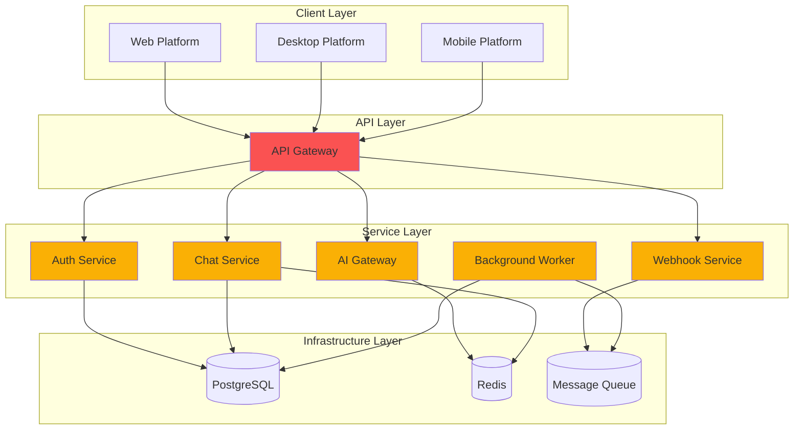
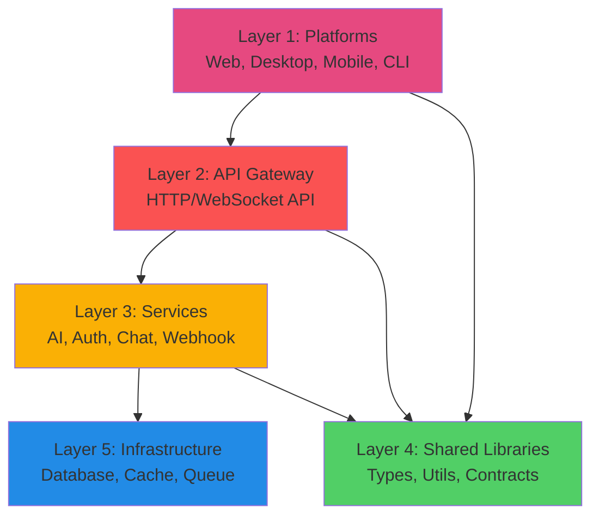

# VibeCode Folder Structure

**Version:** 1.0.0
**Last Updated:** 2026-02-14
**Status:** Active

## Table of Contents

1. [Overview](#overview)
2. [Top-Level Structure](#top-level-structure)
3. [Services Directory](#services-directory)
4. [Platforms Directory](#platforms-directory)
5. [Shared Directory](#shared-directory)
6. [Infrastructure Directory](#infrastructure-directory)
7. [Documentation Directory](#documentation-directory)
8. [Tools Directory](#tools-directory)
9. [Configuration Directory](#configuration-directory)
10. [Naming Conventions](#naming-conventions)
11. [Where to Add New Code](#where-to-add-new-code)
12. [Module Boundaries](#module-boundaries)
13. [Migration Guide](#migration-guide)

---

## Overview

VibeCode uses a **modular multi-service architecture** with clear separation of concerns. This structure reduces complexity from 48+ top-level directories to **7 functional groups**, making the codebase easier to navigate, maintain, and scale.

### Design Principles

The folder structure follows these core principles:

1. **Service Isolation** - Services are independently deployable with clear boundaries
2. **Platform Separation** - Platform-specific code isolated from core business logic
3. **DRY (Don't Repeat Yourself)** - Shared code in reusable libraries
4. **Unidirectional Dependencies** - No circular dependencies
5. **Mirror Structure** - Documentation structure matches code structure

### Key Benefits

| Metric | Before | After | Improvement |
|--------|--------|-------|-------------|
| Top-level directories | 48 | 7 | **86% reduction** |
| Infrastructure directories | 6 | 1 | **83% reduction** |
| Time to find code | ~10 min | ~2 min | **80% faster** |
| Circular dependencies | 7+ | 0 | **Eliminated** |

**Related Documentation:**
- [Architecture Overview](./ARCHITECTURE.md)
- [Module Boundaries](./MODULE_BOUNDARIES.md)
- [Organization Principles](./design/organization-principles.md)
- [Proposed Structure](./design/proposed-structure.md)

---

## Top-Level Structure

```
vibecode/                         # Root directory
│
├── services/                     # 🎯 Backend Services (independently deployable)
├── platforms/                    # 🖥️ Platform-Specific Implementations
├── shared/                       # 📦 Shared Libraries & Code
├── infrastructure/               # ⚙️ Infrastructure as Code & Deployment
├── docs/                         # 📚 Documentation
├── tools/                        # 🔧 Developer Tools & Utilities
├── config/                       # ⚙️ Configuration
│
├── .github/                      # GitHub Actions and workflows
├── .vscode/                      # VS Code workspace settings
├── .husky/                       # Git hooks
├── .auto-claude/                 # Auto-Claude automation
├── .claude/                      # Claude configuration
│
├── package.json                  # Root package.json (monorepo)
├── tsconfig.json                 # Root TypeScript config
├── turbo.json                    # Turborepo configuration
├── .gitignore                    # Git ignore rules
├── .env.example                  # Environment variables template
├── README.md                     # Project README
└── CONTRIBUTING.md               # Contribution guidelines
```

### Directory Purpose

| Directory | Purpose | Examples |
|-----------|---------|----------|
| **services/** | Backend microservices | API Gateway, AI Gateway, Auth Service |
| **platforms/** | Platform-specific UIs | Web (Next.js), Desktop (Tauri), Mobile (iOS/Android) |
| **shared/** | Reusable libraries | Types, Utils, Components, Contracts |
| **infrastructure/** | IaC and deployment | Terraform, Docker, Kubernetes, Monitoring |
| **docs/** | Documentation | Architecture, ADRs, Guides, Service docs |
| **tools/** | Developer tooling | CLI tools, Scripts, Generators, Plugins |
| **config/** | Centralized config | Base config, Environment-specific, Feature flags |

---

## Services Directory

**Purpose:** Backend services with clear module boundaries and independent deployability.

### Structure

```
services/
├── api-gateway/                 # HTTP/WebSocket API routing
│   ├── src/
│   │   ├── routes/             # API route definitions
│   │   ├── middleware/         # Express/Fastify middleware
│   │   ├── handlers/           # Request handlers
│   │   ├── __tests__/          # Unit tests
│   │   └── index.ts            # Entry point
│   ├── tests/
│   │   ├── integration/        # Integration tests
│   │   └── e2e/                # End-to-end tests
│   ├── package.json            # Service dependencies
│   ├── tsconfig.json           # Service TypeScript config
│   ├── Dockerfile              # Container image
│   ├── .env.example            # Environment template
│   ├── openapi.yml             # OpenAPI specification
│   └── README.md               # Service documentation
│
├── ai-gateway/                  # AI model orchestration
│   ├── src/
│   │   ├── providers/          # AI provider integrations
│   │   │   ├── openai/
│   │   │   ├── anthropic/
│   │   │   └── gemini/
│   │   ├── router/             # Model routing logic
│   │   ├── cache/              # Response caching
│   │   └── queue/              # Rate limiting queue
│   ├── tests/
│   └── README.md
│
├── auth-service/                # Authentication & authorization
│   ├── src/
│   │   ├── strategies/         # Auth strategies (JWT, OAuth)
│   │   ├── middleware/         # Auth middleware
│   │   └── models/             # User/session models
│   ├── prisma/                 # Database schema (if isolated DB)
│   └── README.md
│
├── chat-service/                # Chat functionality
│   ├── src/
│   │   ├── websocket/          # WebSocket handlers
│   │   ├── messages/           # Message processing
│   │   └── threads/            # Conversation threading
│   └── README.md
│
├── webhook-service/             # Webhook event processing
│   ├── src/
│   │   ├── handlers/           # Webhook handlers
│   │   ├── validators/         # Signature validation
│   │   └── queue/              # Event queue
│   └── README.md
│
├── workflow-orchestrator/       # Workflow orchestration (Airflow)
│   ├── dags/                   # Airflow DAG definitions
│   ├── plugins/                # Custom Airflow plugins
│   └── config/                 # Airflow configuration
│
├── background-worker/           # Background job processing
│   ├── src/
│   │   ├── jobs/               # Job definitions
│   │   ├── queue/              # Queue handlers (Bull, Bee)
│   │   └── schedulers/         # Cron schedulers
│   └── README.md
│
└── git-service/                 # Gitea integration
    ├── src/
    │   ├── api/                # Gitea API client
    │   └── webhooks/           # Git webhook handlers
    └── README.md
```

### Service Communication

Services communicate via:
1. **HTTP/REST APIs** - Synchronous request-response
2. **Message Queues** - Asynchronous event-driven (Kafka, RabbitMQ)
3. **Service Mesh** - Advanced networking (future: Istio)



### Service Requirements

Each service MUST:

- ✅ Have independent `package.json` and dependencies
- ✅ Include `README.md` with setup and API documentation
- ✅ Define API contract in `openapi.yml` or equivalent
- ✅ Include `Dockerfile` for containerization
- ✅ Have `.env.example` for configuration
- ✅ Include unit, integration, and e2e tests
- ✅ Be independently deployable

**Do's:**
```typescript
// ✅ Service calling another service via API
const response = await fetch('http://ai-gateway/api/analyze', {
  method: 'POST',
  body: JSON.stringify(data)
})
```

**Don'ts:**
```typescript
// ❌ Service importing from another service
import { analyzeText } from '../../../ai-gateway/src/analyzer'  // WRONG!
```

---

## Platforms Directory

**Purpose:** Platform-specific implementations providing user interfaces and platform integrations.

### Structure

```
platforms/
├── web/                         # Next.js Web Application
│   ├── src/
│   │   ├── app/                # Next.js App Router
│   │   │   ├── (auth)/         # Auth route group
│   │   │   ├── (dashboard)/    # Dashboard route group
│   │   │   ├── api/            # API routes (BFF pattern)
│   │   │   └── layout.tsx
│   │   ├── components/         # Web-specific components
│   │   │   ├── features/       # Feature components
│   │   │   ├── layout/         # Layout components
│   │   │   └── ui/             # UI primitives
│   │   ├── hooks/              # React hooks
│   │   ├── lib/                # Web utilities
│   │   ├── adapters/           # Platform adapters
│   │   └── styles/             # Styles and themes
│   ├── public/                 # Static assets
│   ├── tests/
│   │   ├── unit/
│   │   ├── integration/
│   │   └── e2e/                # Playwright tests
│   ├── package.json
│   ├── next.config.js
│   ├── tailwind.config.js
│   └── README.md
│
├── desktop/
│   ├── tauri/                  # Tauri Desktop Wrapper (Primary)
│   │   ├── src-tauri/          # Rust backend
│   │   │   ├── src/
│   │   │   │   ├── main.rs
│   │   │   │   ├── commands/   # Tauri commands
│   │   │   │   └── menu.rs     # App menu
│   │   │   ├── icons/          # App icons
│   │   │   ├── Cargo.toml
│   │   │   └── tauri.conf.json
│   │   ├── src/                # Frontend (uses web build)
│   │   └── README.md
│   │
│   └── electron/               # Electron Wrapper (Alternative)
│       ├── src/
│       │   ├── main/           # Electron main process
│       │   └── preload/        # Preload scripts
│       └── README.md
│
├── mobile/
│   ├── ios/                    # Native iOS App (Swift)
│   │   ├── VibeCode/
│   │   │   ├── App/            # App delegates
│   │   │   ├── Views/          # SwiftUI views
│   │   │   ├── ViewModels/     # View models
│   │   │   ├── Services/       # API clients
│   │   │   └── Models/         # Data models
│   │   ├── VibeCode.xcodeproj
│   │   └── README.md
│   │
│   └── android/                # Native Android App (Kotlin)
│       ├── app/
│       │   ├── src/
│       │   │   ├── main/
│       │   │   │   ├── java/
│       │   │   │   ├── res/
│       │   │   │   └── AndroidManifest.xml
│       │   └── build.gradle
│       └── README.md
│
├── macos/                       # macOS Menubar App (Swift)
│   ├── VibeCodeMenubar/
│   │   ├── App/
│   │   ├── MenuBar/            # Menubar UI
│   │   ├── Services/           # Background services
│   │   └── Models/
│   ├── VibeCodeMenubar.xcodeproj
│   └── README.md
│
└── cli/                         # Command-Line Interface
    ├── src/
    │   ├── commands/           # CLI commands
    │   │   ├── init.ts
    │   │   ├── deploy.ts
    │   │   └── dev.ts
    │   ├── utils/              # CLI utilities
    │   ├── adapters/           # CLI-specific adapters
    │   └── index.ts
    ├── bin/
    │   └── vibecode            # Executable entry point
    ├── package.json
    └── README.md
```

### Platform Adapter Pattern

All platforms implement standard adapters for cross-platform consistency:

```typescript
// shared/contracts/src/adapters/storage.ts
export interface StorageAdapter {
  get(key: string): Promise<string | null>
  set(key: string, value: string): Promise<void>
  delete(key: string): Promise<void>
  clear(): Promise<void>
}

// platforms/web/src/adapters/storage-adapter.ts
export class WebStorageAdapter implements StorageAdapter {
  async get(key: string): Promise<string | null> {
    return localStorage.getItem(key)
  }
  // ... implementation
}

// platforms/desktop/tauri/src/adapters/storage-adapter.ts
export class TauriStorageAdapter implements StorageAdapter {
  private store = new Store('.settings.dat')

  async get(key: string): Promise<string | null> {
    return await this.store.get(key)
  }
  // ... implementation
}
```

### Platform Independence

**Core Principle:** Services never depend on platform code.

```
Platform → API Gateway → Services  ✅ CORRECT
Services → Platforms               ❌ FORBIDDEN
```

---

## Shared Directory

**Purpose:** Reusable code shared across services and platforms.

### Structure

```
shared/
├── types/                       # TypeScript Types & Interfaces
│   ├── src/
│   │   ├── api/                # API contract types
│   │   │   ├── requests.ts
│   │   │   ├── responses.ts
│   │   │   └── webhooks.ts
│   │   ├── models/             # Data models
│   │   │   ├── user.ts
│   │   │   ├── chat.ts
│   │   │   └── ai.ts
│   │   ├── common/             # Common types
│   │   │   ├── result.ts       # Result<T, E> type
│   │   │   ├── pagination.ts
│   │   │   └── error.ts
│   │   └── index.ts
│   ├── package.json            # @vibecode/types
│   ├── tsconfig.json
│   └── README.md
│
├── utils/                       # Utility Functions
│   ├── src/
│   │   ├── validation/         # Input validation
│   │   │   ├── email.ts
│   │   │   ├── url.ts
│   │   │   └── schema.ts
│   │   ├── formatting/         # Data formatting
│   │   │   ├── date.ts
│   │   │   ├── currency.ts
│   │   │   └── text.ts
│   │   ├── crypto/             # Cryptographic utilities
│   │   │   ├── hash.ts
│   │   │   ├── encrypt.ts
│   │   │   └── jwt.ts
│   │   ├── string/             # String utilities
│   │   └── array/              # Array utilities
│   ├── package.json            # @vibecode/utils
│   └── README.md
│
├── components/                  # Shared UI Components
│   ├── src/
│   │   ├── atoms/              # Basic components
│   │   │   ├── Button/
│   │   │   ├── Input/
│   │   │   └── Icon/
│   │   ├── molecules/          # Composite components
│   │   │   ├── Form/
│   │   │   ├── Card/
│   │   │   └── Modal/
│   │   ├── organisms/          # Complex components
│   │   │   ├── ChatPanel/
│   │   │   ├── CodeEditor/
│   │   │   └── FileTree/
│   │   └── index.ts
│   ├── package.json            # @vibecode/components
│   └── README.md
│
├── contracts/                   # API Contracts & Schemas
│   ├── openapi/                # OpenAPI specifications
│   │   ├── api-gateway.yaml
│   │   ├── ai-gateway.yaml
│   │   └── auth-service.yaml
│   ├── protobuf/               # Protocol buffer definitions
│   │   └── messages.proto
│   ├── graphql/                # GraphQL schemas
│   │   └── schema.graphql
│   └── README.md
│
├── constants/                   # Application Constants
│   ├── src/
│   │   ├── api.ts              # API constants
│   │   ├── errors.ts           # Error codes
│   │   ├── features.ts         # Feature flags
│   │   └── config.ts           # Config constants
│   ├── package.json            # @vibecode/constants
│   └── README.md
│
└── testing/                     # Shared Test Utilities
    ├── src/
    │   ├── fixtures/           # Test fixtures
    │   ├── mocks/              # Mock implementations
    │   ├── helpers/            # Test helpers
    │   └── setup.ts            # Test setup utilities
    ├── package.json            # @vibecode/testing
    └── README.md
```

### Dependency Hierarchy

Shared libraries have strict dependency levels:

```
Level 1: Foundation (zero dependencies)
  └─ shared/types
  └─ shared/constants

Level 2: Utilities (depends on Level 1)
  └─ shared/utils

Level 3: Contracts (depends on Level 1)
  └─ shared/contracts

Level 4: Components (depends on Level 1 & 2)
  └─ shared/components

Consumers (depend on shared)
  └─ Services
  └─ Platforms
```

**Allowed:**
```typescript
// ✅ Utils depend on Types
import { EmailValidationResult } from '@vibecode/types'

// ✅ Components depend on Types and Utils
import { ButtonProps } from '@vibecode/types'
import { classNames } from '@vibecode/utils'
```

**Forbidden:**
```typescript
// ❌ Types depend on Utils (wrong level)
import { validateEmail } from '@vibecode/utils'  // WRONG!

// ❌ Shared depends on Services
import { AIGateway } from '@vibecode/ai-gateway'  // WRONG!
```

---

## Infrastructure Directory

**Purpose:** Infrastructure as Code, deployment configurations, and observability setup.

### Structure

```
infrastructure/
├── terraform/                   # Terraform IaC
│   ├── modules/                # Reusable Terraform modules
│   │   ├── vpc/
│   │   ├── database/
│   │   ├── kubernetes/
│   │   └── monitoring/
│   ├── environments/           # Environment-specific configs
│   │   ├── development/
│   │   │   ├── main.tf
│   │   │   ├── variables.tf
│   │   │   └── terraform.tfvars
│   │   ├── staging/
│   │   └── production/
│   ├── backend.tf              # Terraform backend config
│   └── README.md
│
├── docker/                      # Docker & Container Configs
│   ├── compose/                # Docker Compose files
│   │   ├── development.yml     # Local development
│   │   ├── testing.yml         # Testing environment
│   │   └── production.yml      # Production-like local
│   ├── images/                 # Custom Docker images
│   │   ├── base/               # Base images
│   │   └── tools/              # Utility images
│   └── README.md
│
├── kubernetes/                  # Kubernetes Manifests
│   ├── base/                   # Base manifests (Kustomize)
│   │   ├── api-gateway/
│   │   ├── ai-gateway/
│   │   └── auth-service/
│   ├── overlays/               # Environment overlays
│   │   ├── development/
│   │   ├── staging/
│   │   └── production/
│   ├── helm/                   # Helm charts
│   │   └── vibecode/
│   │       ├── Chart.yaml
│   │       ├── values.yaml
│   │       └── templates/
│   └── README.md
│
├── azure/                       # Azure-Specific IaC
│   ├── arm-templates/          # ARM templates
│   ├── bicep/                  # Bicep files
│   └── README.md
│
├── monitoring/                  # Observability Configurations
│   ├── prometheus/             # Prometheus configs
│   │   ├── prometheus.yml
│   │   ├── alerts/             # Alert rules
│   │   └── rules/              # Recording rules
│   ├── grafana/                # Grafana dashboards
│   │   ├── dashboards/
│   │   │   ├── api-gateway.json
│   │   │   ├── ai-gateway.json
│   │   │   └── system-overview.json
│   │   └── provisioning/
│   ├── datadog/                # Datadog integrations
│   │   ├── dashboards/
│   │   ├── monitors/
│   │   └── synthetics/
│   └── README.md
│
├── ci-cd/                       # CI/CD Pipeline Configs
│   ├── github-actions/         # GitHub Actions workflows
│   │   ├── build.yml
│   │   ├── test.yml
│   │   ├── deploy.yml
│   │   └── release.yml
│   ├── azure-pipelines/        # Azure DevOps pipelines
│   └── README.md
│
└── scripts/                     # Infrastructure Scripts
    ├── setup/                  # Setup scripts
    │   ├── init-dev.sh
    │   └── install-deps.sh
    ├── deployment/             # Deployment scripts
    │   ├── deploy-service.sh
    │   └── rollback.sh
    ├── maintenance/            # Maintenance scripts
    │   ├── backup.sh
    │   └── restore.sh
    └── README.md
```

### Infrastructure Principles

1. **Infrastructure as Code** - All infrastructure defined in version-controlled code
2. **Environment Parity** - Dev/staging/prod as similar as possible
3. **Immutable Infrastructure** - No manual server changes
4. **Observability First** - Monitoring built-in from start
5. **Disaster Recovery** - Regular backups and restore procedures

---

## Documentation Directory

**Purpose:** Comprehensive documentation mirroring code structure.

### Structure

```
docs/
├── architecture/                # Architecture Documentation
│   ├── ARCHITECTURE.md         # Main architecture overview
│   ├── ADR/                    # Architecture Decision Records
│   │   ├── 001-folder-structure-modularization.md
│   │   ├── 002-service-boundaries.md
│   │   └── template.md
│   ├── diagrams/               # System diagrams
│   │   ├── system-overview.mmd
│   │   ├── service-dependencies.mmd
│   │   └── deployment.mmd
│   └── README.md
│
├── services/                    # Service-Specific Documentation
│   ├── api-gateway/
│   │   ├── README.md           # Service overview
│   │   ├── API.md              # API documentation
│   │   └── RUNBOOK.md          # Operations runbook
│   ├── ai-gateway/
│   ├── auth-service/
│   └── README.md
│
├── platforms/                   # Platform-Specific Documentation
│   ├── web/
│   │   ├── README.md
│   │   ├── SETUP.md
│   │   └── DEPLOYMENT.md
│   ├── desktop/
│   ├── mobile/
│   └── cli/
│
├── guides/                      # How-To Guides
│   ├── getting-started.md      # New developer onboarding
│   ├── adding-new-service.md   # Service creation guide
│   ├── deployment.md           # Deployment procedures
│   ├── testing.md              # Testing guide
│   └── troubleshooting.md      # Common issues
│
├── api/                         # API Documentation
│   ├── rest/                   # REST API docs
│   ├── websocket/              # WebSocket API docs
│   └── graphql/                # GraphQL API docs
│
├── design/                      # Design Documents
│   ├── organization-principles.md
│   ├── proposed-structure.md
│   └── module-boundaries.md
│
├── analysis/                    # Analysis & Audits
│   ├── current-structure-audit.md
│   ├── pain-points.md
│   └── dependency-map.md
│
└── archive/                     # Historical Documentation
    └── consolidated-wiki/
```

### Documentation Principles

1. **Docs as Code** - Documentation versioned with code
2. **Mirror Structure** - Docs structure matches code structure
3. **Living Documentation** - Updated with code changes
4. **Onboarding Focus** - Clear path for new developers

---

## Tools Directory

**Purpose:** Developer tooling, scripts, and utilities.

### Structure

```
tools/
├── cli/                         # Internal CLI Tools
│   ├── src/
│   │   ├── commands/
│   │   │   ├── scaffold-service.ts
│   │   │   ├── generate-docs.ts
│   │   │   └── check-deps.ts
│   │   └── index.ts
│   └── package.json
│
├── scripts/                     # Build & Utility Scripts
│   ├── build/                  # Build scripts
│   │   ├── build-all.sh
│   │   └── build-service.sh
│   ├── dev/                    # Development scripts
│   │   ├── start-dev.sh
│   │   └── reset-db.sh
│   ├── test/                   # Testing scripts
│   │   ├── run-tests.sh
│   │   └── coverage.sh
│   └── utils/                  # Utility scripts
│
├── generators/                  # Code Generators
│   ├── service/                # Service generator
│   ├── component/              # Component generator
│   └── migration/              # Migration generator
│
├── plugins/                     # Development Plugins
│   ├── eslint-custom/          # Custom ESLint rules
│   ├── webpack-custom/         # Custom Webpack plugins
│   └── vite-custom/            # Custom Vite plugins
│
└── extensions/                  # Editor Extensions
    └── vscode/                 # VS Code extensions
        └── vibecode-snippets/
```

---

## Configuration Directory

**Purpose:** Centralized, type-safe configuration.

### Structure

```
config/
├── base/                        # Base Configuration
│   ├── app.ts                  # Application settings
│   ├── features.ts             # Feature flags
│   ├── constants.ts            # Constants
│   └── logging.ts              # Logging config
│
├── environments/                # Environment-Specific Configs
│   ├── development/
│   │   ├── services.ts
│   │   ├── database.ts
│   │   └── api.ts
│   ├── staging/
│   ├── production/
│   └── test/
│
├── services/                    # Service-Specific Configs
│   ├── api-gateway.ts
│   ├── ai-gateway.ts
│   └── auth-service.ts
│
└── platforms/                   # Platform-Specific Configs
    ├── web.ts
    ├── desktop.ts
    └── mobile.ts
```

### Configuration Principles

1. **Type Safety** - All configs TypeScript-validated (use Zod or similar)
2. **Environment Variables** - Secrets from env vars, never committed
3. **Feature Flags** - Gradual feature rollout without code changes
4. **Fail Fast** - Invalid config fails at startup, not runtime

---

## Naming Conventions

### Directory Naming

| Type | Convention | Example |
|------|-----------|---------|
| **Services** | kebab-case | `ai-gateway/`, `auth-service/` |
| **Platforms** | kebab-case | `web/`, `desktop/`, `macos/` |
| **Shared Libraries** | kebab-case | `types/`, `utils/`, `contracts/` |
| **Documentation** | lowercase | `docs/`, `guides/`, `api/` |
| **Hidden Directories** | dot-prefix | `.github/`, `.vscode/`, `.husky/` |

### File Naming

| Type | Convention | Example |
|------|-----------|---------|
| **TypeScript/JavaScript** | kebab-case | `ai-gateway.ts`, `user-service.ts` |
| **React Components** | PascalCase | `ChatPanel.tsx`, `LoginForm.tsx` |
| **Test Files** | match source + suffix | `gateway.test.ts`, `router.spec.ts` |
| **Configuration** | dot-prefix or extension | `.env`, `tsconfig.json` |
| **Major Docs** | UPPERCASE | `README.md`, `API.md`, `RUNBOOK.md` |

### Code Naming

| Type | Convention | Example |
|------|-----------|---------|
| **Classes** | PascalCase | `AIGateway`, `UserService` |
| **Interfaces** | PascalCase | `AIGateway`, `UserRepository` |
| **Functions** | camelCase | `validateEmail()`, `sendMessage()` |
| **Variables** | camelCase | `userId`, `apiKey` |
| **Constants** | UPPER_SNAKE_CASE | `MAX_RETRIES`, `API_BASE_URL` |
| **Enums** | PascalCase (enum), UPPER_SNAKE_CASE (values) | `enum LogLevel { DEBUG, INFO }` |

### Naming Rules

1. **Singular vs Plural**
   - Services: Singular (`auth-service`, not `auth-services`)
   - Collections: Plural (`services/`, `platforms/`, `utils/`)

2. **Abbreviations**
   - Avoid unless widely recognized (`api`, `db`, `ui`)
   - Prefer clarity: `authentication-service` over `auth-svc`

3. **Prefixes/Suffixes**
   - Services: `-service` suffix (e.g., `auth-service`)
   - Tests: `.test.ts` or `.spec.ts` suffix
   - Types: `.types.ts` or `.d.ts` suffix

---

## Where to Add New Code

### Decision Tree

```mermaid
graph TD
    A[What are you adding?]

    A -->|New API endpoint| B[Is it platform-specific?]
    A -->|New UI component| C[Is it shared across platforms?]
    A -->|New utility function| D[Is it used by multiple services?]
    A -->|New service| E[Create new service]
    A -->|Infrastructure config| F[infrastructure/]
    A -->|Documentation| G[docs/]

    B -->|Yes| H[platforms/{platform}/src/app/api/]
    B -->|No| I[services/api-gateway/src/routes/]

    C -->|Yes| J[shared/components/]
    C -->|No| K[platforms/{platform}/src/components/]

    D -->|Yes| L[shared/utils/]
    D -->|No| M[services/{service}/src/utils/]

    E --> N[services/{service-name}/]

    style H fill:#51cf66
    style I fill:#51cf66
    style J fill:#51cf66
    style K fill:#51cf66
    style L fill:#51cf66
    style M fill:#51cf66
    style N fill:#51cf66
    style F fill:#51cf66
    style G fill:#51cf66
```

### Common Scenarios

#### Adding a New API Endpoint

**Platform-specific (BFF pattern):**
```
platforms/web/src/app/api/{endpoint}/route.ts
```

**Service API:**
```
services/api-gateway/src/routes/{endpoint}.ts
```

#### Adding a New UI Component

**Shared across platforms:**
```
shared/components/src/atoms/     # Basic component
shared/components/src/molecules/ # Composite component
shared/components/src/organisms/ # Complex component
```

**Platform-specific:**
```
platforms/web/src/components/
platforms/desktop/src/components/
```

#### Adding a New Service

```
services/{service-name}/
├── src/
│   ├── routes/
│   ├── handlers/
│   ├── __tests__/
│   └── index.ts
├── tests/
├── package.json
├── Dockerfile
├── openapi.yml
└── README.md
```

**See:** [Adding a New Service Guide](./guides/adding-new-service.md)

#### Adding Utility Functions

**Used by multiple services:**
```
shared/utils/src/{category}/{utility}.ts
```

**Service-specific:**
```
services/{service}/src/utils/{utility}.ts
```

#### Adding TypeScript Types

**API contracts (shared):**
```
shared/types/src/api/{type}.ts
```

**Service-specific models:**
```
services/{service}/src/models/{model}.ts
```

#### Adding Tests

**Unit tests (colocated):**
```
{code-directory}/__tests__/{filename}.test.ts
```

**Integration tests:**
```
services/{service}/tests/integration/{test}.integration.test.ts
```

**E2E tests:**
```
platforms/web/tests/e2e/{flow}.e2e.test.ts
```

#### Adding Infrastructure Code

**Terraform:**
```
infrastructure/terraform/modules/{resource}/
infrastructure/terraform/environments/{env}/
```

**Kubernetes:**
```
infrastructure/kubernetes/base/{service}/
infrastructure/kubernetes/overlays/{env}/
```

**Docker:**
```
infrastructure/docker/compose/{env}.yml
infrastructure/docker/images/{image}/
```

**Monitoring:**
```
infrastructure/monitoring/{tool}/{config}
```

#### Adding Documentation

**Architecture decisions:**
```
docs/architecture/ADR/{number}-{title}.md
```

**Service documentation:**
```
docs/services/{service}/README.md
docs/services/{service}/API.md
docs/services/{service}/RUNBOOK.md
```

**Guides:**
```
docs/guides/{guide-name}.md
```

---

## Module Boundaries

### Dependency Rules



### Allowed Dependencies

| Layer | Can Depend On | Cannot Depend On |
|-------|---------------|------------------|
| **Platforms** | API Gateway, Shared Libraries | Services directly, other Platforms |
| **API Gateway** | Services, Shared Libraries | Platforms |
| **Services** | Shared Libraries, Infrastructure | Other Services (except via API), Platforms, Gateway |
| **Shared Libraries** | Infrastructure (minimal) | Services, Platforms, Gateway |
| **Infrastructure** | Nothing | Everything |

### Core Rules

1. **No Circular Dependencies** - Dependencies form a DAG (Directed Acyclic Graph)
2. **Service Isolation** - Services communicate via APIs, not direct imports
3. **Platform Independence** - Core services never depend on platform code
4. **Shared Library Constraints** - Shared libraries have minimal dependencies

**For complete details, see:** [Module Boundaries](./MODULE_BOUNDARIES.md)

---

## Migration Guide

### From Current Structure to Modular Structure

| Current Directory | Proposed Location | Rationale |
|------------------|-------------------|-----------|
| `src/` | `platforms/web/src/` | Web platform code |
| `server/` | `services/api-gateway/` | Backend API service |
| `packages/` | `shared/` | Shared libraries |
| `types/` | `shared/types/` | Shared types |
| `infrastructure/`, `infra/`, `deploy/` | `infrastructure/` | Consolidate IaC |
| `docker/` | `infrastructure/docker/` | Container configs |
| `azure/` | `infrastructure/azure/` | Azure IaC |
| `monitoring/` | `infrastructure/monitoring/` | Observability |
| `airflow/` | `services/workflow-orchestrator/` | Workflow service |
| `daemon/` | `services/background-worker/` | Background service |
| `gitea/` | `services/git-service/` | Git service |
| `swift/` | `platforms/macos/` | macOS menubar app |
| `scripts/` | `tools/scripts/` | Build scripts |
| `docs/` | `docs/` | Documentation (reorganized) |

### Migration Steps

1. **Phase 1: Foundation** - Create new directory structure, set up monorepo tooling
2. **Phase 2: Services** - Migrate backend services to `services/`
3. **Phase 3: Platforms** - Move platform code to `platforms/`
4. **Phase 4: Shared** - Extract shared code to `shared/`
5. **Phase 5: Infrastructure** - Consolidate IaC into `infrastructure/`
6. **Phase 6: Cleanup** - Remove old directories, update docs

**For detailed migration plan, see:** [Proposed Structure](./design/proposed-structure.md)

---

## Summary

The VibeCode folder structure provides:

✅ **Clear organization** - 7 top-level directories vs. 48
✅ **Service isolation** - Independent, deployable services
✅ **Platform separation** - Platform-specific code isolated
✅ **Shared libraries** - Reusable code without duplication
✅ **Module boundaries** - No circular dependencies
✅ **Scalability** - Easy to add new services/platforms
✅ **Developer experience** - Fast onboarding, clear guidelines

### Key Takeaways

1. **Services** are independently deployable units in `services/`
2. **Platforms** provide UIs in `platforms/` and never mix with core logic
3. **Shared** libraries eliminate code duplication in `shared/`
4. **Infrastructure** is centralized in `infrastructure/`
5. **Documentation** mirrors code structure in `docs/`
6. **Dependencies** flow in one direction only (no circles)

---

## Related Documentation

- **[Architecture Overview](./ARCHITECTURE.md)** - System architecture and technology stack
- **[Module Boundaries](./MODULE_BOUNDARIES.md)** - Detailed dependency rules and contracts
- **[Organization Principles](./design/organization-principles.md)** - Core design principles
- **[Proposed Structure](./design/proposed-structure.md)** - Detailed structure design
- **[Getting Started Guide](./guides/getting-started.md)** - New developer onboarding
- **[Adding a New Service](./guides/adding-new-service.md)** - Service creation guide

---

**Document Version:** 1.0.0
**Last Updated:** 2026-02-14
**Status:** Active
**Owner:** Architecture Team
**Review Cycle:** Quarterly or as needed
