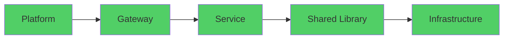
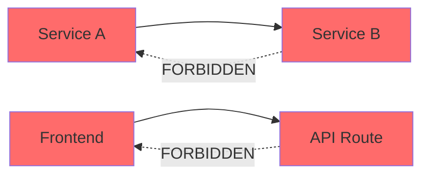
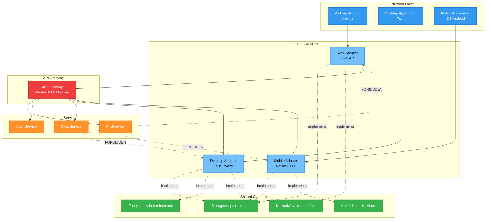
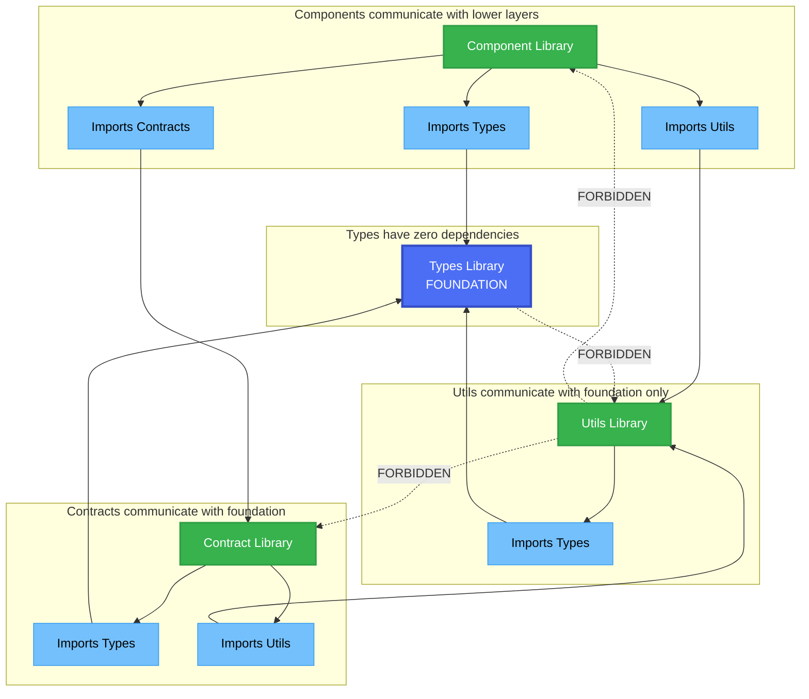

# Module Boundaries & Interface Contracts

**Version:** 1.0.0
**Date:** 2026-02-14
**Status:** Active

## Table of Contents

1. [Overview](#overview)
2. [Layered Architecture](#layered-architecture)
3. [Dependency Rules](#dependency-rules)
4. [Service Boundaries](#service-boundaries)
5. [Platform Boundaries](#platform-boundaries)
6. [Shared Library Boundaries](#shared-library-boundaries)
7. [Interface Contracts](#interface-contracts)
8. [Enforcement Mechanisms](#enforcement-mechanisms)
9. [Migration from Current State](#migration-from-current-state)

---

## Overview

This document defines the **module boundaries** and **interface contracts** for VibeCode's multi-service architecture. These boundaries prevent circular dependencies, enforce separation of concerns, and enable independent development and deployment of services.

### Key Principles

1. **Unidirectional Dependencies:** Dependencies flow in one direction only (no circular dependencies)
2. **Interface-Based Communication:** Services communicate via well-defined interfaces (APIs, message queues)
3. **Dependency Inversion:** High-level modules never depend on low-level modules; both depend on abstractions
4. **Isolation:** Services are self-contained and independently deployable
5. **Explicit Contracts:** All service interfaces are explicitly defined and versioned

### Current Problems Addressed

This module boundary definition solves the following critical issues identified in the [dependency analysis](./analysis/dependency-map.md):

- **7 circular dependency chains** between frontend, backend, and services
- **Bidirectional coupling** between `src/` and `src/app/api/`
- **Service sprawl** across `infrastructure/`, `daemon/`, and `server/`
- **Platform fragmentation** with unclear boundaries
- **Shared code ambiguity** with no clear ownership

---

## Layered Architecture

VibeCode follows a **5-layer architecture** with strict dependency rules:

```mermaid
graph TB
    subgraph "Layer 1: Platform Layer"
        Web[Web Platform<br/>Next.js 15]
        Desktop[Desktop Platform<br/>Tauri + Rust]
        Mobile[Mobile Platform<br/>iOS/Android]
        CLI[CLI Platform<br/>Node.js]
    end

    subgraph "Layer 2: API Gateway Layer"
        Gateway[API Gateway<br/>Express/Fastify]
    end

    subgraph "Layer 3: Service Layer"
        AIService[AI Gateway<br/>OpenAI, Anthropic, etc.]
        AuthService[Auth Service<br/>JWT, OAuth2]
        ChatService[Chat Service<br/>WebSocket Server]
        WebhookService[Webhook Service<br/>Event Handlers]
        WorkflowService[Workflow Orchestrator<br/>Apache Airflow]
        BackgroundWorker[Background Worker<br/>Bull/BullMQ]
        GitService[Git Service<br/>Gitea API]
        MCPServer[MCP Server<br/>Claude MCP Protocol]
    end

    subgraph "Layer 4: Shared Library Layer"
        Types[Shared Types<br/>@vibecode/types]
        Utils[Shared Utils<br/>@vibecode/utils]
        Components[Shared Components<br/>@vibecode/components]
        Contracts[API Contracts<br/>@vibecode/contracts]
        Middleware[Shared Middleware<br/>@vibecode/middleware]
    end

    subgraph "Layer 5: Infrastructure Layer"
        Database[(PostgreSQL 16<br/>+ pgvector)]
        Cache[(Redis/Valkey<br/>In-Memory Cache)]
        Queue[(Kafka/RabbitMQ<br/>Message Broker)]
        VectorDB[(Vector Store<br/>Embeddings)]
    end

    %% Platform to Gateway
    Web --> Gateway
    Desktop --> Gateway
    Mobile --> Gateway
    CLI --> Gateway

    %% Gateway to Services
    Gateway --> AIService
    Gateway --> AuthService
    Gateway --> ChatService
    Gateway --> WebhookService
    Gateway --> GitService
    Gateway --> MCPServer

    %% Service to Service (via API only - shown as dashed)
    AIService -.->|HTTP API| AuthService
    ChatService -.->|HTTP API| AIService
    WebhookService -.->|Message Queue| WorkflowService
    BackgroundWorker -.->|Message Queue| WebhookService

    %% Services to Shared Libraries
    AIService --> Types
    AIService --> Utils
    AIService --> Contracts
    AuthService --> Types
    AuthService --> Utils
    ChatService --> Types
    ChatService --> Utils
    ChatService --> Contracts
    WebhookService --> Types
    WebhookService --> Middleware
    WorkflowService --> Types
    BackgroundWorker --> Types
    BackgroundWorker --> Utils
    GitService --> Types
    GitService --> Contracts
    MCPServer --> Types
    MCPServer --> Utils

    %% Platforms to Shared Libraries
    Web --> Components
    Web --> Types
    Desktop --> Components
    Desktop --> Types
    Mobile --> Types
    CLI --> Types
    CLI --> Utils

    %% Services to Infrastructure
    AIService --> Database
    AIService --> Cache
    AIService --> VectorDB
    AuthService --> Database
    AuthService --> Cache
    ChatService --> Database
    ChatService --> Cache
    ChatService --> Queue
    WebhookService --> Queue
    WorkflowService --> Database
    BackgroundWorker --> Queue
    BackgroundWorker --> Cache
    GitService --> Database
    MCPServer --> Database
    MCPServer --> VectorDB

    %% Styling by Layer
    classDef platformStyle fill:#339af0,stroke:#1c7ed6,color:#fff,stroke-width:2px
    classDef gatewayStyle fill:#f03e3e,stroke:#c92a2a,color:#fff,stroke-width:2px
    classDef serviceStyle fill:#ff922b,stroke:#fd7e14,color:#fff,stroke-width:2px
    classDef sharedStyle fill:#37b24d,stroke:#2f9e44,color:#fff,stroke-width:2px
    classDef infraStyle fill:#7950f2,stroke:#6741d9,color:#fff,stroke-width:2px

    class Web,Desktop,Mobile,CLI platformStyle
    class Gateway gatewayStyle
    class AIService,AuthService,ChatService,WebhookService,WorkflowService,BackgroundWorker,GitService,MCPServer serviceStyle
    class Types,Utils,Components,Contracts,Middleware sharedStyle
    class Database,Cache,Queue,VectorDB infraStyle
```



**Legend:**
- 🔵 **Blue** = Platform Layer (client applications)
- 🔴 **Red** = API Gateway Layer (routing and middleware)
- 🟠 **Orange** = Service Layer (backend microservices)
- 🟢 **Green** = Shared Library Layer (reusable code)
- 🟣 **Purple** = Infrastructure Layer (databases, caches, queues)
- **Solid lines** = Direct imports allowed (compile-time dependency)
- **Dashed lines** = API calls only (runtime dependency, no direct imports)

### Layer Dependency Rules

| Layer | Can Depend On | Cannot Depend On |
|-------|---------------|------------------|
| **Layer 1: Platform** | API Gateway, Shared Libraries | Services directly, other Platforms |
| **Layer 2: API Gateway** | Services, Shared Libraries | Platforms |
| **Layer 3: Services** | Shared Libraries, Infrastructure | Other Services (except via API), Platforms, Gateway |
| **Layer 4: Shared Libraries** | Infrastructure (minimal) | Services, Platforms, Gateway |
| **Layer 5: Infrastructure** | Nothing | Everything |

---

## Dependency Rules

### Rule 1: Acyclic Dependencies

**Principle:** Dependencies form a Directed Acyclic Graph (DAG). No circular dependencies allowed.



**Violations (Forbidden):**



**Examples:**

```typescript
// ✅ ALLOWED: Platform depends on Gateway
// platforms/web/src/api/client.ts
import { apiClient } from '@vibecode/api-gateway'

// ❌ FORBIDDEN: Gateway depends on Platform
// services/api-gateway/src/routes.ts
import { WebComponent } from '@vibecode/platform-web'  // WRONG!

// ✅ ALLOWED: Service depends on Shared Library
// services/ai-gateway/src/validator.ts
import { validateEmail } from '@vibecode/utils'

// ❌ FORBIDDEN: Shared Library depends on Service
// shared/utils/src/email.ts
import { aiService } from '@vibecode/ai-gateway'  // WRONG!

// ✅ ALLOWED: Service A calls Service B via API
// services/auth-service/src/handlers/login.ts
const aiResponse = await fetch('http://ai-gateway/api/analyze', {
  method: 'POST',
  body: JSON.stringify(data)
})

// ❌ FORBIDDEN: Service A imports Service B directly
// services/auth-service/src/handlers/login.ts
import { analyzeUser } from '@vibecode/ai-gateway'  // WRONG!
```

---

### Rule 2: Service Isolation

**Principle:** Services are independently deployable units that communicate only via defined interfaces.

**Service Communication Methods (in order of preference):**

1. **HTTP/REST APIs** - Synchronous request-response
2. **Message Queues** - Asynchronous event-driven
3. **gRPC** - High-performance RPC (future)
4. **GraphQL** - Complex data fetching (future)

**Forbidden:**
- Direct code imports between services
- Shared databases (each service owns its data)
- Shared in-memory state

**Example:**

```typescript
// ✅ ALLOWED: Service-to-Service via API
// services/chat-service/src/handlers/message.ts
export async function analyzeMessage(message: string) {
  const response = await fetch(`${AI_GATEWAY_URL}/api/analyze`, {
    method: 'POST',
    headers: { 'Content-Type': 'application/json' },
    body: JSON.stringify({ text: message })
  })
  return response.json()
}

// ✅ ALLOWED: Service-to-Service via Message Queue
// services/webhook-service/src/handlers/github.ts
export async function handlePushEvent(payload: GitHubPushPayload) {
  await kafkaProducer.send({
    topic: 'webhook.github.push',
    messages: [{ value: JSON.stringify(payload) }]
  })
}

// ❌ FORBIDDEN: Direct import from another service
// services/chat-service/src/handlers/message.ts
import { analyzeText } from '../../../ai-gateway/src/analyzer'  // WRONG!
```

#### Service Boundary Diagram

This diagram shows the clear boundaries between services and how they interact:

```mermaid
graph TB
    subgraph "Service A Boundary"
        ServiceA[AI Gateway Service]
        ServiceA_API[Public API<br/>POST /api/analyze]
        ServiceA_Queue[Message Queue Consumer<br/>Topic: ai.requests]
        ServiceA_Internal[Internal Logic<br/>PRIVATE]

        ServiceA --> ServiceA_API
        ServiceA --> ServiceA_Queue
        ServiceA --> ServiceA_Internal
    end

    subgraph "Service B Boundary"
        ServiceB[Chat Service]
        ServiceB_API[Public API<br/>POST /api/chat]
        ServiceB_Internal[Internal Logic<br/>PRIVATE]
        ServiceB_Client[API Client]

        ServiceB --> ServiceB_API
        ServiceB --> ServiceB_Internal
        ServiceB --> ServiceB_Client
    end

    subgraph "Service C Boundary"
        ServiceC[Webhook Service]
        ServiceC_API[Public API<br/>POST /api/webhook]
        ServiceC_Queue[Message Queue Producer<br/>Topic: webhooks.received]
        ServiceC_Internal[Internal Logic<br/>PRIVATE]

        ServiceC --> ServiceC_API
        ServiceC --> ServiceC_Queue
        ServiceC --> ServiceC_Internal
    end

    subgraph "Shared Boundary"
        Types[@vibecode/types]
        Utils[@vibecode/utils]
        Contracts[@vibecode/contracts]
    end

    %% Service B calls Service A via public API (ALLOWED)
    ServiceB_Client -.->|HTTP POST<br/>ALLOWED| ServiceA_API

    %% Service C publishes to message queue (ALLOWED)
    ServiceC_Queue -.->|Publish Event<br/>ALLOWED| Queue[(Message Queue)]
    Queue -.->|Consume Event<br/>ALLOWED| ServiceA_Queue

    %% Services use shared libraries (ALLOWED)
    ServiceA_Internal --> Types
    ServiceA_Internal --> Utils
    ServiceB_Internal --> Types
    ServiceB_Internal --> Contracts
    ServiceC_Internal --> Types

    %% FORBIDDEN: Direct import between services
    ServiceB_Internal -.->|FORBIDDEN<br/>No Direct Import| ServiceA_Internal

    %% Styling
    classDef serviceStyle fill:#ff922b,stroke:#fd7e14,color:#fff,stroke-width:2px
    classDef apiStyle fill:#51cf66,stroke:#2f9e44,color:#fff,stroke-width:2px
    classDef internalStyle fill:#868e96,stroke:#495057,color:#fff,stroke-width:2px
    classDef sharedStyle fill:#37b24d,stroke:#2f9e44,color:#fff,stroke-width:2px
    classDef forbiddenStyle stroke:#ff6b6b,stroke-width:3px,stroke-dasharray:5

    class ServiceA,ServiceB,ServiceC serviceStyle
    class ServiceA_API,ServiceB_API,ServiceC_API,ServiceA_Queue,ServiceC_Queue,ServiceB_Client apiStyle
    class ServiceA_Internal,ServiceB_Internal,ServiceC_Internal internalStyle
    class Types,Utils,Contracts sharedStyle
```

**Key Principles:**
- ✅ **Public APIs are the ONLY way to communicate between services**
- ✅ **Message queues enable async communication**
- ✅ **Shared libraries provide common functionality**
- ❌ **NEVER import internal code from another service**
- ❌ **NEVER access another service's database directly**

---

### Rule 3: Platform Independence

**Principle:** Core services are platform-agnostic and never depend on platform-specific code.

**Dependency Direction:**

```
Platform (Web/Desktop/Mobile/CLI) → API Gateway → Services
```

**Never:**

```
Services → Platforms  ❌ WRONG!
```

**Platform Adapter Pattern:**

```typescript
// ✅ ALLOWED: Platform adapter calls service
// platforms/web/src/adapters/ai-adapter.ts
export class WebAIAdapter implements AIAdapter {
  async chat(message: string): Promise<AIResponse> {
    // Platform-specific implementation (fetch API)
    const response = await fetch('/api/ai/chat', {
      method: 'POST',
      body: JSON.stringify({ message })
    })
    return response.json()
  }
}

// ✅ ALLOWED: Platform adapter for Desktop
// platforms/desktop/tauri/src/adapters/ai-adapter.ts
export class TauriAIAdapter implements AIAdapter {
  async chat(message: string): Promise<AIResponse> {
    // Platform-specific implementation (Tauri invoke)
    return await invoke('ai_chat', { message })
  }
}

// ❌ FORBIDDEN: Service depends on platform
// services/ai-gateway/src/routes.ts
import { TauriWindow } from '@tauri-apps/api/window'  // WRONG!
```

#### Platform Adapter Architecture

This diagram shows how platforms interact with services through adapters:



**Benefits of Platform Adapters:**
- ✅ **Platform-agnostic services** - Services work with any platform
- ✅ **Platform-specific optimizations** - Each adapter can use native APIs
- ✅ **Testability** - Mock adapters for testing
- ✅ **Flexibility** - Add new platforms without changing services
- ✅ **Clear boundaries** - Adapters enforce the platform/service separation

---

### Rule 4: Shared Library Constraints

**Principle:** Shared libraries have minimal dependencies and never depend on services.

**Allowed Dependencies for Shared Libraries:**
- Other shared libraries (lower-level only)
- Infrastructure clients (PostgreSQL, Redis clients)
- External npm packages (utility libraries)

**Forbidden Dependencies:**
- Services
- Platforms
- API Gateway

**Dependency Levels:**

```
Level 1: Foundation (zero dependencies)
  └─ shared/types

Level 2: Utilities (depends on Level 1)
  └─ shared/utils

Level 3: Components (depends on Level 1 & 2)
  └─ shared/components

Level 4: Contracts (depends on Level 1)
  └─ shared/contracts
```

**Example:**

```typescript
// ✅ ALLOWED: Utils depend on Types
// shared/utils/src/validation/email.ts
import { EmailValidationResult } from '@vibecode/types'

export function validateEmail(email: string): EmailValidationResult {
  // Implementation
}

// ✅ ALLOWED: Components depend on Types and Utils
// shared/components/src/Button.tsx
import { ButtonProps } from '@vibecode/types'
import { classNames } from '@vibecode/utils'

// ❌ FORBIDDEN: Types depend on Utils (wrong level)
// shared/types/src/user.ts
import { validateEmail } from '@vibecode/utils'  // WRONG!

// ❌ FORBIDDEN: Utils depend on Services
// shared/utils/src/ai.ts
import { AIGateway } from '@vibecode/ai-gateway'  // WRONG!
```

---

## Service Boundaries

### Service Independence Requirements

Each service MUST be:

1. **Independently Deployable:** Can be deployed without other services
2. **Independently Testable:** Tests run without starting other services
3. **Independently Scalable:** Can scale horizontally without coordination
4. **Fault Isolated:** Failure doesn't cascade to other services

### Service Structure

Every service follows this structure:

```
services/{service-name}/
├── src/
│   ├── routes/          # API route definitions
│   ├── handlers/        # Business logic handlers
│   ├── models/          # Domain models (if using ORM)
│   ├── clients/         # External API clients
│   ├── middleware/      # Service-specific middleware
│   ├── utils/           # Service-specific utilities
│   ├── __tests__/       # Unit tests
│   └── index.ts         # Entry point
├── tests/
│   ├── integration/     # Integration tests
│   └── e2e/             # End-to-end tests
├── package.json         # Service dependencies
├── tsconfig.json        # Service TypeScript config
├── Dockerfile           # Container image
├── .env.example         # Environment template
└── README.md            # Service documentation
```

### Service Ownership

| Service | Domain | Data Owned |
|---------|--------|------------|
| **api-gateway** | HTTP routing | None (stateless) |
| **ai-gateway** | AI orchestration | API keys, model configs, usage metrics |
| **auth-service** | Authentication | Users, sessions, tokens |
| **chat-service** | Conversations | Messages, threads, participants |
| **webhook-service** | Webhook ingestion | Webhook configs, delivery logs |
| **workflow-orchestrator** | Task orchestration | Workflow definitions, execution state |
| **background-worker** | Async processing | Job queue, job results |
| **git-service** | Git operations | Repository metadata, commits |

### Service API Contracts

Each service MUST define its API contract using **OpenAPI 3.1** specification:

```yaml
# services/ai-gateway/openapi.yml
openapi: 3.1.0
info:
  title: AI Gateway API
  version: 1.0.0
  description: AI model routing and orchestration service

paths:
  /api/v1/chat:
    post:
      summary: Chat completion
      operationId: chatCompletion
      requestBody:
        required: true
        content:
          application/json:
            schema:
              $ref: '#/components/schemas/ChatRequest'
      responses:
        '200':
          description: Successful response
          content:
            application/json:
              schema:
                $ref: '#/components/schemas/ChatResponse'
        '429':
          description: Rate limit exceeded
        '500':
          description: Internal server error

components:
  schemas:
    ChatRequest:
      type: object
      required:
        - model
        - messages
      properties:
        model:
          type: string
          enum: [gpt-4, claude-3-opus, gemini-pro]
        messages:
          type: array
          items:
            $ref: '#/components/schemas/Message'

    Message:
      type: object
      required:
        - role
        - content
      properties:
        role:
          type: string
          enum: [system, user, assistant]
        content:
          type: string

    ChatResponse:
      type: object
      properties:
        id:
          type: string
        model:
          type: string
        message:
          $ref: '#/components/schemas/Message'
        usage:
          $ref: '#/components/schemas/Usage'
```

### Service Communication Patterns

#### Pattern 1: Synchronous Request-Response (HTTP)

**Use When:**
- Immediate response needed
- Transactional operations
- Simple CRUD operations

**Example:**

```typescript
// services/chat-service/src/handlers/analyze.ts
export async function analyzeMessage(messageId: string): Promise<Analysis> {
  // Call AI Gateway via HTTP
  const response = await fetch(`${AI_GATEWAY_URL}/api/v1/analyze`, {
    method: 'POST',
    headers: {
      'Content-Type': 'application/json',
      'X-Service-Token': process.env.SERVICE_TOKEN
    },
    body: JSON.stringify({
      text: message.content,
      context: 'chat'
    })
  })

  if (!response.ok) {
    throw new Error(`AI Gateway error: ${response.statusText}`)
  }

  return response.json()
}
```

#### Pattern 2: Asynchronous Event-Driven (Message Queue)

**Use When:**
- Fire-and-forget operations
- Long-running tasks
- Fan-out to multiple consumers
- Event sourcing

**Example:**

```typescript
// services/webhook-service/src/handlers/github.ts
import { kafkaProducer } from '../clients/kafka'

export async function handleGitHubPush(payload: GitHubPushPayload): Promise<void> {
  // Publish event to Kafka
  await kafkaProducer.send({
    topic: 'webhook.github.push',
    messages: [{
      key: payload.repository.id.toString(),
      value: JSON.stringify(payload),
      headers: {
        'event-type': 'github.push',
        'source': 'webhook-service',
        'timestamp': Date.now().toString()
      }
    }]
  })
}

// services/background-worker/src/consumers/github.ts
import { kafkaConsumer } from '../clients/kafka'

kafkaConsumer.subscribe({ topic: 'webhook.github.push' })

await kafkaConsumer.run({
  eachMessage: async ({ topic, partition, message }) => {
    const payload = JSON.parse(message.value.toString())

    // Process push event
    await processGitHubPush(payload)
  }
})
```

#### Pattern 3: Circuit Breaker (Resilience)

**Use When:**
- Calling external services
- Preventing cascade failures
- Graceful degradation

**Example:**

```typescript
// services/ai-gateway/src/clients/circuit-breaker.ts
import CircuitBreaker from 'opossum'

const openAIBreaker = new CircuitBreaker(async (prompt: string) => {
  const response = await fetch('https://api.openai.com/v1/completions', {
    method: 'POST',
    headers: {
      'Authorization': `Bearer ${process.env.OPENAI_API_KEY}`,
      'Content-Type': 'application/json'
    },
    body: JSON.stringify({ prompt })
  })
  return response.json()
}, {
  timeout: 30000,      // 30 seconds
  errorThresholdPercentage: 50,
  resetTimeout: 10000  // 10 seconds
})

openAIBreaker.fallback(() => {
  // Fallback to another provider
  return claudeClient.complete(prompt)
})

export { openAIBreaker }
```

---

## Platform Boundaries

### Platform Structure

```
platforms/
├── web/                 # Web platform (Next.js)
│   ├── src/
│   │   ├── app/        # Next.js App Router
│   │   ├── components/ # Platform-specific components
│   │   ├── adapters/   # Platform adapters
│   │   └── lib/        # Platform utilities
│   └── package.json
│
├── desktop/
│   ├── tauri/          # Tauri wrapper (Rust + Web)
│   │   ├── src-tauri/  # Rust backend
│   │   └── src/        # Frontend (shares web components)
│   └── electron/       # Electron wrapper (Node.js + Web)
│
├── mobile/
│   ├── ios/            # Native iOS (Swift)
│   └── android/        # Native Android (Kotlin)
│
├── macos/              # macOS menubar app (Swift)
└── cli/                # Command-line interface (Node.js)
```

### Platform Adapter Interface

All platforms MUST implement these adapters:

```typescript
// shared/contracts/src/adapters/storage.ts
export interface StorageAdapter {
  get(key: string): Promise<string | null>
  set(key: string, value: string): Promise<void>
  delete(key: string): Promise<void>
  clear(): Promise<void>
}

// shared/contracts/src/adapters/filesystem.ts
export interface FilesystemAdapter {
  readFile(path: string): Promise<string>
  writeFile(path: string, content: string): Promise<void>
  deleteFile(path: string): Promise<void>
  listFiles(directory: string): Promise<string[]>
}

// shared/contracts/src/adapters/network.ts
export interface NetworkAdapter {
  fetch(url: string, options?: RequestInit): Promise<Response>
  websocket(url: string): WebSocketClient
}

// shared/contracts/src/adapters/auth.ts
export interface AuthAdapter {
  login(credentials: Credentials): Promise<Session>
  logout(): Promise<void>
  getSession(): Promise<Session | null>
  refreshToken(): Promise<string>
}
```

### Platform-Specific Implementations

```typescript
// platforms/web/src/adapters/storage-adapter.ts
import { StorageAdapter } from '@vibecode/contracts'

export class WebStorageAdapter implements StorageAdapter {
  async get(key: string): Promise<string | null> {
    return localStorage.getItem(key)
  }

  async set(key: string, value: string): Promise<void> {
    localStorage.setItem(key, value)
  }

  async delete(key: string): Promise<void> {
    localStorage.removeItem(key)
  }

  async clear(): Promise<void> {
    localStorage.clear()
  }
}

// platforms/desktop/tauri/src/adapters/storage-adapter.ts
import { StorageAdapter } from '@vibecode/contracts'
import { Store } from 'tauri-plugin-store-api'

export class TauriStorageAdapter implements StorageAdapter {
  private store = new Store('.settings.dat')

  async get(key: string): Promise<string | null> {
    return await this.store.get(key)
  }

  async set(key: string, value: string): Promise<void> {
    await this.store.set(key, value)
    await this.store.save()
  }

  async delete(key: string): Promise<void> {
    await this.store.delete(key)
    await this.store.save()
  }

  async clear(): Promise<void> {
    await this.store.clear()
    await this.store.save()
  }
}
```

---

## Shared Library Boundaries

### Shared Library Hierarchy

The shared library layer follows a strict dependency hierarchy to prevent circular dependencies:

```mermaid
graph TB
    subgraph "Level 1: Foundation Layer - Zero Dependencies"
        Types[@vibecode/types<br/>TypeScript Interfaces & Types]
        Constants[@vibecode/constants<br/>Static Constants]
    end

    subgraph "Level 2: Utility Layer - Depends on Foundation"
        Utils[@vibecode/utils<br/>Helper Functions]
        Validation[@vibecode/validation<br/>Input Validators]
    end

    subgraph "Level 3: Contract Layer - Depends on Foundation + Utilities"
        Contracts[@vibecode/contracts<br/>API Contracts & Schemas]
        Middleware[@vibecode/middleware<br/>Express/Fastify Middleware]
    end

    subgraph "Level 4: Component Layer - Depends on All Below"
        Components[@vibecode/components<br/>React Components]
        Hooks[@vibecode/hooks<br/>React Hooks]
    end

    subgraph "Consumers"
        Services[Backend Services<br/>AI, Auth, Chat, etc.]
        Platforms[Platform Applications<br/>Web, Desktop, Mobile]
    end

    %% Level dependencies
    Utils --> Types
    Validation --> Types
    Contracts --> Types
    Contracts --> Utils
    Middleware --> Types
    Middleware --> Utils
    Components --> Types
    Components --> Utils
    Components --> Contracts
    Hooks --> Types

    %% Service dependencies
    Services --> Types
    Services --> Utils
    Services --> Validation
    Services --> Contracts
    Services --> Middleware

    %% Platform dependencies
    Platforms --> Types
    Platforms --> Utils
    Platforms --> Contracts
    Platforms --> Components
    Platforms --> Hooks

    %% Styling
    classDef foundationStyle fill:#4c6ef5,stroke:#364fc7,color:#fff,stroke-width:3px
    classDef utilityStyle fill:#37b24d,stroke:#2f9e44,color:#fff,stroke-width:2px
    classDef contractStyle fill:#f59f00,stroke:#f76707,color:#fff,stroke-width:2px
    classDef componentStyle fill:#e64980,stroke:#c92a2a,color:#fff,stroke-width:2px
    classDef consumerStyle fill:#868e96,stroke:#495057,color:#fff,stroke-width:2px

    class Types,Constants foundationStyle
    class Utils,Validation utilityStyle
    class Contracts,Middleware contractStyle
    class Components,Hooks componentStyle
    class Services,Platforms consumerStyle
```

#### Shared Library Dependency Rules

| Library | Can Depend On | Cannot Depend On | Used By |
|---------|---------------|------------------|---------|
| **@vibecode/types** | Nothing (zero dependencies) | Everything | All layers |
| **@vibecode/constants** | Nothing | Everything | All layers |
| **@vibecode/utils** | types, constants | contracts, components, services, platforms | All layers |
| **@vibecode/validation** | types, constants | contracts, components, services, platforms | Services, contracts |
| **@vibecode/contracts** | types, utils, validation | components, services, platforms | Services, platforms |
| **@vibecode/middleware** | types, utils, validation | components, services, platforms | Services |
| **@vibecode/components** | types, utils, contracts | services, platforms | Platforms only |
| **@vibecode/hooks** | types, utils | components, services, platforms | Platforms only |

#### Shared Library Communication Diagram

This diagram shows the allowed communication patterns between shared libraries:



### Shared Types (`shared/types/`)

**Purpose:** TypeScript type definitions shared across services and platforms

**Allowed Dependencies:** None (zero dependencies)

**Structure:**

```
shared/types/
├── src/
│   ├── api/             # API request/response types
│   ├── models/          # Data model types
│   ├── events/          # Event payload types
│   ├── config/          # Configuration types
│   └── common/          # Common utility types
├── package.json
└── tsconfig.json
```

**Example:**

```typescript
// shared/types/src/api/chat.ts
export interface ChatMessage {
  id: string
  role: 'system' | 'user' | 'assistant'
  content: string
  timestamp: number
}

export interface ChatRequest {
  model: string
  messages: ChatMessage[]
  temperature?: number
  maxTokens?: number
}

export interface ChatResponse {
  id: string
  model: string
  message: ChatMessage
  usage: TokenUsage
}

export interface TokenUsage {
  promptTokens: number
  completionTokens: number
  totalTokens: number
}
```

### Shared Utils (`shared/utils/`)

**Purpose:** Utility functions shared across services

**Allowed Dependencies:** `shared/types`, external utility libraries

**Structure:**

```
shared/utils/
├── src/
│   ├── validation/      # Input validation
│   ├── formatting/      # Data formatting
│   ├── crypto/          # Cryptographic utilities
│   ├── date/            # Date/time utilities
│   └── string/          # String utilities
├── package.json
└── tsconfig.json
```

**Example:**

```typescript
// shared/utils/src/validation/email.ts
import { EmailValidationResult } from '@vibecode/types'

export function validateEmail(email: string): EmailValidationResult {
  const emailRegex = /^[^\s@]+@[^\s@]+\.[^\s@]+$/

  return {
    valid: emailRegex.test(email),
    normalized: email.toLowerCase().trim()
  }
}

// shared/utils/src/crypto/hash.ts
import { createHash } from 'crypto'

export function sha256(data: string): string {
  return createHash('sha256').update(data).digest('hex')
}
```

### Shared Contracts (`shared/contracts/`)

**Purpose:** API contracts, schemas, and interface definitions

**Allowed Dependencies:** `shared/types`

**Structure:**

```
shared/contracts/
├── src/
│   ├── openapi/         # OpenAPI specifications
│   ├── protobuf/        # Protocol buffer definitions
│   ├── graphql/         # GraphQL schemas
│   ├── adapters/        # Platform adapter interfaces
│   └── events/          # Event schemas (Avro, JSON Schema)
├── package.json
└── tsconfig.json
```

### Shared Components (`shared/components/`)

**Purpose:** UI components shared across web and desktop platforms

**Allowed Dependencies:** `shared/types`, `shared/utils`, React

**Structure:**

```
shared/components/
├── src/
│   ├── atoms/           # Basic components (Button, Input, etc.)
│   ├── molecules/       # Composite components (Form, Card, etc.)
│   ├── organisms/       # Complex components (Header, Sidebar, etc.)
│   ├── hooks/           # Custom React hooks
│   └── styles/          # Shared styles
├── package.json
└── tsconfig.json
```

**Example:**

```typescript
// shared/components/src/atoms/Button.tsx
import { ButtonProps } from '@vibecode/types'
import { classNames } from '@vibecode/utils'

export function Button({ variant = 'primary', size = 'md', children, ...props }: ButtonProps) {
  return (
    <button
      className={classNames(
        'rounded-lg font-medium transition-colors',
        {
          'bg-blue-600 text-white hover:bg-blue-700': variant === 'primary',
          'bg-gray-200 text-gray-900 hover:bg-gray-300': variant === 'secondary',
          'px-3 py-1.5 text-sm': size === 'sm',
          'px-4 py-2 text-base': size === 'md',
          'px-6 py-3 text-lg': size === 'lg'
        }
      )}
      {...props}
    >
      {children}
    </button>
  )
}
```

---

## Interface Contracts

### HTTP API Contract

All HTTP APIs MUST:

1. **Use RESTful conventions**
2. **Version APIs** (e.g., `/api/v1/...`)
3. **Return consistent error responses**
4. **Include request/response validation**
5. **Document with OpenAPI**

**Standard Error Response:**

```typescript
// shared/types/src/api/error.ts
export interface APIError {
  error: {
    code: string           // Machine-readable error code
    message: string        // Human-readable error message
    details?: unknown      // Optional error details
    requestId: string      // Request ID for debugging
    timestamp: number      // Error timestamp
  }
}
```

**Example:**

```typescript
// services/api-gateway/src/middleware/error-handler.ts
export function errorHandler(err: Error, req: Request, res: Response, next: NextFunction) {
  const error: APIError = {
    error: {
      code: err.name || 'INTERNAL_ERROR',
      message: err.message,
      requestId: req.id,
      timestamp: Date.now()
    }
  }

  res.status(500).json(error)
}
```

### Message Queue Contract

All message queue events MUST:

1. **Include event metadata** (type, source, timestamp)
2. **Use consistent message format**
3. **Include schema version**
4. **Enable dead-letter queues**

**Standard Event Format:**

```typescript
// shared/types/src/events/base.ts
export interface BaseEvent<T = unknown> {
  id: string                // Unique event ID
  type: string              // Event type (e.g., 'webhook.github.push')
  version: string           // Schema version (e.g., '1.0.0')
  source: string            // Originating service
  timestamp: number         // Event timestamp
  correlationId?: string    // For tracing related events
  payload: T                // Event-specific payload
}
```

**Example:**

```typescript
// services/webhook-service/src/events/github-push.ts
import { BaseEvent } from '@vibecode/types'

export interface GitHubPushEvent extends BaseEvent<GitHubPushPayload> {
  type: 'webhook.github.push'
  version: '1.0.0'
  payload: {
    repository: {
      id: number
      name: string
      fullName: string
    }
    commits: Array<{
      id: string
      message: string
      author: string
      timestamp: number
    }>
    pusher: {
      name: string
      email: string
    }
  }
}
```

### Service-to-Service Authentication

All service-to-service calls MUST use **service tokens** for authentication:

```typescript
// services/api-gateway/src/middleware/service-auth.ts
export async function serviceAuth(req: Request, res: Response, next: NextFunction) {
  const serviceToken = req.headers['x-service-token']

  if (!serviceToken) {
    return res.status(401).json({
      error: {
        code: 'MISSING_SERVICE_TOKEN',
        message: 'Service token required',
        requestId: req.id,
        timestamp: Date.now()
      }
    })
  }

  // Verify service token
  const serviceName = await verifyServiceToken(serviceToken)

  if (!serviceName) {
    return res.status(403).json({
      error: {
        code: 'INVALID_SERVICE_TOKEN',
        message: 'Invalid service token',
        requestId: req.id,
        timestamp: Date.now()
      }
    })
  }

  req.service = serviceName
  next()
}
```

---

## Enforcement Mechanisms

### 1. Import Linting (ESLint)

Use `eslint-plugin-import` to enforce dependency rules:

```javascript
// .eslintrc.js
module.exports = {
  plugins: ['import'],
  rules: {
    // Prevent importing from parent directories (service isolation)
    'import/no-relative-parent-imports': 'error',

    // Prevent circular dependencies
    'import/no-cycle': ['error', { maxDepth: Infinity }],

    // Enforce consistent import order
    'import/order': ['error', {
      'groups': [
        'builtin',
        'external',
        'internal',
        'parent',
        'sibling',
        'index'
      ],
      'pathGroups': [
        {
          'pattern': '@vibecode/**',
          'group': 'internal'
        }
      ],
      'alphabetize': {
        'order': 'asc'
      }
    }],

    // Prevent importing from specific paths
    'no-restricted-imports': ['error', {
      'patterns': [
        {
          'group': ['../../services/*'],
          'message': 'Services should not import from other services directly. Use API calls instead.'
        },
        {
          'group': ['../../platforms/*'],
          'message': 'Services should not depend on platform-specific code.'
        }
      ]
    }]
  }
}
```

### 2. Dependency Cruiser

Use `dependency-cruiser` to validate module boundaries:

```javascript
// .dependency-cruiser.js
module.exports = {
  forbidden: [
    {
      name: 'no-circular-dependencies',
      severity: 'error',
      from: {},
      to: { circular: true }
    },
    {
      name: 'no-service-to-service-imports',
      severity: 'error',
      from: { path: '^services/[^/]+' },
      to: { path: '^services/[^/]+', pathNot: '$1' }
    },
    {
      name: 'no-service-to-platform-imports',
      severity: 'error',
      from: { path: '^services/' },
      to: { path: '^platforms/' }
    },
    {
      name: 'no-shared-library-to-service-imports',
      severity: 'error',
      from: { path: '^shared/' },
      to: { path: '^services/' }
    }
  ]
}
```

**Run validation:**

```bash
npm run lint:dependencies
```

### 3. TypeScript Project References

Use TypeScript project references to enforce compilation boundaries:

```json
// services/ai-gateway/tsconfig.json
{
  "extends": "../../tsconfig.base.json",
  "compilerOptions": {
    "outDir": "./dist",
    "rootDir": "./src"
  },
  "references": [
    { "path": "../../shared/types" },
    { "path": "../../shared/utils" },
    { "path": "../../shared/contracts" }
  ],
  "include": ["src/**/*"],
  "exclude": ["node_modules", "dist", "**/*.test.ts"]
}
```

### 4. Pre-commit Hooks

Enforce module boundaries before commits:

```bash
# .husky/pre-commit
#!/bin/sh
. "$(dirname "$0")/_/husky.sh"

# Run dependency validation
npm run lint:dependencies

# Run ESLint with import rules
npm run lint

# Check for circular dependencies
npm run check:circular
```

### 5. CI/CD Pipeline Checks

```yaml
# .github/workflows/module-boundaries.yml
name: Module Boundary Validation

on: [push, pull_request]

jobs:
  validate:
    runs-on: ubuntu-latest
    steps:
      - uses: actions/checkout@v3

      - name: Setup Node.js
        uses: actions/setup-node@v3
        with:
          node-version: '18'

      - name: Install dependencies
        run: npm ci

      - name: Validate module boundaries
        run: npm run lint:dependencies

      - name: Check circular dependencies
        run: npm run check:circular

      - name: Lint imports
        run: npm run lint
```

---

## Migration from Current State

### Phase 1: Prevent New Violations (Immediate)

1. **Add ESLint rules** to prevent new circular dependencies
2. **Add pre-commit hooks** to validate imports
3. **Document current violations** in technical debt registry

```bash
# Install tools
npm install --save-dev eslint-plugin-import dependency-cruiser

# Add validation scripts to package.json
{
  "scripts": {
    "lint:dependencies": "depcruise --validate .dependency-cruiser.js src",
    "check:circular": "madge --circular --extensions ts,tsx src/"
  }
}
```

### Phase 2: Fix Critical Violations (1-2 weeks)

**Priority Order:**

1. **Frontend ↔ API Routes circular dependency**
   - Move shared utilities to `shared/utils`
   - Use API routes only for HTTP endpoints, not shared logic

2. **Service ↔ Service direct imports**
   - Replace with HTTP API calls
   - Add service client libraries

3. **Platform ↔ Service coupling**
   - Introduce platform adapters
   - Move platform-specific code to `platforms/`

### Phase 3: Restructure (1 month)

1. **Move services** from current locations to `services/`
2. **Consolidate platforms** into `platforms/`
3. **Extract shared code** into `shared/`
4. **Update imports** across codebase

### Phase 4: Enforce (Ongoing)

1. **Enable strict mode** in dependency-cruiser
2. **Make CI/CD fail** on boundary violations
3. **Regular audits** of module dependencies
4. **Update documentation** as architecture evolves

---

## Summary

This module boundary definition provides:

✅ **Clear dependency rules** preventing circular dependencies
✅ **Service isolation** enabling independent deployment
✅ **Platform independence** for core business logic
✅ **Shared library hierarchy** preventing dependency chaos
✅ **Interface contracts** for service communication
✅ **Enforcement mechanisms** to maintain boundaries
✅ **Migration strategy** from current state

### Key Takeaways

1. **Dependencies flow in one direction only:** Platform → Gateway → Services → Shared → Infrastructure
2. **Services never import from other services:** Use HTTP APIs or message queues
3. **Platforms are isolated:** Core services never depend on platform code
4. **Shared libraries have minimal dependencies:** Foundation → Utils → Contracts → Components
5. **Contracts are explicit:** All service interfaces defined in OpenAPI/Protocol Buffers
6. **Enforcement is automated:** ESLint, dependency-cruiser, CI/CD checks

By following these module boundaries, VibeCode maintains a clean, scalable, and maintainable architecture that supports rapid development and independent service deployment.
