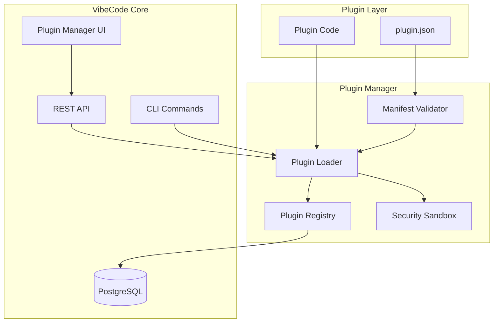
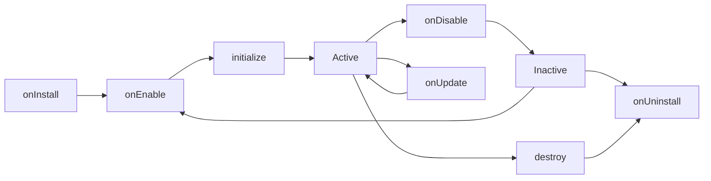

# Plugin API Documentation

VibeCode's extensible plugin system allows developers to add custom AI models, integrations, workflow automations, and UI extensions to enhance the platform's capabilities.

## Table of Contents

- [Overview](#overview)
- [Plugin Architecture](#plugin-architecture)
- [Getting Started](#getting-started)
- [Plugin SDK](#plugin-sdk)
- [Plugin Manifest](#plugin-manifest)
- [Plugin API Interface](#plugin-api-interface)
- [Plugin Types](#plugin-types)
- [Permissions System](#permissions-system)
- [Plugin Lifecycle](#plugin-lifecycle)
- [Plugin Context](#plugin-context)
- [Installation Methods](#installation-methods)
- [Plugin Marketplace](#plugin-marketplace)
- [REST API Endpoints](#rest-api-endpoints)
- [CLI Commands](#cli-commands)
- [Security & Sandboxing](#security--sandboxing)
- [Example Plugins](#example-plugins)
- [Best Practices](#best-practices)
- [Troubleshooting](#troubleshooting)

---

## Overview

The VibeCode plugin system enables:

- **Custom AI Models**: Integrate your own AI providers and models
- **Third-Party Integrations**: Connect with external tools and services
- **Workflow Automation**: Create automated tasks and workflows
- **UI Extensions**: Add custom components and functionality
- **Code Tools**: Build custom formatters, linters, and generators

### Key Features

- 🔒 **Sandboxed Execution**: Secure plugin isolation with permission-based access
- 📦 **Simple Packaging**: Standard manifest format with npm-style dependencies
- 🔌 **Hot Loading**: Install and enable plugins without restarts
- 🎯 **Type Safety**: Full TypeScript support with comprehensive types
- 📊 **Event System**: React to plugin lifecycle events
- 🛠️ **Multiple Installation Methods**: UI, CLI, or API-based installation

---

## Plugin Architecture



### Component Overview

| Component | Purpose |
|-----------|---------|
| **Plugin Loader** | Loads plugin code and initializes instances |
| **Plugin Registry** | Tracks installed plugins in memory |
| **Manifest Validator** | Validates plugin.json schema and requirements |
| **Security Sandbox** | Executes plugins in isolated environment |
| **Plugin Manager** | Coordinates installation, lifecycle, and updates |

---

## Getting Started

### Quick Start

1. **Create a plugin directory**:
```bash
mkdir my-plugin
cd my-plugin
```

2. **Create `plugin.json` manifest**:
```json
{
  "id": "my-plugin",
  "name": "My Plugin",
  "version": "1.0.0",
  "description": "My awesome plugin",
  "author": {
    "name": "Your Name",
    "email": "you@example.com"
  },
  "type": "other",
  "main": "index.ts",
  "permissions": ["commands:register"]
}
```

3. **Create `index.ts` implementation**:
```typescript
import type { PluginAPI, PluginContext } from '@vibecode/plugin-types';

export const plugin: PluginAPI = {
  manifest: require('./plugin.json'),

  capabilities: {
    providesCommands: true,
    providesAIModel: false,
    providesIntegration: false,
    providesUIComponents: false,
    providesCodeActions: false,
    providesWorkflows: false,
    providesFormatters: false,
    providesLinters: false,
  },

  async initialize(context: PluginContext) {
    context.logger.info('Plugin initialized!');
    // Your initialization code
  },

  async destroy() {
    // Cleanup code
  },
};
```

4. **Install the plugin**:
```bash
vibecode plugin install ./my-plugin
```

---

## Plugin SDK

The VibeCode Plugin SDK provides development tools, utilities, and helpers to streamline plugin development.

### Installation

Install the SDK as a development dependency:

```bash
npm install --save-dev @vibecode/plugin-sdk
```

Or install globally:

```bash
npm install -g @vibecode/plugin-sdk
```

### CLI Tools

The SDK includes a command-line interface for common development tasks:

#### Create New Plugin

```bash
vibecode-sdk create <plugin-name>
```

**Options**:
- `--type <type>` - Plugin type (ai-model, integration, workflow, etc.)
- `--typescript` - Use TypeScript (default)
- `--javascript` - Use JavaScript
- `--template <name>` - Use specific template

**Example**:
```bash
vibecode-sdk create my-awesome-plugin --type ai-model
```

This generates a complete plugin structure:
```
my-awesome-plugin/
├── plugin.json
├── index.ts
├── README.md
├── LICENSE
├── tsconfig.json
├── package.json
└── src/
    ├── types.ts
    └── utils.ts
```

#### Validate Plugin

```bash
vibecode-sdk validate [plugin-path]
```

Validates:
- Manifest schema
- Permission declarations
- Type definitions
- File structure
- Dependencies

**Example**:
```bash
vibecode-sdk validate ./my-plugin
✓ Manifest valid
✓ Permissions valid
✓ TypeScript compilation successful
✗ Missing LICENSE file
```

#### Build Plugin

```bash
vibecode-sdk build [plugin-path]
```

**Options**:
- `--watch` - Watch mode for development
- `--minify` - Minify output
- `--sourcemap` - Generate source maps

**Example**:
```bash
vibecode-sdk build ./my-plugin --watch
```

#### Package Plugin

```bash
vibecode-sdk package [plugin-path]
```

Creates a distributable `.zip` archive:

**Example**:
```bash
vibecode-sdk package ./my-plugin
✓ Built plugin successfully
✓ Created my-plugin-1.0.0.zip
```

#### Test Plugin

```bash
vibecode-sdk test [plugin-path]
```

**Options**:
- `--watch` - Watch mode
- `--coverage` - Generate coverage report

**Example**:
```bash
vibecode-sdk test ./my-plugin --coverage
```

### TypeScript Support

The SDK provides comprehensive TypeScript type definitions:

```typescript
import type {
  PluginAPI,
  PluginContext,
  PluginManifest,
  PluginCapabilities,
  PluginPermission,
  PluginLogger,
} from '@vibecode/plugin-sdk';

export const plugin: PluginAPI = {
  manifest: require('./plugin.json'),

  capabilities: {
    providesCommands: true,
    providesAIModel: false,
    providesIntegration: false,
    providesUIComponents: false,
    providesCodeActions: false,
    providesWorkflows: false,
    providesFormatters: false,
    providesLinters: false,
  },

  async initialize(context: PluginContext) {
    // Type-safe context access
    context.logger.info('Plugin initialized');
  },

  async destroy() {
    // Cleanup
  },
};
```

### Utility Functions

The SDK includes helpful utility functions:

#### Logger Utilities

```typescript
import { createLogger } from '@vibecode/plugin-sdk/utils';

const logger = createLogger('my-plugin');
logger.info('Message', { data: 'value' });
logger.error('Error occurred', { error });
```

#### Configuration Helpers

```typescript
import { loadConfig, saveConfig } from '@vibecode/plugin-sdk/utils';

// Load plugin configuration
const config = await loadConfig(context.dataPath, {
  apiKey: '',
  enabled: true,
});

// Save configuration
await saveConfig(context.dataPath, config);
```

#### Validation Helpers

```typescript
import { validateManifest, validatePermissions } from '@vibecode/plugin-sdk/utils';

// Validate manifest
const result = validateManifest(manifest);
if (!result.valid) {
  console.error('Validation errors:', result.errors);
}

// Check if permissions are valid
const permissionsValid = validatePermissions([
  'filesystem:read',
  'network:outbound',
]);
```

#### File System Helpers

```typescript
import { ensureDir, readJSON, writeJSON } from '@vibecode/plugin-sdk/utils';

// Ensure directory exists
await ensureDir(context.dataPath);

// Read JSON file
const data = await readJSON(path.join(context.dataPath, 'data.json'));

// Write JSON file
await writeJSON(path.join(context.dataPath, 'data.json'), { foo: 'bar' });
```

### Testing Utilities

The SDK provides testing helpers:

```typescript
import { createMockContext, createMockLogger } from '@vibecode/plugin-sdk/testing';

describe('MyPlugin', () => {
  it('should initialize correctly', async () => {
    const context = createMockContext({
      pluginId: 'test-plugin',
      permissions: ['filesystem:read'],
    });

    await plugin.initialize(context);

    expect(context.logger.info).toHaveBeenCalledWith('Plugin initialized');
  });
});
```

### Plugin Templates

The SDK includes templates for common plugin types:

#### AI Model Template

```bash
vibecode-sdk create my-ai-plugin --template ai-model
```

Includes:
- AI provider interface
- Model registration
- Inference handler
- Configuration schema

#### Integration Template

```bash
vibecode-sdk create my-integration --template integration
```

Includes:
- OAuth flow setup
- API client wrapper
- Webhook handlers
- Error handling

#### Workflow Template

```bash
vibecode-sdk create my-workflow --template workflow
```

Includes:
- Workflow definitions
- Task orchestration
- Scheduling setup
- State management

### Development Workflow

Recommended development workflow using the SDK:

1. **Create plugin**:
   ```bash
   vibecode-sdk create my-plugin --type integration
   cd my-plugin
   ```

2. **Install dependencies**:
   ```bash
   npm install
   ```

3. **Develop with watch mode**:
   ```bash
   vibecode-sdk build --watch
   ```

4. **Run tests**:
   ```bash
   vibecode-sdk test --watch
   ```

5. **Validate before publishing**:
   ```bash
   vibecode-sdk validate
   ```

6. **Package for distribution**:
   ```bash
   vibecode-sdk package
   ```

### SDK Configuration

Configure SDK behavior with `vibecode-sdk.config.js`:

```javascript
module.exports = {
  build: {
    target: 'es2020',
    minify: false,
    sourcemap: true,
  },

  test: {
    coverage: true,
    coverageThreshold: {
      branches: 80,
      functions: 80,
      lines: 80,
      statements: 80,
    },
  },

  validate: {
    strict: true,
    requireLicense: true,
    requireReadme: true,
  },
};
```

### API Reference

Full SDK API documentation available at:
- [SDK API Docs](https://vibecode.dev/docs/plugin-sdk)
- [Type Definitions](https://github.com/vibecode/plugin-sdk/blob/main/types/index.d.ts)

---

## Plugin Manifest

The `plugin.json` manifest defines plugin metadata, requirements, and permissions.

### Schema

```typescript
interface PluginManifest {
  // Required fields
  id: string;                          // Unique identifier (lowercase, hyphens)
  name: string;                        // Display name
  version: string;                     // Semantic version (e.g., "1.0.0")
  description: string;                 // Brief description
  author: {
    name: string;
    email?: string;
    url?: string;
  };
  type: PluginType;                    // Plugin category
  main: string;                        // Entry point file
  permissions: PluginPermission[];     // Required permissions

  // Optional fields
  dependencies?: Record<string, string>;      // npm dependencies
  peerDependencies?: Record<string, string>;  // Peer dependencies
  engines?: {
    node?: string;                     // Node.js version requirement
    vibecode?: string;                 // VibeCode version requirement
  };
  repository?: {
    type: string;                      // e.g., "git"
    url: string;
  };
  license?: string;                    // SPDX license identifier
  keywords?: string[];                 // Searchable keywords
  homepage?: string;                   // Plugin homepage URL
  icon?: string;                       // Icon URL or path
}
```

### Example Manifest

```json
{
  "id": "custom-ai-model",
  "name": "Custom AI Model Provider",
  "version": "1.0.0",
  "description": "Integrates custom AI models with VibeCode",
  "author": {
    "name": "AI Team",
    "email": "ai@example.com",
    "url": "https://example.com"
  },
  "type": "ai-model",
  "main": "index.ts",
  "permissions": [
    "ai-models:access",
    "network:outbound",
    "settings:read"
  ],
  "engines": {
    "node": ">=18.0.0",
    "vibecode": ">=1.0.0"
  },
  "repository": {
    "type": "git",
    "url": "https://github.com/example/custom-ai-model"
  },
  "license": "MIT",
  "keywords": ["ai", "llm", "custom-model"],
  "homepage": "https://example.com/docs",
  "icon": "https://example.com/icon.png"
}
```

### Validation Rules

- **`id`**: Must be lowercase, alphanumeric with hyphens only
- **`version`**: Must follow semantic versioning (MAJOR.MINOR.PATCH)
- **`type`**: Must be a valid PluginType
- **`main`**: Must point to an existing file
- **`permissions`**: Each permission must be a valid PluginPermission

---

## Plugin API Interface

Every plugin must export a `PluginAPI` object implementing the following interface:

```typescript
interface PluginAPI {
  // Required
  manifest: PluginManifest;
  capabilities: PluginCapabilities;
  initialize: (context: PluginContext) => Promise<void> | void;
  destroy: () => Promise<void> | void;

  // Optional lifecycle hooks
  onInstall?: () => Promise<void> | void;
  onUninstall?: () => Promise<void> | void;
  onEnable?: () => Promise<void> | void;
  onDisable?: () => Promise<void> | void;
  onUpdate?: (oldVersion: string, newVersion: string) => Promise<void> | void;
}
```

### Capabilities

Define what your plugin provides:

```typescript
interface PluginCapabilities {
  providesAIModel: boolean;        // Adds custom AI model
  providesIntegration: boolean;    // Integrates external service
  providesCommands: boolean;       // Adds custom commands
  providesUIComponents: boolean;   // Adds UI components
  providesCodeActions: boolean;    // Adds code actions/quick fixes
  providesWorkflows: boolean;      // Adds workflow automations
  providesFormatters: boolean;     // Adds code formatters
  providesLinters: boolean;        // Adds linters/analyzers
}
```

### Example Implementation

```typescript
import type { PluginAPI, PluginContext } from '@vibecode/plugin-types';

export const plugin: PluginAPI = {
  manifest: require('./plugin.json'),

  capabilities: {
    providesAIModel: true,
    providesIntegration: false,
    providesCommands: false,
    providesUIComponents: false,
    providesCodeActions: false,
    providesWorkflows: false,
    providesFormatters: false,
    providesLinters: false,
  },

  async initialize(context: PluginContext) {
    context.logger.info('Initializing AI model plugin');
    // Register AI provider
    // Set up event listeners
  },

  async destroy() {
    // Cleanup resources
    // Unregister providers
  },

  async onInstall() {
    // First-time setup
    // Create configuration files
  },

  async onEnable() {
    // Called when plugin is enabled
  },

  async onDisable() {
    // Called when plugin is disabled
  },

  async onUpdate(oldVersion: string, newVersion: string) {
    // Handle version migrations
    console.log(`Updating from ${oldVersion} to ${newVersion}`);
  },

  async onUninstall() {
    // Final cleanup
    // Remove configuration files
  },
};
```

---

## Plugin Types

Plugins are categorized by their primary function:

```typescript
type PluginType =
  | 'ai-model'           // Custom AI model providers
  | 'integration'        // Third-party tool integrations
  | 'workflow'           // Workflow automation plugins
  | 'ui-extension'       // UI enhancements
  | 'code-generator'     // Code generation and scaffolding
  | 'linter'            // Custom linting and code analysis
  | 'formatter'         // Code formatting plugins
  | 'other'             // General purpose plugins
```

### Type-Specific Guidelines

#### AI Model Plugins (`ai-model`)

Required capabilities:
- `providesAIModel: true`

Required permissions:
- `ai-models:access`
- `network:outbound` (if calling external APIs)

Example:
```typescript
// Register custom AI provider
const provider = {
  id: 'my-ai-provider',
  name: 'My AI Provider',
  models: [
    {
      id: 'my-model-v1',
      name: 'My Model v1',
      contextWindow: 4096,
      pricing: { input: 0.001, output: 0.002 }
    }
  ]
};
```

#### Workflow Plugins (`workflow`)

Required capabilities:
- `providesWorkflows: true`

Common permissions:
- `commands:register`
- `filesystem:read`
- `filesystem:write`
- `settings:read`

#### UI Extension Plugins (`ui-extension`)

Required capabilities:
- `providesUIComponents: true`

Required permissions:
- `ui:inject`

---

## Permissions System

Plugins must declare all required permissions in their manifest. The sandbox enforces these permissions at runtime.

### Available Permissions

```typescript
type PluginPermission =
  | 'filesystem:read'    // Read filesystem access
  | 'filesystem:write'   // Write filesystem access
  | 'network:outbound'   // Make outbound network requests
  | 'database:read'      // Read database access
  | 'database:write'     // Write database access
  | 'ai-models:access'   // Access to AI model APIs
  | 'ui:inject'          // Inject UI components
  | 'commands:register'  // Register custom commands
  | 'settings:read'      // Read user settings
  | 'settings:write'     // Modify user settings
```

### Permission Risk Levels

| Permission | Risk | Description |
|------------|------|-------------|
| `filesystem:read` | Medium | Can read files in allowed paths |
| `filesystem:write` | High | Can modify/create files |
| `network:outbound` | Medium | Can make HTTP requests to allowed hosts |
| `database:read` | Medium | Can query database |
| `database:write` | High | Can modify database |
| `ai-models:access` | Low | Can use AI models |
| `ui:inject` | Medium | Can modify UI |
| `commands:register` | Low | Can add commands |
| `settings:read` | Low | Can read settings |
| `settings:write` | Medium | Can modify settings |

### Permission Validation

The plugin system validates permissions:

```typescript
// Automatically validated on install
{
  "permissions": [
    "filesystem:read",
    "network:outbound"
  ]
}

// Invalid permissions are rejected
{
  "permissions": [
    "invalid:permission"  // ❌ Installation fails
  ]
}
```

### Permission Prerequisites

Some permissions require others:

- `database:write` requires `database:read`
- `settings:write` requires `settings:read`
- `filesystem:write` requires `filesystem:read`

### Permission Conflicts

Certain combinations are not allowed:

- `filesystem:write` + `network:outbound` requires manual review (data exfiltration risk)

---

## Plugin Lifecycle

Plugins go through several lifecycle states and events:

### Plugin Status

```typescript
type PluginStatus =
  | 'active'            // Plugin is installed and enabled
  | 'inactive'          // Plugin is installed but disabled
  | 'error'             // Plugin encountered an error
  | 'installing'        // Plugin is being installed
  | 'uninstalling'      // Plugin is being uninstalled
```

### Lifecycle Events



### Lifecycle Hooks

#### `onInstall()`
Called once when plugin is first installed.

**Use case**: One-time setup, create config files

```typescript
async onInstall() {
  // Create plugin data directory
  await fs.mkdir(this.context.dataPath, { recursive: true });

  // Create default configuration
  const defaultConfig = { enabled: true };
  await fs.writeFile(
    path.join(this.context.dataPath, 'config.json'),
    JSON.stringify(defaultConfig, null, 2)
  );
}
```

#### `initialize(context)`
Called when plugin is loaded (on enable or startup).

**Use case**: Set up runtime resources, register providers

```typescript
async initialize(context: PluginContext) {
  this.context = context;
  this.logger = context.logger;

  // Register event listeners
  // Initialize connections
  // Load cached data
}
```

#### `onEnable()`
Called when plugin is explicitly enabled by user.

**Use case**: Start background tasks, enable features

```typescript
async onEnable() {
  this.logger.info('Plugin enabled');
  // Start scheduled tasks
  // Enable integrations
}
```

#### `onDisable()`
Called when plugin is disabled by user.

**Use case**: Stop background tasks, disable features

```typescript
async onDisable() {
  this.logger.info('Plugin disabled');
  // Stop scheduled tasks
  // Disable integrations
}
```

#### `onUpdate(oldVersion, newVersion)`
Called when plugin is updated to a new version.

**Use case**: Migrate data, update configurations

```typescript
async onUpdate(oldVersion: string, newVersion: string) {
  if (oldVersion === '1.0.0' && newVersion === '2.0.0') {
    // Migrate config format
    await this.migrateConfig();
  }
}
```

#### `destroy()`
Called before plugin is unloaded.

**Use case**: Cleanup resources, close connections

```typescript
async destroy() {
  // Close database connections
  // Clear caches
  // Remove event listeners
}
```

#### `onUninstall()`
Called when plugin is completely removed.

**Use case**: Final cleanup, remove all data

```typescript
async onUninstall() {
  // Remove plugin data directory
  await fs.rm(this.context.dataPath, { recursive: true });

  // Clean up any external resources
}
```

---

## Plugin Context

The `PluginContext` object is provided to plugins during initialization:

```typescript
interface PluginContext {
  pluginId: string;                   // Plugin unique ID
  pluginPath: string;                 // Plugin installation directory
  dataPath: string;                   // Plugin-specific data directory
  logger: PluginLogger;               // Logger instance
  permissions: PluginPermission[];    // Granted permissions
  config: Record<string, unknown>;    // Plugin configuration
}
```

### Using Context

```typescript
async initialize(context: PluginContext) {
  // Access plugin ID
  const id = context.pluginId;

  // Use logger
  context.logger.info('Plugin starting', { id });
  context.logger.error('Something failed', { error: new Error() });

  // Access data directory
  const dataFile = path.join(context.dataPath, 'data.json');

  // Check permissions
  if (context.permissions.includes('filesystem:write')) {
    await fs.writeFile(dataFile, JSON.stringify({ foo: 'bar' }));
  }

  // Access configuration
  const apiKey = context.config.apiKey as string;
}
```

### Logger Interface

```typescript
interface PluginLogger {
  debug: (message: string, ...args: unknown[]) => void;
  info: (message: string, ...args: unknown[]) => void;
  warn: (message: string, ...args: unknown[]) => void;
  error: (message: string, ...args: unknown[]) => void;
}
```

**Example**:
```typescript
context.logger.info('Processing started', { taskId: 123 });
context.logger.error('Failed to process', { error: err, taskId: 123 });
```

---

## Installation Methods

### 1. Via CLI

Install from local directory:
```bash
vibecode plugin install ./plugins/my-plugin
```

Install from URL:
```bash
vibecode plugin install https://example.com/my-plugin.zip
```

Install with options:
```bash
vibecode plugin install ./my-plugin --force --auto-enable
```

### 2. Via UI

1. Navigate to `/plugins` in VibeCode
2. Click "Install Plugin"
3. Choose installation method:
   - **Upload ZIP**: Drag and drop plugin archive
   - **From URL**: Enter plugin URL
4. Configure options:
   - Force overwrite existing
   - Skip validation
   - Auto-enable after install
5. Click "Install"

### 3. Via API

**Install from URL**:
```bash
curl -X POST http://localhost:3000/api/plugins/install \
  -H "Content-Type: application/json" \
  -d '{
    "source": "https://example.com/my-plugin.zip",
    "autoEnable": true
  }'
```

**Install from file upload**:
```bash
curl -X POST http://localhost:3000/api/plugins/install \
  -F "file=@my-plugin.zip" \
  -F "autoEnable=true"
```

### Installation Options

```typescript
interface PluginInstallOptions {
  source: string;           // URL, file path, or npm package
  version?: string;         // Specific version to install
  force?: boolean;          // Overwrite if exists
  skipValidation?: boolean; // Skip manifest validation (dangerous)
  autoEnable?: boolean;     // Enable after installation
}
```

---

## Plugin Marketplace

The VibeCode Plugin Marketplace is a centralized platform for discovering, publishing, and managing plugins.

### Accessing the Marketplace

#### Via Web UI

Navigate to the Marketplace in VibeCode:

1. Open VibeCode at `http://localhost:3000`
2. Navigate to `/plugins/marketplace`
3. Browse, search, and install plugins

#### Via CLI

```bash
vibecode marketplace search <query>
vibecode marketplace install <plugin-id>
vibecode marketplace publish <plugin-path>
```

### Browsing Plugins

The Marketplace provides several ways to discover plugins:

#### Browse by Category

```typescript
GET /api/marketplace/plugins?category=ai-model
```

**Categories**:
- `ai-model` - AI model providers
- `integration` - Third-party integrations
- `workflow` - Workflow automation
- `ui-extension` - UI enhancements
- `code-generator` - Code generation tools
- `linter` - Code analysis tools
- `formatter` - Code formatting tools
- `other` - General purpose plugins

#### Search Plugins

```bash
vibecode marketplace search "ai model"
```

**Search filters**:
- **Keywords**: Match plugin keywords and description
- **Author**: Filter by plugin author
- **Category**: Filter by plugin type
- **Verified**: Show only verified plugins
- **Downloads**: Sort by popularity

**Example**:
```bash
vibecode marketplace search --category ai-model --verified
```

#### Featured Plugins

```typescript
GET /api/marketplace/featured
```

Returns curated list of featured plugins:

```json
{
  "success": true,
  "featured": [
    {
      "id": "ollama-provider",
      "name": "Ollama AI Provider",
      "description": "Use local Ollama models in VibeCode",
      "author": "VibeCode Team",
      "category": "ai-model",
      "downloads": 15234,
      "rating": 4.8,
      "verified": true,
      "icon": "https://marketplace.vibecode.dev/icons/ollama.png"
    }
  ]
}
```

### Plugin Listings

Each plugin listing includes:

```typescript
interface MarketplaceListing {
  id: string;
  name: string;
  version: string;
  description: string;
  longDescription?: string;
  author: {
    name: string;
    email?: string;
    url?: string;
    verified: boolean;
  };
  category: PluginType;
  keywords: string[];
  license: string;
  repository?: string;
  homepage?: string;
  icon?: string;
  screenshots?: string[];

  // Marketplace metadata
  downloads: number;
  rating: number;
  reviews: number;
  verified: boolean;
  publishedAt: string;
  updatedAt: string;

  // Version info
  versions: {
    version: string;
    publishedAt: string;
    changelog?: string;
  }[];
}
```

### Publishing Plugins

#### Prerequisites

1. **Create marketplace account**:
   ```bash
   vibecode marketplace login
   ```

2. **Verify plugin manifest**:
   ```bash
   vibecode-sdk validate ./my-plugin
   ```

3. **Build and test**:
   ```bash
   vibecode-sdk build ./my-plugin
   vibecode-sdk test ./my-plugin
   ```

#### Publishing Process

**First-time publication**:

```bash
vibecode marketplace publish ./my-plugin
```

**Interactive prompts**:
```
✓ Validating plugin manifest
✓ Building plugin
✓ Running tests
? Long description (optional): Detailed description of your plugin...
? Add screenshots? (Y/n): Y
? Screenshot URLs (comma-separated): https://example.com/screenshot1.png
? Plugin category: ai-model
? Keywords (comma-separated): ai, llm, local
? License: MIT
✓ Plugin published successfully!
Plugin ID: my-plugin
Version: 1.0.0
Marketplace URL: https://marketplace.vibecode.dev/plugins/my-plugin
```

#### Publishing Updates

```bash
vibecode marketplace publish ./my-plugin --version 1.1.0
```

**With changelog**:
```bash
vibecode marketplace publish ./my-plugin --version 1.1.0 --changelog "
## Changes in 1.1.0
- Added new feature X
- Fixed bug Y
- Improved performance
"
```

### Marketplace API

#### Search Plugins

**GET** `/api/marketplace/plugins`

**Query Parameters**:
- `q` - Search query
- `category` - Filter by category
- `author` - Filter by author
- `verified` - Show only verified plugins (`true`/`false`)
- `sort` - Sort order (`downloads`, `rating`, `recent`, `name`)
- `limit` - Results per page (default: 20)
- `offset` - Pagination offset

**Example**:
```bash
curl "http://localhost:3000/api/marketplace/plugins?q=ai&category=ai-model&verified=true&sort=downloads"
```

**Response**:
```json
{
  "success": true,
  "plugins": [
    {
      "id": "ollama-provider",
      "name": "Ollama AI Provider",
      "version": "1.0.0",
      "description": "Use local Ollama models",
      "author": {
        "name": "VibeCode Team",
        "verified": true
      },
      "category": "ai-model",
      "downloads": 15234,
      "rating": 4.8,
      "verified": true
    }
  ],
  "total": 1,
  "limit": 20,
  "offset": 0
}
```

#### Get Plugin Details

**GET** `/api/marketplace/plugins/:id`

**Example**:
```bash
curl http://localhost:3000/api/marketplace/plugins/ollama-provider
```

**Response**:
```json
{
  "success": true,
  "plugin": {
    "id": "ollama-provider",
    "name": "Ollama AI Provider",
    "version": "1.0.0",
    "description": "Use local Ollama models in VibeCode",
    "longDescription": "Full markdown description...",
    "author": {
      "name": "VibeCode Team",
      "url": "https://vibecode.dev",
      "verified": true
    },
    "category": "ai-model",
    "keywords": ["ai", "llm", "local", "ollama"],
    "license": "MIT",
    "repository": "https://github.com/vibecode/ollama-provider",
    "homepage": "https://vibecode.dev/plugins/ollama",
    "downloads": 15234,
    "rating": 4.8,
    "reviews": 124,
    "verified": true,
    "publishedAt": "2026-01-15T10:00:00Z",
    "updatedAt": "2026-02-10T14:30:00Z",
    "versions": [
      {
        "version": "1.0.0",
        "publishedAt": "2026-01-15T10:00:00Z",
        "changelog": "Initial release"
      }
    ]
  }
}
```

#### Install from Marketplace

**POST** `/api/marketplace/install`

**Body**:
```json
{
  "pluginId": "ollama-provider",
  "version": "1.0.0",
  "autoEnable": true
}
```

**Example**:
```bash
curl -X POST http://localhost:3000/api/marketplace/install \
  -H "Content-Type: application/json" \
  -d '{"pluginId": "ollama-provider", "autoEnable": true}'
```

**Response**:
```json
{
  "success": true,
  "pluginId": "ollama-provider",
  "version": "1.0.0",
  "installed": true
}
```

### Plugin Ratings & Reviews

#### Submit Review

**POST** `/api/marketplace/plugins/:id/reviews`

**Body**:
```json
{
  "rating": 5,
  "title": "Excellent plugin!",
  "comment": "Works perfectly with local Ollama models. Easy to set up.",
  "version": "1.0.0"
}
```

#### Get Reviews

**GET** `/api/marketplace/plugins/:id/reviews`

**Query Parameters**:
- `limit` - Reviews per page (default: 10)
- `offset` - Pagination offset
- `sort` - Sort order (`recent`, `helpful`, `rating`)

**Response**:
```json
{
  "success": true,
  "reviews": [
    {
      "id": "review-123",
      "rating": 5,
      "title": "Excellent plugin!",
      "comment": "Works perfectly...",
      "author": "user123",
      "version": "1.0.0",
      "helpful": 15,
      "createdAt": "2026-02-10T12:00:00Z"
    }
  ],
  "averageRating": 4.8,
  "total": 124
}
```

### Verified Badges

Plugins can earn verified badges through:

1. **Official Verification**: Published by VibeCode team
2. **Community Verification**: High ratings and download count
3. **Security Audit**: Passed security review

**Verification criteria**:
- ✓ Code review passed
- ✓ Security audit completed
- ✓ Test coverage > 80%
- ✓ Documentation complete
- ✓ Active maintenance (updated within 90 days)

### Marketplace CLI Commands

#### Login to Marketplace

```bash
vibecode marketplace login
```

Prompts for credentials and saves authentication token.

#### Search Marketplace

```bash
vibecode marketplace search <query>
```

**Options**:
- `--category <type>` - Filter by category
- `--verified` - Show only verified plugins
- `--limit <n>` - Number of results

**Example**:
```bash
vibecode marketplace search "ai" --category ai-model --verified
```

#### Install from Marketplace

```bash
vibecode marketplace install <plugin-id>
```

**Options**:
- `--version <version>` - Specific version
- `--auto-enable` - Enable after installation

**Example**:
```bash
vibecode marketplace install ollama-provider --auto-enable
```

#### Publish Plugin

```bash
vibecode marketplace publish <plugin-path>
```

**Options**:
- `--version <version>` - Override version
- `--changelog <text>` - Version changelog
- `--dry-run` - Test without publishing

**Example**:
```bash
vibecode marketplace publish ./my-plugin --version 1.0.1 --changelog "Bug fixes"
```

#### Update Plugin Listing

```bash
vibecode marketplace update <plugin-id>
```

Update metadata without publishing new version:

**Example**:
```bash
vibecode marketplace update my-plugin \
  --description "Updated description" \
  --keywords "ai,llm,local" \
  --homepage "https://example.com"
```

#### Unpublish Plugin

```bash
vibecode marketplace unpublish <plugin-id>
```

**Warning**: This removes the plugin from the marketplace. Users who already installed it can continue using it.

**Example**:
```bash
vibecode marketplace unpublish my-plugin --version 1.0.0
```

### Monetization (Coming Soon)

Future support for paid plugins:

- **One-time purchase**: Pay once, use forever
- **Subscription**: Monthly/yearly billing
- **Freemium**: Free tier with paid upgrades
- **Donations**: Optional support from users

### Marketplace Guidelines

All published plugins must follow these guidelines:

1. **Quality Standards**:
   - Comprehensive documentation
   - Test coverage > 70%
   - No known security vulnerabilities
   - Active maintenance

2. **Content Policy**:
   - No malicious code
   - No copyright violations
   - No misleading descriptions
   - No spam or duplicate listings

3. **Naming Conventions**:
   - Clear, descriptive names
   - No trademark violations
   - No impersonation

4. **Versioning**:
   - Follow semantic versioning
   - Provide changelogs
   - Maintain backwards compatibility when possible

5. **Licensing**:
   - Must include valid license
   - Open source preferred
   - License must match repository

**Violations** may result in plugin removal or account suspension.

---

## REST API Endpoints

### List Plugins

**GET** `/api/plugins`

Query parameters:
- `type` - Filter by plugin type
- `status` - Filter by status (active, inactive, error)
- `keyword` - Search by keyword
- `author` - Filter by author name

**Response**:
```json
{
  "success": true,
  "plugins": [
    {
      "id": "hello-world",
      "name": "Hello World",
      "version": "1.0.0",
      "description": "A simple example plugin",
      "author": {
        "name": "VibeCode Team"
      },
      "status": "active",
      "capabilities": {
        "providesCommands": true,
        "providesAIModel": false
      },
      "permissions": ["commands:register"],
      "icon": null,
      "homepage": null
    }
  ],
  "total": 1
}
```

### Get Plugin Details

**GET** `/api/plugins/:id`

**Response**:
```json
{
  "success": true,
  "plugin": {
    "id": "hello-world",
    "name": "Hello World",
    "version": "1.0.0",
    "description": "A simple example plugin",
    "status": "active",
    "installedAt": "2026-02-14T12:00:00Z",
    "updatedAt": "2026-02-14T12:00:00Z"
  }
}
```

### Install Plugin

**POST** `/api/plugins/install`

**Content-Type**: `application/json` or `multipart/form-data`

**JSON Body**:
```json
{
  "source": "https://example.com/my-plugin.zip",
  "version": "1.0.0",
  "force": false,
  "skipValidation": false,
  "autoEnable": true
}
```

**File Upload (multipart/form-data)**:
```
file: <plugin.zip>
autoEnable: true
force: false
```

**Response**:
```json
{
  "success": true,
  "pluginId": "my-plugin",
  "warnings": []
}
```

### Enable/Disable Plugin

**POST** `/api/plugins`

**Body**:
```json
{
  "action": "enable",
  "pluginId": "hello-world"
}
```

Actions: `enable`, `disable`

**Response**:
```json
{
  "success": true,
  "message": "Plugin 'hello-world' enabled successfully"
}
```

### Uninstall Plugin

**DELETE** `/api/plugins/:id`

**Response**:
```json
{
  "success": true,
  "message": "Plugin 'hello-world' uninstalled successfully"
}
```

### Rate Limiting

All API endpoints are rate-limited to **60 requests per minute** per IP address.

Rate limit headers:
```
X-RateLimit-Limit: 60
X-RateLimit-Remaining: 59
X-RateLimit-Reset: 1708012800
Retry-After: 60
```

---

## CLI Commands

The `vibecode` CLI provides plugin management commands:

### List Plugins

```bash
vibecode plugin list
```

**Output**:
```
Installed Plugins:
  hello-world (v1.0.0) - Active
  custom-model (v1.0.0) - Inactive
  workflow-automation (v1.0.0) - Active
```

### Install Plugin

```bash
vibecode plugin install <source>
```

**Examples**:
```bash
# From local directory
vibecode plugin install ./plugins/my-plugin

# From URL
vibecode plugin install https://example.com/my-plugin.zip

# With force overwrite
vibecode plugin install ./my-plugin --force
```

### Uninstall Plugin

```bash
vibecode plugin uninstall <plugin-id>
```

**Example**:
```bash
vibecode plugin uninstall hello-world
```

### Get Help

```bash
vibecode plugin --help
```

---

## Security & Sandboxing

### Sandbox Execution

All plugins run in a **sandboxed environment** with restricted access:

```typescript
interface PluginSandboxConfig {
  timeout: number;              // Execution timeout in ms (default: 30000)
  memoryLimit: number;          // Memory limit in MB (default: 512)
  cpuLimit?: number;            // CPU time limit
  allowedPaths: string[];       // Filesystem paths plugin can access
  allowedHosts: string[];       // Network hosts plugin can access
}
```

### Sandbox Restrictions

- **Filesystem**: Only allowed paths are accessible
- **Network**: Only allowed hosts can be reached
- **Memory**: Hard limit enforced (default 512MB)
- **CPU**: Timeout after 30 seconds (configurable)
- **Modules**: Only safe Node.js modules are importable

### Permission Enforcement

```typescript
// Filesystem access - checked at runtime
if (!hasPermission('filesystem:read')) {
  throw new Error('Permission denied: filesystem:read');
}

// Network access - validated against allowedHosts
if (!allowedHosts.includes(hostname)) {
  throw new Error('Permission denied: host not allowed');
}
```

### Security Best Practices

1. **Principle of Least Privilege**: Only request necessary permissions
2. **Validate Inputs**: Always validate external data
3. **Handle Errors**: Use try-catch blocks
4. **Secure Dependencies**: Audit npm packages
5. **No Hardcoded Secrets**: Use environment variables
6. **Timeout Long Operations**: Prevent hanging

**Example**:
```typescript
async initialize(context: PluginContext) {
  try {
    // Validate configuration
    if (!context.config.apiKey) {
      throw new Error('Missing API key in configuration');
    }

    // Use timeout for external calls
    const response = await Promise.race([
      fetch('https://api.example.com'),
      new Promise((_, reject) =>
        setTimeout(() => reject(new Error('Timeout')), 5000)
      )
    ]);
  } catch (error) {
    context.logger.error('Initialization failed', { error });
    throw error;
  }
}
```

### Dangerous Permissions

Plugins requesting these permission combinations require manual review:

- `filesystem:write` + `network:outbound` (data exfiltration risk)
- `database:write` + `network:outbound` (data leak risk)
- `settings:write` + `ui:inject` (UI spoofing risk)

---

## Example Plugins

### Hello World Plugin

Demonstrates basic plugin structure and lifecycle hooks.

**Location**: `plugins/examples/hello-world/`

**Features**:
- Minimal manifest
- Lifecycle logging
- Command registration
- Context usage

**Installation**:
```bash
vibecode plugin install ./plugins/examples/hello-world
```

See: [hello-world/README.md](../plugins/examples/hello-world/README.md)

---

### Custom AI Model Plugin

Demonstrates AI provider integration.

**Location**: `plugins/examples/custom-model/`

**Features**:
- Custom AI provider registration
- Model metadata configuration
- Inference implementation
- Environment variable usage

**Example**:
```typescript
const provider = {
  id: 'ollama',
  name: 'Ollama Local',
  models: [
    {
      id: 'llama2',
      name: 'Llama 2',
      contextWindow: 4096,
      capabilities: ['chat', 'completion']
    }
  ]
};
```

**Installation**:
```bash
vibecode plugin install ./plugins/examples/custom-model
```

See: [custom-model/README.md](../plugins/examples/custom-model/README.md)

---

### Workflow Automation Plugin

Demonstrates workflow automation capabilities.

**Location**: `plugins/examples/workflow-automation/`

**Features**:
- Workflow definitions
- Task orchestration
- Scheduled execution
- Multi-step workflows

**Example Workflows**:
- **Daily Cleanup**: Automated file cleanup
- **Code Quality Check**: Multi-step validation
- **Auto Backup**: Scheduled backups

**Installation**:
```bash
vibecode plugin install ./plugins/examples/workflow-automation
```

See: [workflow-automation/README.md](../plugins/examples/workflow-automation/README.md)

---

## Best Practices

### 1. Plugin Structure

**Recommended Directory Layout**:
```
my-plugin/
├── plugin.json          # Manifest (required)
├── index.ts            # Entry point (required)
├── README.md           # Documentation
├── LICENSE             # License file
├── src/                # Source code
│   ├── provider.ts
│   ├── utils.ts
│   └── types.ts
├── tests/              # Unit tests
│   └── plugin.test.ts
└── package.json        # npm dependencies (optional)
```

### 2. Error Handling

Always handle errors gracefully:

```typescript
async initialize(context: PluginContext) {
  try {
    // Plugin initialization
    await this.setup();
  } catch (error) {
    context.logger.error('Failed to initialize', { error });
    // Don't throw - let plugin gracefully degrade
  }
}
```

### 3. Logging

Use structured logging with context:

```typescript
// Good
context.logger.info('Task completed', {
  taskId: 123,
  duration: 1500,
  itemsProcessed: 42
});

// Bad
console.log('Task done');
```

### 4. Async Operations

Handle promises correctly:

```typescript
// Good - proper async/await
async initialize(context: PluginContext) {
  await this.loadConfig();
  await this.connectDatabase();
}

// Bad - unhandled promise
initialize(context: PluginContext) {
  this.loadConfig(); // Promise not awaited!
}
```

### 5. Resource Cleanup

Always clean up in `destroy()`:

```typescript
async destroy() {
  // Close connections
  await this.db?.close();

  // Clear timers
  if (this.timer) {
    clearInterval(this.timer);
  }

  // Remove event listeners
  this.emitter?.removeAllListeners();
}
```

### 6. Version Compatibility

Specify version requirements:

```json
{
  "engines": {
    "node": ">=18.0.0",
    "vibecode": ">=1.0.0"
  }
}
```

### 7. Testing

Write unit tests for your plugin:

```typescript
import { plugin } from '../index';

describe('MyPlugin', () => {
  it('should initialize without errors', async () => {
    const context = createMockContext();
    await expect(plugin.initialize(context)).resolves.not.toThrow();
  });
});
```

### 8. Documentation

Provide comprehensive README:

- Installation instructions
- Configuration options
- Usage examples
- API reference
- Troubleshooting guide

### 9. Security

- Never hardcode secrets
- Validate all inputs
- Use environment variables for configuration
- Audit dependencies regularly
- Follow OWASP best practices

### 10. Performance

- Cache expensive operations
- Use lazy loading when possible
- Implement timeouts for long operations
- Monitor memory usage
- Optimize database queries

---

## Troubleshooting

### Plugin Not Loading

**Symptoms**: Plugin status shows "error" or doesn't appear

**Solutions**:
1. Check manifest validation:
   ```bash
   vibecode plugin validate ./my-plugin
   ```

2. Check plugin logs:
   ```bash
   vibecode logs | grep "plugin-id"
   ```

3. Verify file permissions:
   ```bash
   ls -la plugins/my-plugin/
   ```

4. Check for syntax errors:
   ```bash
   npx tsc --noEmit index.ts
   ```

### Permission Denied Errors

**Symptoms**: `Error: Permission denied: <permission>`

**Solutions**:
1. Add permission to `plugin.json`:
   ```json
   {
     "permissions": ["filesystem:read", "network:outbound"]
   }
   ```

2. Reinstall plugin:
   ```bash
   vibecode plugin uninstall my-plugin
   vibecode plugin install ./my-plugin
   ```

### Plugin Timeouts

**Symptoms**: Plugin operations timeout

**Solutions**:
1. Reduce initialization time
2. Move long operations to background
3. Request higher timeout limit
4. Optimize expensive operations

### Memory Limit Exceeded

**Symptoms**: `Error: Memory limit exceeded`

**Solutions**:
1. Optimize memory usage
2. Clear caches periodically
3. Process data in chunks
4. Request higher memory limit

### Network Errors

**Symptoms**: `Error: Host not allowed`

**Solutions**:
1. Ensure `network:outbound` permission is granted
2. Check allowed hosts configuration
3. Verify network connectivity
4. Use HTTPS instead of HTTP

### Database Errors

**Symptoms**: `Error: Database operation failed`

**Solutions**:
1. Check database permissions
2. Verify connection string
3. Check database is running
4. Review query syntax

### Common Error Codes

| Code | Meaning | Solution |
|------|---------|----------|
| `ERR_PLUGIN_NOT_FOUND` | Plugin ID doesn't exist | Check plugin ID spelling |
| `ERR_INVALID_MANIFEST` | Manifest validation failed | Fix plugin.json schema |
| `ERR_PERMISSION_DENIED` | Missing required permission | Add permission to manifest |
| `ERR_SANDBOX_TIMEOUT` | Execution timeout | Optimize plugin code |
| `ERR_MEMORY_LIMIT` | Memory limit exceeded | Reduce memory usage |
| `ERR_INVALID_VERSION` | Version format invalid | Use semantic versioning |

### Getting Help

1. **Documentation**: Check [Plugin Examples](../plugins/examples/)
2. **Logs**: Review plugin logs for detailed errors
3. **Community**: Ask in VibeCode community forums
4. **GitHub**: Open an issue with reproduction steps

---

## Additional Resources

- [Plugin Type Definitions](../src/types/plugin.ts)
- [Plugin Manager Source](../src/lib/plugins/plugin-manager.ts)
- [Example Plugins](../plugins/examples/)
- [Developer Guide](./DEVELOPER_GUIDE.md)
- [Security Documentation](./SECURITY.md)

---

## Contributing

We welcome plugin contributions! Please:

1. Follow the plugin structure guidelines
2. Include comprehensive tests
3. Document all configuration options
4. Submit a pull request with your plugin

See [Contributing Guidelines](../CONTRIBUTING.md) for details.

---

## License

VibeCode Plugin System is licensed under the MIT License.

---

**Last Updated**: February 14, 2026
**Version**: 1.0.0
