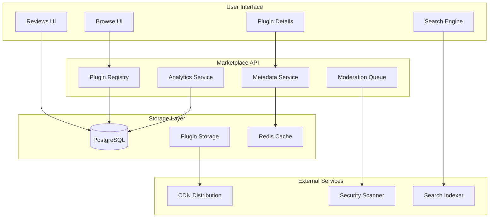
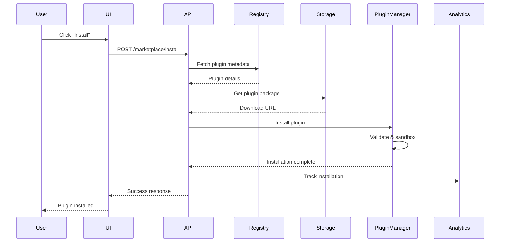
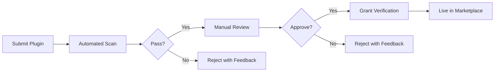

# Plugin Marketplace Documentation

The VibeCode Plugin Marketplace is a centralized hub for discovering, sharing, and distributing community-created extensions that enhance the platform's capabilities.

## Table of Contents

- [Overview](#overview)
- [Marketplace Architecture](#marketplace-architecture)
- [Browsing Plugins](#browsing-plugins)
- [Plugin Categories](#plugin-categories)
- [Installing from Marketplace](#installing-from-marketplace)
- [Publishing Plugins](#publishing-plugins)
- [Plugin Verification](#plugin-verification)
- [Ratings & Reviews](#ratings--reviews)
- [Marketplace API](#marketplace-api)
- [Plugin Discovery](#plugin-discovery)
- [Version Management](#version-management)
- [Plugin Analytics](#plugin-analytics)
- [Moderation & Safety](#moderation--safety)
- [Best Practices for Publishers](#best-practices-for-publishers)
- [Monetization (Future)](#monetization-future)
- [Troubleshooting](#troubleshooting)

---

## Overview

The Plugin Marketplace enables the VibeCode community to share and discover plugins that extend platform functionality.

### Key Features

- 🔍 **Searchable Catalog**: Full-text search across plugins, authors, and descriptions
- 📊 **Curated Categories**: Organized plugin discovery by type and use case
- ⭐ **Ratings & Reviews**: Community-driven quality feedback
- 🛡️ **Verified Plugins**: Security-reviewed plugins with verification badges
- 📈 **Analytics**: Download counts, usage metrics, and trending plugins
- 🔄 **Version Management**: Semantic versioning with update notifications
- 🎯 **Recommendations**: Personalized plugin suggestions based on usage
- 🚀 **One-Click Install**: Seamless installation directly from marketplace

### Marketplace Statistics

```typescript
interface MarketplaceStats {
  totalPlugins: number;           // Total published plugins
  verifiedPlugins: number;        // Security-verified plugins
  totalDownloads: number;         // Cumulative downloads
  activePublishers: number;       // Active plugin authors
  averageRating: number;          // Overall marketplace quality
  categoriesCount: number;        // Available categories
}
```

---

## Marketplace Architecture



### Component Overview

| Component | Purpose |
|-----------|---------|
| **Plugin Registry** | Manages plugin listings and versions |
| **Metadata Service** | Stores and serves plugin metadata |
| **Analytics Service** | Tracks downloads, usage, and trends |
| **Moderation Queue** | Reviews and approves plugin submissions |
| **Security Scanner** | Scans plugins for vulnerabilities |
| **Search Indexer** | Enables full-text search across catalog |

---

## Browsing Plugins

### Marketplace UI

Access the marketplace at: `https://vibecode.app/marketplace` or `/marketplace` in your VibeCode instance.

#### Main Views

1. **Featured Plugins**: Curated staff picks and trending plugins
2. **Categories**: Browse by plugin type
3. **New & Updated**: Recently published or updated plugins
4. **Most Popular**: Sorted by download count
5. **Top Rated**: Sorted by community ratings
6. **Verified**: Security-reviewed plugins

#### Search Filters

```typescript
interface SearchFilters {
  query?: string;                  // Full-text search
  category?: PluginType[];         // Filter by category
  verified?: boolean;              // Show only verified
  minRating?: number;              // Minimum star rating (1-5)
  author?: string;                 // Filter by author
  tags?: string[];                 // Filter by keywords
  sortBy?: SortOption;             // Sort order
  license?: string[];              // Filter by license
}

type SortOption =
  | 'relevance'         // Search relevance (default for queries)
  | 'downloads'         // Most downloaded
  | 'rating'            // Highest rated
  | 'recent'            // Recently updated
  | 'newest'            // Recently published
  | 'name'              // Alphabetical
```

#### Example Search

```bash
# Via CLI
vibecode marketplace search "ai model" \
  --category=ai-model \
  --verified=true \
  --min-rating=4.0 \
  --sort=downloads

# Via API
GET /api/marketplace/search?q=ai+model&category=ai-model&verified=true&minRating=4.0&sort=downloads
```

---

## Plugin Categories

Plugins are organized into standardized categories for easier discovery:

### Category Taxonomy

```typescript
type PluginCategory =
  | 'ai-models'           // AI model providers and integrations
  | 'integrations'        // Third-party service integrations
  | 'workflows'           // Automation and workflow plugins
  | 'ui-extensions'       // User interface enhancements
  | 'code-tools'          // Development tools (formatters, linters)
  | 'productivity'        // Productivity enhancements
  | 'collaboration'       // Team collaboration features
  | 'data-science'        // Data analysis and visualization
  | 'devops'              // DevOps and infrastructure tools
  | 'security'            // Security and compliance tools
  | 'other'               // Miscellaneous plugins
```

### Category Metadata

Each category includes:

```typescript
interface CategoryInfo {
  id: string;                      // Category identifier
  name: string;                    // Display name
  description: string;             // Category description
  icon: string;                    // Category icon
  pluginCount: number;             // Number of plugins
  popularPlugins: string[];        // Top 5 plugin IDs
}
```

### Example Category Listing

**GET** `/api/marketplace/categories`

```json
{
  "success": true,
  "categories": [
    {
      "id": "ai-models",
      "name": "AI Models",
      "description": "Custom AI model providers and integrations",
      "icon": "🤖",
      "pluginCount": 42,
      "popularPlugins": ["ollama-integration", "custom-gpt", "local-llm"]
    },
    {
      "id": "integrations",
      "name": "Integrations",
      "description": "Connect with external tools and services",
      "icon": "🔌",
      "pluginCount": 87,
      "popularPlugins": ["github-sync", "jira-integration", "slack-notify"]
    }
  ]
}
```

---

## Installing from Marketplace

### Via Marketplace UI

1. Navigate to `/marketplace`
2. Search or browse for plugins
3. Click on plugin card to view details
4. Review:
   - Description and features
   - Ratings and reviews
   - Required permissions
   - Compatibility requirements
5. Click **"Install"** button
6. Confirm permission grants
7. Wait for installation to complete
8. Enable plugin (if not auto-enabled)

### Via CLI

```bash
# Search marketplace
vibecode marketplace search "github integration"

# Install by marketplace ID
vibecode marketplace install github-sync

# Install specific version
vibecode marketplace install github-sync@2.1.0

# Install and auto-enable
vibecode marketplace install github-sync --auto-enable
```

### Via API

**POST** `/api/marketplace/install`

```json
{
  "pluginId": "github-sync",
  "version": "2.1.0",
  "autoEnable": true
}
```

**Response**:
```json
{
  "success": true,
  "installation": {
    "pluginId": "github-sync",
    "version": "2.1.0",
    "status": "installing",
    "downloadUrl": "https://cdn.vibecode.app/plugins/github-sync/2.1.0.zip"
  }
}
```

### Installation Flow



---

## Publishing Plugins

### Publishing Requirements

Before publishing, ensure your plugin meets these requirements:

#### ✅ Required Checklist

- [ ] Valid `plugin.json` manifest
- [ ] Semantic version number
- [ ] Clear description (min 50 characters)
- [ ] README.md with documentation
- [ ] LICENSE file (open source license)
- [ ] No security vulnerabilities
- [ ] Passes manifest validation
- [ ] Icon/logo (recommended 512x512px)
- [ ] Screenshots (recommended)
- [ ] Test coverage (recommended >70%)

#### 📋 Manifest Requirements

```json
{
  "id": "my-awesome-plugin",
  "name": "My Awesome Plugin",
  "version": "1.0.0",
  "description": "A comprehensive description of what this plugin does (minimum 50 characters)",
  "author": {
    "name": "Your Name",
    "email": "you@example.com",
    "url": "https://yoursite.com"
  },
  "type": "integration",
  "main": "index.ts",
  "permissions": ["network:outbound"],
  "repository": {
    "type": "git",
    "url": "https://github.com/yourname/my-awesome-plugin"
  },
  "license": "MIT",
  "keywords": ["integration", "automation", "productivity"],
  "homepage": "https://github.com/yourname/my-awesome-plugin#readme",
  "icon": "https://yoursite.com/icon.png"
}
```

### Publishing Process

#### Step 1: Create Account

```bash
# Login or create marketplace account
vibecode marketplace login

# Verify your email
vibecode marketplace verify-email
```

#### Step 2: Prepare Plugin

```bash
# Validate plugin locally
vibecode plugin validate ./my-plugin

# Run security scan
vibecode plugin scan ./my-plugin

# Test plugin
vibecode plugin test ./my-plugin
```

#### Step 3: Publish

```bash
# Publish to marketplace
vibecode marketplace publish ./my-plugin

# Publish with options
vibecode marketplace publish ./my-plugin \
  --access=public \
  --tag=latest \
  --dry-run
```

#### Step 4: Moderation Review

After publishing, your plugin enters the moderation queue:

1. **Automated Checks** (5-10 minutes):
   - Manifest validation
   - Security vulnerability scan
   - License compliance check
   - Permission risk assessment

2. **Manual Review** (1-3 business days):
   - Code quality review
   - Functionality verification
   - Documentation completeness
   - Community guidelines compliance

3. **Approval/Rejection**:
   - **Approved**: Plugin goes live in marketplace
   - **Rejected**: Email with feedback and required changes

### Publishing via API

**POST** `/api/marketplace/publish`

**Content-Type**: `multipart/form-data`

```typescript
interface PublishRequest {
  package: File;                   // Plugin ZIP file
  access: 'public' | 'unlisted';   // Visibility
  tag?: string;                    // Version tag (e.g., 'latest', 'beta')
  releaseNotes?: string;           // What's new in this version
  screenshots?: File[];            // Screenshot images
}
```

**Example**:
```bash
curl -X POST https://api.vibecode.app/marketplace/publish \
  -H "Authorization: Bearer YOUR_API_TOKEN" \
  -F "package=@my-plugin.zip" \
  -F "access=public" \
  -F "tag=latest" \
  -F "releaseNotes=Initial release with core features" \
  -F "screenshots=@screenshot1.png" \
  -F "screenshots=@screenshot2.png"
```

**Response**:
```json
{
  "success": true,
  "publication": {
    "pluginId": "my-awesome-plugin",
    "version": "1.0.0",
    "status": "pending_review",
    "submittedAt": "2026-02-21T10:00:00Z",
    "estimatedReviewTime": "1-3 business days"
  }
}
```

---

## Plugin Verification

### Verification Badge

Verified plugins display a ✓ badge indicating they've passed security review.

#### Verification Criteria

To receive verification, plugins must:

1. **Security Requirements**:
   - No known vulnerabilities
   - No malicious code patterns
   - Proper permission scoping
   - Secure dependency usage
   - No hardcoded secrets

2. **Quality Requirements**:
   - Comprehensive documentation
   - Test coverage >70%
   - Clean code patterns
   - Proper error handling
   - Resource cleanup

3. **Compliance Requirements**:
   - Valid open source license
   - No copyright violations
   - Privacy policy (if collecting data)
   - Terms of service compliance

#### Verification Process



#### Requesting Verification

```bash
# Request verification for your published plugin
vibecode marketplace request-verification my-plugin

# Check verification status
vibecode marketplace verification-status my-plugin
```

**API Endpoint**:

**POST** `/api/marketplace/plugins/:id/request-verification`

```json
{
  "success": true,
  "request": {
    "pluginId": "my-plugin",
    "status": "pending_review",
    "submittedAt": "2026-02-21T10:00:00Z",
    "reviewUrl": "https://marketplace.vibecode.app/reviews/abc123"
  }
}
```

---

## Ratings & Reviews

### Rating System

Users can rate plugins on a 5-star scale and leave detailed reviews.

#### Rating Breakdown

```typescript
interface PluginRatings {
  averageRating: number;           // 0.0 - 5.0
  totalRatings: number;            // Total number of ratings
  distribution: {
    5: number;                     // Count of 5-star ratings
    4: number;                     // Count of 4-star ratings
    3: number;                     // Count of 3-star ratings
    2: number;                     // Count of 2-star ratings
    1: number;                     // Count of 1-star ratings
  };
  recentReviews: Review[];         // Latest reviews
}
```

### Submitting Reviews

#### Via UI

1. Navigate to plugin details page
2. Scroll to "Reviews" section
3. Click "Write a Review"
4. Select star rating (1-5)
5. Write review text (optional, min 20 characters)
6. Submit review

#### Via CLI

```bash
# Rate plugin
vibecode marketplace rate github-sync --stars=5

# Rate with review
vibecode marketplace rate github-sync \
  --stars=5 \
  --review="Excellent integration! Works flawlessly with our workflow."
```

#### Via API

**POST** `/api/marketplace/plugins/:id/reviews`

```json
{
  "rating": 5,
  "title": "Excellent plugin!",
  "review": "This plugin has greatly improved our GitHub workflow. The sync is fast and reliable.",
  "pros": ["Fast sync", "Easy setup", "Great documentation"],
  "cons": ["Could use more configuration options"]
}
```

**Response**:
```json
{
  "success": true,
  "review": {
    "id": "review-123",
    "pluginId": "github-sync",
    "userId": "user-456",
    "rating": 5,
    "title": "Excellent plugin!",
    "review": "This plugin has greatly improved our GitHub workflow...",
    "helpful": 0,
    "createdAt": "2026-02-21T10:00:00Z"
  }
}
```

### Review Guidelines

#### ✅ Good Reviews

- Specific and detailed feedback
- Mentions use cases and benefits
- Constructive criticism
- Helpful for other users

#### ❌ Bad Reviews

- Spam or off-topic content
- Personal attacks on authors
- Promotional content
- Duplicate reviews

### Moderating Reviews

Plugin authors can:
- **Respond** to reviews (publicly)
- **Report** inappropriate reviews
- Cannot **delete** or **edit** user reviews

---

## Marketplace API

### Authentication

Marketplace API requires authentication for certain operations:

```bash
# Get API token
vibecode marketplace token

# Use in requests
curl -H "Authorization: Bearer YOUR_TOKEN" \
  https://api.vibecode.app/marketplace/...
```

### Core Endpoints

#### List Plugins

**GET** `/api/marketplace/plugins`

Query parameters:
- `page` - Page number (default: 1)
- `limit` - Results per page (default: 20, max: 100)
- `category` - Filter by category
- `verified` - Filter verified plugins (true/false)
- `sort` - Sort order (downloads, rating, recent, newest)

**Response**:
```json
{
  "success": true,
  "plugins": [
    {
      "id": "github-sync",
      "name": "GitHub Sync",
      "version": "2.1.0",
      "description": "Seamless GitHub repository synchronization",
      "author": {
        "name": "DevTools Team",
        "email": "dev@example.com"
      },
      "category": "integration",
      "verified": true,
      "rating": 4.8,
      "downloads": 15234,
      "updatedAt": "2026-02-15T10:00:00Z",
      "icon": "https://cdn.vibecode.app/icons/github-sync.png"
    }
  ],
  "pagination": {
    "page": 1,
    "limit": 20,
    "total": 156,
    "pages": 8
  }
}
```

#### Get Plugin Details

**GET** `/api/marketplace/plugins/:id`

**Response**:
```json
{
  "success": true,
  "plugin": {
    "id": "github-sync",
    "name": "GitHub Sync",
    "version": "2.1.0",
    "description": "Seamless GitHub repository synchronization with real-time updates",
    "longDescription": "Full markdown description...",
    "author": {
      "name": "DevTools Team",
      "email": "dev@example.com",
      "url": "https://devtools.example.com"
    },
    "category": "integration",
    "type": "integration",
    "verified": true,
    "permissions": ["network:outbound", "filesystem:read", "settings:read"],
    "rating": {
      "average": 4.8,
      "total": 342,
      "distribution": {
        "5": 280,
        "4": 45,
        "3": 12,
        "2": 3,
        "1": 2
      }
    },
    "downloads": 15234,
    "versions": [
      {
        "version": "2.1.0",
        "publishedAt": "2026-02-15T10:00:00Z",
        "downloads": 1234
      },
      {
        "version": "2.0.0",
        "publishedAt": "2026-01-10T10:00:00Z",
        "downloads": 14000
      }
    ],
    "repository": {
      "type": "git",
      "url": "https://github.com/example/github-sync"
    },
    "license": "MIT",
    "homepage": "https://github.com/example/github-sync#readme",
    "screenshots": [
      "https://cdn.vibecode.app/screenshots/github-sync-1.png",
      "https://cdn.vibecode.app/screenshots/github-sync-2.png"
    ],
    "changelog": "## v2.1.0\n- Added webhook support\n- Fixed sync issues...",
    "createdAt": "2025-08-01T10:00:00Z",
    "updatedAt": "2026-02-15T10:00:00Z"
  }
}
```

#### Search Plugins

**GET** `/api/marketplace/search`

Query parameters:
- `q` - Search query (required)
- `category` - Filter by category
- `verified` - Show only verified (true/false)
- `minRating` - Minimum rating (1-5)
- `sort` - Sort order

**Example**:
```bash
GET /api/marketplace/search?q=github&category=integration&verified=true&sort=downloads
```

#### Install Plugin

**POST** `/api/marketplace/install`

```json
{
  "pluginId": "github-sync",
  "version": "2.1.0",
  "autoEnable": true
}
```

#### Get Plugin Versions

**GET** `/api/marketplace/plugins/:id/versions`

**Response**:
```json
{
  "success": true,
  "versions": [
    {
      "version": "2.1.0",
      "publishedAt": "2026-02-15T10:00:00Z",
      "downloads": 1234,
      "changelog": "Added webhook support",
      "breaking": false
    },
    {
      "version": "2.0.0",
      "publishedAt": "2026-01-10T10:00:00Z",
      "downloads": 14000,
      "changelog": "Major rewrite with new features",
      "breaking": true
    }
  ]
}
```

---

## Plugin Discovery

### Recommendation Engine

The marketplace uses multiple signals to recommend plugins:

#### Recommendation Factors

```typescript
interface RecommendationFactors {
  userProfile: {
    installedPlugins: string[];      // Currently installed
    categories: string[];             // Preferred categories
    ratings: Record<string, number>;  // User's ratings
  };

  pluginSignals: {
    downloads: number;                // Popularity
    rating: number;                   // Quality
    velocity: number;                 // Growth trend
    recency: Date;                    // Recent activity
    verified: boolean;                // Trust signal
  };

  contextual: {
    similarUsers: string[];           // Similar user installs
    trending: boolean;                // Currently trending
    seasonal: boolean;                // Time-relevant
  };
}
```

#### Getting Recommendations

**GET** `/api/marketplace/recommendations`

Query parameters:
- `limit` - Number of recommendations (default: 10)
- `context` - Recommendation context (similar, trending, new)

**Response**:
```json
{
  "success": true,
  "recommendations": [
    {
      "pluginId": "jira-integration",
      "reason": "Users who installed GitHub Sync also installed this",
      "score": 0.89
    },
    {
      "pluginId": "gitlab-sync",
      "reason": "Similar to your installed plugins",
      "score": 0.82
    }
  ]
}
```

### Trending Plugins

**GET** `/api/marketplace/trending`

Calculates trending based on:
- Download velocity (last 7 days vs previous 7 days)
- Rating changes
- Review activity

**Response**:
```json
{
  "success": true,
  "trending": [
    {
      "pluginId": "ai-assistant",
      "name": "AI Code Assistant",
      "downloads": 5423,
      "downloadGrowth": 2.4,
      "rating": 4.9,
      "trend": "rising"
    }
  ]
}
```

---

## Version Management

### Semantic Versioning

All marketplace plugins follow [Semantic Versioning](https://semver.org/):

```
MAJOR.MINOR.PATCH

- MAJOR: Breaking changes
- MINOR: New features (backward compatible)
- PATCH: Bug fixes (backward compatible)
```

### Publishing Updates

```bash
# Update version in plugin.json
# Then publish new version
vibecode marketplace publish ./my-plugin --tag=latest

# Publish pre-release
vibecode marketplace publish ./my-plugin --tag=beta
```

### Update Notifications

Users receive notifications when:
- Installed plugins have updates available
- Major version updates (breaking changes)
- Security updates (critical)

#### Checking for Updates

**GET** `/api/marketplace/updates`

**Response**:
```json
{
  "success": true,
  "updates": [
    {
      "pluginId": "github-sync",
      "currentVersion": "2.0.0",
      "latestVersion": "2.1.0",
      "updateType": "minor",
      "breaking": false,
      "changelog": "Added webhook support and fixed sync issues"
    }
  ]
}
```

### Auto-Update Settings

```typescript
interface AutoUpdateConfig {
  enabled: boolean;                  // Enable auto-updates
  includeMinor: boolean;             // Auto-update minor versions
  includePatch: boolean;             // Auto-update patch versions
  excludeBreaking: boolean;          // Skip breaking changes
  schedule?: 'immediate' | 'daily' | 'weekly';
}
```

---

## Plugin Analytics

### Publisher Analytics

Plugin authors can access detailed analytics:

#### Metrics Available

```typescript
interface PluginAnalytics {
  downloads: {
    total: number;
    byVersion: Record<string, number>;
    byDate: Record<string, number>;    // Daily downloads
    byCountry: Record<string, number>;
  };

  users: {
    active: number;                     // Currently using
    total: number;                      // All-time installs
    retention: number;                  // % still active
  };

  ratings: {
    average: number;
    total: number;
    distribution: Record<1|2|3|4|5, number>;
    trend: 'improving' | 'stable' | 'declining';
  };

  performance: {
    loadTime: number;                   // Average load time
    errorRate: number;                  // Error percentage
    memoryUsage: number;                // Average memory MB
  };
}
```

#### Accessing Analytics

**GET** `/api/marketplace/plugins/:id/analytics`

Requires: Plugin ownership or maintainer access

**Query parameters**:
- `period` - Time range (7d, 30d, 90d, 1y, all)
- `metrics` - Comma-separated metrics to include

**Response**:
```json
{
  "success": true,
  "analytics": {
    "period": "30d",
    "downloads": {
      "total": 1234,
      "byDate": {
        "2026-02-01": 45,
        "2026-02-02": 52,
        "...": "..."
      }
    },
    "users": {
      "active": 987,
      "total": 1150,
      "retention": 0.858
    }
  }
}
```

---

## Moderation & Safety

### Content Moderation

All marketplace content is moderated to ensure quality and safety.

#### Review Process

1. **Automated Screening**:
   - Malware scanning
   - Vulnerability detection
   - License validation
   - Manifest compliance

2. **Manual Review**:
   - Code quality assessment
   - Documentation review
   - Functionality testing
   - Community guidelines check

3. **Ongoing Monitoring**:
   - User reports
   - Dependency updates
   - Security advisories
   - Performance metrics

### Reporting Issues

Users can report:
- Security vulnerabilities
- Malicious behavior
- Copyright violations
- Spam or abuse
- Poor quality
- Privacy concerns

#### Report a Plugin

**POST** `/api/marketplace/plugins/:id/report`

```json
{
  "reason": "security_issue",
  "description": "Plugin requests unnecessary filesystem:write permission",
  "evidence": "Screenshots or logs"
}
```

#### Report Reasons

```typescript
type ReportReason =
  | 'security_issue'
  | 'malicious_code'
  | 'privacy_violation'
  | 'copyright_violation'
  | 'spam'
  | 'poor_quality'
  | 'misleading_description'
  | 'other'
```

### Plugin Takedown

Plugins may be removed from marketplace for:
- Security vulnerabilities
- Malicious code
- License violations
- Repeated policy violations
- Author request

---

## Best Practices for Publishers

### 1. High-Quality Descriptions

```markdown
# Good Description Example

**GitHub Sync** seamlessly synchronizes your GitHub repositories with VibeCode,
providing real-time updates, webhook integration, and automatic conflict resolution.

**Key Features:**
- 🔄 Real-time bidirectional sync
- 🪝 Webhook support for instant updates
- ⚡ Conflict detection and resolution
- 📊 Detailed sync history and logs

**Perfect for:** Teams collaborating on GitHub who want their changes reflected
instantly in VibeCode without manual pulls.
```

### 2. Comprehensive Documentation

Include in your README:
- Installation instructions
- Configuration guide
- Usage examples
- Troubleshooting section
- API reference (if applicable)
- Changelog

### 3. Visual Assets

Provide:
- **Icon**: 512x512px PNG with transparent background
- **Screenshots**: 1280x720px showing key features
- **Demo GIF/Video**: Quick walkthrough (optional)

### 4. Proper Versioning

```bash
# Patch release (bug fixes)
1.0.0 → 1.0.1

# Minor release (new features)
1.0.1 → 1.1.0

# Major release (breaking changes)
1.1.0 → 2.0.0

# Pre-releases
2.0.0-beta.1
2.0.0-rc.1
```

### 5. Changelog Management

```markdown
## v2.1.0 (2026-02-15)

### Added
- Webhook integration for real-time sync
- Conflict resolution UI

### Fixed
- Sync timeout issues with large repositories
- Authentication token refresh bug

### Changed
- Improved sync performance by 40%
```

### 6. Responsive Support

- Monitor reviews and respond promptly
- Address bug reports quickly
- Engage with community feedback
- Maintain active repository

### 7. Security Best Practices

- Request minimal permissions
- Keep dependencies updated
- Scan for vulnerabilities regularly
- Document security considerations
- Provide security contact info

### 8. Performance Optimization

- Optimize plugin load time
- Minimize memory footprint
- Implement proper cleanup
- Cache expensive operations
- Profile and benchmark

### 9. Testing

- Write comprehensive tests (>70% coverage)
- Test across different environments
- Automated CI/CD testing
- Beta testing before major releases

### 10. Community Engagement

- Respond to reviews
- Accept pull requests
- Maintain issue tracker
- Share updates and roadmap
- Build community around plugin

---

## Monetization (Future)

*Note: Monetization features are planned for future releases.*

### Planned Features

- **Paid Plugins**: Set pricing for premium plugins
- **Freemium Model**: Free base + paid upgrades
- **Subscriptions**: Recurring revenue for ongoing features
- **Donations**: Accept community support
- **Enterprise Licensing**: Custom licensing for organizations

### Early Access

Join the monetization waitlist:
```bash
vibecode marketplace waitlist join monetization
```

---

## Troubleshooting

### Plugin Not Appearing in Search

**Causes**:
- Plugin not yet indexed (24-hour delay)
- Plugin marked as unlisted
- Search query doesn't match metadata

**Solutions**:
1. Wait 24 hours after publishing
2. Check plugin visibility settings
3. Add more keywords to plugin.json
4. Improve description for better searchability

### Installation Fails from Marketplace

**Causes**:
- Network connectivity issues
- Plugin version incompatibility
- Permission conflicts
- Corrupted package

**Solutions**:
```bash
# Try CLI installation
vibecode marketplace install plugin-id --verbose

# Check compatibility
vibecode marketplace info plugin-id

# Clear cache and retry
vibecode cache clear
vibecode marketplace install plugin-id
```

### Review Not Showing

**Causes**:
- Review pending moderation
- User hasn't installed plugin
- Duplicate review detected

**Solutions**:
- Wait for moderation (usually <24 hours)
- Must install plugin before reviewing
- One review per plugin per user

### Publication Rejected

**Common Reasons**:
- Security vulnerabilities detected
- Incomplete documentation
- Invalid license
- Manifest validation errors
- Dangerous permission combinations

**Solutions**:
1. Review rejection email for specific issues
2. Fix identified problems
3. Resubmit for review

```bash
# View rejection details
vibecode marketplace status my-plugin

# Resubmit after fixes
vibecode marketplace publish ./my-plugin --resubmit
```

### Slow Downloads

**Causes**:
- Large plugin package size
- CDN not yet distributed
- Network congestion

**Solutions**:
- Optimize plugin package (remove unnecessary files)
- Use `.pluginignore` to exclude dev dependencies
- Wait for CDN propagation (up to 1 hour)

---

## Additional Resources

- [Plugin API Documentation](./PLUGIN_API.md)
- [Publishing Guide](./PUBLISHING_GUIDE.md) (Coming soon)
- [Marketplace Terms of Service](../legal/MARKETPLACE_TOS.md)
- [Community Guidelines](../COMMUNITY_GUIDELINES.md)
- [Security Policy](./SECURITY.md)

---

## Support & Community

- **Marketplace Forum**: https://community.vibecode.app/marketplace
- **Discord Channel**: #marketplace
- **Email**: marketplace@vibecode.app
- **Status Page**: https://status.vibecode.app

---

## Contributing

We welcome contributions to improve the marketplace:

- Report bugs and issues
- Suggest new features
- Improve documentation
- Share feedback

See [Contributing Guidelines](../CONTRIBUTING.md) for details.

---

## License

VibeCode Plugin Marketplace is licensed under the MIT License.

---

**Last Updated**: February 21, 2026
**Version**: 1.0.0
