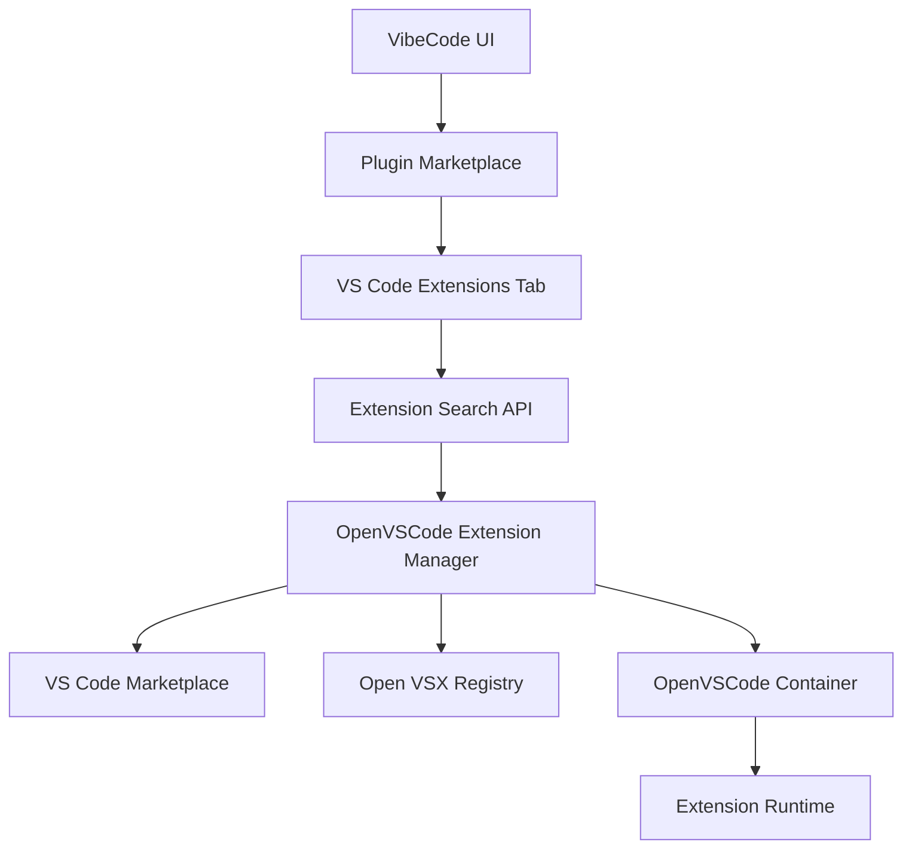
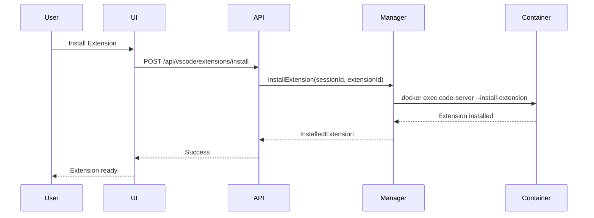

# VS Code Extensions in VibeCode

This guide explains how to use VS Code extensions within VibeCode's OpenVSCode-server integration, enabling full VS Code extension compatibility in your development environment.

## Overview

VibeCode integrates with OpenVSCode-server to provide a complete VS Code experience in the browser. This means you can install and use virtually any VS Code extension from the marketplace, bringing your favorite tools and workflows into VibeCode.

### Key Features

- **Full Extension Compatibility**: Install extensions from VS Code Marketplace or Open VSX Registry
- **Session Persistence**: Extensions persist across session restarts
- **Marketplace Integration**: Browse and install extensions directly from VibeCode UI
- **API-Driven Management**: Programmatically install, enable, disable, and uninstall extensions
- **Version Control**: Manage extension versions and updates
- **Category Filtering**: Discover extensions by category (languages, themes, debuggers, etc.)

## Architecture



### Components

1. **Plugin Marketplace UI** (`/plugins?tab=vscode`): Browse and install extensions
2. **Extension Search API** (`/api/vscode/extensions`): Query marketplace
3. **OpenVSCode Extension Manager** (`src/lib/ide/openvscode-extensions.ts`): Core extension management
4. **OpenVSCode Container**: Runtime environment for extensions

## Getting Started

### Prerequisites

- Running VibeCode instance with OpenVSCode-server enabled
- Active development session
- Network access to extension marketplaces

### Basic Usage

#### 1. Browse Extensions via UI

1. Navigate to **Plugins** in the main menu
2. Click the **VS Code Extensions** tab
3. Search for extensions by name, category, or tag
4. Click **Install** on any extension card
5. Wait for installation to complete
6. Refresh your OpenVSCode session to activate the extension

#### 2. Install Extensions via API

```typescript
// Install an extension
const response = await fetch('/api/vscode/extensions/install', {
  method: 'POST',
  headers: { 'Content-Type': 'application/json' },
  body: JSON.stringify({
    sessionId: 'your-session-id',
    extensionId: 'ms-python.python',
    version: '2023.10.0' // Optional, defaults to latest
  })
});

const result = await response.json();
console.log('Installed:', result.extension);
```

#### 3. List Installed Extensions

```typescript
const response = await fetch('/api/vscode/extensions/installed?sessionId=your-session-id');
const { extensions } = await response.json();

extensions.forEach(ext => {
  console.log(`${ext.displayName} v${ext.version} - ${ext.enabled ? 'Enabled' : 'Disabled'}`);
});
```

## Extension Marketplace

### Searching Extensions

The extension marketplace supports powerful search and filtering:

```typescript
const params = new URLSearchParams({
  query: 'python',           // Search term
  category: 'Programming Languages', // Filter by category
  sortBy: 'installs',        // Sort by: installs, rating, name, publishedDate
  sortOrder: 'desc',         // Order: asc, desc
  pageSize: '20',            // Results per page
  pageNumber: '1'            // Page number
});

const response = await fetch(`/api/vscode/extensions?${params}`);
const { extensions, total } = await response.json();
```

### Available Categories

- **Programming Languages**: Python, JavaScript, TypeScript, Go, Rust, etc.
- **Snippets**: Code snippets and templates
- **Linters**: ESLint, Pylint, etc.
- **Debuggers**: Language-specific debuggers
- **Formatters**: Prettier, Black, etc.
- **Keymaps**: Vim, Emacs, Sublime Text keybindings
- **Themes**: Color themes and icon themes
- **SCM Providers**: Git, SVN, etc.
- **Data Science**: Jupyter, data visualization
- **Testing**: Jest, Pytest, etc.
- **Extension Packs**: Curated extension bundles

### Popular Extensions

| Extension | Publisher | Description | Install Count |
|-----------|-----------|-------------|---------------|
| Python | ms-python | Python IntelliSense, debugging, linting | 50M+ |
| ESLint | dbaeumer | JavaScript/TypeScript linting | 25M+ |
| Prettier | esbenp | Code formatter | 20M+ |
| GitLens | eamodio | Supercharge Git capabilities | 15M+ |
| Docker | ms-azuretools | Docker file support and container management | 12M+ |

## Extension Management

### Installing Extensions

#### Via UI
1. Go to `/plugins?tab=vscode`
2. Search for the extension
3. Click **Install**
4. Extension installs in background

#### Via API
```bash
curl -X POST http://localhost:3000/api/vscode/extensions/install \
  -H "Content-Type: application/json" \
  -d '{
    "sessionId": "abc123",
    "extensionId": "dbaeumer.vscode-eslint"
  }'
```

#### Via OpenVSCode Terminal
```bash
# Inside OpenVSCode container terminal
code-server --install-extension ms-python.python
```

### Uninstalling Extensions

```typescript
await fetch('/api/vscode/extensions/uninstall', {
  method: 'POST',
  headers: { 'Content-Type': 'application/json' },
  body: JSON.stringify({
    sessionId: 'your-session-id',
    extensionId: 'ms-python.python'
  })
});
```

### Enabling/Disabling Extensions

```typescript
// Disable extension
await fetch('/api/vscode/extensions/toggle', {
  method: 'POST',
  headers: { 'Content-Type': 'application/json' },
  body: JSON.stringify({
    sessionId: 'your-session-id',
    extensionId: 'ms-python.python',
    enabled: false
  })
});
```

### Updating Extensions

```typescript
// Update to latest version
await fetch('/api/vscode/extensions/update', {
  method: 'POST',
  headers: { 'Content-Type': 'application/json' },
  body: JSON.stringify({
    sessionId: 'your-session-id',
    extensionId: 'ms-python.python'
  })
});
```

## Extension Sources

VibeCode supports two extension registries:

### 1. VS Code Marketplace

**URL**: https://marketplace.visualstudio.com

The official Microsoft VS Code Marketplace with the largest selection of extensions.

**Pros**:
- Largest extension catalog
- Official Microsoft extensions
- Most up-to-date versions

**Cons**:
- Requires Microsoft account for publishing
- Some restrictions on commercial use

### 2. Open VSX Registry

**URL**: https://open-vsx.org

An open-source alternative to the VS Code Marketplace, vendor-neutral and Eclipse Foundation hosted.

**Pros**:
- Fully open-source
- No vendor lock-in
- Eclipse Foundation governance

**Cons**:
- Smaller extension catalog
- Some extensions may lag behind Marketplace versions

### Fallback Strategy

VibeCode automatically tries multiple sources when installing extensions:

1. Try Open VSX Registry (preferred for open-source)
2. Fall back to VS Code Marketplace if not found
3. Cache successful downloads for faster future installs

## Extension Configuration

Many extensions require configuration. You can configure extensions via:

### 1. OpenVSCode Settings UI

1. Open OpenVSCode session
2. Go to **File** → **Preferences** → **Settings**
3. Search for extension name
4. Modify settings as needed

### 2. settings.json File

Extensions store settings in workspace or user `settings.json`:

```json
{
  "python.defaultInterpreterPath": "/usr/bin/python3",
  "eslint.enable": true,
  "prettier.singleQuote": true,
  "gitlens.currentLine.enabled": false
}
```

### 3. Via API (Future)

```typescript
// Not yet implemented
await fetch('/api/vscode/extensions/configure', {
  method: 'POST',
  body: JSON.stringify({
    sessionId: 'abc123',
    extensionId: 'ms-python.python',
    settings: {
      'python.linting.enabled': true
    }
  })
});
```

## Session-Based Extensions

Extensions in VibeCode are **session-scoped**, meaning:

- Each development session has its own extension set
- Extensions persist within a session across page refreshes
- Different projects can have different extension configurations
- Session cleanup removes extensions when session is deleted

### Session Extension Lifecycle



## API Reference

### GET /api/vscode/extensions

Search for extensions in the marketplace.

**Query Parameters**:
- `query` (string): Search term
- `category` (string): Filter by category
- `sortBy` (string): Sort field (installs, rating, name, publishedDate)
- `sortOrder` (string): asc or desc
- `pageSize` (number): Results per page (default: 20, max: 100)
- `pageNumber` (number): Page number (default: 1)

**Response**:
```json
{
  "success": true,
  "extensions": [
    {
      "id": "ms-python.python",
      "name": "python",
      "displayName": "Python",
      "publisher": "ms-python",
      "version": "2023.10.0",
      "description": "IntelliSense, linting, debugging...",
      "iconUrl": "https://...",
      "rating": 4.5,
      "installCount": 50000000,
      "categories": ["Programming Languages"],
      "tags": ["python", "intellisense"]
    }
  ],
  "total": 156,
  "pageSize": 20,
  "pageNumber": 1
}
```

### POST /api/vscode/extensions/install

Install an extension in a session.

**Request Body**:
```json
{
  "sessionId": "abc123",
  "extensionId": "ms-python.python",
  "version": "2023.10.0"  // Optional
}
```

**Response**:
```json
{
  "success": true,
  "extension": {
    "id": "uuid",
    "extensionId": "ms-python.python",
    "sessionId": "abc123",
    "version": "2023.10.0",
    "installedAt": "2026-02-21T12:00:00Z",
    "enabled": true
  }
}
```

### GET /api/vscode/extensions/installed

List installed extensions for a session.

**Query Parameters**:
- `sessionId` (string, required): Session ID

**Response**:
```json
{
  "success": true,
  "extensions": [...]
}
```

## Best Practices

### 1. Extension Selection

✅ **Do**:
- Install only extensions you actively use
- Check extension ratings and install counts
- Review extension permissions
- Prefer well-maintained extensions with recent updates

❌ **Don't**:
- Install too many extensions (can slow down OpenVSCode)
- Use untrusted or unmaintained extensions
- Ignore extension update notifications

### 2. Performance

- **Limit Extension Count**: Keep installed extensions under 20 for optimal performance
- **Disable Unused Extensions**: Disable rather than uninstall for easy re-enabling
- **Monitor Resource Usage**: Some extensions (like linters) can be CPU-intensive
- **Use Extension Packs**: Install curated packs (e.g., "Python Extension Pack") for related tools

### 3. Security

- **Review Permissions**: Check what extensions can access
- **Use Verified Publishers**: Prefer Microsoft-verified publishers
- **Keep Updated**: Update extensions regularly for security patches
- **Audit Extension Code**: For sensitive projects, review open-source extension code

### 4. Workspace Configuration

Create a `.vscode/extensions.json` in your project to recommend extensions:

```json
{
  "recommendations": [
    "ms-python.python",
    "dbaeumer.vscode-eslint",
    "esbenp.prettier-vscode"
  ],
  "unwantedRecommendations": [
    "ms-vscode.csharp"
  ]
}
```

## Troubleshooting

### Extension Not Installing

**Symptoms**: Installation fails or hangs

**Solutions**:
1. Check network connectivity to marketplace
2. Verify session is running
3. Check container logs: `docker logs <container-name>`
4. Try installing via OpenVSCode terminal: `code-server --install-extension <id>`
5. Clear extension cache and retry

### Extension Not Working

**Symptoms**: Extension installed but features not working

**Solutions**:
1. Reload OpenVSCode window (Command Palette → "Reload Window")
2. Check extension is enabled: Extensions panel → verify checkmark
3. Review extension requirements (e.g., Python extension needs Python installed)
4. Check OpenVSCode console for errors (F12 → Console)
5. Verify extension compatibility with your OpenVSCode version

### Performance Issues

**Symptoms**: OpenVSCode slow or unresponsive

**Solutions**:
1. Disable resource-intensive extensions
2. Check CPU/memory usage in container
3. Reduce number of installed extensions
4. Configure extension settings to reduce processing (e.g., disable auto-formatting)

### Extension Version Conflicts

**Symptoms**: Extension update breaks functionality

**Solutions**:
1. Downgrade to previous version:
   ```bash
   code-server --install-extension publisher.extension@version
   ```
2. Pin extension version in workspace settings
3. Report issue to extension maintainer

### Missing Extension Dependencies

**Symptoms**: Extension reports missing tools (e.g., "Python not found")

**Solutions**:
1. Install required tools in OpenVSCode container:
   ```bash
   # Example: Install Python
   apt-get update && apt-get install -y python3 python3-pip
   ```
2. Configure extension settings to point to correct binary paths
3. Use VibeCode tools management (if available)

## Advanced Usage

### Custom Extension Registries

You can configure custom extension registries for private or self-hosted extensions:

```typescript
// In OpenVSCode Extension Manager configuration
const manager = new OpenVSCodeExtensionManager({
  registries: [
    { url: 'https://custom-registry.company.com', priority: 1 },
    { url: 'https://open-vsx.org/api', priority: 2 },
    { url: 'https://marketplace.visualstudio.com', priority: 3 }
  ]
});
```

### Bulk Extension Management

Install multiple extensions at once:

```bash
#!/bin/bash
# install-extensions.sh

EXTENSIONS=(
  "ms-python.python"
  "dbaeumer.vscode-eslint"
  "esbenp.prettier-vscode"
  "eamodio.gitlens"
)

for ext in "${EXTENSIONS[@]}"; do
  echo "Installing $ext..."
  code-server --install-extension "$ext"
done
```

### Extension Development

To develop your own VS Code extensions for VibeCode:

1. Follow [VS Code Extension API](https://code.visualstudio.com/api) documentation
2. Test in OpenVSCode container
3. Package with `vsce package`
4. Upload to Open VSX Registry or VS Code Marketplace
5. Install in VibeCode via extension ID

See also:
- [VS Code Extension Examples](https://github.com/microsoft/vscode-extension-samples)
- [Extension Anatomy](https://code.visualstudio.com/api/get-started/extension-anatomy)

## Integration with VibeCode Plugins

VibeCode plugins and VS Code extensions complement each other:

| Feature | VibeCode Plugins | VS Code Extensions |
|---------|------------------|-------------------|
| **Scope** | Platform-wide | OpenVSCode sessions only |
| **Language** | TypeScript/JavaScript | TypeScript/JavaScript |
| **API** | VibeCode Plugin API | VS Code Extension API |
| **Installation** | Plugin Marketplace | VS Code Marketplace |
| **Use Cases** | AI models, workflows, integrations | Editor features, language support |

**Example Combinations**:
- VibeCode AI plugin + Python extension = AI-powered Python development
- VibeCode workflow plugin + GitLens = Enhanced Git workflows
- VibeCode integration plugin + Docker extension = Seamless container development

## Future Enhancements

Planned features for VS Code extension integration:

- [ ] **Extension Sync**: Sync extensions across sessions
- [ ] **Workspace Extension Profiles**: Save and restore extension sets per project
- [ ] **Extension Analytics**: Track extension usage and performance
- [ ] **Automated Extension Updates**: Background updates with rollback
- [ ] **Extension Marketplace in VibeCode**: Native extension browsing without leaving VibeCode
- [ ] **Extension Recommendations**: AI-powered extension suggestions based on project type
- [ ] **Private Extension Registry**: Host internal company extensions

## Resources

### Documentation
- [VS Code Extension API](https://code.visualstudio.com/api)
- [OpenVSCode Server](https://github.com/gitpod-io/openvscode-server)
- [Open VSX Registry](https://open-vsx.org/)
- [VibeCode Plugin API](./PLUGIN_API.md)
- [Plugin Marketplace](./PLUGIN_MARKETPLACE.md)

### Extension Marketplaces
- [VS Code Marketplace](https://marketplace.visualstudio.com/vscode)
- [Open VSX Registry](https://open-vsx.org/)

### Community
- [VS Code Extension Development Discord](https://aka.ms/vscode-dev-community)
- [VibeCode Community Forum](https://community.vibecode.com)

## Support

### Getting Help

- **Documentation**: Start with this guide and VS Code Extension API docs
- **Community**: Ask questions in VibeCode Community Forum
- **Issues**: Report bugs at [VibeCode Issues](https://github.com/vibecode/vibecode/issues)
- **Extension Issues**: Report extension-specific issues to extension maintainers

### Contributing

We welcome contributions to improve VS Code extension support:

1. **Report Issues**: Extension compatibility problems
2. **Submit PRs**: Enhancements to extension management
3. **Documentation**: Improve this guide
4. **Testing**: Test extensions in different scenarios

See [CONTRIBUTING.md](../CONTRIBUTING.md) for guidelines.

---

**Last Updated**: 2026-02-21
**VibeCode Version**: 1.0.0
**OpenVSCode Version**: Latest
