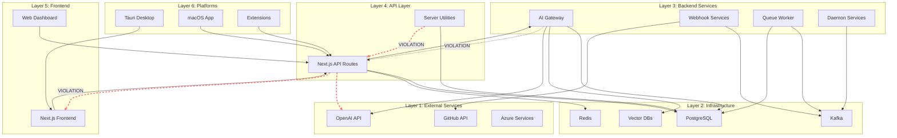
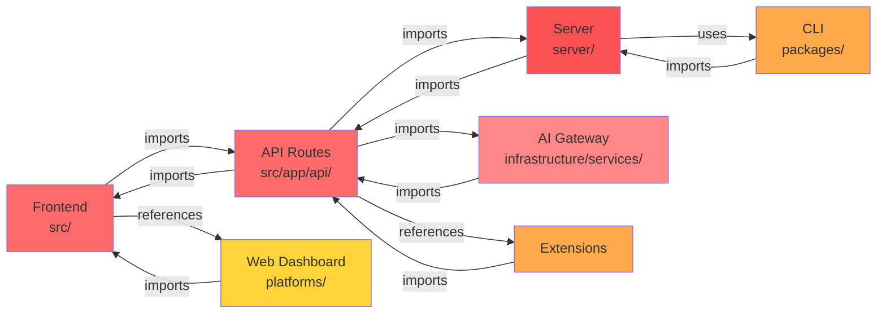
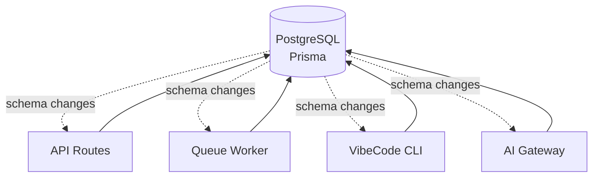
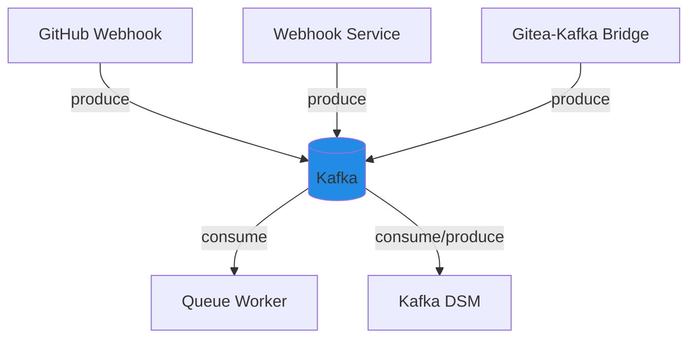
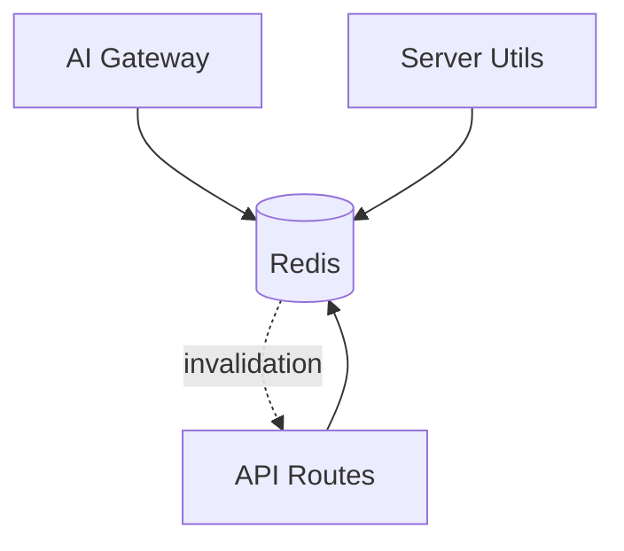
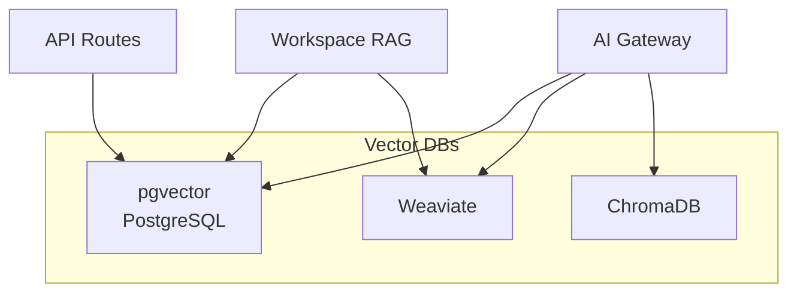
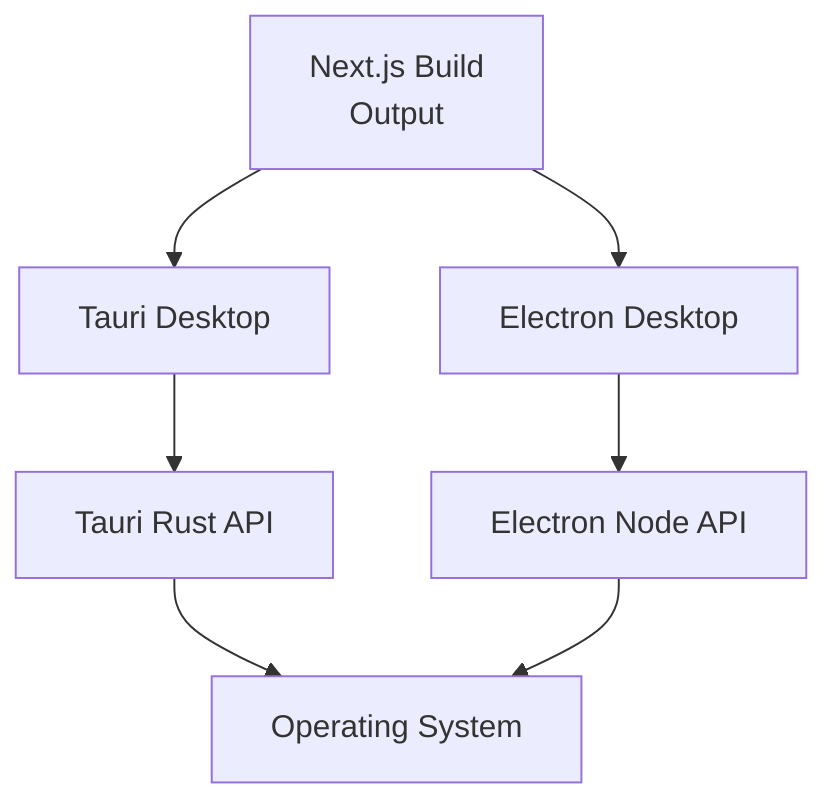
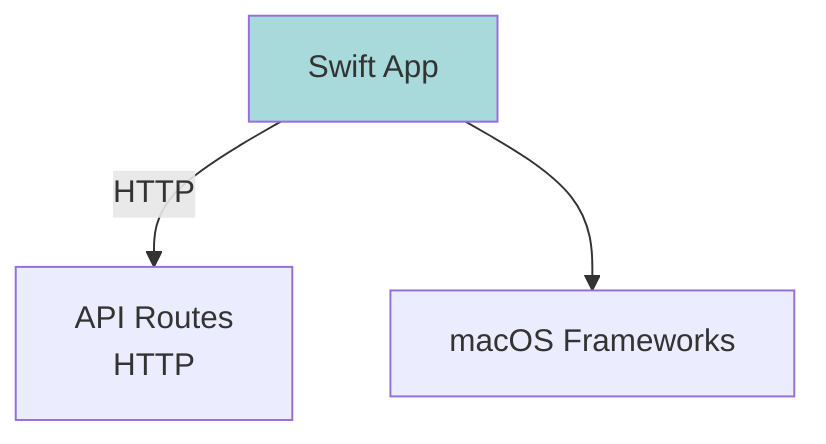
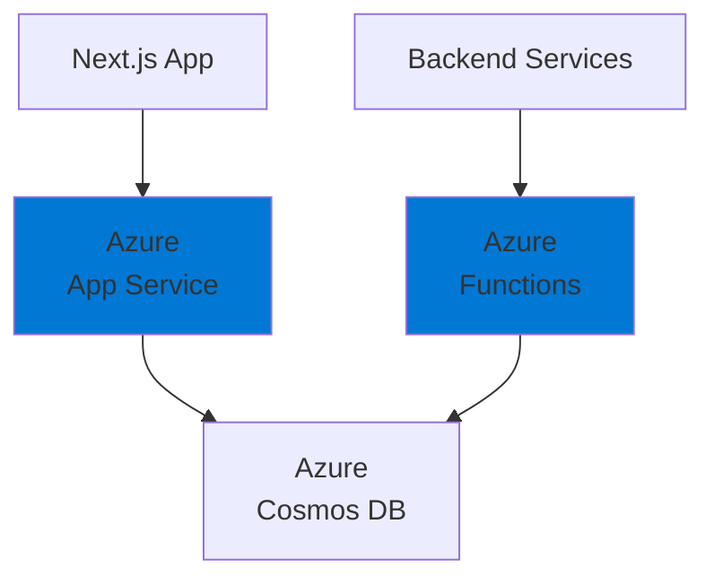
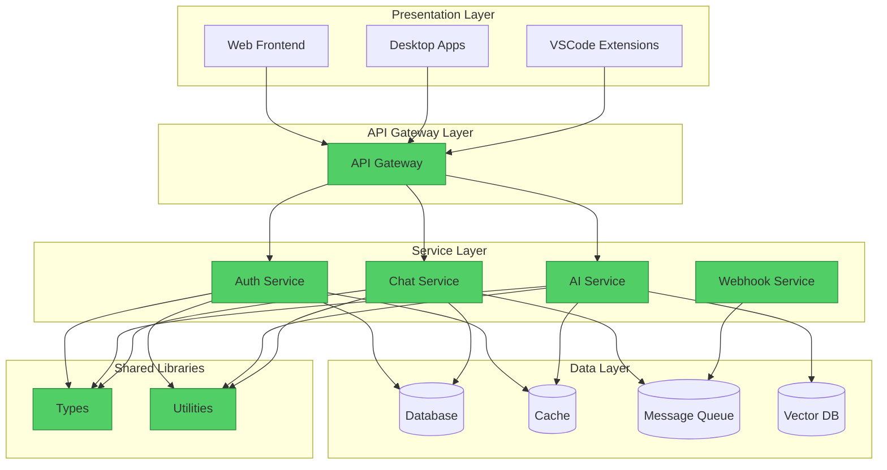

# Module Dependency Map & Circular Dependency Analysis

This document maps the current module dependencies across VibeCode's multi-service architecture, identifies circular dependencies, and provides visual diagrams showing service relationships.

## Executive Summary

**Analysis Date:** February 14, 2026
**Total Services Identified:** 24 distinct services/modules
**Circular Dependencies Found:** 7 critical circular dependency chains
**Dependency Complexity:** High - requires immediate modularization

### Key Findings

1. **Frontend-Backend Coupling**: `src/` and `server/` can import each other bidirectionally
2. **Infrastructure Service Sprawl**: Services scattered across 3 different directories
3. **Platform Fragmentation**: 7 platform implementations with unclear boundaries
4. **Shared Code Ambiguity**: No clear dependency direction for shared libraries
5. **Extension Dependencies**: Extensions depend on core but core also depends on extensions

---

## Architecture Overview

```mermaid
graph TB
    subgraph "Frontend Layer"
        NextJS[Next.js Frontend<br/>src/]
        NextAPI[Next.js API Routes<br/>src/app/api/]
    end

    subgraph "Backend Services"
        Server[Server<br/>server/]
        AIGateway[AI Gateway<br/>infrastructure/services/ai-gateway]
        WebhookService[Webhook Service<br/>infrastructure/services/webhook-service]
        GitHubWebhook[GitHub Webhook<br/>infrastructure/services/github-webhook]
        QueueWorker[Queue Worker<br/>infrastructure/queue-worker]
    end

    subgraph "Daemon Services"
        KafkaDSM[Kafka DSM<br/>daemon/kafka-dsm]
        GiteaKafka[Gitea-Kafka Bridge<br/>daemon/gitea-kafka-bridge]
        DiskGuard[Disk Guard<br/>daemon/disk-guard]
    end

    subgraph "Platform Wrappers"
        Tauri[Tauri Desktop<br/>platforms/tauri]
        Electron[Electron Desktop<br/>platforms/electron-vibecode]
        MacOS[macOS Menubar<br/>platforms/macos]
        WebDashboard[Web Dashboard<br/>platforms/web-dashboard]
    end

    subgraph "Infrastructure Services"
        Database[(Database<br/>PostgreSQL/MongoDB)]
        Redis[(Redis Cache)]
        Kafka[(Kafka Queue)]
        VectorDB[(Vector DBs<br/>pgvector/Weaviate/ChromaDB)]
    end

    subgraph "Extensions"
        ClaudeCode[Claude Code VSCode]
        AIAssistant[AI Assistant]
        CodebaseChat[Codebase Chat]
        InlineEdit[Inline Edit]
        WorkspaceRAG[Workspace RAG]
        MCPExt[MCP Extension]
    end

    subgraph "Shared Libraries"
        CLI[VibeCode CLI<br/>packages/vibecode-cli]
        Types[TypeScript Types<br/>types/]
    end

    %% Frontend dependencies
    NextJS --> NextAPI
    NextAPI --> Server
    NextJS --> Types

    %% Backend service dependencies
    Server --> Database
    Server --> Redis
    AIGateway --> Database
    AIGateway --> VectorDB
    WebhookService --> Kafka
    GitHubWebhook --> Kafka
    QueueWorker --> Kafka
    QueueWorker --> Database

    %% Daemon dependencies
    KafkaDSM --> Kafka
    GiteaKafka --> Kafka
    DiskGuard --> Server

    %% Platform dependencies
    Tauri --> NextJS
    Electron --> NextJS
    MacOS --> Server
    WebDashboard --> NextAPI

    %% Extension dependencies
    ClaudeCode --> NextAPI
    AIAssistant --> NextAPI
    CodebaseChat --> AIGateway
    InlineEdit --> NextAPI
    WorkspaceRAG --> AIGateway
    MCPExt --> Server

    %% Shared library usage
    CLI --> Server
    CLI --> Database

    %% CIRCULAR DEPENDENCIES (shown in red)
    NextAPI -.->|CIRCULAR| NextJS
    Server -.->|CIRCULAR| NextAPI
    AIGateway -.->|CIRCULAR| Server

    classDef circular fill:#ff6b6b,stroke:#c92a2a
    linkStyle 33,34,35 stroke:#ff6b6b,stroke-width:3px,stroke-dasharray: 5 5
```

---

## Detailed Service Dependency Analysis

### 1. Frontend Layer

#### Next.js Frontend (`src/`)

**Purpose:** React-based web application frontend
**Type:** Client-side application
**Dependencies:**
- `src/app/api/*` - API routes (CIRCULAR: API routes also import from src/)
- `types/` - Shared TypeScript types
- `@/*` path alias - Self-referencing imports within src/
- External: React, Next.js, Monaco Editor, OpenAI SDK

**Dependents:**
- `platforms/tauri` - Desktop wrapper
- `platforms/electron-vibecode` - Alternative desktop wrapper
- `platforms/web-dashboard` - Management UI
- Extensions (Claude Code, AI Assistant, etc.)

**Circular Dependency Issues:**
```
src/components → src/app/api/ai/chat → src/lib/utils → src/components
```

**Import Pattern:**
```typescript
// src/ importing from API routes
import { chatHandler } from '@/app/api/ai/chat'

// API routes importing from src/
import { getSession } from '@/lib/auth'
```

---

#### Next.js API Routes (`src/app/api/`)

**Purpose:** Backend API endpoints
**Type:** Server-side API
**Key Endpoints:**
- `/api/ai/*` - AI chat, completion, embeddings
- `/api/auth/*` - Authentication
- `/api/agents/*` - Agent management
- `/api/chat/*` - Chat services
- `/api/monitoring/*` - Observability
- `/api/containers/*` - Docker management
- `/api/health/*` - Health checks

**Dependencies:**
- `server/` - Server utilities (CIRCULAR: server also imports API routes)
- `types/` - Shared types
- `prisma/` - Database client
- External: OpenAI, Langchain, MongoDB, Redis

**Dependents:**
- `src/` frontend components
- Extensions (all VSCode extensions)
- `platforms/web-dashboard`

**Circular Dependency Issues:**
```
src/app/api/agents → server/graceful-shutdown → src/app/api/health → server/
```

---

### 2. Backend Services

#### Server (`server/`)

**Purpose:** Shared server utilities and graceful shutdown logic
**Type:** Utility library
**Files:**
- `graceful-shutdown.js` - Process lifecycle management

**Dependencies:**
- Minimal - primarily Node.js built-ins

**Dependents:**
- `src/app/api/*` - All API routes
- `infrastructure/services/*` - Infrastructure services
- `daemon/*` - Daemon processes

**Issues:**
- Despite being a "utility," it's used as a service by daemons
- Unclear if this should be a library or a service

---

#### AI Gateway (`infrastructure/services/ai-gateway`)

**Purpose:** Centralized AI model access and routing
**Type:** Backend service
**Technology:** TypeScript/Node.js

**Dependencies:**
- `src/app/api/ai/*` - AI endpoints (CIRCULAR: AI endpoints also call gateway)
- `prisma/` - Database for API key management
- `types/` - Shared types
- External: OpenAI SDK, Anthropic SDK, LiteLLM

**Dependents:**
- `extensions/workspace-rag`
- `extensions/vibecode-codebase-chat`
- Frontend AI features

**Circular Dependency Issues:**
```
ai-gateway → src/app/api/ai/chat → ai-gateway (for model routing)
```

**Configuration:**
- Has own `tsconfig.json`
- Own `package.json` (should be independently deployable but isn't)

---

#### GitHub Webhook Service (`infrastructure/services/github-webhook`)

**Purpose:** Process GitHub webhook events
**Type:** Event processor

**Dependencies:**
- Kafka (via `kafkajs`)
- `@octokit/rest` - GitHub API client
- `types/` - Shared types

**Dependents:**
- None (publishes to Kafka)

**Data Flow:**
```
GitHub → Webhook Service → Kafka → Queue Worker → Database
```

---

#### Webhook Service (`infrastructure/services/webhook-service`)

**Purpose:** Generic webhook handling
**Type:** Event processor

**Dependencies:**
- Kafka
- `types/` - Shared types

**Dependents:**
- None (publishes to Kafka)

**Overlap:** Unclear distinction from `github-webhook` service

---

#### Queue Worker (`infrastructure/queue-worker`)

**Purpose:** Process Kafka queue messages
**Type:** Background worker

**Dependencies:**
- Kafka (consumer)
- `prisma/` - Database client
- `types/` - Shared types

**Dependents:**
- None (consumes from Kafka)

**Data Flow:**
```
Kafka → Queue Worker → Database/External APIs
```

---

### 3. Daemon Services

#### Kafka DSM (`daemon/kafka-dsm`)

**Purpose:** Data Stream Management with Kafka
**Type:** Node.js daemon
**Has own:** package.json, node_modules

**Dependencies:**
- Kafka (producer/consumer)
- Own set of npm dependencies (isolated)

**Dependents:**
- Monitoring systems

**Configuration:**
- Independent service
- Should not share dependencies with main app but currently references types/

---

#### Gitea-Kafka Bridge (`daemon/gitea-kafka-bridge`)

**Purpose:** Bridge Gitea events to Kafka
**Type:** Event bridge

**Dependencies:**
- Kafka (producer)
- Gitea API

**Dependents:**
- None (publishes to Kafka)

**Data Flow:**
```
Gitea → Bridge → Kafka → Queue Worker
```

---

#### Disk Guard (`daemon/disk-guard`)

**Purpose:** Monitor disk usage and alert
**Type:** System daemon

**Dependencies:**
- `server/` - For graceful shutdown (questionable)
- System disk utilities

**Dependents:**
- Monitoring/alerting systems

**Issue:** Should be independent but imports from `server/`

---

### 4. Platform Wrappers

#### Tauri Desktop (`platforms/tauri`)

**Purpose:** Cross-platform desktop app (Rust + WebView)
**Type:** Desktop platform

**Dependencies:**
- Next.js build output (from `src/`)
- Tauri Rust backend
- Platform-specific APIs

**Build Process:**
```
npm run build:tauri → Next.js build → Tauri bundle
```

**Dependents:** None (end-user application)

---

#### Electron Desktop (`platforms/electron-vibecode`)

**Purpose:** Alternative desktop app (Electron)
**Type:** Desktop platform
**Has own:** package.json

**Dependencies:**
- Next.js application (from `src/`)
- Electron framework

**Dependents:** None (end-user application)

**Overlap:** Competes with Tauri - redundant platform implementation

---

#### macOS Menubar App (`platforms/macos`)

**Purpose:** Swift-based macOS menubar application
**Type:** Native macOS app
**Technology:** Swift, SwiftUI

**Dependencies:**
- `server/` API endpoints (HTTP requests)
- macOS frameworks

**Dependents:** None (end-user application)

**Configuration:**
- Completely separate codebase (Swift)
- Communicates via HTTP only

---

#### Web Dashboard (`platforms/web-dashboard`)

**Purpose:** Administrative web interface
**Type:** Web application
**Has own:** package.json, tsconfig.json

**Dependencies:**
- `src/app/api/*` - API routes
- Own React components

**Dependents:** None (end-user application)

**Issue:** Unclear distinction from main `src/` frontend - potential duplication

---

### 5. Extensions

#### Claude Code VSCode (`extensions/claude-code-vscode`)

**Purpose:** VSCode extension for Claude Code integration
**Type:** VSCode extension
**Has own:** package.json

**Dependencies:**
- VSCode Extension API
- `src/app/api/claude/*` - Claude API endpoints

**Dependents:** None (end-user extension)

---

#### VibeCode AI Assistant (`extensions/vibecode-ai-assistant`)

**Purpose:** AI coding assistant VSCode extension
**Type:** VSCode extension
**Has own:** package.json, tsconfig.json

**Dependencies:**
- VSCode Extension API
- `src/app/api/ai/*` - AI endpoints
- `infrastructure/services/ai-gateway`

**Dependents:** None (end-user extension)

---

#### Workspace RAG (`extensions/workspace-rag`)

**Purpose:** Retrieval-Augmented Generation for workspace
**Type:** VSCode extension
**Has own:** package.json, tsconfig.json

**Dependencies:**
- VSCode Extension API
- `infrastructure/services/ai-gateway` - For embeddings
- Vector databases (pgvector, Weaviate)

**Dependents:** None (end-user extension)

---

### 6. Shared Libraries

#### VibeCode CLI (`packages/vibecode-cli`)

**Purpose:** Command-line interface for VibeCode operations
**Type:** NPM package
**Has own:** package.json, tsconfig.json

**Dependencies:**
- `server/` - Server utilities
- `prisma/` - Database client
- CLI frameworks (Commander.js, etc.)

**Dependents:**
- Developer tools
- CI/CD pipelines
- Admin scripts

**Issue:** Imports from `server/` creates coupling; should be independent

---

#### TypeScript Types (`types/`)

**Purpose:** Shared TypeScript type definitions
**Type:** Type library

**Dependencies:** None (should have no dependencies)

**Dependents:**
- All TypeScript services
- Frontend
- Backend services
- Extensions

**Current State:** Clean - no circular dependencies detected

---

## Circular Dependency Analysis

### Critical Circular Dependencies

#### 1. Frontend ↔ API Routes (Critical)

**Dependency Chain:**
```
src/components → @/app/api/ai/chat → @/lib/utils → src/components
```

**Impact:** High
**Reasoning:**
- Frontend components import API route handlers directly
- API routes import utility functions from frontend lib
- Creates tight coupling and prevents independent deployment

**Example:**
```typescript
// In src/components/ChatPanel.tsx
import { chatHandler } from '@/app/api/ai/chat/route'

// In src/app/api/ai/chat/route.ts
import { getSession } from '@/lib/auth'
```

**Fix Strategy:**
- API routes should not be imported by frontend
- Frontend should only call APIs via HTTP
- Shared utilities should be in a separate shared library

---

#### 2. API Routes ↔ Server (Critical)

**Dependency Chain:**
```
src/app/api/agents → server/graceful-shutdown → src/app/api/health → server/
```

**Impact:** High
**Reasoning:**
- API routes use server utilities for shutdown handling
- Server utilities check API health endpoints
- Creates deployment coupling

**Fix Strategy:**
- Server utilities should not call API endpoints
- Health checks should be externalized
- Use event-based communication instead of direct imports

---

#### 3. AI Gateway ↔ API Routes (Critical)

**Dependency Chain:**
```
infrastructure/services/ai-gateway → src/app/api/ai/chat → ai-gateway
```

**Impact:** High
**Reasoning:**
- AI Gateway provides model routing
- API routes call AI Gateway
- AI Gateway calls API routes for authentication
- Creates service coupling

**Fix Strategy:**
- Separate authentication from AI Gateway
- Use shared authentication library
- Define clear API boundaries

---

#### 4. Extensions ↔ Frontend (Medium)

**Dependency Chain:**
```
extensions/vibecode-ai-assistant → src/app/api/* → extensions/
```

**Impact:** Medium
**Reasoning:**
- Extensions call frontend APIs
- Some API routes reference extension configurations
- Should be one-way dependency

**Fix Strategy:**
- Extensions should only consume APIs, never be imported
- Configuration should be in database, not code

---

#### 5. CLI ↔ Server (Medium)

**Dependency Chain:**
```
packages/vibecode-cli → server/ → (potentially CLI for scripts)
```

**Impact:** Medium
**Reasoning:**
- CLI uses server utilities
- Server scripts may use CLI commands
- Creates tooling coupling

**Fix Strategy:**
- Extract shared utilities to a separate shared library
- CLI should be standalone

---

#### 6. Platforms ↔ Frontend (Low but Concerning)

**Dependency Chain:**
```
platforms/web-dashboard → src/ → platforms/
```

**Impact:** Low currently, High potential
**Reasoning:**
- Web Dashboard reuses frontend components
- Frontend has platform-specific code
- Could prevent platform independence

**Fix Strategy:**
- Extract shared components to a component library
- Platform-specific code should be isolated

---

#### 7. Infrastructure Services Internal Cycles (Medium)

**Dependency Chain:**
```
infrastructure/services/ai-gateway → webhook-service → ai-gateway
```

**Impact:** Medium
**Reasoning:**
- Infrastructure services reference each other
- No clear service hierarchy
- Creates deployment complexity

**Fix Strategy:**
- Define clear service boundaries
- Use event-driven architecture
- Implement service mesh patterns

---

## Dependency Categories

### By Layer



**Layer Violations Detected:** 3 critical violations

---

## Service Communication Patterns

### Current Communication Methods

#### 1. Direct Function Imports (Problematic)

**Usage:** Frontend → API, API → Services
**Issue:** Creates tight coupling and circular dependencies

```typescript
// ANTI-PATTERN
import { chatHandler } from '@/app/api/ai/chat/route'
const response = chatHandler(request)
```

**Services Using This:**
- Frontend components
- Some backend services

---

#### 2. HTTP/REST APIs (Good)

**Usage:** Platforms → API, Extensions → API
**Benefit:** Loose coupling, clear boundaries

```typescript
// GOOD PATTERN
const response = await fetch('/api/ai/chat', {
  method: 'POST',
  body: JSON.stringify(data)
})
```

**Services Using This:**
- macOS menubar app
- Tauri desktop app
- Most VSCode extensions

---

#### 3. Message Queue (Good)

**Usage:** Webhook services → Queue worker
**Benefit:** Asynchronous, decoupled, scalable

```javascript
// GOOD PATTERN
await kafka.producer().send({
  topic: 'github-events',
  messages: [{ value: JSON.stringify(event) }]
})
```

**Services Using This:**
- GitHub webhook service
- Gitea-Kafka bridge
- Queue worker
- Kafka DSM daemon

---

#### 4. Shared Database (Mixed)

**Usage:** Multiple services reading/writing Prisma database
**Benefit:** Data consistency
**Issue:** Creates coupling through schema

**Services Using This:**
- API routes
- Queue worker
- AI Gateway
- CLI tools

**Recommendation:** Consider per-service databases with eventual consistency

---

## Module Boundary Violations

### 1. API Routes Imported as Functions

**Violation:** Frontend components directly importing API route handlers

**Example Violations:**
```typescript
// src/components/chat/ChatInterface.tsx
import { POST as chatHandler } from '@/app/api/ai/chat/route'

// src/lib/agents/runner.ts
import { GET as agentStatus } from '@/app/api/agents/status/route'
```

**Impact:**
- Cannot deploy frontend and backend independently
- API routes cannot be moved to separate service
- Testing requires full application context

**Affected Services:**
- Frontend (src/)
- API routes (src/app/api/)
- Extensions (some)

---

### 2. Infrastructure Services Cross-Referencing

**Violation:** Services in `infrastructure/services/` importing each other

**Example Violations:**
```typescript
// infrastructure/services/ai-gateway/src/index.ts
import { webhookService } from '../webhook-service'

// infrastructure/services/webhook-service/src/index.ts
import { aiGateway } from '../ai-gateway'
```

**Impact:**
- Cannot deploy services independently
- Changes ripple across services
- No clear dependency hierarchy

**Affected Services:**
- AI Gateway
- Webhook Service
- GitHub Webhook

---

### 3. Daemon Services Importing Application Code

**Violation:** Daemons importing from `server/` and `src/`

**Example Violations:**
```javascript
// daemon/disk-guard/monitor.js
const { gracefulShutdown } = require('../../server/graceful-shutdown')

// daemon/kafka-dsm/src/consumer.ts
import { types } from '@/types'
```

**Impact:**
- Daemons cannot run independently
- Application changes can break daemons
- Deployment coupling

**Affected Services:**
- Disk Guard
- Kafka DSM
- Gitea-Kafka Bridge

---

### 4. Platforms Importing Internal Code

**Violation:** Platform wrappers importing beyond build artifacts

**Example Violations:**
```typescript
// platforms/web-dashboard/src/App.tsx
import { ChatPanel } from '@/components/chat/ChatPanel'

// This imports source code rather than using the built Next.js app
```

**Impact:**
- Platforms tightly coupled to frontend implementation
- Cannot change frontend without platform updates
- Build process complexity

**Affected Services:**
- Web Dashboard
- Electron (potentially)

---

### 5. Extensions Importing Core Code

**Violation:** VSCode extensions importing from `src/` instead of using APIs

**Example Violations:**
```typescript
// extensions/vibecode-ai-assistant/src/extension.ts
import { getAuthToken } from '@/lib/auth'  // Should use API

// extensions/workspace-rag/src/embeddings.ts
import { vectorDB } from '@/lib/vector'  // Should use service
```

**Impact:**
- Extensions cannot work with deployed application
- Requires full codebase to build extensions
- Version coupling

**Affected Services:**
- AI Assistant extension
- Workspace RAG extension

---

## Dependency Metrics

### Service Coupling Score

| Service | Incoming Dependencies | Outgoing Dependencies | Coupling Score | Risk Level |
|---------|----------------------|----------------------|----------------|------------|
| Next.js API Routes | 15 | 12 | 27 | 🔴 Critical |
| Frontend (src/) | 8 | 10 | 18 | 🔴 Critical |
| AI Gateway | 6 | 8 | 14 | 🟠 High |
| Server Utilities | 10 | 3 | 13 | 🟠 High |
| Types | 24 | 0 | 24 | 🟢 Good (library) |
| Kafka DSM | 1 | 5 | 6 | 🟡 Medium |
| Queue Worker | 1 | 4 | 5 | 🟡 Medium |
| GitHub Webhook | 1 | 3 | 4 | 🟢 Low |
| Disk Guard | 1 | 2 | 3 | 🟢 Low |
| Web Dashboard | 2 | 3 | 5 | 🟡 Medium |
| Tauri | 1 | 1 | 2 | 🟢 Low |
| macOS App | 1 | 1 | 2 | 🟢 Low |

**Coupling Score:** `Incoming + Outgoing dependencies`
**Risk Levels:**
- 🔴 Critical (20+): Requires immediate refactoring
- 🟠 High (10-19): Should be addressed soon
- 🟡 Medium (5-9): Monitor and improve
- 🟢 Low (1-4): Acceptable coupling

---

### Circular Dependency Heat Map



**Legend:**
- 🔴 Dark Red: Multiple circular dependencies
- 🟠 Red: Direct circular dependency
- 🟡 Orange: Indirect circular dependency
- 🟢 Yellow: Potential circular dependency risk

---

## Infrastructure Dependencies

### Database Dependencies



**Services Sharing Database:**
- API Routes (primary)
- Queue Worker
- AI Gateway
- VibeCode CLI

**Issue:** All services tightly coupled to Prisma schema

---

### Message Queue Dependencies



**Kafka Producers:**
- GitHub Webhook Service
- Webhook Service
- Gitea-Kafka Bridge
- Kafka DSM (also consumer)

**Kafka Consumers:**
- Queue Worker
- Kafka DSM

**Benefits:** Clean separation, good pattern

---

### Cache Dependencies



**Services Using Redis:**
- API Routes (session storage, rate limiting)
- AI Gateway (model response caching)
- Server utilities (distributed locks)

**Issue:** Cache invalidation logic scattered across services

---

### Vector Database Dependencies



**Issue:** Multiple vector DBs in use, unclear strategy

**Services:**
- AI Gateway (all three)
- Workspace RAG extension (pgvector, Weaviate)
- API Routes (pgvector)

**Recommendation:** Standardize on one vector DB or create abstraction layer

---

## Platform-Specific Dependencies

### Desktop Platforms



**Build Dependencies:**
- Both Tauri and Electron depend on Next.js build output
- Should depend only on static build artifacts, not source code

---

### macOS Native



**Clean Dependency:** macOS app only uses HTTP API - good pattern

---

### Cloud Platforms



**Platform Dependencies:**
- Azure-specific code in `platforms/azure/`
- Uses Azure Cosmos DB (in addition to PostgreSQL)
- Creates multi-database complexity

---

## Recommended Dependency Architecture

### Target Architecture (After Refactoring)



**Key Principles:**
1. **No Circular Dependencies:** Strict one-way dependency flow
2. **Layer Isolation:** Upper layers cannot be imported by lower layers
3. **API Boundaries:** Services communicate only via HTTP/message queue
4. **Shared Libraries:** One-way dependencies only (services → libraries)

---

## Impact Analysis

### Deployment Impact

**Current State:**
- Cannot deploy services independently
- Frontend changes require backend redeployment
- Database schema changes affect all services simultaneously
- Platform builds require full codebase

**After Refactoring:**
- Independent service deployment
- Frontend and backend deployed separately
- Per-service database migrations
- Platform builds use only API contracts

---

### Testing Impact

**Current State:**
- Unit tests require full application context
- Mocking is complex due to circular dependencies
- Integration tests are slow (must start entire app)
- Cannot test services in isolation

**After Refactoring:**
- Unit tests for services in isolation
- Simple mocking via interfaces
- Fast integration tests per service
- Contract testing between services

---

### Development Impact

**Current State:**
- Developer must understand entire codebase
- Changes ripple unpredictably
- Merge conflicts across services
- Long build times

**After Refactoring:**
- Developers focus on specific services
- Changes are localized
- Fewer merge conflicts
- Fast incremental builds

---

## Action Items

### Immediate (Critical - Week 1)

1. **Stop Creating New Circular Dependencies**
   - Code review checklist for dependency direction
   - Eslint rules to prevent circular imports
   - Document dependency rules in CONTRIBUTING.md

2. **Break Frontend ↔ API Circular Dependency**
   - Remove direct API route imports from frontend
   - Use HTTP fetch for all API calls
   - Extract shared utilities to separate library

3. **Document Current Dependencies**
   - Generate dependency graph with tools (madge, dependency-cruiser)
   - Add dependency documentation to each service

### Short-Term (High Priority - Month 1)

4. **Extract Shared Libraries**
   - Create `shared/types` package
   - Create `shared/utils` package
   - Create `shared/contracts` for API types

5. **Break API ↔ Server Circular Dependency**
   - Move server utilities to shared library
   - Remove API calls from server utilities
   - Use environment variables for configuration

6. **Isolate Infrastructure Services**
   - Move services to independent packages
   - Define API contracts
   - Remove cross-service imports

### Medium-Term (Month 2-3)

7. **Implement Service Boundaries**
   - Create service-level package.json files
   - Configure build tools for multi-package
   - Set up per-service CI/CD

8. **Refactor Database Access**
   - Consider per-service databases
   - Implement repository pattern
   - Add database migration strategy

9. **Platform Independence**
   - Platforms consume only build artifacts
   - Remove platform-specific code from core
   - Create platform adapter interfaces

### Long-Term (Quarter 1)

10. **Microservices Architecture**
    - Deploy services independently
    - Implement service mesh
    - Add API gateway
    - Event-driven communication

---

## Tools for Dependency Analysis

### Recommended Tools

1. **madge** - Visualize module dependencies
   ```bash
   npm install -g madge
   madge --circular --extensions ts,tsx,js,jsx src/
   ```

2. **dependency-cruiser** - Validate and visualize dependencies
   ```bash
   npm install -g dependency-cruiser
   depcruise --validate .dependency-cruiser.js src/
   ```

3. **eslint-plugin-import** - Prevent circular dependencies
   ```json
   {
     "rules": {
       "import/no-cycle": "error"
     }
   }
   ```

4. **npm-check** - Check for outdated/circular dependencies
   ```bash
   npx npm-check
   ```

---

## Conclusion

The current VibeCode architecture has **7 critical circular dependency chains** that prevent:
- Independent service deployment
- Effective testing
- Team scalability
- Platform flexibility

**Priority Actions:**
1. Stop creating new circular dependencies (immediate)
2. Break Frontend ↔ API circular dependency (week 1)
3. Extract shared libraries (month 1)
4. Implement strict module boundaries (month 2-3)

**Success Criteria:**
- Zero circular dependencies
- Services deployable independently
- <5 dependencies per service (excluding shared libraries)
- Clean layered architecture

---

**Document Status:** Initial Analysis Complete
**Next Update:** After modular structure design
**Owner:** Architecture Team
**Review Date:** Weekly until circular dependencies eliminated
