# Agent Orchestration Architecture
**Multi-Agent Framework & Coordination System**

**Version:** 1.0
**Date:** February 28, 2026
**Status:** Production

---

## Table of Contents

1. [Overview](#overview)
2. [Agent Framework Architecture](#agent-framework-architecture)
3. [Multi-Agent Coordination System](#multi-agent-coordination-system)
4. [Auto-Claude Orchestration](#auto-claude-orchestration)
5. [Agent Task Management](#agent-task-management)
6. [Communication Patterns](#communication-patterns)
7. [Memory & State Management](#memory--state-management)
8. [Tool & Capability System](#tool--capability-system)
9. [Integration Points](#integration-points)
10. [Security & Isolation](#security--isolation)

---

## Overview

The VibeCode platform implements a sophisticated multi-agent orchestration system that enables parallel task execution, autonomous agent coordination, and intelligent workflow management. The system consists of two primary orchestration layers:

1. **`.agents/` Framework** - Manual multi-agent coordination for complex project tasks
2. **`.auto-claude/` System** - Automated task orchestration with Claude Code integration

### Key Capabilities

- **Parallel Agent Execution** - Run multiple specialized agents simultaneously
- **Dependency Management** - Track and enforce task dependencies
- **Conflict Prevention** - Spatial and temporal separation of agent work
- **Memory Persistence** - Agent memory, beliefs, and learning across sessions
- **Tool Integration** - Unified tool framework for agent capabilities
- **Event-Driven Coordination** - Kafka-based agent communication

---

## Agent Framework Architecture

### High-Level Architecture

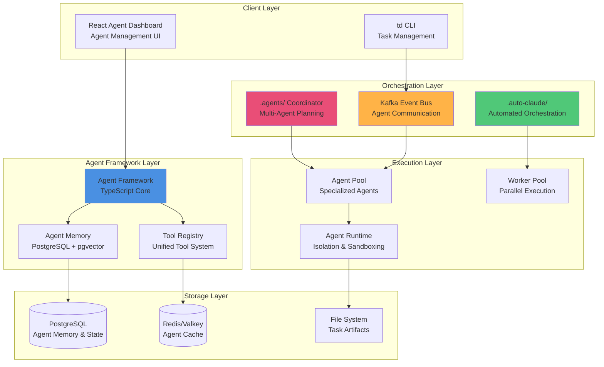

### Agent Framework Components

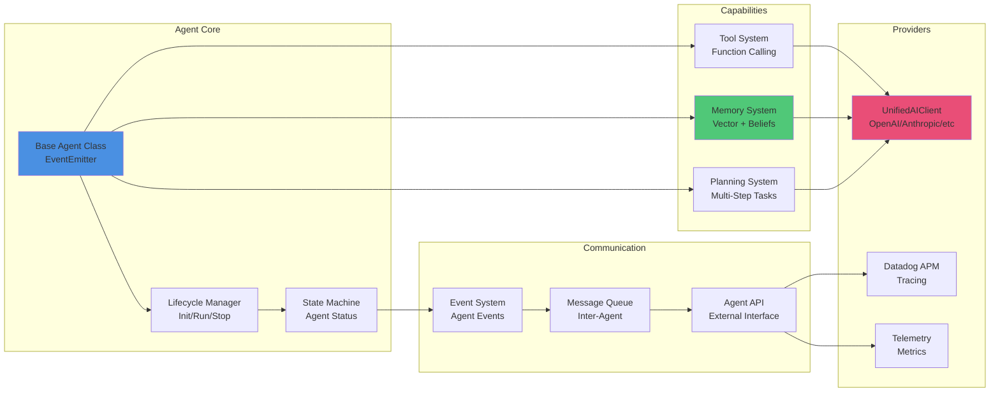

---

## Multi-Agent Coordination System

### .agents/ Directory Structure

The `.agents/` directory provides manual coordination for complex multi-agent projects:

```
.agents/
├── README.md                    # Agent assignment overview
├── COORDINATION.md              # Dependency graph & execution order
└── tasks/
    ├── agent-1-*.md            # Agent 1 task specification
    ├── agent-2-*.md            # Agent 2 task specification
    └── ...                     # Additional agent tasks
```

### Coordination Flow

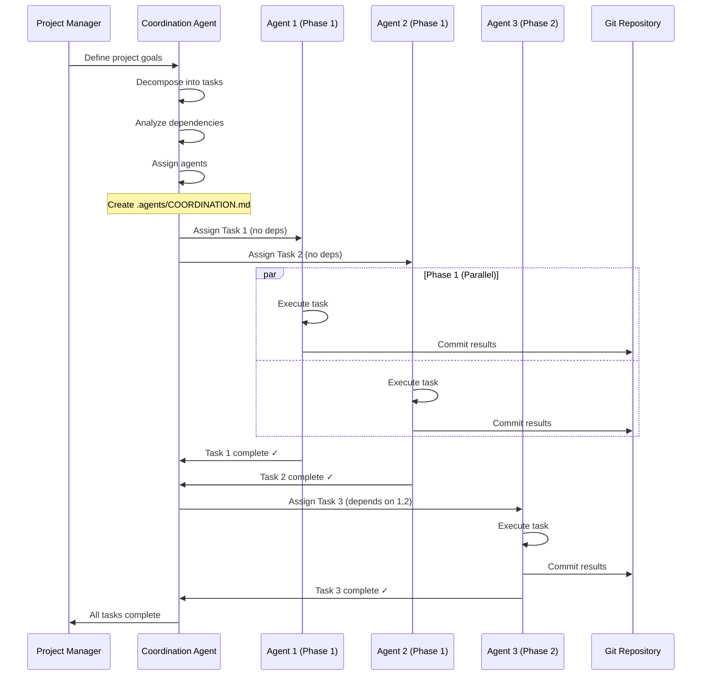

### Agent Specialization Types

| Agent Type | Domain | Typical Tasks | Tool Access |
|------------|--------|---------------|-------------|
| **quality-engineer** | Testing & QA | Test migration, coverage analysis | Jest, Playwright, testing tools |
| **security-engineer** | Security & Auth | Security hardening, auth flows | Security scanners, audit tools |
| **technical-writer** | Documentation | API docs, guides, tutorials | Markdown, diagram tools |
| **devops-architect** | Infrastructure | Docker, Kubernetes, CI/CD | kubectl, docker, terraform |
| **frontend-architect** | UI/UX | React components, styling | Browser tools, bundlers |
| **performance-engineer** | Optimization | Profiling, optimization | Datadog, profilers |
| **refactoring-expert** | Code Quality | Refactoring, linting | AST tools, linters |
| **system-architect** | System Design | Architecture, patterns | Design tools, planners |
| **python-expert** | Type Safety | Strong typing, validation | mypy, pylint, TypeScript |

### Dependency Management

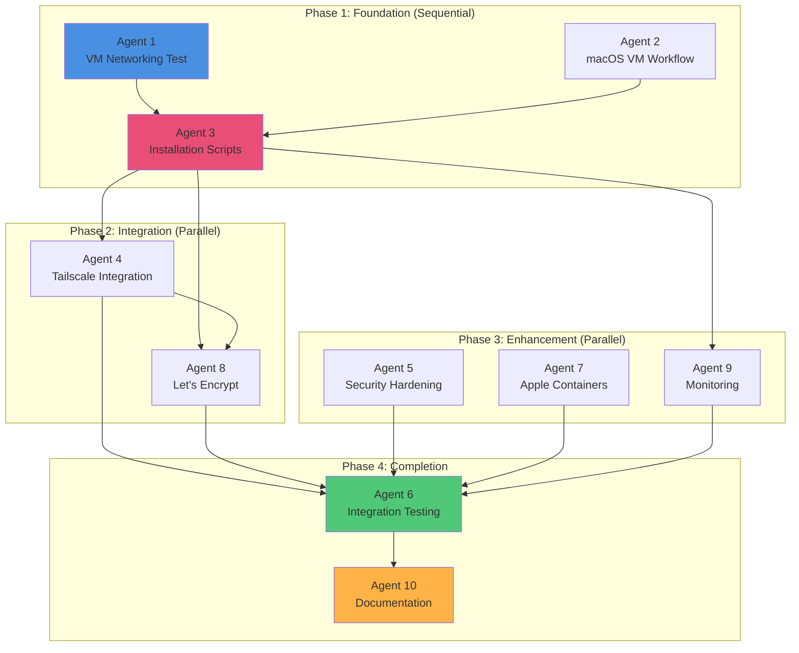

---

## Auto-Claude Orchestration

### .auto-claude/ Directory Structure

The `.auto-claude/` system provides automated task orchestration:

```
.auto-claude/
├── specs/
│   └── {task-id}/
│       ├── spec.md                 # Task specification
│       ├── implementation_plan.json # Execution plan
│       ├── context.json            # Task context
│       ├── build-progress.txt      # Progress tracking
│       ├── task_metadata.json      # Metadata
│       ├── task_logs.json          # Execution logs
│       └── memory/
│           ├── build_commits.json  # Commit history
│           └── attempt_history.json # Retry tracking
└── worktrees/
    └── tasks/
        └── {task-id}/              # Isolated git worktree
```

### Auto-Claude Architecture

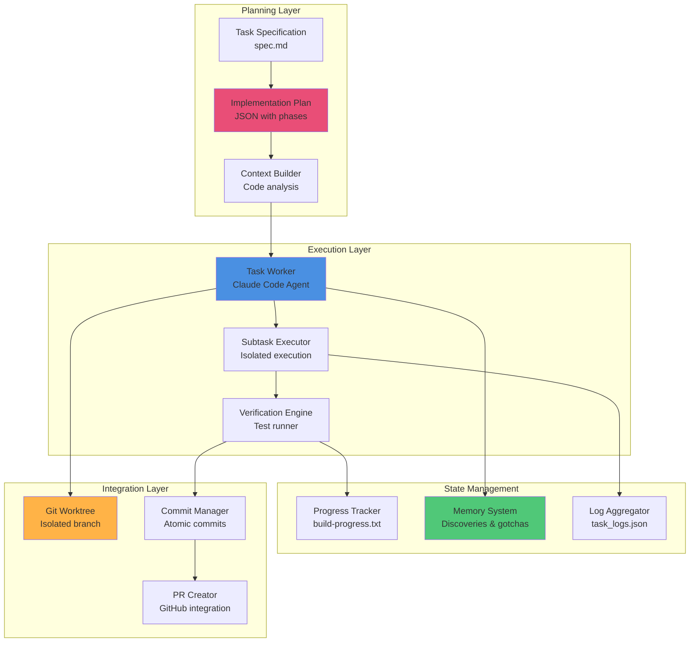

### Task Workflow

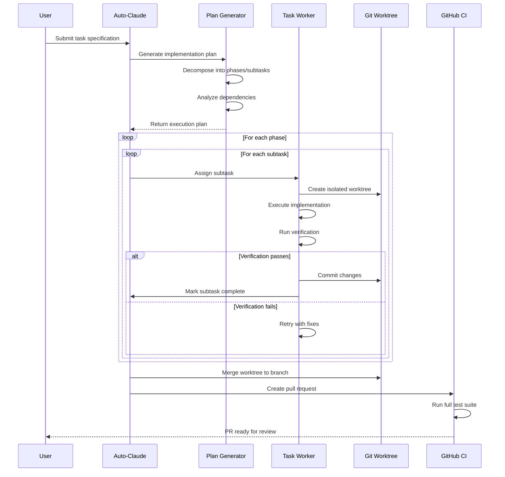

### Implementation Plan Structure

```json
{
  "feature": "Task description",
  "workflow_type": "simple|complex",
  "phases": [
    {
      "id": "phase-1",
      "name": "Phase Name",
      "type": "implementation|verification",
      "depends_on": [],
      "parallel_safe": true,
      "subtasks": [
        {
          "id": "subtask-1-1",
          "description": "Task description",
          "service": "rig|docs|td|etc",
          "files_to_modify": [],
          "files_to_create": [],
          "patterns_from": [],
          "verification": {
            "type": "manual|command",
            "instructions": "Verification steps"
          },
          "status": "pending|in_progress|completed"
        }
      ]
    }
  ],
  "summary": {
    "total_phases": 3,
    "total_subtasks": 8,
    "services_involved": ["rig", "docs"],
    "parallelism": {
      "max_parallel_phases": 2,
      "recommended_workers": 1
    }
  }
}
```

---

## Agent Task Management

### Task Lifecycle

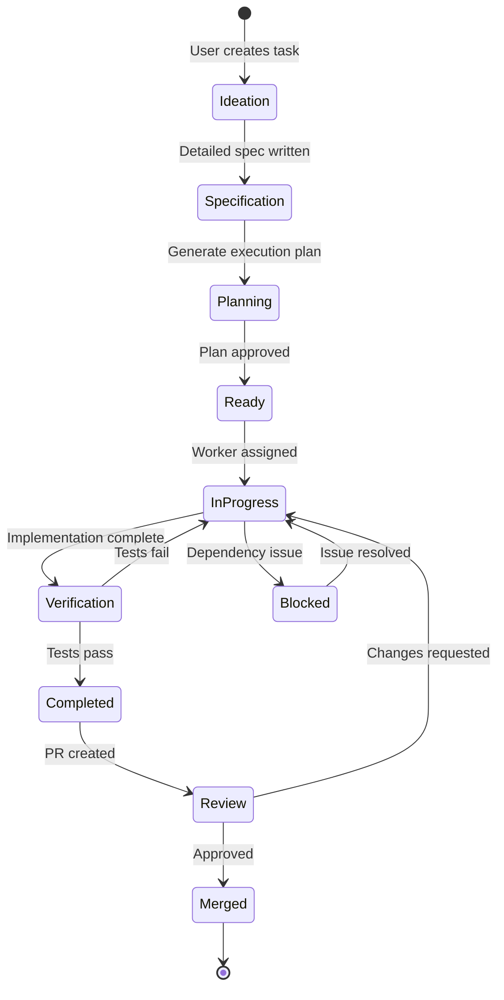

### Task Metadata Schema

Stored in `.auto-claude/specs/{task-id}/task_metadata.json`:

```typescript
interface TaskMetadata {
  task_id: string;
  title: string;
  created_at: string;
  updated_at: string;
  status: 'pending' | 'in_progress' | 'blocked' | 'completed';
  assigned_worker?: string;
  priority: 'low' | 'medium' | 'high' | 'critical';
  dependencies: string[];
  labels: string[];
  estimated_hours?: number;
  actual_hours?: number;
}
```

### Memory & Discovery System

Auto-Claude agents maintain persistent memory:

```typescript
// Record codebase discoveries
interface Discovery {
  file_path: string;
  description: string;
  category: 'architecture' | 'pattern' | 'config' | 'gotcha';
  discovered_at: string;
}

// Record gotchas and pitfalls
interface Gotcha {
  gotcha: string;
  context: string;
  recorded_at: string;
}

// Build commits tracking
interface BuildCommit {
  commit_hash: string;
  message: string;
  files_changed: string[];
  timestamp: string;
  subtask_id: string;
}
```

---

## Communication Patterns

### Kafka-Based Agent Communication

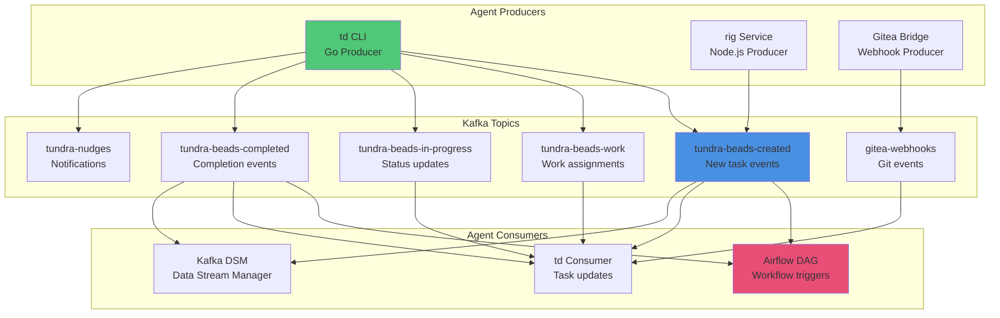

### Event-Driven Coordination

**Kafka Topics for Agent Orchestration:**

| Topic | Producer | Consumer | Purpose |
|-------|----------|----------|---------|
| `tundra-beads-created` | td, rig | airflow, td | New task/agent creation |
| `tundra-beads-work` | td | td, airflow | Work assignment events |
| `tundra-beads-in-progress` | td | td | Agent status updates |
| `tundra-beads-completed` | td | td, airflow | Task completion events |
| `tundra-nudges` | td | td | Agent notifications |
| `gitea-webhooks` | gitea-bridge | td | Git repository events |

### Inter-Agent Message Format

```typescript
interface AgentMessage {
  id: string;
  timestamp: string;
  source_agent: string;
  target_agent?: string; // null for broadcast
  type: 'task' | 'status' | 'result' | 'error' | 'coordinate';
  payload: {
    task_id?: string;
    status?: string;
    data?: any;
    error?: string;
  };
  metadata: {
    priority: number;
    ttl?: number;
    requires_ack: boolean;
  };
}
```

---

## Memory & State Management

### Agent Memory Architecture

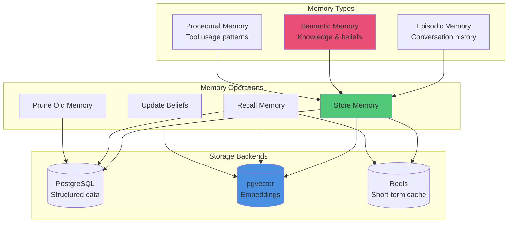

### PostgreSQL Schema for Agent Memory

```sql
-- Agent memory storage
CREATE TABLE agent_memory (
  id SERIAL PRIMARY KEY,
  agent_id VARCHAR(255) NOT NULL,
  memory_type VARCHAR(50) NOT NULL, -- 'episodic', 'semantic', 'procedural'
  content TEXT NOT NULL,
  embedding vector(1536), -- pgvector for similarity search
  metadata JSONB,
  created_at TIMESTAMP DEFAULT NOW(),
  accessed_at TIMESTAMP DEFAULT NOW(),
  access_count INTEGER DEFAULT 0
);

-- Agent beliefs and knowledge
CREATE TABLE agent_beliefs (
  id SERIAL PRIMARY KEY,
  agent_id VARCHAR(255) NOT NULL,
  belief_key VARCHAR(255) NOT NULL,
  belief_value JSONB NOT NULL,
  confidence DECIMAL(3,2), -- 0.00 to 1.00
  source VARCHAR(255),
  created_at TIMESTAMP DEFAULT NOW(),
  updated_at TIMESTAMP DEFAULT NOW(),
  UNIQUE(agent_id, belief_key)
);

-- Agent sessions and state
CREATE TABLE agent_sessions (
  id SERIAL PRIMARY KEY,
  agent_id VARCHAR(255) NOT NULL,
  session_id VARCHAR(255) UNIQUE NOT NULL,
  state JSONB NOT NULL,
  started_at TIMESTAMP DEFAULT NOW(),
  ended_at TIMESTAMP,
  status VARCHAR(50) DEFAULT 'active'
);
```

### Memory Retrieval Patterns

**Similarity Search:**
```sql
-- Find similar memories using vector embeddings
SELECT content, metadata, 1 - (embedding <=> $1::vector) as similarity
FROM agent_memory
WHERE agent_id = $2 AND memory_type = $3
ORDER BY embedding <=> $1::vector
LIMIT 10;
```

**Temporal Retrieval:**
```sql
-- Get recent episodic memories
SELECT content, metadata, created_at
FROM agent_memory
WHERE agent_id = $1 AND memory_type = 'episodic'
ORDER BY created_at DESC
LIMIT 20;
```

---

## Tool & Capability System

### Unified Tool Framework

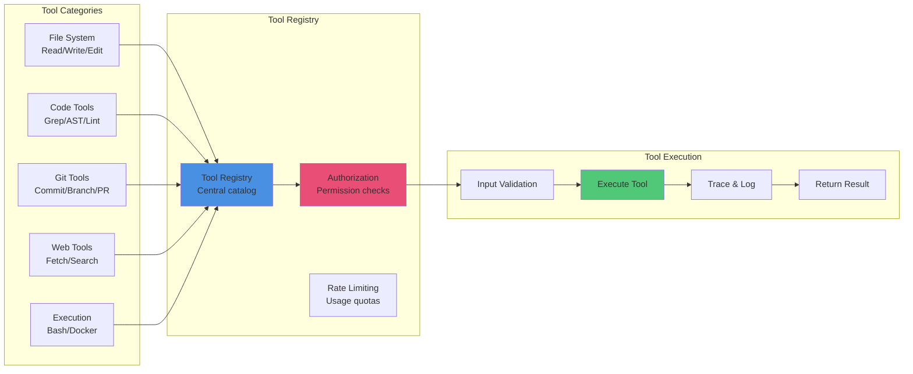

### Tool Definition Schema

```typescript
interface ToolDefinition {
  name: string;
  description: string;
  category: 'filesystem' | 'code' | 'git' | 'web' | 'execution';
  parameters: {
    [key: string]: {
      type: string;
      description: string;
      required: boolean;
      default?: any;
    };
  };
  execute: (params: Record<string, any>) => Promise<ToolResult>;
  permissions: string[];
  rateLimit?: {
    maxCalls: number;
    windowMs: number;
  };
}

interface ToolResult {
  success: boolean;
  data?: any;
  error?: string;
  metadata?: {
    executionTime: number;
    tokensUsed?: number;
  };
}
```

### Agent Tool Access Matrix

| Tool | quality-engineer | security-engineer | devops-architect | technical-writer |
|------|------------------|-------------------|------------------|------------------|
| **Read** | ✓ | ✓ | ✓ | ✓ |
| **Write** | ✓ | ✓ | ✓ | ✓ |
| **Edit** | ✓ | ✓ | ✓ | ✓ |
| **Bash** | ✓ | ✓ | ✓ | ✗ |
| **Git** | ✓ | ✓ | ✓ | ✓ |
| **Docker** | ✗ | ✓ | ✓ | ✗ |
| **Kubectl** | ✗ | ✓ | ✓ | ✗ |
| **WebFetch** | ✓ | ✓ | ✓ | ✓ |

---

## Integration Points

### Platform Integration Architecture

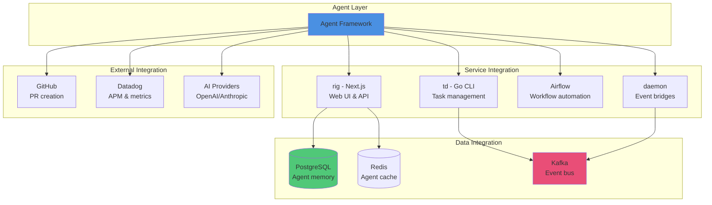

### API Endpoints

**Agent Management API (rig):**

```typescript
// Create new agent
POST /api/agents
{
  "type": "quality-engineer",
  "task": "Test migration",
  "config": { ... }
}

// Get agent status
GET /api/agents/:agentId

// List active agents
GET /api/agents?status=active

// Update agent configuration
PATCH /api/agents/:agentId

// Terminate agent
DELETE /api/agents/:agentId
```

**Task Management API (td CLI):**

```bash
# Create new task/bead
td create "Task description"

# Assign task to agent
td assign <bead-id> --agent=agent-1

# Check task status
td status <bead-id>

# Complete task
td complete <bead-id>

# Monitor Kafka events
td kafka status
```

---

## Security & Isolation

### Agent Isolation Architecture

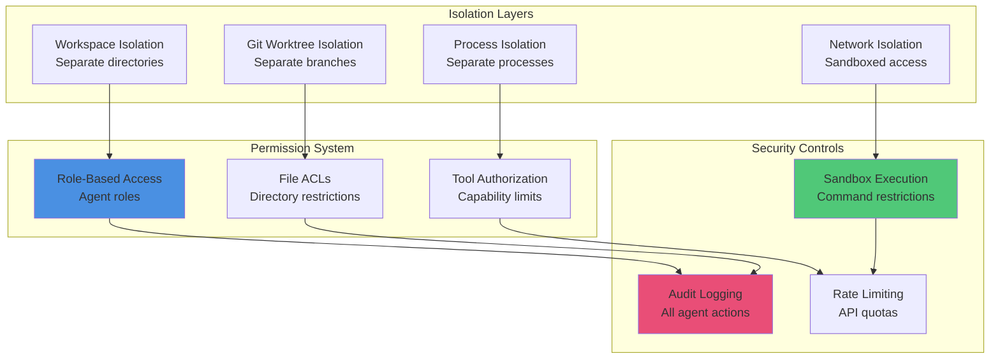

### Security Best Practices

**1. Workspace Isolation**
- Each agent operates in isolated `.auto-claude/worktrees/tasks/{task-id}/` directory
- Git worktrees prevent branch conflicts
- File system permissions enforce directory boundaries

**2. Permission Model**
```typescript
interface AgentPermissions {
  allowedTools: string[];
  allowedPaths: string[];
  allowedBashCommands: string[];
  maxFileSize: number;
  maxExecutionTime: number;
  networkAccess: 'none' | 'limited' | 'full';
}
```

**3. Audit Trail**
- All agent actions logged to `.auto-claude/specs/{task-id}/task_logs.json`
- Git commits signed with agent identity
- Tool usage tracked in Datadog APM

**4. Secrets Management**
- API keys stored in environment variables or macOS Keychain
- Never commit secrets to git
- Auto-detect and prevent secret leakage

**5. Command Sandboxing**
```typescript
// Bash command restrictions
const DANGEROUS_COMMANDS = [
  'rm -rf /',
  'dd if=/dev/zero',
  'fork bomb',
  ':(){ :|:& };:',
];

// Validate before execution
function validateCommand(cmd: string): boolean {
  return !DANGEROUS_COMMANDS.some(danger => cmd.includes(danger));
}
```

---

## Related Documentation

- [Multi-Agent Coordination Methodology](../wiki/guides/multi-agent-coordination.md)
- [Service Dependencies Map](../../SERVICE_DEPENDENCIES.md)
- [Architecture Diagram](../ARCHITECTURE_DIAGRAM.md)
- [Folder Structure](../FOLDER_STRUCTURE.md)

---

## Revision History

| Version | Date | Changes |
|---------|------|---------|
| 1.0 | 2026-02-28 | Initial architecture documentation |

---

**Maintained by:** Platform Architecture Team
**Last Reviewed:** February 28, 2026
