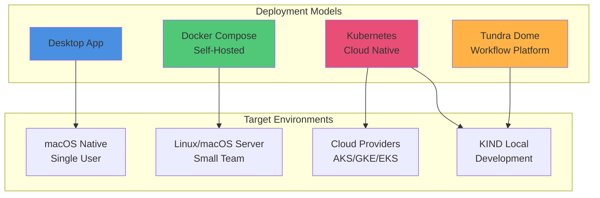
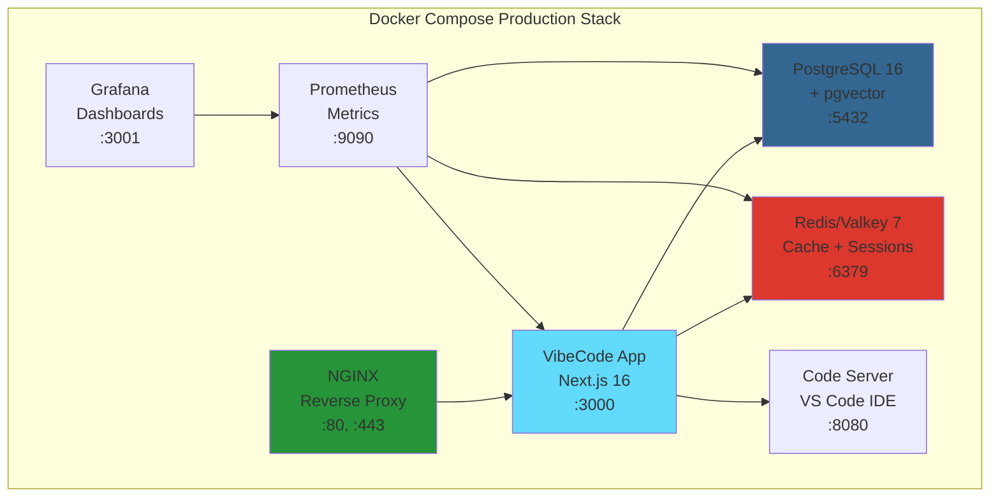
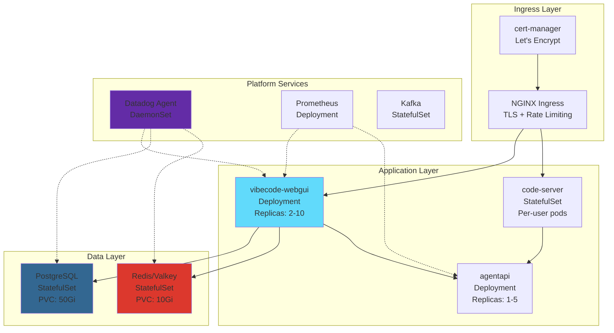
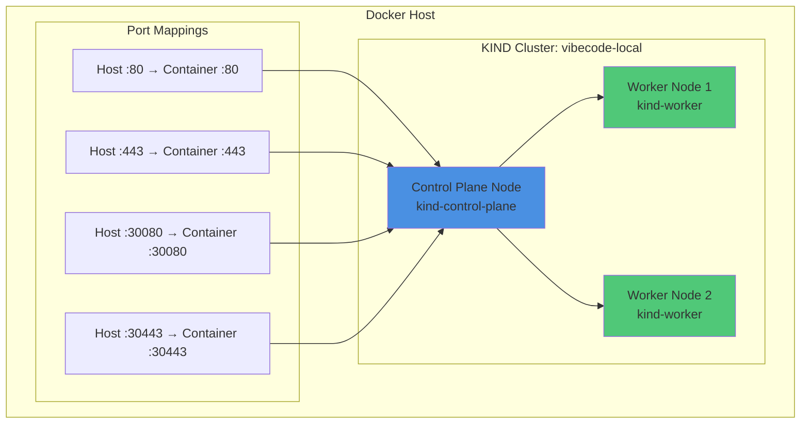
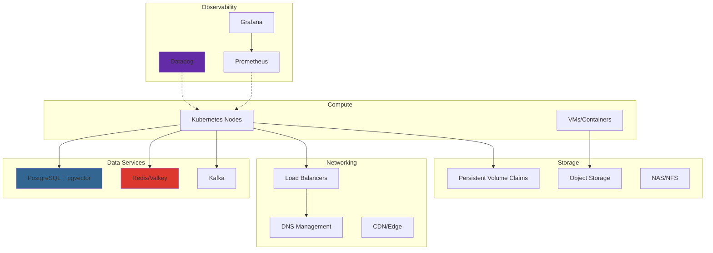
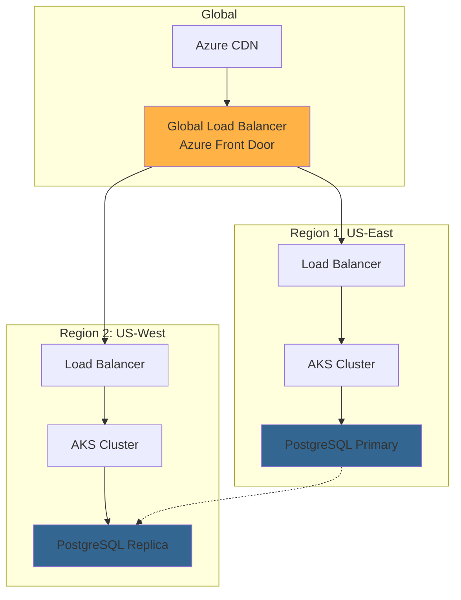

# VibeCode Deployment Architecture
**Complete Deployment Architecture with Infrastructure Details**

**Version:** 1.0
**Date:** February 28, 2026
**Status:** Production Ready

---

## Table of Contents

1. [Deployment Models Overview](#deployment-models-overview)
2. [Docker Compose Deployments](#docker-compose-deployments)
3. [Kubernetes Architecture](#kubernetes-architecture)
4. [KIND (Kubernetes in Docker)](#kind-kubernetes-in-docker)
5. [Helm Charts](#helm-charts)
6. [Infrastructure Components](#infrastructure-components)
7. [Deployment Patterns](#deployment-patterns)
8. [Scaling and High Availability](#scaling-and-high-availability)
9. [Security Configuration](#security-configuration)
10. [Monitoring and Observability](#monitoring-and-observability)

---

## Deployment Models Overview

VibeCode supports four primary deployment models, each optimized for specific use cases:



### Deployment Model Comparison

| Model | Use Case | Users | Infrastructure | Complexity |
|-------|----------|-------|----------------|------------|
| **Desktop App** | Individual developers | 1 | macOS native | Low |
| **Docker Compose** | Small teams, self-hosted | 1-50 | Docker + Docker Compose | Medium |
| **Kubernetes** | Enterprise, cloud-native | 50+ | K8s cluster (AKS/GKE/EKS) | High |
| **Tundra Dome** | Workflow automation platform | N/A | KIND cluster | High |

---

## Docker Compose Deployments

### Production Stack Overview



### Available Docker Compose Configurations

| Configuration File | Purpose | Services Included |
|-------------------|---------|-------------------|
| `docker-compose.prod.yml` | Production deployment | App, Valkey, Dropbear SSH |
| `docker-compose.production.yml` | Full production stack | App, PostgreSQL, Redis, NGINX, Code Server, Prometheus |
| `docker-compose.production.enhanced.yml` | Enhanced production with monitoring | All production + Grafana, Alertmanager |
| `docker-compose.dev.yml` | Development environment | App, PostgreSQL, Redis, dev tools |
| `docker-compose.test.yml` | Testing environment | App, test databases, mock services |
| `docker-compose.multiarch.yml` | Multi-architecture builds | ARM64 + AMD64 builds |
| `docker-compose.pgvector.yml` | PostgreSQL with vector extensions | PostgreSQL 16 + pgvector |
| `docker-compose.litellm.yml` | LiteLLM AI gateway | LiteLLM proxy, PostgreSQL, Redis |
| `docker-compose.ai-gateway.yml` | AI Gateway service | AI Gateway, rate limiting, caching |
| `docker-compose.code-server.yml` | Code Server standalone | Code Server IDE |

### Production Docker Compose Architecture

**File:** `config/docker/docker-compose.production.yml`

```yaml
# Key Service Definitions

services:
  vibecode-app:
    - Port: 3000
    - Health check: /api/health
    - Depends on: PostgreSQL, Redis
    - Volumes: uploads, rag-data, conversations
    - Environment: Production with Datadog APM

  postgres:
    - Image: pgvector/pgvector:pg16
    - Port: 5432
    - Volumes: postgres-data (persistent)
    - Extensions: pgvector for embeddings
    - Health check: pg_isready

  redis:
    - Image: redis:7-alpine
    - Port: 6379
    - Persistence: appendonly yes
    - Policy: allkeys-lru (256MB max)

  nginx:
    - Ports: 80, 443
    - SSL/TLS termination
    - Reverse proxy to app
    - Static file serving

  code-server:
    - Port: 8080
    - Password authentication
    - Project workspace mounting
```

### Starting a Production Deployment

```bash
# Set environment variables
export NEXTAUTH_SECRET="your-secret-key"
export POSTGRES_PASSWORD="secure-password"
export CODE_SERVER_PASSWORD="secure-password"

# Start production stack
docker-compose -f config/docker/docker-compose.production.yml up -d

# Verify services
docker-compose -f config/docker/docker-compose.production.yml ps

# View logs
docker-compose -f config/docker/docker-compose.production.yml logs -f vibecode-app

# Health checks
curl http://localhost:3000/api/health
```

### Volume Management

```yaml
volumes:
  postgres-data:
    driver: local
    driver_opts:
      type: none
      o: bind
      device: /data/postgres

  redis-data:
    driver: local

  uploads:
    driver: local
    driver_opts:
      type: none
      o: bind
      device: /data/uploads

  rag-data:
    driver: local

  conversations:
    driver: local

  code-projects:
    driver: local

  code-config:
    driver: local
```

---

## Kubernetes Architecture

### Kubernetes Deployment Overview



### Kubernetes Manifest Structure

The Kubernetes manifests are organized in a numbered, deployment-order structure:

```
platforms/kubernetes/k8s/
├── agentapi/                    # Agent API service
│   ├── 00-namespace.yaml        # Namespace definition
│   ├── 01-configmap.yaml        # Configuration
│   ├── 02-secrets.yaml          # Sensitive data
│   ├── 03-service.yaml          # Service definition
│   ├── 04-deployment.yaml       # Main deployment
│   ├── 05-hpa.yaml              # Horizontal Pod Autoscaler
│   ├── 06-pvc.yaml              # Persistent Volume Claims
│   ├── 07-networkpolicy.yaml   # Network policies
│   ├── 08-pdb.yaml              # Pod Disruption Budget
│   └── 09-priorityclass.yaml   # Priority class
│
├── agents/                      # AI agents platform
│   ├── base/                    # Base Kustomize resources
│   ├── charts/                  # Helm charts
│   └── overlays/                # Environment overlays (dev/staging/prod)
│
├── datadog/                     # Datadog monitoring
│   ├── datadog-agent.yaml       # Agent DaemonSet
│   └── datadog-values.yaml      # Helm values
│
└── cert-manager/                # Certificate management
    └── cluster-issuer.yaml      # Let's Encrypt issuer
```

### AgentAPI Deployment Example

**File:** `platforms/kubernetes/k8s/agentapi/04-deployment.yaml`

**Key Features:**
- **Multi-container pod:** code-server + agentapi sidecar
- **Init containers:** Terminal directory setup, agent dependency verification
- **Resource limits:** CPU, Memory, Ephemeral storage
- **Security context:** Non-root, read-only filesystem where possible
- **Health probes:** Liveness and readiness checks
- **Affinity rules:** Pod anti-affinity, node affinity for SSD
- **Tolerations:** Development workload toleration

```yaml
# Container Structure
containers:
  - name: code-server
    image: ghcr.io/ryanmaclean/vibecode-codeserver:latest
    ports:
      - containerPort: 8765
    resources:
      requests:
        cpu: 500m
        memory: 1Gi
      limits:
        cpu: 2000m
        memory: 4Gi

  - name: agentapi
    image: ghcr.io/ryanmaclean/vibecode-agentapi:latest
    ports:
      - containerPort: 3284  # API
      - containerPort: 9090  # Metrics
    resources:
      requests:
        cpu: 100m
        memory: 256Mi
      limits:
        cpu: 500m
        memory: 1Gi
```

### Namespace Organization

| Namespace | Purpose | Services |
|-----------|---------|----------|
| `vibecode-platform` | Core platform services | agentapi, code-server |
| `vibecode-app` | Application layer | vibecode-webgui |
| `vibecode-data` | Data services | PostgreSQL, Redis |
| `vibecode-infra` | Infrastructure | Kafka, monitoring |
| `vibecode-agents` | AI agent workloads | OpenAI agents, custom agents |
| `datadog` | Monitoring | Datadog cluster agent |
| `cert-manager` | Certificate management | cert-manager |
| `ingress-nginx` | Ingress controller | NGINX ingress |

---

## KIND (Kubernetes in Docker)

### KIND Cluster Architecture

KIND (Kubernetes in Docker) provides local Kubernetes clusters for development and testing.



### KIND Configuration Files

#### 1. VibeCode Local Cluster

**File:** `config/kubernetes/kind-config.yaml`

```yaml
kind: Cluster
apiVersion: kind.x-k8s.io/v1alpha4
name: vibecode-local
nodes:
- role: control-plane
  kubeadmConfigPatches:
  - |
    kind: InitConfiguration
    nodeRegistration:
      kubeletExtraArgs:
        node-labels: "ingress-ready=true"
  extraPortMappings:
  - containerPort: 80
    hostPort: 80
    protocol: TCP
  - containerPort: 443
    hostPort: 443
    protocol: TCP
  - containerPort: 30080
    hostPort: 30080
    protocol: TCP
  - containerPort: 30443
    hostPort: 30443
    protocol: TCP
- role: worker
- role: worker
networking:
  disableDefaultCNI: false
  kubeProxyMode: "ipvs"
```

**Features:**
- 1 control plane + 2 worker nodes
- IPVS kube-proxy mode for better performance
- Port mappings for HTTP (80), HTTPS (443), and NodePorts (30080, 30443)
- Ingress-ready label on control plane

#### 2. Tundra Dome Cluster

**File:** `infra/tundra-dome/kind-config.yaml`

```yaml
kind: Cluster
apiVersion: kind.x-k8s.io/v1alpha4
name: tundra-dome
nodes:
  - role: control-plane
    kubeadmConfigPatches:
      - |
        kind: InitConfiguration
        nodeRegistration:
          kubeletExtraArgs:
            node-labels: "tundra-dome/role=control-plane"
    extraPortMappings:
      # Airflow API
      - containerPort: 30080
        hostPort: 8080
        protocol: TCP
      # Kafka
      - containerPort: 30092
        hostPort: 9092
        protocol: TCP
      # PostgreSQL
      - containerPort: 30432
        hostPort: 5432
        protocol: TCP
  - role: worker
    kubeadmConfigPatches:
      - |
        kind: JoinConfiguration
        nodeRegistration:
          kubeletExtraArgs:
            node-labels: "tundra-dome/role=worker"
networking:
  podSubnet: "10.244.0.0/16"
  serviceSubnet: "10.96.0.0/12"
```

**Features:**
- Workflow automation platform
- Port mappings for Airflow (8080), Kafka (9092), PostgreSQL (5432)
- Custom pod and service subnets
- Role-based node labels

### Creating a KIND Cluster

```bash
# Create vibecode-local cluster
kind create cluster --config config/kubernetes/kind-config.yaml

# Verify cluster
kubectl cluster-info --context kind-vibecode-local

# View nodes
kubectl get nodes

# Create tundra-dome cluster
kind create cluster --config infra/tundra-dome/kind-config.yaml

# Switch context
kubectl config use-context kind-tundra-dome

# List all KIND clusters
kind get clusters

# Delete a cluster
kind delete cluster --name vibecode-local
```

### KIND Cluster Management

```bash
# Export kubeconfig
kind get kubeconfig --name vibecode-local > ~/.kube/kind-vibecode-local.yaml

# Load Docker image into KIND cluster
kind load docker-image vibecode-webgui:latest --name vibecode-local

# Access cluster from host
kubectl port-forward -n vibecode-app svc/vibecode-webgui 3000:80

# View KIND cluster logs
docker logs kind-vibecode-local-control-plane

# SSH into KIND node
docker exec -it kind-vibecode-local-control-plane bash
```

---

## Helm Charts

### Helm Chart Structure

```
deploy/helm/vibecode-webgui/
├── Chart.yaml                   # Chart metadata
├── values.yaml                  # Default values
├── templates/                   # Kubernetes templates
│   ├── deployment.yaml          # Deployment template
│   ├── service.yaml             # Service template
│   └── ingress.yaml             # Ingress template
└── charts/                      # Chart dependencies
```

### Chart Metadata

**File:** `deploy/helm/vibecode-webgui/Chart.yaml`

```yaml
apiVersion: v2
name: vibecode-webgui
description: VibeCode WebGUI - Next.js full-stack web application
type: application
version: 1.0.0
appVersion: "1.5.0"
home: https://vibecode.dev
sources:
  - https://github.com/vibecode/vibecode-webgui
maintainers:
  - name: VibeCode Team
    email: team@vibecode.dev
keywords:
  - webgui
  - nextjs
  - vibecode
  - ai
  - development
```

### Helm Values Configuration

**File:** `deploy/helm/vibecode-webgui/values.yaml` (Key Sections)

```yaml
# Image configuration
image:
  repository: vibecodeacr.azurecr.io/vibecode-webgui
  tag: "latest"
  pullPolicy: IfNotPresent

# Deployment configuration
deployment:
  replicaCount: 2
  strategy:
    type: RollingUpdate
    rollingUpdate:
      maxUnavailable: 1
      maxSurge: 1

# Resource limits
resources:
  requests:
    memory: "512Mi"
    cpu: "250m"
  limits:
    memory: "2Gi"
    cpu: "1000m"

# Horizontal Pod Autoscaler
autoscaling:
  enabled: true
  minReplicas: 2
  maxReplicas: 10
  targetCPUUtilizationPercentage: 70
  targetMemoryUtilizationPercentage: 80

# Ingress configuration
ingress:
  enabled: true
  className: "nginx"
  annotations:
    nginx.ingress.kubernetes.io/ssl-redirect: "true"
    cert-manager.io/cluster-issuer: "letsencrypt-prod"
  hosts:
    - host: app.vibecode.dev
      paths:
        - path: /
          pathType: Prefix
  tls:
    - secretName: vibecode-webgui-tls
      hosts:
        - app.vibecode.dev
```

### Deploying with Helm

```bash
# Add custom repository (if applicable)
helm repo add vibecode https://charts.vibecode.dev
helm repo update

# Install from local chart
helm install vibecode-webgui ./deploy/helm/vibecode-webgui \
  --namespace vibecode-app \
  --create-namespace \
  --values ./deploy/helm/vibecode-webgui/values.yaml

# Install with custom values
helm install vibecode-webgui ./deploy/helm/vibecode-webgui \
  --namespace vibecode-app \
  --set image.tag=1.5.0 \
  --set deployment.replicaCount=3 \
  --set ingress.hosts[0].host=myapp.example.com

# Upgrade release
helm upgrade vibecode-webgui ./deploy/helm/vibecode-webgui \
  --namespace vibecode-app \
  --values ./deploy/helm/vibecode-webgui/values.yaml

# Rollback release
helm rollback vibecode-webgui 1 --namespace vibecode-app

# Uninstall release
helm uninstall vibecode-webgui --namespace vibecode-app

# View release history
helm history vibecode-webgui --namespace vibecode-app

# Test release
helm test vibecode-webgui --namespace vibecode-app
```

---

## Infrastructure Components

### Core Infrastructure Services



### PostgreSQL Configuration

**Image:** `pgvector/pgvector:pg16`

**Extensions:**
- pgvector - Vector similarity search
- pg_trgm - Trigram similarity
- uuid-ossp - UUID generation

**Configuration:**
```yaml
environment:
  POSTGRES_DB: vibecode
  POSTGRES_USER: vibecode
  POSTGRES_PASSWORD: ${POSTGRES_PASSWORD}
  POSTGRES_INITDB_ARGS: "-E UTF8 --locale=en_US.UTF-8"

# Connection settings
max_connections: 200
shared_buffers: 256MB
effective_cache_size: 1GB
work_mem: 16MB
maintenance_work_mem: 64MB

# pgvector settings
shared_preload_libraries: 'pg_stat_statements,pgvector'
```

### Redis/Valkey Configuration

**Image:** `valkey/valkey:7-alpine` or `redis:7-alpine`

**Configuration:**
```bash
# Persistence
save 900 1
appendonly yes

# Memory management
maxmemory 512mb
maxmemory-policy allkeys-lru

# Performance
tcp-backlog 511
timeout 0
tcp-keepalive 300
```

### Kafka Configuration

**Use Cases:**
- Event streaming for Tundra Dome workflow system
- Git webhook event propagation
- Inter-service async communication

**Topics:**
- `tundra-beads-created` - Task creation events
- `tundra-beads-work` - Work assignments
- `tundra-beads-in-progress` - Task status updates
- `tundra-beads-completed` - Task completion events
- `tundra-nudges` - Notification events
- `gitea-webhooks` - Git repository events

---

## Deployment Patterns

### Rolling Update Deployment

```yaml
strategy:
  type: RollingUpdate
  rollingUpdate:
    maxUnavailable: 1
    maxSurge: 1
```

**Behavior:**
- Update 1 pod at a time
- Ensure at least N-1 pods available during update
- Zero-downtime deployment

### Blue-Green Deployment

```bash
# Deploy green version
kubectl apply -f deployment-green.yaml

# Switch traffic
kubectl patch service vibecode-webgui -p '{"spec":{"selector":{"version":"green"}}}'

# Rollback if needed
kubectl patch service vibecode-webgui -p '{"spec":{"selector":{"version":"blue"}}}'
```

### Canary Deployment

```yaml
# Canary deployment with 10% traffic
apiVersion: networking.k8s.io/v1
kind: Ingress
metadata:
  annotations:
    nginx.ingress.kubernetes.io/canary: "true"
    nginx.ingress.kubernetes.io/canary-weight: "10"
```

---

## Scaling and High Availability

### Horizontal Pod Autoscaling

```yaml
apiVersion: autoscaling/v2
kind: HorizontalPodAutoscaler
metadata:
  name: vibecode-webgui-hpa
spec:
  scaleTargetRef:
    apiVersion: apps/v1
    kind: Deployment
    name: vibecode-webgui
  minReplicas: 2
  maxReplicas: 10
  metrics:
  - type: Resource
    resource:
      name: cpu
      target:
        type: Utilization
        averageUtilization: 70
  - type: Resource
    resource:
      name: memory
      target:
        type: Utilization
        averageUtilization: 80
  behavior:
    scaleDown:
      stabilizationWindowSeconds: 300
      policies:
      - type: Percent
        value: 50
        periodSeconds: 60
    scaleUp:
      stabilizationWindowSeconds: 60
      policies:
      - type: Percent
        value: 100
        periodSeconds: 30
```

### Pod Disruption Budget

```yaml
apiVersion: policy/v1
kind: PodDisruptionBudget
metadata:
  name: vibecode-webgui-pdb
spec:
  minAvailable: 1
  selector:
    matchLabels:
      app: vibecode-webgui
```

### Multi-Region Architecture



---

## Security Configuration

### Pod Security Context

```yaml
securityContext:
  # Pod-level security
  runAsNonRoot: true
  runAsUser: 1001
  fsGroup: 1001
  seccompProfile:
    type: RuntimeDefault

# Container-level security
containers:
- name: app
  securityContext:
    allowPrivilegeEscalation: false
    readOnlyRootFilesystem: true
    capabilities:
      drop:
      - ALL
```

### Network Policies

```yaml
apiVersion: networking.k8s.io/v1
kind: NetworkPolicy
metadata:
  name: vibecode-webgui-netpol
spec:
  podSelector:
    matchLabels:
      app: vibecode-webgui
  policyTypes:
  - Ingress
  - Egress
  ingress:
  - from:
    - namespaceSelector:
        matchLabels:
          name: ingress-nginx
    ports:
    - protocol: TCP
      port: 3000
  egress:
  - to:
    - namespaceSelector:
        matchLabels:
          name: vibecode-data
    ports:
    - protocol: TCP
      port: 5432
    - protocol: TCP
      port: 6379
```

### Secrets Management

```bash
# Create secrets from literal values
kubectl create secret generic vibecode-webgui-secrets \
  --from-literal=NEXTAUTH_SECRET=your-secret-key \
  --from-literal=OPENROUTER_API_KEY=your-api-key \
  --namespace vibecode-app

# Create secrets from file
kubectl create secret generic vibecode-tls \
  --from-file=tls.crt=cert.pem \
  --from-file=tls.key=key.pem \
  --namespace vibecode-app

# Use external secrets operator (recommended for production)
apiVersion: external-secrets.io/v1beta1
kind: ExternalSecret
metadata:
  name: vibecode-secrets
spec:
  secretStoreRef:
    name: azure-keyvault
    kind: SecretStore
  target:
    name: vibecode-webgui-secrets
  data:
  - secretKey: NEXTAUTH_SECRET
    remoteRef:
      key: nextauth-secret
```

---

## Monitoring and Observability

### Datadog Integration

```yaml
# Datadog environment variables
env:
  - name: DD_AGENT_HOST
    valueFrom:
      fieldRef:
        fieldPath: status.hostIP
  - name: DD_SERVICE
    value: "vibecode-webgui"
  - name: DD_VERSION
    value: "1.5.0"
  - name: DD_ENV
    value: "production"
  - name: DD_LOGS_INJECTION
    value: "true"
  - name: DD_TRACE_ENABLED
    value: "true"
  - name: DD_PROFILING_ENABLED
    value: "true"
  - name: DD_RUNTIME_METRICS_ENABLED
    value: "true"

# Datadog annotations
annotations:
  ad.datadoghq.com/service.check_names: '["http_check"]'
  ad.datadoghq.com/service.init_configs: '[{}]'
  ad.datadoghq.com/service.instances: '[{"name":"vibecode-webgui","url":"http://%%host%%:3000/api/health"}]'
```

### Prometheus Metrics

```yaml
# ServiceMonitor for Prometheus
apiVersion: monitoring.coreos.com/v1
kind: ServiceMonitor
metadata:
  name: vibecode-webgui
spec:
  selector:
    matchLabels:
      app: vibecode-webgui
  endpoints:
  - port: http
    path: /metrics
    interval: 30s
```

### Health Checks

```yaml
# Liveness probe
livenessProbe:
  httpGet:
    path: /api/health
    port: http
  initialDelaySeconds: 30
  periodSeconds: 30
  timeoutSeconds: 5
  failureThreshold: 3

# Readiness probe
readinessProbe:
  httpGet:
    path: /api/health
    port: http
  initialDelaySeconds: 10
  periodSeconds: 10
  timeoutSeconds: 5
  failureThreshold: 3

# Startup probe (for slow-starting apps)
startupProbe:
  httpGet:
    path: /api/health
    port: http
  initialDelaySeconds: 0
  periodSeconds: 10
  timeoutSeconds: 5
  failureThreshold: 30
```

---

## Deployment Checklists

### Pre-Deployment Checklist

- [ ] Review and update environment variables
- [ ] Verify secrets are properly configured
- [ ] Check resource limits and requests
- [ ] Validate health check endpoints
- [ ] Review ingress configuration and SSL certificates
- [ ] Verify database migrations are ready
- [ ] Check container image tags
- [ ] Review scaling policies
- [ ] Validate monitoring and alerting setup
- [ ] Test rollback procedures

### Post-Deployment Checklist

- [ ] Verify all pods are running and ready
- [ ] Check application health endpoints
- [ ] Validate ingress and external access
- [ ] Monitor resource utilization
- [ ] Check logs for errors
- [ ] Verify database connectivity
- [ ] Test key application features
- [ ] Monitor Datadog dashboards
- [ ] Verify autoscaling behavior
- [ ] Document deployment details

---

## Troubleshooting

### Common Issues

**Pods in CrashLoopBackOff:**
```bash
# Check pod logs
kubectl logs -n vibecode-app <pod-name> --previous

# Describe pod for events
kubectl describe pod -n vibecode-app <pod-name>

# Check resource limits
kubectl top pod -n vibecode-app
```

**Service Not Accessible:**
```bash
# Check service endpoints
kubectl get endpoints -n vibecode-app vibecode-webgui

# Test service from within cluster
kubectl run -it --rm debug --image=curlimages/curl --restart=Never -- curl http://vibecode-webgui.vibecode-app.svc.cluster.local

# Check ingress
kubectl get ingress -n vibecode-app
kubectl describe ingress -n vibecode-app vibecode-webgui
```

**Database Connection Issues:**
```bash
# Test PostgreSQL connectivity
kubectl run -it --rm psql --image=postgres:16 --restart=Never -- psql -h postgres.vibecode-data.svc.cluster.local -U vibecode -d vibecode

# Check Redis connectivity
kubectl run -it --rm redis --image=redis:7-alpine --restart=Never -- redis-cli -h redis.vibecode-data.svc.cluster.local ping
```

---

## Additional Resources

### Documentation
- [Kubernetes Official Docs](https://kubernetes.io/docs/)
- [KIND Documentation](https://kind.sigs.k8s.io/)
- [Helm Documentation](https://helm.sh/docs/)
- [Docker Compose Reference](https://docs.docker.com/compose/)
- [Datadog Kubernetes Integration](https://docs.datadoghq.com/integrations/kubernetes/)

### Internal Documentation
- [ARCHITECTURE_DIAGRAM.md](./ARCHITECTURE_DIAGRAM.md) - System architecture overview
- [SERVICE_DEPENDENCIES.md](./SERVICE_DEPENDENCIES.md) - Service dependency mapping
- [RUNBOOK.md](../operations/RUNBOOK.md) - Operational procedures (if available)

### Configuration Files
- `config/kubernetes/` - Kubernetes configurations
- `config/docker/` - Docker Compose configurations
- `deploy/helm/` - Helm charts
- `platforms/kubernetes/k8s/` - Kubernetes manifests

---

**Document Maintenance:**
- Update this document when adding new deployment models
- Keep configuration examples synchronized with actual files
- Document breaking changes in deployment procedures
- Add troubleshooting entries based on production incidents

**Last Updated:** February 28, 2026
**Maintained By:** VibeCode Platform Team
