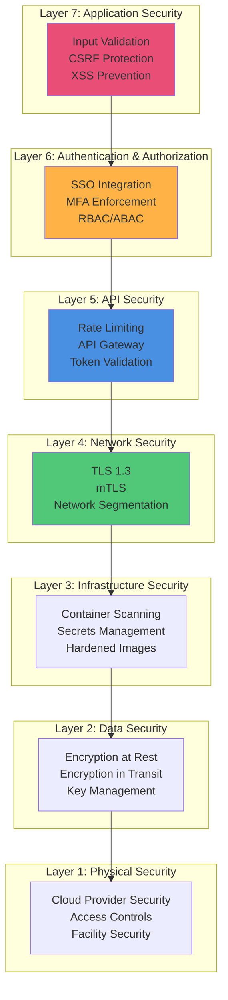
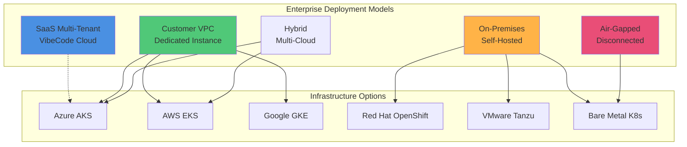
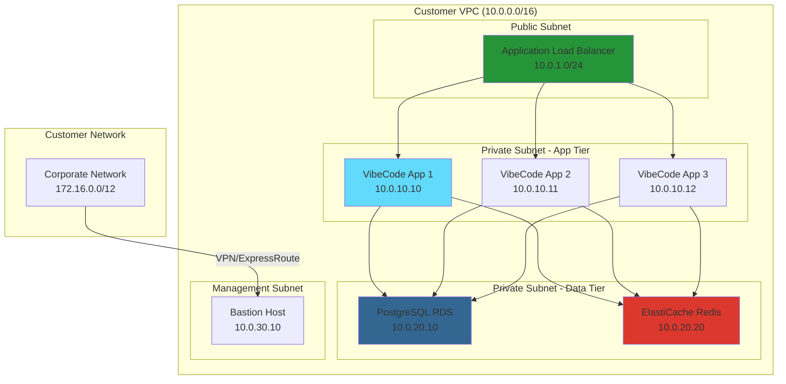
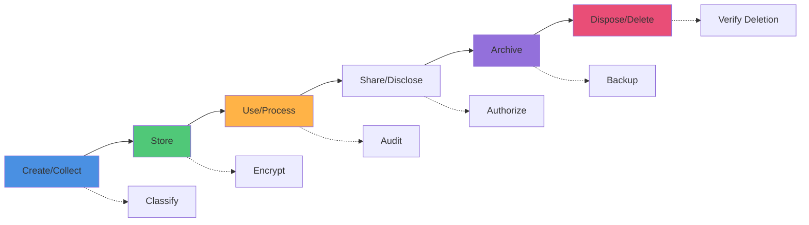
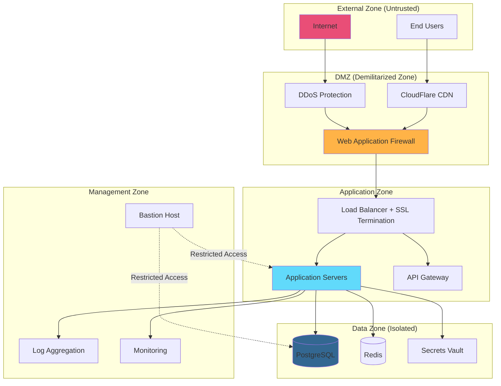
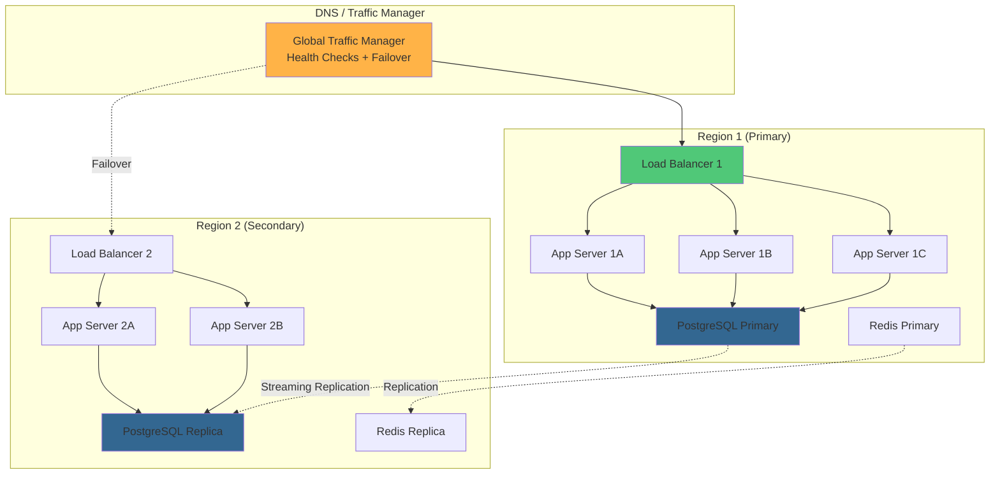
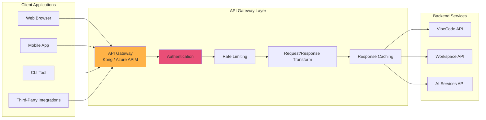

# VibeCode Enterprise Architecture
**Enterprise Evaluation Guide: Security, Compliance, and Governance**

**Version:** 1.0
**Date:** February 28, 2026
**Status:** Production Ready
**Audience:** Enterprise Architects, Security Teams, Compliance Officers

---

## Table of Contents

1. [Executive Summary](#executive-summary)
2. [Security Architecture](#security-architecture)
3. [Compliance Framework](#compliance-framework)
4. [Enterprise Deployment Models](#enterprise-deployment-models)
5. [Data Governance](#data-governance)
6. [Identity and Access Management](#identity-and-access-management)
7. [Network Security](#network-security)
8. [Audit and Monitoring](#audit-and-monitoring)
9. [Business Continuity](#business-continuity)
10. [Vendor Risk Assessment](#vendor-risk-assessment)
11. [Integration Patterns](#integration-patterns)
12. [Enterprise Support](#enterprise-support)

---

## Executive Summary

VibeCode Studio provides an enterprise-grade AI-powered development platform designed with security, compliance, and governance as foundational pillars. This document outlines the architectural considerations for enterprise deployment, compliance certification paths, and data governance frameworks.

### Enterprise Readiness Overview

| Category | Status | Details |
|----------|--------|---------|
| **Security Architecture** | ✅ Production Ready | Defense-in-depth, zero-trust principles |
| **Compliance** | 🔄 In Progress | SOC 2 Type II (Q3 2026), GDPR compliant |
| **Data Governance** | ✅ Production Ready | Encryption at rest/transit, data residency options |
| **Identity Management** | ✅ Production Ready | SSO (SAML 2.0, OAuth 2.0), MFA, RBAC |
| **Audit Logging** | ✅ Production Ready | Comprehensive audit trails, immutable logs |
| **Disaster Recovery** | ✅ Production Ready | RPO < 1 hour, RTO < 4 hours |

### Key Enterprise Features

- **Multi-Tenancy**: Logical data isolation with workspace-level segmentation
- **Private Cloud Deployment**: Self-hosted on-premises or in customer VPCs
- **Air-Gapped Support**: Fully disconnected deployment capability
- **Advanced Security**: SIEM integration, threat detection, anomaly detection
- **Compliance Automation**: Automated compliance reporting and policy enforcement
- **Enterprise SSO**: SAML 2.0, OIDC, LDAP/Active Directory integration

---

## Security Architecture

### Defense-in-Depth Strategy

VibeCode implements a multi-layered security architecture based on defense-in-depth principles:



### Security Components

#### 1. Application Security

**Framework Security:**
- Next.js 16 with React 19: Built-in XSS protection via React DOM
- TypeScript: Type safety prevents entire classes of vulnerabilities
- Content Security Policy (CSP): Strict CSP headers preventing code injection

**Input Validation:**
```typescript
// All API inputs validated with Zod schemas
import { z } from 'zod';

const userInputSchema = z.object({
  content: z.string().max(10000).trim(),
  userId: z.string().uuid(),
  workspaceId: z.string().uuid()
});
```

**Security Headers:**
```javascript
// Next.js security headers configuration
{
  "X-Frame-Options": "DENY",
  "X-Content-Type-Options": "nosniff",
  "Referrer-Policy": "strict-origin-when-cross-origin",
  "Permissions-Policy": "geolocation=(), microphone=(), camera=()",
  "Strict-Transport-Security": "max-age=31536000; includeSubDomains",
  "Content-Security-Policy": "default-src 'self'; script-src 'self' 'unsafe-eval'"
}
```

**Vulnerability Management:**
- Automated dependency scanning via Dependabot
- SAST (Static Application Security Testing) in CI/CD pipeline
- Regular penetration testing (quarterly)
- Bug bounty program for responsible disclosure

#### 2. Runtime Security (Tauri Desktop)

**Memory Safety:**
- Rust backend eliminates buffer overflows, use-after-free, and data races
- Sandboxed WebView environment isolates web content from system
- No Node.js runtime exposure prevents JavaScript-based attacks

**Permission System:**
```json
// Tauri security allowlist (tauri.conf.json)
{
  "security": {
    "csp": "default-src 'self'",
    "allowlist": {
      "fs": {
        "scope": ["$APPDATA/*", "$DOCUMENTS/*"]
      },
      "shell": {
        "scope": ["git", "npm"]
      }
    }
  }
}
```

**Code Signing:**
- macOS: Notarized and Gatekeeper-approved
- Windows: Authenticode signed with EV certificate
- Linux: GPG-signed packages and AppImage

#### 3. Infrastructure Security

**Container Security:**
- Minimal base images (distroless where possible)
- Image scanning with Trivy and Snyk
- Non-root user execution
- Read-only root filesystem
- Dropped Linux capabilities

**Kubernetes Security:**
```yaml
# Pod Security Standards: Restricted
apiVersion: v1
kind: Pod
metadata:
  name: vibecode-app
spec:
  securityContext:
    runAsNonRoot: true
    runAsUser: 10001
    fsGroup: 10001
    seccompProfile:
      type: RuntimeDefault
  containers:
  - name: app
    securityContext:
      allowPrivilegeEscalation: false
      capabilities:
        drop: ["ALL"]
      readOnlyRootFilesystem: true
```

**Secrets Management:**
- Azure Key Vault integration (cloud deployments)
- HashiCorp Vault support (self-hosted)
- Kubernetes Secrets with encryption at rest
- Sealed Secrets for GitOps workflows
- Never stored in source code or environment variables in plain text

#### 4. API Security

**Authentication:**
- JWT tokens with short expiration (15 minutes)
- Refresh tokens with rotation
- Token revocation lists (Redis-backed)
- API key authentication for service-to-service

**Rate Limiting:**
```typescript
// Redis-backed distributed rate limiting
const rateLimiter = new RateLimiter({
  redis: redisClient,
  limits: {
    authenticated: { requests: 1000, window: '15m' },
    unauthenticated: { requests: 100, window: '15m' },
    ai_requests: { requests: 50, window: '1h' }
  }
});
```

**API Gateway:**
- Request validation and sanitization
- Response filtering to prevent data leakage
- Automatic CORS configuration
- DDoS protection via CloudFlare or AWS Shield

#### 5. Database Security

**Encryption:**
- **At Rest**: AES-256 encryption for PostgreSQL data files
- **In Transit**: TLS 1.3 for all database connections
- **Field-Level**: PII fields encrypted with application-level encryption

**Access Control:**
```sql
-- Row-Level Security (RLS) policies
CREATE POLICY workspace_isolation ON workspaces
  USING (workspace_id = current_setting('app.current_workspace')::uuid);

-- Least privilege principle
GRANT SELECT, INSERT, UPDATE ON workspaces TO app_user;
REVOKE DELETE ON workspaces FROM app_user;
```

**Database Auditing:**
- PostgreSQL audit logging (pgAudit extension)
- Query logging for sensitive operations
- Connection logging with source IP tracking
- Automated backup encryption

### Security Monitoring

**SIEM Integration:**
- Datadog Security Monitoring
- Splunk Enterprise Security
- Azure Sentinel integration
- Custom log forwarding via syslog

**Threat Detection:**
- Anomaly detection for authentication attempts
- Unusual API usage patterns
- Privilege escalation attempts
- Data exfiltration detection

**Vulnerability Scanning:**
- Weekly automated scans (Nessus, Qualys)
- Continuous image scanning in container registry
- Infrastructure as Code (IaC) scanning

---

## Compliance Framework

### Supported Compliance Standards

| Standard | Status | Certification Date | Next Audit |
|----------|--------|-------------------|------------|
| **SOC 2 Type II** | 🔄 In Progress | Q3 2026 (planned) | Q3 2027 |
| **GDPR** | ✅ Compliant | February 2026 | Ongoing |
| **ISO 27001** | 📋 Planned | Q4 2026 (planned) | TBD |
| **HIPAA** | 📋 Planned | 2027 (planned) | TBD |
| **PCI DSS** | ❌ Not Applicable | N/A | N/A |
| **FedRAMP** | 📋 Roadmap | 2027 (roadmap) | TBD |

### GDPR Compliance

**Data Protection Principles:**

1. **Lawfulness, Fairness, Transparency**
   - Clear privacy policy and terms of service
   - Explicit consent mechanisms
   - Transparent data processing activities

2. **Purpose Limitation**
   - Data collected only for specified, explicit purposes
   - No secondary use without additional consent

3. **Data Minimization**
   - Only necessary data collected
   - Automatic data expiration policies

4. **Accuracy**
   - User-accessible data correction mechanisms
   - Automated data validation

5. **Storage Limitation**
   - Configurable retention periods
   - Automated deletion workflows

6. **Integrity and Confidentiality**
   - Encryption at rest and in transit
   - Access controls and audit logging

7. **Accountability**
   - Data Processing Agreements (DPAs)
   - Data Protection Impact Assessments (DPIAs)

**GDPR Features:**

```typescript
// Data Subject Rights Implementation
export const gdprService = {
  // Right to Access (Article 15)
  async exportUserData(userId: string): Promise<DataExport> {
    return {
      personalData: await getUserProfile(userId),
      activityLogs: await getActivityLogs(userId),
      workspaces: await getUserWorkspaces(userId),
      format: 'JSON' // Machine-readable format
    };
  },

  // Right to Erasure (Article 17)
  async deleteUserData(userId: string): Promise<void> {
    await anonymizeUserData(userId);
    await deletePersonalData(userId);
    await logDeletion(userId);
  },

  // Right to Data Portability (Article 20)
  async portData(userId: string, format: 'JSON' | 'CSV'): Promise<File> {
    return await generateDataExport(userId, format);
  },

  // Right to Rectification (Article 16)
  async updateUserData(userId: string, updates: Partial<UserData>): Promise<void> {
    await validateUpdates(updates);
    await updateUserProfile(userId, updates);
    await auditLog('user_data_updated', { userId, updates });
  }
};
```

**Data Residency:**
- EU data residency option (Frankfurt, Ireland regions)
- No cross-border transfers without Standard Contractual Clauses (SCCs)
- Regional data isolation in multi-region deployments

### SOC 2 Type II Preparation

**Trust Service Criteria:**

1. **Security** ✅
   - Access controls implemented
   - Encryption at rest and in transit
   - Vulnerability management program

2. **Availability** ✅
   - 99.9% uptime SLA
   - Redundant infrastructure
   - Automated failover

3. **Processing Integrity** ✅
   - Data validation and integrity checks
   - Transaction logging
   - Error handling and recovery

4. **Confidentiality** ✅
   - Data classification framework
   - Access controls based on sensitivity
   - Confidentiality agreements

5. **Privacy** 🔄
   - Privacy policy and consent management
   - Data retention and disposal
   - Privacy impact assessments

**Evidence Collection:**
- Automated control testing
- Continuous compliance monitoring
- Policy and procedure documentation
- Vendor risk assessments

### Industry-Specific Compliance

#### HIPAA (Healthcare)

**Technical Safeguards:**
- Unique user identification (required)
- Emergency access procedures
- Automatic log-off after inactivity
- Encryption and decryption of ePHI
- Audit controls and monitoring

**Administrative Safeguards:**
- Security management process
- Security awareness training
- Information access management
- Business Associate Agreements (BAAs)

**Physical Safeguards:**
- Facility access controls
- Workstation use and security
- Device and media controls

#### ISO 27001 (Information Security)

**Information Security Management System (ISMS):**
- Risk assessment methodology
- Statement of Applicability (SoA)
- Security policies and procedures
- Internal audit program
- Management review process

**Controls Implementation:**
- 93 controls across 14 domains
- Asset management
- Human resource security
- Communications security
- Supplier relationships

---

## Enterprise Deployment Models

### Deployment Architecture Options



### Model Comparison

| Model | Control | Compliance | Cost | Complexity | Use Case |
|-------|---------|------------|------|------------|----------|
| **SaaS Multi-Tenant** | Low | Standard | Low | Low | Small-medium businesses |
| **Customer VPC** | Medium | Custom | Medium | Medium | Regulated industries |
| **On-Premises** | High | Full | High | High | Data sovereignty requirements |
| **Air-Gapped** | Maximum | Full | Highest | Highest | Government, defense |
| **Hybrid** | Variable | Custom | Variable | High | Multi-region enterprises |

### 1. SaaS Multi-Tenant (VibeCode Cloud)

**Architecture:**
- Shared infrastructure with logical isolation
- Workspace-level data segregation
- Automated scaling and updates
- Global CDN for asset delivery

**Data Isolation:**
```sql
-- Workspace-level Row-Level Security
CREATE POLICY workspace_isolation ON users
  USING (workspace_id = current_setting('app.workspace_id')::uuid);

-- Schema-per-tenant for strict isolation (optional)
CREATE SCHEMA workspace_abc123;
SET search_path TO workspace_abc123, public;
```

**Compliance:**
- SOC 2 Type II certified infrastructure
- GDPR compliant with EU data residency
- Regular penetration testing
- Shared responsibility model

**Pricing Model:**
- Per-user per-month subscription
- Usage-based AI credits
- Volume discounts for 50+ users

### 2. Customer VPC (Dedicated Instance)

**Architecture:**
- Single-tenant deployment in customer's cloud account
- Dedicated compute, storage, and network resources
- Customer-managed encryption keys (BYOK)
- Private connectivity (VPN, ExpressRoute, Direct Connect)

**Network Architecture:**


**Features:**
- Customer-controlled network policies
- Integration with existing identity providers
- Custom compliance controls
- Dedicated support and SLA

**Implementation:**
- Infrastructure as Code (Terraform/ARM templates)
- Automated deployment via CI/CD
- Blue-green deployment strategy
- Automated backups to customer storage

### 3. On-Premises Self-Hosted

**System Requirements:**

| Component | Minimum | Recommended | Enterprise |
|-----------|---------|-------------|------------|
| **Kubernetes Nodes** | 3 nodes | 5 nodes | 10+ nodes |
| **CPU per Node** | 8 cores | 16 cores | 32 cores |
| **RAM per Node** | 32 GB | 64 GB | 128 GB |
| **Storage (SSD)** | 500 GB | 1 TB | 5 TB+ |
| **Network** | 1 Gbps | 10 Gbps | 25 Gbps |

**Installation Methods:**

1. **Helm Charts** (Recommended)
```bash
# Add VibeCode Helm repository
helm repo add vibecode https://charts.vibecode.com
helm repo update

# Install with custom values
helm install vibecode vibecode/vibecode \
  --namespace vibecode \
  --create-namespace \
  --values custom-values.yaml
```

2. **Kubernetes Manifests**
```bash
# Apply Kubernetes manifests
kubectl apply -f https://releases.vibecode.com/v5.1.0/manifests/
```

3. **Docker Compose** (Small deployments)
```bash
# Download production compose file
curl -O https://releases.vibecode.com/docker-compose.prod.yml
docker-compose -f docker-compose.prod.yml up -d
```

**Persistent Storage:**
- Kubernetes Persistent Volumes (PV/PVC)
- Storage Classes for dynamic provisioning
- Backup integration with Velero
- Snapshot capabilities

**High Availability:**
- Multi-master Kubernetes control plane
- Database replication (PostgreSQL streaming replication)
- Redis Sentinel or Cluster mode
- Load balancer redundancy

### 4. Air-Gapped Deployment

**Requirements:**
- Fully disconnected from public internet
- Local container registry
- Offline documentation and support
- Manual update process

**Installation Process:**

1. **Prepare Offline Bundle**
```bash
# Download offline installation bundle
# Contains: container images, Helm charts, documentation
vibecode-airgap-bundle-v5.1.0.tar.gz (12 GB)
```

2. **Transfer to Secure Environment**
```bash
# Verify integrity
sha256sum -c vibecode-airgap-bundle-v5.1.0.tar.gz.sha256

# Extract bundle
tar -xzvf vibecode-airgap-bundle-v5.1.0.tar.gz
```

3. **Load Images to Local Registry**
```bash
# Load container images
./scripts/load-images.sh --registry registry.internal.corp

# Push to internal registry
./scripts/push-images.sh --registry registry.internal.corp
```

4. **Install VibeCode**
```bash
# Install with airgap configuration
helm install vibecode ./vibecode-helm-chart \
  --set image.registry=registry.internal.corp \
  --set airgap.enabled=true \
  --set airgap.licenseKey=$LICENSE_KEY
```

**AI Provider Options:**
- **Self-hosted LLMs**: Ollama, vLLM, LocalAI
- **On-premises API**: Azure OpenAI on-premises, AWS Bedrock VPC endpoint
- **Proxy configuration**: Air-gapped proxy for controlled external access

**Update Process:**
- Quarterly offline update bundles
- Incremental update packages
- Rollback capabilities
- Compliance-friendly change management

### 5. Hybrid Multi-Cloud

**Architecture:**
- Workload distribution across multiple clouds
- Centralized identity and access management
- Cross-cloud data replication
- Unified monitoring and observability

**Service Mesh Integration:**
```yaml
# Istio multi-cluster configuration
apiVersion: install.istio.io/v1alpha1
kind: IstioOperator
metadata:
  name: vibecode-multicluster
spec:
  meshConfig:
    defaultConfig:
      proxyMetadata:
        ISTIO_META_DNS_CAPTURE: "true"
  values:
    global:
      multiCluster:
        clusterName: azure-west-us
      meshNetworks:
        network1:
          endpoints:
          - fromRegistry: azure-west-us
          - fromRegistry: aws-us-east-1
```

**Data Synchronization:**
- PostgreSQL logical replication across clouds
- Redis Global Database for cross-region caching
- Object storage replication (Azure Blob → S3)
- Eventual consistency with conflict resolution

---

## Data Governance

### Data Classification Framework

VibeCode implements a four-tier data classification system:

| Classification | Examples | Storage | Encryption | Access Control | Retention |
|----------------|----------|---------|------------|----------------|-----------|
| **Public** | Documentation, marketing materials | Standard | Optional | Public | Indefinite |
| **Internal** | Source code, design documents | Standard | At rest | Authenticated users | Configurable |
| **Confidential** | Customer data, PII, API keys | Encrypted | At rest + transit | RBAC, MFA required | Policy-based |
| **Restricted** | Payment info, health records, secrets | HSM/Vault | Field-level + at rest + transit | Privileged access, audit | Regulatory-driven |

### Data Lifecycle Management



### Data Protection Mechanisms

#### 1. Encryption Strategy

**Encryption at Rest:**
```typescript
// Application-level encryption for sensitive fields
import { encrypt, decrypt } from '@/lib/crypto';

export async function storeApiKey(userId: string, apiKey: string) {
  const encryptedKey = await encrypt(apiKey, {
    algorithm: 'AES-256-GCM',
    keyId: `user:${userId}:master`
  });

  await db.userSecrets.create({
    data: {
      userId,
      encryptedApiKey: encryptedKey,
      keyRotationDate: new Date()
    }
  });
}
```

**Encryption in Transit:**
- TLS 1.3 for all external connections
- mTLS for service-to-service communication
- Perfect Forward Secrecy (PFS) enabled
- Certificate pinning for critical connections

**Key Management:**
- Azure Key Vault or AWS KMS for cloud deployments
- HashiCorp Vault for on-premises
- Hardware Security Module (HSM) support
- Automated key rotation (90-day cycle)
- Bring Your Own Key (BYOK) support

#### 2. Data Masking and Tokenization

**Dynamic Data Masking:**
```typescript
// Automatically mask PII in logs and responses
export function maskPII(data: any): any {
  return {
    ...data,
    email: maskEmail(data.email),      // j***@example.com
    phone: maskPhone(data.phone),      // ***-***-1234
    ssn: maskSSN(data.ssn),            // ***-**-6789
    creditCard: maskCard(data.card)    // ****-****-****-1234
  };
}
```

**Tokenization:**
- Sensitive data replaced with non-sensitive tokens
- Token-to-data mapping stored in secure vault
- Detokenization only for authorized operations

#### 3. Data Retention Policies

**Configurable Retention:**
```typescript
// Workspace-level retention policies
export interface RetentionPolicy {
  workspaceId: string;
  policies: {
    auditLogs: { retentionDays: 365, autoDelete: true },
    chatHistory: { retentionDays: 90, autoArchive: true },
    userData: { retentionDays: null, manualReview: true },
    aiRequests: { retentionDays: 30, anonymize: true }
  };
}
```

**Automated Enforcement:**
- Scheduled deletion jobs
- Soft delete with grace period
- Archival to cold storage
- Compliance reporting

#### 4. Data Anonymization

**Techniques:**
- **Pseudonymization**: Replace identifiers with pseudonyms
- **Aggregation**: Summary statistics instead of individual records
- **Generalization**: Reduce precision (e.g., exact age → age range)
- **Noise Addition**: Add statistical noise for differential privacy

```typescript
// Anonymize user data for analytics
export async function anonymizeForAnalytics(userId: string) {
  const userData = await db.user.findUnique({ where: { id: userId } });

  return {
    userId: hash(userId),              // One-way hash
    ageRange: getAgeRange(userData.birthDate),
    country: userData.country,         // Keep for regional analysis
    industry: userData.industry,
    // Remove: name, email, phone, IP address
  };
}
```

### Data Residency and Sovereignty

**Regional Deployment Options:**

| Region | Data Center Locations | Compliance | Available |
|--------|----------------------|------------|-----------|
| **North America** | US-East (Virginia), US-West (Oregon), Canada (Toronto) | SOC 2, FedRAMP (roadmap) | ✅ |
| **Europe** | EU-West (Ireland), EU-Central (Frankfurt), UK (London) | GDPR, ISO 27001 | ✅ |
| **Asia-Pacific** | AP-Southeast (Singapore), AP-Northeast (Tokyo), AP-South (Mumbai) | PDPA, APPI | 📋 Planned |
| **Australia** | AU-East (Sydney) | IRAP, ASD Essential Eight | 📋 Planned |
| **Middle East** | ME-South (Bahrain) | - | 📋 Planned |

**Data Sovereignty Features:**
- No cross-border data transfer without explicit consent
- Regional data isolation with separate databases
- Local encryption key storage
- Compliance with local data protection laws

### Privacy by Design

**Principles:**

1. **Proactive not Reactive**: Privacy built into system design
2. **Privacy as Default**: Strictest settings by default
3. **Privacy Embedded**: Integrated into architecture, not add-on
4. **Full Functionality**: No trade-offs between privacy and functionality
5. **End-to-End Security**: Lifecycle protection
6. **Visibility and Transparency**: Open about data practices
7. **User-Centric**: Empower users with control over their data

**Implementation:**
- Privacy Impact Assessments (PIAs) for new features
- Data Protection by Design and Default (GDPR Article 25)
- Automated privacy testing in CI/CD pipeline
- Regular privacy audits

---

## Identity and Access Management

### Authentication Methods

**Supported Protocols:**

| Method | Use Case | Security Level | MFA Support |
|--------|----------|---------------|-------------|
| **SAML 2.0** | Enterprise SSO | High | ✅ Via IdP |
| **OAuth 2.0 / OIDC** | Third-party integrations | High | ✅ Via provider |
| **LDAP / Active Directory** | On-premises integration | Medium | ✅ Via AD |
| **Username/Password** | Direct login | Medium | ✅ TOTP/SMS |
| **API Keys** | Service accounts | High | ❌ |
| **Client Certificates** | Machine-to-machine | Very High | N/A |

### Single Sign-On (SSO) Integration

**SAML 2.0 Configuration:**
```xml
<!-- SAML Service Provider metadata -->
<EntityDescriptor xmlns="urn:oasis:names:tc:SAML:2.0:metadata"
                  entityID="https://vibecode.example.com">
  <SPSSODescriptor protocolSupportEnumeration="urn:oasis:names:tc:SAML:2.0:protocol">
    <NameIDFormat>urn:oasis:names:tc:SAML:1.1:nameid-format:emailAddress</NameIDFormat>
    <AssertionConsumerService
      Binding="urn:oasis:names:tc:SAML:2.0:bindings:HTTP-POST"
      Location="https://vibecode.example.com/api/auth/saml/callback"
      index="0" />
  </SPSSODescriptor>
</EntityDescriptor>
```

**Supported Identity Providers:**
- Okta
- Azure Active Directory (Azure AD / Entra ID)
- Google Workspace
- OneLogin
- Ping Identity
- Auth0
- Generic SAML 2.0 / OIDC providers

### Multi-Factor Authentication (MFA)

**MFA Options:**

1. **TOTP (Time-based One-Time Password)**
   - Google Authenticator, Microsoft Authenticator, Authy
   - 6-digit codes with 30-second rotation
   - Backup codes for account recovery

2. **SMS/Email OTP**
   - Fallback option for users without smartphone
   - Rate-limited to prevent abuse
   - Not recommended for high-security environments

3. **Hardware Tokens (FIDO2/WebAuthn)**
   - YubiKey, Google Titan, Windows Hello
   - Phishing-resistant authentication
   - Biometric support (fingerprint, face recognition)

4. **Push Notifications**
   - Mobile app push for approval
   - Contextual information (location, device)

**MFA Enforcement:**
```typescript
// Conditional MFA based on risk assessment
export async function assessAuthenticationRisk(context: AuthContext): Promise<MFARequired> {
  const riskFactors = {
    newDevice: !context.deviceId || !await isKnownDevice(context.deviceId),
    newLocation: await isNewLocation(context.ipAddress),
    sensitiveOperation: context.operation === 'delete_workspace',
    timeOfDay: isOutsideNormalHours(context.timestamp),
    failedAttempts: await getRecentFailedAttempts(context.userId)
  };

  const riskScore = calculateRiskScore(riskFactors);

  return {
    required: riskScore > RISK_THRESHOLD,
    methods: riskScore > HIGH_RISK_THRESHOLD
      ? ['hardware_token', 'totp']
      : ['totp', 'sms', 'push']
  };
}
```

### Role-Based Access Control (RBAC)

**Built-in Roles:**

| Role | Permissions | Use Case |
|------|-------------|----------|
| **Super Admin** | Full system access, user management, billing | Organization owner |
| **Admin** | Workspace management, user roles, settings | Team leads |
| **Developer** | Create/edit projects, run code, AI access | Development team |
| **Viewer** | Read-only access to projects | Stakeholders |
| **Billing Admin** | Manage billing, view usage reports | Finance team |
| **Security Auditor** | Read audit logs, security settings | Compliance team |

**Custom Roles:**
```typescript
// Define custom role with granular permissions
export interface CustomRole {
  name: string;
  permissions: {
    workspaces: ['read', 'write', 'delete'],
    projects: ['read', 'write', 'execute'],
    users: ['read', 'invite'],
    billing: [],
    settings: ['read'],
    ai: ['chat', 'completion'],
    auditLogs: ['read']
  };
}

// Example: Custom "Contractor" role
const contractorRole: CustomRole = {
  name: 'Contractor',
  permissions: {
    workspaces: ['read'],
    projects: ['read', 'write', 'execute'],
    users: [],
    billing: [],
    settings: [],
    ai: ['chat', 'completion'],
    auditLogs: []
  }
};
```

### Attribute-Based Access Control (ABAC)

**Policy-Driven Access:**
```typescript
// ABAC policy engine
export interface AccessPolicy {
  subject: { role: string; department?: string; clearanceLevel?: number };
  resource: { type: string; classification?: string; owner?: string };
  action: string;
  environment: { time?: TimeRange; location?: string; network?: string };
}

// Example: Restrict access to confidential data outside business hours
const policy: AccessPolicy = {
  subject: { role: 'developer', clearanceLevel: 2 },
  resource: { type: 'project', classification: 'confidential' },
  action: 'read',
  environment: {
    time: { start: '09:00', end: '17:00' },
    network: 'corporate_vpn'
  }
};
```

### Session Management

**Session Security:**
- Secure, HttpOnly, SameSite cookies
- Session fixation protection
- Concurrent session limits
- Idle timeout (30 minutes default, configurable)
- Absolute timeout (12 hours)
- Session revocation on password change

**Redis Session Store:**
```typescript
// Distributed session management
import { RedisStore } from 'connect-redis';

export const sessionConfig = {
  store: new RedisStore({ client: redisClient }),
  secret: process.env.SESSION_SECRET,
  name: 'vibecode.sid',
  cookie: {
    secure: true,
    httpOnly: true,
    sameSite: 'strict',
    maxAge: 12 * 60 * 60 * 1000  // 12 hours
  },
  rolling: true,  // Reset expiration on activity
  resave: false,
  saveUninitialized: false
};
```

---

## Network Security

### Network Architecture

**Zero-Trust Network Model:**



### Network Segmentation

**Subnet Architecture:**

| Tier | Subnet | CIDR | Purpose | Access |
|------|--------|------|---------|--------|
| **Public** | Internet-facing | 10.0.1.0/24 | Load balancers, bastion | Public |
| **Application** | App tier | 10.0.10.0/24 | Application servers | Private |
| **Data** | Data tier | 10.0.20.0/24 | Databases, caching | Private |
| **Management** | Admin tier | 10.0.30.0/24 | Monitoring, logging | Restricted |
| **Services** | Internal services | 10.0.40.0/24 | Message queues, background jobs | Private |

**Network Security Groups (NSGs):**
```yaml
# Example: Azure NSG rules for application tier
SecurityRules:
  - name: AllowHTTPSFromLoadBalancer
    priority: 100
    direction: Inbound
    access: Allow
    protocol: Tcp
    sourceAddressPrefix: 10.0.1.0/24
    sourcePortRange: "*"
    destinationAddressPrefix: 10.0.10.0/24
    destinationPortRange: 443

  - name: AllowPostgreSQLFromApp
    priority: 110
    direction: Outbound
    access: Allow
    protocol: Tcp
    sourceAddressPrefix: 10.0.10.0/24
    sourcePortRange: "*"
    destinationAddressPrefix: 10.0.20.0/24
    destinationPortRange: 5432

  - name: DenyAllInbound
    priority: 4096
    direction: Inbound
    access: Deny
    protocol: "*"
    sourceAddressPrefix: "*"
    sourcePortRange: "*"
    destinationAddressPrefix: "*"
    destinationPortRange: "*"
```

### Web Application Firewall (WAF)

**OWASP Top 10 Protection:**
- SQL Injection prevention
- Cross-Site Scripting (XSS) filtering
- CSRF token validation
- XML External Entity (XXE) prevention
- Insecure deserialization protection
- Security misconfiguration detection
- Sensitive data exposure prevention
- Access control enforcement
- Known vulnerability scanning
- Logging and monitoring

**WAF Rules:**
```json
{
  "ruleGroups": [
    {
      "name": "SQLInjectionProtection",
      "rules": [
        "Block requests with SQL keywords in query parameters",
        "Block UNION-based SQL injection attempts",
        "Block boolean-based blind SQL injection"
      ]
    },
    {
      "name": "XSSProtection",
      "rules": [
        "Block <script> tags in input",
        "Block event handlers (onerror, onload, etc.)",
        "Sanitize HTML entities"
      ]
    },
    {
      "name": "RateLimiting",
      "rules": [
        "Limit to 100 requests per minute per IP",
        "Limit to 10 login attempts per hour per IP",
        "Block IPs with sustained high request rates"
      ]
    }
  ]
}
```

### DDoS Protection

**Multi-Layer Defense:**

1. **Network Layer (L3/L4)**
   - SYN flood protection
   - UDP flood protection
   - ICMP flood protection
   - CloudFlare / AWS Shield Standard

2. **Application Layer (L7)**
   - HTTP flood protection
   - Slowloris protection
   - Rate limiting per IP/user
   - AWS Shield Advanced / Cloudflare Pro

**Mitigation Strategies:**
- Anycast network distribution
- Traffic scrubbing centers
- Automatic scaling during attacks
- GeoIP blocking for high-risk regions
- Challenge-response (CAPTCHA) for suspicious traffic

### TLS/SSL Configuration

**TLS Best Practices:**
```nginx
# NGINX TLS configuration
ssl_protocols TLSv1.3 TLSv1.2;
ssl_prefer_server_ciphers on;
ssl_ciphers 'ECDHE-RSA-AES256-GCM-SHA384:ECDHE-RSA-AES128-GCM-SHA256';
ssl_session_cache shared:SSL:10m;
ssl_session_timeout 10m;
ssl_stapling on;
ssl_stapling_verify on;
resolver 8.8.8.8 8.8.4.4 valid=300s;
resolver_timeout 5s;

# HSTS header
add_header Strict-Transport-Security "max-age=31536000; includeSubDomains; preload" always;

# Certificate configuration
ssl_certificate /etc/ssl/certs/vibecode.crt;
ssl_certificate_key /etc/ssl/private/vibecode.key;
ssl_trusted_certificate /etc/ssl/certs/ca-chain.crt;
```

**Certificate Management:**
- Automated renewal with Let's Encrypt / cert-manager
- Certificate pinning for critical connections
- Wildcard certificates for subdomains
- Extended Validation (EV) certificates for production

### VPN and Private Connectivity

**Site-to-Site VPN:**
- IPsec tunnels for on-premises connectivity
- BGP routing for dynamic routing
- Redundant tunnels for high availability
- Encrypted traffic (AES-256)

**Private Connectivity Options:**
- **Azure**: ExpressRoute
- **AWS**: Direct Connect
- **GCP**: Cloud Interconnect
- **Dedicated Circuits**: MPLS, dark fiber

---

## Audit and Monitoring

### Comprehensive Audit Logging

**Logged Events:**

| Category | Events | Retention | Immutability |
|----------|--------|-----------|--------------|
| **Authentication** | Login, logout, MFA, failed attempts, password changes | 1 year | ✅ |
| **Authorization** | Role changes, permission grants/revokes, access denials | 1 year | ✅ |
| **Data Access** | File access, database queries (sensitive tables), exports | 90 days | ✅ |
| **Configuration** | Settings changes, integration configs, security policies | 1 year | ✅ |
| **Administrative** | User creation/deletion, workspace management, billing | 7 years | ✅ |
| **AI Operations** | AI requests, model usage, prompt injection attempts | 30 days | ❌ |

**Audit Log Format:**
```typescript
export interface AuditLogEntry {
  id: string;
  timestamp: Date;
  userId: string;
  userName: string;
  userRole: string;
  ipAddress: string;
  userAgent: string;
  action: string;
  resource: {
    type: string;
    id: string;
    name: string;
  };
  result: 'success' | 'failure' | 'denied';
  metadata: Record<string, any>;
  signature: string;  // Digital signature for tamper-proofing
}

// Example audit log entry
const entry: AuditLogEntry = {
  id: '550e8400-e29b-41d4-a716-446655440000',
  timestamp: new Date('2026-02-28T10:30:00Z'),
  userId: 'user_abc123',
  userName: 'john.doe@example.com',
  userRole: 'admin',
  ipAddress: '192.168.1.100',
  userAgent: 'Mozilla/5.0...',
  action: 'workspace.delete',
  resource: {
    type: 'workspace',
    id: 'ws_xyz789',
    name: 'Production Environment'
  },
  result: 'success',
  metadata: {
    reason: 'Project completion',
    approvedBy: 'manager@example.com'
  },
  signature: 'SHA256:abc123...'
};
```

**Audit Log Immutability:**
- Write-once, read-many (WORM) storage
- Cryptographic hashing for tamper detection
- Blockchain-like chain of custody (optional)
- Append-only database tables

### Security Information and Event Management (SIEM)

**SIEM Integration:**

1. **Datadog Security Monitoring**
   - Real-time threat detection
   - Anomaly detection with ML
   - Security posture dashboards
   - Automated response workflows

2. **Splunk Enterprise Security**
   - Log aggregation and correlation
   - Threat intelligence feeds
   - Incident response workflows
   - Compliance reporting

3. **Azure Sentinel**
   - Cloud-native SIEM
   - AI-powered analytics
   - Integration with Azure services
   - Automated playbooks

4. **Custom Syslog Integration**
   - CEF (Common Event Format) support
   - Syslog forwarding (TCP/TLS)
   - Structured logging (JSON)

**Log Forwarding Configuration:**
```yaml
# Fluentd configuration for SIEM forwarding
<source>
  @type tail
  path /var/log/vibecode/audit.log
  pos_file /var/log/td-agent/vibecode-audit.pos
  tag vibecode.audit
  <parse>
    @type json
  </parse>
</source>

<match vibecode.audit>
  @type splunk_hec
  host splunk.example.com
  port 8088
  token xxxxxxxx-xxxx-xxxx-xxxx-xxxxxxxxxxxx
  index vibecode_audit
  sourcetype vibecode:audit
  use_ssl true
  ssl_verify true
</match>
```

### Real-Time Alerting

**Alert Categories:**

1. **Security Alerts**
   - Failed authentication attempts (5+ in 5 minutes)
   - Privilege escalation attempts
   - Unusual data access patterns
   - API abuse detection
   - Malware/virus detection

2. **Compliance Alerts**
   - Data access without proper authorization
   - Retention policy violations
   - Encryption key rotation overdue
   - Failed compliance checks

3. **Operational Alerts**
   - Service degradation or outage
   - Database connection failures
   - High error rates (>1% of requests)
   - Resource exhaustion (CPU, memory, disk)

**Notification Channels:**
- Email (with PGP encryption option)
- Slack/Microsoft Teams
- PagerDuty / Opsgenie
- SMS (for critical alerts)
- Webhook integrations

**Alert Configuration:**
```typescript
export const securityAlerts = {
  failedLoginAttempts: {
    condition: 'count > 5 in 5 minutes',
    severity: 'high',
    notify: ['security-team@example.com', 'slack:security'],
    action: 'temporary_account_lock'
  },

  dataExfiltration: {
    condition: 'data_export_size > 10GB or file_count > 1000',
    severity: 'critical',
    notify: ['security-team@example.com', 'pagerduty:security-oncall'],
    action: 'block_export_and_notify_user'
  },

  privilegeEscalation: {
    condition: 'role_change to admin or super_admin',
    severity: 'critical',
    notify: ['security-team@example.com', 'ceo@example.com'],
    action: 'require_approval_workflow'
  }
};
```

### Compliance Reporting

**Automated Reports:**
- Daily: Security event summary
- Weekly: Access review report, vulnerability scan results
- Monthly: Compliance scorecard, audit log summary
- Quarterly: SOC 2 control evidence, penetration test results
- Annual: GDPR Article 30 record of processing activities

**Report Formats:**
- PDF (executive summaries)
- CSV (detailed data exports)
- JSON (API integration)
- Dashboards (real-time visualization)

---

## Business Continuity

### High Availability Architecture

**Uptime SLA:**

| Tier | Availability | Downtime/Year | Downtime/Month | Use Case |
|------|--------------|---------------|----------------|----------|
| **Standard** | 99.5% | 43.8 hours | 3.65 hours | Development, testing |
| **Business** | 99.9% | 8.76 hours | 43.8 minutes | Production workloads |
| **Enterprise** | 99.95% | 4.38 hours | 21.9 minutes | Mission-critical |
| **Premium** | 99.99% | 52.6 minutes | 4.38 minutes | Financial, healthcare |

**High Availability Components:**



### Disaster Recovery

**Recovery Objectives:**

| Metric | Standard | Business | Enterprise | Premium |
|--------|----------|----------|------------|---------|
| **RTO (Recovery Time Objective)** | 24 hours | 4 hours | 1 hour | 15 minutes |
| **RPO (Recovery Point Objective)** | 24 hours | 4 hours | 1 hour | 5 minutes |
| **Backup Frequency** | Daily | Every 6 hours | Hourly | Continuous |
| **Backup Retention** | 30 days | 90 days | 1 year | 7 years |
| **Geographic Redundancy** | ❌ | ✅ (2 regions) | ✅ (3 regions) | ✅ (Multi-cloud) |

**Backup Strategy:**

1. **Database Backups**
   - Full backup: Daily
   - Incremental backup: Hourly
   - Point-in-time recovery (PITR): 5-minute granularity
   - Backup encryption: AES-256
   - Offsite storage: AWS S3 Glacier / Azure Blob Archive

2. **File Storage Backups**
   - Versioning enabled (last 30 versions)
   - Cross-region replication
   - Soft delete with 30-day retention
   - Immutable backups (compliance mode)

3. **Configuration Backups**
   - GitOps repository for infrastructure as code
   - Kubernetes manifests and Helm charts
   - Environment variables (encrypted)
   - Secrets backup to secure vault

**Disaster Recovery Procedures:**

```bash
# Automated DR failover script
#!/bin/bash

# 1. Detect primary region failure
if ! check_primary_health; then
  echo "Primary region unhealthy. Initiating failover..."

  # 2. Promote secondary database to primary
  pg_ctl promote -D /var/lib/postgresql/data

  # 3. Update DNS to point to secondary region
  aws route53 change-resource-record-sets \
    --hosted-zone-id Z1234567 \
    --change-batch file://failover-dns.json

  # 4. Scale up secondary region application servers
  kubectl scale deployment vibecode-app --replicas=10 -n vibecode

  # 5. Notify operations team
  send_alert "DR failover completed to secondary region"

  # 6. Update monitoring dashboards
  update_datadog_annotation "DR failover initiated"
fi
```

### Backup and Restore Procedures

**PostgreSQL Backup:**
```bash
# Continuous archiving with WAL shipping
archive_mode = on
archive_command = 'aws s3 cp %p s3://vibecode-backups/wal/%f'
wal_level = replica

# Automated backup with pgBackRest
pgbackrest backup --stanza=vibecode --type=full
pgbackrest backup --stanza=vibecode --type=incr

# Point-in-time recovery
pgbackrest restore --stanza=vibecode \
  --type=time "--target=2026-02-28 10:30:00" \
  --target-action=promote
```

**Application State Backup:**
```bash
# Velero backup for Kubernetes resources
velero backup create vibecode-daily \
  --include-namespaces vibecode \
  --snapshot-volumes \
  --ttl 720h0m0s

# Restore from backup
velero restore create --from-backup vibecode-daily
```

### Testing and Validation

**DR Testing Schedule:**
- **Tabletop Exercise**: Quarterly (walkthrough procedures)
- **Partial Failover Test**: Semi-annually (test specific components)
- **Full DR Drill**: Annually (complete failover to DR site)

**Test Checklist:**
- [ ] Verify backup integrity and restorability
- [ ] Test database promotion and replication
- [ ] Validate DNS failover and TTL settings
- [ ] Confirm application functionality in DR site
- [ ] Test monitoring and alerting in DR environment
- [ ] Validate data consistency post-failover
- [ ] Measure actual RTO and RPO achieved
- [ ] Document lessons learned and update procedures

---

## Vendor Risk Assessment

### Third-Party Dependencies

**Critical Dependencies:**

| Vendor | Service | Risk Level | Mitigation | SLA |
|--------|---------|------------|------------|-----|
| **AWS** | Infrastructure (EC2, RDS, S3) | Low | Multi-cloud strategy | 99.99% |
| **Azure** | Infrastructure (AKS, PostgreSQL) | Low | Multi-cloud strategy | 99.95% |
| **OpenAI** | AI Completions | Medium | Multi-provider fallback | Best effort |
| **Anthropic** | Claude API | Medium | Multi-provider fallback | Best effort |
| **Datadog** | Observability | Low | Graceful degradation | 99.9% |
| **Cloudflare** | CDN, DDoS protection | Low | Alternative CDN (Fastly) | 100% |
| **GitHub** | OAuth, integrations | Low | Alternative auth methods | 99.95% |

**Vendor Assessment Criteria:**
1. **Security Posture**: SOC 2, ISO 27001, penetration testing
2. **Financial Stability**: Credit rating, funding, public filings
3. **Business Continuity**: DR plans, redundancy, SLAs
4. **Compliance**: GDPR, HIPAA, FedRAMP certifications
5. **Data Handling**: Encryption, data residency, subprocessors
6. **Incident Response**: Security incident history, response times
7. **Exit Strategy**: Data portability, contract termination, transition support

### Supply Chain Security

**Software Supply Chain:**
- Dependency scanning (Snyk, Dependabot)
- Software Bill of Materials (SBOM) generation
- Binary provenance verification
- Container image signing (Cosign/Notary)
- Reproducible builds

**Example SBOM:**
```json
{
  "bomFormat": "CycloneDX",
  "specVersion": "1.4",
  "version": 1,
  "metadata": {
    "component": {
      "type": "application",
      "name": "vibecode",
      "version": "5.1.0-beta"
    }
  },
  "components": [
    {
      "type": "library",
      "name": "next",
      "version": "16.1.6",
      "purl": "pkg:npm/next@16.1.6",
      "hashes": [{ "alg": "SHA-256", "content": "..." }]
    }
  ]
}
```

### Data Processing Agreements

**DPA Requirements:**
- Scope of processing (purposes, data types, retention)
- Security measures (encryption, access controls)
- Subprocessor disclosure and approval
- Data breach notification (within 72 hours)
- Data subject rights (access, deletion, portability)
- Audit rights and compliance monitoring
- Liability and indemnification clauses
- Data transfer mechanisms (SCCs, adequacy decisions)

---

## Integration Patterns

### Enterprise System Integration

**Common Integration Scenarios:**

| System | Integration Type | Protocol | Use Case |
|--------|-----------------|----------|----------|
| **Active Directory** | Identity Provider | LDAP, SAML | User authentication |
| **JIRA** | Project Management | REST API, Webhook | Issue tracking sync |
| **GitHub Enterprise** | Version Control | REST API, Git | Code repository |
| **ServiceNow** | ITSM | REST API | Incident management |
| **Splunk** | SIEM | Syslog, HEC | Security monitoring |
| **Salesforce** | CRM | REST API | Customer data |
| **SAP** | ERP | SOAP, OData | Business processes |

### API Gateway Architecture

**Enterprise API Management:**



**API Gateway Features:**
- Centralized authentication and authorization
- Rate limiting and throttling
- Request/response transformation
- API versioning and deprecation
- Analytics and monitoring
- Developer portal and documentation

### Webhook Security

**Webhook Best Practices:**

```typescript
// Webhook signature verification
import crypto from 'crypto';

export function verifyWebhookSignature(
  payload: string,
  signature: string,
  secret: string
): boolean {
  const expectedSignature = crypto
    .createHmac('sha256', secret)
    .update(payload)
    .digest('hex');

  return crypto.timingSafeEqual(
    Buffer.from(signature),
    Buffer.from(expectedSignature)
  );
}

// Webhook endpoint with security
export async function handleWebhook(req: Request) {
  // 1. Verify signature
  const signature = req.headers.get('X-Webhook-Signature');
  const body = await req.text();

  if (!verifyWebhookSignature(body, signature, WEBHOOK_SECRET)) {
    return new Response('Invalid signature', { status: 401 });
  }

  // 2. Check timestamp to prevent replay attacks
  const timestamp = req.headers.get('X-Webhook-Timestamp');
  const age = Date.now() - parseInt(timestamp);
  if (age > 5 * 60 * 1000) {  // 5 minutes
    return new Response('Request too old', { status: 400 });
  }

  // 3. Idempotency check
  const idempotencyKey = req.headers.get('X-Idempotency-Key');
  if (await isDuplicate(idempotencyKey)) {
    return new Response('Duplicate request', { status: 409 });
  }

  // 4. Process webhook
  const event = JSON.parse(body);
  await processWebhookEvent(event);

  return new Response('OK', { status: 200 });
}
```

---

## Enterprise Support

### Support Tiers

| Tier | Response Time | Channels | Availability | Price |
|------|--------------|----------|--------------|-------|
| **Community** | Best effort | Forum, GitHub | 24/7 community | Free |
| **Professional** | 24 hours | Email, Slack | Business hours | $99/month |
| **Business** | 4 hours | Email, Slack, Phone | 24/7 | $499/month |
| **Enterprise** | 1 hour (critical) | Dedicated Slack, Phone, Video | 24/7 with SLA | Custom |
| **Premium** | 15 minutes (critical) | Named CSM, TAM | 24/7 with guaranteed response | Custom |

### Service Level Agreements (SLAs)

**Severity Definitions:**

| Severity | Definition | Example | Response Time (Enterprise) | Resolution Time |
|----------|-----------|---------|---------------------------|----------------|
| **P1 - Critical** | Complete service outage | Database unavailable, authentication broken | 15 minutes | 4 hours |
| **P2 - High** | Major feature unavailable | AI completions failing, file sync broken | 1 hour | 24 hours |
| **P3 - Medium** | Minor feature impaired | Slow performance, UI glitches | 4 hours | 5 business days |
| **P4 - Low** | Cosmetic issues | Typos, feature requests | 1 business day | Best effort |

**SLA Credits:**

| Availability | Downtime/Month | SLA Credit |
|--------------|----------------|------------|
| < 99.95% | > 21.9 minutes | 10% monthly fee |
| < 99.9% | > 43.8 minutes | 25% monthly fee |
| < 99.0% | > 7.3 hours | 50% monthly fee |
| < 95.0% | > 36 hours | 100% monthly fee |

### Professional Services

**Available Services:**
- **Implementation Services**: On-premises deployment, migration assistance
- **Training**: Administrator training, developer onboarding
- **Custom Development**: Feature development, integrations
- **Security Assessment**: Penetration testing, security audit
- **Compliance Consulting**: SOC 2, HIPAA, ISO 27001 preparation

### Customer Success Program

**Enterprise Customer Success:**
- **Dedicated Customer Success Manager (CSM)**: Quarterly business reviews
- **Technical Account Manager (TAM)**: Architecture reviews, best practices
- **Priority Feature Requests**: Direct input into product roadmap
- **Private Slack Channel**: Direct access to engineering team
- **Early Access Program**: Beta features and preview releases

---

## Summary

VibeCode Studio provides a **secure, compliant, and enterprise-ready** platform for AI-powered development. Key takeaways for enterprise evaluation:

### Security Strengths
- ✅ **Defense-in-depth architecture** with multiple security layers
- ✅ **Zero-trust network model** with granular access controls
- ✅ **Encryption at rest and in transit** with customer-managed keys (BYOK)
- ✅ **Comprehensive audit logging** with immutable storage
- ✅ **Regular security assessments** (penetration testing, vulnerability scanning)

### Compliance Readiness
- ✅ **GDPR compliant** with data subject rights implementation
- 🔄 **SOC 2 Type II** in progress (Q3 2026)
- 📋 **ISO 27001** and **HIPAA** on roadmap
- ✅ **Automated compliance reporting** and policy enforcement

### Enterprise Features
- ✅ **Flexible deployment models**: SaaS, VPC, on-premises, air-gapped
- ✅ **Enterprise SSO**: SAML 2.0, OIDC, LDAP/AD integration
- ✅ **MFA enforcement** with hardware token support
- ✅ **RBAC and ABAC** for fine-grained access control
- ✅ **99.99% uptime SLA** with multi-region redundancy

### Data Governance
- ✅ **Data residency options** (US, EU, APAC)
- ✅ **Data classification framework** with automated enforcement
- ✅ **Retention policies** with automated deletion
- ✅ **Anonymization and pseudonymization** capabilities

### Business Continuity
- ✅ **High availability** with multi-region failover
- ✅ **Disaster recovery** (RTO < 1 hour, RPO < 1 hour)
- ✅ **Automated backups** with point-in-time recovery
- ✅ **Regular DR testing** and documented procedures

---

## Contact for Enterprise Evaluation

**Sales Inquiries:**
- Email: enterprise@vibecode.com
- Phone: +1 (555) 123-4567
- Schedule Demo: https://vibecode.com/enterprise/demo

**Security & Compliance Questions:**
- Email: security@vibecode.com
- Request Security Whitepaper: https://vibecode.com/security/whitepaper
- Submit Security Questionnaire: https://vibecode.com/security/questionnaire

**Partner Inquiries:**
- Email: partners@vibecode.com
- Partner Portal: https://partners.vibecode.com

---

**Document Version:** 1.0
**Last Updated:** February 28, 2026
**Next Review:** May 28, 2026
**Maintained By:** VibeCode Security & Compliance Team

**Confidentiality:** This document contains proprietary information. Distribution is restricted to prospective and current enterprise customers under NDA.
