# VibeCode Integration Architecture
**Component Integration Patterns and Data Flow**

**Version:** 1.0
**Date:** February 28, 2026
**Status:** Active

---

## Table of Contents

1. [Integration Overview](#integration-overview)
2. [Architecture Layers](#architecture-layers)
3. [Platform Integration Patterns](#platform-integration-patterns)
4. [Service Integration Patterns](#service-integration-patterns)
5. [Infrastructure Integration](#infrastructure-integration)
6. [Data Flow Patterns](#data-flow-patterns)
7. [Communication Protocols](#communication-protocols)
8. [Integration Security](#integration-security)
9. [Failure Modes and Resilience](#failure-modes-and-resilience)
10. [Integration Best Practices](#integration-best-practices)

---

## Integration Overview

VibeCode uses a **layered integration architecture** that separates concerns across four primary layers: Platforms, Services, Infrastructure, and Shared Libraries. This document describes how these components integrate and communicate.

### Integration Principles

1. **Loose Coupling** - Components interact through well-defined interfaces
2. **Protocol Diversity** - Multiple communication patterns for different use cases
3. **Resilient Design** - Graceful degradation when dependencies fail
4. **Observable Integration** - All integration points instrumented with monitoring
5. **Security by Default** - Authentication and authorization at every boundary

### High-Level Integration Map

```mermaid
graph TB
    subgraph "Platform Layer"
        Web[Web Platform<br/>Next.js 15]
        Desktop[Desktop Platform<br/>Tauri + Rust]
        Mobile[Mobile Platform<br/>iOS/Android]
        CLI[CLI Platform<br/>td/Go]
    end

    subgraph "API Gateway Layer"
        Gateway[API Gateway<br/>rig/Next.js]
    end

    subgraph "Service Layer"
        AIGateway[AI Gateway<br/>Model Routing]
        Auth[Auth Service<br/>JWT/OAuth]
        Chat[Chat Service<br/>WebSocket]
        Workflow[Workflow Service<br/>Airflow]
        Webhook[Webhook Service<br/>Event Processing]
        Git[Git Service<br/>Gitea Integration]
    end

    subgraph "Data Layer"
        Postgres[(PostgreSQL<br/>Primary DB)]
        Redis[(Redis/Valkey<br/>Cache)]
        Kafka[Kafka<br/>Event Stream]
        MongoDB[(MongoDB<br/>Optional)]
    end

    subgraph "Infrastructure Layer"
        Monitoring[Datadog<br/>Monitoring]
        Secrets[Azure KeyVault<br/>Secrets]
        Storage[Azure Blob<br/>Storage]
    end

    Web --> Gateway
    Desktop --> Gateway
    Mobile --> Gateway
    CLI -.-> Kafka

    Gateway --> AIGateway
    Gateway --> Auth
    Gateway --> Chat
    Gateway --> Webhook

    AIGateway --> Postgres
    Auth --> Postgres
    Chat --> Postgres
    Webhook --> Kafka

    Workflow -.-> Kafka
    Git -.-> Kafka

    Gateway --> Redis
    Gateway --> Monitoring

    Auth --> Secrets
    Chat --> Storage

    style Web fill:#61DAFB
    style Desktop fill:#FFC131
    style Mobile fill:#3DDC84
    style CLI fill:#00ADD8
    style Gateway fill:#000000,color:#fff
    style Postgres fill:#336791
    style Redis fill:#DC382D
    style Kafka fill:#231F20
```

---

## Architecture Layers

### Layer Responsibilities

| Layer | Purpose | Components | Integration Type |
|-------|---------|-----------|------------------|
| **Platform** | User interfaces and platform-specific code | Web, Desktop, Mobile, CLI | Synchronous HTTP/WebSocket |
| **Gateway** | API routing, authentication, rate limiting | rig (Next.js) | HTTP REST, WebSocket |
| **Service** | Business logic and domain services | AI, Auth, Chat, Workflow | HTTP, gRPC, Message Queue |
| **Data** | Persistence and caching | PostgreSQL, Redis, Kafka, MongoDB | TCP, Redis Protocol, Kafka Protocol |
| **Infrastructure** | Cross-cutting concerns | Monitoring, Secrets, Storage | HTTPS, SDK |

### Layer Interaction Rules

1. **Platforms** → **Gateway Only** - Platforms never call services directly
2. **Gateway** → **Services** - Gateway routes requests to appropriate services
3. **Services** → **Data Layer** - Services access data stores directly
4. **Services** ↔ **Services** - Async via message queue, sync via HTTP/gRPC
5. **All Layers** → **Infrastructure** - All layers can use infrastructure services

---

## Platform Integration Patterns

### Web Platform Integration

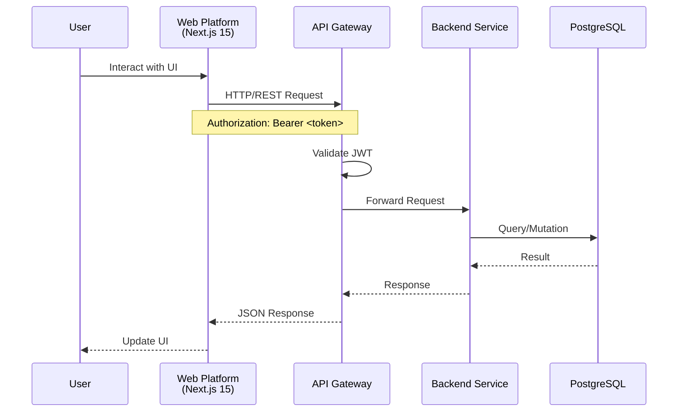

**Integration Details:**
- **Protocol:** HTTPS/REST, WebSocket (for real-time features)
- **Authentication:** JWT tokens in Authorization header
- **Data Format:** JSON
- **Error Handling:** Standard HTTP status codes with error details
- **Rate Limiting:** Enforced at Gateway layer
- **Caching:** Redis-backed caching for static resources

### Desktop Platform Integration

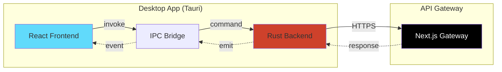

**Integration Details:**
- **Frontend-Backend:** Tauri IPC commands and events
- **Backend-Gateway:** HTTPS/REST with client certificates
- **Local Storage:** SQLite for offline data
- **Sync Strategy:** Delta sync on connection restore
- **Security:** Native keychain for token storage

### Mobile Platform Integration

**Integration Details:**
- **Protocol:** HTTPS/REST with mobile-optimized payloads
- **Offline Support:** Local SQLite with background sync
- **Authentication:** OAuth 2.0 with refresh tokens
- **Push Notifications:** FCM (Android), APNs (iOS)
- **Data Compression:** gzip for large payloads

### CLI Platform Integration

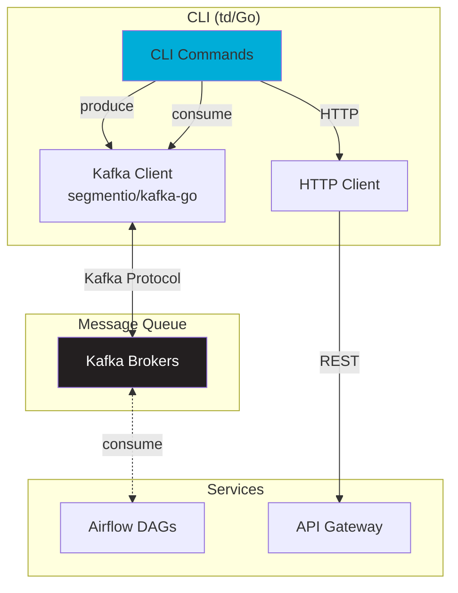

**Integration Details:**
- **Primary:** Kafka for event-driven workflows
- **Secondary:** REST API for queries and management
- **Topics:** tundra-beads-created, tundra-beads-work, tundra-beads-completed
- **Authentication:** API keys for REST, mTLS for Kafka (production)
- **Reliability:** At-least-once delivery, idempotent handlers

---

## Service Integration Patterns

### Synchronous Integration (HTTP/REST)

**Use Cases:**
- User-initiated actions requiring immediate response
- CRUD operations
- Health checks and status queries

**Pattern:**

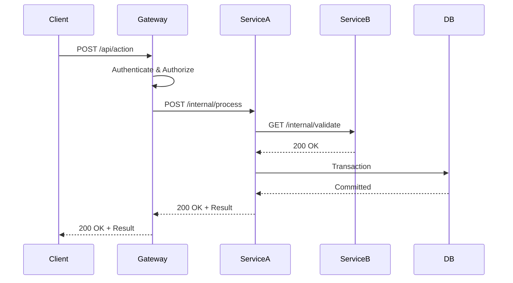

**Implementation:**
- **Timeout:** 30s default, 60s for AI operations
- **Retries:** 3 attempts with exponential backoff
- **Circuit Breaker:** Open after 5 consecutive failures
- **Monitoring:** Request tracing via Datadog APM

### Asynchronous Integration (Message Queue)

**Use Cases:**
- Event notifications
- Background processing
- Cross-service workflows
- Audit logging

**Pattern:**

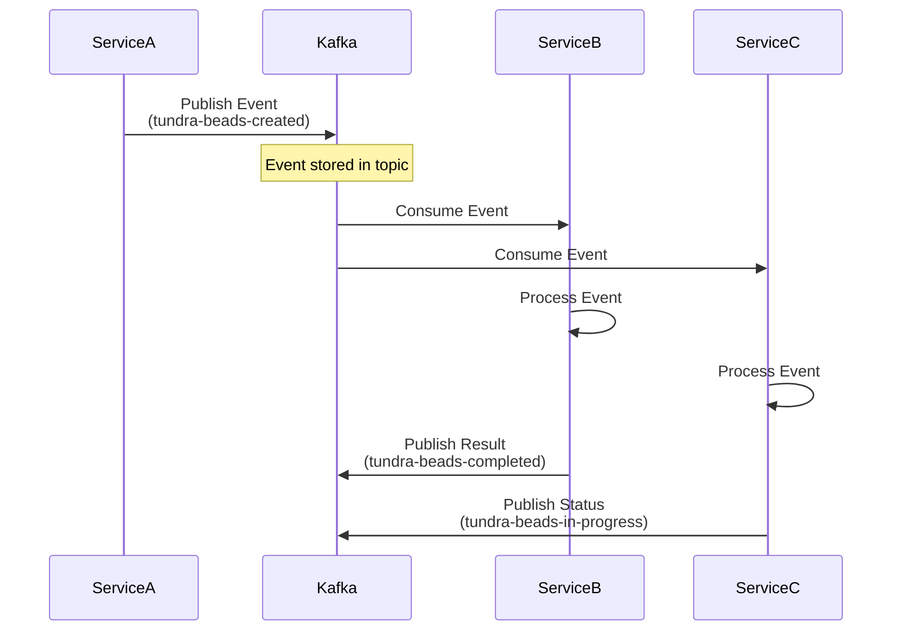

**Kafka Topics:**

| Topic | Producer | Consumer | Purpose | Retention |
|-------|----------|----------|---------|-----------|
| `tundra-beads-created` | rig, td | airflow, td | New task creation | 7 days |
| `tundra-beads-work` | td | airflow, td | Work assignment | 7 days |
| `tundra-beads-in-progress` | td | td | Status updates | 3 days |
| `tundra-beads-completed` | td | airflow, td | Completion events | 30 days |
| `tundra-nudges` | td | td | Notifications | 3 days |
| `gitea-webhooks` | gitea-bridge | td | Git events | 7 days |

**Implementation:**
- **Partitioning:** By user_id or workspace_id for ordering
- **Consumer Groups:** One per service for load balancing
- **Delivery Guarantee:** At-least-once with idempotent handlers
- **Dead Letter Queue:** Failed messages after 3 retries
- **Monitoring:** Lag monitoring, throughput metrics

### WebSocket Integration (Real-Time)

**Use Cases:**
- Live chat
- Real-time collaboration
- Notification streams
- Live updates

**Pattern:**

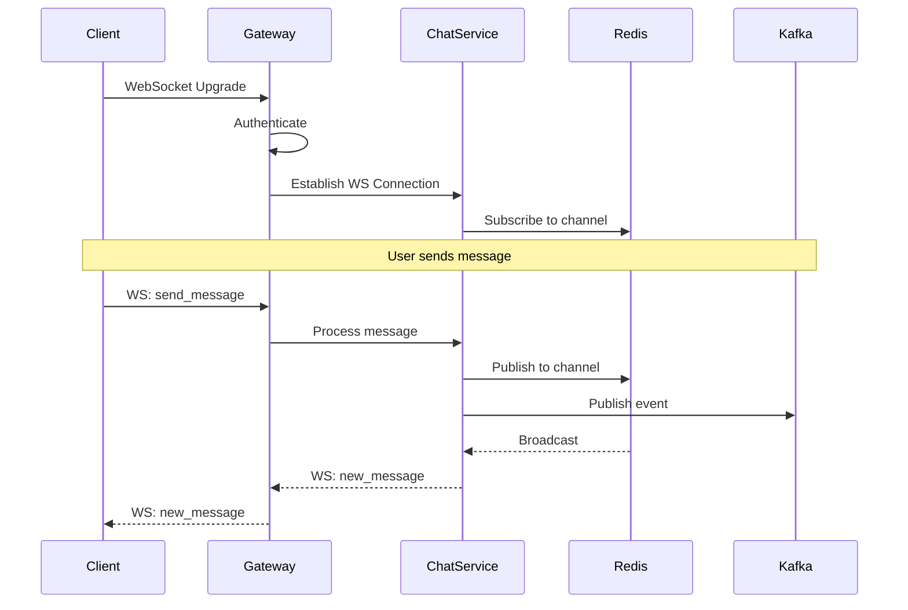

**Implementation:**
- **Connection Pool:** Redis for pub/sub across instances
- **Heartbeat:** 30s ping/pong for connection health
- **Reconnection:** Exponential backoff, max 5 attempts
- **Message Queue:** In-memory queue with overflow to Kafka
- **Authentication:** JWT validation on upgrade

---

## Infrastructure Integration

### Database Integration

#### PostgreSQL Primary Database

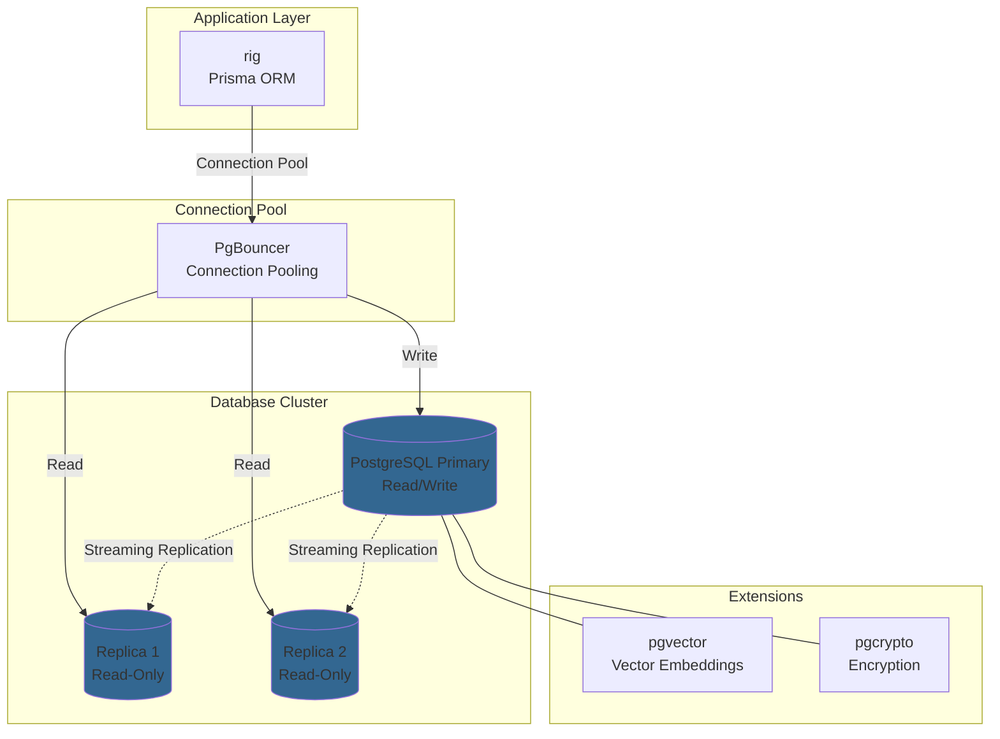

**Configuration:**
- **Connection Pool:** Max 100 connections, 20s timeout
- **Read Replicas:** 2 replicas with lag < 100ms
- **Transactions:** SERIALIZABLE for critical operations
- **Migrations:** Prisma migrate with zero-downtime strategy
- **Backup:** Continuous archiving + daily snapshots

#### Redis/Valkey Cache

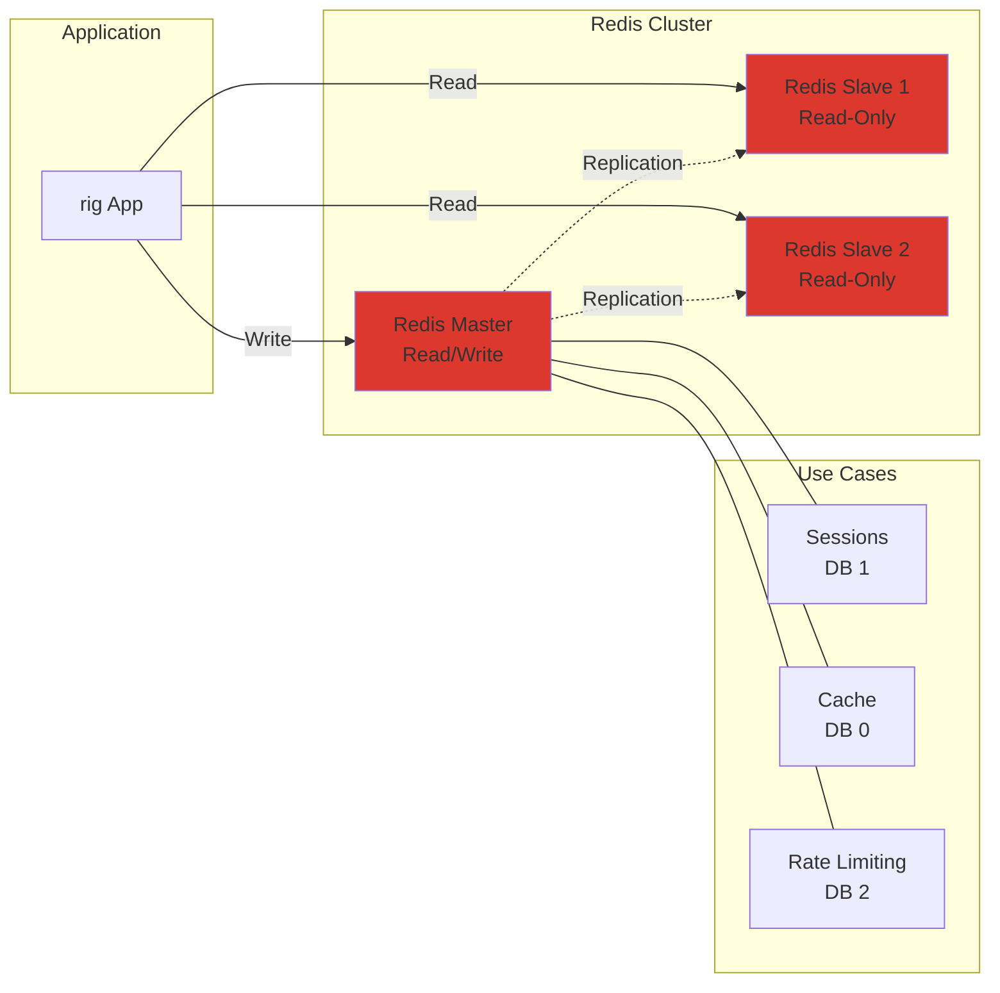

**Configuration:**
- **Topology:** 1 master + 2 slaves with Sentinel
- **Databases:** DB 0 (cache), DB 1 (sessions), DB 2 (rate limits)
- **Eviction:** LRU for cache DB, no eviction for sessions
- **TTL:** 5s (health checks), 3600s (API responses), 86400s (sessions)
- **Persistence:** RDB snapshots every 60s if 1000+ keys changed

### Monitoring Integration

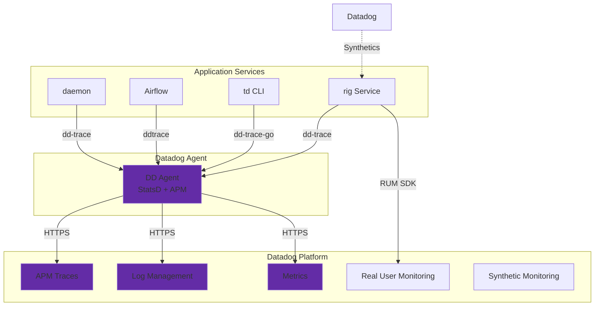

**Integration Points:**
- **APM:** Distributed tracing across all services
- **Logs:** JSON structured logs with correlation IDs
- **Metrics:** Custom metrics, system metrics, business metrics
- **RUM:** Frontend performance and user sessions
- **Synthetics:** API and browser tests every 5 minutes
- **Alerts:** PagerDuty integration for critical alerts

### Secrets Management

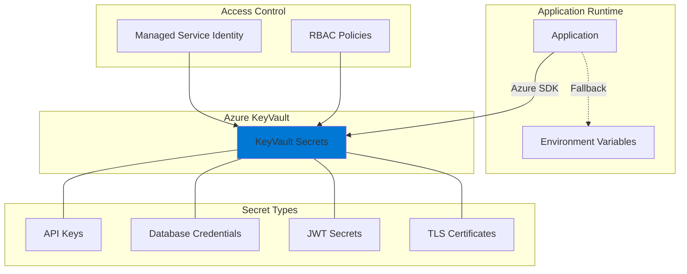

**Configuration:**
- **Access:** Managed Service Identity for Azure resources
- **Rotation:** Automatic 90-day rotation for DB credentials
- **Caching:** 5-minute local cache to reduce API calls
- **Fallback:** Environment variables for local development
- **Auditing:** All secret access logged to Azure Monitor

---

## Data Flow Patterns

### User Request Flow

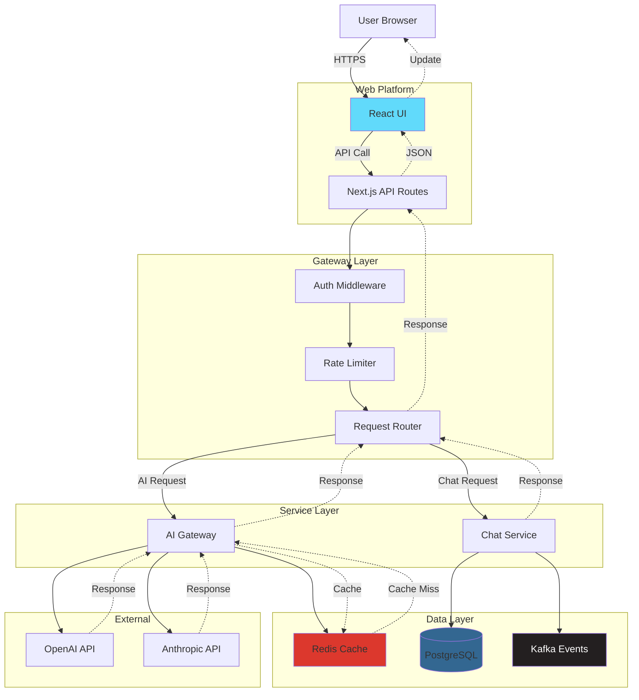

### Background Job Flow

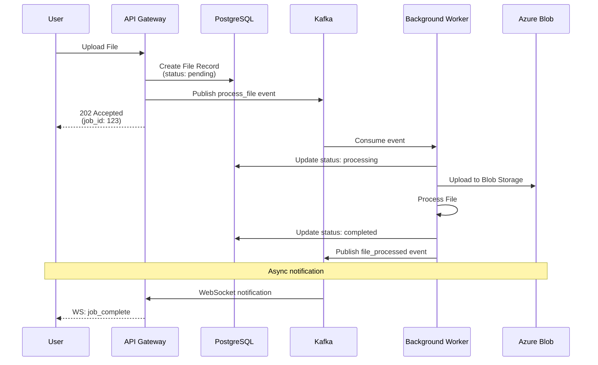

### Event-Driven Workflow

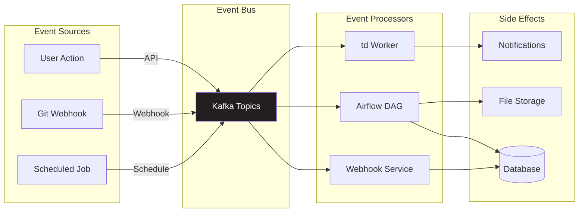

---

## Communication Protocols

### Protocol Selection Matrix

| Use Case | Protocol | Latency | Reliability | Complexity |
|----------|----------|---------|-------------|------------|
| User API calls | HTTP/REST | 50-200ms | High | Low |
| Real-time chat | WebSocket | <10ms | Medium | Medium |
| Service-to-service sync | HTTP/gRPC | 10-50ms | High | Medium |
| Event streaming | Kafka | 5-20ms | Very High | High |
| Caching | Redis Protocol | <5ms | Medium | Low |
| Database | PostgreSQL Protocol | 5-20ms | Very High | Low |
| File transfer | HTTPS + Multipart | Varies | High | Low |

### REST API Standards

**Endpoint Naming:**
```
GET    /api/v1/resources          # List resources
GET    /api/v1/resources/:id      # Get single resource
POST   /api/v1/resources          # Create resource
PUT    /api/v1/resources/:id      # Update resource (full)
PATCH  /api/v1/resources/:id      # Update resource (partial)
DELETE /api/v1/resources/:id      # Delete resource
```

**Response Format:**
```json
{
  "success": true,
  "data": { ... },
  "meta": {
    "timestamp": "2026-02-28T10:00:00Z",
    "request_id": "uuid-v4"
  },
  "errors": []
}
```

**Error Response:**
```json
{
  "success": false,
  "errors": [
    {
      "code": "VALIDATION_ERROR",
      "message": "Invalid email format",
      "field": "email"
    }
  ],
  "meta": {
    "timestamp": "2026-02-28T10:00:00Z",
    "request_id": "uuid-v4"
  }
}
```

### WebSocket Protocol

**Connection Lifecycle:**
```
1. Client: HTTP Upgrade Request
2. Server: 101 Switching Protocols
3. Server: {type: "connection_ack", data: {session_id}}
4. Client/Server: Bidirectional messages
5. Client/Server: Ping/Pong (30s interval)
6. Client/Server: Close frame
```

**Message Format:**
```json
{
  "type": "message|subscribe|unsubscribe|ping|pong",
  "channel": "chat:room:123",
  "data": { ... },
  "meta": {
    "timestamp": "2026-02-28T10:00:00Z",
    "message_id": "uuid-v4"
  }
}
```

---

## Integration Security

### Authentication Layers

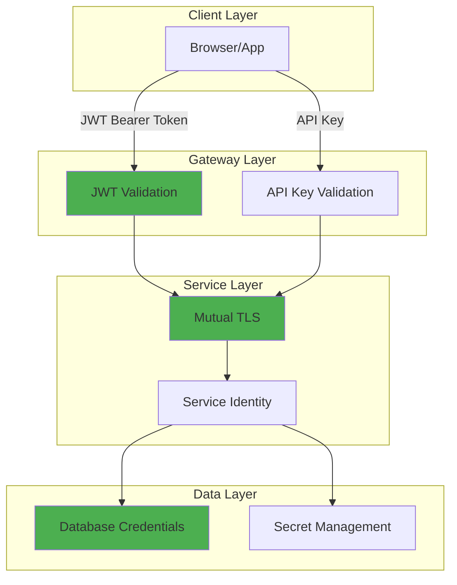

### Security Controls

| Layer | Control | Implementation |
|-------|---------|----------------|
| **Transport** | TLS 1.3 | All external communication |
| **Application** | JWT | RS256, 1h expiry, refresh tokens |
| **Service** | mTLS | Internal service-to-service |
| **Data** | Encryption at rest | AES-256 for sensitive fields |
| **Network** | Network policies | K8s NetworkPolicy, Azure NSG |
| **Secrets** | KeyVault | Azure KeyVault with RBAC |

### Authorization Model

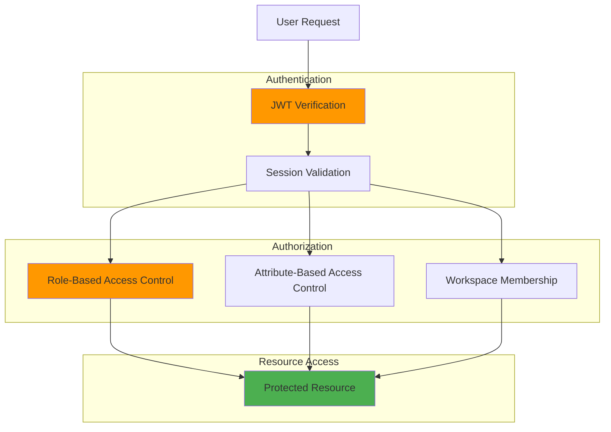

**Roles:**
- `admin` - Full system access
- `user` - Standard user permissions
- `viewer` - Read-only access
- `service` - Service-to-service communication

**Workspace Permissions:**
- `owner` - Full workspace control
- `editor` - Read/write access
- `viewer` - Read-only access

---

## Failure Modes and Resilience

### Circuit Breaker Pattern

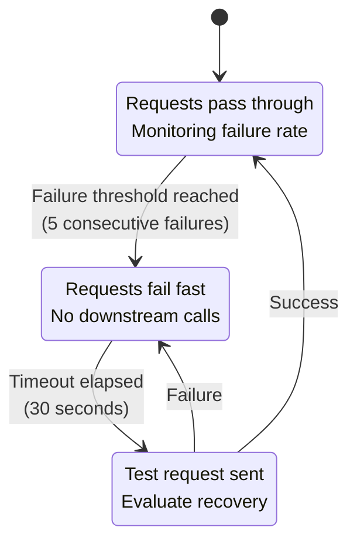

**Configuration:**
- **Failure Threshold:** 5 consecutive failures or 50% error rate
- **Timeout:** 30 seconds before attempting recovery
- **Half-Open Test:** Single request to verify recovery
- **Monitoring:** Circuit state exposed as Datadog metric

### Retry Strategy

**Exponential Backoff:**
```
Attempt 1: Immediate
Attempt 2: 1 second
Attempt 3: 2 seconds
Attempt 4: 4 seconds
Max: 3 retries
```

**Retry Conditions:**
- HTTP 5xx errors (server errors)
- Network timeouts
- Connection refused
- DNS resolution failures

**No Retry Conditions:**
- HTTP 4xx errors (client errors, except 429 Rate Limit)
- Authentication failures
- Validation errors

### Graceful Degradation

| Component | Failure Mode | Degraded Behavior |
|-----------|--------------|-------------------|
| **PostgreSQL** | Down | Return 503, queue writes to Kafka |
| **Redis** | Down | Skip cache, direct database access |
| **Kafka** | Down | Store events in PostgreSQL, sync later |
| **AI Provider** | Down | Failover to alternative provider |
| **Datadog** | Down | Log locally, continue operation |
| **KeyVault** | Down | Use cached secrets (5 min TTL) |

### Health Check Strategy

```mermaid
graph TB
    subgraph "Health Check Endpoint"
        Health[/api/health]
    end

    subgraph "Component Checks"
        DB[(PostgreSQL<br/>Status)]
        Cache[(Redis<br/>Status)]
        Queue[Kafka<br/>Status]
        External[External APIs<br/>Status]
    end

    subgraph "Aggregation"
        Overall[Overall Health]
        Details[Component Details]
    end

    Health --> DB
    Health --> Cache
    Health --> Queue
    Health --> External

    DB --> Overall
    Cache --> Overall
    Queue --> Overall
    External --> Overall

    DB --> Details
    Cache --> Details
    Queue --> Details
    External --> Details

    style DB fill:#336791
    style Cache fill:#DC382D
    style Queue fill:#231F20,color:#fff
```

**Health Check Response:**
```json
{
  "status": "healthy|degraded|unhealthy",
  "timestamp": "2026-02-28T10:00:00Z",
  "uptime": 86400,
  "components": {
    "database": {
      "status": "healthy",
      "latency": 5,
      "details": "PostgreSQL 16.1"
    },
    "cache": {
      "status": "healthy",
      "latency": 2,
      "details": "Redis 7.2"
    },
    "kafka": {
      "status": "degraded",
      "latency": 150,
      "details": "High lag on consumer group"
    }
  }
}
```

---

## Integration Best Practices

### Design Principles

1. **Idempotency**
   - All API endpoints support idempotent operations
   - Use idempotency keys for non-idempotent operations
   - Message consumers handle duplicate events

2. **Timeouts**
   - Set explicit timeouts on all external calls
   - Use shorter timeouts for non-critical operations
   - Implement timeout budgets for cascading calls

3. **Rate Limiting**
   - Enforce rate limits at gateway layer
   - Use token bucket algorithm (100 req/min per user)
   - Return `Retry-After` header on 429 responses

4. **Versioning**
   - API versioning in URL path (`/api/v1/`)
   - Support N-1 version compatibility
   - Deprecation notices 90 days before removal

5. **Monitoring**
   - Instrument all integration points
   - Track latency, error rate, throughput
   - Set up alerts for SLA violations

### Common Patterns

#### Request ID Propagation

```
Client → Gateway: X-Request-ID: uuid-1
Gateway → Service A: X-Request-ID: uuid-1
Service A → Service B: X-Request-ID: uuid-1
Service B → Database: /* request_id: uuid-1 */
```

#### Correlation ID for Distributed Tracing

```
User Action → Request ID → Trace ID → Span IDs
                            └─> Service A Span
                                └─> Service B Span
                                    └─> Database Span
```

#### Circuit Breaker + Retry

```typescript
try {
  return await circuitBreaker.execute(async () => {
    return await retry(
      () => externalService.call(),
      { retries: 3, backoff: 'exponential' }
    );
  });
} catch (error) {
  if (error instanceof CircuitBreakerOpenError) {
    // Return cached data or fallback
    return fallbackData;
  }
  throw error;
}
```

### Anti-Patterns to Avoid

❌ **Avoid:**
- Direct database access from platforms
- Synchronous calls to slow external APIs
- Unbounded retry loops
- Chatty API calls (N+1 queries)
- Hardcoded credentials
- Missing timeout configuration
- Ignoring circuit breaker state

✅ **Instead:**
- Route all data access through Gateway/Services
- Use async jobs for slow operations
- Implement exponential backoff with max retries
- Batch API calls, use GraphQL for complex queries
- Use KeyVault or environment variables
- Set explicit timeouts (default: 30s)
- Monitor circuit state and adjust thresholds

---

## Related Documentation

- [Service Dependencies Map](../SERVICE_DEPENDENCIES.md) - Detailed service dependency matrix
- [Folder Structure](../FOLDER_STRUCTURE.md) - Code organization and module boundaries
- [Deployment Architecture](./DEPLOYMENT_ARCHITECTURE.md) - Deployment patterns and infrastructure
- [Agent Orchestration](./AGENT_ORCHESTRATION.md) - AI agent integration patterns
- [AKS Architecture](./AKS_ARCHITECTURE.md) - Kubernetes cluster architecture

---

**Document Maintenance:**
- **Owner:** Platform Architecture Team
- **Review Frequency:** Quarterly
- **Last Review:** 2026-02-28
- **Next Review:** 2026-05-28
