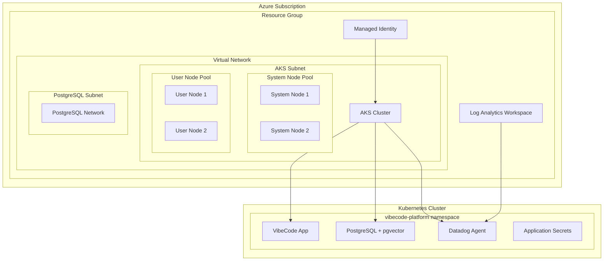

# AKS Infrastructure Deployment Guide

## Overview

This document provides comprehensive guidance for deploying the VibeCode platform to Azure Kubernetes Service (AKS) using OpenTofu (open-source Terraform alternative).

## 🏗️ Architecture

### Infrastructure Components



### Key Features

- **Dual Node Pools**: Separate system and user workloads
- **In-Cluster PostgreSQL**: With pgvector extension for vector operations
- **Datadog Monitoring**: Full observability with Database Monitoring (DBM)
- **Security Hardening**: RBAC, Network Policies, and Secret Management
- **Auto-scaling**: Horizontal Pod Autoscaling and Cluster Autoscaling
- **Rollback Capabilities**: Comprehensive disaster recovery mechanisms

## 🚀 Quick Start

### Prerequisites

1. **Azure CLI** installed and authenticated
2. **OpenTofu v1.7.3+** installed locally
3. **kubectl** for cluster management
4. **Python 3.8+** for deployment scripts
5. **Datadog account** (optional, for monitoring)

### Validation

Run the infrastructure validation script:

```bash
python scripts/validate-infrastructure.py
```

Expected output:
```
✅ Azure authenticated as user@domain.com on subscription 'Subscription Name'
✅ IaC tools available: OpenTofu: OpenTofu v1.7.3
✅ kubectl available: Client Version: v1.32.7
✅ Terraform configuration valid (tofu)
✅ Azure permissions validated for AKS operations
✅ Overall Status: READY FOR DEPLOYMENT
```

## 📝 Configuration

### 1. Environment Variables

Copy the example configuration:

```bash
cp tofu/terraform.tfvars.example tofu/terraform.tfvars
```

Edit `terraform.tfvars` with your values:

```hcl
# Required sensitive variables
postgresql_admin_password = "your-secure-password-here"
nextauth_secret           = "your-nextauth-jwt-secret"

# Datadog configuration (optional but recommended)
datadog_api_key = "your-datadog-api-key"
datadog_app_key = "your-datadog-app-key"
datadog_site    = "datadoghq.com"  # or datadoghq.eu

# Project configuration
project_name        = "vibecode"
environment         = "dev"  # dev, staging, prod
resource_group_name = "rg-vibecode-aks"
location            = "East US 2"

# Application configuration
app_image_tag     = "latest"
ingress_hostname  = "vibecode.eastus2.cloudapp.azure.com"

# Optional external API keys
openrouter_api_key    = "your-openrouter-key"
azure_openai_api_key  = "your-azure-openai-key"
azure_openai_endpoint = "https://your-resource.openai.azure.com/"
```

### 2. Resource Configuration

Key configurable parameters in `aks-variables.tf`:

#### Cluster Sizing
```hcl
# System node pool (for Kubernetes system components)
system_node_count = 2
system_node_min_count = 1
system_node_max_count = 5
system_node_vm_size = "Standard_D2s_v3"

# User node pool (for application workloads)
user_node_count = 2
user_node_min_count = 1
user_node_max_count = 10
user_node_vm_size = "Standard_D4s_v3"
```

#### Storage Configuration
```hcl
postgres_storage_size_gb = 20
log_retention_days = 30
```

#### Security Configuration
```hcl
enable_private_cluster = false
enable_azure_policy = true
enable_pod_security_policy = true
```

## 🚀 Deployment Process

### Option 1: Automated Deployment (Recommended)

```bash
# Run comprehensive infrastructure tests
python scripts/run-infrastructure-tests.py --unit

# Deploy infrastructure with monitoring
python scripts/deploy-aks.py --config config.json
```

### Option 2: Manual OpenTofu Deployment

```bash
cd tofu/

# Initialize OpenTofu
tofu init

# Review the deployment plan
tofu plan -var-file=terraform.tfvars

# Apply the infrastructure
tofu apply -var-file=terraform.tfvars

# Get cluster credentials
az aks get-credentials --resource-group rg-vibecode-aks --name vibecode-dev-aks-SUFFIX
```

### Post-Deployment Verification

```bash
# Check cluster status
kubectl get nodes

# Verify namespace and pods
kubectl get pods -n vibecode-platform

# Check PostgreSQL deployment
kubectl exec -n vibecode-platform -it deployment/postgresql -- psql -U postgres -c "SELECT version();"

# Verify pgvector extension
kubectl exec -n vibecode-platform -it deployment/postgresql -- psql -U postgres -c "CREATE EXTENSION IF NOT EXISTS vector;"

# Check Datadog agent status
kubectl get pods -n vibecode-platform -l app=datadog-agent
```

## 🔧 Infrastructure Components Detail

### OpenTofu Files Structure

```
tofu/
├── providers.tf              # Provider configurations
├── aks-main.tf              # Core AKS infrastructure
├── aks-variables.tf          # Variable definitions
├── aks-outputs.tf            # Output values
├── k8s-postgresql.tf         # PostgreSQL deployment
├── k8s-datadog.tf           # Datadog monitoring
├── k8s-vibecode-app.tf      # Application configuration
├── terraform.tfvars.example # Example variables
└── test.tfvars              # Test configuration
```

### Key Resources Created

#### Azure Resources
- **Resource Group**: Container for all resources
- **Virtual Network**: Isolated network environment
- **AKS Cluster**: Managed Kubernetes service
- **Log Analytics Workspace**: Centralized logging
- **Managed Identity**: Secure authentication
- **Network Security Groups**: Network access control

#### Kubernetes Resources
- **Namespace**: `vibecode-platform`
- **PostgreSQL Deployment**: With pgvector extension
- **Datadog DaemonSet**: Monitoring agent on all nodes
- **Application Secrets**: Secure configuration management
- **RBAC Configuration**: Role-based access control
- **Network Policies**: Pod-to-pod communication rules

### Security Features

#### Network Security
- **Private subnets** for database workloads
- **Network Security Groups** with minimal required access
- **Network Policies** for pod-to-pod communication control
- **Azure CNI** with Azure Network Policy integration

#### Identity and Access Management
- **Azure AD integration** for cluster authentication
- **RBAC** for fine-grained authorization
- **Managed Identity** for secure Azure resource access
- **Service Accounts** with minimal privileges

#### Secret Management
- **Kubernetes Secrets** for sensitive configuration
- **Azure Key Vault integration** (via CSI driver)
- **Datadog API key** stored securely
- **Database credentials** properly encrypted

## 📊 Monitoring and Observability

### Datadog Integration

The deployment includes comprehensive Datadog monitoring:

#### Database Monitoring (DBM)
- **Query performance tracking**
- **PostgreSQL metrics collection**
- **pgvector-specific monitoring**
- **Connection pool monitoring**

#### Custom Metrics
```yaml
# Example custom metrics collected
postgresql.pgvector.vector_count     # Total embeddings stored
postgresql.pgvector.table_size       # Storage utilization
postgresql.pgvector.index_performance # IVFFLAT index metrics
```

#### APM Integration
- **Dynamic Instrumentation** enabled
- **Source map upload** configured
- **Distributed tracing** across services
- **Real User Monitoring** (RUM) ready

### Log Analytics

Azure Log Analytics workspace provides:
- **Centralized logging** for all cluster components
- **Query interface** for troubleshooting
- **Alert rules** for proactive monitoring
- **Metrics integration** with Azure Monitor

## 🔄 Rollback and Disaster Recovery

### Automated Rollback

The infrastructure includes several rollback mechanisms:

#### OpenTofu State Management
```bash
# Create backup before changes
tofu state pull > backup.tfstate

# Rollback to previous state if needed
tofu state push backup.tfstate
tofu plan -destroy -target=specific_resource
```

#### Kubernetes Rollback
```bash
# Application deployment rollback
kubectl rollout undo deployment/vibecode-app -n vibecode-platform

# PostgreSQL data backup (manual)
kubectl exec -n vibecode-platform deployment/postgresql -- pg_dump -U postgres vibecode > backup.sql
```

#### Azure Resource Recovery
```bash
# Resource group soft delete protection
az group lock create --lock-type CanNotDelete --name DeletionLock --resource-group rg-vibecode-aks
```

### Backup Strategies

#### Database Backups
- **Automated daily backups** via Kubernetes CronJob
- **Retention policy**: 7-35 days configurable
- **Point-in-time recovery** capability

#### Infrastructure Backups
- **OpenTofu state backup** to Azure Storage
- **Configuration versioning** via Git
- **Disaster recovery runbook** documented

## 🧪 Testing

### Infrastructure Tests

Run the comprehensive test suite:

```bash
# Unit tests for configuration validation
python scripts/run-infrastructure-tests.py --unit

# Integration tests (if configured)
python scripts/run-infrastructure-tests.py --integration

# Full end-to-end tests
python scripts/run-infrastructure-tests.py --e2e
```

Test coverage includes:
- **OpenTofu syntax validation**
- **Resource constraint verification**
- **Security configuration testing**
- **Network policy validation**
- **Database connectivity testing**
- **Monitoring integration verification**

### Performance Testing

Validate cluster performance:

```bash
# Node resource utilization
kubectl top nodes

# Pod resource consumption
kubectl top pods -n vibecode-platform

# PostgreSQL performance
kubectl exec -n vibecode-platform -it deployment/postgresql -- pgbench -i -s 10 vibecode
kubectl exec -n vibecode-platform -it deployment/postgresql -- pgbench -c 10 -j 2 -t 1000 vibecode
```

## 🔧 Troubleshooting

### Common Issues

#### 1. OpenTofu Validation Errors
```bash
# Check for missing variables
tofu validate

# Common fix: ensure all required variables are defined
grep -r "var\." *.tf | grep -v "\.tf:" | sort | uniq
```

#### 2. Azure Authentication Issues
```bash
# Re-authenticate with Azure CLI
az login
az account set --subscription "your-subscription-id"

# Verify permissions
az role assignment list --assignee $(az account show --query user.name -o tsv)
```

#### 3. Kubernetes Deployment Issues
```bash
# Check pod status
kubectl describe pod -n vibecode-platform <pod-name>

# View logs
kubectl logs -n vibecode-platform <pod-name> -f

# Check resource constraints
kubectl describe nodes
```

#### 4. PostgreSQL Connection Issues
```bash
# Test database connectivity
kubectl exec -n vibecode-platform -it deployment/postgresql -- psql -U postgres -c "SELECT 1;"

# Check pgvector extension
kubectl exec -n vibecode-platform -it deployment/postgresql -- psql -U postgres -c "SELECT * FROM pg_extension WHERE extname='vector';"
```

### Debugging Tools

#### Infrastructure Debugging
```bash
# OpenTofu debugging
export TF_LOG=DEBUG
tofu plan -var-file=terraform.tfvars

# Azure CLI debugging
az --debug group show --name rg-vibecode-aks
```

#### Application Debugging
```bash
# Application logs
kubectl logs -n vibecode-platform deployment/vibecode-app -f

# Database logs
kubectl logs -n vibecode-platform deployment/postgresql -f

# Datadog agent logs
kubectl logs -n vibecode-platform daemonset/datadog-agent -f
```

## 📚 Additional Resources

### Official Documentation
- [OpenTofu Documentation](https://opentofu.org/docs/)
- [Azure AKS Documentation](https://docs.microsoft.com/en-us/azure/aks/)
- [PostgreSQL Documentation](https://www.postgresql.org/docs/)
- [pgvector Documentation](https://github.com/pgvector/pgvector)
- [Datadog Kubernetes Documentation](https://docs.datadoghq.com/agent/kubernetes/)

### Internal Documentation
- [Development Setup](./DEVELOPMENT_SETUP.md)
- [Security Guidelines](./SECURITY_GUIDELINES.md)
- [Monitoring Runbook](./MONITORING_RUNBOOK.md)
- [Disaster Recovery Plan](./DISASTER_RECOVERY.md)

### Support
For deployment issues or questions:
1. Check the troubleshooting section above
2. Review the [GitHub Issues](https://github.com/your-org/vibecode/issues)
3. Consult the [Architecture Decision Records](./ADR/)

---

**Last Updated**: December 2024
**Version**: 1.0
**OpenTofu Version**: v1.7.3
**AKS API Version**: 2023-09-01