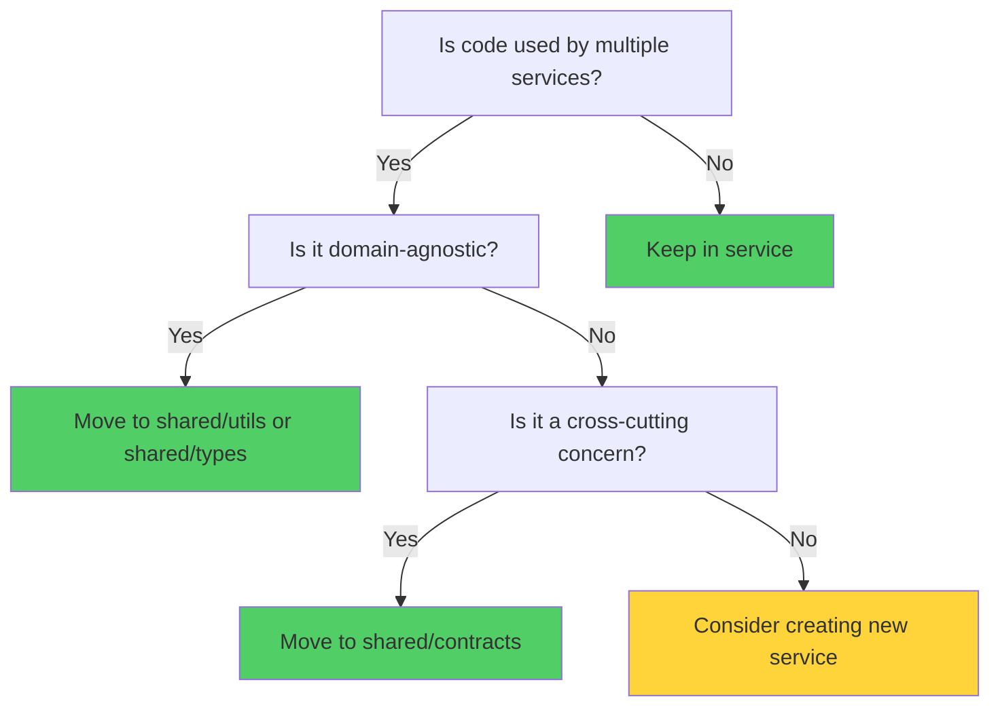
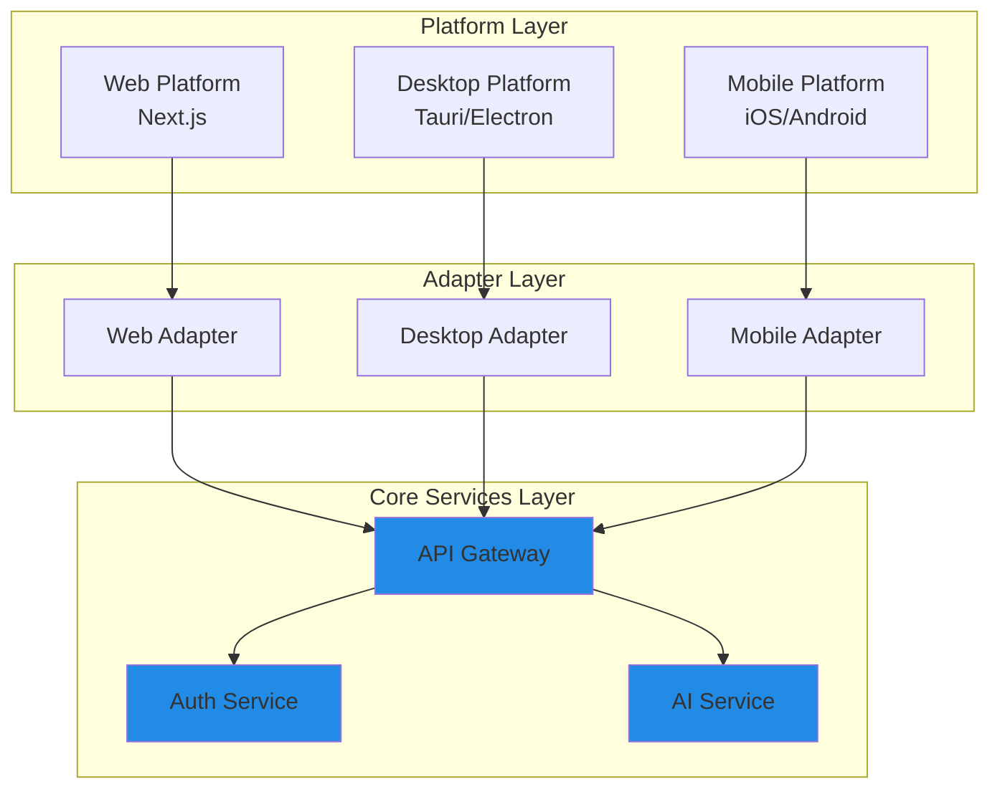
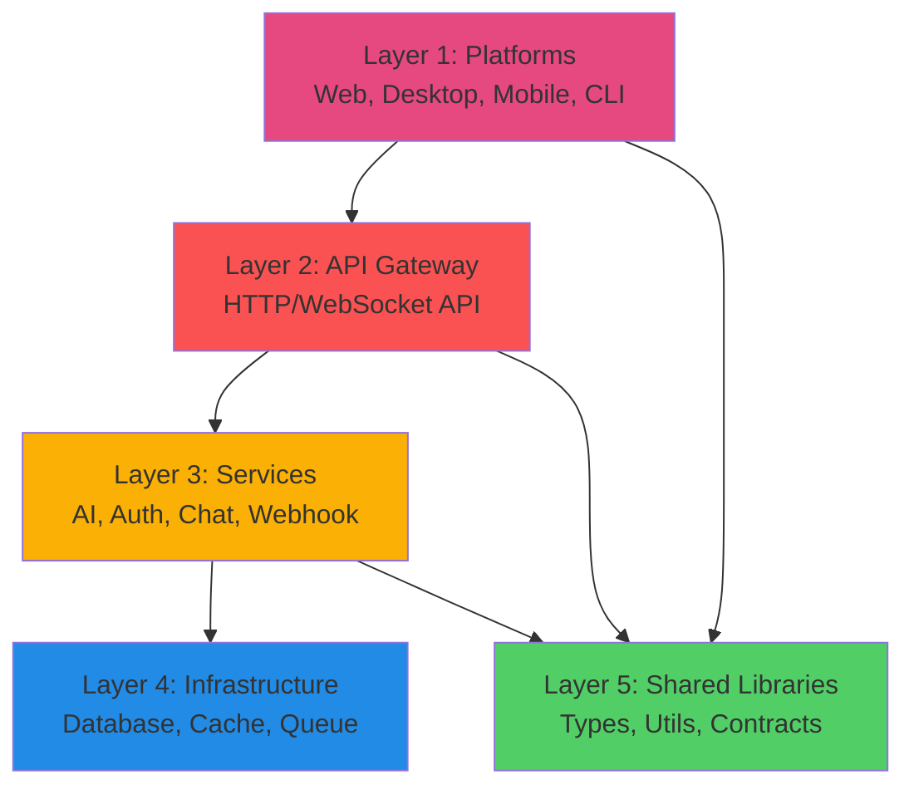

# Folder Organization Principles

This document defines the core principles that guide the modular folder structure for VibeCode's multi-service architecture. These principles address the pain points identified in the [current structure analysis](../analysis/pain-points.md) and prevent the circular dependencies documented in the [dependency map](../analysis/dependency-map.md).

## Table of Contents

1. [Guiding Principles](#guiding-principles)
2. [Service Isolation](#service-isolation)
3. [DRY Principle (Don't Repeat Yourself)](#dry-principle-dont-repeat-yourself)
4. [Platform Separation](#platform-separation)
5. [Dependency Direction Rules](#dependency-direction-rules)
6. [Configuration Strategy](#configuration-strategy)
7. [Testing Organization](#testing-organization)
8. [Documentation Alignment](#documentation-alignment)
9. [Naming Conventions](#naming-conventions)
10. [Governance & Enforcement](#governance--enforcement)

---

## Guiding Principles

### Principle 1: Service Isolation

**Core Tenet:** Each service should be independently deployable, testable, and maintainable.

**Definition:**
- A **service** is a cohesive unit of functionality with clear boundaries
- Services communicate via well-defined interfaces (HTTP APIs, message queues)
- Services do not share code via direct imports (use shared libraries instead)
- Each service owns its domain logic, data models, and business rules

**Benefits:**
- Independent deployment and versioning
- Team autonomy (different teams can own different services)
- Fault isolation (one service failure doesn't cascade)
- Technology flexibility (services can use different tech stacks)

**Implementation:**
```
services/
├── ai-gateway/          # AI model routing and orchestration
│   ├── src/
│   ├── tests/
│   ├── package.json     # Independent dependencies
│   ├── tsconfig.json    # Service-specific TS config
│   └── README.md        # Service documentation
├── auth-service/        # Authentication and authorization
├── webhook-service/     # Webhook event processing
└── chat-service/        # Chat functionality
```

**Anti-Pattern:**
```typescript
// ❌ BAD: Service importing from another service
// services/ai-gateway/src/index.ts
import { webhookHandler } from '../../webhook-service/src/handler'

// ✅ GOOD: Service calling another service via API
const response = await fetch('http://webhook-service/api/webhook', {
  method: 'POST',
  body: JSON.stringify(data)
})
```

---

### Principle 2: DRY (Don't Repeat Yourself)

**Core Tenet:** Shared code should be extracted to reusable libraries, not duplicated across services.

**Definition:**
- **Shared libraries** are code packages used by multiple services
- Libraries must have zero or minimal dependencies
- Libraries are versioned independently
- Services depend on libraries, never the reverse

**Benefits:**
- Single source of truth for shared logic
- Consistent behavior across services
- Easier to maintain and update
- Reduces codebase size and complexity

**Implementation:**
```
shared/
├── types/               # Shared TypeScript types and interfaces
│   ├── src/
│   │   ├── api/        # API contract types
│   │   ├── models/     # Data model types
│   │   └── common/     # Common utility types
│   ├── package.json
│   └── tsconfig.json
├── utils/              # Shared utility functions
│   ├── src/
│   │   ├── validation/ # Input validation
│   │   ├── formatting/ # Data formatting
│   │   └── crypto/     # Cryptographic utilities
│   └── package.json
├── contracts/          # API contracts and schemas
│   ├── openapi/        # OpenAPI specifications
│   └── protobuf/       # Protocol buffer definitions
└── components/         # Shared UI components (for frontend)
    ├── src/
    │   ├── atoms/      # Basic components
    │   ├── molecules/  # Composite components
    │   └── organisms/  # Complex components
    └── package.json
```

**Shared vs Service-Specific Decision Tree:**



**Anti-Pattern:**
```typescript
// ❌ BAD: Duplicated validation logic across services
// services/ai-gateway/src/validate.ts
export function validateEmail(email: string) { /* ... */ }

// services/auth-service/src/validate.ts
export function validateEmail(email: string) { /* ... */ }  // Duplicate!

// ✅ GOOD: Shared validation library
// shared/utils/src/validation/email.ts
export function validateEmail(email: string) { /* ... */ }

// services/ai-gateway/src/index.ts
import { validateEmail } from '@vibecode/utils/validation'
```

---

### Principle 3: Platform Separation

**Core Tenet:** Platform-specific code must be isolated from core business logic.

**Definition:**
- **Platform** refers to runtime environment (web, desktop, mobile, CLI)
- **Platform adapters** translate platform-specific APIs to core interfaces
- Core services are platform-agnostic
- Platform code depends on core, never the reverse

**Benefits:**
- Add new platforms without changing core logic
- Platform teams work independently
- Easier to test core logic (no platform mocking needed)
- Consistent behavior across platforms

**Implementation:**
```
platforms/
├── web/                # Web application (Next.js)
│   ├── src/
│   │   ├── app/       # Next.js App Router
│   │   ├── components/
│   │   └── adapters/  # Platform-specific adapters
│   └── package.json
├── desktop/
│   ├── tauri/         # Tauri desktop wrapper
│   │   ├── src-tauri/ # Rust backend
│   │   └── src/       # Frontend (uses web build)
│   └── electron/      # Electron desktop wrapper (alternative)
├── mobile/
│   ├── ios/           # Native iOS app (Swift)
│   └── android/       # Native Android app (Kotlin)
├── macos/             # macOS menubar app (Swift)
└── cli/               # Command-line interface (Node.js)
    ├── src/
    │   ├── commands/
    │   └── adapters/  # CLI-specific adapters
    └── package.json
```

**Platform Adapter Pattern:**



**Anti-Pattern:**
```typescript
// ❌ BAD: Core service with platform-specific code
// services/ai-gateway/src/index.ts
import { ipcRenderer } from 'electron'  // Platform-specific!

if (ipcRenderer) {
  // Electron-specific logic
}

// ✅ GOOD: Platform adapter handles platform-specific code
// platforms/desktop/electron/src/adapters/ai-adapter.ts
import { ipcRenderer } from 'electron'

export class ElectronAIAdapter implements AIAdapter {
  async sendMessage(message: string) {
    return ipcRenderer.invoke('ai:send', message)
  }
}

// Core service remains platform-agnostic
// services/ai-gateway/src/index.ts
export class AIGateway {
  constructor(private adapter: AIAdapter) {}

  async sendMessage(message: string) {
    return this.adapter.sendMessage(message)
  }
}
```

---

## Dependency Direction Rules

**Core Tenet:** Dependencies must flow in one direction to prevent circular dependencies.

### The Dependency Hierarchy



### Rules

1. **Higher layers can depend on lower layers**
   - Platforms → API Gateway ✅
   - API Gateway → Services ✅
   - Services → Infrastructure ✅

2. **Lower layers CANNOT depend on higher layers**
   - Infrastructure → Services ❌
   - Services → API Gateway ❌
   - API Gateway → Platforms ❌

3. **All layers can depend on Shared Libraries**
   - Shared libraries are the foundation
   - They have zero dependencies on application code

4. **Services CANNOT depend on other services directly**
   - Use API calls or message queues
   - Never import code from another service

5. **Platforms CANNOT share code**
   - Each platform is independent
   - Use API Gateway for all cross-platform communication

### Enforcement

**Tooling:**
```json
// .dependency-cruiser.js
module.exports = {
  forbidden: [
    {
      name: 'no-circular',
      severity: 'error',
      from: {},
      to: { circular: true }
    },
    {
      name: 'services-cannot-import-services',
      severity: 'error',
      from: { path: '^services/[^/]+' },
      to: { path: '^services/[^/]+', pathNot: '^services/[^/]+/node_modules' }
    },
    {
      name: 'infrastructure-cannot-import-services',
      severity: 'error',
      from: { path: '^infrastructure/' },
      to: { path: '^services/' }
    }
  ]
}
```

**ESLint Rules:**
```json
// .eslintrc.js
{
  "rules": {
    "import/no-cycle": ["error", { "maxDepth": 1 }],
    "import/no-restricted-paths": ["error", {
      "zones": [
        {
          "target": "./services",
          "from": "./platforms",
          "message": "Services cannot import from platforms"
        },
        {
          "target": "./infrastructure",
          "from": "./services",
          "message": "Infrastructure cannot import from services"
        }
      ]
    }]
  }
}
```

---

## Configuration Strategy

**Core Tenet:** Configuration should be centralized, environment-aware, and type-safe.

### Configuration Hierarchy

```
config/
├── base/               # Base configuration (all environments)
│   ├── app.ts         # Application settings
│   ├── features.ts    # Feature flags
│   └── constants.ts   # Constants
├── environments/       # Environment-specific overrides
│   ├── development.ts
│   ├── staging.ts
│   ├── production.ts
│   └── test.ts
├── services/          # Service-specific configuration
│   ├── ai-gateway.ts
│   ├── auth-service.ts
│   └── webhook-service.ts
└── platforms/         # Platform-specific configuration
    ├── web.ts
    ├── desktop.ts
    └── mobile.ts
```

### Configuration Principles

1. **Environment Variables for Secrets**
   - Never commit secrets to version control
   - Use `.env` files for local development
   - Use secret management for production (Azure Key Vault, AWS Secrets Manager)

2. **Feature Flags for Gradual Rollout**
   - New features behind flags
   - Enable/disable without code changes
   - A/B testing support

3. **Type-Safe Configuration**
   - Define configuration schemas with TypeScript
   - Validate on startup
   - Fail fast on invalid configuration

**Example:**
```typescript
// config/base/app.ts
import { z } from 'zod'

export const AppConfigSchema = z.object({
  port: z.number().int().min(1000).max(65535),
  nodeEnv: z.enum(['development', 'staging', 'production', 'test']),
  apiBaseUrl: z.string().url(),
  logLevel: z.enum(['debug', 'info', 'warn', 'error']),
  features: z.object({
    aiChat: z.boolean(),
    codebaseRAG: z.boolean(),
    multiLanguageSupport: z.boolean()
  })
})

export type AppConfig = z.infer<typeof AppConfigSchema>

// Validate on startup
export function loadConfig(): AppConfig {
  const config = AppConfigSchema.parse({
    port: parseInt(process.env.PORT || '3000'),
    nodeEnv: process.env.NODE_ENV || 'development',
    apiBaseUrl: process.env.API_BASE_URL || 'http://localhost:3000',
    logLevel: process.env.LOG_LEVEL || 'info',
    features: {
      aiChat: process.env.FEATURE_AI_CHAT === 'true',
      codebaseRAG: process.env.FEATURE_CODEBASE_RAG === 'true',
      multiLanguageSupport: process.env.FEATURE_MULTI_LANGUAGE === 'true'
    }
  })

  return config
}
```

---

## Testing Organization

**Core Tenet:** Tests should be colocated with code and organized by type.

### Test Structure

```
services/ai-gateway/
├── src/
│   ├── __tests__/          # Unit tests (colocated)
│   │   ├── gateway.test.ts
│   │   └── router.test.ts
│   ├── gateway.ts
│   └── router.ts
├── tests/
│   ├── integration/        # Integration tests
│   │   ├── api.integration.test.ts
│   │   └── database.integration.test.ts
│   └── e2e/               # End-to-end tests
│       └── chat-flow.e2e.test.ts
└── package.json
```

### Test Principles

1. **Unit Tests:** Test individual functions/classes in isolation
   - Located in `__tests__/` next to source code
   - Fast (milliseconds)
   - No external dependencies (mock everything)
   - Coverage target: 80%+

2. **Integration Tests:** Test service interactions with dependencies
   - Located in `tests/integration/`
   - Moderate speed (seconds)
   - Use Testcontainers for real databases
   - Coverage: Critical paths

3. **End-to-End Tests:** Test complete user flows across services
   - Located in `tests/e2e/`
   - Slow (minutes)
   - Use staging-like environment
   - Coverage: Happy paths and critical flows

4. **Contract Tests:** Verify API contracts between services
   - Located in `tests/contracts/`
   - Use Pact or similar
   - Prevent breaking changes

**Example Test Organization:**
```typescript
// services/ai-gateway/src/__tests__/gateway.test.ts (Unit Test)
import { AIGateway } from '../gateway'
import { mockOpenAI } from './__mocks__/openai'

describe('AIGateway', () => {
  it('should route to correct model', async () => {
    const gateway = new AIGateway({ openai: mockOpenAI })
    const result = await gateway.complete('test prompt', 'gpt-4')
    expect(result.model).toBe('gpt-4')
  })
})

// services/ai-gateway/tests/integration/api.integration.test.ts
import { startTestServer } from '@vibecode/test-utils'
import { GenericContainer } from 'testcontainers'

describe('AI Gateway API Integration', () => {
  let server
  let redis

  beforeAll(async () => {
    // Start real Redis with Testcontainers
    redis = await new GenericContainer('redis:7-alpine').withExposedPorts(6379).start()
    server = await startTestServer({
      redisUrl: `redis://localhost:${redis.getMappedPort(6379)}`
    })
  })

  afterAll(async () => {
    await server.close()
    await redis.stop()
  })

  it('should cache AI responses', async () => {
    const response = await fetch(`${server.url}/api/ai/complete`, {
      method: 'POST',
      body: JSON.stringify({ prompt: 'test' })
    })
    expect(response.status).toBe(200)
  })
})
```

---

## Documentation Alignment

**Core Tenet:** Documentation structure should mirror code structure.

### Documentation Organization

```
docs/
├── architecture/          # Architecture documentation
│   ├── ARCHITECTURE.md   # Main architecture doc
│   ├── ADR/              # Architecture Decision Records
│   └── diagrams/         # Mermaid diagrams
├── services/             # Service-specific docs
│   ├── ai-gateway/
│   │   ├── README.md     # Service overview
│   │   ├── API.md        # API documentation
│   │   └── RUNBOOK.md    # Operations runbook
│   ├── auth-service/
│   └── webhook-service/
├── platforms/            # Platform-specific docs
│   ├── web/
│   ├── desktop/
│   └── mobile/
├── shared/               # Shared library docs
│   ├── types/
│   └── utils/
├── guides/               # How-to guides
│   ├── getting-started.md
│   ├── adding-new-service.md
│   └── deployment.md
└── analysis/             # Analysis and audits
    ├── current-structure-audit.md
    ├── pain-points.md
    └── dependency-map.md
```

### Documentation Principles

1. **Every Service Has a README**
   - What: Purpose of the service
   - Why: Business justification
   - How: Setup and usage instructions
   - APIs: Endpoints and contracts
   - Dependencies: What it depends on

2. **Architecture Decision Records (ADRs)**
   - Document significant decisions
   - Context, Decision, Rationale, Consequences
   - Immutable (new ADRs supersede old ones)

3. **Living Documentation**
   - Keep docs up to date with code
   - Use automated diagram generation where possible
   - Include docs in code review

4. **Runbooks for Operations**
   - Deployment procedures
   - Troubleshooting guides
   - Monitoring and alerting
   - Incident response

**Example Service README:**
```markdown
# AI Gateway Service

## Overview

The AI Gateway service provides centralized routing and orchestration for AI model access across VibeCode. It supports multiple providers (OpenAI, Anthropic, Gemini) and handles rate limiting, caching, and cost optimization.

## Architecture

[Mermaid diagram]

## API

### POST /api/ai/complete

Generates text completion from AI models.

**Request:**
```json
{
  "prompt": "Write a function to...",
  "model": "gpt-4",
  "maxTokens": 1000
}
```

**Response:**
```json
{
  "completion": "function example() { ... }",
  "model": "gpt-4",
  "usage": { "promptTokens": 10, "completionTokens": 50 }
}
```

## Setup

1. Install dependencies: `npm install`
2. Configure environment: `cp .env.example .env`
3. Start service: `npm run dev`

## Dependencies

- Redis (caching)
- PostgreSQL (API key management)
- OpenAI API
- Anthropic API

## Operations

- **Deployment:** See [deployment guide](../../guides/deployment.md)
- **Monitoring:** Datadog dashboard [link]
- **Runbook:** See [RUNBOOK.md](./RUNBOOK.md)
```

---

## Naming Conventions

**Core Tenet:** Consistent naming reduces cognitive load and improves discoverability.

### Directory Naming

| Type | Convention | Example | Rationale |
|------|-----------|---------|-----------|
| **Services** | kebab-case | `ai-gateway/`, `auth-service/` | Consistent, URL-friendly |
| **Platforms** | kebab-case | `web/`, `desktop/`, `macos/` | Matches service convention |
| **Shared Libraries** | kebab-case | `types/`, `utils/`, `contracts/` | Consistency |
| **Configuration** | kebab-case | `config/`, `environments/` | Consistency |
| **Documentation** | UPPERCASE (major) | `README.md`, `API.md`, `RUNBOOK.md` | Visibility |
| **Hidden Directories** | dot-prefix | `.github/`, `.vscode/` | Standard convention |

### File Naming

| Type | Convention | Example | Rationale |
|------|-----------|---------|-----------|
| **TypeScript/JavaScript** | kebab-case | `ai-gateway.ts`, `user-service.ts` | Readability |
| **React Components** | PascalCase | `ChatPanel.tsx`, `LoginForm.tsx` | React convention |
| **Test Files** | match source + suffix | `gateway.test.ts`, `router.spec.ts` | Clear test association |
| **Configuration** | dot-prefix or extension | `.env`, `tsconfig.json` | Standard convention |
| **Constants** | UPPERCASE | `CONSTANTS.ts`, `CONFIG.ts` | Indicates immutability |

### Code Naming

| Type | Convention | Example | Rationale |
|------|-----------|---------|-----------|
| **Classes** | PascalCase | `AIGateway`, `UserService` | TypeScript/OOP convention |
| **Interfaces** | PascalCase + `I` prefix (optional) | `IAIGateway`, `UserRepository` | Clear interface indication |
| **Functions** | camelCase | `validateEmail()`, `sendMessage()` | JavaScript convention |
| **Variables** | camelCase | `userId`, `apiKey` | JavaScript convention |
| **Constants** | UPPER_SNAKE_CASE | `MAX_RETRIES`, `API_BASE_URL` | Indicates constant |
| **Enums** | PascalCase (enum), UPPER_SNAKE_CASE (values) | `enum LogLevel { DEBUG, INFO }` | Clear enum indication |

### Consistency Rules

1. **Singular vs Plural**
   - **Services:** Singular (`auth-service`, not `auth-services`)
   - **Collections:** Plural (`services/`, `platforms/`, `utils/`)
   - **Reason:** Services are singletons, directories contain multiple items

2. **Abbreviations**
   - **Avoid:** Unless widely recognized (`api`, `db`, `ui`)
   - **Expand:** `authentication-service` not `auth-svc`
   - **Reason:** Clarity over brevity

3. **Prefixes/Suffixes**
   - **Services:** `-service` suffix (`ai-gateway-service` or `ai-gateway`)
   - **Tests:** `.test.ts` or `.spec.ts` suffix
   - **Types:** `.types.ts` or `.d.ts` suffix
   - **Reason:** Consistent patterns aid discovery

---

## Governance & Enforcement

**Core Tenet:** Principles are enforced through automation and code review.

### Automated Enforcement

1. **Pre-commit Hooks (Husky)**
   ```json
   // .husky/pre-commit
   #!/bin/sh
   . "$(dirname "$0")/_/husky.sh"

   npm run lint
   npm run test:unit
   npm run check:dependencies
   ```

2. **Dependency Validation**
   ```bash
   # package.json scripts
   {
     "check:dependencies": "depcruise --validate .dependency-cruiser.js src/",
     "check:circular": "madge --circular --extensions ts,tsx src/"
   }
   ```

3. **CI/CD Checks**
   ```yaml
   # .github/workflows/pr-checks.yml
   name: PR Checks
   on: [pull_request]
   jobs:
     validate:
       runs-on: ubuntu-latest
       steps:
         - uses: actions/checkout@v3
         - name: Check circular dependencies
           run: npm run check:circular
         - name: Validate folder structure
           run: npm run check:structure
         - name: Run tests
           run: npm test
   ```

### Code Review Checklist

Every PR must verify:

- [ ] No new circular dependencies introduced
- [ ] Services don't import from other services directly
- [ ] Shared code is in `shared/` not duplicated
- [ ] Platform-specific code is in `platforms/`
- [ ] Configuration follows convention
- [ ] Tests are colocated and pass
- [ ] Documentation updated
- [ ] Naming conventions followed

### Architecture Review

For significant changes:

1. **Create Architecture Decision Record (ADR)**
   - Template: `docs/architecture/ADR/template.md`
   - Review by architecture team
   - Commit decision

2. **Update Dependency Map**
   - Run dependency analysis tools
   - Update diagrams
   - Document new dependencies

3. **Migration Plan**
   - For structural changes, create migration guide
   - Phased rollout plan
   - Rollback strategy

### Monitoring & Metrics

Track architectural health:

1. **Dependency Metrics**
   - Number of circular dependencies (target: 0)
   - Average service coupling score (target: <5)
   - Shared library usage percentage

2. **Code Organization Metrics**
   - Lines of code per service (target: <10,000)
   - Number of top-level directories (target: <20)
   - Test coverage per service (target: >80%)

3. **Developer Experience Metrics**
   - Time to onboard new developers (target: <2 days)
   - Time to add new service (target: <4 hours)
   - Build time (target: <5 minutes)

---

## Summary

The folder organization principles for VibeCode are built on three pillars:

### 1. Service Isolation
- Independent services with clear boundaries
- Communication via APIs and message queues
- Each service independently deployable

### 2. DRY (Don't Repeat Yourself)
- Shared libraries for common code
- Single source of truth
- Versioned, reusable packages

### 3. Platform Separation
- Platform-specific code isolated
- Core services platform-agnostic
- Platform adapters for integration

### Supporting Principles

- **Dependency Direction:** One-way dependencies, no circles
- **Configuration Strategy:** Centralized, type-safe, environment-aware
- **Testing Organization:** Colocated tests by type
- **Documentation Alignment:** Docs mirror code structure
- **Naming Conventions:** Consistent, discoverable naming
- **Governance:** Automated enforcement via tooling

---

## Next Steps

1. **Review & Approve:** Architecture team reviews these principles
2. **Design Proposed Structure:** Apply principles to design target structure
3. **Define Module Boundaries:** Document service interfaces and contracts
4. **Create Migration Plan:** Plan transition from current to target structure
5. **Implement Tooling:** Set up linting, dependency checks, CI/CD
6. **Begin Migration:** Start with highest-impact refactoring

---

**Document Version:** 1.0.0
**Last Updated:** 2026-02-14
**Status:** Active
**Owner:** Architecture Team
**Review Cycle:** Quarterly or as needed

---

## References

- [Current Structure Audit](../analysis/current-structure-audit.md)
- [Pain Points Analysis](../analysis/pain-points.md)
- [Dependency Map](../analysis/dependency-map.md)
- [Main Architecture Documentation](../ARCHITECTURE.md)

