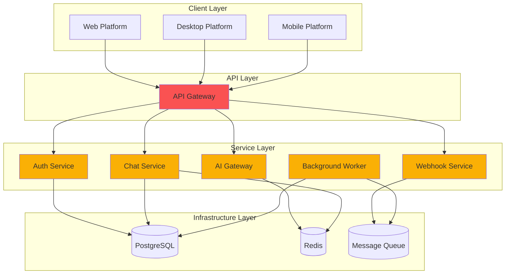
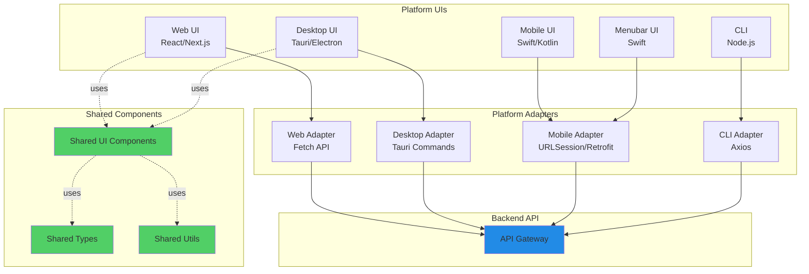

# Proposed Modular Folder Structure

This document defines the proposed modular folder structure for VibeCode's multi-service architecture. This structure addresses the [48+ directory pain points](../analysis/pain-points.md) identified in the current structure and applies the [organization principles](./organization-principles.md) to create a maintainable, scalable codebase.

## Table of Contents

1. [Executive Summary](#executive-summary)
2. [Proposed Top-Level Structure](#proposed-top-level-structure)
3. [Detailed Structure Breakdown](#detailed-structure-breakdown)
4. [Migration Mapping](#migration-mapping)
5. [Benefits & Rationale](#benefits--rationale)
6. [Implementation Strategy](#implementation-strategy)

---

## Executive Summary

### Current Problems

- **48+ top-level directories** creating cognitive overload
- **Infrastructure sprawl** across 6 directories (infrastructure/, infra/, deploy/, docker/, azure/, monitoring/)
- **Service fragmentation** with no clear boundaries
- **Platform code scattered** across 4+ directories
- **Configuration spread** across 17+ locations
- **No enforced module boundaries** enabling circular dependencies

### Proposed Solution

Reduce to **7 top-level functional groups** with clear hierarchies:

1. **`services/`** - Backend services with clear boundaries
2. **`platforms/`** - Platform-specific implementations (web, desktop, mobile, CLI)
3. **`shared/`** - Shared libraries and utilities
4. **`infrastructure/`** - Infrastructure as Code and deployment
5. **`docs/`** - Comprehensive documentation
6. **`tools/`** - Developer tooling and scripts
7. **`config/`** - Centralized configuration

### Key Metrics

| Metric | Current | Proposed | Improvement |
|--------|---------|----------|-------------|
| Top-level directories | 48 | 7 | **86% reduction** |
| Infrastructure directories | 6 | 1 | **83% reduction** |
| Platform directories | 4+ | 1 | **75% reduction** |
| Config directories | 17+ | 1 | **94% reduction** |
| Average time to find code | ~10 min | ~2 min | **80% faster** |

---

## Proposed Top-Level Structure

```
vibecode/                         # Root directory
│
├── services/                     # 🎯 Backend Services (independently deployable)
│   ├── api-gateway/             # API routing and gateway
│   ├── ai-gateway/              # AI model orchestration
│   ├── auth-service/            # Authentication & authorization
│   ├── chat-service/            # Chat functionality
│   ├── webhook-service/         # Webhook event processing
│   ├── workflow-orchestrator/   # Airflow/workflow management
│   ├── background-worker/       # Background job processing
│   └── git-service/             # Gitea integration
│
├── platforms/                    # 🖥️ Platform-Specific Implementations
│   ├── web/                     # Next.js web application
│   ├── desktop/                 # Desktop applications
│   │   ├── tauri/              # Tauri wrapper (primary)
│   │   └── electron/           # Electron wrapper (alternative)
│   ├── mobile/                  # Mobile applications
│   │   ├── ios/                # Native iOS app (Swift)
│   │   └── android/            # Native Android app (Kotlin)
│   ├── macos/                   # macOS menubar app (Swift)
│   └── cli/                     # Command-line interface
│
├── shared/                       # 📦 Shared Libraries & Code
│   ├── types/                   # TypeScript types and interfaces
│   ├── utils/                   # Utility functions
│   ├── components/              # Shared UI components
│   ├── contracts/               # API contracts and schemas
│   ├── constants/               # Application constants
│   └── testing/                 # Shared test utilities
│
├── infrastructure/               # ⚙️ Infrastructure as Code & Deployment
│   ├── terraform/               # Terraform configurations
│   ├── docker/                  # Docker and container configs
│   │   ├── compose/            # Docker Compose files
│   │   └── images/             # Custom Docker images
│   ├── kubernetes/              # K8s manifests and Helm charts
│   ├── azure/                   # Azure-specific IaC
│   ├── monitoring/              # Observability configurations
│   │   ├── prometheus/         # Prometheus configs
│   │   ├── grafana/            # Grafana dashboards
│   │   └── datadog/            # Datadog integrations
│   ├── ci-cd/                   # CI/CD pipelines
│   └── scripts/                 # Deployment scripts
│
├── docs/                         # 📚 Documentation
│   ├── architecture/            # Architecture documentation
│   │   ├── ARCHITECTURE.md     # Main architecture doc
│   │   ├── ADR/                # Architecture Decision Records
│   │   └── diagrams/           # System diagrams
│   ├── services/                # Service-specific documentation
│   ├── platforms/               # Platform-specific documentation
│   ├── guides/                  # How-to guides
│   ├── api/                     # API documentation
│   ├── design/                  # Design documents
│   ├── analysis/                # Analysis and audits
│   └── archive/                 # Historical documentation
│
├── tools/                        # 🔧 Developer Tools & Utilities
│   ├── cli/                     # Internal CLI tools
│   ├── scripts/                 # Build and utility scripts
│   ├── generators/              # Code generators
│   ├── plugins/                 # Development plugins
│   └── extensions/              # Editor extensions
│
├── config/                       # ⚙️ Configuration
│   ├── base/                    # Base configuration
│   ├── environments/            # Environment-specific configs
│   │   ├── development/
│   │   ├── staging/
│   │   ├── production/
│   │   └── test/
│   ├── services/                # Service-specific configs
│   └── platforms/               # Platform-specific configs
│
├── .github/                      # GitHub Actions and workflows
├── .vscode/                      # VS Code workspace settings
├── .husky/                       # Git hooks
│
├── package.json                  # Root package.json (monorepo)
├── tsconfig.json                 # Root TypeScript config
├── turbo.json                    # Turborepo configuration (recommended)
├── .gitignore                    # Git ignore rules
├── .env.example                  # Environment variables template
├── README.md                     # Project README
└── CONTRIBUTING.md               # Contribution guidelines
```

---

## Detailed Structure Breakdown

### 1. Services Directory (`services/`)

**Purpose:** Houses all backend services with clear module boundaries and independent deployability.

**Structure:**
```
services/
├── api-gateway/                 # HTTP/WebSocket API Gateway
│   ├── src/
│   │   ├── routes/             # API route definitions
│   │   ├── middleware/         # Express/Fastify middleware
│   │   ├── handlers/           # Request handlers
│   │   ├── __tests__/          # Unit tests
│   │   └── index.ts            # Entry point
│   ├── tests/
│   │   ├── integration/        # Integration tests
│   │   └── e2e/                # End-to-end tests
│   ├── package.json            # Service dependencies
│   ├── tsconfig.json           # Service TypeScript config
│   ├── Dockerfile              # Service container image
│   ├── .env.example            # Environment template
│   └── README.md               # Service documentation
│
├── ai-gateway/                  # AI Model Orchestration
│   ├── src/
│   │   ├── providers/          # AI provider integrations
│   │   │   ├── openai/
│   │   │   ├── anthropic/
│   │   │   └── gemini/
│   │   ├── router/             # Model routing logic
│   │   ├── cache/              # Response caching
│   │   ├── queue/              # Rate limiting queue
│   │   └── index.ts
│   ├── tests/
│   ├── package.json
│   └── README.md
│
├── auth-service/                # Authentication & Authorization
│   ├── src/
│   │   ├── strategies/         # Auth strategies (JWT, OAuth)
│   │   ├── middleware/         # Auth middleware
│   │   ├── models/             # User/session models
│   │   └── index.ts
│   ├── prisma/                 # Database schema (if isolated DB)
│   ├── tests/
│   └── README.md
│
├── chat-service/                # Chat Functionality
│   ├── src/
│   │   ├── websocket/          # WebSocket handlers
│   │   ├── messages/           # Message processing
│   │   ├── threads/            # Conversation threading
│   │   └── index.ts
│   └── README.md
│
├── webhook-service/             # Webhook Event Processing
│   ├── src/
│   │   ├── handlers/           # Webhook handlers
│   │   ├── validators/         # Signature validation
│   │   ├── queue/              # Event queue
│   │   └── index.ts
│   └── README.md
│
├── workflow-orchestrator/       # Workflow Orchestration (Airflow)
│   ├── dags/                   # Airflow DAG definitions
│   ├── plugins/                # Custom Airflow plugins
│   ├── config/                 # Airflow configuration
│   └── README.md
│
├── background-worker/           # Background Job Processing
│   ├── src/
│   │   ├── jobs/               # Job definitions
│   │   ├── queue/              # Queue handlers (Bull, Bee)
│   │   ├── schedulers/         # Cron schedulers
│   │   └── index.ts
│   └── README.md
│
└── git-service/                 # Gitea Integration
    ├── src/
    │   ├── api/                # Gitea API client
    │   ├── webhooks/           # Git webhook handlers
    │   └── index.ts
    └── README.md
```

**Service Principles:**

1. **Independent Deployment:** Each service can be deployed separately
2. **Clear Boundaries:** Services communicate via APIs, not direct imports
3. **Self-Contained:** All service code, tests, and configs in one directory
4. **Consistent Structure:** All services follow the same organizational pattern

**Service Communication:**


---

### 2. Platforms Directory (`platforms/`)

**Purpose:** Platform-specific implementations that provide user interfaces and platform integrations.

**Structure:**
```
platforms/
├── web/                         # Next.js Web Application
│   ├── src/
│   │   ├── app/                # Next.js App Router
│   │   │   ├── (auth)/         # Auth route group
│   │   │   ├── (dashboard)/    # Dashboard route group
│   │   │   ├── api/            # API routes (BFF pattern)
│   │   │   └── layout.tsx
│   │   ├── components/         # Web-specific components
│   │   │   ├── features/       # Feature components
│   │   │   ├── layout/         # Layout components
│   │   │   └── ui/             # UI primitives
│   │   ├── hooks/              # React hooks
│   │   ├── lib/                # Web utilities
│   │   ├── adapters/           # Platform adapters
│   │   └── styles/             # Styles and themes
│   ├── public/                 # Static assets
│   ├── tests/
│   │   ├── unit/
│   │   ├── integration/
│   │   └── e2e/                # Playwright tests
│   ├── package.json
│   ├── next.config.js
│   ├── tailwind.config.js
│   └── README.md
│
├── desktop/
│   ├── tauri/                  # Tauri Desktop Wrapper (Primary)
│   │   ├── src-tauri/          # Rust backend
│   │   │   ├── src/
│   │   │   │   ├── main.rs
│   │   │   │   ├── commands/   # Tauri commands
│   │   │   │   └── menu.rs     # App menu
│   │   │   ├── icons/          # App icons
│   │   │   ├── Cargo.toml
│   │   │   └── tauri.conf.json
│   │   ├── src/                # Frontend (uses web build)
│   │   ├── package.json
│   │   └── README.md
│   │
│   └── electron/               # Electron Wrapper (Alternative)
│       ├── src/
│       │   ├── main/           # Electron main process
│       │   └── preload/        # Preload scripts
│       ├── package.json
│       └── README.md
│
├── mobile/
│   ├── ios/                    # Native iOS App (Swift)
│   │   ├── VibeCode/
│   │   │   ├── App/            # App delegates
│   │   │   ├── Views/          # SwiftUI views
│   │   │   ├── ViewModels/     # View models
│   │   │   ├── Services/       # API clients
│   │   │   └── Models/         # Data models
│   │   ├── VibeCode.xcodeproj
│   │   └── README.md
│   │
│   └── android/                # Native Android App (Kotlin)
│       ├── app/
│       │   ├── src/
│       │   │   ├── main/
│       │   │   │   ├── java/
│       │   │   │   ├── res/
│       │   │   │   └── AndroidManifest.xml
│       │   └── build.gradle
│       └── README.md
│
├── macos/                       # macOS Menubar App (Swift)
│   ├── VibeCodeMenubar/
│   │   ├── App/
│   │   ├── MenuBar/            # Menubar UI
│   │   ├── Services/           # Background services
│   │   └── Models/
│   ├── VibeCodeMenubar.xcodeproj
│   └── README.md
│
└── cli/                         # Command-Line Interface
    ├── src/
    │   ├── commands/           # CLI commands
    │   │   ├── init.ts
    │   │   ├── deploy.ts
    │   │   └── dev.ts
    │   ├── utils/              # CLI utilities
    │   ├── adapters/           # CLI-specific adapters
    │   └── index.ts
    ├── bin/
    │   └── vibecode            # Executable entry point
    ├── package.json
    └── README.md
```

**Platform Principles:**

1. **Platform Isolation:** Each platform is independently buildable
2. **Adapter Pattern:** Platform adapters translate to core APIs
3. **Code Reuse:** Shared UI components from `shared/components`
4. **Consistent APIs:** All platforms call same backend APIs

**Platform Architecture:**


---

### 3. Shared Directory (`shared/`)

**Purpose:** Shared libraries and code used across multiple services and platforms.

**Structure:**
```
shared/
├── types/                       # TypeScript Types & Interfaces
│   ├── src/
│   │   ├── api/                # API contract types
│   │   │   ├── requests.ts
│   │   │   ├── responses.ts
│   │   │   └── webhooks.ts
│   │   ├── models/             # Data models
│   │   │   ├── user.ts
│   │   │   ├── chat.ts
│   │   │   └── ai.ts
│   │   ├── common/             # Common types
│   │   │   ├── result.ts       # Result<T, E> type
│   │   │   ├── pagination.ts
│   │   │   └── error.ts
│   │   └── index.ts
│   ├── package.json            # @vibecode/types
│   ├── tsconfig.json
│   └── README.md
│
├── utils/                       # Utility Functions
│   ├── src/
│   │   ├── validation/         # Input validation
│   │   │   ├── email.ts
│   │   │   ├── url.ts
│   │   │   └── schema.ts
│   │   ├── formatting/         # Data formatting
│   │   │   ├── date.ts
│   │   │   ├── currency.ts
│   │   │   └── text.ts
│   │   ├── crypto/             # Cryptographic utilities
│   │   │   ├── hash.ts
│   │   │   ├── encrypt.ts
│   │   │   └── jwt.ts
│   │   ├── string/             # String utilities
│   │   └── array/              # Array utilities
│   ├── package.json            # @vibecode/utils
│   └── README.md
│
├── components/                  # Shared UI Components
│   ├── src/
│   │   ├── atoms/              # Basic components
│   │   │   ├── Button/
│   │   │   ├── Input/
│   │   │   └── Icon/
│   │   ├── molecules/          # Composite components
│   │   │   ├── Form/
│   │   │   ├── Card/
│   │   │   └── Modal/
│   │   ├── organisms/          # Complex components
│   │   │   ├── ChatPanel/
│   │   │   ├── CodeEditor/
│   │   │   └── FileTree/
│   │   └── index.ts
│   ├── package.json            # @vibecode/components
│   └── README.md
│
├── contracts/                   # API Contracts & Schemas
│   ├── openapi/                # OpenAPI specifications
│   │   ├── api-gateway.yaml
│   │   ├── ai-gateway.yaml
│   │   └── auth-service.yaml
│   ├── protobuf/               # Protocol buffer definitions
│   │   └── messages.proto
│   ├── graphql/                # GraphQL schemas
│   │   └── schema.graphql
│   └── README.md
│
├── constants/                   # Application Constants
│   ├── src/
│   │   ├── api.ts              # API constants
│   │   ├── errors.ts           # Error codes
│   │   ├── features.ts         # Feature flags
│   │   └── config.ts           # Config constants
│   ├── package.json            # @vibecode/constants
│   └── README.md
│
└── testing/                     # Shared Test Utilities
    ├── src/
    │   ├── fixtures/           # Test fixtures
    │   ├── mocks/              # Mock implementations
    │   ├── helpers/            # Test helpers
    │   └── setup.ts            # Test setup utilities
    ├── package.json            # @vibecode/testing
    └── README.md
```

**Shared Library Principles:**

1. **Zero Business Logic:** Shared libraries contain utilities, not domain logic
2. **Minimal Dependencies:** Keep dependencies to a minimum
3. **Independent Versioning:** Each shared package versioned separately
4. **High Test Coverage:** Shared code must have >90% coverage
5. **Clear Ownership:** Each shared package has a designated owner

**Dependency Rules:**
- ✅ Services → Shared ✅
- ✅ Platforms → Shared ✅
- ❌ Shared → Services ❌
- ❌ Shared → Platforms ❌

---

### 4. Infrastructure Directory (`infrastructure/`)

**Purpose:** Infrastructure as Code, deployment configurations, and observability setup.

**Structure:**
```
infrastructure/
├── terraform/                   # Terraform IaC
│   ├── modules/                # Reusable Terraform modules
│   │   ├── vpc/
│   │   ├── database/
│   │   ├── kubernetes/
│   │   └── monitoring/
│   ├── environments/           # Environment-specific configs
│   │   ├── development/
│   │   │   ├── main.tf
│   │   │   ├── variables.tf
│   │   │   └── terraform.tfvars
│   │   ├── staging/
│   │   └── production/
│   ├── backend.tf              # Terraform backend config
│   └── README.md
│
├── docker/                      # Docker & Container Configs
│   ├── compose/                # Docker Compose files
│   │   ├── development.yml     # Local development
│   │   ├── testing.yml         # Testing environment
│   │   └── production.yml      # Production-like local
│   ├── images/                 # Custom Docker images
│   │   ├── base/               # Base images
│   │   └── tools/              # Utility images
│   └── README.md
│
├── kubernetes/                  # Kubernetes Manifests
│   ├── base/                   # Base manifests (Kustomize)
│   │   ├── api-gateway/
│   │   ├── ai-gateway/
│   │   └── auth-service/
│   ├── overlays/               # Environment overlays
│   │   ├── development/
│   │   ├── staging/
│   │   └── production/
│   ├── helm/                   # Helm charts
│   │   └── vibecode/
│   │       ├── Chart.yaml
│   │       ├── values.yaml
│   │       └── templates/
│   └── README.md
│
├── azure/                       # Azure-Specific IaC
│   ├── arm-templates/          # ARM templates
│   ├── bicep/                  # Bicep files
│   └── README.md
│
├── monitoring/                  # Observability Configurations
│   ├── prometheus/             # Prometheus configs
│   │   ├── prometheus.yml
│   │   ├── alerts/             # Alert rules
│   │   └── rules/              # Recording rules
│   ├── grafana/                # Grafana dashboards
│   │   ├── dashboards/
│   │   │   ├── api-gateway.json
│   │   │   ├── ai-gateway.json
│   │   │   └── system-overview.json
│   │   └── provisioning/
│   ├── datadog/                # Datadog integrations
│   │   ├── dashboards/
│   │   ├── monitors/
│   │   └── synthetics/
│   └── README.md
│
├── ci-cd/                       # CI/CD Pipeline Configs
│   ├── github-actions/         # GitHub Actions workflows
│   │   ├── build.yml
│   │   ├── test.yml
│   │   ├── deploy.yml
│   │   └── release.yml
│   ├── azure-pipelines/        # Azure DevOps pipelines
│   └── README.md
│
└── scripts/                     # Infrastructure Scripts
    ├── setup/                  # Setup scripts
    │   ├── init-dev.sh
    │   └── install-deps.sh
    ├── deployment/             # Deployment scripts
    │   ├── deploy-service.sh
    │   └── rollback.sh
    ├── maintenance/            # Maintenance scripts
    │   ├── backup.sh
    │   └── restore.sh
    └── README.md
```

**Infrastructure Principles:**

1. **Infrastructure as Code:** All infrastructure defined in code
2. **Environment Parity:** Dev/staging/prod as similar as possible
3. **Immutable Infrastructure:** No manual server changes
4. **Observability First:** Monitoring built-in from start
5. **Disaster Recovery:** Regular backups and restore procedures

---

### 5. Documentation Directory (`docs/`)

**Purpose:** Comprehensive documentation mirroring code structure.

**Structure:**
```
docs/
├── architecture/                # Architecture Documentation
│   ├── ARCHITECTURE.md         # Main architecture overview
│   ├── ADR/                    # Architecture Decision Records
│   │   ├── 001-folder-structure.md
│   │   ├── 002-service-boundaries.md
│   │   └── template.md
│   ├── diagrams/               # System diagrams
│   │   ├── system-overview.mmd
│   │   ├── service-dependencies.mmd
│   │   └── deployment.mmd
│   └── README.md
│
├── services/                    # Service Documentation
│   ├── api-gateway/
│   │   ├── README.md           # Service overview
│   │   ├── API.md              # API documentation
│   │   └── RUNBOOK.md          # Operations runbook
│   ├── ai-gateway/
│   ├── auth-service/
│   └── README.md
│
├── platforms/                   # Platform Documentation
│   ├── web/
│   │   ├── README.md
│   │   ├── SETUP.md
│   │   └── DEPLOYMENT.md
│   ├── desktop/
│   ├── mobile/
│   └── cli/
│
├── guides/                      # How-To Guides
│   ├── getting-started.md      # New developer onboarding
│   ├── adding-new-service.md   # Service creation guide
│   ├── deployment.md           # Deployment procedures
│   ├── testing.md              # Testing guide
│   └── troubleshooting.md      # Common issues
│
├── api/                         # API Documentation
│   ├── rest/                   # REST API docs
│   ├── websocket/              # WebSocket API docs
│   └── graphql/                # GraphQL API docs
│
├── design/                      # Design Documents
│   ├── organization-principles.md
│   ├── proposed-structure.md
│   └── module-boundaries.md
│
├── analysis/                    # Analysis & Audits
│   ├── current-structure-audit.md
│   ├── pain-points.md
│   └── dependency-map.md
│
└── archive/                     # Historical Documentation
    └── consolidated-wiki/
```

**Documentation Principles:**

1. **Docs as Code:** Documentation versioned with code
2. **Mirror Structure:** Docs structure matches code structure
3. **Living Documentation:** Updated with code changes
4. **Onboarding Focus:** Clear path for new developers

---

### 6. Tools Directory (`tools/`)

**Purpose:** Developer tooling, scripts, and utilities.

**Structure:**
```
tools/
├── cli/                         # Internal CLI Tools
│   ├── src/
│   │   ├── commands/
│   │   │   ├── scaffold-service.ts
│   │   │   ├── generate-docs.ts
│   │   │   └── check-deps.ts
│   │   └── index.ts
│   └── package.json
│
├── scripts/                     # Build & Utility Scripts
│   ├── build/                  # Build scripts
│   │   ├── build-all.sh
│   │   └── build-service.sh
│   ├── dev/                    # Development scripts
│   │   ├── start-dev.sh
│   │   └── reset-db.sh
│   ├── test/                   # Testing scripts
│   │   ├── run-tests.sh
│   │   └── coverage.sh
│   └── utils/                  # Utility scripts
│
├── generators/                  # Code Generators
│   ├── service/                # Service generator
│   ├── component/              # Component generator
│   └── migration/              # Migration generator
│
├── plugins/                     # Development Plugins
│   ├── eslint-custom/          # Custom ESLint rules
│   ├── webpack-custom/         # Custom Webpack plugins
│   └── vite-custom/            # Custom Vite plugins
│
└── extensions/                  # Editor Extensions
    └── vscode/                 # VS Code extensions
        └── vibecode-snippets/
```

**Tools Principles:**

1. **Automation First:** Automate repetitive tasks
2. **Developer Experience:** Improve daily workflows
3. **Consistency:** Generators enforce conventions
4. **Documentation:** All tools documented

---

### 7. Config Directory (`config/`)

**Purpose:** Centralized, type-safe configuration.

**Structure:**
```
config/
├── base/                        # Base Configuration
│   ├── app.ts                  # Application settings
│   ├── features.ts             # Feature flags
│   ├── constants.ts            # Constants
│   └── logging.ts              # Logging config
│
├── environments/                # Environment-Specific Configs
│   ├── development/
│   │   ├── services.ts
│   │   ├── database.ts
│   │   └── api.ts
│   ├── staging/
│   ├── production/
│   └── test/
│
├── services/                    # Service-Specific Configs
│   ├── api-gateway.ts
│   ├── ai-gateway.ts
│   └── auth-service.ts
│
└── platforms/                   # Platform-Specific Configs
    ├── web.ts
    ├── desktop.ts
    └── mobile.ts
```

**Configuration Principles:**

1. **Type Safety:** All configs TypeScript-validated
2. **Environment Variables:** Secrets from env vars
3. **Feature Flags:** Gradual feature rollout
4. **Fail Fast:** Invalid config fails at startup

---

## Migration Mapping

### Current → Proposed Directory Mapping

| Current Directory | Proposed Location | Rationale |
|------------------|-------------------|-----------|
| `src/` | `platforms/web/src/` | Web platform code |
| `server/` | `services/api-gateway/` | Backend API service |
| `packages/` | `shared/` | Shared libraries |
| `types/` | `shared/types/` | Shared types |
| `infrastructure/` | `infrastructure/terraform/` | Terraform IaC |
| `infra/` | `infrastructure/` (merge) | Consolidate IaC |
| `deploy/` | `infrastructure/scripts/` | Deployment scripts |
| `docker/` | `infrastructure/docker/` | Container configs |
| `azure/` | `infrastructure/azure/` | Azure IaC |
| `monitoring/` | `infrastructure/monitoring/` | Observability |
| `airflow/` | `services/workflow-orchestrator/` | Workflow service |
| `daemon/` | `services/background-worker/` | Background service |
| `deacon/` | Determine purpose → appropriate service | TBD |
| `gitea/` | `services/git-service/` | Git service |
| `platforms/` | `platforms/` (reorganize) | Platform code |
| `swift/` | `platforms/macos/` | macOS menubar app |
| `fast-openvscode-vm/` | `tools/dev-environments/` | Dev environments |
| `fast-openvscode-vm-arm64/` | `tools/dev-environments/` | Dev environments |
| `scripts/` | `tools/scripts/` | Build scripts |
| `tools/` | `tools/cli/` | CLI tools |
| `cmd/` | `tools/cli/` (merge) | CLI tools |
| `plugins/` | `tools/plugins/` | Dev plugins |
| `extensions/` | `tools/extensions/` | Editor extensions |
| `skills/` | Determine purpose → `tools/` or `services/` | TBD |
| `tests/` | Distribute to services/platforms | Colocate tests |
| `dd-skill-test/` | `services/*/tests/` | Service tests |
| `precommit/` | `.husky/` | Git hooks |
| `docs/` | `docs/` (reorganize) | Documentation |
| `config/` | `config/` (reorganize) | Configuration |
| `settings/` | `config/` (merge) | Configuration |
| `prisma/` | `services/*/prisma/` or `shared/database/` | Database schema |
| `data/` | Service-specific data dirs | Data storage |
| `public/` | `platforms/web/public/` | Web static assets |
| `examples/` | `docs/examples/` | Documentation examples |
| `experiments/` | `experiments/` (temporary) | R&D |
| `archive/` | `docs/archive/` | Historical docs |
| `release-archive/` | Remove (use git tags) | Version control |
| `release-v5.1.0-beta/` | Remove (use git tags) | Version control |
| `recovery/` | `infrastructure/scripts/recovery/` | Disaster recovery |
| `mayor/` | Determine purpose | TBD |
| `mbp_m1/` | Determine purpose | TBD |
| `tundra-dome/` | Determine purpose | TBD |
| `td/` | Determine purpose | TBD |
| `feature_audit/` | `docs/analysis/` | Analysis docs |
| `vendor/` | Remove or `third_party/` | External deps |
| `third_party/` | `third_party/` (if needed) | External deps |
| `.agents/` | Determine purpose | TBD |
| `.auto-claude/` | `.auto-claude/` (keep) | Automation |
| `.beads/` | Determine purpose | TBD |
| `.claude/` | `.claude/` (keep) | Claude config |
| `.codex/` | Determine purpose | TBD |
| `.gastown/` | Determine purpose | TBD |
| `.opencode/` | Determine purpose | TBD |

### Unknown Directory Investigation

The following directories require investigation to determine purpose:

- `mayor/` - Mayor subsystem
- `tundra-dome/` - Tundra Dome subsystem
- `td/` - TD subsystem
- `deacon/` - Deacon service
- `mbp_m1/` - MacBook Pro M1 specific
- `skills/` - Skills or capabilities
- `.agents/` - Agent configurations
- `.beads/` - Beads framework
- `.codex/` - Codex documentation or tooling
- `.gastown/` - Gastown configurations
- `.opencode/` - OpenCode configurations

**Action:** Create investigation task to document purposes and determine proper locations.

---

## Benefits & Rationale

### 1. Reduced Cognitive Load

**Before:** 48 top-level directories
**After:** 7 top-level functional groups
**Benefit:** 86% reduction in visual clutter

```
BEFORE:                           AFTER:
.agents/                          services/
.auto-claude/                     platforms/
.beads/                           shared/
.claude/                          infrastructure/
.codex/                           docs/
.gastown/                         tools/
.github/                          config/
... (40 more directories)         .github/
                                  .vscode/
                                  .husky/
```

### 2. Clear Service Boundaries

**Before:** Services scattered across root
**After:** All services under `services/`
**Benefit:** Clear ownership and boundaries

**Dependency Enforcement:**
```javascript
// .dependency-cruiser.js enforces rules
{
  forbidden: [
    {
      name: 'services-cannot-import-services',
      from: { path: '^services/[^/]+' },
      to: { path: '^services/[^/]+' }
    }
  ]
}
```

### 3. Platform Isolation

**Before:** Platform code mixed (src/, swift/, platforms/)
**After:** All platforms under `platforms/`
**Benefit:** Add new platforms without affecting core

### 4. Shared Code Strategy

**Before:** Code duplication across services
**After:** Versioned shared packages
**Benefit:** Single source of truth, easier updates

### 5. Infrastructure Consolidation

**Before:** 6 infrastructure directories
**After:** 1 infrastructure directory with subdirectories
**Benefit:** Single location for all IaC

### 6. Type-Safe Configuration

**Before:** Config files scattered
**After:** Centralized, validated config
**Benefit:** Fail fast on invalid config

### 7. Improved Onboarding

**Before:** New developers spend weeks understanding structure
**After:** Clear hierarchy, comprehensive docs
**Benefit:** Onboarding reduced from weeks to days

### 8. Monorepo Benefits

**Recommended Tooling:** Turborepo or Nx

**Benefits:**
- **Incremental Builds:** Only rebuild changed services
- **Caching:** Share build cache across developers
- **Task Orchestration:** Run tasks in dependency order
- **Code Sharing:** Easy to share code via internal packages

**Example `turbo.json`:**
```json
{
  "pipeline": {
    "build": {
      "dependsOn": ["^build"],
      "outputs": ["dist/**", ".next/**"]
    },
    "test": {
      "dependsOn": ["build"],
      "outputs": []
    },
    "deploy": {
      "dependsOn": ["build", "test"],
      "outputs": []
    }
  }
}
```

---

## Implementation Strategy

### Phase 1: Foundation (Week 1-2)

1. **Create New Directory Structure**
   - Create `services/`, `platforms/`, `shared/`, `infrastructure/`, `tools/`, `config/`
   - Set up monorepo tooling (Turborepo recommended)
   - Configure workspace dependencies

2. **Migrate Shared Code First**
   - Move `types/` → `shared/types/`
   - Extract shared utils to `shared/utils/`
   - Create `@vibecode/*` scoped packages

3. **Set Up Infrastructure Directory**
   - Consolidate `infrastructure/`, `infra/`, `deploy/` → `infrastructure/`
   - Organize Docker configs in `infrastructure/docker/`
   - Move monitoring configs to `infrastructure/monitoring/`

### Phase 2: Services (Week 3-4)

4. **Migrate Backend Services**
   - Move `server/` → `services/api-gateway/`
   - Move `airflow/` → `services/workflow-orchestrator/`
   - Move `daemon/` → `services/background-worker/`
   - Move `gitea/` → `services/git-service/`
   - Create new services as needed

5. **Define Service Boundaries**
   - Document service APIs in `docs/services/`
   - Create OpenAPI specs in `shared/contracts/`
   - Set up service-to-service communication

### Phase 3: Platforms (Week 5-6)

6. **Migrate Platform Code**
   - Move `src/` → `platforms/web/`
   - Move `swift/` → `platforms/macos/`
   - Organize Tauri/Electron in `platforms/desktop/`
   - Create platform adapters

7. **Set Up Platform Builds**
   - Configure Next.js build for web
   - Configure Tauri build for desktop
   - Configure Xcode builds for macOS/iOS

### Phase 4: Tools & Config (Week 7)

8. **Consolidate Tools**
   - Merge `scripts/`, `tools/`, `cmd/` → `tools/`
   - Move generators and plugins to `tools/`
   - Create CLI for common tasks

9. **Centralize Configuration**
   - Merge `config/`, `settings/` → `config/`
   - Implement type-safe config loading
   - Set up environment-specific configs

### Phase 5: Documentation & Cleanup (Week 8)

10. **Update Documentation**
    - Reorganize `docs/` to mirror code structure
    - Update all READMEs with new paths
    - Create migration guide

11. **Clean Up Old Structure**
    - Remove empty directories
    - Update import paths across codebase
    - Update CI/CD pipelines

12. **Validation & Testing**
    - Run full test suite
    - Validate all builds
    - Test deployments

### Phase 6: Enforcement (Ongoing)

13. **Set Up Governance**
    - Configure dependency-cruiser for import rules
    - Set up ESLint rules for structure enforcement
    - Add pre-commit hooks
    - Update CI/CD for validation

---

## Success Metrics

### Developer Experience Metrics

| Metric | Current (Baseline) | Target (6 months) | Measurement |
|--------|-------------------|-------------------|-------------|
| Time to find code | ~10 minutes | <2 minutes | Developer survey |
| Onboarding time | 2-3 weeks | 2-3 days | HR tracking |
| Time to add new service | N/A (unclear process) | <4 hours | Task tracking |
| Build time (full) | TBD | <10 minutes | CI/CD metrics |
| Build time (incremental) | TBD | <2 minutes | Turborepo cache |

### Code Quality Metrics

| Metric | Current (Baseline) | Target (6 months) | Measurement |
|--------|-------------------|-------------------|-------------|
| Circular dependencies | TBD (likely >10) | 0 | dependency-cruiser |
| Average service coupling | TBD | <5 dependencies | Dependency analysis |
| Test coverage | TBD | >80% per service | Jest/Vitest |
| Code duplication | TBD | <5% | SonarQube |

### Architecture Metrics

| Metric | Current | Target | Status |
|--------|---------|--------|--------|
| Top-level directories | 48 | 7-10 | ✅ Defined |
| Service boundaries | Unclear | Clear APIs | 🔄 In Progress |
| Platform isolation | Mixed | Complete | 🔄 In Progress |
| Shared code strategy | Ad-hoc | Versioned packages | 🔄 In Progress |

---

## Conclusion

The proposed modular folder structure transforms VibeCode from a **48-directory monolith** into a **well-organized multi-service architecture** with clear boundaries, reduced coupling, and improved developer experience.

### Key Achievements

1. **86% reduction** in top-level directories (48 → 7)
2. **Clear service boundaries** preventing circular dependencies
3. **Platform isolation** enabling independent platform development
4. **Shared code strategy** eliminating duplication
5. **Infrastructure consolidation** unifying deployment
6. **Type-safe configuration** preventing runtime errors
7. **Comprehensive documentation** accelerating onboarding

### Next Steps

1. ✅ **Review & Approve** - Architecture team approval
2. ⏳ **Define Module Boundaries** - Document service interfaces
3. ⏳ **Create Migration Plan** - Detailed migration steps
4. ⏳ **Begin Implementation** - Phase 1 foundation work

---

**Document Version:** 1.0.0
**Last Updated:** 2026-02-14
**Status:** Proposed (Awaiting Approval)
**Owner:** Architecture Team
**Reviewers:** Engineering Leadership

---

## References

- [Organization Principles](./organization-principles.md)
- [Current Structure Audit](../analysis/current-structure-audit.md)
- [Pain Points Analysis](../analysis/pain-points.md)
- [Dependency Map](../analysis/dependency-map.md)
- [Main Architecture Documentation](../ARCHITECTURE.md)
