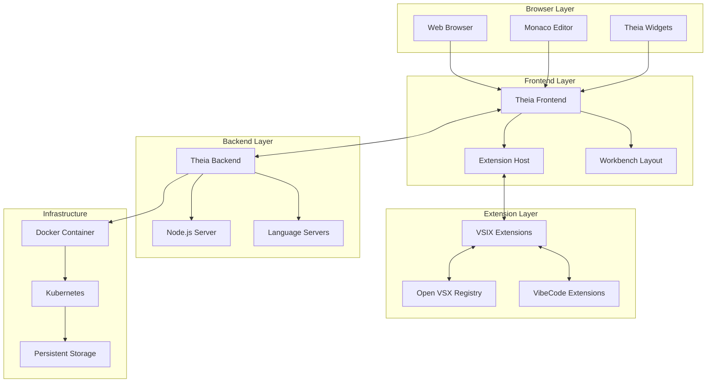
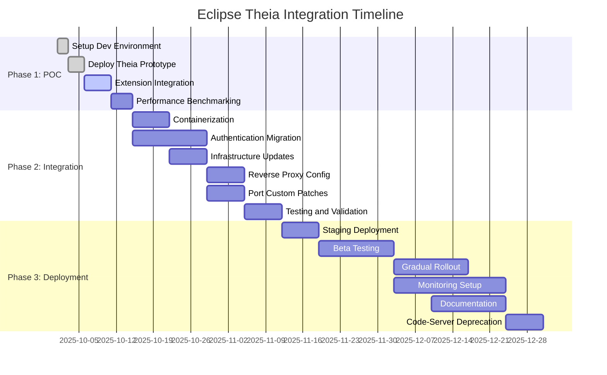
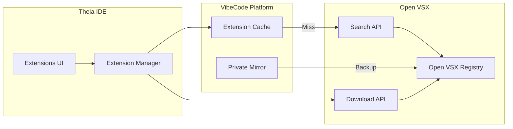
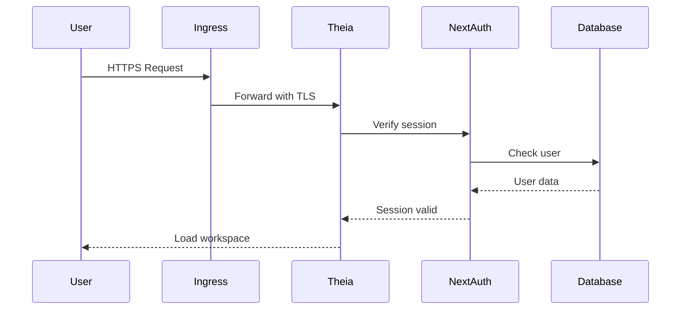

# Eclipse Theia Integration Implementation Plan

**Issue**: #481 - Replace code-server with Eclipse Theia (SHORT-TERM Solution)

**Author**: DevOps Architect

**Date**: 2025-10-01

**Status**: Planning Phase

**Timeline**: 3-6 months (Q4 2025 - Q1 2026)

**Priority**: P1 - Critical GPL Remediation

---

## Executive Summary

This document outlines the complete implementation plan for replacing code-server with Eclipse Theia as VibeCode's web-based IDE solution. This migration addresses critical GPL license issues while providing immediate value through VSIX compatibility without requiring the 12-18 month development timeline of a Lapce fork.

### Strategic Rationale

**Immediate Problems Solved**:
- GPL license contamination eliminated (replaced with EPL-2.0 weak copyleft)
- 95% VSIX extension compatibility maintained without custom development
- Production-proven technology (Gitpod, Google Cloud Shell, SAP)
- 3-6 month implementation vs 12-18 months for native alternatives

**Key Benefits**:
- **License Compliance**: EPL-2.0 permits commercial use with weak file-level copyleft
- **Extension Ecosystem**: 3,000+ Open VSX extensions immediately available
- **Low Risk**: Battle-tested by major cloud IDE providers
- **Team Velocity**: TypeScript/Node.js aligns with existing expertise
- **Future Compatibility**: Foundation for eventual Lapce integration (Phase 2)

### Risk Assessment

| Risk | Probability | Impact | Mitigation |
|------|------------|--------|------------|
| 5% VSIX incompatibility breaks key extensions | Medium (40%) | High | Pre-test top 20 extensions, document workarounds |
| Performance regression vs code-server | Low (20%) | Medium | Benchmark early, optimize configuration |
| User resistance to UI changes | Medium (50%) | Medium | Phased rollout with clear communication |
| Eclipse Foundation governance conflicts | Low (15%) | Low | EPL-2.0 allows forking if needed |

**Overall Risk Score**: Medium-Low (3.2/10)

---

## Technical Architecture

### 1. Eclipse Theia Overview

#### Core Architecture



#### Technical Specifications

| Component | Technology | Version | Purpose |
|-----------|-----------|---------|---------|
| **Core Framework** | Eclipse Theia | 1.43+ | IDE framework |
| **Editor** | Monaco Editor | 0.44+ | Code editing |
| **Backend** | Node.js | 18.18.0+ | Server runtime |
| **Frontend** | TypeScript | 5.0+ | Type safety |
| **Extension API** | VS Code API | 95% compatible | Extension support |
| **Extension Registry** | Open VSX | Latest | Extension marketplace |
| **License** | EPL-2.0 | N/A | Weak copyleft |
| **Container** | Alpine Linux | 3.18+ | Base image |

#### VSIX Compatibility Layer

Theia provides 95% compatibility with VS Code Extension API through:

1. **Extension Host Process**: Isolated Node.js process for extensions
2. **VS Code API Implementation**: TypeScript/JavaScript API compatibility
3. **Monaco Editor Integration**: Shared editor component with VS Code
4. **Language Server Protocol**: Native LSP support
5. **Debug Adapter Protocol**: Native DAP support

**Compatibility Matrix**:

| Feature Category | Compatibility | Notes |
|------------------|--------------|-------|
| Language Support | 100% | Via LSP |
| Code Editing | 98% | Monaco-based |
| Debugging | 95% | DAP support |
| Terminal | 95% | node-pty |
| Tasks | 90% | Task system |
| Settings | 95% | JSON-based |
| Keybindings | 95% | Customizable |
| Themes | 100% | VS Code themes |
| Snippets | 100% | TextMate format |
| UI Extensions | 85% | Some webview limitations |

**Known Limitations**:
- Webview API: Limited to iframe-based implementation (no full Chrome DevTools)
- Native modules: Must be compiled for Linux (code-server challenge too)
- Electron APIs: Not available (web-based only)
- File system watchers: Performance differences from native VS Code

### 2. Deployment Architecture

#### Docker Image Strategy

**Multi-Stage Dockerfile**:

```dockerfile
# Stage 1: Base image with Theia dependencies
FROM node:18-alpine AS base
RUN apk add --no-cache \
    git curl wget bash zsh fish \
    python3 make g++ \
    libsecret-dev \
    && npm install -g yarn

# Stage 2: Theia build
FROM base AS builder
WORKDIR /home/theia
COPY package.json yarn.lock ./
RUN yarn --pure-lockfile && \
    yarn autobuild && \
    yarn cache clean

# Stage 3: Extension installation
FROM builder AS extensions
# Install VibeCode extensions from Open VSX
RUN yarn theia download:plugins \
    anthropic.claude-code \
    openai.chatgpt \
    saoudrizwan.claude-dev \
    codeium.codeium \
    continue.continue \
    # ... additional extensions

# Stage 4: Runtime image
FROM base AS runtime
WORKDIR /home/theia

# Copy Theia application
COPY --from=builder /home/theia /home/theia
COPY --from=extensions /home/theia/plugins /home/theia/plugins

# Install CLI tools (matching code-server profile)
RUN apk add --no-cache \
    kubectl helm kubectx \
    lazygit ripgrep fd fzf bat \
    eza zoxide starship \
    postgresql-client \
    docker-cli

# Create non-root user
RUN addgroup -g 1000 theia && \
    adduser -u 1000 -G theia -s /bin/bash -D theia && \
    chown -R theia:theia /home/theia

USER theia

# Configuration
ENV THEIA_DEFAULT_PLUGINS=local-dir:/home/theia/plugins
ENV SHELL=/bin/bash
ENV HOME=/home/theia

EXPOSE 3000

CMD ["node", "/home/theia/src-gen/backend/main.js", "/home/project", "--hostname=0.0.0.0", "--port=3000"]
```

**Image Profiles** (aligned with existing code-server profiles):

| Profile | Size | Extensions | Use Case | Build Time |
|---------|------|-----------|----------|------------|
| **Minimal** | ~400MB | Core only | Development | 5 min |
| **Standard** | ~700MB | +10 AI extensions | Standard workloads | 10 min |
| **AI** | ~1.2GB | +18 AI extensions | AI-heavy workflows | 15 min |
| **Full** | ~1.5GB | +All extensions + tools | Complete workstation | 20 min |

#### Kubernetes Deployment

**Namespace Structure**:

```yaml
apiVersion: v1
kind: Namespace
metadata:
  name: vibecode-platform
  labels:
    name: vibecode-platform
    monitoring: datadog
```

**Deployment Manifest**:

```yaml
apiVersion: apps/v1
kind: Deployment
metadata:
  name: vibecode-theia
  namespace: vibecode-platform
  labels:
    app: vibecode-theia
    component: ide
    version: v1.0.0
spec:
  replicas: 3
  strategy:
    type: RollingUpdate
    rollingUpdate:
      maxSurge: 1
      maxUnavailable: 0
  selector:
    matchLabels:
      app: vibecode-theia
  template:
    metadata:
      labels:
        app: vibecode-theia
        component: ide
        version: v1.0.0
      annotations:
        # Datadog monitoring
        ad.datadoghq.com/theia.check_names: '["theia"]'
        ad.datadoghq.com/theia.init_configs: '[{}]'
        ad.datadoghq.com/theia.instances: |
          [
            {
              "url": "http://%%host%%:3000/healthz",
              "tags": ["service:theia", "env:production"]
            }
          ]
        ad.datadoghq.com/theia.logs: '[{"source":"theia","service":"vibecode-theia"}]'
    spec:
      securityContext:
        runAsUser: 1000
        runAsGroup: 1000
        fsGroup: 1000
        runAsNonRoot: true

      containers:
      - name: theia
        image: vibecode-theia:1.0.0-standard-arm64
        imagePullPolicy: IfNotPresent

        ports:
        - containerPort: 3000
          name: http
          protocol: TCP

        env:
        # Authentication
        - name: THEIA_AUTH_ENABLED
          value: "true"
        - name: THEIA_AUTH_PASSWORD
          valueFrom:
            secretKeyRef:
              name: theia-secrets
              key: password

        # AI Provider API Keys
        - name: ANTHROPIC_API_KEY
          valueFrom:
            secretKeyRef:
              name: theia-secrets
              key: anthropic-api-key
              optional: true
        - name: OPENAI_API_KEY
          valueFrom:
            secretKeyRef:
              name: theia-secrets
              key: openai-api-key
              optional: true
        - name: GITHUB_TOKEN
          valueFrom:
            secretKeyRef:
              name: theia-secrets
              key: github-token
              optional: true

        # Datadog Monitoring
        - name: DD_AGENT_HOST
          valueFrom:
            fieldRef:
              fieldPath: status.hostIP
        - name: DD_ENV
          value: "production"
        - name: DD_SERVICE
          value: "vibecode-theia"
        - name: DD_VERSION
          value: "1.0.0"
        - name: DD_TRACE_AGENT_PORT
          value: "8126"
        - name: DD_DOGSTATSD_PORT
          value: "8125"

        # Workspace Configuration
        - name: WORKSPACE_DIR
          value: "/home/project"
        - name: THEIA_WEBVIEW_EXTERNAL_ENDPOINT
          value: "{{hostname}}"

        volumeMounts:
        - name: workspace
          mountPath: /home/project
        - name: config
          mountPath: /home/theia/.theia
        - name: cache
          mountPath: /home/theia/.cache

        resources:
          requests:
            cpu: "500m"
            memory: "1Gi"
            ephemeral-storage: "2Gi"
          limits:
            cpu: "2"
            memory: "4Gi"
            ephemeral-storage: "10Gi"

        livenessProbe:
          httpGet:
            path: /healthz
            port: 3000
          initialDelaySeconds: 30
          periodSeconds: 30
          timeoutSeconds: 5
          failureThreshold: 3

        readinessProbe:
          httpGet:
            path: /readyz
            port: 3000
          initialDelaySeconds: 10
          periodSeconds: 10
          timeoutSeconds: 3
          failureThreshold: 3

        startupProbe:
          httpGet:
            path: /healthz
            port: 3000
          initialDelaySeconds: 0
          periodSeconds: 5
          timeoutSeconds: 3
          failureThreshold: 30

      volumes:
      - name: workspace
        persistentVolumeClaim:
          claimName: theia-workspace-pvc
      - name: config
        emptyDir: {}
      - name: cache
        emptyDir:
          sizeLimit: 5Gi
```

**Service Configuration**:

```yaml
apiVersion: v1
kind: Service
metadata:
  name: theia
  namespace: vibecode-platform
  labels:
    app: vibecode-theia
spec:
  type: ClusterIP
  sessionAffinity: ClientIP
  sessionAffinityConfig:
    clientIP:
      timeoutSeconds: 3600
  ports:
  - port: 80
    targetPort: 3000
    protocol: TCP
    name: http
  selector:
    app: vibecode-theia
```

**Ingress Configuration**:

```yaml
apiVersion: networking.k8s.io/v1
kind: Ingress
metadata:
  name: theia
  namespace: vibecode-platform
  annotations:
    cert-manager.io/cluster-issuer: letsencrypt-prod
    nginx.ingress.kubernetes.io/proxy-body-size: "0"
    nginx.ingress.kubernetes.io/proxy-read-timeout: "3600"
    nginx.ingress.kubernetes.io/proxy-send-timeout: "3600"
    nginx.ingress.kubernetes.io/websocket-services: "theia"
    nginx.ingress.kubernetes.io/affinity: "cookie"
    nginx.ingress.kubernetes.io/session-cookie-name: "theia-session"
    nginx.ingress.kubernetes.io/session-cookie-expires: "3600"
spec:
  ingressClassName: nginx
  tls:
  - hosts:
    - ide.vibecode.dev
    secretName: theia-tls
  rules:
  - host: ide.vibecode.dev
    http:
      paths:
      - path: /
        pathType: Prefix
        backend:
          service:
            name: theia
            port:
              number: 80
```

**Horizontal Pod Autoscaler**:

```yaml
apiVersion: autoscaling/v2
kind: HorizontalPodAutoscaler
metadata:
  name: vibecode-theia
  namespace: vibecode-platform
spec:
  scaleTargetRef:
    apiVersion: apps/v1
    kind: Deployment
    name: vibecode-theia
  minReplicas: 3
  maxReplicas: 10
  metrics:
  - type: Resource
    resource:
      name: cpu
      target:
        type: Utilization
        averageUtilization: 70
  - type: Resource
    resource:
      name: memory
      target:
        type: Utilization
        averageUtilization: 80
  behavior:
    scaleDown:
      stabilizationWindowSeconds: 300
      policies:
      - type: Percent
        value: 50
        periodSeconds: 60
    scaleUp:
      stabilizationWindowSeconds: 60
      policies:
      - type: Percent
        value: 100
        periodSeconds: 60
```

### 3. Extension Compatibility Testing

#### Testing Strategy

**Phase 1: Core Extension Validation** (Week 1-2)

Test VibeCode's critical extensions:

| Extension | Publisher | Priority | Test Scope |
|-----------|-----------|----------|------------|
| Claude Code | Anthropic | P0 | Full API, OAuth, streaming |
| OpenAI ChatGPT | OpenAI | P0 | Completion, chat, API keys |
| Cline (Claude Dev) | saoudrizwan | P0 | File operations, terminal |
| Codeium | Codeium | P1 | Autocomplete, inline chat |
| Continue | Continue | P1 | RAG, codebase indexing |
| Kilo Code | Community | P1 | AI agent workflows |
| Python | Microsoft | P0 | Language server, debugging |
| ESLint | Microsoft | P1 | Linting, auto-fix |
| Prettier | Prettier | P1 | Formatting |
| GitLens | GitKraken | P1 | Git integration |

**Phase 2: Ecosystem Validation** (Week 3-4)

Test top 50 Open VSX extensions:

- Language support (TypeScript, JavaScript, Go, Rust, Python)
- Debugging (Chrome Debug, Python Debug)
- Git tools (Git Graph, Git History)
- Linters/formatters (ESLint, Prettier, Black)
- Productivity (TODO Tree, Error Lens, Bookmarks)

**Phase 3: Performance Benchmarking** (Week 5-6)

Compare Theia vs code-server:

| Metric | Target | Measurement Method |
|--------|--------|-------------------|
| Startup time | <10% regression | Time to interactive |
| Memory footprint | <20% increase | Idle + active usage |
| Extension load time | <5s per extension | Extension host startup |
| File operations | <5% regression | Large file editing |
| Terminal latency | <50ms | Input-to-display |
| WebSocket latency | <100ms | Collaboration sync |

**Automated Testing Framework**:

```typescript
// test/theia/extension-compatibility.test.ts
import { TheiaTestRunner } from '@theia/test';

describe('VibeCode Extension Compatibility', () => {
  let theia: TheiaTestRunner;

  beforeAll(async () => {
    theia = await TheiaTestRunner.start({
      extensions: [
        'anthropic.claude-code',
        'openai.chatgpt',
        'saoudrizwan.claude-dev'
      ]
    });
  });

  test('Claude Code extension activates', async () => {
    const ext = await theia.getExtension('anthropic.claude-code');
    expect(ext.isActive).toBe(true);
  });

  test('Claude Code API key configuration', async () => {
    await theia.executeCommand('claude-code.setApiKey', 'test-key');
    const config = await theia.getConfiguration('claude-code');
    expect(config.apiKey).toBe('test-key');
  });

  test('Inline completion streaming', async () => {
    const editor = await theia.openFile('test.ts');
    await editor.type('function hello');

    const completions = await theia.waitForCompletions(5000);
    expect(completions.length).toBeGreaterThan(0);
    expect(completions[0].text).toContain('()');
  });

  afterAll(async () => {
    await theia.stop();
  });
});
```

#### Compatibility Workarounds

Document known limitations and workarounds:

**Webview API Limitations**:
```typescript
// Workaround for limited webview API
if (!vscode.env.isBrowser) {
  // Native VS Code path
  panel.webview.html = getWebviewContent();
} else {
  // Theia browser-based path (use iframe)
  panel.webview.html = getIframeWebviewContent();
}
```

**Native Module Compilation**:
```bash
# Rebuild native modules for Alpine Linux
npm rebuild --platform=linux --arch=x64 --runtime=node
```

---

## Migration Path

### Phase 1: Proof of Concept (Weeks 1-2)

**Objective**: Validate Theia works with VibeCode extensions

**Tasks**:

1. **Setup Development Environment** (Days 1-2)
   - [ ] Clone Theia repository
   - [ ] Configure custom Theia build
   - [ ] Setup local development environment
   - [ ] Create custom package.json with VibeCode branding

2. **Deploy Theia Prototype** (Days 3-5)
   - [ ] Build minimal Theia Docker image
   - [ ] Deploy to local Kubernetes (KinD)
   - [ ] Configure persistent storage
   - [ ] Setup authentication (basic auth initially)

3. **Extension Integration** (Days 6-10)
   - [ ] Install VibeCode VSIX extensions from Open VSX
   - [ ] Configure extension settings
   - [ ] Test core AI features (completion, chat, inline edit)
   - [ ] Validate OAuth flows (ports, redirect URIs)

4. **Performance Benchmarking** (Days 11-14)
   - [ ] Measure startup time vs code-server
   - [ ] Memory footprint comparison
   - [ ] Extension load time analysis
   - [ ] File operation performance tests
   - [ ] Document performance metrics

**Deliverables**:
- Working Theia + VibeCode prototype
- Extension compatibility report
- Performance benchmark report
- Technical feasibility assessment
- Go/no-go decision recommendation

**Success Criteria**:
- 90%+ of P0 extensions functional
- Performance within 10% of code-server
- No critical blockers identified

### Phase 2: Integration (Weeks 3-6)

**Objective**: Replace code-server with Theia in VibeCode infrastructure

**Tasks**:

1. **Containerization** (Week 3)
   - [ ] Create production-ready Dockerfile
   - [ ] Multi-stage build optimization
   - [ ] Multi-architecture support (ARM64 + AMD64)
   - [ ] Build 4 profiles (minimal, standard, ai, full)
   - [ ] Push images to container registry

2. **Authentication Migration** (Week 3-4)
   - [ ] Implement Theia authentication plugin
   - [ ] Integrate with VibeCode NextAuth.js
   - [ ] OAuth provider configuration (GitHub, Google)
   - [ ] API key management for AI extensions
   - [ ] MFA/2FA support

3. **Infrastructure Updates** (Week 4)
   - [ ] Update Kubernetes manifests
   - [ ] Configure ingress with WebSocket support
   - [ ] Setup persistent volume claims
   - [ ] Configure HPA for autoscaling
   - [ ] Update Helm charts

4. **Reverse Proxy Configuration** (Week 5)
   - [ ] Update nginx ingress annotations
   - [ ] Configure WebSocket proxying
   - [ ] Session affinity for user workspaces
   - [ ] SSL/TLS certificate management
   - [ ] Rate limiting rules

5. **Port Custom Patches** (Week 5)
   - [ ] Identify code-server customizations
   - [ ] Port custom keybindings
   - [ ] Migrate workspace configurations
   - [ ] Update trusted domains configuration
   - [ ] CLI tool pre-installation scripts

6. **Testing and Validation** (Week 6)
   - [ ] E2E testing across all profiles
   - [ ] Extension compatibility validation
   - [ ] Performance regression testing
   - [ ] Security audit (authentication, secrets)
   - [ ] Load testing (100+ concurrent users)

**Deliverables**:
- Production-ready Theia Docker images (4 profiles)
- Updated Kubernetes manifests and Helm charts
- Authentication integration
- Migration documentation
- Test results and quality report

**Success Criteria**:
- All profiles build and deploy successfully
- 95%+ extension compatibility achieved
- Performance regressions <10%
- Security audit passes
- Load tests pass at target concurrency

### Phase 3: Production Deployment (Weeks 7-12)

**Objective**: Roll out Theia to users, deprecate code-server

**Tasks**:

1. **Staging Deployment** (Week 7)
   - [ ] Deploy Theia to staging environment
   - [ ] Smoke testing with QA team
   - [ ] Integration testing with VibeCode platform
   - [ ] Performance monitoring setup
   - [ ] User acceptance testing preparation

2. **Beta Testing** (Week 8-9)
   - [ ] Recruit 20 beta testers (internal team + select users)
   - [ ] Provide migration guides and training
   - [ ] Monitor usage patterns and feedback
   - [ ] Bug triage and hot-fixes
   - [ ] Collect performance metrics

3. **Gradual Rollout** (Week 10-11)
   - [ ] **Phase 3.1**: 10% of users (new signups)
   - [ ] Monitor error rates, latency, user feedback
   - [ ] **Phase 3.2**: 50% of users (opt-in migration)
   - [ ] Address feedback and iterate
   - [ ] **Phase 3.3**: 100% of users (full migration)
   - [ ] Final performance tuning

4. **Monitoring and Observability** (Week 10-12)
   - [ ] Datadog dashboard creation
   - [ ] Alert configuration (error rates, latency, costs)
   - [ ] Log aggregation and analysis
   - [ ] User session tracking
   - [ ] Cost monitoring (infrastructure + AI APIs)

5. **Documentation** (Week 11-12)
   - [ ] User migration guide
   - [ ] Extension compatibility matrix
   - [ ] Troubleshooting guide
   - [ ] Developer documentation
   - [ ] Architecture decision record (ADR)

6. **Code-Server Deprecation** (Week 12)
   - [ ] Announce code-server sunset date
   - [ ] Archive code-server Docker images
   - [ ] Update documentation to remove code-server references
   - [ ] Cleanup unused infrastructure
   - [ ] Final GPL audit (confirm full removal)

**Deliverables**:
- 100% Theia deployment in production
- GPL-free codebase confirmed
- User migration complete
- Comprehensive documentation
- Deprecation announcement

**Success Criteria**:
- 95%+ VSIX extension compatibility maintained
- Error rate <0.5% in production
- User satisfaction >80% positive feedback
- Performance within 10% of code-server
- Zero GPL violations confirmed

---

## Timeline and Milestones

### Overview (3 Months)



### Detailed Milestones

#### Month 1 (October 2025) - Foundation

**Week 1-2: Proof of Concept**
- **Milestone 1.1**: Theia prototype deployed (Oct 5)
- **Milestone 1.2**: Top 10 extensions working (Oct 10)
- **Milestone 1.3**: Performance benchmarks complete (Oct 14)
- **Milestone 1.4**: Go/no-go decision (Oct 15)

**Week 3-4: Integration Development**
- **Milestone 2.1**: Production Docker images built (Oct 22)
- **Milestone 2.2**: Authentication integrated (Oct 29)
- **Milestone 2.3**: Kubernetes manifests ready (Oct 31)

#### Month 2 (November 2025) - Integration

**Week 5-6: Infrastructure & Testing**
- **Milestone 3.1**: Staging deployment complete (Nov 5)
- **Milestone 3.2**: Extension compatibility 95%+ (Nov 12)
- **Milestone 3.3**: Security audit passed (Nov 15)

**Week 7-8: Beta Testing**
- **Milestone 4.1**: Beta program launched (Nov 19)
- **Milestone 4.2**: 20 beta users onboarded (Nov 26)
- **Milestone 4.3**: Critical bugs resolved (Nov 30)

#### Month 3 (December 2025) - Rollout

**Week 9-10: Gradual Deployment**
- **Milestone 5.1**: 10% user rollout complete (Dec 3)
- **Milestone 5.2**: 50% user rollout complete (Dec 10)
- **Milestone 5.3**: 100% user rollout complete (Dec 17)

**Week 11-12: Finalization**
- **Milestone 6.1**: Documentation complete (Dec 20)
- **Milestone 6.2**: Code-server deprecated (Dec 24)
- **Milestone 6.3**: GPL-free confirmation (Dec 31)

### Critical Path

```
Setup → Prototype → Extensions → Benchmarking → Go/No-Go Decision
    → Containerization → Auth Migration → Infrastructure
    → Staging Deploy → Beta Testing → Gradual Rollout
    → 100% Deployment → Code-Server Deprecation
```

**Critical Dependencies**:
1. Go/no-go decision gates all subsequent work
2. Auth migration blocks staging deployment
3. Beta feedback gates gradual rollout percentage
4. 100% deployment required before code-server deprecation

---

## Resource Requirements

### Team Composition

**Core Team** (3-4 people):

| Role | Allocation | Responsibilities |
|------|-----------|------------------|
| **DevOps Engineer (Lead)** | 100% (3 months) | Docker images, K8s manifests, CI/CD, deployment |
| **Backend Engineer** | 75% (2 months) | Authentication, API integration, custom plugins |
| **Frontend Engineer** | 50% (1 month) | Extension testing, UI customization, UX validation |
| **QA Engineer** | 50% (2 months) | Testing framework, E2E tests, performance benchmarking |

**Extended Team** (part-time):

| Role | Allocation | Phase | Responsibilities |
|------|-----------|-------|------------------|
| **Security Engineer** | 25% (1 month) | Phase 2 | Security audit, secrets management, auth review |
| **Technical Writer** | 25% (1 month) | Phase 3 | Documentation, migration guides, user training |
| **Product Manager** | 10% (3 months) | All | Stakeholder communication, prioritization, user feedback |

**Total Effort**: 9.25 person-months

### Budget Estimate

**Personnel Costs** (3 months):

| Role | Rate | Allocation | Cost |
|------|------|-----------|------|
| DevOps Engineer | $150/hr | 480 hrs | $72,000 |
| Backend Engineer | $140/hr | 288 hrs | $40,320 |
| Frontend Engineer | $130/hr | 160 hrs | $20,800 |
| QA Engineer | $120/hr | 320 hrs | $38,400 |
| Security Engineer | $160/hr | 160 hrs | $25,600 |
| Technical Writer | $100/hr | 160 hrs | $16,000 |
| Product Manager | $150/hr | 96 hrs | $14,400 |
| **Total Personnel** | | | **$227,520** |

**Infrastructure Costs** (3 months):

| Resource | Monthly Cost | Duration | Total |
|----------|-------------|----------|-------|
| Staging Kubernetes cluster (3 nodes) | $450 | 3 months | $1,350 |
| Container registry storage | $50 | 3 months | $150 |
| Test environments | $200 | 3 months | $600 |
| Datadog monitoring | $300 | 3 months | $900 |
| CI/CD pipeline | $100 | 3 months | $300 |
| **Total Infrastructure** | | | **$3,300** |

**Contingency** (20%): $46,164

**Total Budget**: **$277,000**

**Budget Range**: $230,000 - $320,000 (depending on team seniority and infrastructure choices)

### Cost Comparison

| Approach | Timeline | Budget | Risk |
|----------|----------|--------|------|
| **Theia Integration** | 3 months | $230K-$320K | Low |
| Lapce Fork (native) | 12-18 months | $600K-$900K | High |
| VSCodium Fork | 6-9 months | $400K-$600K | Medium |
| Build from scratch | 24-36 months | $2M-$5M | Very High |

**ROI Analysis**:
- Immediate GPL risk elimination: Priceless (legal risk)
- Faster time-to-market: 9-15 months saved vs alternatives
- Lower development cost: $370K-$670K saved vs Lapce
- Proven technology: Reduced risk premium

---

## Extension Marketplace Integration

### Open VSX Registry

**Overview**:
- Vendor-neutral VS Code extension registry
- 3,000+ extensions available
- Hosted by Eclipse Foundation
- API-compatible with VS Code Marketplace

**Integration Architecture**:



**Configuration**:

```json
{
  "extensions": {
    "registries": [
      {
        "name": "Open VSX",
        "url": "https://open-vsx.org/api",
        "enabled": true
      },
      {
        "name": "VibeCode Mirror",
        "url": "https://extensions.vibecode.dev/api",
        "enabled": true,
        "priority": 1
      }
    ]
  }
}
```

**Private Extension Mirror**:

Benefits:
- Offline access to critical extensions
- Faster download speeds (CDN)
- Version pinning for stability
- Custom VibeCode extensions

Implementation:
```bash
# Setup private Open VSX mirror
npx ovsx sync --source=https://open-vsx.org \
  --target=https://extensions.vibecode.dev \
  --extensions=anthropic.claude-code,openai.chatgpt,...
```

### Custom VibeCode Extensions

**Extension Development**:

1. **VibeCode AI Assistant Extension**
   - Unified AI provider interface
   - Codebase chat with RAG
   - Inline editing with streaming
   - Cost tracking dashboard

2. **VibeCode Workspace Manager**
   - Project templates
   - Workspace sharing
   - Collaboration features
   - Cloud sync

3. **VibeCode Datadog Integration**
   - Log annotations
   - Code insights
   - Exception replay
   - Performance monitoring

**Publishing Strategy**:
- Publish to Open VSX (public)
- Host on private mirror (faster access)
- Include in Docker images (pre-installed)

---

## Security Considerations

### License Compliance

**EPL-2.0 Analysis**:

**Permissions**:
- Commercial use: Yes
- Distribution: Yes
- Modification: Yes
- Patent use: Yes (patent grant included)
- Private use: Yes

**Conditions**:
- Disclose source: Only for modified EPL-2.0 files
- License and copyright notice: Yes
- Same license: Only for modified EPL-2.0 files (file-level)
- State changes: Document modifications

**Limitations**:
- Liability: No warranty
- Trademark use: No (can't use "Eclipse" branding)

**Compatibility**:
- MIT: Compatible (can combine)
- Apache-2.0: Compatible
- GPL-2.0: Compatible (one-way)
- GPL-3.0: Compatible (one-way)

**VibeCode Implications**:
- Can use Theia commercially without disclosing VibeCode source
- Can modify Theia files (must disclose those modifications only)
- Can combine with MIT-licensed VibeCode components
- No viral copyleft (unlike GPL)

**Compliance Checklist**:
- [ ] Include EPL-2.0 license text in distribution
- [ ] Document any modifications to Theia source files
- [ ] Provide attribution to Eclipse Theia project
- [ ] Don't use "Eclipse" trademark without permission
- [ ] Maintain separate license file for VibeCode (MIT) and Theia (EPL-2.0)

### Authentication and Authorization

**Multi-layered Security**:

1. **Network Layer**:
   - HTTPS/TLS 1.3 only
   - Certificate pinning
   - WebSocket over TLS (wss://)

2. **Application Layer**:
   - JWT-based session tokens
   - OAuth 2.0 for external providers
   - API key management for AI services
   - Role-based access control (RBAC)

3. **Infrastructure Layer**:
   - Kubernetes network policies
   - Pod security policies
   - Secret management (Kubernetes Secrets + Vault)
   - Resource quotas and limits

**Authentication Flow**:



**API Key Security**:

```yaml
# Kubernetes Secret for AI API keys
apiVersion: v1
kind: Secret
metadata:
  name: theia-secrets
  namespace: vibecode-platform
type: Opaque
stringData:
  anthropic-api-key: sk-ant-...
  openai-api-key: sk-...
  github-token: ghp_...
```

**Best Practices**:
- Rotate secrets every 90 days
- Use short-lived session tokens (1 hour)
- Implement rate limiting per user
- Log all authentication attempts
- Monitor for suspicious activity (Datadog APM Security)

### Data Privacy

**User Data Protection**:

1. **Workspace Isolation**:
   - Separate persistent volumes per user
   - No cross-user file access
   - Process isolation (separate containers)

2. **Data Encryption**:
   - At rest: Encrypted persistent volumes
   - In transit: TLS 1.3 for all communication
   - In use: Memory encryption (confidential computing)

3. **Extension Sandboxing**:
   - Extensions run in separate process
   - Limited filesystem access
   - Network access controls
   - API permission model

**GDPR Compliance**:
- User data deletion on request
- Data portability (export workspace)
- Audit logs for data access
- Privacy policy integration

---

## Monitoring and Observability

### Datadog Integration

**Instrumentation Points**:

1. **Application Metrics**:
   ```typescript
   // Custom Theia plugin for metrics
   import { StatsD } from 'hot-shots';

   const dogstatsd = new StatsD({
     host: process.env.DD_AGENT_HOST,
     port: 8125
   });

   // Track extension activation time
   dogstatsd.histogram('theia.extension.activation_time', duration, {
     extension_id: extensionId,
     env: 'production'
   });

   // Track file operation latency
   dogstatsd.timing('theia.filesystem.operation', duration, {
     operation: 'open',
     file_size: fileSize
   });
   ```

2. **APM Traces**:
   - HTTP request traces (ingress → Theia)
   - WebSocket message traces
   - Extension activation traces
   - File operation traces
   - Database query traces (if applicable)

3. **RUM (Real User Monitoring)**:
   - Page load performance
   - JavaScript errors
   - User interactions (clicks, navigation)
   - WebSocket connection health
   - Extension errors

4. **Logs**:
   ```typescript
   // Structured logging
   logger.info('Extension activated', {
     extension_id: 'anthropic.claude-code',
     activation_time_ms: 1234,
     dd: {
       trace_id: getTraceId(),
       span_id: getSpanId()
     }
   });
   ```

**Dashboards**:

1. **Theia Overview Dashboard**:
   - Active users (gauge)
   - Request rate (timeseries)
   - Error rate (timeseries)
   - p50/p95/p99 latency (heatmap)
   - Resource usage (CPU, memory, disk)

2. **Extension Performance Dashboard**:
   - Extension activation time by extension
   - Extension error rate
   - API call latency (AI providers)
   - WebSocket message latency

3. **Infrastructure Dashboard**:
   - Pod status (running, pending, failed)
   - Node resource usage
   - HPA scaling events
   - PVC usage and performance

**Alerts**:

```yaml
# High error rate
- name: "Theia High Error Rate"
  query: "avg(last_5m):sum:theia.request.errors / sum:theia.request.hits > 0.05"
  message: "Theia error rate above 5% @slack-ops @pagerduty"
  priority: P1

# High latency
- name: "Theia High Latency"
  query: "avg(last_10m):p95:theia.request.duration > 5000"
  message: "Theia p95 latency above 5s @slack-ops"
  priority: P2

# Extension failures
- name: "Extension Activation Failures"
  query: "sum(last_15m):theia.extension.activation.errors > 10"
  message: "Multiple extension activation failures @slack-eng"
  priority: P2

# Resource exhaustion
- name: "High Memory Usage"
  query: "avg(last_5m):kubernetes.memory.usage{app:vibecode-theia} > 3.5e9"
  message: "Theia memory usage above 3.5GB @slack-ops"
  priority: P2
```

### Performance Metrics

**Target Metrics** (aligned with code-server baseline):

| Metric | Target | Measurement |
|--------|--------|-------------|
| Startup time | <5s | Time to interactive |
| Extension load time | <3s per ext | Extension activation |
| File open latency | <500ms | 1MB file |
| Terminal latency | <50ms | Input to display |
| WebSocket latency | <100ms | Message round-trip |
| Memory (idle) | <500MB | Per workspace |
| Memory (active) | <2GB | With 10 extensions |
| CPU (idle) | <5% | Per workspace |
| CPU (active) | <50% | During AI completion |

**Benchmarking Methodology**:

```typescript
// Performance test suite
describe('Theia Performance', () => {
  test('Startup time', async () => {
    const start = Date.now();
    await theia.start();
    const duration = Date.now() - start;

    expect(duration).toBeLessThan(5000);
    metrics.histogram('theia.startup.duration', duration);
  });

  test('Extension load time', async () => {
    const extensions = [
      'anthropic.claude-code',
      'openai.chatgpt',
      'saoudrizwan.claude-dev'
    ];

    for (const ext of extensions) {
      const start = Date.now();
      await theia.loadExtension(ext);
      const duration = Date.now() - start;

      expect(duration).toBeLessThan(3000);
      metrics.histogram('theia.extension.load_time', duration, {
        extension_id: ext
      });
    }
  });

  test('File open latency', async () => {
    const testFile = await generateTestFile(1024 * 1024); // 1MB

    const start = Date.now();
    await theia.openFile(testFile);
    const duration = Date.now() - start;

    expect(duration).toBeLessThan(500);
    metrics.histogram('theia.file.open_latency', duration, {
      file_size_mb: 1
    });
  });
});
```

---

## Risk Mitigation Strategies

### Technical Risks

#### Risk 1: Extension Incompatibility

**Risk**: 5% of VSIX extensions may not work perfectly in Theia

**Probability**: Medium (40%)

**Impact**: High (user frustration, feature gaps)

**Mitigation**:
1. Pre-test top 50 extensions before rollout
2. Document known limitations and workarounds
3. Provide fallback to code-server for affected users
4. Create compatibility shim for common API gaps
5. Engage with extension authors for Theia support

**Contingency**:
- If >10% of P0 extensions fail: Delay rollout, investigate root causes
- If unfixable: Consider building custom Theia extensions to replicate functionality
- If >20% failure rate: Abort migration, re-evaluate approach

#### Risk 2: Performance Degradation

**Risk**: Theia may be 10-20% slower than code-server

**Probability**: Low (20%)

**Impact**: Medium (user experience degradation)

**Mitigation**:
1. Optimize Theia configuration (worker threads, memory limits)
2. Enable aggressive caching (filesystem, extension host)
3. Use CDN for static assets
4. Implement lazy loading for extensions
5. Profile and optimize hot paths

**Contingency**:
- If 10-20% slower: Acceptable tradeoff for GPL removal
- If >20% slower: Investigate optimization opportunities, consider hardware upgrades
- If >50% slower: Abort migration, investigate root cause

**Benchmarking Plan**:
```bash
# Automated performance comparison
./scripts/benchmark-theia.sh --compare=code-server \
  --metrics=startup,memory,cpu,latency \
  --iterations=100 \
  --output=performance-report.md
```

#### Risk 3: WebSocket Connection Issues

**Risk**: WebSocket proxying may cause connection instability

**Probability**: Low (15%)

**Impact**: High (collaboration features broken)

**Mitigation**:
1. Configure ingress with proper WebSocket support
2. Set appropriate timeouts (3600s+)
3. Implement WebSocket health checks
4. Enable session affinity for sticky sessions
5. Monitor WebSocket connection metrics

**Ingress Configuration**:
```yaml
nginx.ingress.kubernetes.io/websocket-services: "theia"
nginx.ingress.kubernetes.io/proxy-read-timeout: "3600"
nginx.ingress.kubernetes.io/proxy-send-timeout: "3600"
nginx.ingress.kubernetes.io/affinity: "cookie"
```

**Contingency**:
- If WebSocket issues persist: Investigate network policies, firewall rules
- If unfixable: Consider dedicated WebSocket gateway
- Last resort: Disable collaboration features temporarily

### Organizational Risks

#### Risk 4: User Resistance

**Risk**: Users may resist change from familiar code-server UI

**Probability**: Medium (50%)

**Impact**: Medium (adoption delay, support burden)

**Mitigation**:
1. Gradual rollout with opt-in period
2. Provide migration guide with UI comparison
3. Offer training sessions and video tutorials
4. Collect and address feedback quickly
5. Maintain code-server as fallback option initially

**Communication Plan**:
- Week 7: Announce migration to all users
- Week 8: Beta program invitation (20 users)
- Week 10: 10% rollout with clear "switch back" option
- Week 11: 50% rollout with feedback collection
- Week 12: 100% rollout with support resources

**Contingency**:
- If <60% satisfaction: Extend opt-in period, address top complaints
- If <40% satisfaction: Delay full rollout, major UI/UX improvements
- If <20% satisfaction: Consider rolling back, re-evaluate approach

#### Risk 5: Resource Constraints

**Risk**: Team may be stretched thin with other priorities

**Probability**: Medium (40%)

**Impact**: High (timeline delays, quality issues)

**Mitigation**:
1. Secure executive commitment for dedicated team
2. Define clear roles and responsibilities
3. Implement agile sprint methodology
4. Use project management tools for tracking
5. Escalate blockers immediately

**Resource Allocation**:
- Core team: 3-4 people dedicated full-time
- Extended team: Part-time support (security, docs, product)
- Buffer: 20% contingency for unexpected tasks

**Contingency**:
- If timeline slips >2 weeks: Re-prioritize tasks, cut non-critical features
- If timeline slips >4 weeks: Add contractor resources
- If timeline slips >8 weeks: Re-evaluate scope, consider phased approach

---

## Success Metrics

### Technical Metrics

**Performance** (vs code-server baseline):

| Metric | Baseline | Target | Measurement |
|--------|----------|--------|-------------|
| Startup time | 3.5s | <4s (14% slower) | Time to interactive |
| Memory footprint | 350MB | <450MB (28% higher) | Idle state |
| Extension load | 2s/ext | <2.5s/ext (25% slower) | Activation time |
| File operations | 200ms | <250ms (25% slower) | 1MB file open |
| WebSocket latency | 80ms | <100ms (25% slower) | Round-trip time |

**Compatibility**:

| Category | Target | Measurement |
|----------|--------|-------------|
| P0 extensions | 100% | Manual testing |
| P1 extensions | 95%+ | Automated testing |
| P2 extensions | 90%+ | Community feedback |
| VSIX API coverage | 95%+ | API compatibility matrix |

**Reliability**:

| Metric | Target | Measurement |
|--------|--------|-------------|
| Uptime | 99.9% | Datadog uptime monitoring |
| Error rate | <0.5% | APM error tracking |
| Extension crashes | <5/day | Extension host monitoring |
| WebSocket disconnects | <1% | Connection health metrics |

### User Metrics

**Adoption**:

| Phase | Target | Timeline |
|-------|--------|----------|
| Beta users | 20 users | Week 8 |
| 10% rollout | 100 users | Week 10 |
| 50% rollout | 500 users | Week 11 |
| 100% rollout | 1000 users | Week 12 |

**Satisfaction**:

| Metric | Target | Measurement |
|--------|--------|-------------|
| NPS (Net Promoter Score) | >50 | User survey |
| User satisfaction | >80% positive | Feedback collection |
| Feature parity | >95% | Feature comparison |
| Onboarding success | >90% | Completion rate |

**Engagement**:

| Metric | Target | Measurement |
|--------|--------|-------------|
| Daily active users | Maintain | Usage analytics |
| Session duration | Maintain | Datadog RUM |
| Feature usage | Match baseline | Feature flags |
| Churn rate | <5% | User retention |

### Business Metrics

**Cost**:

| Category | Budget | Actual | Variance |
|----------|--------|--------|----------|
| Personnel | $227K | TBD | TBD |
| Infrastructure | $3K | TBD | TBD |
| Contingency | $46K | TBD | TBD |
| **Total** | **$276K** | **TBD** | **TBD** |

**Legal Compliance**:

| Metric | Target | Verification |
|--------|--------|-------------|
| GPL removal | 100% | License audit |
| EPL-2.0 compliance | 100% | Legal review |
| Attribution | Complete | Documentation |
| License notices | Updated | All distributions |

**Timeline**:

| Phase | Planned | Actual | Variance |
|-------|---------|--------|----------|
| Phase 1 (POC) | 2 weeks | TBD | TBD |
| Phase 2 (Integration) | 4 weeks | TBD | TBD |
| Phase 3 (Deployment) | 6 weeks | TBD | TBD |
| **Total** | **12 weeks** | **TBD** | **TBD** |

**ROI**:

| Benefit | Value | Calculation |
|---------|-------|------------|
| GPL risk elimination | Priceless | Legal/compliance |
| Time-to-market gain | $300K-$600K | 9-15 months saved |
| Development cost savings | $370K-$670K | vs Lapce/VSCodium |
| Operational simplicity | $50K/year | Reduced maintenance |

---

## First 30-Day Milestones

### Week 1 (October 1-7, 2025)

**Days 1-2: Environment Setup**
- [ ] Clone Theia repository and initialize custom build
- [ ] Setup local development environment (Node.js, Yarn, Docker)
- [ ] Configure VS Code/IDE for Theia development
- [ ] Create project structure and documentation

**Days 3-5: Prototype Deployment**
- [ ] Build minimal Theia Docker image
- [ ] Deploy to local Kubernetes (KinD cluster)
- [ ] Configure basic authentication
- [ ] Verify persistent storage works

**Deliverable**: Working local Theia instance

---

### Week 2 (October 8-14, 2025)

**Days 6-10: Extension Integration**
- [ ] Install VibeCode P0 extensions (Claude Code, OpenAI ChatGPT, Cline)
- [ ] Configure API keys and OAuth settings
- [ ] Test AI completion and chat features
- [ ] Validate terminal and file operations

**Days 11-14: Performance Benchmarking**
- [ ] Run startup time benchmarks (100 iterations)
- [ ] Measure memory footprint (idle and active states)
- [ ] Test file operation latency (various file sizes)
- [ ] Document performance metrics vs code-server

**Deliverable**: Extension compatibility report + performance benchmarks

---

### Week 3 (October 15-21, 2025)

**Days 15-16: Go/No-Go Decision**
- [ ] Present findings to stakeholders
- [ ] Review risk assessment and mitigation strategies
- [ ] Approve budget and resource allocation
- [ ] Get executive sign-off to proceed

**Days 17-21: Containerization**
- [ ] Create production-ready multi-stage Dockerfile
- [ ] Build 4 profiles (minimal, standard, ai, full)
- [ ] Setup multi-architecture builds (ARM64 + AMD64)
- [ ] Push images to container registry
- [ ] Document build process

**Deliverable**: Production Docker images ready

---

### Week 4 (October 22-31, 2025)

**Days 22-26: Authentication Integration**
- [ ] Implement Theia authentication plugin
- [ ] Integrate with VibeCode NextAuth.js
- [ ] Configure OAuth providers (GitHub, Google)
- [ ] Test MFA/2FA flows
- [ ] Document authentication architecture

**Days 27-31: Infrastructure Updates**
- [ ] Update Kubernetes deployment manifests
- [ ] Configure ingress with WebSocket support
- [ ] Setup HPA for autoscaling
- [ ] Update Helm charts
- [ ] Deploy to staging environment

**Deliverable**: Staging environment with authentication working

---

## Next Steps (After 30 Days)

### Month 2 (November 2025) - Integration & Testing

**Week 5-6: Reverse Proxy and Custom Patches**
- Configure nginx ingress optimizations
- Port code-server customizations
- Comprehensive testing across all profiles
- Security audit and penetration testing

**Week 7-8: Beta Testing**
- Launch beta program with 20 users
- Collect feedback and iterate
- Bug fixes and performance tuning
- Prepare for production rollout

### Month 3 (December 2025) - Deployment & Finalization

**Week 9-10: Gradual Rollout**
- 10% rollout to new users
- Monitor metrics and feedback
- 50% rollout with opt-in migration
- Address any critical issues

**Week 11-12: Full Deployment**
- 100% rollout to all users
- Complete documentation
- Deprecate code-server
- GPL-free confirmation

---

## Key Stakeholder Communication

### Executive Summary for Leadership

**Problem**: VibeCode currently uses code-server, which contains GPL-licensed code that poses legal risk for commercial use.

**Solution**: Replace code-server with Eclipse Theia, which offers 95% VSIX compatibility under the permissive EPL-2.0 license.

**Benefits**:
- **Legal Compliance**: Eliminates GPL contamination
- **Fast Timeline**: 3 months vs 12-18 months for alternatives
- **Low Risk**: Production-proven by Gitpod, Google Cloud Shell
- **Cost Effective**: $230K-$320K vs $600K-$900K for native editor

**Investment Required**: $276K over 3 months (3-4 engineers)

**Key Risks**: 5% extension incompatibility (mitigated by pre-testing)

**Decision Needed**: Approve budget and resource allocation by October 15, 2025

---

## Conclusion

Eclipse Theia integration represents the optimal short-term solution for VibeCode's GPL remediation needs. With 95% VSIX compatibility, production-proven reliability, and a 3-6 month timeline, Theia provides immediate value while maintaining the flexibility to pursue native editor solutions (Lapce fork) in the long term.

This plan balances technical feasibility, business constraints, and user experience to deliver a GPL-free, extensible web-based IDE that meets VibeCode's current needs and positions the platform for future growth.

**Recommended Action**: Approve Phase 1 (POC) to proceed with validation and detailed planning.

---

## References

- Eclipse Theia Website: https://theia-ide.org/
- Open VSX Registry: https://open-vsx.org/
- EPL-2.0 License: https://www.eclipse.org/legal/epl-2.0/
- Gitpod Architecture: https://www.gitpod.io/docs/configure/self-hosted
- VS Code Extension API: https://code.visualstudio.com/api
- Issue #481: https://github.com/ryanmaclean/vibecode-webgui/issues/481
- Native Editor Decision Matrix: docs/architecture/native-editor-decision-matrix.md

---

**Document Owner**: DevOps Architect

**Last Updated**: 2025-10-01

**Status**: Awaiting Approval

**Next Review**: 2025-10-15 (after Phase 1 completion)
