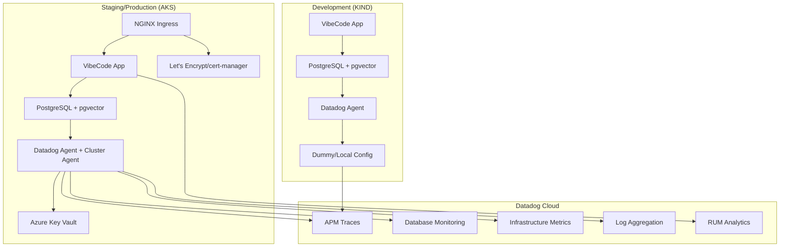

# Datadog Monitoring Configuration for VibeCode

This document provides the comprehensive guide for configuring Datadog monitoring across all environments (development, staging, and production) for the VibeCode platform.

## 🎯 Monitoring Strategy

### Environment Parity
- **Development (KIND)**: Full monitoring stack with safe fallback credentials
- **Staging (Azure AKS)**: Production-like monitoring with staging environment tags
- **Production (Azure AKS)**: Full production monitoring with real credentials and alerts

### Key Monitoring Features
- ✅ **Application Performance Monitoring (APM)**: Distributed tracing across services
- ✅ **Infrastructure Monitoring**: Node and cluster metrics
- ✅ **Log Aggregation**: Centralized log collection and analysis
- ✅ **Database Monitoring (DBM)**: PostgreSQL performance tracking with pgvector metrics
- ✅ **Container Insights**: Docker and Kubernetes resource monitoring
- ✅ **Network Monitoring**: Service mesh and network traffic analysis
- ✅ **Security Monitoring**: Runtime threat detection
- ✅ **Real User Monitoring (RUM)**: Frontend performance tracking

## ⚙️ Environment Variables Configuration

### Standardization Approach

VibeCode uses a **standardized environment variable approach** that prefers `DD_*` variables with automatic fallback to legacy `DATADOG_*` variants. All environment variable resolution is centralized in [`src/lib/monitoring/datadog-env.ts`](../../src/lib/monitoring/datadog-env.ts) and [`src/lib/monitoring/datadog-env.shared.js`](../../src/lib/monitoring/datadog-env.shared.js).

**Key Benefits**:
- 🔄 **Automatic fallback**: `DD_API_KEY` → `DATADOG_API_KEY`
- ⚠️ **Safe mismatch warnings**: Warns when both variables are set but differ
- 🎯 **Consistent resolution**: Single source of truth for all Datadog configuration

### Core Environment Variables

**Server-side (Backend) Configuration**:
```bash
# Primary Datadog Configuration (preferred format)
DD_API_KEY=your-datadog-api-key                    # Primary API key
DD_APP_KEY=your-datadog-app-key                    # Application key (for API access)
DD_SITE=datadoghq.com                              # Datadog site (default: datadoghq.com)
DD_ENV=production                                  # Environment (default: development/production based on NODE_ENV)
DD_SERVICE=vibecode-webgui                         # Service name (default: vibecode-webgui)
DD_VERSION=1.0.0                                   # Version (default: package.json version or 1.0.0)

# Legacy fallback variables (automatically used if DD_* not set)
DATADOG_API_KEY=your-datadog-api-key               # Falls back if DD_API_KEY unset
DATADOG_APP_KEY=your-datadog-app-key               # Falls back if DD_APP_KEY unset
DATADOG_SITE=datadoghq.com                         # Falls back if DD_SITE unset
DATADOG_ENV=production                             # Falls back if DD_ENV unset
DATADOG_SERVICE=vibecode-webgui                    # Falls back if DD_SERVICE unset
DATADOG_VERSION=1.0.0                              # Falls back if DD_VERSION unset
```

**Database Monitoring Configuration**:
```bash
# Database Monitoring (DBM) for PostgreSQL
DD_POSTGRES_USER=datadog                           # Database monitoring user (default: datadog)
DD_POSTGRES_PASSWORD=your-strong-password          # DBM user password
DATADOG_POSTGRES_PASSWORD=your-strong-password     # Legacy fallback

# Database Monitoring Features
DD_DATABASE_MONITORING_ENABLED=true               # Enable database monitoring
```

**Client-side (Frontend RUM) Configuration**:
```bash
# Frontend Real User Monitoring (public variables)
NEXT_PUBLIC_DD_APPLICATION_ID=your-app-id         # RUM application ID
NEXT_PUBLIC_DD_CLIENT_TOKEN=your-client-token     # RUM client token
NEXT_PUBLIC_DD_SITE=datadoghq.com                 # Datadog site for RUM
NEXT_PUBLIC_APP_VERSION=1.0.0                     # Application version

# Legacy fallback variables
NEXT_PUBLIC_DATADOG_APPLICATION_ID=your-app-id    # Falls back if NEXT_PUBLIC_DD_APPLICATION_ID unset
NEXT_PUBLIC_DATADOG_CLIENT_TOKEN=your-client-token # Falls back if NEXT_PUBLIC_DD_CLIENT_TOKEN unset
NEXT_PUBLIC_DATADOG_RUM_APPLICATION_ID=your-app-id # Alternative legacy format
NEXT_PUBLIC_DATADOG_RUM_CLIENT_TOKEN=your-client-token # Alternative legacy format
NEXT_PUBLIC_DATADOG_SITE=datadoghq.com            # Falls back if NEXT_PUBLIC_DD_SITE unset

# Development overrides
NEXT_PUBLIC_ENABLE_RUM_IN_DEV=false               # Enable RUM in development (default: false)
```

**Advanced Configuration Toggles**:
```bash
# LLM Observability (NEW)
DD_LLMOBS_ENABLED=1                               # Enable LLM observability
DD_LLMOBS_AGENTLESS_ENABLED=1                     # Enable agentless LLM monitoring
DD_LLMOBS_ML_APP=vibecode-ai                      # LLM application name

# Optional feature toggles
OTEL_ENABLED=false                                # Enable OpenTelemetry (default: false)
DD_ENABLED=true                                   # Enable Datadog initialization (default: true)
DD_ENABLE_GET_RUM_DATA=false                      # Experimental dd-trace getRumData
SKIP_MONITORING=false                             # Force disable all monitoring
DOCKER_BUILD=false                                # Disable monitoring during builds
```

### Environment Variable Resolution

The [`src/lib/monitoring/datadog-env.ts`](../../src/lib/monitoring/datadog-env.ts) module provides centralized environment variable resolution with these key functions:

```typescript
// Get any Datadog variable with automatic DD_* → DATADOG_* fallback
getDDValue(key: DatadogKey): string | undefined

// Specific getters with built-in fallbacks
getDatadogApiKey(): string | undefined
getDatadogAppKey(): string | undefined  
getDatadogSite(): string                          // defaults to 'datadoghq.com'

// Service configuration resolver
getServiceEnvVersion(): { service: string; env: string; version: string }

// RUM public configuration resolver
getRUMPublicConfig(): { applicationId: string; clientToken: string; site: string; version: string; env: string }
```

**Example warning when both formats are set**:
```
[DatadogEnv] Both DD_API_KEY and DATADOG_API_KEY are set and differ; preferring DD_API_KEY
```

## 🔐 CI/CD Secrets and Variables

### GitHub Actions Configuration

**Repository Secrets** (GitHub repo → Settings → Secrets and variables → Actions):
```bash
# Required secrets
DD_API_KEY                    # Datadog API key for CI/CD
DD_APP_KEY                    # Datadog app key for API operations
DD_POSTGRES_PASSWORD          # Database monitoring password

# Optional secrets for advanced features
NEXT_PUBLIC_DD_APPLICATION_ID # RUM application ID
NEXT_PUBLIC_DD_CLIENT_TOKEN   # RUM client token
```

**Repository Variables** (GitHub repo → Settings → Secrets and variables → Actions):
```bash
# Environment configuration
DD_SITE=datadoghq.com         # Datadog site
DD_ENV=ci                     # CI environment tag
DD_SERVICE=vibecode-webgui    # Service name
```

### CI Environment Behavior

The monitoring setup automatically detects CI environments and adjusts behavior:

**Automatic CI Detection**:
- `CI=true` or `GITHUB_ACTIONS=true` → Disables monitoring by default
- `DOCKER_BUILD=true` → Disables monitoring during Docker builds
- Missing `.env` file → Auto-copies from `.env.example`

**CI Tips**:
- Set `DD_*` secrets in GitHub repository settings for consistency
- Legacy `DATADOG_*` variables still work via automatic fallback
- For RUM testing in CI, set `NEXT_PUBLIC_ENABLE_RUM_IN_DEV=true` only if needed
- Use the [`scripts/setup-secrets.sh`](#scripts-setup-secrets-sh) script for Kubernetes secret management

## 🛠️ Scripts and Automation

### `scripts/setup-secrets.sh`

The [`scripts/setup-secrets.sh`](../../scripts/setup-secrets.sh) script automates Kubernetes secret creation and management with built-in support for both `DD_*` and `DATADOG_*` variable formats.

**Key Features**:
- ✅ **Automatic fallback**: Uses `DATADOG_API_KEY` if `DD_API_KEY` is missing
- ✅ **Mismatch detection**: Warns when both formats are set but differ
- ✅ **Auto-generation**: Creates secure DBM passwords if missing
- ✅ **Multi-environment**: Supports dev, staging, and production namespaces
- ✅ **Dry-run support**: Preview changes without applying them

**Usage**:
```bash
# Basic secret setup
./scripts/setup-secrets.sh

# Setup in specific namespace
./scripts/setup-secrets.sh vibecode-prod

# Dry run to preview changes
./scripts/setup-secrets.sh --dry-run

# Verify existing secrets only
./scripts/setup-secrets.sh --verify-only

# Persist generated DBM credentials to .env.local
./scripts/setup-secrets.sh --write-env
```

**Required Environment Variables**:
```bash
DD_API_KEY                    # Datadog API Key (or DATADOG_API_KEY fallback)
POSTGRES_PASSWORD             # PostgreSQL admin password
```

**Optional Environment Variables**:
```bash
DD_POSTGRES_USER=datadog      # DBM username (default: datadog)
DD_POSTGRES_PASSWORD          # DBM password (auto-generated if missing)
DATADOG_POSTGRES_PASSWORD     # Legacy fallback for DD_POSTGRES_PASSWORD
KUBECONFIG                    # Kubernetes config file path
KUBECTL_CONTEXT               # Kubernetes context to use
```

**Environment File Sources** (checked in order):
1. `$PROJECT_ROOT/.env` (preferred)
2. `$PROJECT_ROOT/.env.local`
3. `$HOME/.vibecode/.env`

**Created Kubernetes Secrets**:
- `datadog-secret` → Contains `api-key`
- `datadog-secrets` → Legacy alias for `datadog-secret`
- `postgres-credentials` → Contains `postgres-password`, `datadog-username`, `datadog-password`

### Other Key Scripts

**Datadog Setup and Validation**:
```bash
# Deploy Datadog monitoring to AKS
./scripts/setup-aks-datadog-monitoring.sh --cluster-name your-cluster

# Verify Database Monitoring is working
./scripts/verify-datadog-dbm.sh

# Test Datadog API connectivity
./scripts/test-datadog.js

# Setup Database Monitoring specifically
./scripts/setup-datadog-dbm.ts
```

**Local Development**:
```bash
# Setup local KIND cluster with monitoring
./scripts/kind-datadog-core.sh

# Run local Datadog agent
./scripts/run-datadog-agent-local.sh

# Generate vector database activity for monitoring
./scripts/generate-vector-activity.sh
```

## 🏗️ Architecture Overview



## 📊 Deployment Configurations

### 1. Development (KIND)

**Purpose**: Local development with lightweight monitoring
**Configuration**: [`k8s/datadog-values-kind.yaml`](../../k8s/datadog-values-kind.yaml)

```yaml
datadog:
  apiKeyExistingSecret: datadog-secret
  site: "datadoghq.com"
  clusterName: "vibecode-kind-local"
  logs:
    enabled: true
  apm:
    portEnabled: true
  resources:
    requests:
      memory: "128Mi"
      cpu: "50m"
    limits:
      memory: "256Mi"
      cpu: "100m"
```

**Features**:
- ✅ Container monitoring
- ✅ APM tracing
- ✅ Log collection
- ✅ Basic process monitoring
- ❌ Database monitoring (lightweight setup)
- ❌ Network monitoring (performance)

### 2. Staging/Production (AKS)

**Purpose**: Full production monitoring with all features
**Configuration**: Helm chart with Azure integration

```yaml
datadog:
  apiKeyExistingSecret: datadog-secret
  clusterAgent:
    enabled: true
    resources:
      requests:
        memory: "256Mi"
        cpu: "200m"
  databaseMonitoring:
    enabled: true
  networkMonitoring:
    enabled: true
  systemProbe:
    enabled: true
```

**Features**:
- ✅ Full infrastructure monitoring
- ✅ Database monitoring (PostgreSQL + pgvector)
- ✅ APM with distributed tracing
- ✅ Log aggregation and analysis
- ✅ Network monitoring and security
- ✅ Orchestrator explorer
- ✅ Real User Monitoring (RUM)

## 🚀 Deployment Process

### Local Development Setup

1. **Environment Configuration**:
```bash
# Create .env.local with your Datadog credentials
cat > .env.local << 'EOF'
DD_API_KEY=your_datadog_api_key
DD_SITE=datadoghq.com
EOF
```

2. **Start Local Environment**:
```bash
# Quick demo with monitoring
./DEMO.sh

# Or manual setup
npm run setup
npm run dev
```

### Kubernetes Deployment

1. **Setup Secrets**:
```bash
# Configure Kubernetes secrets
export DD_API_KEY=your_datadog_api_key
export POSTGRES_PASSWORD=your_secure_password
./scripts/setup-secrets.sh
```

2. **Deploy Monitoring Stack**:
```bash
# For AKS clusters
./scripts/setup-aks-datadog-monitoring.sh --cluster-name your-cluster-name

# For local KIND clusters
./scripts/kind-datadog-core.sh
```

3. **Deploy Application**:
```bash
# Full deployment with monitoring
./scripts/deploy-vibecode.sh
```

4. **Verify Setup**:
```bash
# Verify Database Monitoring
./scripts/verify-datadog-dbm.sh

# Check monitoring endpoints
npm run test:monitoring
```

## ✅ Validation and Testing

### Automated Tests

**Test Scripts Available**:
```bash
# All monitoring tests
npm run test:monitoring

# Unit tests only
npm run test:monitoring:unit

# Integration tests
npm run test:monitoring:integration

# E2E monitoring dashboard tests
npm run test:monitoring:e2e

# Kubernetes monitoring tests
npm run test:monitoring:k8s

# Security monitoring tests
npm run test:monitoring:security
```

### Manual Validation Checklist

**Infrastructure**:
- [ ] Datadog agent pods running in cluster
- [ ] Cluster agent deployment successful
- [ ] Kubernetes metrics appearing in Datadog

**Application Monitoring**:
- [ ] APM traces visible for API requests
- [ ] Application metrics (response times, throughput)
- [ ] Error tracking and alerting configured

**Database Monitoring**:
- [ ] PostgreSQL metrics collected
- [ ] pgvector-specific metrics available
- [ ] Query samples and execution plans captured
- [ ] Database performance dashboards populated

**Log Collection**:
- [ ] Application logs flowing to Datadog
- [ ] Kubernetes pod logs collected
- [ ] Log parsing and structured logging working

**Frontend Monitoring (RUM)**:
- [ ] RUM initialized in browser console
- [ ] Page load and navigation metrics
- [ ] Frontend error tracking
- [ ] User session recordings (if enabled)

### Verification Commands

```bash
# Check Datadog API connectivity
curl -X GET "https://api.datadoghq.com/api/v1/validate" \
  -H "DD-API-KEY: ${DD_API_KEY}"

# Verify database monitoring user
kubectl exec -it postgres-0 -- psql -U datadog -d vibecode -c "SELECT 1;"

# Check RUM initialization (browser console)
datadogRum.getInternalContext()

# Validate APM traces
kubectl logs -l app=vibecode-webgui | grep "Datadog"
```

## 📈 Monitoring Dashboards

### Custom Dashboards Available

1. **pgvector Performance Dashboard**: Vector search metrics, index performance, storage utilization
2. **Application Performance Dashboard**: API response times, error rates, throughput
3. **Database Monitoring Dashboard**: PostgreSQL performance, query analysis, connection metrics
4. **Infrastructure Overview Dashboard**: Kubernetes cluster health, node metrics, resource utilization

### Key Metrics Tracked

**Vector-Specific Metrics**:
- `postgresql.pgvector.vector_count` - Total embeddings stored
- `postgresql.pgvector.table_size` - Storage utilization
- `postgresql.pgvector.index.performance` - IVFFLAT index metrics

**Application Metrics**:
- `vibecode.api.response_time` - API response times
- `vibecode.api.requests_per_second` - Request throughput
- `vibecode.embedding.generation_time` - AI model performance

**Database Performance**:
- Query execution times and explain plans
- Index usage efficiency
- Connection pool monitoring
- Lock contention analysis

## 🔔 Alerting Configuration

### Critical Alerts

1. **High Error Rate**: > 5% error rate for 5 minutes
2. **Database Performance**: Query time > 1s for 10 minutes
3. **Resource Utilization**: CPU/Memory > 80% for 15 minutes
4. **Service Availability**: Service down for > 1 minute

### Alert Channels

- **Slack**: `#vibecode-alerts` channel
- **Email**: Development team distribution list
- **PagerDuty**: For production critical alerts

## 🔐 Security and Access Control

### API Key Management

- **Development**: Use dedicated dev API keys with limited scope
- **Staging**: Separate staging API keys
- **Production**: Production API keys with full monitoring scope
- **CI/CD**: Service account keys with deployment permissions

### Access Control

- **Read-only**: Developers can view dashboards and metrics
- **Edit**: Team leads can modify dashboards and alerts
- **Admin**: DevOps team has full configuration access

## 🛠️ Troubleshooting

### Common Issues

**Monitoring Not Working**:
1. Check environment variables are set correctly
2. Verify API key has sufficient permissions
3. Ensure Datadog agent pods are running
4. Check for firewall/network connectivity issues

**Database Monitoring Issues**:
1. Verify DBM user exists and has correct permissions
2. Check PostgreSQL configuration allows monitoring
3. Validate connection strings and credentials
4. Review agent logs for connection errors

**RUM Not Initializing**:
1. Confirm public RUM variables are set
2. Check browser console for initialization errors
3. Verify application ID and client token are correct
4. Ensure RUM is enabled for current environment

### Debug Commands

```bash
# Check agent status
kubectl exec -it datadog-agent-xyz -- agent status

# View agent logs
kubectl logs -l app=datadog-agent

# Test database monitoring connection
kubectl exec -it postgres-0 -- psql -U datadog -d vibecode -c "\dt"

# Validate environment resolution
node -e "console.log(require('./src/lib/monitoring/datadog-env.shared.js').getServiceEnvVersion())"
```

## 📚 Additional Resources

### Documentation Links

- [Datadog Kubernetes Integration](https://docs.datadoghq.com/integrations/kubernetes/)
- [Azure AKS Monitoring](https://docs.datadoghq.com/integrations/azure_aks/)
- [Database Monitoring Setup](https://docs.datadoghq.com/database_monitoring/)
- [Real User Monitoring (RUM)](https://docs.datadoghq.com/real_user_monitoring/)
- [APM and Distributed Tracing](https://docs.datadoghq.com/tracing/)

### Related Documentation

- [Environment Variables Guide](../env-variables.md)
- [Kubernetes Deployment Guide](../kubernetes-deployment.md)
- [Azure AKS Setup](../azure-aks-deployment.md)
- [Database Configuration](../postgresql-genai-demo-guide.md)

## 📅 Maintenance and Updates

### Regular Maintenance Tasks

**Weekly**:
- Review dashboard metrics and performance trends
- Check alert configuration and noise levels
- Validate monitoring coverage for new features

**Monthly**:
- Update Datadog agent versions
- Review and optimize monitoring costs
- Update documentation for configuration changes

**Quarterly**:
- Review monitoring strategy and tools
- Update alerting thresholds based on performance data
- Conduct monitoring effectiveness review

### Agent Updates

```bash
# Update Helm chart repository
helm repo update datadog

# Upgrade Datadog deployment
helm upgrade datadog datadog/datadog \
  -f k8s/datadog-values.yaml \
  -n datadog --wait

# Verify upgrade success
kubectl get pods -n datadog -l app=datadog
```

---

**Last Updated**: January 2025  
**Environment Compatibility**: Local KIND, Azure AKS Staging, Azure AKS Production  
**Status**: Production ready with comprehensive monitoring coverage

For questions or support, please refer to the [Contributing Guide](../../CONTRIBUTING.md) or create an issue in the repository.