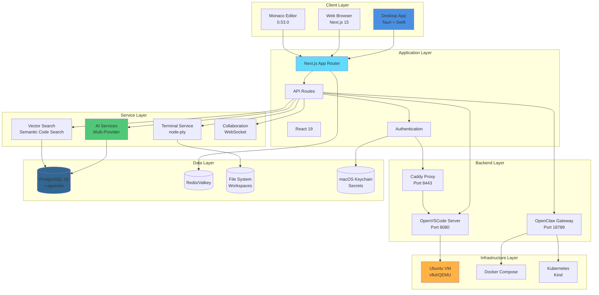
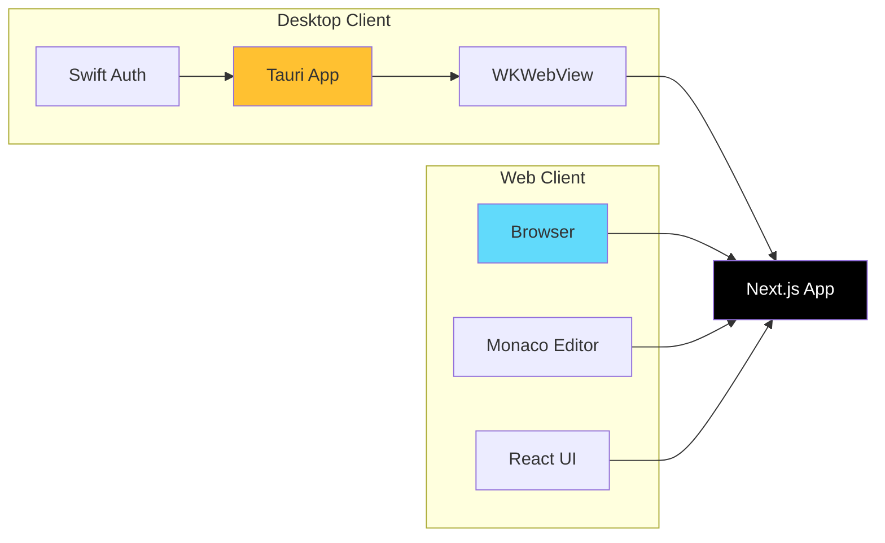
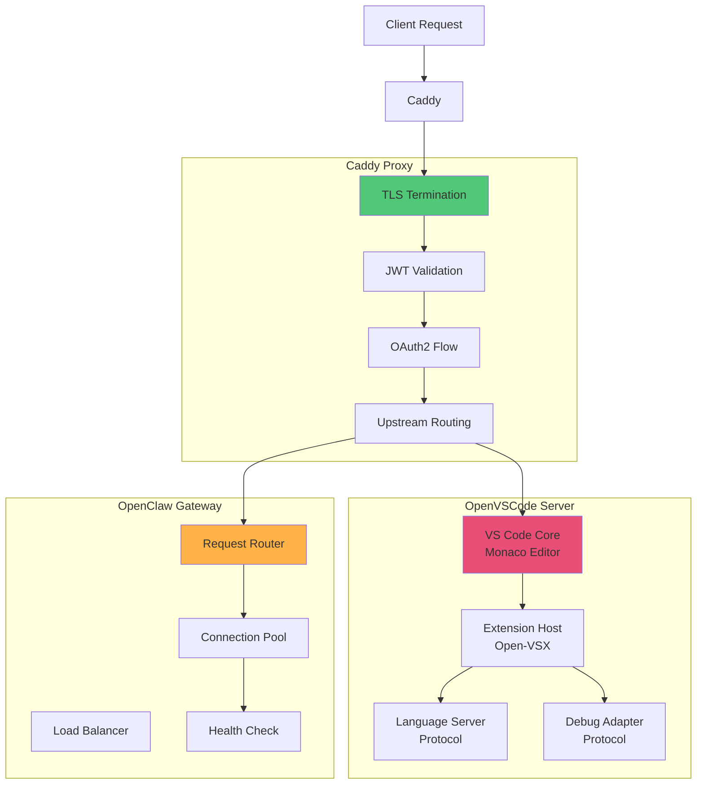
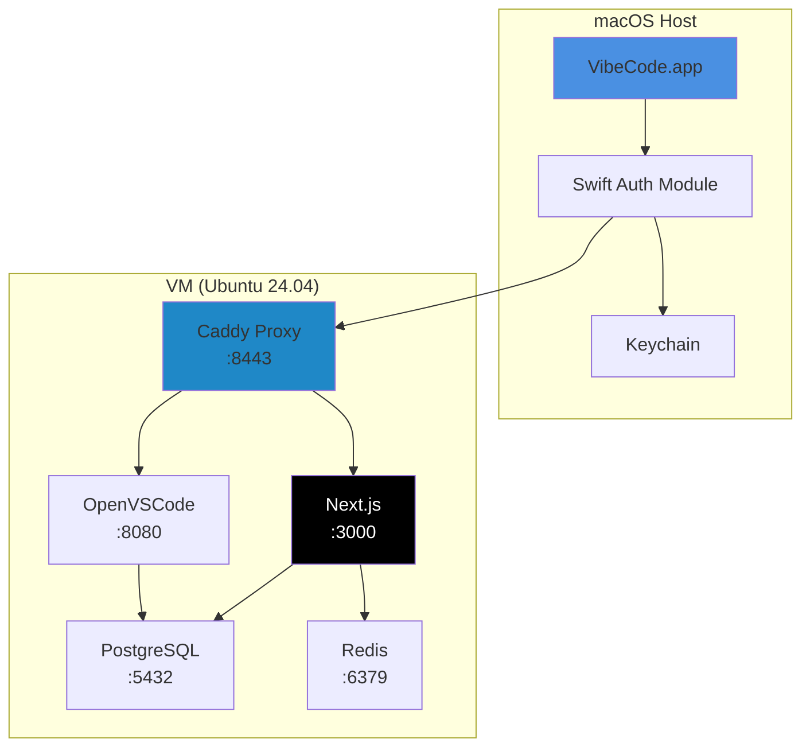
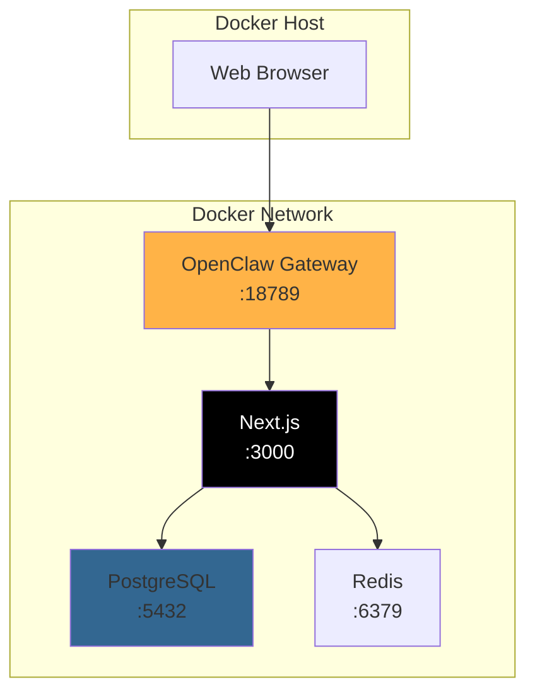
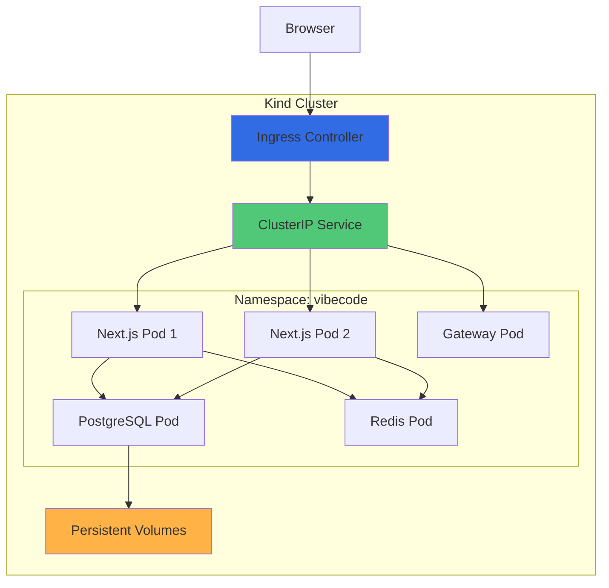
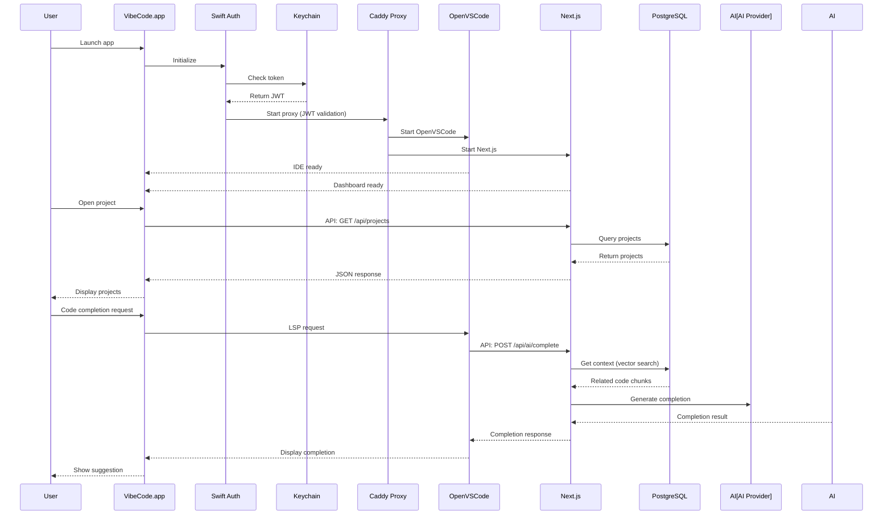
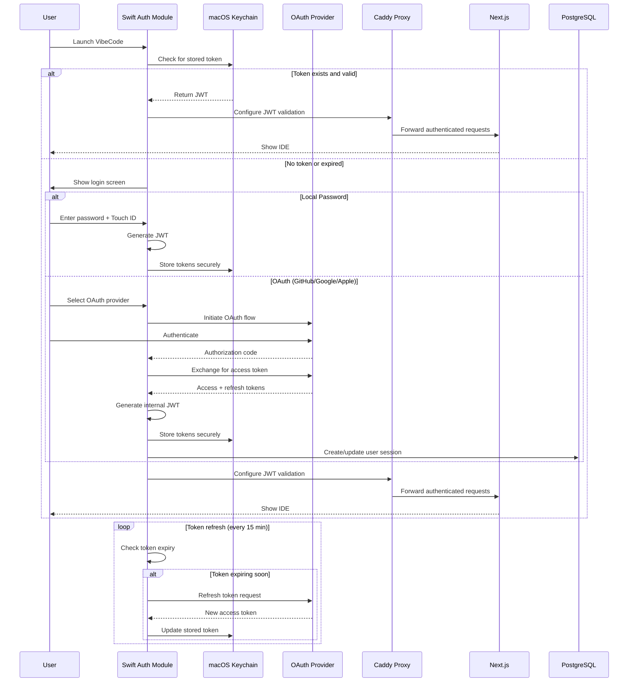
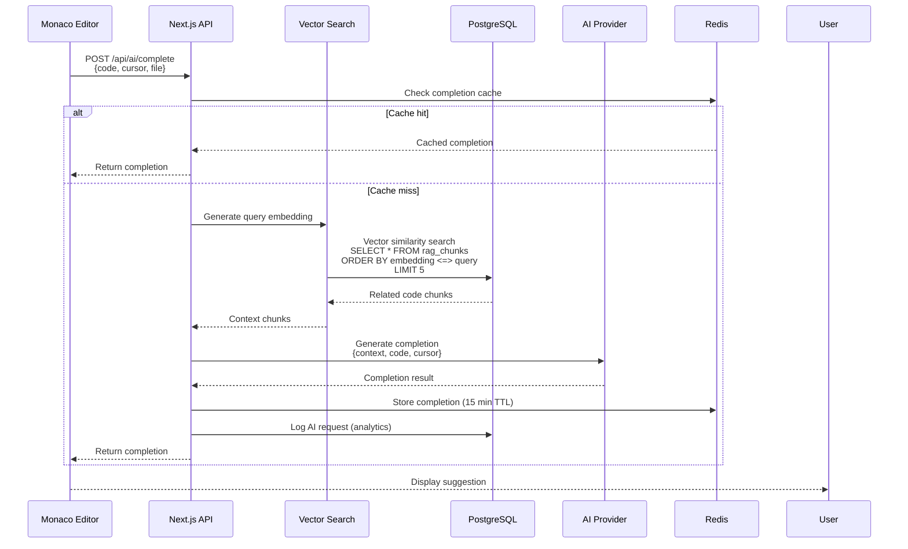

# VibeCode Architecture Overview

**Setup Documentation - Understanding the System**

This document provides an architecture overview for developers setting up VibeCode. It explains the system's components, how they interact, and what you need to understand for successful setup and development.

---

## Table of Contents

1. [System Architecture](#system-architecture)
2. [Component Layers](#component-layers)
3. [Deployment Architectures](#deployment-architectures)
4. [Data Flow](#data-flow)
5. [Technology Stack Summary](#technology-stack-summary)
6. [Setup Implications](#setup-implications)

---

## System Architecture

### High-Level Overview

VibeCode is a hybrid desktop/web application with multiple deployment options. The core architecture consists of layered components that work together to provide an AI-powered development environment.



---

## Component Layers

### 1. Client Layer

The client layer provides the user interface and can run in multiple modes:

**Desktop Mode (Recommended)**
- **Tauri Runtime**: Rust-based application framework
- **Swift Integration**: Native macOS features (Touch ID, Keychain)
- **WKWebView**: Renders the web UI with native performance

**Web Mode**
- **Next.js 15**: Modern React framework with App Router
- **Monaco Editor**: VS Code's editor component
- **React 19**: UI rendering with concurrent features



### 2. Application Layer

The application layer handles business logic and routing:

**Components:**
- **Next.js App Router**: File-based routing with server components
- **API Routes**: RESTful endpoints for services
- **Authentication**: JWT + OAuth2 with multiple providers
- **Middleware**: Request validation, rate limiting, security

**Key Patterns:**
- Server-side rendering (SSR) for initial load
- Client-side navigation for SPA experience
- API route handlers for backend operations
- Edge runtime for performance-critical paths

### 3. Service Layer

Services provide specialized functionality:

**AI Services**
```
Multi-Provider Support:
├── OpenAI (GPT-4, GPT-3.5)
├── Anthropic (Claude 3.5 Sonnet, Opus)
├── Google (Gemini Pro, Flash)
├── Groq (Llama 3.1, Mixtral)
└── DeepSeek (DeepSeek-V2)

Features:
├── Code completion (Monacopilot)
├── Chat assistance
├── Code explanation
├── Refactoring suggestions
└── Cost-aware routing
```

**Vector Search**
```
PostgreSQL + pgvector:
├── Embedding generation (OpenAI)
├── HNSW indexing
├── Semantic code search
├── RAG (Retrieval-Augmented Generation)
└── Context-aware completions
```

**Terminal Service**
```
node-pty Integration:
├── Web-based terminal
├── SSH connection support
├── Shell environment
├── Process management
└── PTY emulation
```

**Collaboration**
```
WebSocket-based:
├── Real-time editing
├── Cursor presence
├── Live share
├── Chat integration
└── Session management
```

### 4. Backend Layer

Backend services provide the core IDE and gateway functionality:



### 5. Infrastructure Layer

Infrastructure supports the runtime environment:

**VM Option (Ubuntu via vfkit)**
```
macOS Virtualization Framework:
├── vfkit VM provider
├── Ubuntu 24.04 LTS
├── Network bridge (host ↔ VM)
├── Shared file systems
└── Resource management
```

**Docker Option (Lightweight)**
```
Docker Compose:
├── PostgreSQL container
├── Redis/Valkey container
├── Next.js container
├── Gateway container
└── Network isolation
```

**Kubernetes Option (Production-like)**
```
Kind (Kubernetes in Docker):
├── Multi-node cluster
├── Ingress controller
├── Service mesh (optional)
├── Persistent volumes
└── Resource limits
```

### 6. Data Layer

Data storage and persistence:

```mermaid
graph TB
    subgraph "PostgreSQL 16"
        Users[Users Table]
        Projects[Projects Table]
        Workspaces[Workspaces Table]
        Vectors[rag_chunks Table<br/>vector(1536)]
        Sessions[Sessions Table]
    end

    subgraph "Redis/Valkey"
        SessionCache[Session Cache]
        QueryCache[Query Cache]
        RateLimit[Rate Limiting]
        PubSub[Pub/Sub Channel]
    end

    subgraph "File System"
        WorkspacesFS[~/.vibecode/workspaces/]
        Extensions[~/.vibecode/extensions/]
        Configs[~/.vibecode/config/]
        Logs[~/.vibecode/logs/]
    end

    subgraph "macOS Keychain"
        Tokens[JWT Tokens]
        Secrets[API Keys]
        Passwords[Encrypted Passwords]
    end

    App[Application] --> Users
    App --> Projects
    App --> Workspaces
    App --> Vectors
    App --> Sessions
    App --> SessionCache
    App --> QueryCache
    App --> RateLimit
    App --> PubSub
    App --> WorkspacesFS
    App --> Extensions
    App --> Configs
    App --> Logs
    App --> Tokens
    App --> Secrets
    App --> Passwords

    style Users fill:#336791
    style SessionCache fill:#DC382D
    style WorkspacesFS fill:#FFB347
    style Tokens fill:#50C878
```

---

## Deployment Architectures

### Desktop Mode (Recommended for Development)



**Characteristics:**
- Best native performance
- macOS integration (Touch ID, Keychain)
- VM isolation for backend
- Single-user focused
- Easiest to debug

### Docker Compose Mode



**Characteristics:**
- Lightweight and fast
- Easy to start/stop
- Container isolation
- Good for testing
- Multi-platform support

### Kubernetes Mode (Kind)



**Characteristics:**
- Production-like environment
- Horizontal scaling
- Service discovery
- Resource management
- Complex but powerful

---

## Data Flow

### Request Flow (Desktop Mode)



### Authentication Flow



### AI Code Completion Flow



---

## Technology Stack Summary

### Core Technologies

| Component | Technology | Version | Purpose |
|-----------|-----------|---------|---------|
| **Desktop** | Tauri | 2.x | Native desktop app framework |
| | Swift | 5.x | macOS native integration |
| **Frontend** | Next.js | 15.5.4 | React framework with App Router |
| | React | 19.1.1 | UI library |
| | TypeScript | 5.8.3 | Type safety |
| | Monaco Editor | 0.53.0 | Code editor component |
| **Backend** | Node.js | 18.18.0+ | JavaScript runtime |
| | OpenVSCode Server | Latest | Web-based IDE |
| | Caddy | 2.x | Reverse proxy |
| **Database** | PostgreSQL | 16 | Primary data store |
| | pgvector | Latest | Vector similarity search |
| | Prisma | 6.12.0 | ORM and migrations |
| **Cache** | Redis/Valkey | Latest | In-memory cache |
| | ioredis | 5.7.0 | Redis client |
| **AI/ML** | OpenAI | 4.104.0 | GPT models |
| | Anthropic | Latest | Claude models |
| | Langchain | 0.3.34 | AI orchestration |
| **VM** | vfkit | Latest | macOS Virtualization Framework |
| | QEMU | 8.x | Alternative VM provider |
| **Containers** | Docker | Latest | Containerization |
| | Kind | Latest | Kubernetes in Docker |

### Development Dependencies

```
Testing:
├── Jest (30.0.4) - Unit testing
├── Playwright (1.54.2) - E2E testing
├── Testcontainers (11.3.1) - Integration testing
└── React Testing Library - Component testing

Build Tools:
├── Turbo - Monorepo build system
├── esbuild - Fast bundler
├── SWC - Fast TypeScript compiler
└── PostCSS - CSS processing

Code Quality:
├── ESLint - Linting
├── Prettier - Formatting
├── TypeScript - Type checking
└── Husky - Git hooks
```

---

## Setup Implications

### What You Need to Understand

**For Desktop Development:**
1. **VM Setup**: Ubuntu VM via vfkit needs to be running
2. **Swift Build**: Desktop app requires Xcode and Swift toolchain
3. **Certificates**: Code signing for macOS distribution
4. **Keychain Access**: Requires appropriate entitlements

**For Web Development:**
1. **Database**: PostgreSQL with pgvector extension
2. **Node.js**: Version 18.18.0 or higher
3. **Environment**: `.env` file with required variables
4. **Dependencies**: All npm packages installed

**For Full-Stack Development:**
1. **All of the above** plus:
2. **Docker**: For containerized services
3. **Redis**: For caching layer
4. **AI API Keys**: For AI provider integration

### Key Configuration Files

```
VibeCode Configuration:
├── .env                          # Environment variables
├── .env.local                    # Local overrides
├── next.config.js                # Next.js configuration
├── tsconfig.json                 # TypeScript configuration
├── docker-compose.yml            # Docker services
├── prisma/schema.prisma          # Database schema
├── src-tauri/tauri.conf.json     # Tauri app config
└── platforms/macos/              # macOS-specific code
    ├── VibeCode/                 # Swift app
    └── VibeCodeMenubar/          # Menubar app
```

### Port Allocation

```
Standard Ports:
├── 3000  - Next.js development server
├── 8080  - OpenVSCode Server
├── 8443  - Caddy HTTPS proxy
├── 18789 - OpenClaw Gateway
├── 5432  - PostgreSQL
├── 6379  - Redis/Valkey
└── 9090  - Prometheus metrics (optional)
```

### Data Directories

```
~/.vibecode/
├── workspaces/               # User workspaces
├── extensions/               # VS Code extensions
├── config/                   # User configuration
│   ├── settings.json         # User settings
│   ├── keybindings.json      # Custom keybindings
│   └── snippets/             # Code snippets
├── logs/                     # Application logs
│   ├── app.log               # Main app log
│   ├── vscode.log            # VS Code log
│   └── vm.log                # VM log
├── cache/                    # Cached data
└── db/                       # SQLite databases (dev)
```

---

## Next Steps

After understanding this architecture:

1. **Choose Your Setup Path**:
   - [Desktop Setup](TAURI_DESKTOP_SETUP.md) - Recommended for development
   - [Docker Setup](DOCKER_COMPOSE_SETUP.md) - Lightweight alternative
   - [Kubernetes Setup](KIND_KUBERNETES_SETUP.md) - Production-like environment

2. **Review Specific Guides**:
   - [Getting Started](GETTING_STARTED.md) - Basic setup walkthrough
   - [Apple Virtualization](APPLE_VIRTUALIZATION_SETUP.md) - VM setup details
   - [Troubleshooting](TROUBLESHOOTING_GUIDE.md) - Common issues

3. **Explore the Codebase**:
   - [Full Architecture Docs](../ARCHITECTURE.md) - Comprehensive technical details
   - [Architecture Diagrams](../ARCHITECTURE_DIAGRAM.md) - Detailed flow diagrams
   - [API Documentation](../api/) - API reference

---

**For Questions or Issues:**
- Check the [Troubleshooting Guide](TROUBLESHOOTING_GUIDE.md)
- Review the [Full Architecture Documentation](../ARCHITECTURE.md)
- Open an issue on GitHub
