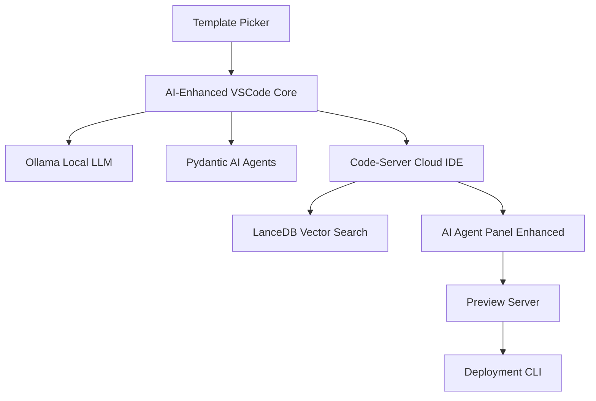

# 🏗️ GenAI Integration Architecture for VibeCode

**Based on:** Current VibeCode architecture diagram + License sweep findings  
**Goal:** Strategic integration of MIT/BSD GenAI libraries into existing flow

## 🎯 Current Architecture Analysis

```
Template Picker → VSCode Core → Code-Server (Cloud IDE) → Preview/Deployment
     ↓              ↓               ↓                        ↓
Marketplace    Extensions    AI Agent Panel           Observability
   APIs        Workflow      ChatGPT/Ollama          Datadog/Vector
```

## 🚀 Enhanced Architecture with GenAI Libraries

### **Phase 1: Core AI Infrastructure (Immediate)**



### **Component Enhancement Map**

#### 1. **Template Picker** → **AI-Powered Template Selection**
```typescript
// Integration: Pydantic AI + LanceDB
class AITemplatePicker {
  async suggestTemplates(description: string) {
    // Semantic search through template library
    const embeddings = await lanceDB.search(description);
    
    // AI agent validates and ranks suggestions
    const agent = new PydanticAgent('ollama:codellama');
    return agent.run({
      prompt: "Rank these templates for: " + description,
      templates: embeddings,
      resultType: TemplateRanking
    });
  }
}
```

#### 2. **VSCode Core** → **AI-Native Code Editor**
```typescript
// Integration: Ollama + Enhanced AI Client
class AICodeAssistant {
  constructor() {
    this.localLLM = new OllamaClient('http://localhost:11434');
    this.cloudLLM = new EnhancedAIClient(); // Fallback
  }

  async explainCode(codeSnippet: string) {
    try {
      // Try local first (privacy + speed)
      return await this.localLLM.generate({
        model: 'codellama',
        prompt: `Explain this code:\n${codeSnippet}`
      });
    } catch {
      // Fallback to cloud
      return await this.cloudLLM.generateText(codeSnippet);
    }
  }
}
```

#### 3. **AI Agent Panel** → **Multi-Agent Workflow System**
```python
# Integration: Pydantic AI + Langroid for complex workflows
from pydantic_ai import Agent
from langroid import ChatAgent, Task

class CodeGenerationWorkflow:
    def __init__(self):
        self.architect = Agent('ollama:codellama', system_prompt="You are a software architect")
        self.coder = Agent('ollama:codellama', system_prompt="You are a senior developer")
        self.reviewer = Agent('ollama:codellama', system_prompt="You are a code reviewer")
    
    async def generate_component(self, requirements: str):
        # Multi-agent workflow
        architecture = await self.architect.run(f"Design architecture for: {requirements}")
        code = await self.coder.run(f"Implement: {architecture.data}")
        review = await self.reviewer.run(f"Review this code: {code.data}")
        
        return ComponentResult(
            architecture=architecture.data,
            code=code.data,
            review=review.data
        )
```

#### 4. **Component Library** → **Semantic Component Discovery**
```typescript
// Integration: LanceDB + Radient for multi-modal search
class SemanticComponentLibrary {
  async findComponents(query: string, designImage?: File) {
    let searchVector;
    
    if (designImage) {
      // Multi-modal: image to component matching
      searchVector = await radient.imageVectorizer().vectorize(designImage);
    } else {
      // Text-based semantic search
      searchVector = await lanceDB.textSearch(query);
    }
    
    const components = await this.vectorDB.search(searchVector).limit(10);
    return components.map(c => ({
      name: c.name,
      code: c.code,
      similarity: c.similarity,
      preview: c.preview
    }));
  }
}
```

## 🔧 Integration Points by Library

### **Ollama (Apache 2.0)** - Local LLM Backbone
- **Where:** AI Agent Panel, Code explanation, Auto-complete
- **Benefit:** Privacy-first, offline capable, cost-effective
- **Implementation:**
```bash
# Docker integration
docker run -d -v ollama:/root/.ollama -p 11434:11434 ollama/ollama
docker exec -it ollama ollama pull codellama
```

### **Pydantic AI (MIT)** - Type-Safe Agent Framework  
- **Where:** AI Agent Panel, Project scaffolding, Code generation
- **Benefit:** Structured outputs, validation, enterprise-ready
- **Implementation:**
```python
# Type-safe project generation
class ProjectSpec(BaseModel):
    framework: Literal['react', 'vue', 'angular']
    components: List[ComponentSpec]
    dependencies: List[str]

agent = Agent('ollama:codellama', result_type=ProjectSpec)
project = agent.run_sync("Create a dashboard with charts and tables")
# Guaranteed valid ProjectSpec object
```

### **LanceDB (Apache 2.0)** - Vector Search Engine
- **Where:** Component Library, Code search, Template discovery
- **Benefit:** 100x faster vector ops, versioned embeddings
- **Implementation:**
```typescript
// Semantic code search across entire codebase
const db = await lancedb.connect('./vibecode-vectors');
const codeTable = db.openTable('code_embeddings');

const searchResults = await codeTable
  .search("authentication middleware")
  .limit(5)
  .toArray();
```

### **Radient (BSD-2-Clause)** - Multi-Modal Processing
- **Where:** Design-to-code, Image analysis, Multi-modal search
- **Benefit:** Images/audio/graphs → embeddings
- **Implementation:**
```python
from radient import image_vectorizer, text_vectorizer

# Convert design mockup to searchable embedding
image_vec = image_vectorizer().vectorize("./design-mockup.png")
text_vec = text_vectorizer().vectorize("user dashboard component")

# Find similar components across modalities
similar_components = vector_db.hybrid_search(image_vec, text_vec)
```

## 🏃‍♂️ Implementation Roadmap

### **Week 1-2: Foundation**
1. **Set up Ollama** in development environment
2. **Integrate Pydantic AI** for basic code generation
3. **Prototype LanceDB** for component search

### **Week 3-4: Core Features**
4. **Enhance AI Agent Panel** with local LLM support
5. **Add semantic search** to Component Library
6. **Implement fallback strategy** (local → cloud)

### **Week 5-8: Advanced Capabilities**
7. **Multi-modal support** with Radient
8. **Multi-agent workflows** for complex generation
9. **Performance optimization** and caching

### **Week 9-12: Production Ready**
10. **Enterprise deployment** options
11. **Advanced observability** integration
12. **Security hardening** and compliance

## 🎨 User Experience Enhancements

### **Before: Manual Template Selection**
```
User → Browse templates → Pick manually → Start coding
```

### **After: AI-Powered Development**
```
User → Describe what they want → AI suggests templates + components
     → Auto-generates scaffolding → AI assists with coding
     → Real-time code review → Deploy with AI optimizations
```

### **New Capabilities:**

1. **"Build me a dashboard with user analytics"**
   - AI understands requirements
   - Suggests relevant templates
   - Generates component structure
   - Provides implementation guidance

2. **Design Upload → Code**
   - User uploads Figma/Sketch design
   - Radient processes image
   - LanceDB finds similar components
   - Pydantic AI generates React code

3. **Semantic Code Search**
   - "Find all authentication components"
   - "Show me pagination examples"
   - "Components similar to this design"

## 🔒 Security & Privacy Architecture

### **Data Flow Security**
```
Sensitive Code → Local Ollama (never leaves machine)
Public Templates → Cloud AI (OpenAI/Anthropic) 
User Uploads → Local Processing → Encrypted Storage
```

### **Privacy Tiers:**
- **Tier 1:** Public code, templates → Cloud AI
- **Tier 2:** User projects → Local AI only  
- **Tier 3:** Enterprise code → Air-gapped local deployment

## 📊 Performance Considerations

### **Local vs Cloud Tradeoffs**

| Aspect | Local (Ollama) | Cloud (OpenAI) |
|--------|----------------|----------------|
| Privacy | ✅ Complete | ❌ Limited |
| Cost | ✅ Free after setup | ❌ Per-token |
| Speed | ⚡ 2-5s response | ⚡ 1-3s response |
| Quality | 🟡 Good for code | ✅ Excellent |
| Offline | ✅ Works offline | ❌ Requires internet |

### **Optimization Strategy:**
- **Hot path:** Common operations use local Ollama
- **Cold path:** Complex reasoning uses cloud APIs  
- **Hybrid:** Start local, escalate to cloud if needed

## 🚀 Competitive Advantages

### **vs GitHub Copilot:**
- ✅ **Privacy-first:** Code never leaves local environment
- ✅ **Cost-effective:** No per-seat licensing
- ✅ **Customizable:** Domain-specific model fine-tuning

### **vs Cursor/Windsurf:**
- ✅ **Multi-modal:** Design → Code capabilities
- ✅ **Semantic search:** Find components by meaning
- ✅ **End-to-end:** Template → Deploy workflow

### **vs Replit/CodeSandbox:**
- ✅ **Local deployment:** Run on-premise
- ✅ **Enterprise ready:** GDPR/SOC2 compliant
- ✅ **Extensible:** Plugin architecture

---

**Next Steps:** Start with Ollama + Pydantic AI integration in the AI Agent Panel, then progressively enhance each component with semantic capabilities. All libraries chosen have enterprise-friendly licenses and production-proven track records. 