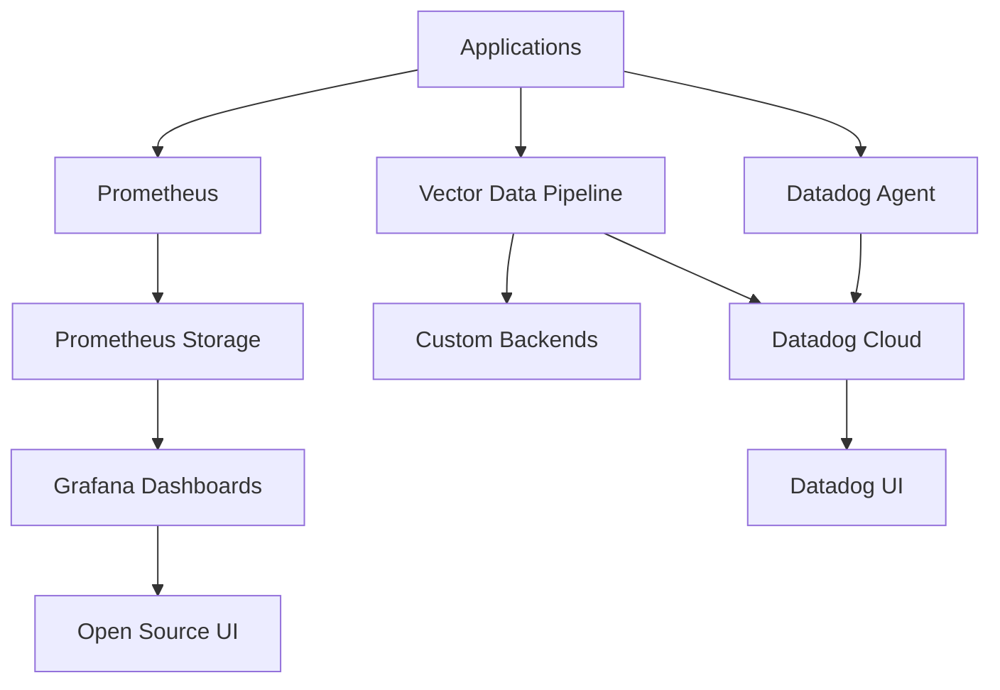

VibeCode supports multiple observability platforms to accommodate different licensing and infrastructure requirements. Our **hybrid approach** provides enterprise features while maintaining vendor independence.

## Architecture Overview

The platform deploys a **three-tier monitoring stack** that works together seamlessly:



## Primary Stack: Datadog + Prometheus + Vector Hybrid

### Components

- **Datadog Agent + Cluster Agent**: Full-featured SaaS platform (commercial license)
- **Prometheus**: Open source metrics collection (Apache 2.0 license)  
- **Vector**: High-performance log/metrics router (MPL-2.0 license, by Datadog)

### Benefits

- ✅ **Enterprise Features**: Advanced alerting, APM, synthetic monitoring
- ✅ **Vendor Independence**: Prometheus provides backup metrics collection
- ✅ **High Performance**: Vector handles high-throughput data routing
- ✅ **Cost Optimization**: Use open source for development, commercial for production
- ✅ **Future Flexibility**: Easy migration between platforms

## Alternative Options

### OpenTelemetry Collector
- **License**: Apache 2.0 (permissive open source)
- **Use Case**: Vendor-neutral telemetry collection
- **Benefits**: CNCF standard, works with any backend

### Grafana
- **License**: AGPL v3 (open source with copyleft)
- **Use Case**: Visualization layer for Prometheus data
- **Benefits**: Rich dashboards, alerting, plugin ecosystem

### Full Open Source Stack
Combine **Prometheus + OpenTelemetry + Vector + Grafana** for a completely open source monitoring solution.

## Security Analysis

### Kubehound
- **Purpose**: Kubernetes attack path analysis
- **License**: Open source (by Datadog)
- **Use Case**: Identify security vulnerabilities in cluster configuration

## Deployment

Deploy the hybrid monitoring stack:

```bash
# Source environment variables
source .env.local

# Deploy to Kubernetes
./scripts/deploy-monitoring.sh -m kubernetes -d "$DATADOG_API_KEY"

# Or deploy with Docker Compose
./scripts/deploy-monitoring.sh -d "$DATADOG_API_KEY"
```

## Next Steps

- [Datadog Setup](/monitoring/datadog/) - Configure enterprise monitoring
- [Prometheus Configuration](/monitoring/prometheus/) - Set up open source metrics
- [Vector Pipeline](/monitoring/vector/) - Configure data routing
- [OpenTelemetry Integration](/monitoring/opentelemetry/) - Add vendor-neutral telemetry