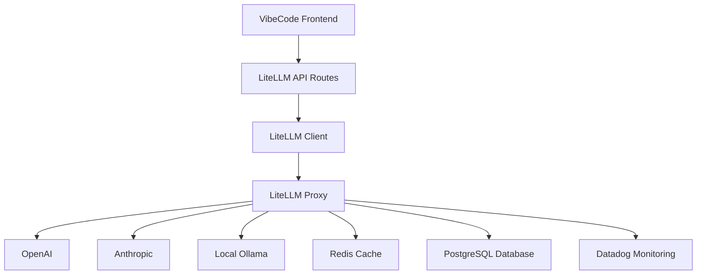

# 🤖 LiteLLM Integration for VibeCode

**Enterprise-grade unified AI model gateway with comprehensive monitoring and cost tracking**

## 🎯 Overview

LiteLLM integration provides VibeCode with a unified API gateway to access multiple AI providers including OpenAI, Anthropic, and local Ollama models. It includes cost tracking, rate limiting, caching, and comprehensive Datadog monitoring.

## 🏗️ Architecture



## 📦 Components

### Infrastructure
- **`docker-compose.litellm.yml`** - Complete containerized stack
- **`litellm/config.yaml`** - Multi-provider model configuration
- **`litellm/init-litellm-db.sql`** - Database initialization
- **`monitoring/datadog/conf.d/litellm.d/conf.yaml`** - Monitoring setup

### Backend Integration
- **`src/lib/ai-clients/litellm-client.ts`** - TypeScript client library
- **`src/app/api/ai/litellm/route.ts`** - REST API endpoints
- **`src/components/ai/LiteLLMInterface.tsx`** - Management dashboard

## 🚀 Quick Start

### 1. Environment Setup

```bash
# Required environment variables
export OPENAI_API_KEY="your-openai-key"
export ANTHROPIC_API_KEY="your-anthropic-key"
export LITELLM_MASTER_KEY="sk-vibecode-master-key-12345"
export DD_API_KEY="your-datadog-key"

# Optional for local Ollama
export OLLAMA_BASE_URL="http://localhost:11434"
```

### 2. Deploy the Stack

```bash
# Start all services
docker-compose -f docker-compose.litellm.yml up -d

# Check service health
docker-compose -f docker-compose.litellm.yml ps
```

### 3. Verify Installation

```bash
# Test LiteLLM proxy health
curl http://localhost:4000/health

# Test VibeCode API integration
curl http://localhost:3000/api/ai/litellm?action=health
```

## 🔧 Configuration

### Model Configuration

The `litellm/config.yaml` file defines available models and their settings:

```yaml
model_list:
  - model_name: gpt-4o
    litellm_params:
      model: openai/gpt-4o
      api_key: os.environ/OPENAI_API_KEY
      max_tokens: 128000
      temperature: 0.7
      input_cost_per_token: 0.0000025
      output_cost_per_token: 0.00001

  - model_name: claude-3.5-sonnet
    litellm_params:
      model: anthropic/claude-3-5-sonnet-20241022
      api_key: os.environ/ANTHROPIC_API_KEY
      max_tokens: 200000
      temperature: 0.7
```

### Model Groups & Load Balancing

```yaml
model_groups:
  - group_name: production-chat
    models:
      - model_name: gpt-4o
        weight: 0.4
      - model_name: claude-3.5-sonnet
        weight: 0.4
      - model_name: gpt-4o-mini
        weight: 0.2
```

### Budget & Rate Limiting

```yaml
budgets:
  max_budget: 1000.0  # USD per month
  budget_duration: "30d"
  soft_budget_limit: 800.0

rate_limit:
  rpm: 10000  # requests per minute
  tpm: 2000000  # tokens per minute
  max_parallel_requests: 100
```

## 🔌 API Usage

### Chat Completions

```typescript
// Via VibeCode API
const response = await fetch('/api/ai/litellm', {
  method: 'POST',
  headers: { 'Content-Type': 'application/json' },
  body: JSON.stringify({
    action: 'chat',
    model: 'gpt-4o-mini',
    messages: [
      { role: 'user', content: 'Hello, how are you?' }
    ],
    temperature: 0.7,
    max_tokens: 1000
  })
});

const data = await response.json();
console.log(data.choices[0].message.content);
```

### Streaming Chat

```typescript
const response = await fetch('/api/ai/litellm', {
  method: 'POST',
  headers: { 'Content-Type': 'application/json' },
  body: JSON.stringify({
    action: 'stream',
    model: 'claude-3.5-sonnet',
    messages: [
      { role: 'user', content: 'Write a short story' }
    ]
  })
});

const reader = response.body?.getReader();
// Handle streaming chunks...
```

### Embeddings

```typescript
const response = await fetch('/api/ai/litellm', {
  method: 'POST',
  headers: { 'Content-Type': 'application/json' },
  body: JSON.stringify({
    action: 'embedding',
    model: 'text-embedding-3-small',
    input: 'Text to embed'
  })
});

const data = await response.json();
console.log(data.data[0].embedding);
```

## 🎛️ Management Interface

Access the LiteLLM management dashboard at `/ai/litellm` in VibeCode:

### Features
- **📊 Overview Dashboard** - Real-time metrics and health status
- **🤖 Model Management** - Available models and their capabilities
- **📈 Analytics** - Usage statistics, cost tracking, and budget monitoring
- **🧪 Testing Interface** - Interactive model testing and comparison

### Key Metrics
- Request volume and latency
- Cost tracking per model/user
- Cache hit ratios
- Error rates and availability
- Budget utilization

## 🔍 Monitoring

### Datadog Integration

LiteLLM automatically sends metrics to Datadog:

```yaml
# Key metrics tracked:
- litellm.requests_total
- litellm.cost_usd_total
- litellm.model_latency_seconds
- litellm.cache_hit_ratio
- litellm.budget_remaining_usd
```

### Health Checks

```bash
# LiteLLM proxy health
curl http://localhost:4000/health

# VibeCode integration health
curl http://localhost:3000/api/ai/litellm?action=health

# Individual service health
curl http://localhost:4000/models
curl http://localhost:4000/metrics  # Prometheus metrics
```

## 💰 Cost Management

### Budget Monitoring

```typescript
// Get current budget status
const budget = await fetch('/api/ai/litellm?action=budget')
  .then(r => r.json());

console.log(`Remaining: $${budget.remaining_budget}`);
console.log(`Spend today: $${budget.spend_today}`);
```

### Cost Per Request

All responses include cost information:

```json
{
  "choices": [...],
  "usage": {
    "prompt_tokens": 10,
    "completion_tokens": 20,
    "total_tokens": 30
  },
  "cost": {
    "input_cost": 0.000025,
    "output_cost": 0.0002,
    "total_cost": 0.000225
  }
}
```

## 🔒 Security

### API Key Management
- Master key for proxy access: `LITELLM_MASTER_KEY`
- Provider keys stored securely in environment variables
- Rate limiting per user/session
- Request logging with PII masking

### Access Control
- Authentication required for all endpoints
- User session tracking and rate limiting
- Audit logging for all requests

## 🚨 Troubleshooting

### Common Issues

#### 1. Service Not Starting
```bash
# Check Docker services
docker-compose -f docker-compose.litellm.yml logs litellm-proxy

# Verify environment variables
docker-compose -f docker-compose.litellm.yml exec litellm-proxy env | grep API_KEY
```

#### 2. Model Access Issues
```bash
# Test direct model access
curl -X POST http://localhost:4000/chat/completions \
  -H "Authorization: Bearer $LITELLM_MASTER_KEY" \
  -H "Content-Type: application/json" \
  -d '{"model": "gpt-4o-mini", "messages": [{"role": "user", "content": "test"}]}'
```

#### 3. High Costs
- Check budget alerts in Datadog
- Review model usage patterns in analytics
- Consider switching to cheaper models for development

#### 4. Performance Issues
- Monitor cache hit ratios
- Check Redis connectivity
- Review request queuing metrics

### Debug Mode

Enable debug logging:

```bash
# Set environment variable
LITELLM_LOG_LEVEL=DEBUG

# Or update config.yaml
logs:
  level: "DEBUG"
  log_raw_request_response: true
```

## 📈 Performance Optimization

### Caching Strategy
- Redis caching with 1-hour TTL
- Similarity-based response caching
- Embedding result caching

### Load Balancing
- Automatic provider failover
- Model group routing
- Least-busy routing strategy

### Cost Optimization
- Automatic model selection based on cost
- Budget-aware routing
- Usage analytics for optimization

## 🔄 Updates & Maintenance

### Updating Configuration
```bash
# Modify litellm/config.yaml
# Restart proxy service
docker-compose -f docker-compose.litellm.yml restart litellm-proxy
```

### Scaling
```bash
# Scale proxy instances
docker-compose -f docker-compose.litellm.yml up -d --scale litellm-proxy=3
```

### Backup
```bash
# Backup database
docker-compose -f docker-compose.litellm.yml exec litellm-postgres pg_dump -U litellm litellm > litellm_backup.sql

# Backup configuration
cp litellm/config.yaml litellm/config.yaml.backup
```

## 🆘 Support

### Logs Location
- **LiteLLM Proxy**: `docker logs litellm-proxy`
- **Database**: `docker logs litellm-postgres`
- **Redis**: `docker logs litellm-redis`
- **Datadog Agent**: `docker logs litellm-datadog-agent`

### Useful Commands
```bash
# View all services
docker-compose -f docker-compose.litellm.yml ps

# Follow logs
docker-compose -f docker-compose.litellm.yml logs -f

# Reset everything
docker-compose -f docker-compose.litellm.yml down -v
docker-compose -f docker-compose.litellm.yml up -d
```

## 📚 Additional Resources

- **LiteLLM Documentation**: https://docs.litellm.ai/
- **Datadog Integration**: https://docs.datadoghq.com/integrations/litellm/
- **OpenAI API Reference**: https://platform.openai.com/docs/api-reference
- **Anthropic API Reference**: https://docs.anthropic.com/claude/reference/

---

**Need help?** Check the VibeCode documentation or create an issue in the repository. 